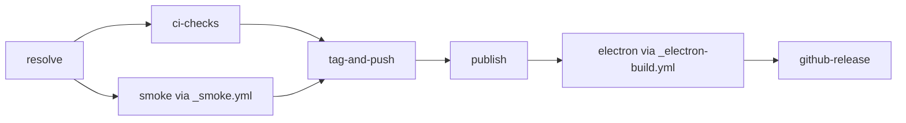

# Release Pipeline: `publish.yml`

`publish.yml` gates public release mutation behind tests and standalone installation smoke.



## Entry paths

- **Tag push:** `resolve` reads the `v*` tag. `tag-and-push` is skipped. `publish.if` accepts the skip only when `ci-checks` and `smoke` pass.
- **Manual dispatch:** `resolve` validates the version input. After both gates pass, `tag-and-push` updates workspace versions and cross-package ranges, regenerates and verifies the lockfile, promotes the changelog, commits, tags, and pushes.

## Jobs

### `resolve`

Computes `version`, `tag`, prerelease state, and the exact ref. It has no release side effects.

### `ci-checks`

Runs install, lint, full tests, and build on Node 22. A failure prevents tagging and publishing.

### `smoke`

Calls `_smoke.yml` against the resolved ref. The reusable workflow runs the standalone installation matrix without public release mutation.

### `tag-and-push`

Runs only for manual dispatch after both gates pass. It creates the release commit and tag. Tag-push entry skips this job.

### `publish`

Needs `resolve`, `ci-checks`, `smoke`, and `tag-and-push`. It accepts `tag-and-push` as `success` for dispatch or `skipped` for tag push. Packages publish in dependency order; already-published versions are skipped.

### `electron`

Needs `[resolve, publish]` and calls `_electron-build.yml`. Do not remove the publish dependency: the bundled server installs the just-published `@blackbelt-technology/*` packages.

#### `_electron-build.yml` inputs

| Input | Meaning |
|---|---|
| `version` | SemVer string applied to every workspace |
| `ref` | Exact Git ref to check out |
| `legs` | `all`; one platform (`darwin`, `linux`, `win32`); or a comma-list such as `darwin-arm64,linux-x64` |
| `source_only_bundle` | When `true`, pass `--source-only` to `bundle-server.mjs`, skip host-side `npm install`, and resolve `@blackbelt-technology/*` from workspace source. This supports unpublished dev versions. Current release and on-demand installer callers use `false` to produce runnable bundles. |
| `artifact_retention_days` | Artifact retention; normally 14 for CI and 90 for release |
| `artifact_name_suffix` | Optional suffix, commonly a short SHA for CI traceability |
| `registry_url` | Optional loopback Verdaccio URL for the nightly publish-install-bundle round-trip |

### `github-release`

Needs the completed publish and Electron artifacts, then creates the GitHub Release.

## Common failures

| Literal symptom | Job | Cause | Action |
|---|---|---|---|
| `CHANGELOG.md already contains a section for X.Y.Z` | `tag-and-push` | Version was already promoted | Choose a new version or revert the prior release commit |
| `Could not find '## [Unreleased]' heading` | `tag-and-push` | Changelog structure is incomplete | Restore the `## [Unreleased]` heading |
| `verify-lockfile-versions.mjs` exits non-zero | `tag-and-push` | Workspace versions and cross-package ranges differ | Run `scripts/sync-versions.js`, regenerate the lockfile, and verify again |
| `git push` fails | `tag-and-push` | Branch protection or token permissions reject the release commit/tag | Repair the workflow's push authority; do not bypass the gate |
| npm publish returns `403` | `publish` | OIDC trusted publisher is not configured | Repair the npm trusted-publisher configuration |
| npm publish returns `409 Conflict` | `publish` | The version already exists | Confirm the idempotency check; otherwise select a new version |
| `Cannot find module @blackbelt-technology/...` | `electron` | Publish failed or dependency ordering changed | Restore `electron.needs: [resolve, publish]`; never bypass publish |
| Missing node-pty or other native prebuild triple | `electron` | Required platform artifact is absent | Repair the native dependency/prebuild set before release |
| DMG signing fails | `electron` | Apple certificate or signing secret is invalid | Renew the certificate or secret, then rerun the affected leg |
| Linux maker or Docker build fails | `electron` | Linux packaging or `Dockerfile.build` regressed | Reproduce with `packages/electron/scripts/docker-make.sh` |
| `builder-debug.yml` asset basename collision or release upload `404` | `github-release` | Several matrix legs produced the same debug filename | Preserve or expand the `Drop builder-debug logs (avoid asset basename collision)` step in `publish.yml` |
| Release notes are empty | `github-release` | The versioned changelog section is missing or malformed | Repair the changelog section created by `tag-and-push` |
| Release asset already exists | `github-release` | Tag/release state was reused | Inspect the existing release; do not overwrite blindly |

## After the release

`sync-release-version.yml` updates `site/src/data/latest-release.json`, then `deploy-site.yml` redeploys. If the site is not updated within about five minutes, inspect those two workflows in that order.

## Recovery

```bash
# Re-run only failed jobs and preserve successful jobs.
gh run rerun <run-id> --failed

# Cancel a stuck run.
gh run cancel <run-id>
```

For a fully broken release, use the `release-revoke` skill. **Do not bypass the pipeline with a manual `npm publish`.** That loses OIDC trusted publishing, lockfile synchronization, changelog promotion, smoke gates, and Electron dependency ordering.

Current job details and invariants live in `.github/workflows/AGENTS.md` and `packages/shared/src/__tests__/publish-workflow-contract.test.ts`.
