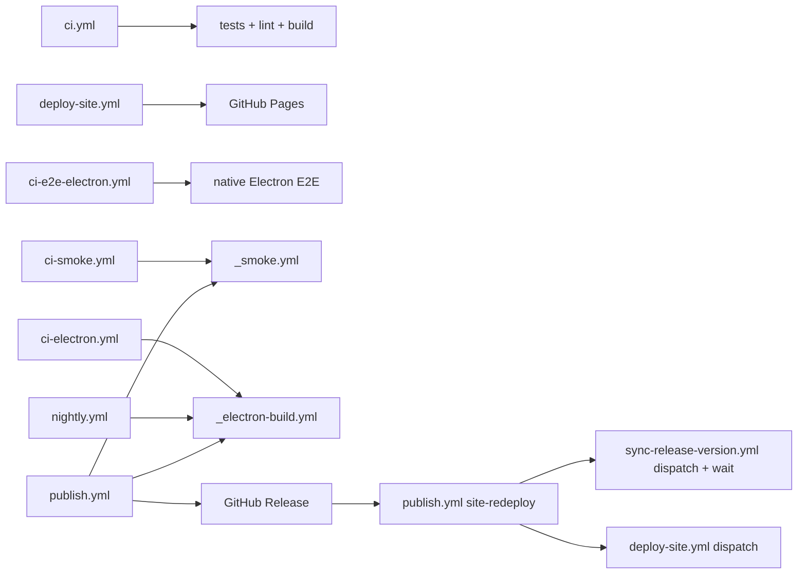

# Workflow Taxonomy

`.github/workflows/` contains 10 workflow files: 8 entry workflows and 2 reusable workflows.

## Entry workflows

| Workflow | Trigger | Purpose | Mutates releases? |
|---|---|---|---|
| `ci.yml` | Push and pull request to `develop` | Node 22 lint, type checks, tests, and build | No |
| `deploy-site.yml` | `site/**`/`packages/shell/**` push to develop, manual dispatch (release redeploy arrives via `publish.yml` `site-redeploy` dispatch — a `release:` trigger can never start a run) | Build and deploy GitHub Pages (site + shell at `/app/`) | Site only |
| `ci-e2e-electron.yml` | Path-filtered pull request, manual | Native Electron Playwright checks on Linux and Windows | No |
| `ci-electron.yml` | Manual | Build selected Electron installer matrix legs | No |
| `ci-smoke.yml` | Manual | Run the standalone installation smoke matrix | No |
| `nightly.yml` | Manual; schedule currently disabled | Full-fidelity Verdaccio and Electron round-trip | No public release mutation |
| `publish.yml` | `v*` tag or manual version dispatch | Gate, tag when dispatched, publish npm packages, build Electron, create GitHub Release | Yes |
| `sync-release-version.yml` | Release published or edited, manual | Write release metadata to the site and push `develop` | Site metadata commit |

## Reusable workflows

| Workflow | Called by | Purpose |
|---|---|---|
| `_smoke.yml` | `ci-smoke.yml`, `publish.yml` | Seven-leg standalone installation smoke matrix |
| `_electron-build.yml` | `ci-electron.yml`, `nightly.yml`, `publish.yml` | Six-leg Electron build matrix |

## Dependency graph

## Safety boundaries

- `_smoke.yml`, `_electron-build.yml`, `ci-smoke.yml`, `ci-electron.yml`, `ci-e2e-electron.yml`, and `nightly.yml` do not publish to public npm or create a GitHub Release.
- `publish.yml` is the only public release orchestrator.
- `deploy-site.yml` and `sync-release-version.yml` mutate only site deployment or release metadata.
- Current per-file contracts live in `.github/workflows/AGENTS.md`; consult it when a workflow changes.
