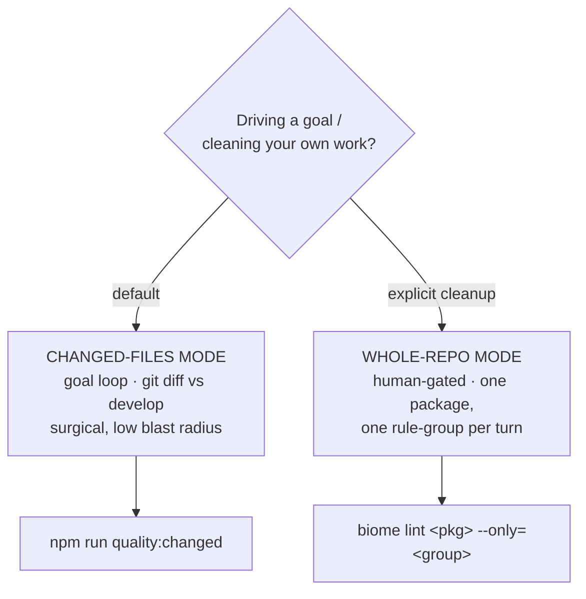

# Code Quality (Biome)

Analyze → fix → test, drivable by the goal-plugin's judge loop. The skill is the
**HOW**; the goal is the **WHEN-TO-STOP** (judge reads one exit code).

## Pick the mode



When unsure, use **changed-files mode**. Never turn whole-repo autofix loose
inside a goal loop.

## The oracle (what the judge reads)

One command, one exit code:

```bash
npm run quality:changed
# = biome check --changed --error-on-warnings --write  (safe-fix the diff)
#   && tsc --noEmit                                     (type gate)
#   && npm test                                         (test gate)
```

- exit 0 → Biome clean (warn+error) on changed files, types compile, tests green
  → **goal achieved**.
- non-zero → fix the reported issues, run again. The judge says **continue**.

`--changed` compares the **committed** branch state against `develop` (the repo's
integration branch, set as `vcs.defaultBranch` in `biome.json`). Uncommitted or
untracked files are NOT scoped by `--changed` — commit your work first, or pass an
explicit path.

## Procedure (every turn)

```
1. ANALYZE
   npm run quality:changed        # or: biome lint . --reporter=json (whole-repo)
   Read the JSON. Group issues: safe-fixable vs unsafe vs manual.

2. FIX  (surgical — only files in the diff)
   - Safe fixes are already applied by `--write`. Confirm they're sane.
   - Type errors + unsafe-rule + manual issues: edit by hand, minimally.
   - DO NOT run `--unsafe` in the loop. Surface unsafe fixes as a report.
   - DO NOT touch files outside the diff (AGENTS.md surgical rule).

3. TEST  (the gate)
   tsc --noEmit && npm test
   - Red? REVERT this fix batch. Never stack broken autofixes.
   - Green + 0 issues on scope? Done. Else loop.
```

## Safe vs unsafe fixes (Biome 2.x)

`biome check --write` applies **safe** fixes only. Some of this repo's enabled
rules are **unsafe** and need a human (or `--unsafe`, never in a loop):

- Safe (auto-applied by `--write`): `useConst`, `useImportType`, `noUnusedImports`.
- Unsafe (surfaced as a report, fix by hand): `useTemplate`, `useOptionalChain`,
  `noUnusedVariables` (and any rule Biome marks `FIXABLE` but doesn't apply under
  plain `--write`).

If `--write` reports a warning as `FIXABLE` yet leaves it, the fix is unsafe.
Apply it manually with judgment; do not blanket `--unsafe`.

## Guardrails (non-negotiable)

1. **Scope** — changed-files by default (`--changed`). Whole-repo only when
   explicitly asked, and then scoped to one package + one rule-group per turn.
2. **Test gate** — `tsc --noEmit` + `npm test` after every fix batch; revert on red.
3. **Safe-first** — auto-apply safe fixes only; unsafe + manual → reported, not
   auto-applied in a loop.
4. **No scope creep** — never "improve" files outside the diff.

## Whole-file-on-touch (the rough edge)

Biome lints whole files, not diff lines. Touch one line in a legacy file → all
its warn-tier issues surface. Default policy: **grandfather** — fix only the
diff, `// biome-ignore` unavoidable legacy lines, leave the rest. Do NOT rewrite
a whole legacy file to chase warnings (violates surgical rule) unless the user
asks for boy-scout cleanup.

## Set it as a goal

Daily driver (changed files):
```
/goal "Use the code-quality skill in changed-files mode. Done when
       `npm run quality:changed` exits 0. Pause and report if a fix needs a
       non-mechanical judgment call. Never edit files outside the diff."
```

Scoped cleanup (one package):
```
/goal "Use the code-quality skill, whole-repo mode, scoped to <pkg>. Drive
       `biome lint <pkg> --only=<group>` to 0 while keeping tests green. One
       rule-group per turn; stop after each so I can review the diff."
```

## The ratchet (why warnings don't always block)

Severity = gate strength. `warn` shows but exits 0 (soft); `error` exits
non-zero (hard). CI runs plain `biome lint .` → only `error`-tier blocks. The
goal loop adds `--error-on-warnings` → warn+error both block on YOUR files. So
legacy warn-tier noise never fails CI, but new/touched code is held to the full
bar. See `docs/code-quality.md` for the tier ladder + graduation rules.

## Commands cheat-sheet

```bash
npm run quality:changed   # the oracle: fix diff + tsc + test (goal loop)
npm run fix:changed       # safe-fix the diff only, no test gate
npm run lint:biome        # analyze whole repo (no fixes)
npm run quality:report    # whole-repo GitHub-annotation report (advisory)
biome lint <path> --only=<group>/<rule> --reporter=json   # targeted cleanup
```
