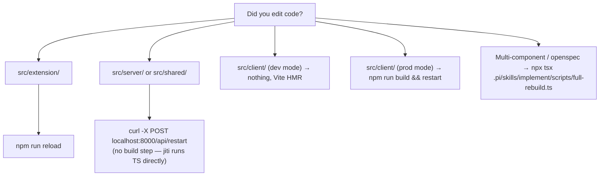

# Implement

Two halves: **how to write the change** (discipline) and **how to land it in the running system** (rebuild + restart).

The skill exists because both halves are easy to get wrong:
- Agents over-engineer simple changes when they're not anchored.
- Agents rebuild the wrong component (or worse, all components when they didn't need to) after editing files.

## Quick decision tree



Quick check current mode:
```bash
npx tsx .pi/skills/implement/scripts/check-mode.ts    # prints "dev" or "production"
```

Restart server (preserves mode unless overridden):
```bash
npx tsx .pi/skills/implement/scripts/restart-server.ts          # graceful restart, keeps mode
npx tsx .pi/skills/implement/scripts/restart-server.ts --dev    # force dev mode
npx tsx .pi/skills/implement/scripts/restart-server.ts --prod   # force production mode
```

Full rebuild (after `openspec-apply` or multi-component change):
```bash
npx tsx .pi/skills/implement/scripts/full-rebuild.ts
```

> `full-rebuild.ts` **deploys the checked-out dev version to the local running instance** (build + restart + reload). It is NOT a feature-implementation step — worktree / Docker-isolated feature work does not run it. The code-review gate is separate (below).
>
> **Do NOT run `full-rebuild.ts` against a systemd-hosted dashboard.** Its step 2 is `POST /api/restart`; under a `systemd --user` unit with the default `KillMode=control-group` and `Restart=on-failure`, the clean exit is not revived by systemd and the cgroup teardown kills sibling pi sessions/keepers (confirmed: change `fix-reliable-live-control-events`). Restart a systemd-hosted instance with `systemctl --user restart pi-agent-dashboard.service` (verify `systemctl --user is-active` + `/api/health`), then `npm run reload` separately. Check `systemctl --user is-active pi-agent-dashboard.service` before choosing the restart path.
>
> Scripts are TypeScript (cross-platform). All invocations use `npx tsx` so they work identically on Linux, macOS, and Windows. `tsx` is already a project dep.

Full matrix with edge cases (dev-mode fallback, fault-tolerant restart, single-restart-path rule) lives in [`references/rebuild-matrix.md`](references/rebuild-matrix.md).

## Review — two tiers (inner loop vs ship gate)

Review is split by moment. The inner loop runs on an **unlimited** engine every non-trivial change; the rate-limited cloud gate is **reserved for the PR**.

**Inner loop (during dev, before commit) — `review-code` discipline.** After writing a non-trivial change, review the diff with the **`review-code`** skill (eng-disciplines): engine-agnostic — inspect design→correctness→complexity→tests→naming→security, emit labelled findings, fix `issue(blocking)` surgically, re-review until no blocking finding remains, then commit. Runs on a model engine — no cloud quota spent, so run it freely per change.

**Ship gate (opt-in, PR-time) — CodeRabbit.** Reserved for the pull request so its quota is unspent during dev. **Worktree-safe and server-independent** — no build, no restart:

```bash
RUN_CR_REVIEW=1 npx tsx .pi/skills/implement/scripts/review-changes.ts   # opt in (uncommitted)
npx tsx .pi/skills/implement/scripts/review-changes.ts --ship -t committed --base main
npx tsx .pi/skills/implement/scripts/review-changes.ts                   # default: skips → use review-code
```

**Warn-and-continue, never blocks**: CodeRabbit is cloud rate-limited; on limit / missing CLI / auth failure it prints "deferred to a later cycle" and exits 0. Fix Critical/Warning findings, then commit. See the **`code-review`** skill for the CodeRabbit severity triage + fix loop.

> openspec-apply: the `review-code` inner-loop pass runs after each task's code is written; the CodeRabbit gate is opt-in at ship (ship-change owns the PR-time review). Both run in the worktree without touching the main server.

## Subagent checkpoints (apply loop) — offload read/write-light work, keep the builder inline

The builder (this loop) owns all decisions and code writes — coherence stays in one context. Spawn a subagent (explicit `Agent` call) only at these signals, to keep the main context sharp:

| Signal in the task / diff | Spawn | Why isolated |
|---|---|---|
| touches auth, secrets, PII, untrusted input, webhooks, or a latency/throughput budget | `Audit` | deep read-only risk pass → findings; fix inline |
| contextFiles list is large (many files / big) | `Explore` | distill the spec; else read directly for coherence |
| a change landed and `docs/` prose needs updating | `DocScribe` | Rule-6 docs-delegation; caveman-style writes |

Review stays a **skill** (`review-code`), not a subagent — review+fix is coherence-critical and wants full context. Tests: run+capture inline (tee→grep); root-cause via `systematic-debugging` inline. Full rationale: `docs/skills-as-subagents.md`.

## The discipline — write less code, write the right code

The full code-discipline reference lives in [`references/code-discipline.md`](references/code-discipline.md). It expands `AGENTS.md` "Code Instructions" with concrete patterns, anti-patterns, and examples. Headline rules:

| Rule | One-liner |
|------|-----------|
| 0. kb-first, even as an executor | Before you `grep`/`rg` for a symbol, Read a file to learn its purpose, or chase an import, run `kb_search` / `kb agents <path>` / `kb_neighbors` FIRST. Fires on the ACTION, not the intent — knowing which file the task names does not exempt you. |
| 1. Think before coding | State assumptions. Ask via `ask_user` when unclear. Never speculate about unread files. Confirm major plans. |
| 2. Simplicity first | Minimum code that solves the problem. No speculative abstractions. "Would a senior engineer say this is overcomplicated?" |
| 3. Surgical changes | Touch only what you must. Don't "improve" adjacent code. Match existing style. Every changed line traces to the request. |
| 4. Goal-driven (TDD) | Write/update tests first → verify they fail → make them pass. Captures intent before code exists. |
| 5. Communication | High-level summary per change. Use `ask_user` (not plain text) when you need a choice. |

These rules also live in `AGENTS.md` so they're always in context. This skill loads on implementation triggers so they get foregrounded when the agent is about to write code.

## Running tests — tee→grep, never rerun

Never rerun `npm test` to inspect errors. Pipe once, grep many times:

```bash
npm test 2>&1 | tee /tmp/pi-test.log         # run once, capture
grep -nE 'FAIL|Error|✗|✘' /tmp/pi-test.log    # find failures
grep -n -A 20 'FAIL ' /tmp/pi-test.log         # failure + context
```

For deeper test triage (per-package vitest configs, watch mode, coverage), see the **`debug-dashboard`** skill — its `references/test-failure-triage.md`.

## When the running system misbehaves

Implementing != debugging. If the dashboard starts misbehaving (server hung, bridge won't connect, blank page, tests failing for non-obvious reasons), switch to the **`debug-dashboard`** skill.

If your change went red in CI after `git push`, switch to the **`ci-troubleshoot`** skill.

## Related skills

- `openspec-new-change` — capture a non-trivial change as an OpenSpec proposal first
- `openspec-apply-change` — implement tasks from an OpenSpec change with the artifact workflow
- `openspec-verify-change` — validate implementation matches artifacts before archiving
- `review-code` — inner-loop diff review discipline (unlimited engine), before commit
- `code-review` — the opt-in CodeRabbit ship gate (PR-time)
- `debug-dashboard` — diagnose a misbehaving running system
- `ci-troubleshoot` — diagnose failed CI runs after push
- `release-cut` — when the change is ready to ship as a versioned release
