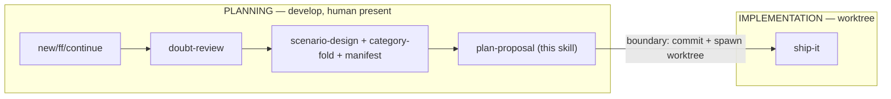

# plan-proposal

Orchestrates the **planning phase** of an OpenSpec change on `develop`. Composes
existing skills — it does **not** reimplement them. Twin of `ship-it`, which owns
the implementation phase inside the worktree. The two split at the **git-worktree
boundary**, which is also the **interactive/headless line**.

## Hard constraint — main session only (never a subagent)

`plan-proposal` MUST run in the main interactive session. It invokes
`doubt-driven-review` (which spawns a fresh-context reviewer, and interactively a
second cross-model reviewer — nested subagent spawn is blocked) and
`scenario-design` (whose proposal/design-stage HARD gate calls `ask_user`). Both
need a live main session.

**Guard:** if you detect you are running inside a subagent context (nested
reviewer spawn would be blocked, or `ask_user` is unavailable), **STOP** and
surface: *"plan-proposal must run in the main session — doubt-review and the
scenario-design gate cannot run nested. Re-invoke from the main session on
`develop`."* Do not degrade the doubt-review to a self-questioning fallback.

## Preconditions

- On the `develop` branch (planning happens on develop; the worktree is spawned
  from the planning commit).
- `openspec` CLI available; resolve the change name from `--change <name>`, the
  conversation, or `openspec list --json` (ask if ambiguous).
- Announce: *"Planning change: `<change>` (override with `/plan-proposal <other>`)."*

## Procedure

### 1. Ensure planning artifacts exist

Bring the change to a drafted state using the existing generated skills — do not
hand-roll the directory:

- No change dir yet → `openspec-new-change` (or `-ff` for the fast path).
- Partial artifacts → `openspec-continue-change`.

Artifacts live at `openspec/changes/<change>/`: `proposal.md`, `design.md` (when
the change warrants one), `specs/**/spec.md`, `tasks.md`.

### 2. Doubt-review proposal.md + design.md (trigger: drafted or modified)

Whenever `proposal.md` or `design.md` is created or changed in this session,
invoke `doubt-driven-review` on the changed artifact:

- Pass **ARTIFACT + CONTRACT only** — never the CLAIM, never your reasoning.
  - ARTIFACT = the proposal/design prose (decompose if large per doubt-review).
  - CONTRACT = the requirements/constraints the artifact must satisfy (the specs
    deltas, the non-goals, the invariants it asserts).
- **Surface the cross-model offer** — this is an interactive session, so the
  offer is mandatory (doubt-review Step 3 "always offer, never silently skip").
- **Reconcile every finding** against the artifact text using doubt-review's
  precedence (contract-misread → actionable → trade-off → noise). When a finding
  is valid + actionable, **PAUSE**: the artifact is corrected before proceeding.

Do not fold scenarios until the doubt cycle reaches a stop condition (trivial
findings, 3 cycles, or explicit "ship it").

### 3. scenario-design → category-routed fold into tasks.md

Run `scenario-design` for the change (proposal/design stage → HARD gate; it may
`ask_user` and STOP on a spec gap — that is expected, answer and continue). It
writes `openspec/changes/<change>/test-plan.md` — the **manifest**, carrying a
`level` + `disposition` (`automated` | `manual-only`) per scenario row.

Then **fold** each row into `tasks.md`:

- **`automated` rows** → one vanilla `- [ ]` task each, routed to its category:

  | manifest `level` | home | check-first (reuse infra) |
  |---|---|---|
  | L1 | `packages/*/**/__tests__/*.test.ts` (vitest) | sibling `*.test.ts` |
  | L2 | `qa/tests/*.sh` \| `*.ps1` | existing qa test for that OS |
  | L3 | `tests/e2e/*.spec.ts` (docker harness) | existing spec for that surface |
  | electron | `ci-electron.yml` / `_electron-build.yml` | existing electron job |
  | ci | `ci.yml` / workflow-level | existing workflow assertion |

  Before tasking new infra, scan for an existing test of that type to extend.
  Each folded test task MUST carry:
  1. a **harness-exemplar pointer** — the nearest existing spec/test of that
     category to copy harness glue from (e.g. `see tests/e2e/reconnect.spec.ts`).
     Bare "author X.spec.ts" tasks are forbidden — `ship-it` resolves the
     exemplar path into the task context it hands `apply`.
  2. the scenario **Triple** (`input · trigger · observable`) as plain text.
  3. a manifest reference as ordinary prose — either `(test-plan #<id>)` or an
     inline `(test-plan: automated)` — so `ship-it`/`ship-change` can map it back.

- **`manual-only` rows** → a plain manual task tagged `(test-plan: manual-only)`;
  **no test is folded**. `ship-change` defers these post-merge (its manifest-aware
  defer rule).

**Parser-safety (load-bearing):** `tasks.md` MUST stay vanilla checkbox format.
No custom token, no bracketed tag, no non-standard syntax on a task line — only
`- [ ] <text>` where the manifest reference is ordinary prose. `openspec status
--json` and the generated `apply` skill parse this file; a stray token could
break them. Verify `openspec status --change <change> --json` reports the same
task counts after folding as the plain checkboxes imply.

### 4. Commit planning artifacts + stop at the worktree boundary

Commit `proposal.md`, `design.md`, `specs/**`, `tasks.md`, and `test-plan.md` to
`develop`. The worktree is spawned from that commit via the existing worktree
flow (dashboard "start work" / `git worktree add`).

Then **STOP**. `plan-proposal` does not enter the implementation phase. Report:

> *Planning complete for `<change>`. Artifacts committed to `develop`; worktree
> ready. Automated scenarios folded to tasks (manifest dispositions in
> `test-plan.md`). **Next: run `ship-it` inside the worktree to build + ship.**
> If a design issue surfaces during build, `ship-it` writes `SHIP_IT_BLOCKED.md`
> and hands back here.*

## Guardrails

- **Main session only** — refuse and surface if nested (see Hard constraint).
- **Never pass the CLAIM to the reviewer**; ARTIFACT + CONTRACT only.
- **Never fold before reconciling** actionable doubt-review findings.
- **`tasks.md` stays vanilla** — the manifest (`test-plan.md`), not a task tag,
  is the automated-vs-manual source of truth.
- **Never author test/app code here** — folding writes *tasks*; `ship-it` authors
  the tests. This skill plans; it does not implement.
- **Stop at the boundary** — do not continue into implementation.

## Composed skills

`openspec-new-change` / `-ff` / `-continue` · `doubt-driven-review` ·
`scenario-design` (+ its `test-plan.md` manifest) · handoff to `ship-it`.
