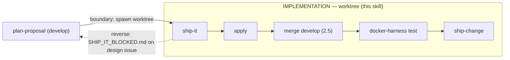

# ship-it

Orchestrates the **implementation phase** of an OpenSpec change **inside its git
worktree**. Twin of `plan-proposal` (which runs the planning phase on `develop`).
Composes existing skills — `openspec-apply-change`, the docker harness, and
`ship-change` — and adds the wiring they lack. Runnable **headless**.



Pure decision logic lives in `scripts/` and is unit-tested:
`scripts/manifest.ts` (`parseManifest`, `deferDecision`, `filesystemRealityCheck`)
and `scripts/no-weakening.ts` (`assertNoWeakening`).

## Preconditions

- Running **inside the change's worktree** (`.worktrees/os-<change>`, branch
  `os/<change>`). Resolve the change name from the worktree dir basename.
- `docker` available (the e2e harness); `openspec` CLI resolves from the parent
  repo root when inside a worktree (per `AGENTS.md`).
- Announce: *"Shipping change: `<change>` (worktree implementation phase)."*

## Procedure

### 1. Orient with `openspec status`, but gate on filesystem reality (idempotent)

Read `openspec status --change <change> --json` for orientation only. **Do not
trust the `tasks.md` checkbox** as proof an automated scenario is done — a
hand-checked or prior-partial `- [x]` can lie.

Parse `test-plan.md` (`parseManifest`). For each `automated` row, resolve its
folded test file and run `filesystemRealityCheck`: a scenario is satisfied only
when its **test file exists AND passes in the harness** (step 3). Any automated
row whose test file is absent → NOT done → author it (step 2) regardless of the
checkbox. This makes re-invocation genuinely idempotent: fresh run and re-run
reach the same all-green end state.

### 2. Run apply if non-manual work remains — inject the exemplar

If non-`manual-only` tasks remain (real code + the test files the fold tasked),
run `openspec-apply-change` for the change. `apply` writes code and marks tasks.

`apply` has no "copy from exemplar" capability of its own. For each folded test
task, **resolve the harness-exemplar pointer** (the nearest existing spec of that
category named in the task) and inject its path into the task context you hand
`apply` — or author the spec yourself in the fix loop (step 4). Bare
"author X.spec.ts" with no exemplar is forbidden.

### 2.5. Integrate `develop` — merge before the harness (primary integration point)

The harness (step 3) is the **strongest gate** on the ship-it path, so integration
must sit **upstream** of it: the harness must validate the merged tree `T1`, not
the pre-merge tree `T0`. Merge `origin/develop` — the **remote ref**, never local
`develop` (checked out in the parent repo → worktree branch-collision pitfall):

```bash
git fetch origin develop
git merge --no-edit origin/develop
```

Idempotent: up-to-date → "Already up to date", no merge commit, safe to always
run. **Merge, not rebase** — step 9 squash-merges anyway, so rebase's linear
history is moot while its force-push is a documented `ship-change` footgun.

**Conflict → abort + STOP.** On an unresolved conflict, `git merge --abort`,
report, and do **not** enter the harness — never run the gate on a half-merged
tree. Resolve trivial conflicts with `ship-change`'s existing recipes (`AGENTS.md`
union-keep; `package-lock.json` → `git checkout --theirs` +
`npm install --package-lock-only`), then re-run the merge. A conflict you cannot
resolve mechanically → escape hatch (step 5).

### 3. Harness lifecycle — delegate the port, always tear down

Obtain the harness and its port from `docker/test-up.sh` (allocator on first run,
reuser on re-up — do NOT add port code). Read the derived port from
`.pi-test-harness.json` (`dashboardPort`) — **never hardcode `:18000`**.

Wrap the whole run so teardown ALWAYS happens (red test, abort, or a partial
`test-up.sh` start):

```bash
cleanup() { docker/test-down.sh || true; }
trap cleanup EXIT
docker/test-up.sh -d --build            # allocates + records .pi-test-harness.json
port=$(jq -r '.dashboardPort' .pi-test-harness.json)   # jq is present in the harness env
# run the relevant suite against $port:
PW_E2E_USE_RUNNING=1 npm run test:e2e   # L3; or the L1/L2 suite for other levels
```

`test-down.sh` is safe against a partially-created compose project (`compose down
-v` + best-effort `rm`). Per-worktree compose-project isolation keeps one
worktree's leak from blocking another.

### 4. Red-test fix loop — OWNED by ship-it (apply cannot fix a checked task)

`apply` marks `- [ ]` → `- [x]` and never revisits a checked task, so re-invoking
`apply` on a red-but-checked test no-ops. **On a red test, `ship-it` drives the
fix itself** — edit the code or the test, re-run the harness. Never re-invoke
`apply` on an already-checked task.

Bound the loop by **progress-making cycles**, not a fixed count:

- A cycle that changes the worktree and moves the harness result counts.
- A cycle that produces **no change** to the worktree → **STOP immediately** and
  escalate (step 5). Do not spin.
- This bound is independent of doubt-review's 3-cycle bound (different semantics).

**No-weakening guardrail (mechanical, enforced every cycle):** before accepting a
change to a test file, run `assertNoWeakening` on its diff
(`git diff -- <test-file>`). If it reports `ok:false` (added `.only`/`skip`,
deleted assertion, or a strong→permissive matcher swap), **REJECT** the change —
you may not reach green by degrading the test. Fix the code instead.

### 5. Boundary-reverse escape hatch

The worktree boundary is **not one-way**. Trigger the reverse path when EITHER:

- `apply` reports a design issue (NL prose — implementation reveals the design is
  wrong), OR
- the step-4 fix bound is exhausted (a no-progress cycle).

Then, **do NOT headlessly rewrite `proposal.md`/`design.md`**:

1. Leave the worktree intact (no revert).
2. Write `openspec/changes/<change>/SHIP_IT_BLOCKED.md` naming the failing
   scenario / design gap and what was tried.
3. Exit non-zero.
4. Surface via the dashboard so a human re-enters `plan-proposal` /
   `doubt-driven-review` on `develop`.

### 6. Drive ship-change INLINE, with manifest-aware defer + teardown ordering

Once every automated scenario is green (harness-verified), ship. Execute
`ship-change`'s procedure **inline** (not as a black-box subagent) so you keep
step-level control for the teardown ordering below.

**Defer rule (`deferDecision`, manifest-aware):**
- `test-plan.md` exists → a leftover `- [ ]` is deferrable only if it maps to a
  `manual-only` manifest row (inline `(test-plan: manual-only)` or a
  `(test-plan #<id>)` reference resolved against the manifest). Any other leftover
  = real work = **STOP** (return to step 2, or the escape hatch).
- `test-plan.md` absent (legacy change) → `ship-change`'s current keyword defer
  applies unchanged.

**Teardown-before-removal ordering (load-bearing):** the harness MUST be torn down
(`test-down.sh`, already wired via the step-3 trap) **before** `ship-change` step
10 removes the worktree. A leaked container makes the worktree "busy" and stalls
removal. Run the harness teardown, then let `ship-change` archive → commit → PR →
CI → CodeRabbit → squash-merge → remove worktree.

## Guardrails

- **Idempotent on filesystem reality** — checkbox `- [x]` is never proof; the
  test file must exist and pass in the harness.
- **ship-it owns the fix loop** — never re-invoke `apply` on a checked task.
- **Never weaken a test to reach green** — `assertNoWeakening` rejects it.
- **Merge `develop` before the harness (step 2.5)** — the strong gate validates
  the integrated tree `T1`; merge `origin/develop` (remote ref), never rebase.
  Conflict → abort + STOP, never enter the harness on a half-merged tree.
- **Always tear the harness down** (trap/finally), **before** worktree removal.
- **Never hardcode `:18000`** — read `dashboardPort` from `.pi-test-harness.json`.
- **Never headlessly rewrite planning artifacts** — use the escape hatch.
- **Drive ship-change inline** — do not spawn it as a subagent (you need its step
  boundaries for teardown ordering).

## Composed skills

`openspec-apply-change` · `docker/test-up.sh` + `lib-ports.sh` + `test-down.sh` ·
`ship-change` (driven inline, manifest-aware defer). Handoff back to
`plan-proposal` via `SHIP_IT_BLOCKED.md`.
