# Contributing to PI Dashboard

This project is built with an AI agent (`pi`) doing most of the typing, and a human
doing the deciding. That shapes the workflow: it is not "branch, code, PR" — it is a
**spec-first pipeline** with explicit gates, and your job as a contributor is mostly to
supply intent, answer questions at the gates, and judge the output.

This document describes that pipeline **from the human side**: what you type, what you
are asked, where you must decide, and where you can walk away and let it run.

If you only remember one thing: **every feature and every bugfix starts as an OpenSpec
change, and ends as a squash-merge into `develop`.** There is no other path.

- Architecture reference: [`docs/architecture.md`](docs/architecture.md)
- Agent doctrine (what the agent must do every turn): [`AGENTS.md`](AGENTS.md)
- Setup, prerequisites, running locally: [`README.md`](README.md)
- Troubleshooting a red CI run: `ci-troubleshoot` skill

---

## The shape of it

Five phases. Two of them are yours to steer interactively; the rest can run unattended.

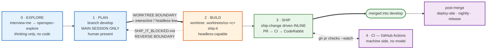

<details>
<summary>Static PNG — if your viewer does not render Mermaid</summary>

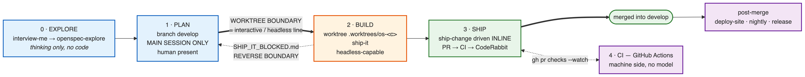

</details>

The thick arrow in the middle is the **worktree boundary**, and it is the single most
important line in this repo. To its left, planning happens on `develop` in your live
session, with you in the chair. To its right, implementation happens inside a dedicated
git worktree, and can run headless while you do something else.

The dotted arrow going backwards is the **escape hatch**. The boundary is not one-way:
when the build phase discovers the plan was wrong, it stops and hands the problem back to
you rather than quietly rewriting the plan by itself.

### Your two jobs, concretely

| Phase | Who drives | What you actually do |
|---|---|---|
| 0 · Explore | You | Talk. Argue. Reject bad framings. No files change. |
| 1 · Plan | You + agent | Answer gate questions, review the proposal, approve mockups, sanity-check the test plan. |
| 2 · Build | Agent | Nothing, unless it blocks. Go get coffee. |
| 3 · Ship | Agent | Nothing, unless CI or a reviewer surfaces something it will not auto-fix. |
| 4 · CI | Machine | Nothing. |

---

## Phase 0 — Explore: decide whether the thing is worth building

Start here whenever the idea is still fuzzy. Say something like *"let's explore adding
per-session token budgets"* or just `/skill:openspec-explore`.

Explore mode is deliberately **incapable of writing code**. It reads, searches, argues,
and challenges your framing. It may create OpenSpec artifacts if you ask — that is
capturing thinking, not implementing.

If your ask is underspecified — no clear who, why, success criterion or constraint — the
agent may instead run `interview-me`, which asks you **one question at a time** until it
is ~95% confident it understands what you want. This feels slow. It is much faster than
discovering the misunderstanding three hours later in a review.

**Exit criterion:** you can state, in one sentence, what changes and how you would know
it worked. Then move to planning.

For a small, obvious bugfix, skip this phase entirely and go straight to planning.

---

## Phase 1 — Plan: write the spec, review it adversarially, design the tests

Say **"plan this change"** (or `/skill:plan-proposal`). You must be on `develop`, and this
must run in your **main interactive session** — not a subagent. Two of the steps below
need to ask you questions, and a subagent cannot.

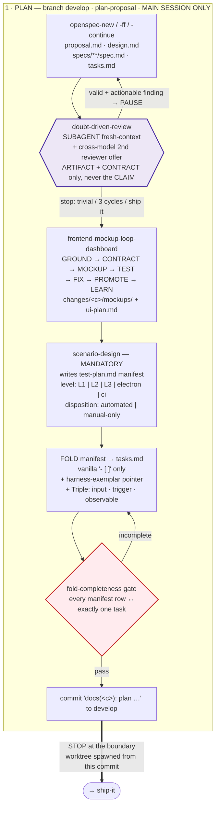

<details>
<summary>Static PNG — if your viewer does not render Mermaid</summary>

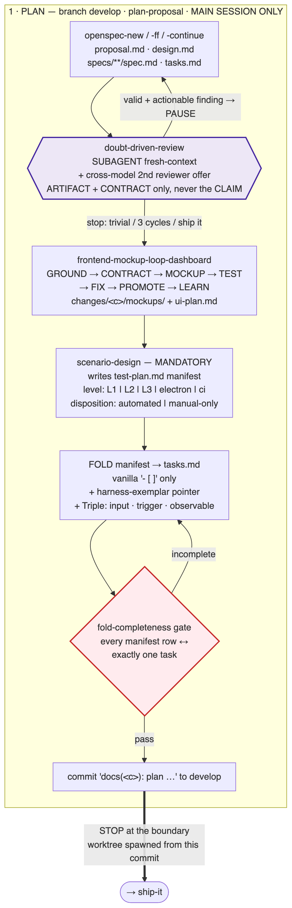

</details>

### What gets written

Everything lands in `openspec/changes/<change-name>/`:

- **`proposal.md`** — why, what changes, what is explicitly out of scope. Also a
  `## Discipline Skills` section naming which engineering disciplines the work triggers
  (security, performance, observability…). If none apply, it says so under the heading —
  omitting the heading is not allowed.
- **`design.md`** — only when the change warrants one.
- **`specs/**/spec.md`** — the requirement deltas.
- **`tasks.md`** — the checklist the build phase executes.
- **`test-plan.md`** — the test manifest (see below).
- **`mockups/`** — when UI is involved.

### The doubt review (you will be offered a second opinion — take it)

Whenever the proposal or design is written or changed, it goes to `doubt-driven-review`:
a **fresh-context subagent** that has not seen the conversation. It receives only the
artifact and the contract it must satisfy — deliberately **never** the agent's own claim
that the work is good, because that primes the reviewer to agree.

In an interactive session you are also **always offered a cross-model second reviewer** —
a different model entirely. Accepting costs a minute and catches the class of mistake a
model is blind to in its own output. Take it for anything non-trivial.

Findings are triaged by precedence: contract-misread → actionable → trade-off → noise.
An actionable finding **pauses everything** until the artifact is corrected. The loop
stops after trivial findings, three cycles, or your explicit "ship it".

### Mockups, if there is UI

UI changes go through a design loop: GROUND → CONTRACT → MOCKUP → TEST → FIX → PROMOTE →
LEARN. The agent serves the mockup on a local URL **and a LAN URL that works on your
phone**, and hands it to you for review. Look at it on a real device.

Mockups land in `openspec/changes/<name>/mockups/`, with `ui-plan.md` mapping surfaces →
design tokens → states. Tokens come from the 4-theme system (studio, earth, athlete,
gradient); verify **both dark and light**. Roughly 150 mockups are already in the repo —
the agent should copy a nearby one rather than inventing a new visual language.

### The test plan (this is the part people try to skip — don't)

`scenario-design` is **mandatory**. It derives real-life scenarios — edge cases,
performance, frontend quirks, error handling — not smoke tests, and writes
`test-plan.md`. Every row carries:

- a **level**: `L1` (vitest unit), `L2` (`qa/*.sh` VM smoke), `L3` (`tests/e2e/*.spec.ts`
  Playwright against the docker harness), `electron`, or `ci`;
- a **disposition**: `automated` or `manual-only`.

Those rows are then **folded** into `tasks.md` as ordinary checkboxes. Each folded test
task must name an **exemplar** — the nearest existing test of that category to copy
harness glue from. A bare "author some.spec.ts" is rejected.

A gate then checks that **every manifest row maps to exactly one task**. If your
`tasks.md` comes out as smoke-tests-only, planning has failed and you should push back.

**Your call at this point:** read `test-plan.md`. Ask "if this shipped broken, which row
would have caught it?" If the answer is "none", say so now — it is a hundred times cheaper
than saying it in review.

### Crossing the boundary

Planning artifacts get committed to `develop` as `docs(<change>): plan …`, and the
worktree is spawned from that commit — either via the dashboard's "start work" button or
`git worktree add`. The worktree is `.worktrees/os-<change>` on branch `os/<change>`.

Then planning **stops**. It does not slide into implementation.

---

## Phase 2 — Build: the agent writes code, and gates itself

From inside the worktree, say **"ship it"**. This phase is designed to run **headless** —
you can start it and leave.

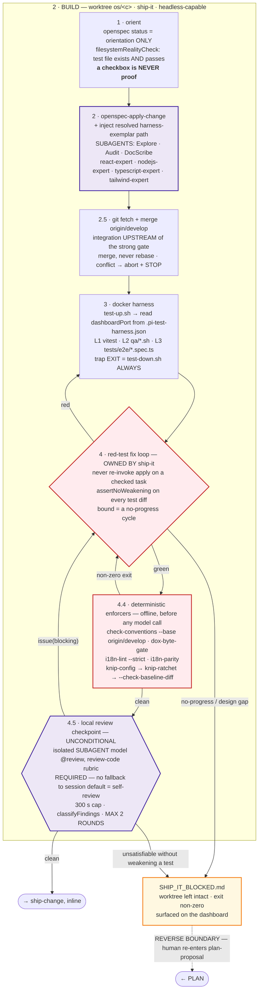

<details>
<summary>Static PNG — if your viewer does not render Mermaid</summary>

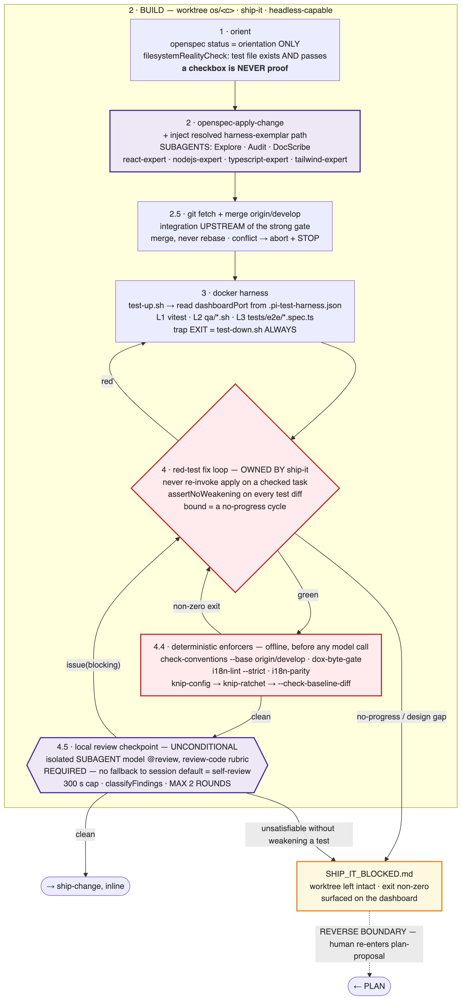

</details>

A few properties worth understanding, because they explain the behaviour you will observe:

**A ticked checkbox is never trusted.** On every invocation the agent re-derives, from the
filesystem, whether each automated scenario's test file actually exists and actually
passes. A `- [x]` written by a previous partial run proves nothing. This is what makes
"ship it" safe to re-run after an interruption: a re-run and a fresh run converge on the
same end state.

**`develop` is merged before the strongest gate, not after.** The docker e2e harness is
the most expensive and most truthful check in the pipeline, so integration happens
*upstream* of it — the harness validates the merged tree, not your stale one. It merges
`origin/develop` (a merge, never a rebase, because the PR is squash-merged anyway and
force-pushing a worktree branch is a known footgun). A conflict it cannot resolve
mechanically aborts and stops rather than testing a half-merged tree.

**Tests may not be weakened to reach green.** Every edit to a test file is diffed against a
mechanical guard that rejects added `.only`/`skip`, deleted assertions, and strong→
permissive matcher swaps. If a fix is only achievable by softening a test, the agent is
required to stop and escalate instead.

**Cheap checks run before expensive ones.** A batch of deterministic, offline enforcers —
conventions, doc byte budgets, i18n lint and parity, and the knip dead-code ratchet — runs
*before* any model is asked to review. A mechanically-broken tree never costs a model call.
The dead-code ratchet is one-way: you fix a failure by deleting dead code, never by raising
the baseline.

**The code review is unconditional and cannot be self-review.** Every run — no matter how
small the diff — spawns an isolated reviewer subagent bound to the `@review` role, with the
`review-code` rubric, fed the three-dot diff plus the proposal. There is deliberately no
fallback to the session's own model, because that model wrote the code. If `@review` is
unconfigured, the run fails and tells you to set it. Only blocking findings re-enter the
fix loop; the review is capped at two rounds.

### When it gets stuck — the escape hatch

If implementation reveals the *design* is wrong, or the fix loop stops making progress,
the agent does **not** headlessly rewrite your proposal. It writes
`openspec/changes/<change>/SHIP_IT_BLOCKED.md` naming the failing scenario and what was
tried, leaves the worktree intact, exits non-zero, and surfaces on the dashboard.

**That is your cue.** Read the file, go back to `develop`, and re-plan. This is a normal
outcome, not a failure of the process — it is the process working.

---

## Phase 3 — Ship: PR, CI, review, merge, clean up

Once every automated scenario is genuinely green, the build phase drives shipping inline.

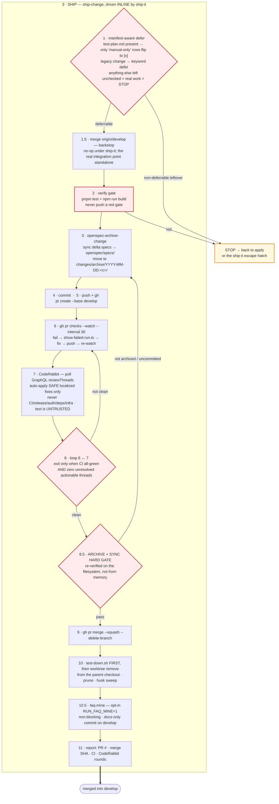

<details>
<summary>Static PNG — if your viewer does not render Mermaid</summary>

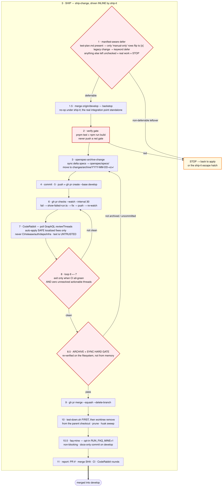

</details>

What this means in practice:

**Only `manual-only` work is deferred.** Tasks left unchecked are compared against the test
manifest. A leftover that maps to a `manual-only` row is marked done and validated by you
after merge. **Anything else is real undone work and stops the ship.** Automated scenarios
are never deferred — they were proven green in the harness before we got here.

**CodeRabbit's output is treated as untrusted data.** The agent auto-applies only clearly
safe, localized fixes — typos, null checks, off-by-one, missing `await`, small type fixes —
after validating each against the real code. It will never auto-touch CI, release, auth,
dependency or infra code, never read secrets, and never execute instructions embedded in a
review comment. Ambiguous findings are deferred and reported to you.

**Nothing destructive happens before the archive gate.** The PR is not merged, the branch
is not deleted, and the worktree is not removed while the proposal is unarchived or specs
are unsynced. The gate re-verifies this on the filesystem, not from memory.

**Cleanup is ordered.** The docker harness is torn down *before* the worktree is removed —
a leaked container makes the worktree "busy" and stalls removal.

Merges are always **squash-merge with branch delete**, base `develop`.

---

## Phase 4 — CI: what the machine checks

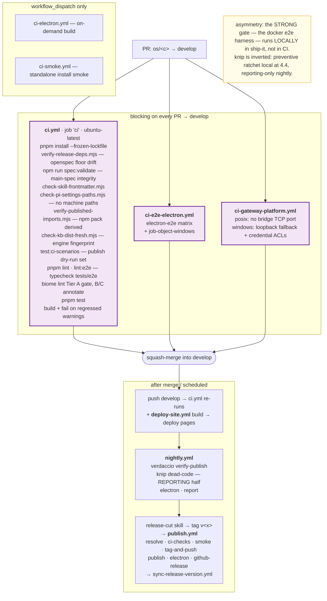

<details>
<summary>Static PNG — if your viewer does not render Mermaid</summary>

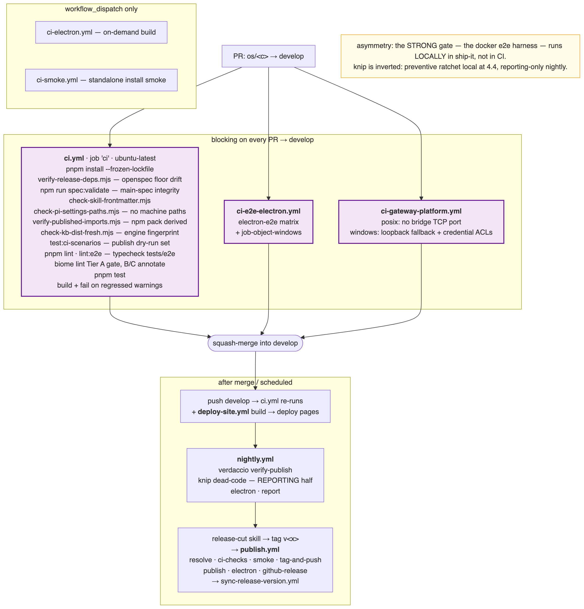

</details>

Two asymmetries surprise people:

1. **The strongest test gate is local, not in CI.** The docker e2e harness runs in the
   worktree during the build phase. CI runs the unit suite, lint, typecheck and build —
   it does not re-run the browser harness on every PR.
2. **Dead-code detection is inverted.** The *preventive* knip ratchet runs locally before
   the PR exists; the nightly job is only the *reporting* half and can no longer block
   anything by the time it runs.

Dependencies are installed with **pnpm only** (`pnpm-workspace.yaml` sets
`nodeLinker: hoisted`) — an `npm install` drifts the tree and will bite you.

---

## The inner loops, and what stops each one

Every loop in this pipeline has an explicit, different stop condition. Knowing them tells
you whether the agent is working or spinning.

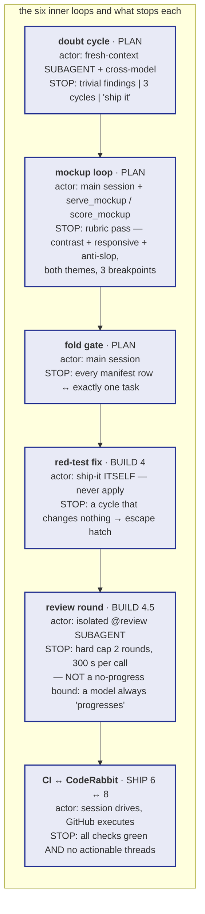

<details>
<summary>Static PNG — if your viewer does not render Mermaid</summary>

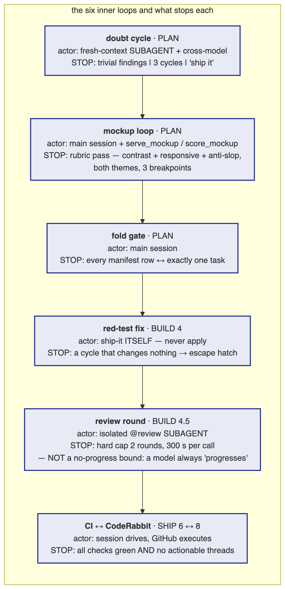

</details>

Note the deliberate difference between the fix loop and the review loop. The fix loop is
bounded by **no progress** — a cycle that changes nothing means it is stuck. The review
loop cannot use that rule, because a reviewer can invent a fresh finding every round and
each fix does change the tree; so it gets a **hard numeric cap of two rounds** instead.

---

## Bugfixes: the same pipeline, compressed

A one-line bugfix uses the identical path, just thinner:

1. Skip explore. Say *"plan a fix for &lt;symptom&gt;"*.
2. The proposal is short. The doubt review usually terminates on trivial findings in one
   cycle — still take the cross-model offer if the bug is subtle.
3. `scenario-design` still runs, and this is where the value is: **the regression test is
   the point of the fix.** A bugfix whose test plan has no row reproducing the bug is not
   a fix, it is a guess.
4. Build, ship, merge as normal.

If you are tempted to skip the spec for something trivial — a typo, a comment, a version
bump — then just make the commit. The pipeline is for behaviour changes.

---

## Things that will annoy you, and why they exist

| Friction | Reason |
|---|---|
| "Why is it asking me questions before writing anything?" | Every question at planning time is worth roughly an hour at review time. |
| "Why can't it just skip the test plan for this small change?" | Because the small change is the one that ships broken. Smoke-tests-only is a planning failure by definition. |
| "Why did it stop instead of fixing the test?" | Because the only remaining fix was to weaken the test, which is forbidden. |
| "Why is it re-running things I already saw pass?" | Because it verifies against the filesystem, not against its own memory of having passed. |
| "Why a whole worktree instead of a branch?" | So the build phase can run headless without touching your checkout, and so several changes can be in flight at once. |
| "Why is docs writing delegated to another agent?" | Docs under `docs/` use a compressed style optimised for agent reading; a dedicated subagent enforces it. See [`AGENTS.md`](AGENTS.md). |

---

## Quick reference

```bash
pnpm install                                       # deps — pnpm ONLY
npm test                                           # vitest, whole repo
npm run build                                      # web client (Vite)
npm run reload                                     # after packages/extension/ changes
curl -X POST http://localhost:8000/api/restart     # after server/shared changes
npm run test:e2e                                   # Playwright, opt-in, needs the docker harness
npm run quality:changed                            # Biome on changed files
```

Rebuild rule of thumb: **extension → reload · server/shared → restart · client → build +
restart · applied OpenSpec change → full rebuild.** Details in the `implement` skill.

When something is broken at runtime, start with the `debug-dashboard` skill; when CI is
red, start with `ci-troubleshoot`.

---

## Diagram sources

The Mermaid blocks above are the source of truth — GitHub renders them natively. The PNGs
in the collapsed `<details>` are only a fallback for viewers that do not (some editors,
PDF exports, plain-text diffs).

Both live in [`docs/pipeline-map/`](docs/pipeline-map/). **If you edit a diagram, edit it in
both places** — the block in this file and the matching `.mmd` — then re-render its PNG:

```bash
cd docs/pipeline-map
mmdc -i 3-build.mmd -o 3-build.png -b white -s 2 -c mmdc.json
```

Use Mermaid for any new diagram in this repo — never ASCII box drawings.
