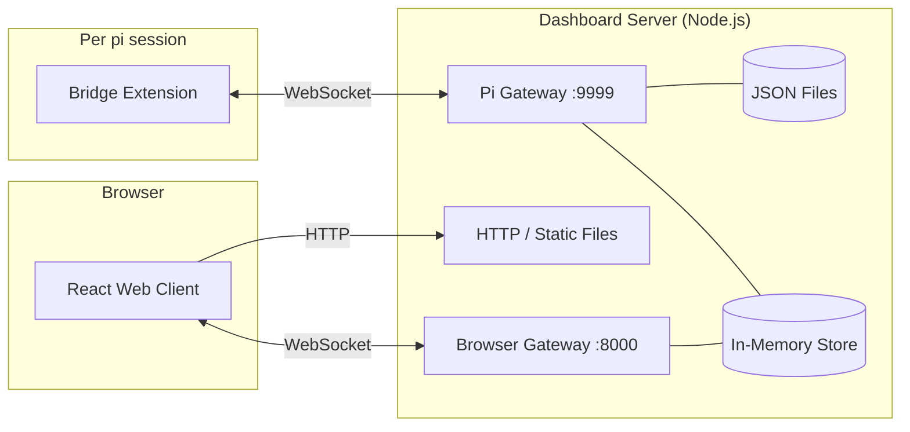
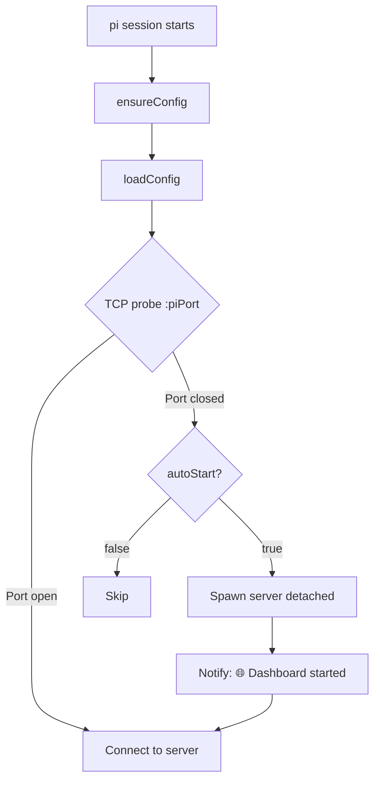

# PI Dashboard

[](https://github.com/BlackBeltTechnology/pi-agent-dashboard/actions/workflows/ci.yml)
[](https://www.npmjs.com/package/@blackbelt-technology/pi-dashboard)
[](https://opensource.org/licenses/MIT)

A web-based dashboard for monitoring and interacting with [pi](https://github.com/badlogic/pi-mono) agent sessions from any browser, including mobile.

**Website:** [blackbelttechnology.github.io/pi-agent-dashboard](https://blackbelttechnology.github.io/pi-agent-dashboard) — animated tour, screenshots, and install guide.

**Changelog:** see [`CHANGELOG.md`](CHANGELOG.md) for release notes.

**Releasing:** see [`docs/release-process.md`](docs/release-process.md) for the cut-a-release workflow.

## Features

- **Real-time session mirroring** — See all active pi sessions with live streaming messages
- **Bidirectional interaction** — Send prompts and commands from the browser
- **Workspace management** — Organize sessions by project folder with pinned directories and drag-to-reorder
- **Command autocomplete** — `/` prefix triggers command dropdown with filtering
- **Session statistics** — Token counts, costs, model info, thinking level, context usage bar
- **Elapsed time tracking** — Live ticking counters on running operations, final duration on completed tool calls and reasoning blocks
- **Mobile-friendly** — Responsive layout with swipe drawer, touch targets, and mobile action menus
- **Session spawning** — Launch new pi sessions from the dashboard (headless by default, or via tmux)
- **PromptBus architecture** — Unified prompt routing with adapters (TUI, dashboard, custom). Interactive dialogs (confirm/select/input/editor/multiselect) survive page refresh and server restart. First-response-wins semantics with cross-adapter dismissal.
- **On-demand session loading** — Browse historical sessions with lazy-loaded content from pi session files
- **Integrated terminal** — Full browser-based terminal emulator (xterm.js + node-pty) with ANSI color support, scrollback, and keep-alive
- **pi-flows integration** — Live flow execution dashboard with agent cards, detail views, flow graph visualization, summary, abort/auto controls. Launch flows and design new ones with the Flow Architect — all from the browser. Fork decisions and subagent dialogs forwarded via PromptBus.
- **Force kill escalation** — Two-click Stop button (in command bar and on running tool cards): first click sends soft abort, second click force-kills the process (SIGTERM → SIGKILL). Session preserved as "ended" for resume/fork. Repeated tool calls (e.g. health check loops) are auto-collapsed with a count badge.
- **Searchable select dialogs** — Keyboard-navigable picker with real-time filtering for OpenSpec changes and flow commands
- **Browser-based provider auth** — Sign in to Anthropic, OpenAI Codex, GitHub Copilot, Gemini CLI, and Antigravity directly from Settings. Enter API keys for other providers. Credentials saved to `~/.pi/agent/auth.json` and live-synced to running sessions.
- **Package management** — Browse, install, update, and remove pi packages from the dashboard. Search the npm registry for pi-package extensions/skills/themes, install from npm or git URL, manage global packages in Settings and local packages per workspace. All active sessions auto-reload after changes.
- **OpenSpec integration** — Browse specs, view archive history, manage changes, and create new changes from the session sidebar
- **Diff viewer** — Side-by-side and unified diff views with file tree navigation for reviewing agent changes
- **Editor integration** — Open files in your preferred editor (VS Code, Cursor, etc.) directly from tool call cards
- **Markdown preview** — Rendered markdown views with search, mermaid diagrams, and syntax highlighting
- **Network discovery** — mDNS-based auto-discovery of other dashboard servers on the local network; connect to known remote servers

## Architecture



The system has three components:

| Component | Location | Role |
|-----------|----------|------|
| **Bridge Extension** | `packages/extension/` | Runs in every pi session. Forwards events, relays commands, auto-starts server, hosts PromptBus. |
| **Dashboard Server** | `packages/server/` | Aggregates events in-memory, persists metadata to JSON, serves the web client, manages terminals. |
| **Web Client** | `packages/client/` | React + Tailwind UI with real-time WebSocket updates. |
| **Shared** | `packages/shared/` | TypeScript types, protocols, and utilities shared across all packages. |

See [docs/architecture.md](docs/architecture.md) for detailed data flows, reconnection logic, and persistence model.

## Getting Started

There are three ways to use the dashboard, from simplest to most flexible:

### Option A: Electron Desktop App (standalone — no prerequisites)

Download a pre-built installer from [GitHub Releases](https://github.com/BlackBeltTechnology/pi-agent-dashboard/releases) for your platform:

| Platform | Download |
|----------|----------|
| **macOS** (Apple Silicon) | `.dmg` (arm64) |
| **macOS** (Intel) | `.dmg` (x64) |
| **Linux** (x64) | `.deb` or `.AppImage` |
| **Linux** (ARM64) | `.deb` |
| **Windows** (x64) | `.exe` (NSIS installer), `.zip`, or portable `.exe` |
| **Windows** (ARM64) | `.zip` or portable `.exe` |

On first launch, a setup wizard guides you through:

1. **Choose a mode:**
   - **Standalone** — Bundles Node.js and auto-installs pi + dashboard + openspec into `~/.pi-dashboard/`. No Node.js, npm, or build tools needed.
   - **Power User** — Uses your existing system-installed pi and dashboard.
2. **Configure an API key** — Enter your Anthropic/OpenAI key or sign in via browser-based OAuth.
3. **Recommended extensions** — Install the curated set of pi extensions the dashboard is built to work with (see [Recommended extensions](#recommended-extensions) below). You can skip and manage them later from the Packages tab.
4. **Done** — The app discovers or spawns a dashboard server automatically.

> **No terminal, no npm, no Node.js required.** The Electron app is fully self-contained in standalone mode. It bundles a Node.js runtime, spawns the dashboard server internally, and manages all dependencies. System tray integration keeps it running in the background.

### Option B: pi Package (recommended for CLI users)

Requires [pi](https://github.com/badlogic/pi-mono) (or [Oh My Pi](https://www.npmjs.com/package/@oh-my-pi/pi-coding-agent)) and Node.js ≥ 20.

```bash
pi install npm:@blackbelt-technology/pi-dashboard
pi
```

The bridge extension auto-starts the dashboard server on first launch. You'll see:

```
🌐 Dashboard started at http://localhost:8000
```

Open **http://localhost:8000** in any browser. All active pi sessions appear automatically.

### Option C: Local development install

```bash
git clone https://github.com/BlackBeltTechnology/pi-agent-dashboard.git
cd pi-agent-dashboard
npm install
pi install /path/to/pi-agent-dashboard
```

## Recommended extensions

The dashboard integrates tightly with a small, curated set of pi extensions
— for custom tool rendering, the Flow dashboard, and anthropic-messages
protocol compatibility. The wizard's Recommended-extensions step installs
them in one go; the **Packages** tab and a top-of-page **banner** keep
them discoverable afterwards.

| Extension | Source | Status | Unlocks |
|---|---|---|---|
| `pi-anthropic-messages` | `git@github.com:BlackBeltTechnology/pi-anthropic-messages.git` | **required** | Tool calls on Claude-model Anthropic OAuth / 9Router `cc/*` / pi-model-proxy providers. Without it, tool calls fall back to Claude Code's built-in `bash_ide` sandbox and fail. |
| `@tintinweb/pi-subagents` | `npm:@tintinweb/pi-subagents` | strongly suggested | `Agent` tool card UI, subagent activity badge, `get_subagent_result` / `steer_subagent` renderers. |
| `pi-flows` | `git@github.com:BlackBeltTechnology/pi-flows.git` | strongly suggested | Flow dashboard, role aliases (`@planning`, `@coding`, …), subagent / flow_write / flow_results / agent_write / ask_user / skill_read / finish tools. |
| `pi-web-access` | `npm:pi-web-access` | strongly suggested | `web_search`, `code_search`, `fetch_content`, `get_search_content`. |
| `pi-agent-browser` | `npm:pi-agent-browser` | optional | `browser` tool (open, snapshot, click, screenshot). |

Authoritative source of truth: `packages/shared/src/recommended-extensions.ts`.
Descriptions, versions, and installed-state are enriched live at runtime via
`GET /api/packages/recommended` (falling back to offline descriptions on
network failure).

### GitHub SSH notes

The `pi-flows` and `pi-anthropic-messages` entries install via `pi install
git@github.com:…` (SSH). If your system doesn't have a GitHub SSH key
configured the clone will fail with a "Permission denied (publickey)"
error. Set up a key by following
[GitHub's SSH docs](https://docs.github.com/en/authentication/connecting-to-github-with-ssh),
or substitute the equivalent HTTPS URL in the manifest if your fork is
public.

### Quick test (without installing)

To try the extension in a single pi session without registering it:

```bash
pi -e /path/to/pi-agent-dashboard/packages/extension/src/bridge.ts
```

## Prerequisites

Only needed for Option B/C (the Electron app handles everything automatically).

| Requirement | Why | Install |
|-------------|-----|---------|
| **[pi](https://github.com/badlogic/pi-mono)** or **[Oh My Pi](https://www.npmjs.com/package/@oh-my-pi/pi-coding-agent)** | The AI coding agent that the dashboard monitors | `npm i -g @mariozechner/pi-coding-agent` |
| **Node.js ≥ 20** | Runtime for the dashboard server | [nodejs.org](https://nodejs.org/) |
| **C++ build tools** | Required by `node-pty` native addon for terminal emulation | Xcode CLI Tools (macOS) / `build-essential` (Linux) |

### Optional tools

| Tool | Purpose | When needed |
|------|---------|-------------|
| **tmux** | Spawn new pi sessions from the browser in a tmux window | When `spawnStrategy` is `"tmux"` |
| **[zrok](https://zrok.io/)** | Expose dashboard over the internet via tunnel (auto-connects on server start). Install with `brew install zrok` (macOS) and run `zrok enable <token>` to enroll — the dashboard reads zrok's own config (`~/.zrok2/environment.json`), no keys are stored in the dashboard. Uses reserved shares for persistent URLs across restarts. | When `tunnel.enabled` is `true` (default) |

## Configuration

Config file: **`~/.pi/dashboard/config.json`** (auto-created with defaults on first run)

```json
{
  "port": 8000,
  "piPort": 9999,
  "autoStart": true,
  "autoShutdown": false,
  "shutdownIdleSeconds": 300,
  "spawnStrategy": "headless",
  "tunnel": { "enabled": true, "reservedToken": "auto-created-on-first-run" },
  "devBuildOnReload": false
}
```

### Authentication (Optional)

Add an `auth` section to enable OAuth2 authentication for external (tunnel) access. Localhost is always unguarded.

```json
{
  "auth": {
    "secret": "auto-generated-if-omitted",
    "providers": {
      "github": {
        "clientId": "your-github-client-id",
        "clientSecret": "your-github-client-secret"
      },
      "google": {
        "clientId": "your-google-client-id",
        "clientSecret": "your-google-client-secret"
      },
      "keycloak": {
        "clientId": "your-keycloak-client-id",
        "clientSecret": "your-keycloak-client-secret",
        "issuerUrl": "https://keycloak.example.com/realms/myrealm"
      }
    },
    "allowedUsers": ["octocat", "user@example.com", "*@company.com"]
  }
}
```

| Key | Required | Description |
|-----|----------|-------------|
| `auth.secret` | No | JWT signing secret (auto-generated if omitted) |
| `auth.providers` | Yes | Map of provider name → `{ clientId, clientSecret, issuerUrl? }` |
| `auth.allowedUsers` | No | User allowlist: usernames, emails, or `*@domain` wildcards. Empty = allow all |

**Supported providers:** `github`, `google`, `keycloak`, `oidc` (generic OIDC with `issuerUrl`).

**Callback URL:** Register `https://<tunnel-url>/auth/callback/<provider>` in your OAuth provider settings. The tunnel URL is stable across restarts (reserved shares are auto-created).

**Settings UI:** Click the ⚙ gear icon in the sidebar header to open the Settings panel, where all config fields (including auth) can be edited from the browser.

**Precedence:** CLI flags → environment variables → config file → built-in defaults.

| CLI Flag | Env Var | Config Key | Default | Description |
|----------|---------|------------|---------|-------------|
| `--port` | `PI_DASHBOARD_PORT` | `port` | `8000` | HTTP + Browser WebSocket port |
| `--pi-port` | `PI_DASHBOARD_PI_PORT` | `piPort` | `9999` | Pi extension WebSocket port |
| `--dev` | — | — | `false` | Development mode (proxy to Vite) |
| `--no-tunnel` | — | `tunnel.enabled` | `true` | Disable zrok tunnel |
| — | — | `autoStart` | `true` | Bridge auto-starts server if not running |
| — | — | `autoShutdown` | `false` | Server shuts down when idle |
| — | — | `shutdownIdleSeconds` | `300` | Seconds idle before auto-shutdown |
| — | — | `spawnStrategy` | `"headless"` | Session spawn mode: `"headless"` or `"tmux"` |
| — | — | `devBuildOnReload` | `false` | Rebuild client + restart server on `/reload` |

### Override the server URL

By default the bridge connects to `ws://localhost:{piPort}`. To point at a remote server:

```bash
PI_DASHBOARD_URL=ws://192.168.1.100:9999 pi
```

## Installation Methods

### Electron Desktop App (standalone)

See [Getting Started — Option A](#option-a-electron-desktop-app-standalone--no-prerequisites) above. Download from [GitHub Releases](https://github.com/BlackBeltTechnology/pi-agent-dashboard/releases).

### From npm (recommended for CLI users)

```bash
# pi
pi install npm:@blackbelt-technology/pi-dashboard

# Oh My Pi
omp install npm:@blackbelt-technology/pi-dashboard
```

> The package is compatible with both [pi](https://github.com/badlogic/pi-mono) and [Oh My Pi](https://www.npmjs.com/package/@oh-my-pi/pi-coding-agent) — no configuration needed.

### Local development install

```bash
cd /path/to/pi-agent-dashboard
npm install

# Global install
pi install /path/to/pi-agent-dashboard

# Or project-local only
pi install -l /path/to/pi-agent-dashboard
```

Pi reads the `pi.extensions` field from `package.json` and loads the bridge extension automatically.

### Manual settings entry

Add the package path directly to your settings file:

**Global** (`~/.pi/agent/settings.json`):
```json
{
  "packages": ["/path/to/pi-agent-dashboard"]
}
```

**Project-local** (`.pi/settings.json`):
```json
{
  "packages": ["/path/to/pi-agent-dashboard"]
}
```

### Removing

```bash
pi remove /path/to/pi-agent-dashboard
```

## Usage

### Auto-start (default)

The bridge extension **automatically starts the dashboard server** when pi launches if it's not already running. No separate terminal needed.

To disable: set `"autoStart": false` in `~/.pi/dashboard/config.json`.

### Manual server start

```bash
npx tsx packages/server/src/cli.ts
npx tsx packages/server/src/cli.ts --port 8000 --pi-port 9999
npx tsx packages/server/src/cli.ts --dev   # proxy to Vite dev server
```

### Daemon mode

```bash
pi-dashboard start           # Start as background daemon (production)
pi-dashboard start --dev     # Start in dev mode (proxy to Vite, fallback to production build)
pi-dashboard stop            # Stop running daemon (also kills stale port holders)
pi-dashboard restart         # Restart daemon (production)
pi-dashboard restart --dev   # Restart in dev mode
pi-dashboard status          # Show daemon status
```

Daemon stdout/stderr is logged to `~/.pi/dashboard/server.log` for crash diagnosis.

### Graceful restart via API

Restart without CLI — useful from scripts, other sessions, or the dashboard skill:

```bash
# Restart in same mode (preserves current dev/prod)
curl -X POST http://localhost:8000/api/restart

# Switch to dev mode
curl -X POST http://localhost:8000/api/restart -H 'Content-Type: application/json' -d '{"dev":true}'

# Switch to production mode
curl -X POST http://localhost:8000/api/restart -H 'Content-Type: application/json' -d '{"dev":false}'

# Check current mode
curl -s http://localhost:8000/api/health | jq .mode
```

The restart endpoint waits for the old server to exit, starts the new one, and verifies health. If the new server fails to start, the error is logged to `server.log`.

### Dev mode with production fallback

When started with `--dev`, the server proxies client requests to the Vite dev server for HMR. If Vite is **not running**, the server automatically falls back to serving the production build from `dist/client/`. This means:

- `pi-dashboard start --dev` **always works** — no 502 errors
- Start/stop Vite independently without restarting the dashboard
- Seamless transition: start Vite later and refresh the browser to get HMR

### Session spawning

The dashboard can spawn new pi sessions from the browser. Two strategies are available:

**Headless** (default) — Runs pi as a background process with no terminal attached. Interaction happens entirely through the dashboard web UI.

**tmux** — Runs pi inside a tmux session named `pi-dashboard`. Each spawned session opens as a new tmux window. This lets you attach to the terminal when needed:

```bash
# Attach to the pi-dashboard tmux session
tmux attach -t pi-dashboard

# List all windows (each is a spawned pi session)
tmux list-windows -t pi-dashboard

# Switch between windows inside tmux
Ctrl-b n    # next window
Ctrl-b p    # previous window
Ctrl-b w    # interactive window picker
```

To switch strategy, set `spawnStrategy` in `~/.pi/dashboard/config.json`:

```json
{
  "spawnStrategy": "tmux"
}
```

### Auto-start flow



The server is spawned detached (`child_process.spawn` with `detached: true`, `unref()`), so it outlives the pi session. Duplicate spawn attempts from concurrent pi sessions fail harmlessly with `EADDRINUSE`.

### Dev build on reload

Set `"devBuildOnReload": true` in `config.json` for a one-command full-stack refresh:

```
/reload → build client → stop server → reload extension → auto-start fresh server
```

> **Note:** Blocks pi for ~2–5s during the build. The server shutdown affects all connected sessions — they auto-reconnect when one restarts the server.

## Development

### Commands

```bash
npm install          # Install dependencies
npm test             # Run all tests (vitest)
npm run test:watch   # Watch mode
npm run build        # Build web client (Vite)
npm run dev          # Start Vite dev server (HMR)
npm run lint         # Type-check (tsc --noEmit)
npm run reload       # Reload all connected pi sessions
npm run reload:check # Type-check + reload all pi sessions
```

### Typical local dev workflow

```bash
# Terminal 1: Dashboard server in dev mode
npx tsx packages/server/src/cli.ts --dev

# Terminal 2: Vite dev server (HMR for the web client)
npm run dev

# Terminal 3: pi with the bridge extension
pi -e packages/extension/src/bridge.ts   # or just `pi` if installed

# Open http://localhost:8000 (server proxies to Vite for SPA routes + assets)
# Or http://localhost:3000 (Vite directly, proxies API/WS to :8000)
```

### Deploy after changes

The `pi-dashboard` command is available globally when the package is installed. After making changes, restart the appropriate components:

```bash
# After client changes (production mode)
npm run build
curl -X POST http://localhost:8000/api/restart

# After server changes (runs TypeScript directly, no build needed)
curl -X POST http://localhost:8000/api/restart

# After bridge extension changes
npm run reload          # Reload all connected pi sessions

# Full rebuild (e.g., after pulling updates)
npm run build
curl -X POST http://localhost:8000/api/restart
npm run reload

# Switch between dev and production mode
curl -X POST http://localhost:8000/api/restart -H 'Content-Type: application/json' -d '{"dev":true}'
curl -X POST http://localhost:8000/api/restart -H 'Content-Type: application/json' -d '{"dev":false}'
```

### Project Structure

The project is a monorepo with npm workspaces:

```
packages/
├── shared/           # Shared TypeScript types & utilities
│   └── src/
│       ├── protocol.ts        # Extension ↔ Server messages
│       ├── browser-protocol.ts # Server ↔ Browser messages (incl. PromptBus types)
│       ├── types.ts           # Data models
│       ├── config.ts          # Shared config loader
│       ├── rest-api.ts        # REST API types
│       ├── session-meta.ts    # Session metadata sidecar (.meta.json) read/write
│       ├── state-replay.ts    # Event synthesis on reconnect
│       ├── stats-extractor.ts # Token/cost stats extraction
│       ├── server-identity.ts # Server detection & identity
│       ├── mdns-discovery.ts  # mDNS network auto-discovery
│       └── openspec-poller.ts # OpenSpec change data polling
├── extension/        # Bridge extension (runs in pi)
│   └── src/
│       ├── bridge.ts          # Main extension entry
│       ├── connection.ts      # WebSocket with reconnection
│       ├── event-forwarder.ts # Event mapping
│       ├── flow-event-wiring.ts # pi-flows event forwarding
│       ├── prompt-bus.ts      # PromptBus — unified prompt routing with adapters
│       ├── dashboard-default-adapter.ts # Default PromptBus adapter for dashboard UI
│       ├── prompt-expander.ts # Prompt template expansion from disk
│       ├── provider-register.ts # Provider auth registration & sync
│       ├── model-tracker.ts   # Model selection tracking
│       ├── source-detector.ts # Session source detection (via .meta.json sidecar)
│       ├── command-handler.ts # Command relay
│       ├── server-probe.ts    # TCP probe for server detection
│       ├── server-auto-start.ts # Auto-start logic on session launch
│       ├── server-launcher.ts # Spawn server as detached process
│       ├── session-sync.ts    # Session history sync
│       ├── process-metrics.ts # Agent process CPU/memory metrics
│       ├── process-scanner.ts # Running process detection
│       ├── git-info.ts        # Git branch/remote/PR detection
│       ├── git-link-builder.ts # GitHub/GitLab permalink generation
│       └── dev-build.ts       # Dev build-on-reload helper
├── server/           # Dashboard server
│   └── src/
│       ├── cli.ts             # CLI entry (start/stop/restart/status)
│       ├── server.ts          # HTTP + WebSocket server
│       ├── pi-gateway.ts      # Extension WebSocket gateway
│       ├── browser-gateway.ts # Browser WebSocket gateway
│       ├── memory-event-store.ts # In-memory event buffer (LRU, per-session cap, truncation)
│       ├── memory-session-manager.ts # In-memory session registry
│       ├── preferences-store.ts # User prefs: hidden sessions, pinned dirs
│       ├── meta-persistence.ts # Session metadata persistence
│       ├── session-order-manager.ts # Per-cwd session ordering
│       ├── session-discovery.ts # Session file scanning & loading
│       ├── process-manager.ts # tmux/headless session spawning
│       ├── headless-pid-registry.ts # Track headless process PIDs
│       ├── editor-registry.ts # Available editor detection
│       ├── editor-manager.ts  # Editor launch & file opening
│       ├── provider-auth-storage.ts # Provider credential persistence
│       ├── provider-auth-handlers.ts # OAuth flow handlers
│       ├── npm-search-proxy.ts # npm registry search proxy
│       ├── package-manager-wrapper.ts # pi package install/remove
│       ├── pending-fork-registry.ts # Flow fork decision persistence
│       ├── tunnel.ts          # Zrok tunnel with reserved shares
│       ├── terminal-manager.ts # Browser terminal sessions (xterm.js + node-pty)
│       ├── server-pid.ts      # PID file for daemon management
│       ├── auth.ts            # OAuth2 authentication
│       └── json-store.ts      # Atomic JSON file helpers
├── client/           # React web client
│   └── src/
│       ├── App.tsx
│       ├── hooks/             # WebSocket hooks, mobile detection
│       ├── lib/               # Event reducer, command filter
│       └── components/        # UI components
│           ├── FlowDashboard.tsx    # Live flow execution view
│           ├── FlowAgentCard.tsx    # Per-agent status cards
│           ├── FlowGraph.tsx        # DAG visualization
│           ├── FlowArchitect.tsx    # Flow designer UI
│           ├── FlowSummary.tsx      # Post-flow result summary
│           ├── DiffView.tsx         # Side-by-side diff viewer
│           ├── TerminalView.tsx     # Browser terminal emulator
│           ├── PackageBrowser.tsx   # Package search & install
│           ├── ProviderAuthSection.tsx # Provider sign-in UI
│           ├── SettingsPanel.tsx    # Config editor
│           └── ...                  # 80+ components
└── electron/         # Electron desktop app wrapper
    ├── src/main.ts
    ├── scripts/
    └── resources/
```

## Monitoring

The health endpoint provides server and agent process metrics:

```bash
curl -s http://localhost:8000/api/health | jq
```

Returns:
- `mode` — `"dev"` or `"production"`
- `server.rss`, `server.heapUsed`, `server.heapTotal` — server memory
- `server.activeSessions`, `server.totalSessions` — session counts
- `agents[]` — per-agent metrics (CPU%, RSS, heap, event loop max delay, system load)

Agent metrics are collected every 15s via heartbeats and include `eventLoopMaxMs` — useful for diagnosing connection drops during long-running operations.

## Extension UI Events

Your own extensions can broadcast UI events to the dashboard:

```typescript
pi.events.emit("dashboard:ui", {
  method: "notify",
  message: "Deployment complete!",
  level: "success",
});
```

Supported methods: `confirm`, `select`, `input`, `notify`.

## Electron Desktop App

The project includes an Electron wrapper at `packages/electron/` that bundles the dashboard as a **fully standalone native desktop app**. Pre-built installers for all platforms are available on [GitHub Releases](https://github.com/BlackBeltTechnology/pi-agent-dashboard/releases) — see [Getting Started](#getting-started) above.

The Electron app supports two modes:

| Mode | Description |
|------|-------------|
| **Standalone** | Bundles Node.js, auto-installs pi + dashboard into `~/.pi-dashboard/`. Zero prerequisites. |
| **Power User** | Detects and uses your existing system pi + dashboard install. |

Features: first-run setup wizard, auto-update checker, system tray, splash screen, VM detection (disables GPU acceleration), mDNS server discovery, and version compatibility checks.

### Building from Source

> **Prerequisites for building:** Node.js 22.12+, platform-specific tools handled by Electron Forge automatically.

### Building for Your Platform

The easiest way — one command that handles everything (client build, Node.js bundling, installer creation):

```bash
npm run electron:build              # Build for current platform & arch
npm run electron:build -- --arch x64 # Override architecture
npm run electron:build -- --skip-client # Skip client rebuild
```

Or step by step:

```bash
npm run build                        # Build web client
cd packages/electron
bash scripts/download-node.sh        # Download Node.js for bundling
npm run make                         # Build installer
```

Output by platform:

| Platform | Output | Location |
|----------|--------|----------|
| macOS | `.dmg` | `packages/electron/out/make/` |
| Linux | `.deb` + `.AppImage` | `packages/electron/out/make/` |
| Windows | `.exe` (NSIS installer) + `.zip` + portable `.exe` | `packages/electron/out/make/` |

### Cross-Platform Builds (via Docker)

From macOS or Linux, you can build installers for **all platforms** using Docker:

```bash
npm run electron:build -- --all        # macOS (native) + Linux + Windows (Docker)
npm run electron:build -- --linux       # Linux .deb + .AppImage only
npm run electron:build -- --windows     # Windows .exe (NSIS) only
npm run electron:build -- --linux --windows  # Both, skip native
```

Docker builds use a Node 22 Debian container with NSIS installed for Windows cross-compilation.
All output goes to `packages/electron/out/make/`.

> **Note:** Native builds (no flags) build for the current platform only. Docker is required for `--linux`, `--windows`, and `--all`.

### Development Mode

```bash
# Start the dashboard server and Vite dev server first
pi-dashboard start --dev
npm run dev

# Then launch Electron pointing at the dev server
cd packages/electron
npm run start:dev
```

### Regenerating Icons

All platform icon variants are generated from the master icon at `packages/electron/resources/icon.png`:

```bash
cd packages/electron
npm run icons    # Generates .icns (macOS), .ico (Windows), and resized PNGs
```

### CI Builds & GitHub Releases

The release workflow (`.github/workflows/publish.yml`) builds Electron installers for **all platforms** on every version tag (`v*`):

| Runner | Platform | Outputs |
|--------|----------|---------|
| `macos-14` | macOS arm64 | `.dmg` |
| `ubuntu-latest` | Linux x64 | `.deb` + `.AppImage` |
| `ubuntu-24.04-arm` | Linux arm64 | `.deb` |
| `windows-latest` | Windows x64 | `.exe` (NSIS) + `.zip` + portable |
| `windows-latest` | Windows arm64 | `.zip` + portable (x64 Node.js via WoW64) |

All artifacts are uploaded to a **draft GitHub Release** for review and publishing. The same workflow also publishes the npm package. Release notes for the draft are extracted automatically from the matching `## [<version>]` section of [`CHANGELOG.md`](CHANGELOG.md) — see [`docs/release-process.md`](docs/release-process.md) for the full cut-a-release workflow.

## CI/CD

### Continuous Integration

Every push to `develop` and every pull request against `develop` triggers the CI workflow (`.github/workflows/ci.yml`):

1. `npm ci` — install dependencies
2. `npm run lint` — type check
3. `npm test` — run tests
4. `npm run build` — build web client

### Releasing to npm

The publish workflow (`.github/workflows/publish.yml`) triggers on `v*` tags:

```bash
npm version patch   # or minor / major
git push --follow-tags
```

This runs CI checks, then publishes to npm with `--provenance` for supply chain transparency.

### npm Token Setup

The publish workflow requires an `NPM_TOKEN` secret in the GitHub repository:

1. Generate a token at [npmjs.com](https://www.npmjs.com/) → Access Tokens → Generate New Token (Granular Access Token)
2. Grant publish access to `@blackbelt-technology` packages
3. Add it as a repository secret: GitHub repo → Settings → Secrets and variables → Actions → New repository secret → Name: `NPM_TOKEN`

## License

MIT
