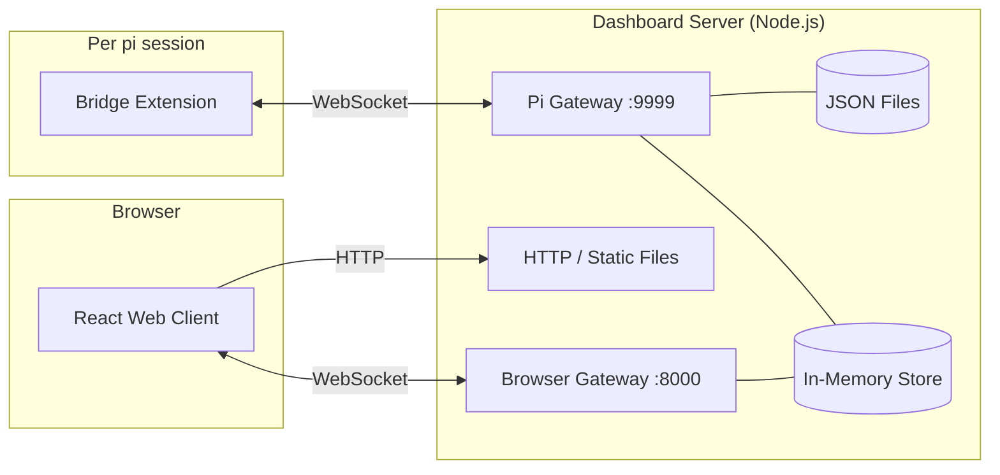
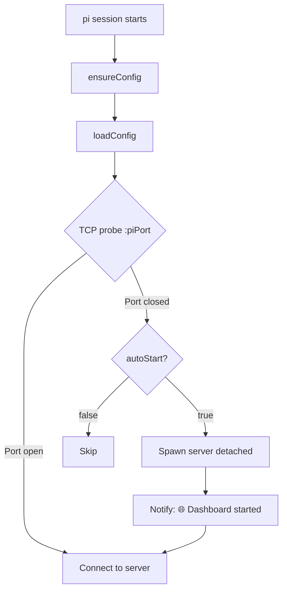

# PI Dashboard

[](https://github.com/BlackBeltTechnology/pi-agent-dashboard/actions/workflows/ci.yml)
[](https://www.npmjs.com/package/@blackbelt-technology/pi-dashboard)
[](https://opensource.org/licenses/MIT)

A web-based dashboard for monitoring and interacting with [pi](https://github.com/badlogic/pi-mono) agent sessions from any browser, including mobile.

## Features

- **Real-time session mirroring** — See all active pi sessions with live streaming messages
- **Bidirectional interaction** — Send prompts and commands from the browser
- **Workspace management** — Organize sessions by project folder
- **Command autocomplete** — `/` prefix triggers command dropdown with filtering
- **Session statistics** — Token counts, costs, model info, thinking level
- **Mobile-friendly** — Responsive layout with swipe drawer and touch targets
- **Session spawning** — Launch new pi sessions from the dashboard (headless by default, or via tmux)
- **Extension UI forwarding** — Interactive dialogs (confirm/select/input) survive page refresh and server restart
- **On-demand session loading** — Browse historical sessions with lazy-loaded content from pi session files
- **Integrated terminal** — Full browser-based terminal emulator (xterm.js + node-pty) with ANSI color support, scrollback, and keep-alive

## Architecture



The system has three components:

| Component | Location | Role |
|-----------|----------|------|
| **Bridge Extension** | `src/extension/` | Runs in every pi session. Forwards events, relays commands, auto-starts server. |
| **Dashboard Server** | `src/server/` | Aggregates events in-memory, persists metadata to JSON, serves the web client. |
| **Web Client** | `src/client/` | React + Tailwind UI with real-time WebSocket updates. |

See [docs/architecture.md](docs/architecture.md) for detailed data flows, reconnection logic, and persistence model.

## Prerequisites

| Requirement | Why | Install |
|-------------|-----|---------|
| **[pi](https://github.com/badlogic/pi-mono)** or **[Oh My Pi](https://www.npmjs.com/package/@oh-my-pi/pi-coding-agent)** | The AI coding agent that the dashboard monitors | `npm i -g @mariozechner/pi-coding-agent` |
| **Node.js ≥ 20** | Runtime for the dashboard server | [nodejs.org](https://nodejs.org/) |
| **C++ build tools** | Required by `node-pty` native addon for terminal emulation | Xcode CLI Tools (macOS) / `build-essential` (Linux) |

### Optional tools

| Tool | Purpose | When needed |
|------|---------|-------------|
| **tmux** | Spawn new pi sessions from the browser in a tmux window | When `spawnStrategy` is `"tmux"` |
| **[zrok](https://zrok.io/)** | Expose dashboard over the internet via tunnel (auto-connects on server start). Install with `brew install zrok` (macOS) and run `zrok enable <token>` to enroll — the dashboard reads zrok's own config (`~/.zrok2/environment.json`), no keys are stored in the dashboard. Uses reserved shares for persistent URLs across restarts. | When `tunnel.enabled` is `true` (default) |

## Getting Started

### 1. Install the dashboard package

**From npm:**
```bash
pi install npm:@blackbelt-technology/pi-dashboard
```

**From a local clone:**
```bash
git clone https://github.com/nicობ/pi-agent-dashboard.git
cd pi-agent-dashboard
npm install
pi install /path/to/pi-agent-dashboard
```

### 2. Start pi

```bash
pi
```

The bridge extension auto-starts the dashboard server on first launch. You'll see:

```
🌐 Dashboard started at http://localhost:8000
```

### 3. Open the dashboard

Open **http://localhost:8000** in any browser. All active pi sessions appear automatically.

That's it — no manual server start, no configuration needed for basic use.

### Quick test (without installing)

To try the extension in a single pi session without registering it:

```bash
pi -e /path/to/pi-agent-dashboard/src/extension/bridge.ts
```

## Configuration

Config file: **`~/.pi/dashboard/config.json`** (auto-created with defaults on first run)

```json
{
  "port": 8000,
  "piPort": 9999,
  "autoStart": true,
  "autoShutdown": true,
  "shutdownIdleSeconds": 300,
  "spawnStrategy": "headless",
  "tunnel": { "enabled": true, "reservedToken": "auto-created-on-first-run" },
  "devBuildOnReload": false
}
```

### Authentication (Optional)

Add an `auth` section to enable OAuth2 authentication for external (tunnel) access. Localhost is always unguarded.

```json
{
  "auth": {
    "secret": "auto-generated-if-omitted",
    "providers": {
      "github": {
        "clientId": "your-github-client-id",
        "clientSecret": "your-github-client-secret"
      },
      "google": {
        "clientId": "your-google-client-id",
        "clientSecret": "your-google-client-secret"
      },
      "keycloak": {
        "clientId": "your-keycloak-client-id",
        "clientSecret": "your-keycloak-client-secret",
        "issuerUrl": "https://keycloak.example.com/realms/myrealm"
      }
    },
    "allowedUsers": ["octocat", "user@example.com", "*@company.com"]
  }
}
```

| Key | Required | Description |
|-----|----------|-------------|
| `auth.secret` | No | JWT signing secret (auto-generated if omitted) |
| `auth.providers` | Yes | Map of provider name → `{ clientId, clientSecret, issuerUrl? }` |
| `auth.allowedUsers` | No | User allowlist: usernames, emails, or `*@domain` wildcards. Empty = allow all |

**Supported providers:** `github`, `google`, `keycloak`, `oidc` (generic OIDC with `issuerUrl`).

**Callback URL:** Register `https://<tunnel-url>/auth/callback/<provider>` in your OAuth provider settings. The tunnel URL is stable across restarts (reserved shares are auto-created).

**Settings UI:** Click the ⚙ gear icon in the sidebar header to open the Settings panel, where all config fields (including auth) can be edited from the browser.

**Precedence:** CLI flags → environment variables → config file → built-in defaults.

| CLI Flag | Env Var | Config Key | Default | Description |
|----------|---------|------------|---------|-------------|
| `--port` | `PI_DASHBOARD_PORT` | `port` | `8000` | HTTP + Browser WebSocket port |
| `--pi-port` | `PI_DASHBOARD_PI_PORT` | `piPort` | `9999` | Pi extension WebSocket port |
| `--dev` | — | — | `false` | Development mode (proxy to Vite) |
| `--no-tunnel` | — | `tunnel.enabled` | `true` | Disable zrok tunnel |
| — | — | `autoStart` | `true` | Bridge auto-starts server if not running |
| — | — | `autoShutdown` | `true` | Server shuts down when idle |
| — | — | `shutdownIdleSeconds` | `300` | Seconds idle before auto-shutdown |
| — | — | `spawnStrategy` | `"headless"` | Session spawn mode: `"headless"` or `"tmux"` |
| — | — | `devBuildOnReload` | `false` | Rebuild client + restart server on `/reload` |

### Override the server URL

By default the bridge connects to `ws://localhost:{piPort}`. To point at a remote server:

```bash
PI_DASHBOARD_URL=ws://192.168.1.100:9999 pi
```

## Installation Methods

### From npm (recommended)

```bash
# pi
pi install npm:@blackbelt-technology/pi-dashboard

# Oh My Pi
omp install npm:@blackbelt-technology/pi-dashboard
```

> The package is compatible with both [pi](https://github.com/badlogic/pi-mono) and [Oh My Pi](https://www.npmjs.com/package/@oh-my-pi/pi-coding-agent) — no configuration needed.

### Local development install

```bash
cd /path/to/pi-agent-dashboard
npm install

# Global install
pi install /path/to/pi-agent-dashboard

# Or project-local only
pi install -l /path/to/pi-agent-dashboard
```

Pi reads the `pi.extensions` field from `package.json` and loads the bridge extension automatically.

### Manual settings entry

Add the package path directly to your settings file:

**Global** (`~/.pi/agent/settings.json`):
```json
{
  "packages": ["/path/to/pi-agent-dashboard"]
}
```

**Project-local** (`.pi/settings.json`):
```json
{
  "packages": ["/path/to/pi-agent-dashboard"]
}
```

### Removing

```bash
pi remove /path/to/pi-agent-dashboard
```

## Usage

### Auto-start (default)

The bridge extension **automatically starts the dashboard server** when pi launches if it's not already running. No separate terminal needed.

To disable: set `"autoStart": false` in `~/.pi/dashboard/config.json`.

### Manual server start

```bash
npx tsx src/server/cli.ts
npx tsx src/server/cli.ts --port 8000 --pi-port 9999
npx tsx src/server/cli.ts --dev   # proxy to Vite dev server
```

### Daemon mode

```bash
pi-dashboard start      # Start as background daemon
pi-dashboard stop       # Stop running daemon
pi-dashboard restart    # Restart daemon
pi-dashboard status     # Show daemon status
```

### Session spawning

The dashboard can spawn new pi sessions from the browser. Two strategies are available:

**Headless** (default) — Runs pi as a background process with no terminal attached. Interaction happens entirely through the dashboard web UI.

**tmux** — Runs pi inside a tmux session named `pi-dashboard`. Each spawned session opens as a new tmux window. This lets you attach to the terminal when needed:

```bash
# Attach to the pi-dashboard tmux session
tmux attach -t pi-dashboard

# List all windows (each is a spawned pi session)
tmux list-windows -t pi-dashboard

# Switch between windows inside tmux
Ctrl-b n    # next window
Ctrl-b p    # previous window
Ctrl-b w    # interactive window picker
```

To switch strategy, set `spawnStrategy` in `~/.pi/dashboard/config.json`:

```json
{
  "spawnStrategy": "tmux"
}
```

### Auto-start flow



The server is spawned detached (`child_process.spawn` with `detached: true`, `unref()`), so it outlives the pi session. Duplicate spawn attempts from concurrent pi sessions fail harmlessly with `EADDRINUSE`.

### Dev build on reload

Set `"devBuildOnReload": true` in `config.json` for a one-command full-stack refresh:

```
/reload → build client → stop server → reload extension → auto-start fresh server
```

> **Note:** Blocks pi for ~2–5s during the build. The server shutdown affects all connected sessions — they auto-reconnect when one restarts the server.

## Development

### Commands

```bash
npm install          # Install dependencies
npm test             # Run all tests (vitest)
npm run test:watch   # Watch mode
npm run build        # Build web client (Vite)
npm run dev          # Start Vite dev server (HMR)
npm run lint         # Type-check (tsc --noEmit)
npm run reload       # Reload all connected pi sessions
npm run reload:check # Type-check + reload all pi sessions
```

### Typical local dev workflow

```bash
# Terminal 1: Dashboard server in dev mode
npx tsx src/server/cli.ts --dev

# Terminal 2: Vite dev server (HMR for the web client)
npm run dev

# Terminal 3: pi with the bridge extension
pi -e src/extension/bridge.ts   # or just `pi` if installed

# Open http://localhost:3000 (Vite proxies API/WS to :8000)
```

### Project Structure

```
src/
├── shared/           # Shared TypeScript types
│   ├── protocol.ts        # Extension ↔ Server messages
│   ├── browser-protocol.ts # Server ↔ Browser messages
│   ├── types.ts           # Data models
│   ├── config.ts          # Shared config loader
│   └── rest-api.ts        # REST API types
├── extension/        # Bridge extension (runs in pi)
│   ├── bridge.ts          # Main extension entry
│   ├── connection.ts      # WebSocket with reconnection
│   ├── event-forwarder.ts # Event mapping
│   ├── source-detector.ts # Session source detection
│   ├── command-handler.ts # Command relay
│   ├── server-probe.ts    # TCP probe for server detection
│   ├── server-launcher.ts # Auto-start server as detached process
│   ├── git-info.ts        # Git branch/remote/PR detection
│   ├── openspec-poller.ts # OpenSpec change data polling
│   ├── session-history.ts # Session history sync
│   ├── state-replay.ts    # Event synthesis on reconnect
│   ├── stats-extractor.ts # Token/cost stats extraction
│   └── dev-build.ts       # Dev build-on-reload helper
├── server/           # Dashboard server
│   ├── cli.ts             # CLI entry (start/stop/restart/status)
│   ├── server.ts          # HTTP + WebSocket server
│   ├── pi-gateway.ts      # Extension WebSocket gateway
│   ├── browser-gateway.ts # Browser WebSocket gateway
│   ├── memory-event-store.ts    # In-memory event buffer (LRU)
│   ├── memory-session-manager.ts # In-memory session registry
│   ├── state-store.ts   # User prefs: hidden sessions, pinned dirs, session order
│   ├── state-store.ts     # JSON-backed user preferences
│   ├── session-persistence.ts # Session metadata persistence
│   ├── session-order-manager.ts # Per-cwd session ordering
│   ├── process-manager.ts # tmux/headless session spawning
│   ├── editor-registry.ts # Available editor detection
│   ├── tunnel.ts          # Zrok tunnel with reserved shares for persistent URLs, binary detection, PID tracking
│   ├── server-pid.ts      # PID file for daemon management
│   └── json-store.ts      # Atomic JSON file helpers
└── client/           # React web client
    ├── App.tsx
    ├── hooks/             # WebSocket hook
    ├── lib/               # Event reducer, command filter
    └── components/        # UI components
```

## Extension UI Events

Your own extensions can broadcast UI events to the dashboard:

```typescript
pi.events.emit("dashboard:ui", {
  method: "notify",
  message: "Deployment complete!",
  level: "success",
});
```

Supported methods: `confirm`, `select`, `input`, `notify`.

## CI/CD

### Continuous Integration

Every push to `main` and every pull request triggers the CI workflow (`.github/workflows/ci.yml`):

1. `npm ci` — install dependencies
2. `npm run lint` — type check
3. `npm test` — run tests
4. `npm run build` — build web client

### Releasing to npm

The publish workflow (`.github/workflows/publish.yml`) triggers on `v*` tags:

```bash
npm version patch   # or minor / major
git push --follow-tags
```

This runs CI checks, then publishes to npm with `--provenance` for supply chain transparency.

### npm Token Setup

The publish workflow requires an `NPM_TOKEN` secret in the GitHub repository:

1. Generate a token at [npmjs.com](https://www.npmjs.com/) → Access Tokens → Generate New Token (Granular Access Token)
2. Grant publish access to `@blackbelt-technology` packages
3. Add it as a repository secret: GitHub repo → Settings → Secrets and variables → Actions → New repository secret → Name: `NPM_TOKEN`

## License

MIT
