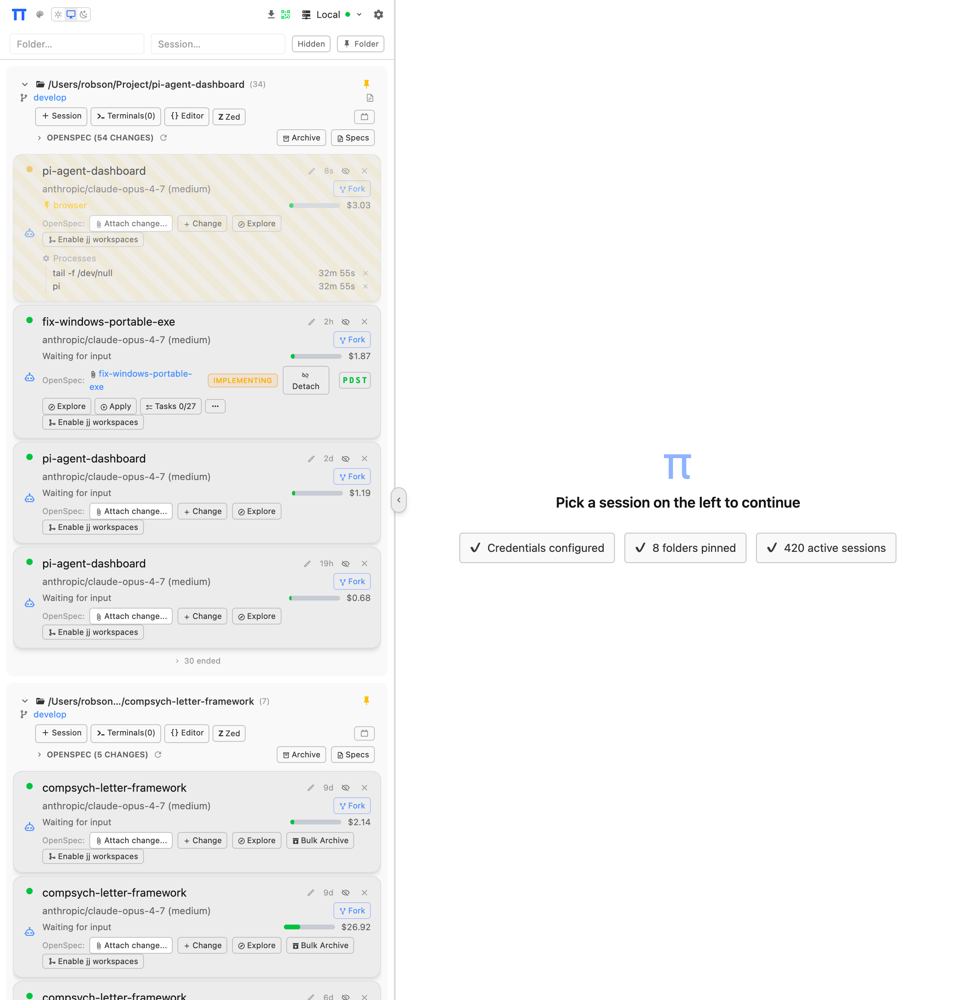
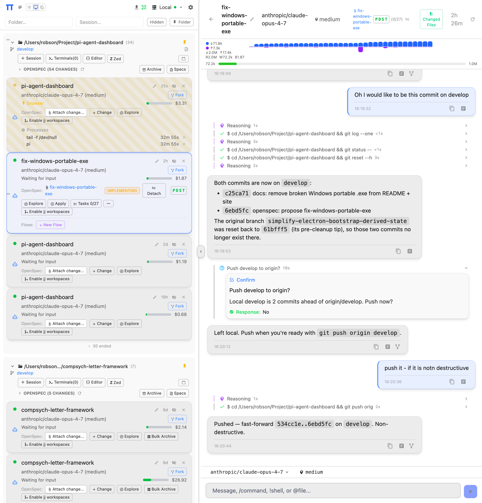
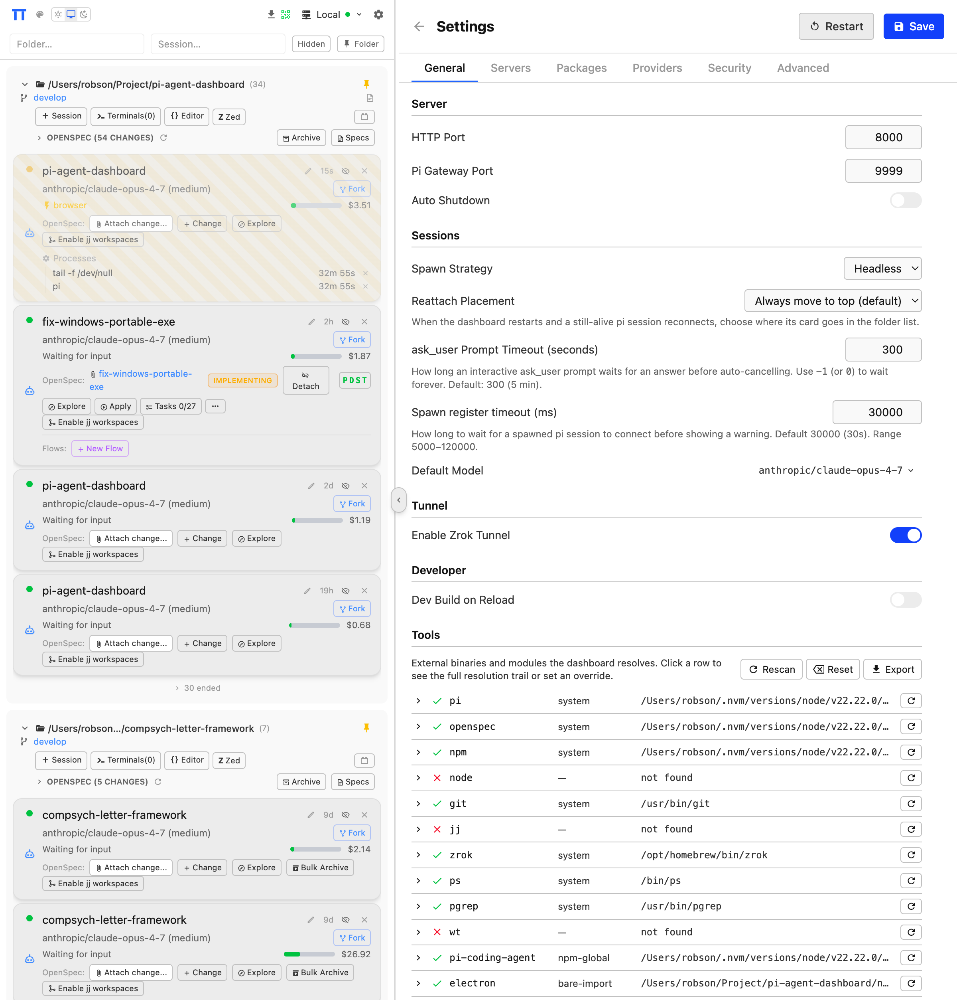
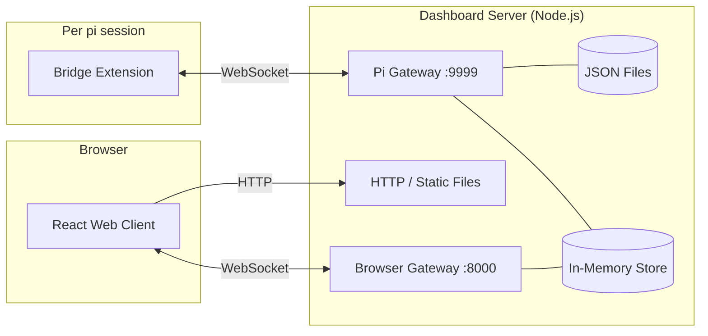
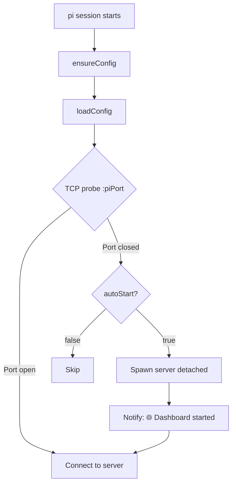

# PI Dashboard

[](https://github.com/BlackBeltTechnology/pi-agent-dashboard/actions/workflows/ci.yml)
[](https://www.npmjs.com/package/@blackbelt-technology/pi-agent-dashboard)
[](https://opensource.org/licenses/MIT)

**One browser tab to command an army of [pi](https://github.com/badlogic/pi-mono) agents.** Spawn parallel sessions, watch reasoning live, attach OpenSpec changes, ship work — from your laptop or phone.

🌐 **Website & demo:** [blackbelttechnology.github.io/pi-agent-dashboard](https://blackbelttechnology.github.io/pi-agent-dashboard) — animated tour, screenshots, and install guide.
📝 **Changelog:** [`CHANGELOG.md`](CHANGELOG.md)

> **Note:** This dashboard only works with [pi](https://github.com/badlogic/pi-mono). Oh My Pi is **not** supported.

---

## Screenshots

<table>
<tr>
<td width="33%" align="center"><a href="docs/screenshots/readme-overview.png"></a><br/><sub><b>Overview</b> — sessions grouped by folder, branch & OpenSpec context, live cost</sub></td>
<td width="33%" align="center"><a href="docs/screenshots/readme-session.png"></a><br/><sub><b>Session</b> — chat, OpenSpec apply, interactive <code>ask_user</code>, context gauge</sub></td>
<td width="33%" align="center"><a href="docs/screenshots/readme-settings.png"></a><br/><sub><b>Settings</b> — ports, spawn strategy, zrok tunnel, tool resolution</sub></td>
</tr>
</table>

---

## Table of contents

- [Quickstart](#quickstart)
- [Features](#features)
- [Prerequisites](#prerequisites)
- [Configuration](#configuration)
- [Usage](#usage)
- [Recommended extensions](#recommended-extensions)
- [Authoring a dashboard plugin](#authoring-a-dashboard-plugin)
- [Troubleshooting](#troubleshooting)
- [Architecture](#architecture)
- [Monitoring](#monitoring)
- [Development](#development)
- [Building the Electron app](#building-the-electron-app)
- [CI/CD & releasing](#cicd--releasing)
- [License](#license)

---

## Quickstart

Three install paths, pick one:

### A — Electron desktop app (no prerequisites)

Download a pre-built installer from [GitHub Releases](https://github.com/BlackBeltTechnology/pi-agent-dashboard/releases):

| Platform | Download |
|----------|----------|
| **macOS** (Apple Silicon / Intel) | `.dmg` (arm64 / x64) |
| **Linux** (x64 / ARM64) | `.deb` or `.AppImage` |
| **Windows** (x64 / ARM64) | `.zip` |

On first launch a setup wizard walks you through mode selection (standalone vs. power-user), API key / OAuth sign-in, and [recommended extensions](#recommended-extensions). The standalone mode bundles Node.js and auto-installs pi + dashboard + openspec into `~/.pi-dashboard/` — **no terminal, npm, or Node.js required**.

**Picking the right macOS DMG:** run `uname -m` in Terminal — `arm64` means Apple Silicon (M1/M2/M3/M4), `x86_64` means Intel. Or open   Apple menu → About This Mac and read the chip name. Download the matching DMG; if you grab the wrong one macOS will refuse to launch the app with a "cannot be opened" error.

**First-run unblocking (unsigned binaries):**

- **macOS** — the DMGs are not yet notarized. Either right-click `PI-Dashboard.app` → *Open* the first time, or clear all extended attributes from Terminal:
  ```bash
  xattr -cr /Applications/PI-Dashboard.app
  ```
  Use `-cr` (clear, recursive) rather than `-d com.apple.quarantine` — it's idempotent and won't print `No such xattr: com.apple.quarantine` when the attribute isn't there. That message is harmless; it just means quarantine was never set or already cleared.
- **Windows** — SmartScreen warns on first launch. Click *More info → Run anyway*, or right-click the downloaded `.exe` / `.zip` → *Properties* → tick *Unblock* → *OK* before running. For ZIPs, unblock the archive before extracting.

> **Note:** A future release will rename the macOS DMGs to `PI-Dashboard-darwin-arm64-<ver>.dmg` and `PI-Dashboard-darwin-x64-<ver>.dmg` (previously a single `PI Dashboard.dmg` was produced and silently overwrote one arch on each release). Direct download links pointing at the unsuffixed filename will 404 from that release onward; please link to the [Releases page](https://github.com/BlackBeltTechnology/pi-agent-dashboard/releases) instead. See OpenSpec change `fix-darwin-dmg-arch-collision`.

### B — pi package (recommended for CLI users)

If you don't have pi yet, you can install the dashboard directly via npm — pi/openspec/tsx ship as regular npm dependencies, so a single install brings everything in:

```bash
npm install -g @blackbelt-technology/pi-agent-dashboard
pi-dashboard
# open http://localhost:8000
```

If pi is already installed, the bridge-extension flow is equivalent:

```bash
pi install npm:@blackbelt-technology/pi-agent-dashboard
pi
```

The bridge extension auto-starts the dashboard server on first launch:

```
🌐 Dashboard started at http://localhost:8000
```

Open **http://localhost:8000** in any browser. All active pi sessions appear automatically. See [Prerequisites](#prerequisites) for Node.js / build-tool requirements.

#### Windows install (PowerShell, Administrator)

Windows has a few extra one-time setup steps. Run the following in an **Administrator** PowerShell session:

```powershell
# 1. Enable long paths (required — npm node_modules nesting exceeds 260 chars)
reg add "HKLM\SYSTEM\CurrentControlSet\Control\FileSystem" /v LongPathsEnabled /t REG_DWORD /d 1 /f

# 2. Install Node.js LTS 22 via winget (ships >= 22.18 so no node-guard refusal)
winget install -e --id OpenJS.NodeJS.LTS --accept-source-agreements --accept-package-agreements

# 3. CLOSE this PowerShell, open a NEW one as Administrator (PATH refresh)

# 4. Verify
node --version    # expect v22.18+ (any 22.x >= 22.18, NOT v22.0–v22.17)
npm --version     # expect 10.x

# 5. Install
npm install -g @blackbelt-technology/pi-agent-dashboard

# 6. Start (foreground first time so you can see any errors)
pi-dashboard start

# 7. From the browser
start http://localhost:8000
```

C++ build tools are typically **not** required — `node-pty` ships a Windows x64 prebuild. Install Visual Studio Build Tools only if the prebuild fails to load. See [docs/installation-windows.md](docs/installation-windows.md) for more detail (offline / tarball / nvm-windows caveats).

### C — From source (contributors)

```bash
git clone https://github.com/BlackBeltTechnology/pi-agent-dashboard.git
cd pi-agent-dashboard
npm install
npm run build                              # one-time client build
pi install /path/to/pi-agent-dashboard     # global
# or: pi install -l /path/to/pi-agent-dashboard   # project-local only
```

#### Use the local checkout as the global `pi-dashboard` command

By default, `pi-dashboard` on your PATH refers to whatever copy was installed globally (via `npm i -g` or the Electron bundle). To make it point at your working tree instead — so every edit is live and bridge auto-start uses your changes — link the workspace:

```bash
npm run link:local      # symlinks `pi-dashboard` on PATH to packages/server/bin/pi-dashboard.mjs
pi-dashboard status
npm run unlink:local    # restore (removes the global symlink)
```

The link survives across shells. Every invocation — including `pi`'s bridge auto-spawn — runs `packages/server/src/cli.ts` via jiti, so you don't need to rebuild the server on edits. The client still requires `npm run build` (or `npm run dev` for HMR).

> **Windows note:** symlink creation needs an admin shell or Windows Developer Mode enabled. Everything else works the same as POSIX.

To try the extension in a single pi session without registering it:

```bash
pi -e /path/to/pi-agent-dashboard/packages/extension/src/bridge.ts
```

Remove with `pi remove /path/to/pi-agent-dashboard`. Alternatively, add the package path directly to `~/.pi/agent/settings.json` (global) or `.pi/settings.json` (project) under `"packages": [...]`.

---

## Features

**Sessions & chat**
- **Real-time session mirroring** — all active pi sessions with live streaming messages
- **Bidirectional interaction** — send prompts and commands from the browser
- **Session statistics** — token counts, costs, model info, thinking level, context usage bar
- **Elapsed time tracking** — live ticking counters on running operations, final duration on completed tool calls and reasoning blocks
- **Session spawning** — launch new pi sessions from the dashboard (headless by default, or via tmux)
- **On-demand session loading** — browse historical sessions with lazy-loaded content from pi session files
- **Force kill escalation** — two-click Stop button; first click sends soft abort, second force-kills (SIGTERM → SIGKILL). Session preserved as "ended" for resume/fork.

**Workspace & UI**
- **Workspace management** — organize sessions by project folder with pinned directories and drag-to-reorder
- **Command autocomplete** — `/` prefix triggers a filtering dropdown
- **Mobile-friendly** — responsive layout with swipe drawer, touch targets, and mobile action menus
- **Markdown preview** — rendered markdown views with search, mermaid diagrams, syntax highlighting, and safe handling for raw HTML `ref` attributes
- **Local-image inlining + LaTeX math in chat** — agents can reference local screenshots inline as `` or `` and they render in chat (the bridge inlines bytes via a streaming-safe `pi-asset:<hash>` channel — each unique image's bytes ride exactly once per session, no matter how many streaming chunks repeat the token). Math expressions — inline `$x = \beta$` and display `$$\sum_i^n i$$` (block-level) — are typeset via KaTeX. PNG / JPEG / GIF / WebP / SVG / AVIF / BMP supported with a 5 MB-per-image, 20 MB-per-message cap; oversized or unreadable references render as a visible placeholder rather than a broken-image glyph. The dashboard server adds zero new HTTP routes.
- **Searchable select dialogs** — keyboard-navigable picker with real-time filtering (OpenSpec changes, flow commands)

**Integrations**
- **PromptBus architecture** — unified prompt routing with adapters (TUI, dashboard, custom). Interactive dialogs (confirm/select/input/editor/multiselect) survive page refresh and server restart. Multiselect uses the bus-routed browser path exclusively (the dashboard `MultiselectRenderer` dialog) since pi 0.70's RPC mode has no working terminal-overlay primitive. First-response-wins semantics with cross-adapter dismissal.
- **Extension UI System (Phase 1)** — extensions can declare slash-command-triggered modal UIs as data, without authoring React or importing an SDK. Listen on `pi.events.on("ui:list-modules", probe)` and push descriptors into `probe.modules`; the dashboard renders `table` / `grid` / `form` views with row actions, optional confirm-dialog gates, and MDI icons. Modules survive reconnect via the server-side cache; in pure-pi mode descriptors stay dormant. See `openspec/specs/extension-ui-system/spec.md` for the protocol contract.
- **pi-flows integration** — live flow execution dashboard with agent cards, detail views, flow graph, summary, abort/auto controls. Launch flows and design new ones with Flow Architect, all from the browser. Fork decisions and subagent dialogs forwarded via PromptBus.
- **OpenSpec integration** — browse specs, view archive history, manage changes, create new changes from the sidebar
- **Browser-based provider auth** — sign in to Anthropic, OpenAI Codex, GitHub Copilot, Gemini CLI, and Antigravity from Settings. Enter API keys for other providers. Credentials saved to `~/.pi/agent/auth.json` and live-synced to running sessions.
- **Custom LLM providers** — add OpenAI-compatible, Anthropic-compatible, or Google Generative AI endpoints (Settings → Providers → LLM Providers). **Test** button verifies the base URL + API key before saving. Adding / editing / removing takes effect live in every running session — no restart.
- **Package management** — browse, install, update, remove, and **move** pi packages between global and project scopes from a single rich-row UI used in both Settings and Pi Resources. Install dialog exposes a Local/Global radio when launched from a per-folder context. Search the npm registry for pi-package extensions/skills/themes; install from npm or git URL. Active sessions auto-reload after changes.

**Dev tools**
- **Integrated terminal** — full browser-based terminal emulator (xterm.js + node-pty) with ANSI colors, scrollback, and keep-alive
- **Diff viewer** — side-by-side and unified diff views with file tree navigation. In Jujutsu workspaces the diff is regime-aware: shows the cumulative changes since the workspace's branch point, not just the working-copy delta.
- **Editor integration** — open files in VS Code, Cursor, etc. directly from tool call cards
- **Jujutsu workspaces (optional)** — when `jj` is on PATH and the session is inside a `.jj/` repo, the dashboard surfaces a workspace badge, a `+ Workspace` action that creates `jj workspace add` + spawns a fresh agent in it, and a `Fold back` action that drives the [`jj-workspace-fold-back`](.pi/skills/jj-workspace-fold-back/SKILL.md) skill (jj-native rebase + push, never `git commit`/`git merge`). Activates silently — zero UI when `jj` is not installed. See [docs/architecture.md](docs/architecture.md#jujutsu-workspaces) for the data flow.

**Networking & distribution**
- **Network discovery** — mDNS-based auto-discovery of other dashboard servers on the local network
- **Zrok tunnel** — optional persistent public URL via reserved shares (see [Configuration → Tunnel](#tunnel-zrok))

---

## Prerequisites

**Only needed for Quickstart paths B and C.** The Electron app (path A) bundles everything in standalone mode.

| Requirement | Why | Install |
|-------------|-----|---------|
| **[pi](https://github.com/badlogic/pi-mono)** | The AI coding agent the dashboard monitors | `npm i -g @mariozechner/pi-coding-agent` |
| **Node.js ≥ 22.18.0** | Server runtime. Older 22.x / 24.x < 24.3.0 are affected by [nodejs/node#58515](https://github.com/nodejs/node/issues/58515) which crashes Fastify at startup. | [nodejs.org](https://nodejs.org/) |
| **C++ build tools** | Required by `node-pty` native addon for the integrated terminal | Xcode CLI Tools (macOS) / `build-essential` (Linux) |

Optional:

| Tool | Purpose | When needed |
|------|---------|-------------|
| **tmux** | Spawn new pi sessions in a tmux window | When `spawnStrategy` is `"tmux"` |
| **[zrok](https://zrok.io/)** | Public tunnel with persistent URLs | When `tunnel.enabled` is `true` (default) |

---

## Configuration

- **Config file:** `~/.pi/dashboard/config.json` (auto-created with defaults on first run)
- **Tool overrides (machine-local):** `~/.pi/dashboard/tool-overrides.json` — see [Tool overrides](#tool-overrides)
- **Settings UI:** click the ⚙ gear icon in the sidebar header to edit all fields from the browser

### Precedence & keys

CLI flags → environment variables → config file → built-in defaults.

| CLI flag | Env var | Config key | Default | Description |
|----------|---------|------------|---------|-------------|
| `--port` | `PI_DASHBOARD_PORT` | `port` | `8000` | HTTP + browser WebSocket port |
| `--pi-port` | `PI_DASHBOARD_PI_PORT` | `piPort` | `9999` | Pi extension WebSocket port |
| `--dev` | — | — | `false` | Development mode (proxy to Vite) |
| `--no-tunnel` | — | `tunnel.enabled` | `true` | Disable zrok tunnel |
| — | — | `autoStart` | `true` | Bridge auto-starts server if not running |
| — | — | `autoShutdown` | `false` | Server shuts down when idle |
| — | — | `shutdownIdleSeconds` | `300` | Seconds idle before auto-shutdown |
| — | — | `spawnStrategy` | `"headless"` | Session spawn mode: `"headless"` or `"tmux"` |
| — | — | `reattachPlacement` | `"always"` | After a dashboard restart, where re-registering bridges land in folder lists. `"always"` (top), `"streaming-only"` (only mid-completion), `"preserve"` (legacy: keep prior drag order) |
| — | — | `devBuildOnReload` | `false` | Rebuild client + restart server on `/reload` |
| — | — | `askUserPromptTimeoutSeconds` | `300` | `ask_user` prompt timeout in seconds. `≤ 0` (e.g. `-1`) = wait indefinitely |

The bridge also honours `PI_DASHBOARD_URL=ws://host:port` to point at a remote server instead of localhost.

### Minimal `config.json`

```json
{
  "port": 8000,
  "piPort": 9999,
  "autoStart": true,
  "autoShutdown": false,
  "shutdownIdleSeconds": 300,
  "spawnStrategy": "headless",
  "tunnel": { "enabled": true, "reservedToken": "auto-created-on-first-run" },
  "devBuildOnReload": false,
  "askUserPromptTimeoutSeconds": 300,
  "openspec": {
    "pollIntervalSeconds": 30,
    "maxConcurrentSpawns": 3,
    "changeDetection": "mtime",
    "jitterSeconds": 5
  }
}
```

### Authentication (optional)

OAuth2 authentication guards external (tunnel) access. Localhost is always unguarded.

```json
{
  "auth": {
    "secret": "auto-generated-if-omitted",
    "providers": {
      "github":   { "clientId": "...", "clientSecret": "..." },
      "google":   { "clientId": "...", "clientSecret": "..." },
      "keycloak": { "clientId": "...", "clientSecret": "...", "issuerUrl": "https://keycloak.example.com/realms/myrealm" }
    },
    "allowedUsers": ["octocat", "user@example.com", "*@company.com"]
  }
}
```

| Key | Required | Description |
|-----|----------|-------------|
| `auth.secret` | No | JWT signing secret (auto-generated if omitted) |
| `auth.providers` | Yes | Map of provider → `{ clientId, clientSecret, issuerUrl? }` |
| `auth.allowedUsers` | No | Allowlist: usernames, emails, or `*@domain` wildcards. Empty = allow all |

**Supported providers:** `github`, `google`, `keycloak`, `oidc` (generic OIDC with `issuerUrl`).

**Callback URL:** register `https://<tunnel-url>/auth/callback/<provider>` in your OAuth provider settings. The tunnel URL is stable across restarts (reserved shares are auto-created).

> **Security note:** `/api/spawn-failures` is reachable to any caller on deployments without auth; entries contain `cwd` paths. Enable auth before exposing via tunnel.

### Tunnel (zrok)

The dashboard auto-connects a [zrok](https://zrok.io/) tunnel on start when `tunnel.enabled` is `true`. Install with `brew install zrok` (macOS) and run `zrok enable <token>` to enrol — the dashboard reads zrok's own config (`~/.zrok2/environment.json`), no keys are stored in the dashboard. Reserved shares provide persistent URLs across restarts.

### OpenSpec background polling

Tune how often the server polls known directories for OpenSpec updates (`openspec` block):

| Key | Default | Range | Description |
|-----|---------|-------|-------------|
| `pollIntervalSeconds` | `30` | `5–3600` | How often each known directory is polled |
| `maxConcurrentSpawns` | `3` | `1–16` | Cap on concurrent `openspec` CLI invocations |
| `changeDetection` | `"mtime"` | `"mtime" \| "always"` | `mtime` skips unchanged proposals; `always` polls unconditionally |
| `jitterSeconds` | `5` | `0–60` | Per-directory phase offset so polls don't align on the same tick |

Live-reconfigurable via Settings → Advanced → "Background polling (OpenSpec)" or `PUT /api/config` — no server restart needed. See [docs/architecture.md](docs/architecture.md) for the cost model.

### Tool overrides

The dashboard resolves every external tool it calls (`pi`, `pi-coding-agent`, `openspec`, `npm`, `node`, `tsx`, `git`, `zrok`, `pi-dashboard`) through a single `ToolRegistry`. Each tool has an ordered strategy chain (override → managed install → bare-import / npm-global → PATH search), and every resolution records a diagnostic trail.

**Inspecting and overriding** — Settings → General → **Tools** shows every resolved tool, its source, and the trail. You can set a per-tool override path, rescan individually or all at once, and export the full diagnostic report.

**Overrides file** — `~/.pi/dashboard/tool-overrides.json`:

```json
{
  "version": 1,
  "overrides": {
    "pi":              { "path": "C:\\custom\\pi.cmd" },
    "pi-coding-agent": { "path": "D:\\dev\\pi-coding-agent\\dist\\index.js" }
  }
}
```

The file is deliberately separate from `config.json` so machine-specific paths don't follow a dotfiles sync. Invalid overrides (path doesn't exist) are recorded in the trail and the registry falls through to the next strategy automatically.

---

## Using the model proxy

The dashboard exposes an OpenAI-compatible HTTP proxy on the same port as the dashboard UI (`/v1/...`). Any LLM client that accepts a custom `base_url` can use it.

```bash
# Example: point an OpenAI-compatible client at the dashboard
export OPENAI_BASE_URL=http://localhost:8000/v1
export OPENAI_API_KEY=pi-proxy-<your-proxy-key>
```

**Setup:** open Settings → API Proxy in the dashboard UI, enable the proxy, and create an API key.

**Endpoints:**
- `GET /v1/models` — list available models (requires `models:list` scope or `all`)
- `POST /v1/chat/completions` — OpenAI chat completions, streaming + non-streaming
- `POST /v1/messages` — Anthropic messages, streaming + non-streaming

**Auth:** proxy API keys only (`pi-proxy-*` prefix). Dashboard JWT is never accepted on `/v1/*`.

For migration from `@blackbelt-technology/pi-model-proxy`, see [`docs/migration/from-pi-model-proxy.md`](docs/migration/from-pi-model-proxy.md).

## Usage

### Auto-start (default)

The bridge extension **automatically starts the dashboard server** when pi launches if it's not already running. Disable with `"autoStart": false` in `~/.pi/dashboard/config.json`.

In the Electron app, if the initial launch attempts fail (or the server is stopped externally), the **loading page exposes a Start server button**, an **Open Doctor link**, and a collapsible **Server log** panel showing the last 20 lines of `~/.pi/dashboard/server.log`. The system tray menu also includes a **Start server / Restart server** item that reflects current server state. All entry points share a single idempotent launch routine in the Electron main process.

**Doctor diagnostics.** Help → Doctor (or the loading-page link) opens a styled `BrowserWindow` (`doctor.html`) that runs the same checks the Electron app already performed — grouped into sections (Runtime, Pi, Server, Bundles, Diagnostics) with status pills, paths, and per-row suggestion callouts; toolbar offers Re-run, Copy as Markdown / Plain, Open server log, Open doctor log, Run setup wizard. The web client exposes the portable subset at **Settings → Diagnostics**, which fetches `/api/doctor` and renders the same sections (Electron-only rows omitted). Both surfaces share `packages/shared/src/doctor-core.ts`, so a check defined once shows up everywhere.

### Daemon mode

```bash
pi-dashboard start           # background daemon (production)
pi-dashboard start --dev     # dev mode (proxy to Vite, fallback to production build)
pi-dashboard stop            # stop daemon (also kills stale port holders)
pi-dashboard restart         # restart (production)
pi-dashboard restart --dev   # restart in dev mode
pi-dashboard status          # daemon status
```

Daemon stdout/stderr is logged to `~/.pi/dashboard/server.log` (append mode with timestamped headers per start).

### Manual server start

```bash
npx tsx packages/server/src/cli.ts
npx tsx packages/server/src/cli.ts --port 8000 --pi-port 9999
npx tsx packages/server/src/cli.ts --dev   # proxy to Vite dev server
```

### Graceful restart via API

```bash
# Restart in the same mode
curl -X POST http://localhost:8000/api/restart

# Switch to dev / production
curl -X POST http://localhost:8000/api/restart -H 'Content-Type: application/json' -d '{"dev":true}'
curl -X POST http://localhost:8000/api/restart -H 'Content-Type: application/json' -d '{"dev":false}'

# Check current mode
curl -s http://localhost:8000/api/health | jq .mode
```

The restart endpoint waits for the old server to exit, starts the new one, and verifies health. It works identically on Windows, macOS, and Linux (no `sh` / `lsof` / `curl` dependency).

### Dev mode with production fallback

When started with `--dev`, the server proxies client requests to the Vite dev server for HMR. If Vite is **not running**, it automatically falls back to serving the production build from `dist/client/`:

- `pi-dashboard start --dev` **always works** — no 502 errors
- Start/stop Vite independently without restarting the dashboard
- Start Vite later and refresh the browser to get HMR

### Dev build on reload

Set `"devBuildOnReload": true` in `config.json` for a one-command full-stack refresh:

```
/reload → build client → stop server → reload extension → auto-start fresh server
```

> Blocks pi for ~2–5s during the build. The server shutdown affects all connected sessions — they auto-reconnect when one restarts the server.

### Session spawning

**Headless** (default) — runs pi as a background process with no terminal attached. Interaction through the web UI.

**tmux** — runs pi inside a tmux session named `pi-dashboard`, each spawned session as a new window:

```bash
tmux attach -t pi-dashboard                # attach
tmux list-windows -t pi-dashboard          # list windows
# inside tmux: Ctrl-b n / p / w           # next / prev / picker
```

Switch with `"spawnStrategy": "tmux"` in `~/.pi/dashboard/config.json`.

### Keyboard shortcuts in chat input

Bash-style history recall and per-session draft persistence:

| Key | Action |
|-----|--------|
| `Enter` | Send the prompt |
| `Shift+Enter` | Insert a newline |
| `ArrowUp` | Recall previous user prompt (caret on first line, no dropdown open). Repeat to walk back |
| `ArrowDown` | Walk forward through history (caret on last line). Past the newest entry, restores the in-progress draft |
| `Escape` | Restore in-progress draft and exit history mode; also cancels pending prompt / dismisses dropdown |
| `Tab` / `Enter` in dropdown | Accept the highlighted `/command` or `@file` suggestion |

Drafts (typed-but-unsent text) are persisted per session in `localStorage` under `chat-draft:<sessionId>` and survive navigation (Settings, OpenSpec preview, diffs, …) and full page reloads. Drafts never leak between sessions.

---

## Recommended extensions

The dashboard integrates tightly with a small, curated set of pi extensions — for custom tool rendering, the Flow dashboard, and anthropic-messages protocol compatibility. The Electron wizard installs them in one go; the **Packages** tab and a top-of-page banner keep them discoverable afterwards.

| Extension | Source | Status | Unlocks |
|---|---|---|---|
| `pi-anthropic-messages` | `git@github.com:BlackBeltTechnology/pi-anthropic-messages.git` | **required** | Tool calls on Claude-model Anthropic OAuth / 9Router `cc/*` / pi-model-proxy providers. Without it, tool calls fall back to Claude Code's built-in `bash_ide` sandbox and fail. |
| `pi-dashboard-subagents` | `https://github.com/BlackBeltTechnology/pi-dashboard-subagents.git` | optional (bundled) | `Agent` tool card UI, subagent inspector (inline expand + popout), agent-md path display |
| `pi-flows` | `git@github.com:BlackBeltTechnology/pi-flows.git` | strongly suggested | Flow dashboard, role aliases (`@planning`, `@coding`, …), subagent / flow_write / flow_results / agent_write / ask_user / skill_read / finish tools |
| `pi-web-access` | `npm:pi-web-access` | strongly suggested | `web_search`, `code_search`, `fetch_content`, `get_search_content` |
| `pi-agent-browser` | `npm:pi-agent-browser` | optional | `browser` tool (open, snapshot, click, screenshot) |

Authoritative source: `packages/shared/src/recommended-extensions.ts`. Descriptions, versions, and installed-state are enriched live via `GET /api/packages/recommended` (offline fallback).

---

## Authoring a dashboard plugin

The dashboard's UI is composed of named **slots** that plugins claim with React components. To create a new plugin, install the scaffolding skill:

```bash
npm i -g @blackbelt-technology/pi-dashboard-plugin-skill
```

Then, from any pi session:

```
/skill dashboard-plugin-scaffold
```

The skill has two modes:

- **`new`** — scaffold a fresh `packages/<id>-plugin/` inside this monorepo. Pick which of the 10 React slots to claim (`session-card-badge`, `content-view`, `settings-section`, `tool-renderer`, …); the skill renders package.json (with `pi-dashboard-plugin` manifest), `src/client.tsx` with stubs, optional `src/server/index.ts`, optional `src/bridge/index.ts`, `configSchema.json`, and tests.
- **`augment`** — retrofit an existing pi-extension project on disk. The skill greps for TUI surface (`ctx.ui.*`, `pi.registerTool`, …), drives the agent through a canonical mapping table, asks per-callsite what to port, then injects a manifest field into `package.json` and adds `src/dashboard/`. Purely additive — your existing TUI keeps working in pure-pi sessions.

For the slot taxonomy, the manifest schema, and the plugin context API, see the skill's reference docs (or the runtime: [`@blackbelt-technology/dashboard-plugin-runtime`](https://www.npmjs.com/package/@blackbelt-technology/dashboard-plugin-runtime)). The reference fixture is [`packages/demo-plugin/`](packages/demo-plugin/).

---

## Troubleshooting

### Dashboard server doesn't start

If `pi` launches but the dashboard never becomes reachable, inspect the launch log:

```bash
cat ~/.pi/dashboard/server.log                          # Linux / macOS
type %USERPROFILE%\.pi\dashboard\server.log             # Windows
```

The log is append-mode with timestamped headers per start attempt, so previous crashes are preserved. Common issues:

- **`ERR_UNSUPPORTED_ESM_URL_SCHEME` on Windows** — fully fixed in 0.4.0+. The 0.2.10 release wrapped the `--import` loader position as a `file://` URL, but the entry-script position stayed a raw Windows path — which crashed Node on non-`C:` drives (`A:\`, `B:\`, …) because the drive-letter heuristic has gaps there. 0.4.0 routes all four server-spawn call sites through a single `spawnNodeScript` / `toFileUrl` helper that wraps both positions unconditionally, and a repo-level lint test prevents regression. Upgrade the package.
- **`Cannot find pi's TypeScript loader`** — pi is not installed globally. Run `npm install -g @mariozechner/pi-coding-agent`.
- **Fastify crash at startup** — you're on Node 22.0.0–22.17.x or 24.1.0–24.2.x which are affected by [nodejs/node#58515](https://github.com/nodejs/node/issues/58515). Upgrade to 22.18+ or 24.3+.

### Port already in use

- **Windows:** `netstat -ano | findstr :8000` then `taskkill /F /PID <pid>`
- **Unix:** `lsof -t -i :8000 | xargs kill`
- Or change `port` in `~/.pi/dashboard/config.json`.

### UI is empty or stuck after switching servers

Since the `safe-server-switch` release, switching servers via the header dropdown is **transactional**: the UI verifies the target through a short-lived staging WebSocket (5 s timeout) **before** clearing state or writing `localStorage`. If the target is unreachable, nothing changes — a toast appears and you stay on the previous server.

If the currently-active server drops for more than 3 s, a yellow **“Disconnected from \<host\>. Retrying…”** banner appears at the top with a **Switch server** button — use it to pick a reachable server.

You should no longer need to manually `localStorage.removeItem("pi-dashboard-last-server")` to recover from a bad switch. If you still get stuck, please file an issue.

### Windows: sessions die when the dashboard restarts

Since the `consolidate-windows-spawn-and-platform-handlers` release, pi sessions on Windows **survive dashboard restart**, matching macOS/Linux behaviour. Previously, killing the dashboard process (Task Manager, Ctrl+C, `/api/restart`, crash) terminated every running pi session because the children were in the server's libuv kill-on-close Job Object. The fix uses `detached: true` so children are excluded from the parent's job.

If you previously relied on "closing the dashboard cleans everything up," use the per-session **Force Kill** action instead (or `POST /api/session/:id/force-kill`).

### Windows Terminal tab doesn't appear

Install Windows Terminal (`wt.exe`) for tabbed interactive sessions — the dashboard prefers it over WSL tmux / headless when available. Windows 11 ships with it; on Windows 10 install from the Microsoft Store.

If `wt.exe` is on PATH but launching does nothing, check **Settings → Apps → Advanced app settings → App execution aliases**. If the "wt" alias is disabled, `wt.exe` is found but can't be executed. Enable the alias or uninstall/reinstall Windows Terminal.

### Sessions don't group under my pinned folder

Since v0.3+, session grouping uses OS-aware path equality (`platform/paths.ts`). Sessions group correctly under a pinned folder even across trailing-separator, separator-style, or case differences (on Windows and macOS).

If you still see two entries for what should be one folder, the paths are likely on different Windows drives (`A:\Foo` and `B:\Foo` are different filesystems and never merge) — that's correct behaviour. If the paths really are the same filesystem, file an issue with both the pinned path (Settings → Tools → Export diagnostics) and the session `cwd` from `/api/sessions`.

### Tool not found (pi / openspec / npm / …)

Open **Settings → General → Tools**, click the chevron next to the failing tool to see the full `tried[]` trail, then either (a) install the missing tool on PATH / in the managed location shown in the trail, or (b) set an explicit override via the row's path input. Hit **Rescan** to pick up the change without a server restart.

### Recommended extensions: "Permission denied (publickey)"

`pi-flows` and `pi-anthropic-messages` install via SSH (`git@github.com:…`). If your system has no GitHub SSH key, set one up following [GitHub's SSH docs](https://docs.github.com/en/authentication/connecting-to-github-with-ssh), or substitute the equivalent HTTPS URL in the manifest if your fork is public.

---

## Architecture



| Component | Location | Role |
|-----------|----------|------|
| **Bridge Extension** | `packages/extension/` | Runs in every pi session. Forwards events, relays commands, auto-starts server, hosts PromptBus. |
| **Dashboard Server** | `packages/server/` | Aggregates events in-memory, persists metadata to JSON, serves the web client, manages terminals. |
| **Web Client** | `packages/client/` | React + Tailwind UI with real-time WebSocket updates. |
| **Shared** | `packages/shared/` | TypeScript types, protocols, and utilities shared across all packages. |
| **Plugin Runtime** | `packages/dashboard-plugin-runtime/` | Plugin loader, slot registry, slot consumers, plugin context API, and Vite plugin. |

First-party features can live as separate monorepo packages by declaring a `pi-dashboard-plugin` field in their `package.json`. The Vite plugin auto-discovers these manifests at build time and generates a static registry (`packages/client/src/generated/plugin-registry.tsx`) using named imports for tree-shaking. During server startup, `loadServerEntries()` dynamic-imports each plugin's server entry and invokes `registerPlugin(ctx: ServerPluginContext)`. See [docs/architecture.md](docs/architecture.md#plugin-architecture) for the full plugin data flow.

See [docs/architecture.md](docs/architecture.md) for detailed data flows, reconnection logic, and persistence model.

### Auto-start flow



The server is spawned detached (`child_process.spawn` with `detached: true`, `unref()`), so it outlives the pi session. Duplicate spawn attempts from concurrent pi sessions fail harmlessly with `EADDRINUSE`.

---

## Monitoring

The health endpoint provides server and agent process metrics:

```bash
curl -s http://localhost:8000/api/health | jq
```

Returns:
- `mode` — `"dev"` or `"production"`
- `server.rss`, `server.heapUsed`, `server.heapTotal` — server memory
- `server.activeSessions`, `server.totalSessions` — session counts
- `agents[]` — per-agent metrics (CPU%, RSS, heap, event loop max delay, system load)

Agent metrics are collected every 15s via heartbeats and include `eventLoopMaxMs` — useful for diagnosing connection drops during long-running operations.

---

## Development

### Commands

```bash
npm install          # Install dependencies
npm test             # Run all tests (vitest)
npm run test:watch   # Watch mode
npm run build        # Build web client (Vite)
npm run dev          # Start Vite dev server (HMR)
npm run lint         # Type-check (tsc --noEmit)
npm run reload       # Reload all connected pi sessions
npm run reload:check # Type-check + reload all pi sessions
```

### Typical local dev workflow

```bash
# Terminal 1: Dashboard server in dev mode
npx tsx packages/server/src/cli.ts --dev

# Terminal 2: Vite dev server (HMR for the web client)
npm run dev

# Terminal 3: pi with the bridge extension
pi -e packages/extension/src/bridge.ts   # or just `pi` if installed

# Open http://localhost:8000 (server proxies to Vite for SPA routes + assets)
# Or http://localhost:3000 (Vite directly, proxies API/WS to :8000)
```

### Deploy after changes

```bash
# After client changes (production mode)
npm run build
curl -X POST http://localhost:8000/api/restart

# After server changes (runs TypeScript directly, no build needed)
curl -X POST http://localhost:8000/api/restart

# After bridge extension changes
npm run reload

# Full rebuild (e.g., after pulling updates)
npm run build
curl -X POST http://localhost:8000/api/restart
npm run reload
```

### Extension UI events

Your own extensions can broadcast UI events to the dashboard:

```typescript
pi.events.emit("dashboard:ui", {
  method: "notify",
  message: "Deployment complete!",
  level: "success",
});
```

Supported methods: `confirm`, `select`, `input`, `notify`.

### Project structure

Monorepo with npm workspaces — top-level layout only. See [AGENTS.md](AGENTS.md) for the full file-by-file index.

```
packages/
├── shared/      # Shared TypeScript types, protocols, config, session-meta helpers
├── extension/   # Bridge extension (runs inside pi) — WS client, PromptBus, event forwarding, auto-start
├── server/      # Dashboard server — HTTP + dual WebSocket gateways, in-memory store, terminals, auth, tunnel
├── client/      # React + Tailwind web client — 80+ components, hooks, event reducer
└── electron/    # Electron desktop wrapper — wizard, system tray, auto-update, bundled Node.js
```

---

## Building the Electron app

> **Prerequisites:** Node.js 22.12+; platform-specific tools handled by Electron Forge automatically.

### Native build (current platform)

```bash
npm run electron:build                    # Build for current platform & arch
npm run electron:build -- --arch x64      # Override architecture
npm run electron:build -- --skip-client   # Skip client rebuild
```

Or step by step:

```bash
npm run build                         # Build web client
cd packages/electron
bash scripts/download-node.sh         # Download Node.js for bundling
npm run make                          # Build installer
```

Output by platform:

| Platform | Output | Location |
|----------|--------|----------|
| macOS | `.dmg` | `packages/electron/out/make/` |
| Linux | `.deb` + `.AppImage` | `packages/electron/out/make/` |
| Windows | `.zip` | `packages/electron/out/make/` |

### Cross-platform builds (Docker)

From macOS or Linux, build installers for all platforms:

```bash
npm run electron:build -- --all              # macOS (native) + Linux + Windows (Docker)
npm run electron:build -- --linux            # Linux .deb + .AppImage only
npm run electron:build -- --windows          # Windows .zip only
npm run electron:build -- --linux --windows  # Both, skip native
```

### Building both macOS DMGs locally (`--mac-both`)

On an Apple Silicon mac, produce both the arm64 and Intel x64 DMGs in one invocation:

```bash
npm run electron:build -- --mac-both
```

Requires Rosetta 2 (`softwareupdate --install-rosetta --agree-to-license`) so node-pty's x64 prebuilt binary can be unpacked during the cross-arch run. The script wipes per-arch caches between the two builds (`resources/.last-arch` sentinel) so back-to-back runs don't accidentally ship arm64 binaries inside an x64 DMG. Intel macs cannot cross-build arm64 locally (Rosetta is one-way) — use CI for arm64 validation.

Docker builds use a Node 22 Debian container for Windows cross-compilation. Output goes to `packages/electron/out/make/`.

### Electron dev mode

```bash
# Start the dashboard server and Vite dev server first
pi-dashboard start --dev
npm run dev

# Then launch Electron pointing at the dev server
cd packages/electron
npm run start:dev
```

### Regenerating icons

All platform icon variants are generated from the master icon at `packages/electron/resources/icon.png`:

```bash
cd packages/electron
npm run icons    # Generates .icns (macOS), .ico (Windows), and resized PNGs
```

---

## CI/CD & releasing

See [`docs/release-process.md`](docs/release-process.md) for the full cut-a-release workflow.

### Continuous integration

Every push to `develop` and every pull request against `develop` triggers [`ci.yml`](.github/workflows/ci.yml):

1. `npm ci` — install dependencies
2. `npm run lint` — type check
3. `npm test` — run tests
4. `npm run build` — build web client

### Releasing

The publish workflow ([`publish.yml`](.github/workflows/publish.yml)) triggers on `v*` tags:

```bash
npm version patch   # or minor / major
git push --follow-tags
```

This runs CI, publishes to npm with `--provenance` for supply-chain transparency, and builds Electron installers for all platforms on native runners:

| Runner | Platform | Outputs |
|--------|----------|---------|
| `macos-14` | macOS arm64 | `.dmg` (Apple Silicon) |
| `macos-15-intel` | macOS x64 | `.dmg` (Intel; last GitHub-hosted x86_64 image, EOL 2027-08) |
| `ubuntu-latest` | Linux x64 | `.deb` + `.AppImage` |
| `ubuntu-24.04-arm` | Linux arm64 | `.deb` |
| `windows-latest` | Windows x64 | `.zip` |
| `windows-latest` | Windows arm64 | `.zip` (x64 Node.js via WoW64) |

All artifacts are uploaded to a **draft GitHub Release**. Release notes are extracted automatically from the matching `## [<version>]` section of [`CHANGELOG.md`](CHANGELOG.md).

### On-demand Electron build (CI dispatch)

Build a one-off installer for a feature branch. No release, no publish, no tag.

Workflow: [`.github/workflows/ci-electron.yml`](.github/workflows/ci-electron.yml). Trigger from GitHub Actions tab → **CI Electron (on-demand)** → **Run workflow** button.

Optional `legs` input narrows the matrix (default `all`; accepts `darwin`, `linux`, `win32`, or comma-list like `darwin-arm64,linux-x64` for cheap iteration).

Version slug: `<base>-ci.<UTC-stamp>.<branch-slug>.<sha7>` (e.g. `0.5.3-ci.20260525-143000.feature-foo-bar.abc1234`). Prerelease segment SemVer-ranks below `<base>`.

Download installers from the Actions run page → **Artifacts** section. 14-day retention.

Safe by construction: no npm publish, no GitHub Release, no auto-update impact. `electron-updater` default `allowPrerelease: false` skips `-ci.` slugs — installed users unaffected.

### Trusted Publisher (OIDC) setup

The publish workflow uses **[npm Trusted Publishers](https://docs.npmjs.com/trusted-publishers)** over OIDC — **no `NPM_TOKEN` secret required**. Short-lived, workflow-scoped credentials are exchanged between GitHub and npm at publish time, and every release carries automatic [npm provenance](https://docs.npmjs.com/generating-provenance-statements) tying the published artifact to the exact workflow run.

**Requirements** (already configured in [`publish.yml`](.github/workflows/publish.yml)):

```yaml
permissions:
  contents: write   # draft GitHub Release + tag push
  id-token: write   # OIDC token exchange with the npm registry
environment: npm-publish
```

Trusted Publishing requires **npm CLI ≥ 11.5.1**. The workflow upgrades npm automatically (`npm install -g npm@latest`) before publishing.

**One-time npm-side setup** — repeat once per published package (five scoped workspaces; `@blackbelt-technology/pi-dashboard-electron` is private and skipped):

| Package |
|---|
| `@blackbelt-technology/pi-agent-dashboard` (root) |
| `@blackbelt-technology/pi-dashboard-shared` |
| `@blackbelt-technology/pi-dashboard-extension` |
| `@blackbelt-technology/pi-dashboard-server` |
| `@blackbelt-technology/pi-dashboard-web` |

For each:

1. Go to [npmjs.com](https://www.npmjs.com/) → the package → **Settings** → **Trusted Publisher** → **GitHub Actions**
2. Fill in:
   - **Organization or user:** `BlackBeltTechnology`
   - **Repository:** `pi-agent-dashboard`
   - **Workflow filename:** `publish.yml` *(filename only, not the full path)*
   - **Environment name:** `npm-publish` *(must match the `environment:` field in the workflow)*
3. Save

**GitHub Environment (recommended)** — configures an optional human-approval gate on every release:

1. GitHub repo → **Settings** → **Environments** → **New environment** → name `npm-publish`
2. Optionally add **required reviewers** and/or **deployment branch/tag protection rules** (e.g. restrict to `v*` tags)

No secrets to rotate, no tokens to leak.

---

## License

MIT
