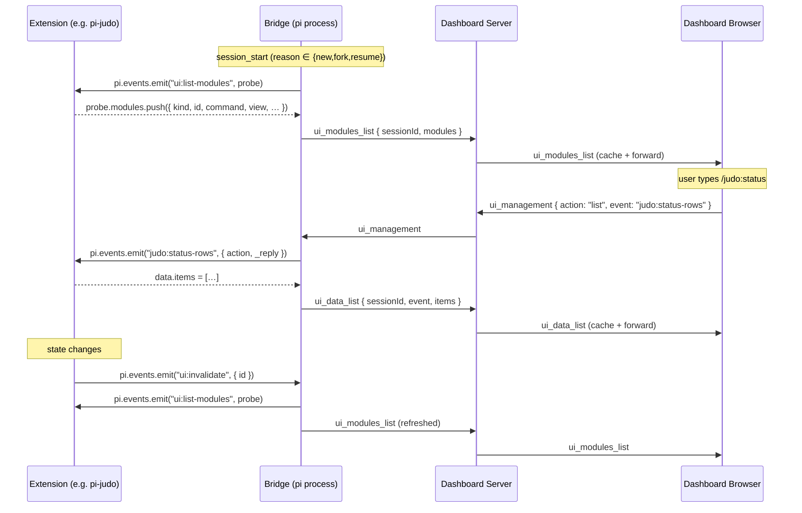
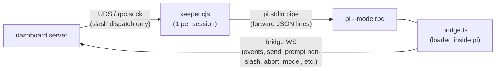
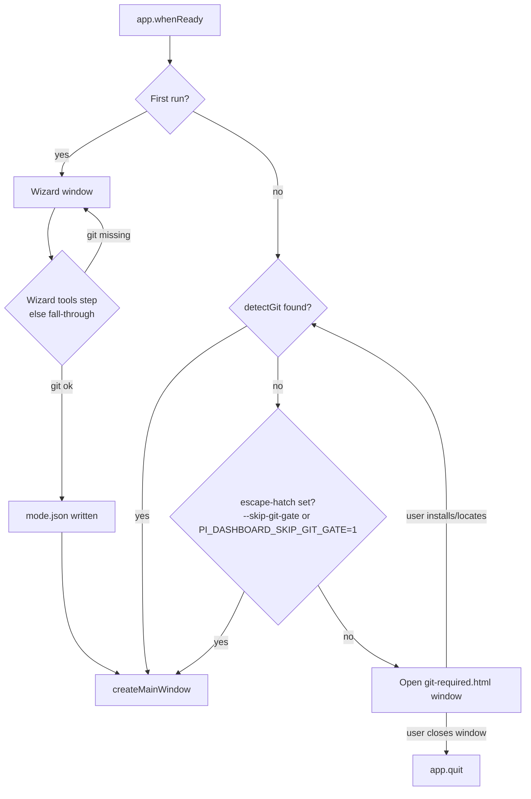
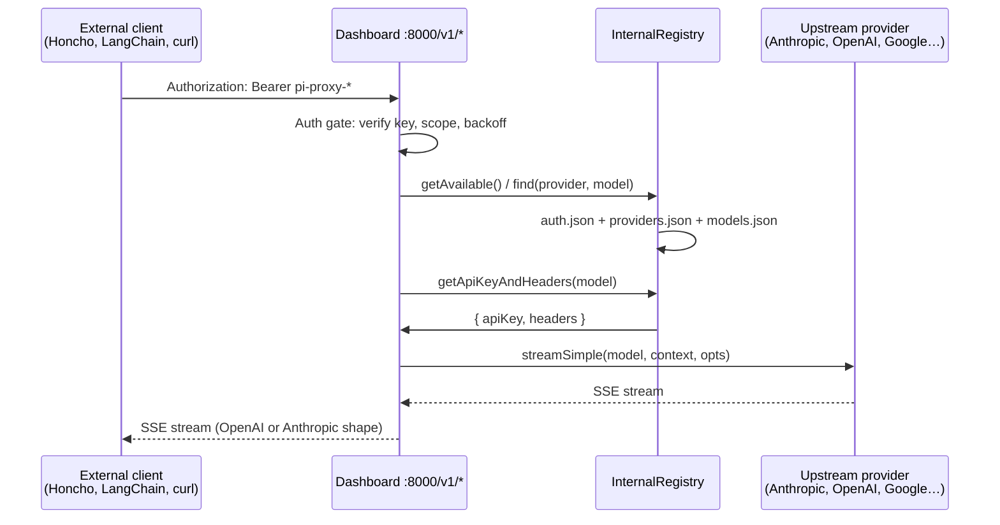

# PI Dashboard Architecture

> **Adjacent artifact:** the public marketing site lives at `/site` and is
> product-adjacent, not part of the dashboard runtime. It has its own Astro
> build, its own Playwright screenshot pipeline, and its own GitHub Pages
> deploy workflow (`.github/workflows/deploy-site.yml`). See
> `/site/README.md` for details.


## Overview

PI Dashboard: web-based dashboard for monitoring + interacting with pi agent sessions. Three components:

```
┌─────────────┐     WebSocket      ┌──────────────┐     WebSocket     ┌─────────────┐
│   Bridge    │ ◄─────────────────► │  Dashboard   │ ◄───────────────► │  Web Client  │
│  Extension  │    (port 9999)      │   Server     │    (port 8000)    │  (React)     │
│  (per pi)   │                     │  (Node.js)   │                   │  (Browser)   │
└─────────────┘                     └──────────────┘                   └─────────────┘
                                          │
                                    ┌─────┴─────┐
                                    │  In-Memory │
                                    │  + JSON    │
                                    └───────────┘
```

## Components

### 1. Bridge Extension (`src/extension/`)
Global pi extension running in every pi session. It:
- Detects session source (TUI, Zed, tmux, dashboard-spawned) via `.meta.json` sidecar files + env vars
- Forwards all pi events to dashboard server via WebSocket
- Relays commands from dashboard back to pi
- Handles reconnection with exponential backoff + event buffering
- Sends heartbeats every 15s with process metrics (CPU%, RSS, heap, event loop max delay, load average); server responds with `heartbeat_ack`
- Server liveness watchdog: forces reconnect if no message received for 60s
- Server-side WS ping/pong (60s interval) detects dead TCP connections; requires 2 consecutive missed pongs before killing (tolerates long-running bash commands blocking event loop)
- Detects OpenSpec activity (phase/change) from tool events; server auto-attaches the change when `changeName` is detected (phase is not required — skills loaded via prompt templates don't emit a SKILL.md read event). The session card's OpenSpec activity badge displays when either `openspecPhase` or `openspecChange` is detected (not just phase).
- **Attached-proposal artifact summary** in the content-window header (`SessionHeader.tsx`, both desktop branch and `MobileHeader`): when `session.attachedProposal` matches an entry in the polled `openspecChanges` list, the header renders the `ArtifactLettersButton` (P/D/T/S letters colored by per-artifact status, single button → opens the proposal artifact) plus a `(completedTasks/totalTasks)` counter. Surface is gated on the explicit user attach only — auto-detected `openspecChange` does not trigger it. Wired via the new `onReadArtifact` prop, threaded from `App.tsx` (`handleReadArtifact` from `useContentViews`). See change: add-attached-proposal-header-summary.
- **Duplicate bridge prevention**: Uses `process`-level shared state (not `globalThis`) with a monotonic generation counter. When the extension is loaded multiple times (e.g., local + global npm package), only the latest instance's event handlers are active — stale listeners bail out immediately. All previous connections and timers are tracked and cleaned up on re-init.
- **Subagent re-entry guard**: When pi-subagents launches an Agent tool, the subagent creates its own `AgentSession` which loads extensions (including the bridge) in the same process. Without protection, this would overwrite the parent bridge's global state, disconnect its WebSocket, and prevent `tool_execution_end`/`agent_end` from being forwarded — leaving the parent session stuck at "streaming" forever. The bridge stores a reference to its owning `pi` instance and skips initialization when called from a different instance (subagent).
- Routes `ctx.ui` dialog methods (confirm, select, input, editor, multiselect, notify) through `PromptBus` (`prompt-bus.ts`)
  - Adapters register to handle prompts: `DashboardDefaultAdapter` renders generic dialogs inline; extensions (e.g. pi-flows) can register custom adapters via `prompt:register-adapter` event
  - First-response-wins: multiple adapters (TUI, dashboard, custom) can claim a prompt; the first to respond resolves it, others are dismissed
  - Bridge's TUI adapter is registered inline (captures original `ctx.ui` methods before patching) and presents `select`/`input`/`confirm`/`editor` prompts in the terminal with AbortController-based cancellation. Multiselect bypasses the TUI adapter entirely and uses the bus-routed `ctx.ui.multiselect` patch → `DashboardDefaultAdapter` → client `MultiselectRenderer` exclusively (pi 0.70 RPC's `ctx.ui.custom` is a no-op, so a TUI arm would auto-cancel the dashboard render in <1s). See changes: fix-multiselect-auto-cancel-on-dashboard, fix-multiselect-tui-arm-self-cancel.
  - Patched `ctx.ui` methods forward the `message` field (from opts) via `metadata` in the PromptBus request
  - Client-side `prompt-component-registry.ts` maps component type strings to render placement (inline, widget-bar, overlay)
  - Protocol messages: `prompt_request`, `prompt_dismiss`, `prompt_cancel`, `prompt_response`

### 2. Dashboard Server (`src/server/`)
Node.js HTTP + WebSocket server that:
- Accepts connections from bridge extensions (Pi Gateway, port 9999)
- Accepts connections from web browsers (Browser Gateway, port 8000)
- Stores events in an in-memory buffer with LRU eviction (max 100 sessions, 5000 events per session)
- Truncates large event payloads (tool results, file content, thinking blocks) to bound memory
- Applies WebSocket backpressure on browser connections (drops messages when send buffer > 4MB)
- Manages sessions in a pure in-memory registry (populated from bridge connections and direct disk discovery)
- Persists global preferences (pinned directories, session order) in `~/.pi/dashboard/preferences.json`
- Discovers historical sessions directly from disk via `SessionManager.list()` (DirectoryService)
- Loads session events on demand directly from disk via `SessionManager.open()` (DirectoryService)
- Polls OpenSpec CLI per directory every 30s, broadcasting changes to browsers (DirectoryService).
  - **Design-artifact override**: after CLI's per-change `status`, `buildOpenSpecData` post-processes `design` artifact: when CLI says `design: ready`, dashboard checks local fs evidence (R1: `^design.*\.md$` present; R2: `design/*.md` present; R3: `tasks.md` contains Markdown checkbox) + promotes `design.status` to `"done"` if any rule fires. **Promote-only + design-only** — never demotes, never touches other artifact ids, never promotes from `"blocked"`. Change-level `isComplete` re-derived locally; CLI `isComplete: true` never demoted. Same R1/R2/R3 mirrored in `.pi/skills/openspec-shared/scripts/effective-status.sh` so OpenSpec workflow skills + dashboard session-card buttons cannot disagree about next-ready artifact. See change: fix-openspec-design-detection.
- Serves the built web client as static files (production) or proxies to Vite dev server (dev mode)
- Writes per-session `.meta.json` sidecar files with dashboard state and cached stats
- Exposes REST API for session management, event content fetch, pinned directories, and file reading
- Provides session control REST endpoints (`/api/session/:id/*`) wrapping WebSocket-only operations (prompt, abort, spawn, resume, rename, hide, flow-control, model, thinking-level, attach/detach-proposal) — see `src/server/session-api.ts`

**Server decomposition:** The server is split into focused modules:
- `server.ts` — Orchestrator: creates services, composes modules, manages lifecycle
- `routes/` — REST API routes grouped by domain (session, git, file, openspec, system)
- `event-wiring.ts` — Pi gateway → browser gateway event forwarding
- `idle-timer.ts` — Auto-shutdown idle timer
- `session-bootstrap.ts` — Startup session discovery and OpenSpec polling init
- `extension-register.ts` — Auto-registers bundled bridge extension in pi's global settings (`~/.pi/agent/settings.json`) on startup; no-op in dev mode
- `browser-handlers/` — Browser WebSocket message handlers by domain (subscription, session-actions, session-meta, terminal, directory)

### 3. Web Client (`src/client/`)
React-based responsive web UI that:
- Shows all active sessions organized by directory, with pinned directories always visible at the top
- Renders chat messages with markdown, syntax highlighting, streaming, and a small raw-HTML pass that strips React-only `ref` attributes before render
- Persists scroll position per session — switching sessions restores exact scroll position if locked, or scrolls to bottom if following
- Displays collapsed tool call steps with lazy-loaded content and elapsed time badges
- Shows live ticking elapsed counters on running operations (thinking, tool calls) and final duration on completed ones
- Provides command autocomplete with `/` prefix
- Supports bidirectional interaction (send prompts, run commands)
- Works on mobile with responsive layout and swipe gestures
- Shows an onboarding `LandingPage` whenever the main pane is empty, narrating the three steps needed to go from install → first running session (Setup credentials → Add folder → Start session). Each step is a card in **pending**, **done**, or **locked** state, derived purely from client state: `useProvidersReady()` (from `GET /api/providers`), `pinnedDirectories.length`, and `sessions.size`. Satisfied steps collapse to single-line ✔ rows, so returning users see a compact status strip rather than a full onboarding wall. The `PinDirectoryDialog` used by Step ② is mounted once at the app root in `App.tsx` and shared with the sidebar "Add folder" button via a single `onOpenPinDialog` callback.

### 4. Shared Types (`src/shared/`)
TypeScript type definitions shared across all components:

- `protocol.ts` - Extension↔Server WebSocket messages
- `browser-protocol.ts` - Server↔Browser WebSocket messages (includes PromptBus messages: `prompt_request`, `prompt_dismiss`, `prompt_cancel`)
- `types.ts` - Data models (Session, Workspace, Event, etc.)

## Data Flow

### Event Flow (pi → browser)
1. Pi emits event (e.g., `message_update`)
2. Bridge extension converts to `event_forward` protocol message
3. Server receives, stores in in-memory buffer, assigns sequence number
4. Server broadcasts to all subscribed browsers via `event` message
5. Browser's event reducer processes event, React renders update

**Last-activity stamping** (change: session-card-last-activity-badge): in step 3, before other event-derived updates, server checks `isActivityEvent(eventType)` against curated allowlist (`prompt_send`, `message_*`, `turn_end`, `tool_execution_*`, `agent_*`, `bash_output`, `flow_*`, `architect_*`). On match — only when session NOT in replay — stamps `session.lastActivityAt = Date.now()`. In-memory write unconditional; `session_updated` broadcast throttled to **≤ 1×/30 s/session** via `lastActivityBroadcastAt: Map<sessionId, ms>`. Map entry dropped on `session_unregister` so fast re-register can't lose first broadcast. Heartbeat/metrics/UI-state events (`process_metrics`, `git_info_update`, `model_select`, `ui_data_list`, `ext_ui_decorator`, …) excluded so idle pi process emitting periodic metrics doesn't keep badge artificially fresh. At server boot, `session-scanner.ts` cold-start-seeds `lastActivityAt` from `events.jsonl` mtime so idle sessions retain meaningful relative-time label across restarts. Client `selectBadgeTimestamp(session)` (`packages/client/src/lib/session-card-time.ts`) renders `endedAt ?? lastActivityAt ?? startedAt` for ended sessions, `lastActivityAt ?? startedAt` for active.

**Unread state machine** (change: session-card-unread-stripes): every session carries a `unread: boolean` field that flips to `true` when an attention-worthy event fires while no browser has the session displayed, and clears to `false` when any browser opens the session. The visual is cyan scrolling stripes (`card-unread-pulse`, Tailwind `cyan-400`) on the session card, lower priority than the yellow streaming and purple ask_user pulses.

- **Triggers** (evaluated by the pure helper `isUnreadTrigger(eventType, before, after, payload)` in `event-status-extraction.ts`):
  1. Session status transitions from `streaming` to `idle` or `active` — a turn finished.
  2. Session's `currentTool` becomes `"ask_user"` — input is requested.
  3. An `agent_end` event arrives with a truthy `payload.error` — something broke.
  Other events (assistant `message_end`, tool execution start/end, model/git/metrics noise) deliberately do NOT trigger unread — they would be too noisy on long turns.
- **"Currently viewing" registry**: `viewed-session-tracker.ts` exposes `Map<sessionId, Set<WebSocket>>`. Browsers populate it via two new browser→server messages, `session_view` and `session_unview`, sent by the client hook `useViewDispatcher` (mounted in `App.tsx`). The hook watches the `/session/:id` route and the WebSocket connection status; on every transition INTO `connected` it re-sends `session_view` for the current id so server-side state re-syncs after reconnect. On WS `close`, the gateway calls `tracker.unviewAll(ws)` so disconnected browsers cannot hold sessions in the viewed state. Read state is GLOBAL across browsers (mirrors mail/Slack: opening on phone clears unread on laptop).
- **State transitions** in `event-wiring.ts`: right after the `extractSessionUpdates` block, the wiring snapshots `{status, currentTool}` before/after the update and calls `isUnreadTrigger`. If true AND `viewedSessionTracker.isViewedByAnyone(sessionId) === false` AND `!replayingSessions.has(sessionId)`, the wiring stamps `session.unread = true` and broadcasts `session_updated`. The browser-gateway's `session_view` arm clears the bit (`unread: false`) and broadcasts. The clear-on-already-read path is a no-op (no spurious broadcast).
- **Persistence**: the bit lives in `.meta.json` (`SessionMeta.unread`). `server.ts onChange` writes it on every session update; `session-scanner.ts::sessionFromMeta` restores it on cold start. The cold-start "force `status = ended`" override at `server.ts:273-279` is intentionally non-destructive on `unread` — a session that was unread when the server stopped is still unread when it starts back up, even before its bridge reattaches.
- **Render precedence** (`SessionCard.tsx::getCardPulseClass`): `ask_user` (purple) > `streaming || resuming` (yellow) > `unread` (cyan) > none. Streaming with `unread: true` shows yellow stripes; when streaming ends with the session still unviewed, the trigger fires, the card flips to cyan. The `card-unread-pulse` CSS class reuses the `card-working-stripes-scroll` and `card-working-opacity-pulse` keyframes verbatim — only the stripe and tint colors change to cool cyan (`rgba(34, 211, 238, 0.18)` and `rgba(34, 211, 238, 0.07)`). Cyan was selected to occupy its own corner of the dashboard palette (distant from yellow, purple, green, red). Reduced-motion users see a static cyan-tinted background, matching the working-pulse arm.

### Interactive UI Flow (PromptBus — extension dialog → browser → response)
1. Extension calls `ctx.ui.confirm()` / `select()` / `input()` / `editor()` / bridge-patched `multiselect()`
2. Bridge PromptBus intercepts via patched `ctx.ui` methods, creates a `PromptRequest` with a unique `promptId` and `pipeline` tag (e.g. `"command"`, `"architect"`)
3. Registered adapters claim the prompt:
   - `DashboardDefaultAdapter` (always registered) returns a `PromptClaim` with `component: { type: "generic-dialog", props }` and `placement: "inline"`
   - Custom adapters (e.g. `ArchitectUIAdapter` from pi-flows) can claim with custom component types and widget-bar placement
   - TUI adapters (registered via `prompt:register-adapter` event) can claim to show a terminal dialog
4. Bus sends `prompt_request` to server with the winning adapter's component info
5. Server forwards to subscribed browsers
6. Browser's `prompt-component-registry.ts` resolves the component type to a React renderer and placement
7. User responds in browser → `prompt_response` sent to server → routed to bridge
8. Bus resolves the original dialog promise and calls `onResponse()` on all adapters for cleanup

**Multiselect note:** pi's upstream `ExtensionUIContext` has no native `multiselect`, so bridge attaches `ctx.ui.multiselect` during `session_start`. `ask_user` dispatches multiselect through `polyfillMultiselect`, which delegates to that patched PromptBus method when present + falls back to `ctx.ui.custom` + `MultiSelectList` for legacy / non-bridge contexts (fallback is no-op in pi 0.70 RPC mode — dashboard headless — because pi-coding-agent defines `custom` as `async () => undefined` there). Bridge intentionally registers NO TUI adapter arm for multiselect; routing bus-only. Browser responses encode `{ values: string[] }` as `JSON.stringify(values)` in `prompt_response.answer`, preserving `[]` as real empty selection distinct from cancellation.

**First-response-wins (multi-adapter):**
- Multiple adapters can claim the same prompt (e.g. TUI + dashboard)
- The first adapter to respond wins; the bus sends `prompt_dismiss` to the server for the losing adapter's dashboard component
- Adapters implement `onCancel()` for cleanup when another adapter wins

**Custom UI components:**
- Extensions register adapters via `pi.events.emit("prompt:register-adapter", adapter)`
- Adapters return custom `PromptClaim` with arbitrary component types (e.g. `"architect-prompt"`)
- Client-side registry maps type strings to render placement; unknown types fall back to `"generic-dialog"`

**Message passthrough:**
- The `message` field from `ask_user` tool (and other `ctx.ui` callers) is forwarded via `metadata.message` in the PromptBus request, through the `prompt_request` protocol message, and extracted by the client into the interactive renderer's `params.message`.

**Type safety:**
- `prompt_request`, `prompt_dismiss`, and `prompt_cancel` **must** be in the `ServerToBrowserMessage` union in `browser-protocol.ts`. If they are only handled via `case "..." as any:` in switch statements, esbuild's dead-code elimination will strip the handlers in production builds, silently breaking the interactive UI.

**Resilience:**
- **Page refresh**: Server replays pending `prompt_request` messages when a browser subscribes. Client deduplicates by `requestId` or pending title match.
- **Bridge reconnect**: Bridge replays pending PromptBus requests on WebSocket reconnect so dashboard dialogs survive server restarts.

### Command Flow (browser → pi)
1. User types prompt or command in browser
2. Browser sends `send_prompt` via WebSocket
3. Server routes to correct bridge extension by sessionId
4. Bridge extension's command handler parses input for pi command prefixes:
   - `!!<cmd>` → silent bash execution via `pi.exec()`, result as `bash_output` event
   - `!<cmd>` → bash execution via `pi.exec()`, result as `bash_output` event + send to LLM
   - `/compact [instructions]` → `ctx.compact()`, feedback as `command_feedback` event
   - `/<command>` → `session.prompt()` for extension commands/skills/templates (fallback to `sendUserMessage()`)
   - Colon-to-hyphen aliasing: `/opsx:continue` resolves to `opsx-continue.md` template (both `:` and `-` forms work)
   - Plain text → `pi.sendUserMessage()` (default)
5. Pi processes the command, events flow back via event flow

### Flow Dashboard Data Flow (pi-flows → browser)
pi-flows runs multi-agent workflows in-process. Subagent sessions use `SessionManager.inMemory()` and don't bootstrap the bridge, so flow data must be explicitly forwarded by the parent session's bridge.

1. pi-flows `EventEmitObserver` emits `flow:*` events on `pi.events` (all 10 `FlowObserver` callbacks)
2. Bridge extension listens to `flow:*` events and forwards as `event_forward` messages with `flow_*` event types
3. Server stores events, extracts flow metadata to `DashboardSession` fields (`activeFlowName`, `flowAgentsDone`, `flowAgentsTotal`, `flowStatus`)
4. Browser event reducer builds client-side `FlowState` (agents map, tool history, detail entries) — reducer code lives in `packages/flows-plugin/src/flow-reducer.ts` (re-exported via `@blackbelt-technology/pi-dashboard-flows-plugin/reducer`); `event-reducer.ts` imports `isFlowEvent` + `reduceFlowEvent` from there.
5. React renders `FlowDashboard` (sticky card grid above ChatView), `FlowAgentDetail` (replaces chat), `FlowSummary` (post-completion). Component code lives in `packages/flows-plugin/src/client/` and is imported by the shell via `@blackbelt-technology/pi-dashboard-flows-plugin/client`. Slot-consumer-based mounting is tracked as the follow-up change `migrate-flows-jsx-to-slots`; the current shell imports the components directly. See change: extract-flows-as-plugin.

**Flow controls (browser → pi-flows):**
- Abort: browser sends `flow_control { action: "abort" }` → server → bridge → `pi.events.emit("flow:abort")` → `flowManager.abort()`
- Autonomous toggle: browser sends `flow_control { action: "toggle_autonomous" }` → same path → `setAutonomousMode()`

### Extension UI System (Phases 1 + 2 shipped)

A generalized mechanism for extensions to declare dashboard UIs as data without authoring React or importing a runtime SDK. Phase 1 (`management-modal` slot) shipped in change `add-extension-ui-modal`. Phase 2 (live in-page decorations) shipped in change `add-extension-ui-decorations`. Phase 4 RJSF is tracked in `add-extension-ui-rjsf-form`.

**Mechanism (pull-based discovery, synchronous probe):**



Key properties:
1. The probe is **synchronous** — listeners push into `probe.modules` while `pi.events.emit` is running. The bridge never polls and never caches across probes; idempotent re-registration just produces a fresh probe on the next trigger.
2. **No SDK package** — extensions only need `pi.events` (already provided by the host). Schema types live in `@blackbelt-technology/pi-dashboard-shared`.
3. **Last-write-wins on duplicate `id`** within a single probe; bridge logs one warning per collision.

**Phase-1 surface (shipped):**

- `kind: "management-modal"` — slash-command-triggered modal.
- `view.kind` ∈ `"table" | "grid" | "form"`.
- `UiField.kind` ∈ `"text" | "number" | "boolean" | "select" | "code" | "datetime" | "textarea"`.
- `UiAction.confirm` polish via the existing Tailwind `ConfirmDialog` (no `window.confirm()`).
- Icons resolved against `@mdi/js` keys; unknown keys render no icon (no error).
- Slash-command interception in `App.tsx`'s `wrappedHandleSend`; built-in collisions (`/model`, `/compact`, `/flows`, etc.) drop the module with a `console.warn`.
- "Modules" entry point in `SessionHeader` shows when `session.uiModules?.length > 0`.

**Phase-1 wire protocol:**

| Direction | Type | Purpose |
|---|---|---|
| extension → server → browser | `ui_modules_list { sessionId, modules }` | Cached schemas. |
| extension → server → browser | `ui_data_list { sessionId, event, items }` | Row data for `table`/`grid` views. |
| browser → server → extension | `ui_management { sessionId, action, event, params }` | Data fetch (`action: "list"`) or user action. |

**Replay on reconnect:** Server caches `Session.uiModules` and `Session.uiDataMap` (per-event item cap = 1000, last-write-wins on overflow). The replay site is `replayUiState(ws, sessionId, ctx)` in `packages/server/src/browser-handlers/subscription-handler.ts`, called immediately after every existing `replayPendingUiRequests(ws, sessionId)` site (4 sites: stale-lastSeq full replay, delta replay, no-events path, lazy load from disk). Replay ordering: events → pending UI requests → UI module state.

**Phase-2 surface (shipped):**

Five live in-page decoration kinds reuse the same `ui:list-modules` probe primitive. Decorators carry an explicit `namespace: string` (must match `/^[a-z0-9-]+$/`) plus `id`, partitioned at the bridge and forwarded as one `ext_ui_decorator` message per descriptor. Server caches under `Session.uiDecorators[`${kind}:${namespace}:${id}`]` and replays after the Phase-1 batches.

| Kind | Mount site | Filter | Closure? |
|---|---|---|---|
| `footer-segment` | `SessionHeader.tsx`, right of git/model info | `kind === "footer-segment"` | Yes — extension supplies fresh `payload.text` per probe |
| `agent-metric` | Inside `FlowAgentCard.tsx` (one per card) | `kind === "agent-metric" && payload.agentId === card.agentName` | Yes |
| `breadcrumb` | Top of `FlowDashboard.tsx` | `kind === "breadcrumb"` (most recent wins) | No (snapshot) |
| `gate` | Inline in each `FlowLaunchDialog` | `kind === "gate" && payload.flowId === item.flowId` (most-restrictive aggregate) | No |
| `toast` | `App.tsx` (top-right fixed tray) | `kind === "toast"` (stacks; auto-dismiss; FIFO display cap = 5) | No |

Decorator removal is **explicit**: extensions push a descriptor with `removed: true` and the bridge forwards it verbatim; the server deletes the cache entry under the matching key (no-op if absent) and broadcasts the removal so client slots can unmount the matching descriptor without affecting siblings.

**Phase-2 wire protocol:**

| Direction | Type | Purpose |
|---|---|---|
| extension → server → browser | `ext_ui_decorator { sessionId, descriptor, removed? }` | Live decoration upsert (or removal when `removed: true`). |

The message is a discriminated union over `descriptor.kind`. `ExtUiDecoratorMessage` is a member of both `ExtensionToServerMessage` and `ServerToBrowserMessage` (verified by a type-level test in `packages/shared/src/__tests__/browser-protocol-types.test.ts` — esbuild silently strips switch arms whose message types are not in the production union).

**Phase-2 sequence (invalidate → probe → ext_ui_decorator → slot re-render):**

```mermaid
sequenceDiagram
    participant Ext as Extension (e.g. pi-judo)
    participant Bridge as Bridge (pi process)
    participant Server as Dashboard Server
    participant Browser as Dashboard Browser

    Note over Ext: state changes (e.g. judo workspace mutation count incremented)
    Ext->>Bridge: pi.events.emit("ui:invalidate", { id })
    Bridge->>Ext: pi.events.emit("ui:list-modules", probe)
    Ext-->>Bridge: probe.modules.push({ kind: "footer-segment", namespace, id, payload })
    Note over Bridge: partition by kind — modal kinds → ui_modules_list,<br/>decorator kinds → one ext_ui_decorator each
    Bridge->>Server: ext_ui_decorator { sessionId, descriptor }
    Server->>Server: cache under `${kind}:${namespace}:${id}` on Session.uiDecorators
    Server->>Browser: ext_ui_decorator (broadcast verbatim)
    Browser->>Browser: per-kind slot component re-renders

    Note over Ext: state cleared
    Ext->>Bridge: probe.modules.push({ kind, namespace, id, payload, removed: true })
    Bridge->>Server: ext_ui_decorator { ..., removed: true }
    Server->>Server: delete cache entry; broadcast removal
    Server->>Browser: ext_ui_decorator { ..., removed: true }
    Browser->>Browser: slot unmounts the matching descriptor only
```

**Rate cap:** to prevent runaway extensions, the bridge throttles `ui:invalidate` re-probes per session to one probe every 50 ms (= 20/sec). Excess events coalesce into a single trailing-edge probe; a single warning is emitted per offending burst, latched until a quiet window passes.

**Replay ordering** (extended from Phase 1): events → pending UI requests → `ui_modules_list` → `ui_data_list` (per event) → `ext_ui_decorator` (per cache key). Replay decorator messages never carry `removed: true` — only live entries are replayed.

**Phase 4 (optional):** `rjsf-form` JSON-Schema escape hatch for rich forms; see `add-extension-ui-rjsf-form`.

**Relationship to existing capabilities:**
- `interactive-ui-dialogs` / `ui-proxy` / PromptBus — handle one-shot `ctx.ui.*` dialogs (request/response, awaited). The extension-ui-system handles persistent push-based descriptors (no awaiting). Orthogonal mechanisms; both ship.
- `extension-ui-forwarding` (catch-all `pi.events.emit` forwarding) — kept for arbitrary extension events; the new system is the *declarative* path for UI specifically.
- pi-flows: in Phase 3 pi-flows itself adopts the system to surface registered workflows (breadcrumb), gates, and cards (agent-metric) for any flow-using extension automatically.

**No-dashboard fallback:** When no bridge is connected, `ui:list-modules` is never emitted; extension listeners are dormant; slash commands fall back to existing text-output behavior. Extensions remain pi-runnable in pure-pi mode without code changes.

### Plugin Architecture (runtime implemented in `add-dashboard-shell-slots-runtime`)

A planned **two-tier rendering model** that lets first-party features (OpenSpec, pi-flows, pi-subagents tool renderers, git integration) live as standalone plugin packages instead of being baked into the dashboard core. Tracked under OpenSpec change `dashboard-plugin-architecture` (design-only umbrella); the runtime lands in `add-dashboard-shell-slots-runtime`; concrete migrations land in `extract-openspec-as-plugin`, `extract-flows-as-plugin`, `extract-subagents-as-plugin`, and `extract-git-as-plugin`.

**The two tiers, one slot contract:**
- **Tier 1 — first-party plugins** (this proposal): React + server contributions co-located in `packages/<name>-plugin/`. Bundled and tree-shaken into the dashboard's web build. Trusted because they live in the same repo and pass the same review.
- **Tier 2 — third-party extensions** (`extension-ui-system`): descriptor-only protocol over the existing pi event bus. Sandboxed, declarative, no React.

Both tiers fill the **same** named regions — the **slot taxonomy**. The shell knows about slots; only plugins/extensions know about specific features.

**Slot taxonomy (frozen for v0.x):**

First-party slots (React, possibly also descriptor):
- `sidebar-folder-section` — collapsible block above the per-workspace session list (replaces `FolderOpenSpecSection`).
- `session-card-badge` — compact info chips in the session card (replaces `OpenSpecActivityBadge`, `FlowActivityBadge`). Descriptor variant reuses `agent-metric`.
- `session-card-action-bar` — action buttons in the session card (replaces `SessionOpenSpecActions`, `SessionFlowActions`). React-only in v0.x.
- `content-view` — full-screen content area (replaces every conditional branch in `App.tsx` for `ArchiveBrowserView`, `SpecsBrowserView`, `OpenSpecPreview`, `FlowAgentDetail`, `FlowArchitectDetail`, `MarkdownPreviewView`, `FileDiffView`, `FlowYamlPreview`). Descriptor variant reuses `management-modal`.
- `content-header-sticky` — sticky element above content-view (replaces sticky `FlowArchitect`/`FlowDashboard`). Descriptor variant reuses `breadcrumb`.
- `content-inline-footer` — inline element below content-view (replaces `FlowSummary`). React-only.
- `anchored-popover` — popover anchored to a triggering UI element (replaces `TasksPopover`).
- `command-route` — maps a slash command or URL route to a `content-view` (replaces today's hand-wired routing in `App.tsx`).
- `settings-section` — a section in the Settings page (replaces today's hardcoded `Background polling (OpenSpec)` section). React for first-party plugins; descriptor (RJSF/UiField) for third-party extensions.
- `tool-renderer` — React component for a specific `tool_call` by `toolName` (replaces today's hardcoded `tool-renderers/registry.ts`).

Descriptor-only slots (existing in `extension-ui-system`): `management-modal`, `footer-segment`, `agent-metric`, `breadcrumb`, `gate`, `toast`, `rjsf-form`.

**Plugin loader (runtime):**

`packages/dashboard-plugin-runtime/` is a new workspace package containing all runtime pieces:

- **`src/slot-registry.ts`** — `createSlotRegistry()` returns a typed `Map<SlotId, ClaimEntry[]>` sorted by `(priority, pluginId)`. Filter helpers: `forSession`, `forFolder`, `forTab`, `forCommand`, `forToolName`.
- **`src/manifest-validator.ts`** — hand-rolled manifest validator; throws `ManifestValidationError` with `pluginId` and `reason`.
- **`src/plugin-context.tsx`** — `PluginContextProvider` wraps the entire app. A nested `CurrentPluginLayer` is pushed per contribution so `usePluginConfig<T>()` and `logger` resolve to the contributing plugin's id. `applyPluginConfigUpdate` updates the in-memory config store and re-renders subscribers.
- **`src/slot-consumers.tsx`** — one component per slot id. Each wraps contributions in a `SlotErrorBoundary` (per-claim scope). Reads registry from the provider.
- **`src/slot-error-boundary.tsx`** — React error boundary scoped to one claim. Logs with plugin id and slot id; renders nothing for the failing claim without suppressing siblings.
- **`src/vite-plugin/index.ts`** — `viteDashboardPluginsPlugin` generates `packages/client/src/generated/plugin-registry.tsx` with named imports (tree-shaking). Watches manifests during dev and triggers HMR.
- **`src/server/loader.ts`** — `discoverPlugins(repoRoot?)` (single module-level cache), `loadServerEntries(deps)` (per-plugin dynamic-import, failure isolated), `getPluginStatusStore()`.
- **`src/server/server-context.ts`** — `createServerPluginContext(deps, pluginId)` — namespaced logger, typed config accessors.
- **`src/server/config-validator.ts`** — Ajv JSON-Schema 7 validate + defaults.

1. **Discovery** — server globs `packages/*/package.json` on startup, parses the `pi-dashboard-plugin` field, validates against schema, sorts by `priority` (lower first; first-party = 100; default 1000).
2. **Server load** — dynamic-imports each plugin's `server` entry, invokes `registerPlugin(ctx)` with a typed `ServerPluginContext` (Fastify, session manager, event store, broadcast helper, scoped logger).
3. **Client bundle** — a Vite plugin (`vite-plugin-dashboard-plugins`) generates `packages/client/src/generated/plugin-registry.tsx` with static imports per plugin manifest; Vite tree-shakes unused exports and code-splits per plugin.
4. **Runtime registration** — client boot calls `getSlotRegistry()` once; slot consumer components (`<SessionCardBadgeSlot/>`, `<ContentViewSlot/>`, etc.) iterate the registry and render contributions in priority order with per-slot error boundaries.
5. **Bridge auto-register** — plugins declaring a `bridge` entry are auto-registered into `~/.pi/agent/settings.json` under managed `dashboard-<plugin-id>` keys; user-owned entries are never touched.

**Plugin settings persistence:**
- All plugin settings live under `plugins.<id>.*` in `~/.pi/dashboard/config.json`. The dashboard core never reads or writes another plugin's namespace.
- Each manifest may declare a `configSchema` (JSON Schema 7); the loader validates on read (with defaults applied) and on write (rejects invalid).
- `POST /api/config/plugins/:id` accepts a partial config for a single plugin and broadcasts `plugin_config_update { id, config }` to all subscribed browsers.
- The client-side `pluginContext.usePluginConfig<T>()` hook is reactive — consumers re-render within one frame of a write.
- Legacy top-level keys (e.g. `openspec.*`) auto-migrate to `plugins.<id>.*` on the plugin's first server boot.

**Failure isolation:**
- A plugin failing to load (server throw, client import error, missing entry) does NOT crash the shell.
- Failures are logged with full context and surfaced via `/api/health.plugins[]` (`{ id, enabled, loaded, error?, claims }`).
- Slot consumers wrap each contribution in a React error boundary so a runtime crash in one plugin's component doesn't take down the page.

**Bundled-by-default plugins:** The plugin loader treats all plugins identically (same manifest, same discovery, same `enabled` flag, same failure isolation). What distinguishes "bundled-by-default" plugins (initial set: `git-plugin`) is purely operational — the build pipeline always includes them in `packages/`. Their absence is a deliberate user opt-out, not a normal state. OpenSpec, Flows, and Subagents plugins are bundled in standard builds but their absence is a normal use case (e.g. a workspace without OpenSpec).

**Future Work — external plugin discovery:** Phase 1 scans `packages/*/package.json` only. The manifest format (`pi-dashboard-plugin` field in any `package.json`) is intentionally **format-compatible with arbitrary npm packages**, which unblocks an eventual progression where stable plugins can be PR'd into upstream packages (e.g. `pi-dashboard-subagents/dashboard/`) and discovered from `node_modules`. The deferred work (trust model, SemVer pinning of the plugin context API, build integration with `node_modules` paths) is documented in `dashboard-plugin-architecture/design.md` §"Future Work: external plugin discovery".

#### JSX slot wrappers and `??` fallback chains — anti-pattern

Slot consumer components (`<ContentViewSlot/>`, `<SessionCardBadgeSlot/>`, etc.) return `null` when no plugin claims the slot. **They MUST NOT be placed directly as the left operand of a `??` operator** in JSX route fallback chains. The `??` operator evaluates the JSX *element* (always truthy), not its rendered output, so a fallback like

```tsx
// BROKEN — sessionDetail and LandingPage are unreachable
<ContentViewSlot session={s} routeParams={p} onClose={c} /> ?? sessionDetail ?? <LandingPage />
```

renders nothing visible whenever zero plugins claim `content-view` (the slot's `null` return is masked by `??`'s value-based semantics). The bug is silent and ships fine in CI when fixture plugins are bundled — but breaks every user the moment fixtures are excluded from production.

The fix gates the JSX element on a registry claim count *before* construction:

```tsx
// CORRECT — ?? falls through to sessionDetail when claimCount === 0
(claimCount > 0 ? <ContentViewSlot …/> : null) ?? sessionDetail ?? <LandingPage />
```

A repository-level lint (`packages/client/src/__tests__/no-jsx-slot-nullish-fallback.test.ts`) scans the dashboard shell entry points for the anti-pattern and fails CI with the offending file:line. The lint is enforced for `packages/client/src/App.tsx` today; downstream changes that wire new slot consumers (`extract-flows-as-plugin`, `extract-openspec-as-plugin`, `extract-subagents-as-plugin`, `extract-git-as-plugin`) MUST add their shell file to the lint's `SCAN_FILES` allowlist. See change `fix-slot-fallback-masks-content` for the rationale, regression test, and the exact production bug shape (encountered during deployment of `add-extension-ui-decorations`).

**Authoring on-ramp:** Skill package `packages/dashboard-plugin-skill/` ships `@blackbelt-technology/pi-dashboard-plugin-skill` (publishable). Skill name `dashboard-plugin-scaffold`. Hybrid contract: `ask_user` batch up front, prescriptive steps after. Two modes. `new` mode: scaffolds `packages/<id>-plugin/` matching `packages/demo-plugin/` layout. Per-slot stubs for 10 React slots. Optional server entry. Optional bridge entry, default off. `augment` mode: runs in pi session at cwd of existing pi-extension. Grep prelude scans `ctx.ui.*`, `pi.registerTool`, banned `ctx.fork`. LLM analysis vs canonical TUI→dashboard mapping table. Per-callsite `ask_user` multiselect. Injects `pi-dashboard-plugin` field into `package.json`. Writes `src/dashboard/`. Purely additive: no existing source modified. SDK = runtime + shared package exports. No separate SDK package. Skill adds both as deps. Forward-compat contract enforced at scaffold time: top-level manifest field, package-relative paths, no `workspace:*`, exports subpaths match, `requiredApi` set. Augmented external extensions resolve under future `node_modules` discovery scan. Canonical on-ramp. `demo-plugin` = runtime fixture. Skill = authoring fixture.

#### Plugin Bridge Registration

Dual-write contract. `registerPluginBridge` writes BOTH locations in `~/.pi/agent/settings.json`:

- `dashboardPluginBridges["dashboard-<id>"]` — legacy key. Kept for forward compat.
- `packages[]` — user-visible package list. pi-coding-agent reads only this.
- `_dashboardManagedPackages` — ownership map. Tracks which `packages[]` entries owned by dashboard vs user. Prevents clobbering user-added entries.

pi-coding-agent ignores `dashboardPluginBridges` entirely. Bridge extensions invisible to pi until written to `packages[]`. Symptom of single-write bug: plugin bridge loaded by dashboard but never invoked by pi runtime; `/api/flows-anthropic-bridge/status` reports "no sessions reporting".

Reconciliation: one-shot `reconcilePluginBridgePackages` runs at server start. Replays current plugin manifests through `ensurePackageEntry` for every claim with a `bridge` entry. Drops dangling managed entries via `removePackageEntry` when manifest gone. Atomic settings write (tmp + rename).

Escape hatch: env `PI_DASHBOARD_DISABLE_PLUGIN_BRIDGE_PACKAGES_WRITE=1` skips `packages[]` write. Legacy key still written. Used for forward-compat testing against pi versions that own `packages[]` differently.

Classification helper `classifyBridgeSource(settings, id)` returns `"packages[]"` / `"dashboardPluginBridges"` / `"both"` / `"none"`. `/api/health.plugins[].bridgeLoadedFrom` surfaces it. `"both"` = healthy post-0.5.4. `"dashboardPluginBridges"` only = stale install pre-reconcile.

#### Plugin Staleness Detection

Detects when client bundle predates installed plugin set. No new REST route. No new WS message.

Build time: vite-plugin emits `export const PLUGIN_REGISTRY_HASH = "<sha256>"` into `packages/client/src/generated/plugin-registry.tsx`. Hash computed by `pluginRegistryHash(discoverPlugins())` over `deterministicSerializePlugins` output (sorted manifest fields, stable JSON).

Runtime: `/api/health` returns `bundleHash` field. Server computes via same `pluginRegistryHash(discoverPlugins())`. Hash mismatch ⇒ disk has plugins client bundle does not know about (or vice versa).

Client: `PluginStalenessBanner` fetches `/api/health` on mount. Compares `bundleHash` against imported `PLUGIN_REGISTRY_HASH`. Mismatch ⇒ render banner with Refresh + Dismiss buttons. Refresh calls `location.reload()`. Dismiss persists in `sessionStorage` key `pi-plugin-staleness-dismissed` (tab-scoped, clears on browser close). Dismissed banner stays hidden until next session.

#### Plugin Activation UI

Settings ▸ Plugins tab lists every discovered plugin (enabled or not) with display name, description, enable/disable toggle, missing-requirement chips, inline Install affordances.

**Toggle workflow.** `PluginsSection` calls `POST /api/plugins/:id/toggle` (`packages/server/src/routes/plugin-activation-routes.ts`). Route writes `plugins.<id>.enabled` via config-api partial merge, broadcasts `plugin_config_update { id, config }` to every browser. Effect is **restart-required**: runtime claim filter (`SlotRegistry.setEnabledSet`) only re-reads enabled-set when client mounts or receives `plugin-config-update` event for the bundle's current plugin set; flipping `enabled` for a plugin whose server entry already loaded doesn't unload it. UI surfaces restart-required banner by comparing toggle timestamp to `/api/health.startedAt`.

**Declarative requirements.** Plugins declare `requires: { piExtensions?, binaries?, services? }` in their manifest (`PluginManifest.requires`, validated by `manifest-validator.ts`). At plugin load, `loader.ts` runs `runRequirementProbes(manifest.requires, requirementDeps)` from `packages/dashboard-plugin-runtime/src/server/requirement-probes.ts`. Probes:

- `probePiExtension(id)` cross-refs installed pi-extension set (deps.listInstalled).
- `probeBinary(name)` resolves via tool registry.
- `probeService(name)` dispatches to service-probe map (e.g. `service-probes/pi-model-proxy.ts::detectPiModelProxy`).

Results populate `PluginStatus.requirements` + flat `missingRequirements: string[]`; surfaced via `GET /api/plugins`. 30s in-process cache keyed by category+name. `server.ts` invokes `refreshRequirementProbesFor(pluginIds)` on every successful `package_operation_complete` + broadcasts `plugin_config_update` for any plugin whose missing-set changed — install/uninstall of a pi-extension lights up dependent plugin without restart.

**UI cross-references.** `RecommendedExtensions.tsx` reads `EnrichedRecommendedExtension.dashboardPluginInstalled` (computed server-side in `recommended-routes.ts::enrichEntry` from `RecommendedExtension.dashboardPlugin`) + renders `+plugin: <id>` badge linking to Plugins tab. `pi-memory-honcho` declares `dashboardPlugin: "honcho"`; `honcho-plugin` declares `requires.piExtensions: ["pi-memory-honcho"]` so install paths converge.

**Restart-required model.** `usePluginEnabledSet` snapshots `/api/health.startedAt` ISO timestamp on first load. Subsequent `plugin_config_update` events update enabled-set live for claim filtering, but components that consumed plugin server entries (already loaded) require a restart to drop. `PluginsSection` compares toggle time to snapshot and renders "Restart required" banner when divergent.

**Settings consolidation.** Plugin-contributed `settings-section` claims render only under owning plugin row in Settings ▸ Plugins. Legacy `claim.tab` manifest field preserved for back-compat manifests; `SettingsPanel` no longer consumes it. See change: add-plugin-activation-ui (settings-consolidation).

### Bootstrap & First Run (R3, immutable bundle)

pi/openspec/tsx are regular npm dependencies of `@blackbelt-technology/pi-dashboard-server`. There is no runtime install pyramid. All three arms (Electron, standalone `npm i -g`, bridge) start ready.

- **Electron** — reads server resources from `<resourcesPath>/server/node_modules/` (immutable, read-only). Updates land via electron-updater whole-app replacement. See [electron-immutable-bundle.md](./electron-immutable-bundle.md) and [electron-bootstrap-flow.md](./electron-bootstrap-flow.md) for the 6-state startup machine.
- **Standalone (`npm i -g @blackbelt-technology/pi-agent-dashboard`)** — npm resolves pi/openspec/tsx at install time via regular `dependencies`. Server binds port 8000 immediately; `cli.ts runForeground` logs `[bootstrap] ready (pi resolved via <source>)` after a single `ToolRegistry.resolve("pi")` call. Failure throws hard citing corrupted `node_modules/`.
- **Bridge** — pi loads the bridge extension; bridge auto-starts the server. pi-core update path remains via `pi-core-routes.ts` (writable target).

`launchSource` (returned by `/api/health`) is `"electron" | "standalone" | "bridge"`, derived from `DASHBOARD_STARTER`. Client uses it via `useLaunchSource()` to hide pi-core update UI on Electron (immutable bundle has no writable target).

Compatibility skew helpers in `pi-version-skew.ts` (`readPiCompatibility`, `readCurrentPiVersion`, `computeCompatibility`) survive as pure helpers. The pinned range is `minimum: "0.70.0"`, `recommended: "0.70.0"`, `maximum: null` (lockstep — one supported pi means no conditional code paths in the bridge).

#### Legacy `~/.pi-dashboard/` advisory

Pre-R3 builds installed pi/openspec/tsx into `~/.pi-dashboard/node_modules/` at runtime. R3 leaves that directory untouched. `detectLegacyManagedDir({ homedir })` in `packages/shared/src/legacy-managed-dir.ts` returns `{present, path, pkgCount, sizeMb}`. Doctor surfaces a warning-severity row "Legacy install directory" with a `rm -rf <path>` suggestion. Server `cli.ts` logs the path once at startup after the `[bootstrap] ready` line. Repo-lint `no-managed-dir-reference.test.ts` blocks any new write into the legacy directory from `packages/electron/src/lib/`, `packages/server/src/`, or `packages/shared/src/` outside the explicit allowlist.

See change: eliminate-electron-runtime-install.

### Force Kill Escalation
The Stop button supports two-click escalation for stuck sessions:
1. **Click 1 (Abort)**: Sends `abort` → bridge → `ctx.abort()`. Button transitions to orange pulsing "Force Stop".
2. **Click 2 (Force Kill)**: Sends `force_kill` → server delegates termination to the **platform layer** (`packages/shared/src/platform/process.ts::killProcess(pid, { timeoutMs: 2000 })`), which:
   - on **Windows** runs `taskkill /F /T /PID <pid>` (genuine tree kill — descendant `node.exe`, pi children, tmux panes, `wt` tabs, code-server subtrees all die together),
   - on **POSIX** sends `SIGTERM`, polls liveness every 200ms for up to 2s, then escalates to `SIGKILL` if the process is still alive.

   Session marked "ended" (not removed), resumable via fork/continue.

The bridge includes `process.pid` in `session_register` so the server can kill the process. The server also force-closes the bridge WebSocket and uses the headless PID registry as a fallback. If no PID is available, only the WebSocket is closed.

### Platform-routed kill paths
All process termination across the codebase goes through `packages/shared/src/platform/process.ts`. No code outside that module may call `process.kill(...)` directly — enforcement is handled by `packages/shared/src/__tests__/no-direct-process-kill.test.ts`, a repo-level lint that scans every `.ts` file under `packages/*/src/` and fails CI if a direct call slips in. The three canonical helpers are:

| Helper | POSIX | Windows |
|--------|-------|---------|
| `isProcessAlive(pid)` | `kill(pid, 0)` | same |
| `killProcess(pid, {timeoutMs})` | SIGTERM → wait → SIGKILL (tree via pgroup) | `taskkill /F /T /PID <pid>` |
| `killPidWithGroup(pid, sig)` | `kill(-pid, sig)` (process group) | `kill(pid, sig)` (leaf) |

Sites routed through these helpers: `session-action-handler.ts::handleForceKill`, `process-scanner.ts::killProcessByPgid`, `tunnel.ts::cleanupStaleZrok` + `deleteTunnel`, `editor-manager.ts::stop`, `headless-pid-registry.ts`, `server-pid.ts`. See specs: [`command-executor`](../openspec/specs/command-executor/spec.md), [`force-kill-handler`](../openspec/specs/force-kill-handler/spec.md).

`taskkill` is invoked via the platform's `execSync` wrapper (`platform/exec.ts`) so it inherits `windowsHide: true` — no console flash — and stays consistent with the `no-direct-child_process-import` invariant.

Inline stop buttons also appear on running tool cards in `ToolCallStep`, providing contextual abort access right where the stuck command is visible.

### Repeated Tool Call Collapsing
Consecutive tool calls with the same name and identical args (e.g. health check polling loops) are collapsed into a single expandable group showing a count badge (e.g. "×24"). Implemented via `groupConsecutiveToolCalls()` in the chat rendering pipeline. Groups require 3+ calls; running tools are never grouped.

### Local-image inlining + LaTeX math in chat

Assistant messages containing markdown image references to local files (`` or ``) are inlined by the bridge before the text leaves the agent process; LaTeX math (`$x = \beta$` and block-level `$$\n…\n$$`) is typeset client-side via KaTeX. Both behaviors live entirely in the chat-rendering pipeline — the dashboard server adds zero new HTTP routes.

```mermaid
sequenceDiagram
    participant pi as pi (agent)
    participant bridge as Bridge (extension)
    participant server as Dashboard server
    participant client as Browser (MarkdownContent)

    pi->>bridge: message_update / message_end<br/>{ message.content: " and …" }
    bridge->>bridge: parseImageTokens → isLocalSrc → readFile<br/>(5MB/image, 20MB/message caps; MIME allowlist)<br/>hash = sha256(bytes).slice(0,16)
    bridge->>server: asset_register { sessionId, hash, mimeType, data:base64 }<br/>(only if hash not yet emitted this session)
    bridge->>server: message_update / message_end<br/>{ message.content: " and …" }
    server->>server: asset_register → Session.assets[hash]<br/>= { data, mimeType }
    server->>client: asset_register (broadcast to subscribers)
    server->>client: event_forward (rewritten message text)
    client->>client: useMessageHandler.asset_register →<br/>setSessions → DashboardSession.assets[hash]<br/>SessionAssetsContext re-renders descendants
    client->>client: MarkdownContent.PiAssetImg resolves<br/>pi-asset:abc1234567890123 →<br/>data:image/png;base64,… → 
```

Key invariants:

- **Server adds no new HTTP route.** No `/api/file/raw`. Image bytes ride inside the existing event/asset stream, mirroring how Read-tool images already work.
- **Bandwidth-bounded streaming.** Each unique image's bytes are sent exactly once per session via `asset_register`. Subsequent `message_update` chunks only re-ship the short `pi-asset:<hash>` token (~25 chars) in the streaming text.
- **Asset registry lives on `Session.assets`** (in-memory, not in the rolling event buffer). Subscription replay re-emits one `asset_register` per entry BEFORE the events array, so reconnecting browsers see the registry populated by the time their `message_update` events are reduced. Cold-start full-server-restart loses bytes; older `pi-asset:` tokens render as a placeholder until a fresh assistant message references the same file.
- **Math plugin chain.** `MarkdownContent.tsx` registers `remarkPlugins: [remarkGfm, remarkMath]` and `rehypePlugins: [rehypeRaw, [rehypeKatex, { throwOnError: false }], stripReactRefAttributes]`. `rehypeRaw` runs FIRST (so embedded HTML is parsed before KaTeX emits its own). `throwOnError:false` keeps streaming half-formed expressions like `$x = 10 +` from crashing the markdown render. `urlTransform={(v)=>v}` disables ReactMarkdown's default scheme-stripping so `pi-asset:` and `data:` srcs reach the `img` override intact.

Failure modes (placeholders are visible, not silent):

| Condition | Placeholder text |
|---|---|
| File missing or unreadable (ENOENT/EACCES) | `[image not found: <originalSrc>]` |
| Path resolves to a directory or other non-file | `[image read failed: <originalSrc>]` |
| Extension not in image allowlist | `[unsupported image type: <originalSrc>]` |
| File > 5 MB | `[image too large: <originalSrc> (<sizeInMB> MB)]` |
| Per-message budget (20 MB new bytes) exhausted | `[message asset budget exhausted: <originalSrc>]` |
| `pi-asset:<hash>` arrived before its `asset_register` | dashed-bordered `⦿ <alt> (loading…)` span; auto-swaps when bytes arrive |

See change: `chat-markdown-local-images-and-math`.

### Edit Tool Diff Rendering (desktop vs mobile)
`ToolCallStep` gates renderer mounting with `{expanded && <Renderer />}` — Edit cards default to collapsed, so no diff tokenization runs until the user expands. On expand, `EditToolRenderer` branches on `useMobile()` (the project-wide `width < 768px OR height < 600px` predicate):
- **Desktop** (`!isMobile`): renders `<RichDiff oldText newText filePath maxHeight="20rem" />` — syntax-highlighted via `@git-diff-view/react` + lowlight, matching `FileDiffView` quality; height capped for chat scroll UX.
- **Mobile**: renders the homegrown CSS-colored unified patch (`createTwoFilesPatch` from `diff`, no syntax highlighting) — cheap and narrow-viewport-friendly.
The shared `<RichDiff>` component is also consumed by `DiffPanel` (Path A / change-derived diffs), centralising the `EXT_LANG_MAP`, `generateDiffFile` call, and `<DiffView>` prop set. See change: rich-diff-in-chat.

**Fork decisions and subagent ask_user:**
- Work through PromptBus — `TuiFlowIOAdapter` calls `ctx.ui.select/confirm/input` which the bridge routes through the bus to registered adapters (dashboard, TUI, or custom)

**Flow launcher:**
- Available flows detected from session commands list (heuristic: `source: "extension"`, excluding management commands)
- Launch dispatched as `send_prompt` with `/<flow-name> <task>`
- Commands list auto-refreshed on `flow:rediscover` and `flow:complete` events

**pi-flows local patches required** (upstream report prepared):
- `EventEmitObserver`: 5 missing methods added (flow-started, agent-started, agent-complete, assistant-text, thinking-text)
- `index.ts`: `flow:abort` and `flow:toggle-autonomous` event listeners added
- `flow-tui.ts`: `autonomousMode` included in `flow:flow-started` event data

### `/reload` Flow (two code paths)
Reload from the dashboard (via `npm run reload`, the reload button, or `/reload` typed into the chat composer) follows one of two paths depending on how the pi session was spawned. The server transparently selects the right path:

```mermaid
flowchart TD
    A[Browser sends send_prompt text="/reload"] --> B[server handleSendPrompt]
    B --> C{shouldInterceptReload?<br/>text === "/reload"<br/>no images<br/>headlessPidRegistry.getPid defined}
    C -->|Yes — headless session| D[handleHeadlessReload]
    D --> D1[Emit command_feedback 'started']
    D1 --> D2[headlessPidRegistry.killBySessionId<br/>SIGTERMs old pi]
    D2 --> D3[spawnPiSession with<br/>sessionFile+mode:'continue'<br/>strategy:'headless']
    D3 --> D4[headlessPidRegistry.register new PID]
    D4 --> D5[Emit command_feedback 'completed']
    D5 --> D6[New pi bridge re-registers<br/>with same sessionId —<br/>sessionManager preserves<br/>tokens/cost/context/attachedProposal]
    C -->|No — tmux/wt/wsl-tmux| E[piGateway.sendToSession→bridge]
    E --> F[bridge command-handler parses /reload]
    F --> G[Calls globalThis-RELOAD_KEY fn]
    G --> H{Was /__dashboard_reload<br/>typed in TUI first?}
    H -->|Yes| I[session.reload in-place]
    H -->|No| J[Error logged to bridge stderr<br/>User must bootstrap via TUI]
```

**Why two paths?** pi-coding-agent's `ExtensionContext` (delivered to `session_start` handlers) has no `reload()` method — only `ExtensionCommandContext` (given to command handlers) does. Bridge workaround: registers `__dashboard_reload` as command, captures `ctx.reload` into `globalThis[RELOAD_KEY]` when user first invokes in pi's TUI. Headless sessions have no TUI, so capture never happens. Server-side interception is transparent kill-and-respawn achieving same user-visible outcome (fresh settings, extensions, skills/prompts/themes) without in-process reload. `memorySessionManager.register` carries accumulated state when same `sessionId` re-registers, so user sees brief reconnect flicker but keeps tokens, cost, context usage, attached proposal. See change: headless-reload-via-respawn.

### Server Restart (single-orchestrator path)

The dashboard previously had three independent restart paths (CLI in-process `cmdStop`+`cmdStart`, `POST /api/restart` orchestrator, bridge auto-start), and they raced each other on every restart: when the listening server died, every connected pi bridge fired `server-auto-start.ts` to spawn a replacement, racing whatever else was trying to bring the server back up. Symptoms ranged from "`pi-dashboard restart` left the server offline" (cmdStart's `isServerRunning` check returned true after a bridge won the race, so it silently early-returned without starting anything itself) to "Electron's restart respawned the server outside the Job Object" (the orchestrator-spawned new server is `detached: true`, severing Electron's lifecycle supervision).

The `fix-restart-bridge-auto-start-race` change collapses the three paths into a single orchestrator path:

1. **CLI delegation** — `pi-dashboard restart` (`cmdRestart` in `cli.ts`) probes `isDashboardRunning(port)`. If up, POSTs `/api/restart` with `{dev}` and exits. If the dashboard is down or the HTTP call fails, falls back to local `cmdStop` + `cmdStart` (the offline-bootstrap case where there is no orchestrator to delegate to). This eliminates the in-process race, mirroring the existing `cmdUpgradePi` pattern.

2. **`server_restarting` broadcast** — before `process.exit(0)`, both `/api/restart` and `/api/shutdown` broadcast `server_restarting { reason, quiesceMs }` to every connected bridge via `piGateway.broadcast`. `quiesceMs` is 5000 for restart and 60000 for shutdown (longer because deliberate shutdown should not auto-resurrect for a minute). The broadcast is non-blocking and runs before the existing 100–200 ms `setTimeout(process.exit, ...)` deferral so the WS frame has time to flush.

3. **Bridge quiesce window** — on receipt of `server_restarting`, the bridge calls `connection.pauseAutoStart(quiesceMs)` (idempotent extend-only). `autoStartServer` consults `connection.shouldSuppressAutoStart()` and **skips only the `launchServer(...)` spawn step**; mDNS discovery + health-check probes still run, so the bridge picks up the orchestrator-spawned replacement as soon as it advertises. After the window expires, normal auto-start resumes (so a real server crash is still handled by the cold-start path).

4. **Explicit prior-daemon kill in the orchestrator** — `restart-helper.ts::buildOrchestratorScript` now reads `~/.pi/dashboard/dashboard.pid`, sends `SIGTERM` to the recorded PID, polls `kill(pid, 0)` for up to 3 s, then `SIGKILL` if still alive. The subsequent `portFree` poll deadline drops from 10 s to 5 s since step 0 already guarantees the previous server is dead.

Older bridges that don't understand `server_restarting` ignore the message and fall back to today's behaviour — the CLI fix in step 1 already eliminates the worst-case path even for them. There is no flag day; the protocol message is additive on the `ServerToExtensionMessage` discriminated union.

### Auto-Resume on Prompt
When a user sends a prompt to an ended session, the server automatically resumes it:
1. Server detects `send_prompt` for a session with `status === "ended"` and a valid `sessionFile`
2. Prompt is queued in `PendingResumeRegistry` (keyed by cwd, 30s expiry)
3. Session is set to `resuming: true`, card shows pulsing yellow dot + "Resuming…"
4. Server spawns `pi --session <file>` (continue mode)
5. `pi --session` reconnects with the same session ID — `session_register` sets status back to `"active"`
6. Server flushes queued prompt to the session and clears `resuming` flag
7. No navigation needed — user is already viewing the same session
8. On timeout (30s) or spawn failure, `resuming` flag is cleared and session returns to normal ended state
9. If user sends another prompt while already resuming, the queued prompt is updated without spawning a second process

### Sidebar session ordering: top-of-tier on status change
The sidebar splits each folder's session cards into two tiers (alive on top, ended at the bottom). Cards within each tier sort independently:

- **Alive tier** uses persisted `sessionOrder` per cwd (drag-reorder, prepend on new spawn). On user-intent resume (Resume button, drag-to-resume, REST resume), server calls `sessionOrderManager.moveToFront(cwd, sessionId)` so just-resumed card surfaces at index 0 of alive tier — even on repeated `end → resume → end → resume` where id may already be in order list. **Bridge auto-reattach after dashboard restart** governed by `reattachPlacement` config (`"always"` default / `"streaming-only"` / `"preserve"`): bridge tags every `session_register` after first call as `registerReason: "reattach"`, `server.ts onChange` routes into `reattach-placement.ts::applyReattachPolicy` to `moveToFront` per policy. `"preserve"` reproduces legacy behavior of leaving order untouched. Registry intents (`pendingResumeIntents.consume()` returning `"front"` / `"keep"`) always override reattach policy. See change: reattach-move-to-front.
- **Ended tier** sorts by `(endedAt ?? startedAt)` descending, computed at render time inside `SessionList.renderGroup` (no persisted `endedSessionOrder` list — pure function of session timestamps). The most-recently-ended card surfaces at the top of the ended bucket regardless of cause (✕ shutdown, natural pi exit, force-kill). Legacy sessions without a recorded `endedAt` fall back to `startedAt` so pre-migration entries keep their previous ordering.

Both halves share one mental model: "the session you just acted on appears at the top of its new tier." No protocol changes — the existing `sessions_reordered` broadcast carries the new order. See change `top-of-tier-on-status-change`.

### Shell overlay routing
Shell-owned content overlays URL-driven via wouter routes. Supersedes priority-chain helper from `fix-desktop-back-navigation`.

Routes:
- `/folder/:encodedCwd/openspec/:changeName/:artifactId` — OpenSpec preview.
- `/folder/:encodedCwd/openspec/archive` — archive browser.
- `/folder/:encodedCwd/openspec/specs` — specs browser.
- `/folder/:encodedCwd/readme` — README preview.
- `/folder/:encodedCwd/pi-resources` — pi resources view.
- `/session/:id/diff` — file diff view.
- `/pi-resource?path=&title=` — cross-folder file preview.

`App.tsx` matches via `useRoute`. URL builders in `packages/client/src/lib/route-builders.ts`. Back-arrow (desktop + mobile) calls `goBackOrHome(navigate)` from `packages/client/src/lib/history-back.ts` — `window.history.back()` when `history.length > 1`, else `navigate("/")`. No priority chain, no overlay state.

Plugin content-view claims (e.g. flows-plugin) remain predicate-driven, out of scope for shell routing. See change `overlay-url-routing`.

### Model & Thinking Level Flow
1. Bridge sends current model and thinking level in `session_register` on connect
2. When user changes model (via `/model`), pi emits `model_select` event
3. Bridge enriches the event with current `thinkingLevel` from context before forwarding
4. Bridge also sends a `model_update` protocol message for session-level tracking
5. Server extracts model/thinkingLevel from events and `model_update`, broadcasts to browsers
6. Thinking level changes (via pi keybinding) are detected when `model_select` events fire, on reconnect, and immediately after `set_thinking_level` commands
7. Browser can send `set_thinking_level` to change thinking level remotely

### Context Usage Tracking
1. On each `turn_end`, the bridge calls pi's `ctx.getContextUsage()` API to get real-time context usage (tokens used + actual context window from the provider)
2. Bridge enriches the `turn_end` event with this `contextUsage` data before forwarding to the server
3. Server extracts `contextUsage` from the event data and passes it to `extractTurnStats()`, which includes it in the synthesized `stats_update` event
4. Server updates `session.contextTokens` and `session.contextWindow` and broadcasts to browsers
5. The `onChange` handler persists these values to `.meta.json` (debounced 1s)
6. On server restart, the scanner restores `contextTokens`/`contextWindow` from `.meta.json`
7. Client's event reducer stores `contextUsage` from `stats_update` events; `App.tsx` falls back to `session.contextTokens/contextWindow` for sessions without live reducer state
8. When real data is unavailable (e.g., old sessions without persisted context data), `state-replay.ts` and `session-stats-reader.ts` use `inferContextWindow()` to estimate context window from the model name

### VCS Polling (Git + Jujutsu)
1. Bridge polls VCS info every 30s (`vcs-info.ts`, was `git-info.ts`): branch, remote URL, PR number, plus jj workspace state when `.jj/` is present.
2. Git half (`gatherGitInfo`): unchanged — emits `git_info_update` only when branch/PR change.
3. Jj half (`gatherJjInfo`): emits `jj_state_update` only when the serialized `JjState` changes. **Fast path**: a single `fs.existsSync("<cwd>/.jj")` check runs before any subprocess. Sessions outside a jj repo pay zero subprocess cost. The probe also short-circuits when the tool registry can't resolve `jj` (cached at module level after first miss).
   - `jjState.workspaceRoot` carries parent repo root (cwd for default workspace; parent of `.shadow/<name>/` for `jj workspace add`-created workspace). Derives by reading `<cwd>/.jj/repo` (directory → default; file → contents resolve to shared storage). Canonicalizes via `realpath` before emit. `jj workspace root` subprocess fallback only. Enables sidebar collapse of workspace cards under parent folder group. See change: fix-jj-workspace-root-probe.
4. Server forwards both update types via `session_updated` to subscribed browsers.

#### Jujutsu workspaces

The jj-plugin (`packages/jj-plugin/`) renders UI slots gated by predicates that read `Session.jjState`. When the bridge probe never populates `jjState` — because `jj` isn't installed or `.jj/` doesn't exist — every predicate returns `false` and the plugin contributes nothing to the UI. Activation is silent.

Server-side jj routes (`packages/server/src/routes/jj-routes.ts`):
- `POST /api/jj/workspace/add` — reuses the existing `pendingAttachRegistry` + `spawnPiSession` lever (same code path as openspec attach-and-spawn). The new session boots inside the workspace cwd and the bridge probe populates its `jjState.workspaceName` on the next tick.
- `POST /api/jj/workspace/forget` — two-step contract: first request returns 409 `UNFOLDED_WORK` listing the unfolded commits; only an explicit `force:true` re-issue actually deletes (and `rm -rf`'s the directory).
- `POST /api/jj/init-colocated` — refuses 409 `DIRTY_INDEX` only on staged changes; allows working-tree dirt (jj snapshots unstaged edits as the new `@` non-destructively).
- `GET /api/jj/workspace/list?cwd=` — enumerates workspaces.

The `/api/session-diff` route is **regime-aware**: when `jjState.isJjRepo` is true, it routes through `enrichWithJjDiff` which uses `fork_point(@, trunk())` as the diff base for non-default workspaces (cumulative diff across every agent commit) and `@-` for the default workspace. Older clients that don't read `vcsKind`/`baseLabel`/`diffBase` continue to work unchanged.

Fold-back is **a skill, not a server route**. The dashboard's `JjFoldBackDialog` builds a skill-invocation prompt; the agent's bash tool then drives `.pi/skills/jj-workspace-fold-back/SKILL.md`, which never invokes mutating git commands and uses `jj op restore` to roll back on conflicts.

### Git Polling (legacy entry, see VCS Polling above)
1. Bridge polls git info every 30s (`vcs-info.ts`): branch, remote URL, PR number
2. Changes are sent to the server only when values differ from last poll
3. Server broadcasts updates to subscribed browsers

### Git worktree convention (`.worktrees/`)
Dashboard derives new worktree path as `<repoRoot>/.worktrees/<slugifyBranch(branch)>` when `POST /api/git/worktree` body omits `path`. `addWorktree` calls `ensureWorktreeExcludeLine(cwd)` first — idempotently appends `.worktrees/` to `<repoRoot>/.git/info/exclude` so parent repo ignores nested checkouts (untouched if line already present). Bridge `detectWorktree` populates `GitInfo.gitWorktree.mainPath`; `resolveSessionGroupPath` collapses worktree sessions under parent repo's pinned-directory group. See change: add-worktree-spawn-dialog.

### Git worktree lifecycle (push / PR / merge / close)
Dashboard exposes 5 endpoints under `/api/git/worktree/*`: `remove`, `merge`, `push`, `pr`, `diff-stat`. Localhost-gated. Each forwards stable `{code, stderr}` errors (`active_sessions`, `dirty_worktree`, `branch_not_merged`, `dirty_main`, `merge_conflict`, `base_not_found`, `no_remote`, `auth_failed`, `non_fast_forward`, `gh_not_found`, `gh_not_authed`, `pr_exists`, `pushed_but_pr_failed`) produced by pure stderr→code mappers in `git-worktree-lifecycle.ts`.
`/remove` pre-flight calls `activeSessionsUnder(path, sessions)`: non-empty → returns `active_sessions` + `sessionIds`; client `CloseWorktreeDialog` shuts those sessions down then retries with `--force`. `mergeWorktree` runs `git merge --no-ff` into `resolveDefaultBase(cwd, head)` (origin/HEAD → `develop` → `main` → `master`). `gh` resolved via shared tool registry. Client probes `gh` via `/api/tools/gh` at `WorktreeActionsMenu` mount (module-level cache); hides Open PR when unavailable; View PR #N link survives without gh because it opens an existing URL.
Cwd-loss detection probes at three sites feed `DashboardSession.cwdMissing`: (1) bridge VCS 30 s tick (`sendCwdMissingIfChanged`, debounced via `BridgeContext.lastCwdMissing`) emits new `cwd_missing` extension message; (2) server `session-scanner.ts` stamps ended sessions at boot; (3) `/api/git/worktree/remove` optimistic broadcast for every session under removed path. New `cwdMissing?: boolean` on `DashboardSession` + `cwd_missing` protocol message both additive — older bridges harmless `undefined`. `spawn-preflight.ts` emits BOTH legacy `DIR_MISSING` reason and new `cwd_missing` code during one-release overlap.
See change: add-worktree-lifecycle-actions.

### Child Process Scanning
1. Bridge scans child processes every 10s via `process-scanner.ts` (two-phase: capture new PGIDs during active bash calls, then check tracked PGIDs)
2. Only processes running ≥30s are reported (filters out short-lived commands)
3. Bash/sh wrapper processes are excluded (only leaf commands shown)
4. Bridge sends `process_list` to server only when the PID set changes (dedup)
5. Server stores processes on the session object and forwards to subscribed browsers as `process_list_update`
6. New browser connections receive current processes via the initial `session_added` message
7. Session cards display processes with elapsed time and a kill button (sends SIGTERM to process group)

### OpenSpec Polling (Server-Side)

**Master gate**: `DashboardConfig.openspec.enabled` (boolean, default `true`).
- `false` disables all polling. Hides OPENSPEC subcards across dashboard.
- Tuning fields below (`pollIntervalSeconds`, `maxConcurrentSpawns`, `changeDetection`, `jitterSeconds`) ignored at runtime when `false`. Values preserved.
- Runtime-reconfigurable via `PUT /api/config`. Disable transition clears per-cwd `OpenSpecData` cache + broadcasts cleared payload `{ initialized: false, pending: false, changes: [] }` per cwd so client predicate `openspecInitialized === false && pending === false` collapses subcards uniformly. Same broadcast shape covers "no openspec/ dir" + "openspec.enabled === false".

1. Server's DirectoryService polls `openspec` CLI for each known directory (union of pinned dirs + session cwds) at a **configurable interval** (`DashboardConfig.openspec.pollIntervalSeconds`, default 30 s, range 5–3600 s).
2. OpenSpec data is keyed by directory (cwd), not by session — one poll per directory regardless of session count.
3. Changes are broadcast to all connected browsers via `openspec_update { cwd, data }`.
4. Browsers can request immediate refresh via `openspec_refresh { cwd }`. User-initiated refresh **bypasses the mtime gate** (force-mode) but still respects the concurrency cap — see *Refresh paths* below.
5. New directories (pinned or from new sessions) trigger immediate discovery + polling (eager; bypasses jitter + mtime gate).
6. Each `OpenSpecChange` carries an optional `isComplete?: boolean` field forwarded straight through from `openspec status --change <name> --json`. It indicates artifact-authoring completeness only — orthogonal to the task tally — and never feeds `deriveChangeState`. The dashboard uses it solely to gate the **Archive anyway** escape hatch (see “OpenSpec session card”).

#### OpenSpec polling cost model

A naive `for each cwd: list + for each change: status` fan-out explodes quickly: 4 pinned dirs with 63 total active changes → **67 `openspec` CLI spawns per 30 s tick**, each costing ~0.5 s user CPU just for Node + module load. On an 8-core host that produces a rectangular ~10 s plateau at 100 % CPU every cycle.

The scheduler in `packages/server/src/directory-service.ts` applies four layers of throttling (all configurable under `DashboardConfig.openspec`):

1. **mtime gate** (`changeDetection: "mtime" | "always"`, default `mtime`) — skips `openspec list` and `openspec status --change X` when no tracked artifact changed since last successful poll. Uses **file-aware effective mtime** (max over fixed file set) rather than directory mtime alone, because POSIX directory mtime advances only on entry create/delete/rename + misses in-place file edits. List-step signal unions `<changes>/` with each known `<change>/tasks.md`; per-change signal unions `<change>/` with `tasks.md`, `proposal.md`, `design.md`, **plus entire `specs/**` subtree** (`specs/` itself, every immediate `specs/<cap>/`, every `specs/<cap>/spec.md`). Missing files/dirs (e.g. change with no `design.md` or no `specs/` yet) skipped, not zero — `readdirSync` on `specs/` try/catch-wrapped so absence yields empty fan-out. `stat` ~10 µs vs. ~500 ms per CLI spawn; steady state drops 67 spawns/tick to 0–2. **TOCTOU-safe**: each per-change iteration captures `preCallMtime` before awaiting `runOpenSpecStatus` + stamps THAT value into cache; if post-call effective mtime differs, entry racy + cache left untouched (next gated tick re-polls because post-write mtime no longer matches preserved cached value). Without guard, write landing during CLI call would stamp `{ mtimeMs: post-write, status: pre-write }` + latch stale status indefinitely — trivially triggered by `/opsx:ff` mid-poll. **Defense in depth**: `buildOpenSpecData` also accepts `SpecsProbeFactory` (parallel to existing `DesignProbeFactory`) that promotes `specs: ready → done` whenever any `specs/**/*.md` found locally — promote-only, never demote, never `blocked → done`. So even if future blind spot creeps in, dashboard cannot under-report `specs` as ready when ≥1 spec file exists. See changes: `fix-openspec-specs-mtime-gate-blind-spot`, `fix-openspec-mtime-gate-toctou`, `fix-openspec-mtime-gate-blind-spots`.
2. **Concurrency cap** (`maxConcurrentSpawns`, default 3, range 1–16) — an in-repo semaphore (`packages/shared/src/semaphore.ts`) serializes CLI spawns across all directories. Burst-work spreads uniformly over the interval instead of pinning every core.
3. **Per-cwd jitter** (`jitterSeconds`, default 5) — each known directory is assigned a deterministic phase offset `fnv1a32(cwd) % (jitterSeconds * 1000)` within the interval so polls don't all align on the same scheduling boundary.
4. **Split pi-resources timer** — `scanPiResources(cwd)` no longer rides the openspec tick; it has its own interval at 5× the openspec cadence (pi extensions/skills change far less often than OpenSpec artifacts).

Cache shape (per cwd): `{ listMtimeMs, listResult, changes: Map<name, { mtimeMs, change }>, data }`. Cache is updated atomically per directory — a partial failure leaves the previous snapshot intact and the next tick retries.

Refresh paths split into two camps:

- **User-initiated** (`openspec_refresh` WebSocket message → `refreshOpenSpec(cwd)`) **bypasses** the gate via `pollOne(cwd, true)`. The gate is heuristic; the CLI is authoritative. When the user clicks the refresh icon they expect fresh data, never silently-cached data — force-mode is the manual escape hatch for any future gate blind spot. Cost: `1 + N` spawns per click. Per-click is rare and the user is already waiting.
- **Internal / periodic** (`pollDirectoryGated(cwd)`, `onDirectoryAdded(cwd)`, `handleOpenSpecBulkArchive` post-archive refresh) **honor** the gate via `pollOne(cwd, false)`. Post-archive refresh on a folder with N active changes used to cost `1 + N` spawns (when these paths went through the user-facing `refreshOpenSpec`); it now costs `1` (list) plus only the few status spawns whose artifact files actually moved.

All paths still go through the semaphore, so a refresh-button storm cannot overload the host. See changes: `fix-openspec-mtime-gate-toctou` (current contract), `fix-openspec-mtime-gate-blind-spots` (file-aware gate).

Live reconfiguration: `PUT /api/config` with an `openspec` block calls `directoryService.reconfigurePolling(cfg)` — the timer cadence and semaphore max are updated without a server restart; in-flight polls finish on their old config.

Observability: `DEBUG=pi-dashboard:openspec-poll` (or any `DEBUG=...pi-dashboard...`) emits one line per tick with dir count, queue size, and wall time. Any tick over 5 s logs a WARN hinting at `pollIntervalSeconds` / `maxConcurrentSpawns` as knobs.

### OpenSpec session card UI

The attached-change row on every session card has four affordances driven by the polled `OpenSpecChange`:

- **State pill** — `StatePill.tsx` renders `deriveChangeState(change)` as a small color-coded pill (`PLANNING`=zinc, `READY`=blue, `IMPLEMENTING`=amber, `COMPLETE`=green) next to the `📋 <name>` badge. Hidden when the attached change isn't present in OpenSpec data (e.g. archived under another name).
- **Tasks popover** — a `Tasks N/M` action button appears whenever the change has at least one parseable task. Clicking opens `TasksPopover.tsx`, a portal-rendered popover that lists every `- [ ] / - [x]` line in `tasks.md`, grouped by `## ` heading, with native checkboxes. Toggling a checkbox issues an optimistic `POST /api/openspec/tasks/toggle`; HTTP 409 (the file changed under us) refetches and surfaces a “File changed — please try again” banner. After every successful toggle the server re-polls openspec for that cwd and broadcasts the standard `openspec_update`, so card counts (`30/33` → `31/33`) refresh without a manual reload.
- **Archive anyway** — when `state === IMPLEMENTING && change.isComplete === true && allArtifactsDone`, an overflow `⋯` button appears on the action row. The single menu item opens a `ConfirmDialog` reading `"<unchecked> of <total> tasks are unchecked. Archive anyway?"`. Confirming dispatches `/opsx:archive <name>` through the normal `onSendPrompt` path. The default Apply button is unaffected; this is purely an escape hatch for changes whose remaining tasks are manual-verification items the user owns.
- **Bulk Archive relocation** — the Bulk Archive button now appears **only on unattached sessions** that have at least one folder change with `status === "complete"`. It is removed from the attached-session action row to free up space; the folder-level Bulk Archive in `FolderOpenSpecSection` is unchanged.

**Server endpoints (localhost-guarded, registered alongside the existing openspec routes in `packages/server/src/routes/openspec-routes.ts`):**

- `GET /api/openspec/tasks?cwd=<abs>&change=<name>` — parses `<cwd>/openspec/changes/<name>/tasks.md` via `parseTasksMarkdown` (top-level `- [ ] <id> <text>` / `- [x] <id> <text>` only; everything else is ignored). Returns `{ success: true, data: { tasks: OpenSpecTask[], groups: string[] } }`. 404 when the file is missing, 403 when the network guard denies.
- `POST /api/openspec/tasks/toggle` — body `{ cwd, change, id, done, line }`. Reads the file, validates that `line` still contains the requested `id` and the *opposite* state (optimistic-concurrency check), rewrites only that one line's `[ ]`/`[x]` marker, and atomic-writes via `tmp + rename` so other lines are preserved byte-for-byte. Maps typed errors to HTTP: `NotFoundError` → 404, `LineMismatchError` → 409, `NotACheckboxError` → 400. On success, fires a fire-and-forget `directoryService.refreshOpenSpec(cwd)` followed by an `openspec_update` broadcast.

### File Read API
The server exposes `GET /api/file?cwd=...&path=...` for reading files or listing directories from session working directories. Guards: localhost-only, cwd must match a known session, resolved path must stay inside cwd. Returns `{ type: "file", content }` or `{ type: "directory", entries }`.

### Filesystem Browser (PathPicker)

The dashboard's reusable directory chooser (`PathPicker`) is backed by three localhost-only endpoints:

- `GET /api/browse?path=<dir>&q=<query>&detect=<0|1>` — lists subdirectories of `<dir>` (or `$HOME` when omitted). By default this is a single-`readdir` enumeration with no per-entry filesystem probes; `isGit` / `isPi` are absent from each `BrowseEntry`. Pass `detect=1` (only the literal string `"1"` is truthy) to opt into eager `.git` / `.pi` classification on every entry — useful for skill recipes that consumed the legacy shape. When `q` is non-empty, entries are case-insensitive substring-filtered and ranked:
  - **Tier 0** exact match → **Tier 1** prefix → **Tier 2** word-boundary substring (after `-`, `_`, `.`, space, `/`) → **Tier 3** plain substring.
  - Alphabetical within each tier. The 200-entry cap is applied **after** filter+rank so best matches always survive truncation. See change: split-browse-flags.
- `GET /api/browse/flags?paths=<json-array>` — bulk classifier for paths produced by `/api/browse`. `paths` query: URL-encoded JSON array of absolute path strings (length ≤ 100). Returns `{ flags: { [path]: { isGit, isPi } } }`. Per-path probe failures (ENOENT, EACCES, ELOOP, race-on-deletion, anything) map to `{ isGit: false, isPi: false }` for that key — only malformed input or over-cap arrays produce top-level error (`invalid paths` / `too many paths`, both HTTP 400). Internal `fs.access` fan-out bounded at 32 in-flight. `PathPicker` calls this lazily after each `/api/browse` enumeration + merges flag map into rendered rows so badges fade in without blocking initial paint. See change: split-browse-flags.
- `POST /api/browse/mkdir` body `{ parent, name }` — creates a new directory non-recursively (`fs.mkdir` without `recursive: true`). Name validation rejects `/`, `\`, `\0`, `.`, `..`, empty, and leading/trailing whitespace. Errors map to 400 (`invalid name`, `parent is not a directory`), 404 (`parent not found`), 409 (`already exists`).

Client-side, `PathPicker` debounces the `q` request at 150ms and cancels in-flight requests via `AbortController`. Enter/Select follow a strict state machine instead of confirming arbitrary input:

1. Exact case-insensitive match against a visible entry → `onSelect(<entry.path>)` + close.
2. Input ends with `/` and its parsed parent equals the fetched directory → `onSelect(inputValue)` + close.
3. Exactly one filtered candidate → complete to `<path>/` (do not close).
4. Otherwise → no-op with a 300ms red-border flash.

If a debounced query is still pending when Enter fires, the client flushes it synchronously before evaluating the rules so the freshest server result is considered.

New folders can be created from two entry points — a footer **＋ New folder** button (inline name entry), or an inline **＋ Create "<name>" here** row shown when the typed partial has no exact match. The create-here row is suppressed if the parsed parent differs from the last-successfully-fetched directory (prevents creating inside a stale parent after a mid-path typo). On success the picker refetches and descends into the new directory.

### Pi Resources Browser

The dashboard can display pi extensions, skills, and prompts installed for each workspace. The server-side scanner (`pi-resource-scanner.ts`) discovers resources from three sources:

1. **Local**: `<cwd>/.pi/extensions/`, `.pi/skills/`, `.pi/prompts/`
2. **Global**: `~/.pi/agent/extensions/`, `skills/`, `prompts/`
3. **Packages**: Resolved from `packages[]` in both `<cwd>/.pi/settings.json` and `~/.pi/agent/settings.json` — supports npm, git, and local path packages with pi manifest or conventional directory fallback

Metadata is parsed from SKILL.md YAML frontmatter (`name`, `description`), prompt frontmatter, and `package.json`. Results are cached in DirectoryService and polled every 30s alongside OpenSpec.

**API endpoints:**
- `GET /api/pi-resources?cwd=...` — returns grouped resources (local, global, packages) from cache
- `GET /api/pi-resource-file?path=...` — reads resource files from allowed locations (`.pi/`, `~/.pi/agent/`, `node_modules/`, `.pi/git/`)

**Package Management:**
- `GET /api/packages/search?q=&type=` — proxied npm search for `keywords:pi-package`, cached 5min
- `GET /api/packages/readme?pkg=` — fetch package README from npm registry
- `GET /api/packages/installed?scope=global|local&cwd=` — list installed packages via pi's `PackageManager`
- `POST /api/packages/install` — install package (returns 202 + operationId, streams progress via WS)
- `POST /api/packages/remove` — remove package (same async pattern)
- `POST /api/packages/update` — update packages (same async pattern)
- `POST /api/packages/check-updates` — check for available updates (on-demand)

Package operations use pi's `DefaultPackageManager` API on the server, serialized (one at a time, 409 on concurrent). Progress events are forwarded to browsers via `package_progress` WebSocket messages. After any successful operation, the server sends `/reload` to all connected pi sessions.

**Pi Core Version Check (separate from extension management):**
- `GET /api/pi-core/versions[?refresh=true]` — returns `PiCoreStatus` with all discovered pi ecosystem CLI packages (pi itself, pi-dashboard, pi-model-proxy, bare `pi-*` and scoped `@x/pi-*`), their installed version, latest npm-registry version, `updateAvailable` flag, and `installSource` (`"global"` via `npm list -g --depth=0 --json` vs `"managed"` in `~/.pi-dashboard/node_modules/`). Cached 5 min.
- `POST` to the pi-core update endpoint with `{ packages?: string[] }` — updates the listed packages, or all packages with `updateAvailable` when omitted. Runs `npm update -g <pkg>` (global) or `npm update <pkg>` against a managed install when present. Shares the `PackageManagerWrapper.runExclusive()` busy-lock with extension operations — returns 409 on contention. **Standalone + bridge arms only**; Electron hides this UI under R3 because the bundle is read-only (immutable; updates land via electron-updater whole-app replacement).

Why a separate system? Pi's `DefaultPackageManager` only manages packages listed in `settings.json packages[]` (extensions/skills/prompts/themes). The pi CLI binary itself and the dashboard server package are installed directly via `npm -g` (or into `~/.pi-dashboard/` in the Electron case) and are invisible to pi's manager. `PiCoreChecker` + `PiCoreUpdater` (`pi-core-checker.ts` + `pi-core-updater.ts`) fill that gap.

Core update progress delivered via typed `pi_core_update_progress` / `pi_core_update_complete` browser-protocol messages (not `package_progress` channel). Fanned out to `UnifiedPackagesSection` + `PiUpdateBadge` via `pi-core-event` DOM event. Successful core update triggers `/reload` to connected pi sessions, same as extension updates.

### Settings → Packages tab

- Settings tab renders single `<UnifiedPackagesSection>`.
- Three sub-groups in priority order: Core → Recommended → Other.
- **Core**: strict whitelist from `pi-core-checker.ts#CORE_PACKAGE_NAMES`. Update via the pi-core update endpoint. No Uninstall. Hidden when `launchSource === "electron"` (immutable bundle).
- **Recommended Extensions**: rows where `isRecommended` true on `/api/packages/installed` response (server-side cross-reference against `RECOMMENDED_EXTENSIONS` manifest).
- **Other Packages**: every remaining installed row.
- Each package classified into exactly one group. Core wins over Recommended wins over Other (dedupe).
- All three groups render with shared `<PackageRow>` — same visual language, same affordances modulo sub-group rules.
- See change: consolidate-packages-settings-ui.

**Header badge**: `PiUpdateBadge` polls `/api/pi-core/versions` on mount + every 30 min. When `updatesAvailable > 0` it renders a small pill-shaped button next to the `ServerSelector` that navigates to `/settings?tab=packages`.

**Client navigation stack:**
- Puzzle icon button in folder header → PiResourcesView (content area, "Installed" / "Packages" tabs)
- "View" button on resource → MarkdownPreviewView (`.md` as markdown, `.ts` as code block)
- Settings → Packages tab → inline PackageBrowser for global package management
- Back buttons pop the stack: Preview → Resources → Chat

### Git Branch Selector

The dashboard provides a git branch selector at the folder group level. Clicking the branch icon in `GroupGitInfo` opens a typeahead `BranchPicker` dialog. The flow supports three states:

1. **No git repo**: Dimmed icon labeled "Init git" — clicking triggers `POST /api/git/init`
2. **Detached HEAD**: Shows short commit SHA — clicking opens the branch picker
3. **Normal branch**: Shows branch name — clicking opens the branch picker

**Server API endpoints** (all localhost-only in `git-operations.ts`):
- `GET /api/git/branches?cwd=...` — lists local + remote branches sorted by committer date
- `POST /api/git/checkout` — switches branch; returns 409 with dirty file list if working tree is dirty
- `POST /api/git/init` — initializes a git repository
- `POST /api/git/stash-pop` — pops the most recent stash, reports conflicts

**Checkout flow**: Clean checkout closes immediately. Dirty working tree → client shows file list + "Stash & Switch" button → stash + checkout → asks "Pop stash on new branch?" with explicit Yes/No. Remote branches auto-create local tracking branches.

### Session File Diff View

The dashboard provides a GitHub-style file diff viewer for sessions. It shows what files a session has changed, with per-change drill-down.

**Data flow**: `GET /api/session-diff?sessionId=xxx` (localhost-only) scans session events for Write/Edit tool calls, extracts file paths and change data, optionally enriches with `git diff HEAD` output. Returns `SessionDiffResponse` with files, per-file change events (timestamps + context messages), and optional git diffs.

**UI**: Split-pane content-area view (replaces ChatView when active). Left panel shows a two-level file tree — files with status indicators, expandable to show individual change events with timestamps and assistant message context. Right panel renders diffs via `@git-diff-view/react` with `@git-diff-view/lowlight` syntax highlighting. Supports split/unified diff modes and a file content view toggle.

**Entry point**: "Changed Files" button in SessionHeader (only visible when Write/Edit tool events exist). Works for both active and ended sessions.

### Markdown Preview View
The web client includes a generic `MarkdownPreviewView` component that replaces the chat area. It supports a back button, title, optional tab bar, and loading/error states. For OpenSpec artifacts, the `useOpenSpecReader` hook maps artifact IDs (P/S/D/T) to file paths, fetches content via the file API, and concatenates specs from subdirectories.

### Archive Browser
The `ArchiveBrowserView` provides a searchable, date-grouped listing of archived OpenSpec changes. It uses a dedicated `GET /api/openspec-archive?cwd=<path>` endpoint that scans `openspec/changes/archive/` and returns entry metadata (name, date, artifacts). The view uses two-level navigation: the list is the first level, and clicking an artifact letter (P/D/S/T) opens the reader as the second level. Back from the reader returns to the list (preserving search and scroll), and back from the list returns to the session view. Entry point is the `[Archive]` button in `FolderOpenSpecSection`.

### Content View Management

Content area (right panel) shows one view at a time: ChatView, ArchiveBrowserView, SpecsBrowserView, PiResourcesView, MarkdownPreviewView (readme, pi resource file, flow YAML, OpenSpec artifact), FileDiffView, FlowArchitectDetail, FlowAgentDetail.

Shell overlays dispatch by route match (see Shell overlay routing). Mutual exclusivity intrinsic — only one route active at a time. No `clearAllContentViews` helper, no `onBeforeOpen`. Session switch navigates; route change unmounts previous view.

Plugin content-view claims (flows-plugin) still predicate-driven via SlotRegistry. See change `overlay-url-routing`.

### Network Access Control

The server has a two-layer access model:

**Layer 1: Network Guard (`createNetworkGuard`)** — Fastify `preHandler` on all sensitive routes. Allows requests via three paths:
1. **Loopback** — `127.0.0.1`, `::1`, `::ffff:127.0.0.1` (always allowed)
2. **Trusted networks** — IPs matching `resolvedTrustedNetworks` (CIDR, wildcard, exact). `resolvedTrustedNetworks` computed at load time by merging two config sources: Settings UI writes new entries to `auth.bypassHosts` (canonical path on Security tab, surfaced as "Trusted Networks" section); legacy top-level `trustedNetworks` field remains readable for back-compat with hand-edited `config.json`. Both honor same matching logic; UI does not modify legacy field. **Both fields work independently of whether `auth.providers` is configured** — config with `auth: { providers: {}, bypassHosts: [...] }` honored as-is; auth plugin no-ops when provider registry empty + network guard serves bypass path directly. See `openspec/changes/archive/` for `fix-trusted-networks-no-oauth` which restored this after regression in `consolidate-trusted-networks`.
3. **Authenticated** — `request.isAuthenticated === true` (set by auth `onRequest` hook via `decorateRequest`)

Otherwise → 403. The guard strips `::ffff:` IPv4-mapped prefixes before matching.

**Layer 2: Auth Plugin (`onRequest` hook)** — Only registered when `auth` is configured. Skips loopback, trusted networks, `/auth/*`, `/api/health`, and `bypassUrls`. Validates JWT cookie for all other requests. Tags valid requests with `request.isAuthenticated = true`.

**Execution order**: `onRequest` (auth) → `preHandler` (guard) → handler. This means the auth hook tags the request before the guard checks it.

**WebSocket upgrades** follow the same logic: loopback → trusted network → JWT cookie validation.

**Zrok tunnel** connections appear as `127.0.0.1` (zrok proxies to localhost), so both layers pass automatically.

**`GET /api/network-interfaces`** returns detected non-internal IPv4 interfaces with computed CIDRs. Used by the Settings UI "Add Local Network" button. This endpoint uses the legacy `localhostGuard` (localhost-only, not network-guard-aware) since it exposes machine network topology.

### OAuth Authentication Flow

Optional OAuth2 authentication protects the dashboard when accessed remotely.

1. Server loads `auth` config from `~/.pi/dashboard/config.json` at startup
2. If `auth.providers` has entries, the auth plugin registers routes, the `isAuthenticated` request decorator, and an `onRequest` hook
3. The `onRequest` hook skips localhost requests (`isLoopback`), trusted network IPs (`resolvedTrustedNetworks`), `/auth/*` paths, `/api/health`, and configured `bypassUrls` path prefixes
4. External requests without a valid `pi_dash_token` JWT cookie are redirected to `/auth/login`
5. `/auth/login` shows a provider picker (or auto-redirects if single provider)
6. OAuth callback exchanges code for token, fetches user info, validates against `allowedEmails`
7. On success, a signed JWT cookie is set (7-day expiry) and user is redirected back
8. WebSocket upgrade requests are also validated — external connections without valid cookie or trusted network get 401
9. Supported providers: GitHub (hardcoded endpoints), Google/Keycloak/OIDC (via OIDC discovery)

### Settings Panel
The web client includes a Settings panel (gear icon in sidebar header → `/settings` route) that lets users view and edit all dashboard configuration. The panel:
1. Loads config via `GET /api/config` (secrets redacted as `***`)
2. Renders grouped form fields per tab — General: Server, Sessions, Tunnel, Developer; Security: Authentication (OAuth providers, Allowed Users, Bypass URL Prefixes) and Trusted Networks (writes `auth.bypassHosts`, with "+ Add Local Network" auto-detect + manual IP/wildcard/CIDR entry)
3. Sends only changed fields via `PUT /api/config` (partial merge)
4. Server preserves `***` secrets (doesn't overwrite real values), writes to disk, and applies runtime-safe changes
5. Port/piPort changes flag `restartRequired` in the response

### Reconnection Flow
1. Browser reconnects with `subscribe` message including `lastSeq`
2. Server replays missed events from in-memory buffer in async batches of 50 with backpressure handling
3. Browser's event reducer processes replay, rebuilding state

### Bridge Reconnection (State Reset)
When a bridge extension reconnects (e.g., after `npm run reload` or network recovery):
1. Bridge sends `session_register` with `eventCount` to re-register the session
2. Server checks `canSkipWipe`: if the bridge's `eventCount` matches the server's `lastEntryCount` and events exist in the store, the wipe is skipped (fast reconnect path)
3. **Full replay path** (`canSkipWipe = false`): Server clears the in-memory event store, broadcasts `session_state_reset` to browsers, stores replayed events, and sends them as `event_replay` batch after `replay_complete`
4. **Skip replay path** (`canSkipWipe = true`): Server keeps existing events in the store, marks the session in `skipReplayInsert` set so replayed events are NOT re-inserted (preventing exponential duplication). Status updates are still processed for session state accuracy. After `replay_complete`, the `event_replay` batch is skipped since browsers already have the events.
5. Bridge replays full session history as individual `event_forward` messages
6. Bridge sends `replay_complete` to signal replay is done
7. If the agent is currently mid-turn (bridge tracks `isAgentStreaming` flag in persistent `BridgeState`), a synthetic `agent_start` event is sent after `replay_complete` so the session card shows "Thinking…" instead of "Waiting for input"
8. Server clears the replaying flag, broadcasts the final accumulated session status
9. Browser rebuilds state cleanly from the replayed events (full replay) or continues with existing state (skip replay)

Without the `session_state_reset` message (full replay path), replayed events would duplicate existing messages in the browser's accumulated state.

**Replay status suppression**: During step 5, replayed events like `agent_start`/`agent_end` would normally trigger rapid `session_updated` broadcasts (e.g., `status: "streaming"` → `status: "idle"` for each turn), causing visible flicker on session cards. The server suppresses these status broadcasts while replaying, accumulating them in the session manager. Only the final status is broadcast after `replay_complete`. A 5-second safety timeout ensures the flag is cleared even if `replay_complete` never arrives (e.g., older bridge versions).

**Agent streaming state recovery**: The bridge tracks `isAgentStreaming` in process-level `BridgeState` (survives reload). Set `true` on `agent_start`, `false` on `agent_end`/`session_shutdown`. Since the replay doesn't include `agent_start`/`agent_end` events, the session status would otherwise stay "active" (displayed as "Waiting for input") when the agent is mid-turn during reconnect.

### Session File Deduplication
When pi continues a session via `--session <file>`, it reuses the same JSONL file but may create a new session ID. The server detects this: when a new session registers with a `sessionFile` already associated with another session, the old session's `sessionFile` is cleared. This prevents the Resume button from loading the wrong conversation.

### Ghost Session Cleanup
When the bridge extension is loaded multiple times (e.g., local project + global npm package), duplicate connections can create "ghost" sessions — active sessions with no sessionFile and no events. The server detects and removes these:
- **Pi gateway**: When a `session_register` changes the connection's session ID, the old session is cleaned up if it has `source: "unknown"` or no `sessionFile`
- **Event wiring**: When `session_register` arrives, any active sessions in the same cwd that have no sessionFile, no events, aren't connected, and were created within 30s are removed as ghosts

### On-Demand Session Loading (Server-Side)
When a browser subscribes to a session whose events have been evicted from memory:
1. Server sends empty `event_replay` with `isLast: false` to indicate loading
2. Server's DirectoryService loads the session file directly via `SessionManager.open(sessionFile).getBranch()`
3. Entries are converted via `replayEntriesAsEvents()` and stored in the event buffer (truncated, capped at 5000/session)
4. Server sends `event_replay` in async batches with backpressure to all waiting browsers
5. If the session file is missing or corrupt, server sends `dataUnavailable: true`
6. Concurrent loads for the same session are deduplicated

### Flows Refresh Deduplication
When a session sends `flows_list`, the server notifies other sessions in the same cwd to rediscover flows. To prevent infinite loops (A→refresh B→B sends flows→refresh A→...), a per-session 5-second cooldown (`recentFlowsRefresh` set) suppresses duplicate refresh requests.

### Event Broadcast During Replay
During bridge session replay (while `replayingSessions` set contains the session), `event_forward` messages are stored but NOT broadcast individually to browser subscribers. Instead, when `replay_complete` arrives (or the 5s safety timeout fires), the server sends all accumulated events as a single `event_replay` batch to subscribers. This prevents per-event serialization overhead during replay while still delivering the full history to browsers.

### Per-message entry id stamping (live vs replay)

The per-message ⤘ Fork button needs each chat bubble to carry the entry id of the entry it represents in the persisted JSONL. Two paths populate this:

- **Replay path** (`packages/shared/src/state-replay.ts`): reads from the persisted JSONL directly, so each `message_start` / `message_end` event carries the stable `entryId` from the source entry. No back-fill needed.
- **Live path** (`packages/extension/src/bridge.ts`): pi 0.69+ awaits extension handlers BEFORE calling `sessionManager.appendMessage`, which means an entry id does NOT exist at the bridge's emit time. The bridge instead:
  1. Stamps a per-event `nonce` on `message_start` / `message_end` events so the client can correlate later.
  2. Defers the `message_end` SEND via `setTimeout(0)` (a macrotask) so pi's awaited dispatcher unwinds and `appendMessage` runs in between — by the time the timeout fires, pi has mutated `event.message.id` in place.
  3. Wraps `ctx.sessionManager.appendMessage` once per session at `session_start`. After a successful append, the wrapper emits an `entry_persisted { entryId, nonce }` event so the client reducer back-fills the matching ChatMessage's `entryId` (covers user messages, whose `message_start` fires before persistence).

`queueMicrotask` was used previously but no longer works: on pi 0.69+ the microtask resolves *inside* the awaited `_emitExtensionEvent`, before persistence. See change `fix-per-message-fork`.

## Persistence

| Data | Storage | Details |
|------|---------|---------|
| Events | In-memory Map | LRU eviction, max 100 sessions. Pinned if active bridge or browser subscribers. |
| Sessions | In-memory Map + `.meta.json` | In-memory registry. Each session's state cached in per-session `.meta.json` sidecar next to `.jsonl`. On startup, `session-scanner.ts` scans `~/.pi/agent/sessions/*/` to restore all sessions from cached meta. |
| Session meta | `~/.pi/agent/sessions/…/<id>.meta.json` | Per-session sidecar: dashboard-owned state (name, attachedProposal, hidden, source) + cached stats (tokens, cost, model, status). Debounced per-session writes (max 1/sec). Stale cache detected via `cachedAt` vs `.jsonl` mtime. |
| Pinned directories | `~/.pi/dashboard/preferences.json` | Ordered array of cwd paths. Pinned dirs always visible in sidebar. |
| Session order | `~/.pi/dashboard/preferences.json` | Per-cwd ordering managed by `session-order-manager.ts`. |
| Server PID | `~/.pi/dashboard/server.pid` | Tracks running server process for daemon management. |
| Headless PIDs | `~/.pi/dashboard/headless-pids.json` | Maps spawned headless processes to sessions. Unix: `tail -f /dev/null \| pi --mode rpc` (uses tail instead of sleep to avoid stdin pipeline bug). Windows: `pi.cmd --mode rpc` with `shell: true` and quoted paths for spaces in usernames. |
| Bridge extension | `~/.pi/agent/settings.json` | On bundled installs (Electron DEB/DMG), the server auto-registers the bridge extension path in pi's global settings so all spawned pi sessions discover and load it. No-op in dev mode. |
| Session files | `~/.pi/agent/sessions/` (pi's own) | Source of truth. Bridge loads on demand. |

## Configuration

Precedence: CLI flags → environment variables → config file (`~/.pi/dashboard/config.json`)

| Setting | Default | Description |
|---------|---------|-------------|
| `port` | 8000 | HTTP + Browser WebSocket port |
| `piPort` | 9999 | Pi extension WebSocket port |
| `autoStart` | true | Bridge extension auto-starts server if not running |
| `autoShutdown` | false | Server shuts down after idle period (disabled by default; enable for TUI auto-start scenarios) |
| `shutdownIdleSeconds` | 300 | Idle timeout before auto-shutdown |
| `spawnStrategy` | `"headless"` | How to spawn new sessions: `"headless"` or `"tmux"` |
| `tunnel.enabled` | true | Enable zrok tunnel for remote access |
| `tunnel.reservedToken` | _(auto)_ | Reserved zrok share token for persistent URL (auto-created on first run) |

### Tunnel Lifecycle

The tunnel is **enabled by default** (`tunnel.enabled: true`). When the server starts:

1. **Binary detection** — `detectZrokBinary()` checks if `zrok` is on PATH via `which`/`where`
2. **Environment check** — `loadZrokEnv()` reads zrok's own config (`~/.zrok2/environment.json` or `~/.zrok/environment.json`) to verify enrollment. The dashboard never stores zrok API keys — they live entirely in zrok's config directory, created by `zrok enable <token>`.
3. **Stale cleanup** — Runs **unconditionally on startup** whenever the zrok binary is present (even in `--no-tunnel` mode) so leftovers from a previous run are always swept:
   - `cleanupStaleZrok()` reads `~/.pi/dashboard/zrok.pid` and SIGTERMs the tracked process
   - `scavengeOrphanZrokProcesses(port)` scans `ps -ax` for any `zrok share … --override-endpoint http://localhost:<port>` processes that escaped pid-file tracking (previous crashes, failed retries) and SIGTERMs them. Never kills the current process.
4. **Reserved share** — If `tunnel.reservedToken` is not set, `zrok reserve public` is called to create a persistent share token. The token is saved to config so the URL stays the same across restarts. If a saved token fails (e.g., expired or orphaned on the zrok edge), `releaseShare(token)` explicitly releases it and a new reservation is created automatically (capped at 1 retry to prevent cascades).
5. **Subprocess spawn** — `createTunnel(port, reservedToken?)` spawns `zrok share reserved <token> --headless` (or `zrok share public --headless` as fallback) as a child process. Concurrent calls are serialized via an in-flight promise (`pendingCreate`) so a UI double-click or a race between startup auto-connect and `/api/tunnel-connect` can’t create two parallel reservations.
6. **URL parsing** — The public URL is parsed from stdout/stderr (30s timeout). On timeout: SIGTERM → SIGKILL after 2s grace, plus `releaseShare(token)` if the token was reserved just-in-time within the call (prevents leaking a dead reservation that would leave a "live but broken" URL on the zrok edge).
7. **PID tracking** — The subprocess PID is written to `~/.pi/dashboard/zrok.pid`
8. **Shutdown** — `deleteTunnel(port?)` SIGTERMs the active subprocess, removes the PID file, and (when `port` is supplied) re-runs `scavengeOrphanZrokProcesses(port)` as belt-and-braces cleanup. The reserved token is preserved for next restart. Called from graceful shutdown, `/api/shutdown`, `/api/restart`, and `/api/tunnel-disconnect`.

To disable: set `tunnel.enabled` to `false` in `~/.pi/dashboard/config.json` or pass `--no-tunnel` on the CLI. When disabled, step 3 still runs so orphan processes are cleaned up even if the tunnel is turned off.

The client can query `GET /api/tunnel-status` which returns `{ status: "active"|"inactive"|"unavailable", url?, serverOs }`.
The client can connect/disconnect the tunnel via `POST /api/tunnel-connect` and `POST /api/tunnel-disconnect`.

### Tunnel watchdog

Long-lived `zrok share` goes stale on edge. Watchdog detects + recycles.

- Probe target: `GET ${publicUrl}/api/health` through public zrok URL (real edge round-trip, not localhost).
- Cadence: every `intervalMs` (default 60000).
- Failure classes: HTTP 5xx, network error, timeout (`probeTimeoutMs`, default 10000). 4xx + 2xx count as healthy reachability.
- Threshold: `failureThreshold` consecutive failures (default 2) triggers recycle.
- Recycle action: `deleteTunnel()` then `createTunnel(port, reservedToken)`. Reserved token preserved — URL stable.
- Counter resets to 0 on success or after successful recycle.
- Recycle-failure backoff: next retry delay ×2 each consecutive recycle failure, capped ×8 `intervalMs`. Resets to base on first successful probe.
- Config: `tunnel.watchdog.{enabled, intervalMs, failureThreshold, probeTimeoutMs}` in `~/.pi/dashboard/config.json`. Defaults: enabled true, 60s, 2 failures, 10s timeout.
- Status: `GET /api/tunnel-status` active variant carries `watchdog: {lastProbeAt, lastSuccessAt, lastFailureAt, lastFailureReason, consecutiveFailures, lastRecycleAt, recycleCount}`.
- Lifecycle: `startTunnelWatchdog` called in `server.ts` after `createTunnel` succeeds at startup + in `/api/tunnel-connect` after on-demand connect. `stopTunnelWatchdog` called before `deleteTunnel` in graceful shutdown + `/api/tunnel-disconnect`.
- Module: `packages/server/src/tunnel-watchdog.ts`. Tests: `packages/server/src/__tests__/tunnel-watchdog.test.ts`.
- Settings UI: Settings → Tunnel exposes watchdog enable + intervalMs + failureThreshold + probeTimeoutMs.
- Live reload: `PUT /api/config` with `partial.tunnel` stops + restarts watchdog against new config when tunnel active. No server restart required for watchdog tweaks.
- `writeConfigPartial` deep-merges `tunnel.watchdog` so partial UI saves preserve unspecified fields.


### CORS

The Fastify CORS callback in `server.ts` allows:

- Same-origin navigations (no `Origin` header).
- `localhost`, `127.0.0.1`, `[::1]` on any port.
- The currently-active zrok tunnel URL (looked up dynamically via `getTunnelUrl()` so URL rotation picks up without a restart).
- Any `*.share.zrok.io` host (covers stale tabs, new reservations, and the brief window before `activeTunnelUrl` is populated on startup).
- Explicitly-configured `corsAllowedOrigins` from config.

On a mismatch the callback returns `cb(null, false)` — **not** `cb(new Error(…), false)`. The `Error` form causes `@fastify/cors` to surface the error as HTTP 500 on every asset response, which is exactly what caused the long-running “zrok returns 500 on assets” debugging saga: Vite emits `<script type="module" crossorigin>` entry tags, which per HTML spec browsers always fetch in CORS mode (even same-origin), so the tunnel URL appearing in `Origin` is unavoidable. Returning `cb(null, false)` simply omits CORS headers; the browser enforces same-origin policy on its own.

### HTTP Compression

The Fastify server registers `@fastify/compress` globally with `gzip` + `deflate` encodings (threshold 1 KB). Brotli is intentionally **not** enabled — zrok’s free public proxy has been observed to truncate/stream-reset `content-encoding: br` responses under parallel browser load (curl succeeds, Chrome reports `ERR_ABORTED 500`). gzip round-trips cleanly through zrok and is universally supported.

Additionally, the client build generates `.gz` sibling files (via `packages/client/scripts/precompress.mjs`, run from the `build` / `prepare` scripts) and `@fastify/static` is registered with `preCompressed: true`. This serves pre-compressed assets directly with a stable `Content-Length` header, avoiding any streaming-compression edge cases in intermediate HTTP/2 proxies. Dynamic compression via `@fastify/compress` still handles API responses and other non-file routes.

Combined with client bundle splitting (see `packages/client/vite.config.ts` → `rollupOptions.output.manualChunks`), the main initial chunk ships at ~150 KB gzipped (down from 3.1 MB uncompressed), well under tunnel abort thresholds.

### PWA Support

The dashboard is installable as a Progressive Web App on mobile devices:

- **Manifest** (`public/manifest.json`) — app name, icons, standalone display mode
- **Service Worker** (`public/sw.js`) — minimal fetch pass-through for installability
- **Tunnel/QR Button** — unified sidebar button: shows tunnel icon when zrok is not installed (click → setup guide), QR code icon when set up but disconnected (click → setup guide), green QR code icon when connected (click → QR dialog with disconnect and setup buttons)

### Tool-Output File Linkification

`linkify-tool-output.ts::tokenize` detects file refs in tool output.
Click routes via `useFileOpenRouting`.
Localhost + editor detected → `openEditor`.
Else mount `FilePreviewOverlay`.
`FileLink` + `OpenFileButton` share hook.
`MarkdownContent` linkifies prose + inline `code` when `context` prop set.
Fenced code blocks excluded.

Tokenizer detects absolute POSIX paths, `file://`/`file:///` URIs (percent-decoded), Windows drive paths.
Server decodes leading `file://` via `decodeFileUri` on `/api/file` (`path`) + `/api/open-editor` (`file`).
Absolute paths accepted, gated by known-session-cwd + traversal check.

**Known limitation: wrong-base relative paths.** Relative path emitted under non-session cwd resolves against wrong base. Protocol carries no per-invocation cwd. Bash tool args = `{command, timeout}`. `browser-protocol.ts` has no `tool_call`/`tool_result` cwd field. Session cwd only available base. Correct fix needs per-tool cwd threaded bridge → server → client. Deferred follow-up. Absolute paths (change: unify-file-link-openability) = recommended mitigation.

### External Link Routing (#13)

The dashboard runs in three shells (regular browser tab, installed PWA with `"display": "standalone"`, Electron), and all three previously stranded the user when a link in chat content was clicked — the PWA and Electron shells have no URL bar / back button to recover with. Two layers of hardening route external URLs safely:

1. **Client markdown renderer** (`packages/client/src/components/MarkdownContent.tsx`) overrides ReactMarkdown's `a` component. `isExternalHref(href)` classifies URLs using the `URL` constructor against `window.location.origin`; external URLs render as `<a target="_blank" rel="noopener noreferrer">`, while fragment-only and same-origin hrefs stay bare so in-document scrolling and internal navigation (e.g. the `/auth/login?return=...` redirect) keep working. Applies uniformly to chat bodies, thinking blocks, flow agent detail, package READMEs, and markdown previews — every consumer of `MarkdownContent`.

2. **Electron shell** (`packages/electron/src/main.ts` `createMainWindow`) registers two `webContents` handlers BEFORE `loadURL(serverUrl)`:
   - `setWindowOpenHandler((details) => { shell.openExternal(details.url); return { action: "deny" }; })` — every `target="_blank"` / `window.open` call is routed to the user's real system browser; no secondary Electron `BrowserWindow` is spawned.
   - `on("will-navigate", (event, url) => { if (!isSameOriginUrl(url, serverUrl)) { event.preventDefault(); shell.openExternal(url); } })` — defense-in-depth for any bare `<a href>` that slipped past layer 1. Same-origin navigation (including the client-side auth-login redirect) passes through untouched.

The same-origin decision lives in a pure, electron-free helper (`packages/electron/src/lib/link-handling.ts::isSameOriginUrl(href, serverOrigin)`) with 15 unit tests covering relative paths, fragments, different-origin URLs, `javascript:`/`mailto:` schemes, and malformed inputs (which safely fall through to "external").

A repo-level lint (`packages/client/src/__tests__/no-bare-external-anchor.test.ts`) scans every client `.tsx` for literal `<a href="http(s)://...">` opening tags without `target="_blank"` and fails the build if any slip in. Per-line opt-out via `// ban:bare-anchor-ok`.

See change: `harden-external-link-handling`.

| `devBuildOnReload` | false | Rebuild Vite client + restart server on `/reload` |

## Shared Config

Both the server CLI and bridge extension read from `~/.pi/dashboard/config.json` via a shared module (`src/shared/config.ts`). On first access, the config file is auto-created with defaults.

### Dev Mode with Production Fallback

When started with `--dev`, the server proxies client requests to the Vite dev server for HMR. If Vite is not running, it falls back to serving the production build from `dist/client/`. This means:
- `pi-dashboard start --dev` **always works** — no 502 errors
- If Vite is running → hot module replacement, fast iteration
- If Vite is not running → serves last production build silently
- Vite can be started/stopped independently without restarting the dashboard

### Graceful Restart

The `POST /api/restart` endpoint and `pi-dashboard restart` command perform fault-tolerant restarts:
1. Flush all pending state (meta persistence, preferences)
2. Spawn new server process
3. Wait for old server's port to become free (up to 10s)
4. Start new server with the same (or overridden) flags
5. Verify health via `/api/health` (up to 10s)
6. `pi-dashboard stop` also kills any stale processes holding the port (via `lsof`)

The restart endpoint accepts `{ dev: boolean }` to switch between dev/production mode.

### Cross-Platform Server Launch

Dashboard server spawned via `node --import <loader> <cli.ts>` from 4 call sites (`packages/server/src/cli.ts` `cmdStart`, `packages/extension/src/server-launcher.ts` `launchServer`, `packages/electron/src/lib/server-lifecycle.ts` `launchServer`, `packages/server/src/restart-helper.ts` `buildOrchestratorScript`). On Node ≥ 20, Windows's ESM loader parses **both** `--import` loader position AND entry-script position as URLs. Raw Windows path like `B:\Dev\cli.ts` parses with scheme `b:` (not in ESM loader's `file`/`data`/`node` allowlist) + crashes with `ERR_UNSUPPORTED_ESM_URL_SCHEME`. Node has drive-letter heuristic that auto-wraps common Windows paths with `file://` before URL parse in entry-script position, but heuristic has known gaps for less-common drives (`A:`, `B:`, …), so reliance unsafe.

Both positions are wrapped as `file://` URLs universally:

- `packages/shared/src/platform/node-spawn.ts` — `toFileUrl(pathOrUrl)` (idempotent path → file:// URL, handles Windows drive letters on POSIX hosts) and `spawnNodeScript(opts)` (wraps both loader and entry before delegating to `platform/exec.ts::spawn`). This is the canonical chokepoint.
- `packages/shared/src/resolve-jiti.ts` — `resolveJitiImport()` and `resolveJitiFromAnchor(anchorPath)` return `pathToFileURL(registerPath).href` for the loader position.
- `packages/server/src/cli.ts` — routes through `spawnNodeScript`.
- `packages/extension/src/server-launcher.ts`, `packages/electron/src/lib/server-lifecycle.ts`, `packages/server/src/restart-helper.ts` — wrap the entry `cliPath` with `toFileUrl(cliPath)` before argv construction.

The URL form is cross-platform safe (Linux/macOS accept `file://` URLs identically to raw paths), so no platform gating is needed. A repo-level lint test (`packages/shared/src/__tests__/no-raw-node-import.test.ts`) refuses any new call site that passes a raw identifier as argv after `--import` / `--loader`, preventing regression. Mirrors the `platform/exec.ts` + `no-direct-child-process.test.ts` pattern. See changes: `fix-windows-server-parity` (loader position), `fix-windows-entry-script-url` (entry-script position).

#### stdout + stderr capture parity

Both server-launch call sites (`packages/server/src/cli.ts` and `packages/extension/src/server-launcher.ts`) capture **both** stdout and stderr into `~/.pi/dashboard/server.log`. The CLI uses `stdio: ["ignore", logFd, logFd]` on its direct `spawn()` call; the bridge uses `spawnDetached({ stdoutFd: logFd, logFd })`. Without this parity, crash diagnostics from jiti / Fastify / ajv-compiler that reach stdout would be invisible via the bridge path while remaining visible via the CLI path. See change: `fix-bridge-autostart-diagnostics`.

#### CJS preload for Fastify (nodejs/node#58515 mitigation)

Every server-spawn call site injects `--require <preload-fastify.cjs>` BEFORE `--import <jiti-loader>` in the child's argv, as long as the resolver `resolvePreloadFastifyPath()` in `packages/shared/src/platform/preload-fastify.ts` finds the preload file. The order matters: Node processes `--require` before `--import`, so the preload runs through Node's **legacy synchronous CJS loader** (which predates and bypasses the ESM→CJS translator). The preload synchronously `require()`s `@fastify/ajv-compiler/standalone`, `@fastify/ajv-compiler`, and `fastify` — populating `require.cache` with those modules in `kEvaluated` state.

When jiti's ESM hook later resolves an `import "fastify"`, Node's translator finds the modules already cached and short-circuits — it never enters the recursive require chain that triggers the `Unexpected module status 3` assertion on Node <22.18 / 24.1–24.2.

This is a **race-independent fix**: it doesn't try to close the timing window, it removes the racy code path from the execution trace. All four spawn sites (CLI daemon, bridge auto-start, Electron, restart orchestrator) share the resolver and the same injection pattern. See change: `preload-fastify-cjs`.

#### Node-version preflight

`packages/shared/src/platform/node-version-check.ts` exports `isKnownBadNode(version)` — a pure predicate flagging Node builds affected by [nodejs/node#58515](https://github.com/nodejs/node/issues/58515) (ESM loader assertion when Fastify's `@fastify/ajv-compiler` requires CJS modules). Affected ranges: `>=22.0.0 <22.18.0` and `>=24.1.0 <24.3.0`. Three consumers share the predicate:

- **CLI** (`cmdStart`) — emits a warning to stderr and appends it to `server.log` before spawning. Advisory only; CLI still proceeds.
- **Bridge auto-start** (`server-launcher.ts`) — `buildReadyTimeoutMessage()` includes an issue-#58515 upgrade hint in the failure notification when `waitForReady` times out on an affected Node.
- **Electron doctor** (`doctor.ts`) — "Node runtime compatibility" row shows `warning` with upgrade guidance.

`packages/server/package.json` declares `"engines": { "node": ">=22.18.0 <23 || >=24.3.0" }` as an npm-level advisory.

#### AppImage CLI self-recursion guard (Linux power-user mode)

Electron's power-user launch path (`ensureServer()` → `detectPiDashboardCli()` → `launchViaCli()`) prefers already-installed `pi-dashboard` CLI on PATH. On Linux **AppImage** builds, AppImage runtime prepends its squashfs mount dir (e.g. `/tmp/.mount_PI-Das.../`) to `PATH` of Electron child. Mount contains binary literally named `pi-dashboard` because `forge.config.ts` declares `packagerConfig.executableName: "pi-dashboard"` for branding consistency. Without guard, `which pi-dashboard` returns AppImage's own launcher first; `launchViaCli()` spawns Electron app recursively as if it were dashboard CLI; recursive child silently ignores `start --port 8000`, never opens dashboard port, `waitForReady` polls until 15s deadline expires — user sees indefinite loading screen.

The fix lives at two layers:

- **Layer 2 — shared registry strategy** (`packages/shared/src/tool-registry/strategies.ts`). After `whichSync(name)` returns a path, `whereStrategy` runs it through `isAppImageSelfHit(path)`; on hit, the strategy returns `{ ok: false, reason: "appimage-self-hit: <path>" }` so the registry's `Resolution.tried` records the rejection. **Every tool registered via `whereStrategy`** (currently `node`, `pi`, `openspec`, `npm`, `git`, `zrok`, `wt`, build-time `electron`/`node-pty`) inherits this guard transparently. Future tool registrations benefit by default.
- **Layer 1 — Electron-only detector** (`packages/electron/src/lib/dependency-detector.ts`). `detectPiDashboardCli()` is intentionally NOT a registered tool (it's the dashboard package this code is part of), so it applies the same `isAppImageSelfHit` filter inline alongside the existing `_npx` cache-shim filter. Both rejections silently return `{ found: false }` so `ensureServer()` falls through to the standalone `launchServer()` path (tsx + `cli.ts`). `detectPi()` and `detectSystemNode()` apply the same guard symmetrically on the registry-resolved path — belt-and-braces beyond the Layer-2 filter.

`isAppImageSelfHit(candidatePath, opts?)` lives in `packages/shared/src/platform/binary-lookup.ts` and treats a path as a self-hit when ANY of:

- `realpath(candidatePath) === realpath(process.execPath)`, OR
- `candidatePath` lives under the directory named by `process.env.APPDIR` (the AppImage squashfs mount), OR
- `realpath(candidatePath) === realpath(process.env.APPIMAGE)`.

All `realpath` calls are wrapped in try/catch so broken symlinks / ENOENT fall back to literal string compares; the helper never throws. Tests inject explicit `{ execPath?, appDir?, appImage? }` overrides via `opts`; production callers omit `opts` and the helper reads `process.execPath` / `process.env.APPDIR` / `process.env.APPIMAGE`.

The `executableName: "pi-dashboard"` collision is **left in place** — renaming would break user-facing branding and existing `.desktop` files. The fix sits at the resolution layer where it belongs. If the guard ever fails to fire (future regression / edge case), the `launchViaCli` timeout error decoration includes a `readlink -f $(which pi-dashboard)` hint so the failure is recognizable from the error dialog alone.

See change: `fix-electron-appimage-cli-self-detection`.

### Cross-OS Platform Primitives

Cross-OS behavior (`process.platform === "win32"` branches) is centralized in `packages/shared/src/platform/` (pure Node, consumed by server + extension + Electron). The module has an `index.ts` barrel plus per-concern files:

| File | Concerns |
|---|---|
| `binary-lookup.ts` | `where`/`which` dispatch, `.cmd` extension on Windows, managed-bin search, login-shell fallback. Exports `ToolResolver` class + pi/tsx/node resolve helpers. |
| `process.ts` | `findPortHolders` (netstat vs lsof), `killProcess` (taskkill tree on Windows, SIGTERM→SIGKILL on Unix), `isProcessAlive`, `killPidWithGroup` (negative-pid on Unix, positive on Windows). |
| `process-scan.ts` | `isProcessRunning` (tasklist vs pgrep), pure `parseEtime`. |
| `shell.ts` | `detectShell` (COMSPEC on Windows, SHELL on Unix, with fallbacks), `getTerminalEnvHints` (TERM=cygwin hint for node-pty on Windows). |
| `commands.ts` | `openBrowser` (`open`/`start`/`xdg-open`), `isVirtualMachine` (`sysctl`/`systemd-detect-virt`/`wmic`). |
| `detached-spawn.ts` | `spawnDetached` (libuv-correct detached defaults on every OS — on Windows, `detached: true` excludes the child from the parent's kill-on-close job for PGID-equivalent lifecycle), `waitForNoCrash` (short window: did the child survive?), `waitForReady` (positive probe: is it serving HTTP yet?). |
| `spawn-mechanism.ts` | `SpawnMechanism` enum (`tmux`/`wt`/`wsl-tmux`/`headless`) and pure `selectMechanism` selector. `buildWtArgs` builds argv for Windows Terminal `new-tab`. `sessionFlagsToArgv` is the uniform `--session`/`--fork` builder every mechanism MUST use so no branch drops options. |
| `process-identify.ts` | `findPidByMarker` + `isProcessLikePi` + `isPiCommandLine`. Unix implementations run `ps`/`/proc`; Windows stubs return empty/true because command-line lookup is delegated to `headlessPidRegistry`. |

Every exported helper that depends on OS takes an optional `platform: NodeJS.Platform` parameter (and usually `exec`/`kill`/`env` for full injection). Tests exercise both branches via these parameters rather than mutating `process.platform`. This is the pattern to follow for any new cross-OS primitives.

**Invariant guard:** `packages/shared/src/__tests__/no-direct-platform-branch.test.ts` scans all `packages/**/src/` for `process.platform === "<os>"` branches. Every violation must either move into a platform primitive or be listed in the documented allowlist (seeded with extension's process-scanner, Electron's dependency-detector/main/doctor/forge.config, server's process-manager/editor-registry/tunnel/browse, and the inference-comment in client's session-grouping).

Electron-bound presentation concerns (tray icons, menu template, dock behavior, bundled Node path) remain in `packages/electron/src/lib/` because they import from the `electron` package and cannot live in shared.

### Session spawn dispatch

Session spawning uses a two-tier type system:

- **`SpawnStrategy`** (user-visible, in `shared/config.ts`): `"tmux" | "headless"`. What the user wrote in their config.
- **`SpawnMechanism`** (internal, in `platform/spawn-mechanism.ts`): `"tmux" | "wt" | "wsl-tmux" | "headless"`. What the system actually runs on this platform given availability.

`selectMechanism({ platform, userStrategy, electronMode, available })` is the single pure function that maps (config, platform, availability) → mechanism. Rules:

1. `electronMode` → `headless`.
2. `userStrategy === "headless"` → `headless`.
3. Unix with tmux → `tmux`; Unix without → `headless`.
4. Windows: `wt` if available, else `wsl-tmux` if available, else `headless`.

Every mechanism branch forwards `sessionFile` + `mode` via the shared `sessionFlagsToArgv` helper; no branch may silently drop them. This was the root cause of the Windows fork/continue bugs fixed in `consolidate-windows-spawn-and-platform-handlers` — the WSL/cmd fallback paths in the old code invoked pi without `--fork`/`--session`, silently downgrading to a fresh session.

On Windows, `spawnDetached` uses `detached: true` which (via libuv's `src/win/process.c`) emits `DETACHED_PROCESS | CREATE_NEW_PROCESS_GROUP` and critically does NOT call `AssignProcessToJobObject` on the parent's global Job Object. This excludes the child from the parent's `JOB_OBJECT_LIMIT_KILL_ON_JOB_CLOSE` job, so pi sessions survive when the dashboard server exits — matching Unix PGID behavior. The `headlessPidRegistry` reconciles these survivors on server restart.

### RPC keeper sidecar

Introduced by change `add-rpc-stdin-dispatch-with-keeper-sidecar`. Default and only headless spawn path as of change `enable-rpc-keeper-by-default`. Resolves typed extension slash commands (`/ctx-stats`, `/curator`, `/agents`, `/flows:*`) in headless dashboard sessions despite pi 0.74 `ExtensionAPI` exposing no `dispatchCommand`.

Per-session keeper process owns pi's stdin pipe. Server writes RPC lines to keeper via UDS (Unix) or named pipe (Windows). Keeper forwards verbatim to pi's stdin. Pi's `--mode rpc` reader runs `session.prompt(text, {expandPromptTemplates: true})` which dispatches slash commands.

Keeper outlives dashboard server restarts. Replaced Unix `tail -f /dev/null | pi` wrapper and Windows direct-stdin pipe. Uniform durability across Unix and Windows.

Three-process topology + dual-channel boundary:



UDS path: `~/.pi/dashboard/sessions/<sessionId>.rpc.sock`. Windows pipe: `\\.\pipe\pi-rpc-<sessionId>`. Keeper PID sidecar: `<sockPath>.pid`. Server scans on startup for orphan-cleanup + reattach.

Protocol: line-framed JSON, fire-and-forget. Server writes `{"type":"prompt","message":"/cmd","id":"<requestId>"}\n`. Keeper forwards raw line; no parsing, no response. Acknowledgement implicit (UDS write success).

Dual-channel boundary explicit:
- **Bridge WS** owns: send_prompt non-slash, abort, model switch, thinking-level, compaction, rename, events, flow control.
- **Server → keeper UDS** owns: extension slash dispatch only.
- **headlessPidRegistry kill** owns: kill-by-pid for shutdown / force-kill / reload. `killBySessionId` escalates pi via shared `killProcess(pid, { timeoutMs: 2000 })` ladder (SIGTERM → 2 s → SIGKILL) — uniform with `handleForceKill`. See change: `fix-keeper-kill-escalation`.

Bridge cannot reach `session.prompt` from inside pi 0.74. Server can (owns spawn + keeper). Routing slash dispatch through the channel that has the capability is correct given the constraint.

Lifecycle: pi exits → keeper exits 0, unlinks socket + pid sidecar. Keeper crashes → pi reads EOF on stdin → exits. Force-kill → server kills pi PID first, schedules 200 ms keeper-fallback SIGTERM. Keeper `shutdown()` SIGKILLs `piChild` before `process.exit` (defence in depth) — closes orphan-pi gap when pi event loop hung (CPU loop / non-cancellable native call) and stdin EOF never observed. See change: `fix-keeper-kill-escalation`. Tmux / Windows-Terminal sessions retain the existing `command_feedback {error}` stopgap (terminal owns pi's stdin, no UDS route).

### Server Log Hygiene

The daemon log at `~/.pi/dashboard/server.log` is opened in **append mode** (`"a"`) so crash output from prior start attempts survives subsequent retries — essential for diagnosing silent failures. Each attempt writes a timestamped header to distinguish runs:

```
[2026-04-18T14:30:00.000Z] pi-dashboard start (parent pid 12345, port 8000)
[2026-04-18T14:30:02.000Z] bridge auto-start (parent pid 23456, port 8000)
```

Both `pi-dashboard start` (CLI) and the bridge extension's `launchServer` write to this file. Previously the extension used `stdio: "ignore"` (losing all error output) and the CLI opened the log with `"w"` (truncating prior runs); both were fixed in `fix-windows-server-parity`. On auto-start failure, the bridge now surfaces the log path in its `ui.notify` message so users can open the file directly.

### Auto-Start Flow

When `autoStart` is `true` (default), the bridge extension automatically starts the dashboard server:

```
pi session_start
       │
       ▼
  ensureConfig() → create ~/.pi/dashboard/config.json if missing
  loadConfig()   → read piPort, port, autoStart
       │
       ▼
  TCP probe localhost:{piPort}
       │
  ┌────┴────┐
  │ open    │ closed & autoStart=true
  │         │
  ▼         ▼
connect   spawn server (detached)
silently  pass --port & --pi-port
               │
               ▼
          notify user:
          "🌐 Dashboard started at http://localhost:{port}"
               │
               ▼
            connect
```

The server is spawned detached (`child_process.spawn` with `detached: true`, stdout/stderr redirected to `~/.pi/dashboard/server.log`), so it outlives the pi session. If multiple pi sessions start simultaneously, duplicate spawn attempts fail harmlessly with EADDRINUSE. After a failed launch, the bridge re-probes the port — if another agent started the server concurrently, the warning is suppressed. The auto-start logic is extracted into `server-auto-start.ts` for testability.

## mDNS Server Discovery

The dashboard uses mDNS (via `bonjour-service`) for zero-config server discovery:

### Discovery Chain
1. **mDNS browse** (2s timeout) — discover `_pi-dashboard._tcp` services on the local network
2. **Health check fallback** — `GET /api/health` on configured port, verifies `{ ok: true, pid }` response
3. **Auto-start** — if no server found and `autoStart` is enabled, spawn detached server

### Server Advertisement
- On startup, the server publishes a `_pi-dashboard._tcp` mDNS service with TXT record: `{ version, pid, piPort }`
- On shutdown, the service is unpublished
- A continuous mDNS browser discovers peer servers and broadcasts updates to connected browsers via `servers_discovered`/`servers_updated` WebSocket messages

### Bridge Discovery
- Bridge extensions use the mDNS discovery chain instead of bare TCP port probes
- `isDashboardRunning(port)` replaces `isPortOpen(port)` for identity-verified detection
- After auto-starting, the bridge waits up to 10s for the server's mDNS advertisement

### Known Servers
- Users can persist remote servers in `config.json` via `knownServers: KnownServer[]`
- Each entry has `host`, `port`, optional `label`, and `addedAt` timestamp
- REST API: `GET/POST/DELETE /api/known-servers` for CRUD, `POST /api/discover-servers` for on-demand mDNS scan
- Localhost is always implicitly available (not stored)
- The data model is extensible for future key exchange / auth tokens

### Server Selector UI
- The header dropdown shows persisted known servers (from config) plus localhost, not raw mDNS results
- Each entry shows label (or hostname), host:port, Local/Remote badge, and availability status
- **Probe lifecycle**: availability is probed via `/api/health` **only when the dropdown opens** — once per open. No mount probe, no timer, no probing while the dropdown is closed. Current-server status is derived from the live WebSocket state, not a separate probe.
- **Unreachable entries** are rendered with `opacity-50`, `cursor-not-allowed`, and the `disabled` attribute set; clicks are no-ops. To re-probe, close and reopen the dropdown. The transactional switch (below) still protects against races between the last probe and a click on a reachable entry.
- Last-used server persisted in `localStorage` (`pi-dashboard-last-server`) — **only after** a successful switch (see transactional switching below).

### Transactional Server Switching
Switching servers is a two-phase transaction that never destructs state before verifying the target is reachable. Implemented by `performServerSwitch` (`packages/client/src/lib/server-switch.ts`) + `openStagingSocket` (`packages/client/src/lib/staging-socket.ts`):

1. **Stage**: open a second ("staging") WebSocket to the target URL with a 5-second timeout. The live WebSocket stays connected.
2. **Commit (on staging `OPEN`)**: close the staging socket, clear in-memory session/command/flow/openspec/terminal state, call `setWsUrl(newUrl)` so `useWebSocket` reconnects, and **only then** write `localStorage["pi-dashboard-last-server"]`.
3. **Abort (on staging error/timeout)**: close the staging socket, show a toast "Couldn't reach &lt;host&gt;", leave the live connection and state untouched. localStorage is not written — so a subsequent refresh still recovers the last-known-good server.

An `inFlightSwitchKey` ref guards against duplicate clicks; the clicked dropdown entry renders a spinner while staging is in progress. The `POST /api/config { lastServer }` fire-and-forget call was removed as dead weight (no consumer read the field).

### Connection Status Banner
`ConnectionStatusBanner` (`packages/client/src/components/ConnectionStatusBanner.tsx`) mounts above `<MobileShell>`. It shows "Disconnected from &lt;host&gt;. Retrying…" when the active WebSocket has been non-`OPEN` for more than 3 seconds continuously. The threshold is implemented via `setTimeout` cleared on any return-to-`OPEN` or unmount, so brief reconnects (laptop sleep, wifi hiccup) never flash the banner. During an in-flight staging switch the banner is suppressed — the live socket is still open, so no disconnection has actually occurred.

### Server Management (Settings Panel)
- **Known Servers section**: lists persisted servers with remove buttons and an inline add form (host, port, label)
- **Network Discovery section**: "Scan network" triggers `POST /api/discover-servers`, shows results with "Add" button that prompts for a label
- Already-known servers show "Already added" badge in discovery results
- Electron loading page shows known servers as fallback when primary server is unreachable

## Provider Authentication

The dashboard supports browser-based authentication with pi's LLM providers, enabling login from phones, tablets, or remote tunnel access without needing terminal access.

### Flow

1. **Settings UI** shows OAuth providers (Anthropic, Codex, GitHub Copilot, Gemini CLI, Antigravity) and API key providers
2. **Auth-code flow** (Anthropic, Codex, Gemini, Antigravity): browser opens popup → provider consent → callback HTML relays code via `postMessage`/`BroadcastChannel`/`localStorage` → server exchanges code for tokens using PKCE
3. **Device-code flow** (GitHub Copilot): server requests device code → UI shows user code + verification URL → server polls until authorized
4. **API key flow**: user pastes key in Settings → saved directly
5. All credentials written to `~/.pi/agent/auth.json` with lockfile + atomic write (`0600` permissions)
6. Server broadcasts `credentials_updated` to all connected bridges → bridges call `reloadProviders(pi)` (to hot-register any newly-added custom providers from `~/.pi/agent/providers.json`) then `authStorage.reload()` and `modelRegistry.refresh()` so running pi sessions pick up new tokens and new providers immediately without a session restart

### Model metadata enrichment for custom providers

Custom-provider `/v1/models` endpoints only advertise `{id, owned_by}` — do not expose `context_window`, `max_tokens`, `cost`, `reasoning`. Rather than hardcode flat 200k / 16k / $0 / no-reasoning on every discovered model (silently wrong for proxied frontier models like `proxy/cc/claude-opus-4-7` → Opus 4.7's 1M window), bridge's `registerEntry()` runs each discovered id through pure `enrichModelMetadata(id, api, probe)` helper. Helper: (a) strips common proxy prefixes (`cc/`, `anthropic/`, `openrouter/openai/…`) so bare id tried; (b) probes pi's `modelRegistry.find(provider, id)` via ordered api-appropriate candidate list (`anthropic-messages` → `["anthropic", "opencode"]`, `google-generative-ai` → `["google", "google-vertex"]`, `openai-completions` → `["openai", "openrouter", "groq", "xai", "mistral"]`); (c) returns registry's full metadata when matched. Registry reference captured from `ctx.modelRegistry` first time pi fires `session_start` on extension (`model_select` as fallback capture point) — no direct `@earendil-works/pi-ai` import. Since `activate()` registers providers before any event handler fires, first pass uses fallback defaults; `session_start` handler re-registers all providers with enriched metadata via `pi.registerProvider`'s idempotent "replace" semantics. When registry never available or no match, fallback keeps `input: ["text","image"]` so image-capable-by-default contract preserved. Built-in + OAuth providers bypass entirely — metadata comes from pi's bundled `models.generated.js`. See `packages/extension/src/provider-register.ts` + change `enrich-custom-provider-model-metadata`.

### Testing a custom provider (Test button)

The Settings → Providers → LLM Providers card exposes a **Test** button that posts the unsaved `{ baseUrl, apiKey, api }` combination to `POST /api/providers/test`. The server performs a per-API-type probe:

| API type | Probe |
|----------|-------|
| `openai-completions` / `openai-responses` | `GET {baseUrl}/models` with `Authorization: Bearer <apiKey>` |
| `anthropic-messages` | `GET {baseUrl}/v1/models` with `x-api-key` + `anthropic-version: 2023-06-01` |
| `google-generative-ai` | `GET {baseUrl}/models?key=<apiKey>` |

The endpoint resolves `$ENV_VAR` references and the `***` REDACTED sentinel (for already-saved entries, by `name`) server-side — the response never echoes the resolved api key. An 8 s timeout protects against hanging upstreams. The UI renders a green `✓ Connected · N models` pill on success or a red `✗ <status> — <error>` pill on failure; any edit to the card's fields clears the pill.

### Key Files

| File | Purpose |
|------|--------|
| `src/server/provider-auth-handlers.ts` | Per-provider OAuth logic (PKCE, token exchange, project discovery) |
| `src/server/provider-auth-storage.ts` | auth.json read/write with file locking |
| `src/server/routes/provider-auth-routes.ts` | REST API for authorize, exchange, callback, device-code, API keys |
| `src/client/components/ProviderAuthSection.tsx` | Settings UI component |

## Terminal Emulator

The dashboard includes a browser-based terminal emulator for direct shell access.

### Architecture

```
Browser                              Server
┌────────────────┐            ┌──────────────────┐
│  xterm.js      │            │ TerminalManager   │
│  (per terminal)│◄──binary──►│  ├─ node-pty      │
│  FitAddon      │    WS      │  ├─ RingBuffer    │
│  AttachAddon   │            │  └─ clients Set   │
└────────────────┘            └──────────────────┘
```

### WebSocket Protocol

Each terminal has a dedicated binary WebSocket at `/ws/terminal/:id`:
- **Binary frames**: Raw terminal I/O (keystrokes client→server, PTY output server→client)
- **Text frames**: JSON control messages (`{ "type": "resize", "cols": N, "rows": N }`)

This is separate from the main JSON dashboard WebSocket (`/ws`).

### Terminal Lifecycle

1. Browser sends `create_terminal` on main WS → server spawns PTY via `node-pty`
2. Server broadcasts `terminal_added` to all browsers
3. Browser opens binary WS to `/ws/terminal/:id`, attaches `xterm.js`
4. Shell exit → PTY `onExit` → server broadcasts `terminal_removed` → card removed

**Native binary permissions.** `node-pty`'s prebuilt `spawn-helper` (and `pty.node`) must be executable for `pty.spawn` to succeed on macOS/Linux. Three layers of defense ensure this:

1. **Postinstall** — `packages/server/scripts/fix-pty-permissions.cjs` (wired at workspace-root `postinstall`) uses `require.resolve("node-pty/package.json")` to locate the dependency wherever npm placed it and sets mode `0o755` on every `prebuilds/*/spawn-helper` and `prebuilds/*/pty.node`.
2. **Electron bundle** — `packages/electron/scripts/bundle-server.mjs` runs `fs.chmodSync` on every `spawn-helper` after `npm install` and removes macOS quarantine flags (`xattr -d com.apple.quarantine`) from native binaries.

### Package management (install / remove / update / move)

Package operations all flow through `package-manager-wrapper.ts`'s single-flight `busy` lock. The route layer (`/api/packages/install` / `/remove` / `/update` / `/move`) returns `202 { operationId | moveId }` synchronously and progress streams over the existing `package_progress` + `package_operation_complete` WebSocket channels.

**Move semantics** (added in change `unify-package-management-ui`):

Moving a package between scopes (global ↔ local) is a hybrid operation, keyed on the source kind:

```
npm: / git: / https://       → install at destination + remove from origin
  (real fetch — npm cache or git clone, both cached after first run)
  busy lock held across both phases; reload coalesced to one at the end
  filter objects in packages[] entries are post-patched onto the dest
  entry after pi's installer writes a bare-string entry

abs-path / rel-path           → settings-only edit; no file copy
  (matches pi's "paths are not copied" contract from docs/packages.md)
  reads both packages[] arrays via SettingsManager.getGlobalSettings/
  getProjectSettings; rewrites source string for destination scope:
    to global → path.resolve against fromSettingsDir (absolute)
    to local  → path.relative against toSettingsDir; falls back to
                absolute when the relative form would escape the cwd
                tree by more than 2 `..` segments
  splices destination + removes from origin via setPackages /
  setProjectPackages (atomic write per pi's settings APIs)
```

**Identity preflight** (per pi's dedup rules from `docs/packages.md`): before any side-effect, the wrapper computes the package identity and rejects with `AlreadyAtDestinationError` (→ 409) if the destination scope already contains a matching entry. Identity rules:

```
npm:<spec>                 → bare package name (without @version)
git:<url> / https://<url>  → url with trailing @<ref> stripped
path source                → resolved absolute path
```

**Composite progress events**: the wrapper threads an internal `moveId?: string` parameter through `executeOperation` so progress and completion events from both sub-phases share the same `moveId`. The server gateway forwards the field on every WS broadcast; the client's `move-tracker` (singleton store) groups events by `moveId` and exposes per-source state through `usePackageOperations.moveStateFor()`. Consumers that ignore `moveId` continue to render install + remove as two unrelated operations — graceful back-compat.

**Partial-success recovery**: if install at destination succeeds but remove from origin fails, the move's `package_operation_complete` event includes `partialSuccess: { installed: true, removed: false, removeError: <message> }`. The client's `<InstalledPackagesList>` renders an inline banner with a Cleanup button that POSTs `/api/packages/remove` against `fromScope` (idempotent on retry). No HTTP-level 207 — the move endpoint is async (202 + moveId pattern), so partial-success surfaces post-202 via the WS channel.

### Bundled first-party extensions (Electron installer)

The Electron installer can optionally ship a curated subset of recommended pi extensions inside `resources/bundled-extensions/<id>/` so first-run works with zero network access. The set is declared by `BUNDLED_EXTENSION_IDS` in `packages/shared/src/recommended-extensions.ts` (currently `pi-anthropic-messages`, `pi-flows`) — a strict subset of `RECOMMENDED_EXTENSIONS`, enforced by a unit test.

**Build time** (`packages/electron/scripts/bundle-recommended-extensions.sh`): gated on `BUNDLE_RECOMMENDED_EXTENSIONS=1` (set in `.github/workflows/publish.yml`, unset everywhere else). Clones each id shallow, records the commit SHA to `.bundled-sha`, validates the SPDX identifier against a fixed allowlist (MIT, Apache-2.0, BSD-2-Clause, BSD-3-Clause, ISC), and fails the build if the combined bundle exceeds 15 MB. `forge.config.ts` conditionally appends `./resources/bundled-extensions` to `extraResource` when the directory exists.

**First launch** (`installBundledExtensions()` in `dependency-installer.ts`): enumerates bundled subdirectories; for each id whose `manager.getInstalledPath(source, "user")` is **not** already populated, copies bundled tree into pi's git cache location (`~/.pi/agent/git/<host>/<path>/`), runs `npm install --omit=dev` if package declares runtime deps, then calls `manager.addSourceToSettings(gitUrl)` + `settingsManager.flush()` so original git URL persisted in `~/.pi/agent/settings.json`. Runs before `installRecommendedExtensions`; return value seeds that call's `skipPackages` set so already-bundled ids reported with `output: "Already installed (bundled)"`. Wizard renders distinct "Bundled ✓" badge for those rows + "Installed" badge for entries already present from prior CLI install (logic in pure helper `wizard-badge.ts`).

**Why not simply `installAndPersist("local:")`?** Investigated in `packages/electron/scripts/spike-local-install.mjs`: pi has no `local:` scheme, and `installAndPersist(source)` always persists the exact source string it receives. Installing from a local path therefore persists the local path (breaking `manager.update()`) rather than the git URL. The copy-into-cache + `addSourceToSettings(gitUrl)` approach produces the same on-disk shape as a normal `installGit` run, so pi's later `update()` naturally replaces the bundled copy with upstream via `git fetch && reset --hard`. See design.md of change `bundle-first-party-extensions` for details.
3. **Runtime** — `packages/server/src/fix-pty-permissions.ts` runs once when `createTerminalManager()` is called. Uses `createRequire().resolve("node-pty")` to find the actual install location and fixes any non-executable `spawn-helper`.

A regression test (`packages/server/src/__tests__/fix-pty-permissions.test.ts`) asserts the current platform's helper is executable after install.

**Browser-gateway error visibility.** `browser-gateway.ts` distinguishes two failure modes when receiving a WebSocket frame: a `JSON.parse` error (silently dropped — garbage frames are normal on the open internet) and an exception thrown by an individual message handler (logged to stderr as `[browser-gw] handler error type=<msg.type>: <err>`). The connection stays open after handler errors so subsequent messages still flow. This stops failures like a broken `node-pty` `spawn` from manifesting as a silently dead UI button.

### Output Buffering

Each terminal maintains a 256KB ring buffer of raw PTY output. When a new WebSocket connects (reconnect, new tab), the buffer is replayed before live streaming. Combined with client-side 10,000-line scrollback.

### Keep-Alive

Terminal xterm.js instances stay mounted in the DOM (CSS hidden/shown) for instant switching without replay flicker. The binary WebSocket stays open while mounted.

### Folder-Scoped View

Terminals are displayed in a tabbed `TerminalsView` per folder, accessed via the folder action bar's `Terminals(N)` button. Terminal cards no longer appear in the sidebar — the sidebar shows only pi session cards. The tab bar supports switching, closing, renaming, and creating new terminals.

## Embedded Editor (code-server)

The dashboard supports embedding VS Code in the browser via code-server.

### Architecture

```
Browser                     Dashboard Server              code-server
┌──────────────┐         ┌─────────────────┐         ┌──────────────┐
│  EditorView  │         │  EditorManager  │         │  VS Code     │
│  (iframe)    │◄─HTTP──►│  EditorProxy    │◄─HTTP──►│  :10001      │
│              │  same   │  /editor/:id/*  │  local  │  (per folder)│
└──────────────┘  origin └─────────────────┘         └──────────────┘
```

### Lifecycle

1. User clicks `Editor` button in folder action bar → navigates to `/folder/:encodedCwd/editor`
2. `EditorView` sends `POST /api/editor/start` with `{ cwd }`
3. `EditorManager` spawns code-server on a free port with `--auth none --bind-addr 127.0.0.1:<port>`
4. Waits for TCP ready probe → returns `{ id, proxyPath }` → iframe loads
5. Browser sends heartbeat every 30s → resets idle timer
6. No heartbeat for 10 min → instance killed via SIGTERM

### Reverse Proxy

All code-server traffic is proxied through `/editor/:id/*` on the dashboard server. This provides same-origin access (no CORS/iframe issues) and works transparently through zrok tunnels.

### Orphan Cleanup

`EditorManager` state is purely in-memory. On graceful shutdown, `editorManager.stopAll()` SIGTERMs every child. On non-graceful shutdown (SIGKILL, crash, OOM, force-quit), spawned code-server processes get reparented to init/launchd and continue holding their port and `--user-data-dir` lockfile.

To recover, every spawn is recorded in `~/.pi/dashboard/editor-pids.json` (`editor-pid-registry.ts`). On the next server boot, `editorPidRegistry.cleanupOrphans()` runs at the top of `server.start()` (before `fastify.listen`) and:

1. Reads the persisted PIDs.
2. For each entry whose PID is alive AND whose OS-reported command line contains `--user-data-dir <~/.pi/dashboard/editors/...>`, sends `SIGTERM`.
3. After a 1 second grace period, sends `SIGKILL` to any survivor.
4. Rewrites the file empty.

The cmdline ownership check prevents killing unrelated `code-server` instances the user may run themselves. Cleanup completes before any `POST /api/editor/start` request can be served, so a new spawn for the same folder cannot race with a surviving orphan on the same `--user-data-dir` lockfile.

### Editor keeper sidecar

Supersedes the orphan-kill model above. code-server now survives dashboard restart; `/editor/<id>/` URL stays stable across restarts.

Per-editor keeper (`packages/server/src/editor-keeper/keeper.cjs`) spawns detached, CJS-pure. Owns the code-server child, the UDS / named pipe, and the PID sidecar. Outlives the dashboard.

Identity: `editorId = sha256(cwd).slice(0,12)`. Same cwd → same id across restarts. Same id → same `/editor/<id>/` URL.

Files under `~/.pi/dashboard/editors/`:
- POSIX: socket `<id>.sock`, PID sidecar `<id>.sock.pid`, log `keeper-<id>.log`.
- Windows: pipe `\\.\pipe\pi-editor-<id>`, PID sidecar `pi-editor-<id>.pid`, log `keeper-<id>.log`.

PID sidecar payload: `{editorId, keeperPid, childPid, port, cwd, dataDir, binary, spawnedAt}`.

Protocol: JSON lines over the socket / pipe. Cmds: `heartbeat`, `getStatus`, `stop`. Events: `ack`, `status`, `child_exit`.

Boot order in `server.start()`: `editorPidRegistry.adoptOrphans()` reattaches every live keeper via `editorManager.adopt(...)`; `editorPidRegistry.cleanupOrphans()` then sweeps pre-keeper installs (cmdline match on `--user-data-dir <~/.pi/dashboard/editors/...>` with no sidecar).

`editorManager.start(cwd)` 3-way: in-memory hit → `keeperManager.probe(editorId)` adopt → `keeperManager.spawnKeeperFor(cwd)`.

Shutdown: `stopAll()` gated by `editor.stopOnDashboardExit` (default `false`). Default → local map cleanup only; keepers + code-server children + browser tabs all survive. `true` → broadcasts `{cmd:"stop"}` to every keeper.

Spec: [`openspec/changes/add-editor-keeper-sidecar/specs/editor-keeper-sidecar/spec.md`](../openspec/changes/add-editor-keeper-sidecar/specs/editor-keeper-sidecar/spec.md).

### Configuration

```json
{
  "editor": {
    "binary": "/usr/local/bin/code-server",
    "idleTimeoutMinutes": 10,
    "maxInstances": 3
  }
}
```

Binary auto-detection order: config override → `code-server` on PATH → `openvscode-server` on PATH.

### Known Servers Configuration

```json
{
  "knownServers": [
    { "host": "office-mac.local", "port": 8000, "label": "Office Mac", "addedAt": "2024-01-15T10:30:00Z" },
    { "host": "build-server", "port": 8000, "addedAt": "2024-01-20T14:00:00Z" }
  ]
}
```

Managed via REST API (`/api/known-servers`) or Settings panel. Localhost is always implicit.

## Bundled Skill: pi-dashboard

The `.pi/skills/pi-dashboard/` directory is both a local project skill (discovered by pi from `.pi/skills/`) and shipped with the npm package (discovered via `pi.skills` in `package.json`). This means any pi session in the dashboard project or any project that installs the dashboard package gets access to the skill.

### Session Control REST API

`src/server/session-api.ts` registers REST wrappers for operations that were previously WebSocket-only:

| Endpoint | Description |
|----------|-------------|
| `POST /api/session/:id/prompt` | Send a text prompt to a session |
| `POST /api/session/:id/abort` | Abort current operation |
| `POST /api/session/:id/shutdown` | Shutdown a pi session |
| `POST /api/session/:id/rename` | Rename a session |
| `POST /api/session/:id/hide` | Hide session |
| `POST /api/session/:id/unhide` | Unhide session |
| `POST /api/session/spawn` | Spawn new session in a directory |
| `POST /api/session/:id/resume` | Resume or fork ended session |
| `POST /api/session/:id/flow-control` | Abort flow or toggle autonomous |
| `POST /api/session/:id/model` | Set provider + model |
| `POST /api/session/:id/thinking-level` | Set thinking level |
| `POST /api/session/:id/attach-proposal` | Attach OpenSpec change |
| `POST /api/session/:id/detach-proposal` | Detach OpenSpec change |

These call the same internal methods as the browser-gateway WebSocket handlers — no duplicated logic.

### Skill Contents

- `SKILL.md` — Auto-discovers dashboard port from `~/.pi/dashboard/config.json`, organized by capability, auth-aware
- `references/api-reference.md` — Complete REST API documentation
- `references/recipes.md` — Multi-step orchestration patterns (spawn→prompt→monitor, batch operations, health checks)
- `scripts/dashboard-api.sh` — curl wrapper with port detection, optional auth token, graceful jq fallback

## Tool Resolution (`ToolRegistry`)

Every external binary, module, and directory the dashboard depends on is resolved through a single `ToolRegistry` service in `packages/shared/src/tool-registry/`. Previously, resolution logic was scattered across `ToolResolver` (low-level PATH search), `runner.ts`'s private `resolverCache`, `npm.ts`'s `cachedGlobalRoot`, and two copies of `loadPiPackageManager()` (server + electron). The registry consolidates all of that behind one API, adds user-facing overrides, and records a diagnostic trail so "tool not found" is never a silent failure.

### Registered tools

| Tool | Kind | Strategy chain |
|---|---|---|
| `pi` | binary | override → managed (`MANAGED_BIN/pi[.cmd]`) → where |
| `pi-coding-agent` | module | override → bare-import → managed (`MANAGED_DIR/node_modules/.../dist/index.js`) → npm-global; probes `@earendil-works/*` (primary) and `@mariozechner/*` (legacy) aliases |
| `openspec`, `npm`, `node`, `tsx`, `git`, `zrok` | binary | override → managed → where |
| `pi-dashboard` | module | override → managed → npm-global (presence of `package.json` is enough) |
| `electron` | module | override → bare-import (`paths: ["packages/electron"]`) → managed; resolves the package directory containing `install.js`, hoist-aware. See change: register-build-time-tools |
| `node-pty` | module | override → bare-import; resolves the package directory containing `prebuilds/`. See change: register-build-time-tools |

### Build-time consumers (shell-callable wrapper)

CI workflows, Dockerfiles, and root-level postinstall scripts cannot import the shared package's TypeScript directly — those run before any TS build has fired (or, for postinstall, before the shared package is even unpacked). For these consumers, `packages/shared/bin/pi-dashboard-resolve-tool.cjs` provides a CommonJS, dependency-free shell wrapper that mirrors the registry's `override` + `bare-import` strategies for the build-time tool subset (`electron`, `node-pty`):

```bash
# Resolve a build-time tool from any shell context
ELECTRON_DIR=$(node packages/shared/bin/pi-dashboard-resolve-tool.cjs electron)
cd "$ELECTRON_DIR" && node install.js
```

The wrapper is used by `.github/workflows/publish.yml` (linux/arm64 native rebuild) and `packages/electron/scripts/Dockerfile.build` (Docker cross-platform native rebuild). The root postinstall `scripts/fix-pty-permissions.cjs` reimplements the same `bare-import` semantics inline (it cannot shell out because it runs DURING `npm install`).

Reintroduction of hardcoded `node_modules/<dep>` paths in any of these sites is blocked by the lint test at `packages/shared/src/__tests__/no-hardcoded-node-modules-paths.test.ts`.

### Resolution record

`registry.resolve(name)` returns a `Resolution` with:

- `ok` — whether any strategy succeeded
- `path` / `source` — winning path and its classification (`override`, `managed`, `system`, `npm-global`, `bare-import`)
- `tried[]` — ordered trail: `[{ strategy, result }]` where `result` is `"ok"` on success or the strategy's failure reason
- `resolvedAt` — epoch ms

### Overrides

User-set overrides live at `~/.pi/dashboard/tool-overrides.json`:

```json
{
  "version": 1,
  "overrides": {
    "pi":              { "path": "C:\custom\pi.cmd" },
    "pi-coding-agent": { "path": "D:\dev\pi-coding-agent\dist\index.js" }
  }
}
```

The file is machine-local (deliberately separate from `config.json` so dotfile syncs don't follow paths across machines). Invalid overrides (path doesn't exist) are recorded as `invalid: <reason>` in `tried[]` and the registry falls through to the next strategy.

### Caching

- One `Resolution` per tool, cached in the registry instance.
- Loaded ES modules (for `kind: "module"`) cached alongside.
- `registry.rescan(name?)` invalidates one or all entries + re-reads the overrides file.
- The runner's old `resolverCache` and `npm.ts`'s old `cachedGlobalRoot` are gone — the registry owns caching now.

### REST API (`/api/tools`)

Guarded by the same network guard as `/api/config`.

| Endpoint | Purpose |
|---|---|
| `GET /api/tools` | Snapshot of every registered tool's Resolution |
| `GET /api/tools/:name` | Single Resolution (404 for unregistered) |
| `POST /api/tools/rescan` | Invalidate all caches (body empty) or one (`{ name }`) + return refreshed list |
| `PUT /api/tools/:name` | Set an override (`{ path }`) + return refreshed Resolution |
| `DELETE /api/tools/:name` | Clear the override + return refreshed Resolution |
| `POST /api/tools/diagnostics` | Plain-text export — one block per tool with the full `tried[]` trail, for bug reports |

### Settings UI

Settings → General → **Tools** renders one row per registered tool: status badge, source, truncated path, expand-to-trail, override input, per-row rescan. The header has **Rescan all**, **Reset overrides**, **Export diagnostics**.

### Migration path

`ToolResolver` remains the low-level PATH search primitive. The registry calls `ToolResolver.which()` from its `where` strategy. Unregistered binary names (e.g., ad-hoc `code-server` detection) still flow through `ToolResolver` directly. This keeps `ToolResolver` useful for one-off lookups and lets the registry focus on tools the dashboard formally depends on.

See change: `consolidate-tool-resolution`.

## Path Handling (`platform/paths.ts`)

Filesystem paths are OS-aware, and the dashboard touches them in three user-visible places: pin-directory storage (server), session-grouping (client), and the path picker UI (client). All three go through a single module — `packages/shared/src/platform/paths.ts` — rather than inventing their own logic.

### Primitives

| Function | Purpose |
|---|---|
| `normalizePath(p, platform?)` | Canonical form for storage/comparison: OS-native separator, trailing sep stripped (except roots), `..`/`.` resolved, case preserved. |
| `samePath(a, b, platform?)` | Filesystem equality — case-insensitive on Win/macOS, case-sensitive on Linux, tolerant of trailing/separator drift. Different Windows drives (`A:\` vs `B:\`) NEVER match. |
| `parsePathInput(value, platform?)` | Split user-typed input into `{ parent, partial }` — handles Windows drive-letter roots, UNC roots, Unix roots, mixed separators. |
| `withTrailingSep(p, platform?)` | Append OS-native separator if not already terminated. |
| `isFilesystemRoot(p, platform?)` | True for `/`, `C:\`, `\server\share\` uniformly — replaces `resolved === "/"` checks that only recognized Unix roots. |

### Platform injection pattern

Every OS-dependent function takes an optional trailing `platform: NodeJS.Platform` parameter defaulting to `process.platform`. Tests exercise both branches on any host (Windows tests run on Linux CI and vice versa) without mutating `process.platform`. Client code uses `inferPlatform(samples)` (in `client/src/lib/session-grouping.ts`) to sniff the server's platform from observed path shapes — backslash or drive-letter prefix → Windows, leading `/` → POSIX.

### Windows multi-drive invariants

| Drive letter | Contract |
|---|---|
| A:, B:, C:, …, Z: | each a distinct filesystem root |
| `B:\` vs `b:\` | case-insensitive (match) |
| `A:\Foo` vs `B:\Foo` | never match (different drives) |
| `\server\share` vs `B:` | never match |
| Bare `B:` input | treated as `B:\`, not cwd-relative |
| `B:Dev` input | drive root + partial (defensive) |
| `B:/Dev/BB` (fwd slash) | canonicalizes to `B:\Dev\BB` |
| Browse at `B:\` | `parent: null` (root is its own dead-end) |

### Protocol extension

`BrowseResult` includes an optional `platform` field (`"win32" | "darwin" | "linux"`) populated from `process.platform` on the server. Path picker prefers this server-issued value and falls back to client-side inference when absent (for backward compatibility with older servers).

### Common gotcha: `Array.prototype.map(normalizePath)`

`Array.prototype.map` passes `(element, index, array)`. When a function takes `platform` as an optional second argument, the index (a number) gets passed as `platform`, silently failing the `=== "win32"` check and taking the POSIX branch. Always wrap: `.map((p) => normalizePath(p))` instead of `.map(normalizePath)`.

See change: `platform-path-normalization`.

## Cross-OS Build Orchestration

### Principle

Cross-OS build logic SHALL live in `.mjs` scripts invoked by `node`. POSIX-only steps MAY use `shell: bash` provided they are gated by an `if:` filter that excludes Windows. Windows-only steps MAY use `shell: pwsh`. **No GitHub Actions step combines `shell: bash` with a runtime configuration that can run on a Windows runner.**

### Why

Git for Windows' MSYS2 layer translates Win32 paths (`D:\a\...`) to POSIX form (`/d/a/...`) for any bash variable produced by `pwd`, `dirname`, etc. That translated string is invisible to native binaries when embedded in arguments — most notably `node.exe`, which receives the POSIX-form path as a literal `require()` target and rejects it with `MODULE_NOT_FOUND`. The translation only exists on Windows runners; the same script tested on a Linux dev machine cannot reproduce the failure. Result: a class of latent path-in-string bugs that surface only at release time and only on Windows.

MSYS exists for legitimate reasons (porting GCC, Autotools, git itself — software that is already POSIX-shaped and cannot be rewritten). None of those reasons apply to a Node project. Node has cross-OS primitives (`node:path`, `node:fs`, `node:child_process`) that work natively on every host, with zero translation layer and zero per-OS surprise.

### The four-cell failure-mode matrix

```
                          HOST OS
                       ┌─────────────┬─────────────────┐
                       │  POSIX      │  Windows        │
        ───────────────┼─────────────┼─────────────────┤
        argv-position  │  works      │  works          │
        path           │             │  (MSYS converts)│
        ───────────────┼─────────────┼─────────────────┤
        EMBEDDED       │  works      │  ❌ broken      │
        in JS source   │             │  MSYS can't     │
        passed via     │             │  see inside     │
        node -e "..."  │             │  string         │
        ───────────────┼─────────────┼─────────────────┤
        --import URL   │  works      │  ❌ broken      │
        as raw path    │             │  Node parses B: │
        (no file://)   │             │  as URL scheme  │
        ───────────────┼─────────────┼─────────────────┤
        inside .mjs    │  works      │  works          │
        path.resolve   │             │                 │
        ───────────────┴─────────────┴─────────────────┘
```

The two broken cells map to existing repo invariants:

- **Embedded path in `node -e "..."`**: avoided by porting build scripts to `.mjs` (see `packages/electron/scripts/bundle-{server,offline-packages,recommended-extensions}.mjs`).
- **Raw path in `--import` / `--loader`**: locked by `packages/shared/src/__tests__/no-raw-node-import.test.ts`. All real call sites go through `toFileUrl` from `platform/node-spawn.ts` or `buildJitiRegisterUrl` from `resolve-jiti.ts`.

### Shell allowlist

| Shell | When to use | Notes |
|---|---|---|
| (default — no `shell:` declared) | A single command that runs identically on every OS (`node X.mjs`, `npm install`, `npm version`) | Cmd on Windows, sh on POSIX. Both invoke the binary natively. |
| `node` | Any cross-OS logic. Always preferred over a shell. | `node X.mjs` for orchestration, `node -e "..."` for one-line existence checks. |
| `bash` | POSIX-only logic (`apt-get`, `xattr -d`). MUST be gated by `if: matrix.platform != 'win32'`. | Locked by the lint test. |
| `pwsh` | Windows-only logic (`Compress-Archive`, `Invoke-WebRequest`, `Tee-Object`). Gated by `if: matrix.platform == 'win32'`. | Available on every CI runner image. |
| `cmd` | Avoid. Use `pwsh` instead unless calling a `.cmd` shim. | |

### Lock

`packages/shared/src/__tests__/no-bash-on-windows.test.ts` parses every workflow YAML, computes per-step Windows reachability from each step's `if:` filter (small grammar: `matrix.platform == 'X'`, `matrix.platform != 'X'`, `&&`, `||`, `!(...)`, parens), and fails when any `shell: bash` step is reachable on a Windows runner. Failure messages cite this change name + the offending file:line + step name. Unrecognised `if:` expressions fail closed.

See change: `eliminate-bash-on-windows-runners`.

## Electron Server Lifecycle

### Power-user-mode managed install (Defect 1 fix)

### LaunchSource V2 Resolution (Phase C default)

`selectLaunchSource()` in `packages/electron/src/lib/launch-source.ts` replaces the legacy `mode.json` + `isFirstRun` branching. Resolver walks five probe-based sources in priority order:

1. `attach` — health probe returns 200 within 3s on the configured port.
2. `devMonorepo` — `!app.isPackaged AND existsSync(cwd/packages/server/src/cli.ts)`.
3. `piExtension` — `~/.pi/agent/settings.json#packages[]` has a bridge entry with resolvable server package >= `bundledMinVersion`. Walks `settings.packages[]` via `listPiPackages` from `pi-package-resolver.ts` (legacy `settings.extensions[]` never existed in pi schema; pre-fix probe read non-existent field and always returned null).
4. `npmGlobal` — `which pi-dashboard` returns a real-path not under `process.resourcesPath`, version >= `bundledMinVersion`.
5. `extracted` — always succeeds (fallback). May trigger bundle extraction from `process.resourcesPath` when version marker mismatches.

All probes are injectable (tests inject fakes). Override via `DASHBOARD_PREFER_SOURCE=<kind>` env var.

The spawned server receives `DASHBOARD_STARTER=Electron`. Lifecycle ownership rule: Electron calls `/api/shutdown` on quit ONLY when `health.starter === "Electron" AND health.pid === storedSpawnedPid`.

The `LAUNCH_SOURCE_V2=false` escape hatch reverts to the legacy `mode.json` path (documented below). The flag and its legacy path will be removed in a follow-up change.

**Diagnostics dual-write.** Launch-source probe diagnostics route through `logLaunchSource(level, msg)` + `appendDashboardLog(line)`. Every probe outcome writes both to stderr AND to `~/.pi/dashboard/server.log` with `[<ts>] [launch-source] <msg>` prefix. Packaged-Electron `.desktop` launches discard stderr, so the log file is the sole post-mortem trail for cold-launch probe-cascade bugs. See change: `fix-electron-cold-launch-probe-cascade`.

**Extract self-heal.** `buildExtractedSource` passes `extractFs: Partial<ExtractFs>` (no no-op overrides) so `extractBundle`'s `buildFs` fills real-fs defaults for `mkdirSync`/`readdirSync`/`rmSync`/`statSync`. Selective-wipe step now clears stale absolute symlinks under `~/.pi-dashboard/node_modules/.../node_modules/.bin/X` before `cpSync`, self-healing `ERR_FS_CP_EINVAL` on any user's corrupt managed dir. See change: `fix-electron-cold-launch-probe-cascade`.

### Legacy first-launch flow (LAUNCH_SOURCE_V2=false)

The Electron app's first-launch flow has three branches (escape-hatch only):

```
  firstRun?
     yes
      |
      v
  pi.found && bridge.found?
   /                    \
  yes                    no
   |                      |
   v                      v
  auto-skip-wizard-      pi.found?
  with-install            /     \
  (D3, see below)        yes     no
   |                      |       |
   v                      v       v
  Write mode.json    Wizard   Wizard
  Run install        bridge-  full
                     install
```

**Historical note** (pre-R3 only; superseded by `eliminate-electron-runtime-install`): the pre-R3 auto-skip-wizard branch wrote `mode.json` as power-user but skipped the managed install step, leaving `~/.pi-dashboard/node_modules/` empty. The bundled server's runtime then fell back to the user's system pi for the TS loader, which on machines with `pi-coding-agent@0.71.x` ships jiti 2.6.5 — misnormalizes triple-slash file:// URLs on Windows, crashes server child with `MODULE_NOT_FOUND`. Under R3, the runtime install pyramid is eliminated entirely: pi/openspec/tsx ship inside the immutable bundle, no system-pi fallback path exists.

The fix:

```typescript
// packages/electron/src/lib/power-user-install.ts (pure helpers)
export function decideStartupAction(state: StartupState): StartupAction {
  if (!state.firstRun) return { kind: "skip-everything", reason: "not-first-run" };
  if (state.piFound && state.bridgeFound) {
    return { kind: "auto-skip-wizard-with-install", reason: "power-user" };
    //         ^^^^^^^^^^^^^^^^^^^^^^^^^^^^^^^^^^^
    //         skip the WIZARD UI — still RUN install
  }
  if (state.piFound) return { kind: "wizard", step: "bridge-install" };
  return { kind: "wizard", step: "full" };
}
```

The install is idempotent: `runPowerUserManagedInstall()` short-circuits when every required package's `package.json` is present and parses (`isManagedDirPopulated()`). On subsequent launches the install is a no-op.

The install runs async with status forwarded to the splash window's `updateSplashStatus("Setting up dependencies…")`. After the install resolves, the server-launch step takes over and the splash transitions to `"Launching dashboard server…"`.

### Server-startup deadline + cause-aware error wording (Defect 4 fix)

Both `launchViaCli` and `launchServer` in `server-lifecycle.ts` use `SERVER_READY_DEADLINE_MS = 60_000` (was inline `15_000` pre-fix). The longer deadline gives the install + cold-start headroom on first launch.

When `waitForReady` returns unsuccessful, the error message is built by the pure helper `buildServerStartupError(...)` which renders one of two cause-aware messages:

| Condition | Header text | Hint |
|---|---|---|
| `readyError` contains "exit" | `Server child process exited prematurely (...)` | `This usually means a missing dependency or wrong TypeScript loader.` |
| Otherwise (deadline elapsed) | `Server did not respond within 60 seconds (...)` | `The server is likely still starting; try the Retry button.` |

Pre-fix, both cases shared the misleading wording "Server failed to start within 15 seconds (child exited with code 1)" — implying a timeout when the child died in <1s.

### The runtime jiti version contract (Defect 2 defense)

`shouldUrlWrapEntry()` in `packages/shared/src/platform/node-spawn.ts` decides whether the entry-script position in `node --import <loader> <entry>` argv needs `file://` URL wrapping. The Windows-non-tsx arm wraps with `file://` to sidestep Node's drive-letter URL-scheme parsing (`B:`, `A:` are otherwise treated as URL schemes). This rule **assumes** the jiti loader is from `pi-coding-agent@0.70.x` (jiti 2.x), which correctly handles `file:///` URL entries on Windows. Newer jiti versions (2.6.5 in pi 0.71.x) misnormalize triple-slash URLs.

The contract holds because Defect 1's fix populates `~/.pi-dashboard/` with `pi-coding-agent` at the offline-cacache-pinned version. The runtime `resolveJitiFromPi()` chain is `managed → system`; once managed is populated with the pinned version, system pi (which may be a newer 0.71.x) is never reached.

The contract is documented in the function's header comment (`!! JITI VERSION CONTRACT !!` block) and regression-pinned by `packages/shared/src/__tests__/node-spawn-jiti-contract.test.ts`, which asserts `offline-packages.json` keeps `pi-coding-agent` in the `0.70.x` range. Bumping the pin past 0.70.x fires the test and forces a re-validation.

See change: `fix-electron-windows-installer-and-server-bootstrap`.

## Chat Input State (drafts & history recall)

### Per-session draft persistence

The chat input (`CommandInput.tsx`) is a **controlled** component — its text value is driven by the `draft` prop passed from `App.tsx`. App owns a `drafts: Map<sessionId, string>` state that is:

1. **Hydrated** once at mount from `localStorage` via `readAllDrafts()` (scans for the `chat-draft:` key prefix).
2. **Persisted** (debounced ~300 ms) on change: new / changed keys go through `writeDraft(sid, text)`, removed keys and empty values go through `deleteDraft(sid)`.
3. **Cleared eagerly on send** (`wrappedHandleSend` → `clearDraftForSession(selectedId)`) so a reload immediately after sending does not resurrect the sent prompt.

```
localStorage
├── chat-draft:<sessionId-A>  "half-typed foo"
├── chat-draft:<sessionId-B>  "another draft"
└── ...
```

This solves two bugs at once:
- **Lost drafts on navigation**: `CommandInput` unmounts when the user opens Settings, file diff view, OpenSpec preview, etc. The lifted state in `App.tsx` survives the unmount, and the draft reappears when the user returns to the chat branch.
- **Draft leakage between sessions**: keying by `sessionId` means each session has its own draft cell; switching flips the `draft` prop, never bleeding text across.

Pasted images (`useImagePaste` → `pendingImages`) are **intentionally not persisted** — base64 blobs blow through `localStorage` quotas and the transient in-memory behavior is unchanged from pre-change.

### History recall (ArrowUp / ArrowDown)

History source is **derived**, not stored: `extractUserPromptHistory(state.messages)` filters the session's in-memory `ChatMessage[]` to `role === "user"`, drops empty/whitespace content, collapses consecutive duplicates, and returns newest-first. Since messages are replayed from the server on subscribe, history is available as soon as the session is subscribed — no new protocol, no new persistence.

Inside `CommandInput`, history navigation uses a small state machine:

```
historyIndex: number | null    — null = not in history mode
savedDraftRef: useRef<string>  — in-progress draft captured when history mode is first entered

  ArrowUp  (caret on first line, no dropdown, no pending, history.length > 0)
    null  ─────────────────────────────────────────▶  0         (save current text first)
    k     ─────────────────────────────────────────▶  min(k+1, len-1)
  ArrowDown (caret on last line, no dropdown, historyIndex != null)
    k > 0 ─────────────────────────────────────────▶  k - 1
    0     ─────────────────────────────────────────▶  null      (restore savedDraftRef)
  Escape  (historyIndex != null)
    k     ─────────────────────────────────────────▶  null      (restore savedDraftRef)
  any text edit while historyIndex != null
    k     ─────────────────────────────────────────▶  null      (user now editing; no restore)
  sessionId change
                                                      null, savedDraftRef = ""
```

**Bash-style caret gating** is critical: `ArrowUp` only triggers history when `selectionStart` is at or before the first `\n` (the textarea's native "ArrowUp" would have nowhere to go); `ArrowDown` only when `selectionStart` is at or after the last `\n`. Non-empty selections are excluded. This guarantees multiline editing (moving between rows with arrow keys) is never broken.

See change: `chat-input-draft-and-history`.

## Git is required

The Electron app treats git as a hard runtime dependency. Several core code
paths assume git is reachable (recommended-extension installs via pi's
`DefaultPackageManager`, Settings → Packages git/HTTPS sources, BranchPicker /
git status in session cards, attach-proposal workflow). Before the
`require-git-on-boot` change, missing git silently degraded these features
with cryptic errors. The change makes git a first-class detected, prompted,
and installable dependency on every platform.

### Boot-time gate



The pure decision lives in `packages/electron/src/lib/git-gate.ts`
(`evaluateGitGate(detection, { argv, env, wizardWillRun })`), which honors
both escape hatches and defers to the wizard on the first-run path
(D11 — wizard↔gate handoff). Side effects live in
`git-gate-window.ts::openGitRequiredWindow()` and the gate orchestration
block in `main.ts`.

### Platform install dispatch

`installTool(toolName, action, options)` in
`packages/electron/src/lib/system-toolchain-installer.ts` dispatches to the
OS-native package manager:

| Platform | git: install | node: install / upgrade |
|---|---|---|
| `win32` | `winget install --id Git.Git -e --source winget --accept-…` | `winget install/upgrade --id OpenJS.NodeJS …` |
| `darwin` (brew present) | `brew install git` | `brew install/upgrade node` |
| `darwin` (no brew) | `xcode-select --install` (Apple's Command Line Tools GUI) | manual link to nodejs.org |
| `linux` (pkexec + pm) | `pkexec apt-get/dnf/zypper install -y git` (or `pacman -S --noconfirm git`, `apk add git`) | `pkexec <pm> install nodejs npm` |
| `linux` (no pkexec) | manual `sudo …` snippet | manual snippet |

Pure command builders are exported and unit-tested without spawning anything
(`buildWingetArgs`, `buildBrewArgs`, `buildXcodeSelectArgs`,
`buildLinuxInstallArgs`, `buildSudoSnippet`); the Linux PM probe order is
`apt-get → dnf → pacman → zypper → apk` (D10).

### Single-flight + cancellation

A module-level `inFlight: Map<"git" | "node", …>` enforces at most one
in-flight install per tool. A second invocation kills the first spawn
(`platform/process.ts::killProcess`, idempotent across OS) and settles the
prior promise to `{ kind: "cancelled", reason: "replaced-by-new-attempt" }`.
The renderer exposes `[Cancel] (running…)` while a spawn is alive
(`cancelInstall(tool)` settles to `{ kind: "cancelled", reason: "user-requested" }`).

### Error formatting and fault tolerance (D8a)

Every installer surface returns a tagged `InstallResult` instead of throwing.
The renderer never sees a raw stack trace — every non-`ok` result is rendered
through `formatInstallError(result, platform)` which produces:
- a plain-English headline (no error codes; e.g. "winget could not reach its
  package source" rather than "exit code 1978335212")
- the failing command verbatim in a copy-button code block
- the last 20 lines of stdout/stderr with `… (N earlier lines)` prefix
- 1–3 actionable next-step bullets

The same formatter is used by:
- the Electron wizard's "Last attempt" panel under the Git/Node rows
- the boot-time `git-required.html` gate window
- the dashboard CLI (`runInstallErrorPlainText` for non-markdown surfaces in
  `pi-dashboard upgrade-pi` and `runDegradedModeBootstrap`)
- bootstrap-install.ts failures (the rich `installResult` field is attached
  to `BootstrapInstallFailure` so the CLI can render it)

### Persistent log

Every gate-related I/O event is appended as a single-line JSON record to
`~/.pi-dashboard/git-gate.log` (1 MB rotation cap, one historical
`.log.1`). Top-level `uncaughtException` and `unhandledRejection` handlers
in `main.ts` append a `{ event: "uncaught", level: "fatal", error, stack }`
record BEFORE Electron's default crash dialog fires, ensuring all fatal
boot-time crashes leave a forensic trail. The dashboard server's
`pi-core-checker` failures also append (`level: "warn"`) via the shared
`packages/shared/src/git-gate-log.ts` mirror.

See `docs/troubleshooting-windows-installer.md` §9 for the log format
reference and grep recipes.

### Escape hatches

Headless / SSH-only Linux server scenarios bypass the gate via
`--skip-git-gate` (CLI flag) or `PI_DASHBOARD_SKIP_GIT_GATE=1` (env var),
both checked unconditionally by `evaluateGitGate(...)`. The wizard's git
row also honors the flag — when set, the row shows an amber "skipped" pill
instead of a red blocker and Continue is enabled.

See change: require-git-on-boot.

## Doctor Diagnostics

Single rich-output diagnostic surface. Three consumers wrap one shared core.

```
Electron lib (packages/electron/src/lib/doctor.ts)
        ↕
Shared core (packages/shared/src/doctor-core.ts)  ← runSharedChecks(deps)
        ↕
Server route (packages/server/src/routes/doctor-routes.ts)  GET /api/doctor
        ↕
Web client (packages/client/src/components/DiagnosticsSection.tsx)
```

`doctor-core.ts` exports types (`DoctorCheck`, `DoctorReport`, `DoctorSection`, `ExecFailureKind`), the `SECTION_OF` + `SUGGESTIONS` lookup maps, helper primitives, and `runSharedChecks(deps)` (portable rows: pi binary + version, openspec binary + version, tsx binary, Node runtime compatibility, managed-dir layout, server health). Each consumer post-stamps section + suggestion via the shared maps so labels stay consistent across surfaces.

- **Electron**: `lib/doctor.ts` runs `runSharedChecks` plus Electron-only rows (Electron version, bundled Node, bundled npm, server-code path, offline-packages bundle, server-launch sanity test). `lib/doctor-window.ts` opens a `BrowserWindow` (1000×720, single-instance focus-reuse) that loads `renderer/doctor.html` through `preload/doctor-preload.ts`. IPC channels (`doctor:run`, `doctor:open-log`, `doctor:open-doctor-log`, `doctor:run-setup`, `doctor:copy`, `doctor:open-managed-dir`) defined as a frozen `DOCTOR_IPC_CHANNELS` map in `lib/doctor-bridge-contract.ts` so preload + renderer share one symbol — channel-name drift fails type-check.
- **Server**: `routes/doctor-routes.ts` exposes `GET /api/doctor` returning `{checks, summary, generatedAt}`. Auth-gated identically to `/api/config`. Top-level `try/catch` returns 200 with a fallback row on internal throw — never 500. Omits Electron-only rows.
- **Web client**: `lib/doctor-api.ts` exports `fetchDoctorReport()` returning a typed envelope (`DoctorFetchError` on non-200 / shape mismatch). `components/DiagnosticsSection.tsx` renders sections in fixed order, omits empty sections, shows status pill + message + truncated path + `<MarkdownContent>` suggestion. Toolbar Re-run + Copy as Markdown / Plain (textarea-modal fallback when `navigator.clipboard.writeText` rejects, e.g. non-secure-context).

### Fault-tolerance contract

Diagnostics MUST never crash the app. `doctor-core.ts` enforces this with three primitives:

- **`safeCheck(name, section, fn)`** — per-check fault isolation. Wraps each individual check; swallows synchronous + async throws and returns an `error`-status row pinned to the named section. One broken check never blanks the report.
- **`safeExec(cmd, opts)`** — bounded `execSync` wrapper. Classifies failure into `ExecFailureKind` (`not-found` | `permission-denied` | `timeout` | `non-zero-exit` | `unknown`) so callers render targeted suggestions instead of leaking raw stderr. `timeoutMs` defaults to a sane value; cold-start probes (e.g. server launch sanity) override to 15000.
- **`assumedMandatory(label, fn, deps)`** — wraps "should-never-fail" ops (e.g. reading bundled-Node version, listing `~/.pi-dashboard/`). On throw it appends a structured entry to `<managedDir>/doctor.log` (1MB ring rotation) AND surfaces a row in the `Diagnostics` section so the user sees something went wrong instead of a silent gap. The log is opened from the toolbar (`Open doctor log`); the IPC handler returns `{exists:false}` when the file is absent so the renderer can show "no entries yet" instead of erroring.

See change: `doctor-rich-output`.

## Model Proxy

Dashboard-resident LLM proxy: `GET /v1/models`, `POST /v1/chat/completions`, `POST /v1/messages`.



### API-key auth data flow

1. Client sends `Authorization: Bearer pi-proxy-<48-char-base64url>`.
2. Auth gate (`model-proxy/auth-gate.ts`) prefix-checks `pi-proxy-`, looks up `sha256(token)` in `config.json#modelProxy.apiKeys[]`.
3. On hit: checks `revokedAt`, `expiresAt`, scope vs. route path.
4. On success: attaches `request.proxyApiKeyId`, resets per-IP backoff, debounced `lastUsedAt` write.

### Refresh trigger map

| Trigger | Site |
|---|---|
| `PUT /api/providers` | `routes/provider-routes.ts` → `refreshModelRegistry()` |
| OAuth callback completes | `routes/provider-auth-routes.ts` → `refreshModelRegistry()` |
| Config save | `config-api.ts#writeConfigPartial` → `refreshModelRegistry()` |
| Bridge `credentials_updated` | `event-wiring.ts` → `refreshModelRegistry()` |
| `POST /api/model-proxy/refresh` | manual trigger (JWT-gated) |

### auth.json write contract

Two writer processes for `~/.pi/agent/auth.json`:

- **Dashboard**: `provider-auth-storage.ts#writeCredential` (mkdir-based lock). Used by OAuth-flow completion routes AND `InternalAuthStorage` OAuth-refresh-on-expiry.
- **Pi sessions**: `pi-coding-agent`'s `AuthStorage` (proper-lockfile). Runs in each connected pi session.

Last-writer-wins on overlapping provider keys; non-overlapping providers preserved by merge. Acceptable — both writers re-read before writing; churn only occurs during concurrent OAuth refreshes (rare in practice).

See change: `add-dashboard-model-proxy`.
