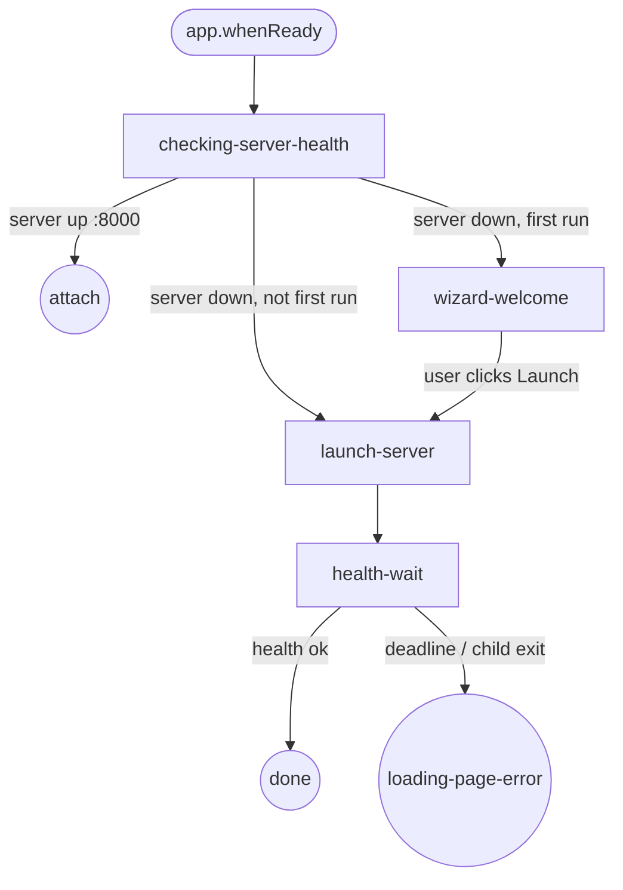

# Electron Bootstrap Flow

Doc covers Electron startup state machine from `app.whenReady()` to dashboard window.

Architecture: Electron is launcher only. Runtime install eliminated. Server resources read-only at `<resourcesPath>/server/node_modules/`. Updates ship via electron-updater whole-app replacement. See [electron-immutable-bundle.md](./electron-immutable-bundle.md).

## State machine (6 states, 3 triggers, 3 end states)

## States

| State | Purpose |
|---|---|
| `checking-server-health` | Probe `GET /api/health` on configured port. 3 s deadline. |
| `wizard-welcome` | First-run only. Single welcome card + `[Launch dashboard]`. Marker `~/.pi/dashboard/first-run-done`. Invariant: splash and wizard mutually exclusive. `closeSplash()` runs before `showWelcomeStep()`; `showSplash()` re-opens after wizard closes, before `launch-server` status update. Wizard window uses `show: false` + `ready-to-show` focus to avoid occlusion by splash `alwaysOnTop`. See change: fix-wizard-occluded-by-splash. |
| `launch-server` | `selectLaunchSource()` → `spawnFromSource()`. Stamps `DASHBOARD_STARTER=Electron`. `setSpawnedPid(pid)`. |
| `health-wait` | Poll `/api/health` until 200. Deadline `SERVER_READY_DEADLINE_MS = 15000`. |
| `attach` (end) | Server already running. Open main window, no spawn. |
| `done` (end) | Server up, owned by this Electron. Open main window. |
| `loading-page-error` (end) | Spawn failed or deadline elapsed. Open `loading.html` with `[Start server]` + `[Open Doctor]` + server-log tail. |

## Triggers

| Trigger | Source |
|---|---|
| `boot` | `app.whenReady` |
| `health-check-result` | `isDashboardRunning(port)` result |
| `server-spawn-result` | `spawnFromSource` resolve / reject |

## launchSource resolution (3 strategies)

`selectLaunchSource()` in `packages/electron/src/lib/launch-source.ts`:

1. `attach` — `isDashboardRunning(port)` returns running.
2. `devMonorepo` — `!app.isPackaged AND existsSync(cwd/packages/server/src/cli.ts)`.
3. `bundled` — fallback. `<resourcesPath>/server/node_modules/@blackbelt-technology/pi-dashboard-server/src/cli.ts`. `BundledServerMissingError` when missing.

Override: `DASHBOARD_PREFER_SOURCE=attach|bundled|devMonorepo`. Pre-R3 kinds (`piExtension`, `npmGlobal`, `extracted`) rejected with warning.

## Node binary resolution (2 strategies)

`pickNodeForServer()` in `packages/electron/src/lib/pick-node.ts`:

1. `bundled` — `<resourcesPath>/node/bin/node` (POSIX) / `<resourcesPath>/node/node.exe` (Win).
2. `execpath-fallback` — `process.execPath` + `ELECTRON_RUN_AS_NODE=1`. Corrupted-install signal, not normal mode.

## DASHBOARD_STARTER ownership

| Setter | Value |
|---|---|
| `packages/extension/src/server-launcher.ts` | `Bridge` |
| `packages/server/src/cli.ts` direct invocation | `Standalone` |
| `packages/electron/src/lib/launch-source.ts` (non-attach) | `Electron` |

`/api/health` returns `launchSource: "electron" | "standalone" | "bridge"`. `decideShutdownOnQuit` stops server only when `health.launchSource === "electron" AND health.pid === storedSpawnedPid`.

## Invariants

| Invariant | Source |
|---|---|
| App bundle read-only at runtime | electron-updater replaces whole `.app` |
| No `npm install` runs after build | `bundle-server.mjs` Phase 1 GO/NO-GO guard |
| Legacy `~/.pi-dashboard/` untouched | `detectLegacyManagedDir()` surfaces Doctor advisory only |
| Electron stops server only when it owns it | `decideShutdownOnQuit` pure helper |
| First-run wizard skipped after marker write | `~/.pi/dashboard/first-run-done` |
| Bundled-server missing → `BundledServerMissingError` | corrupted-install signal |
