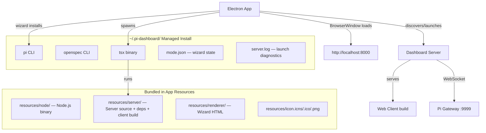
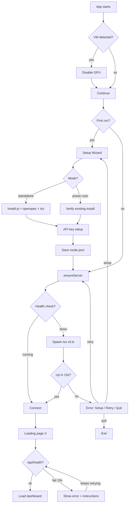

# Electron Desktop App — Session Notes

Comprehensive record of the full implementation session: what we built, what we tried, what failed, and the lessons learned. This documents the real journey including dead ends, so future work doesn't repeat mistakes.

## Session Timeline

### Phase 1: Branding & Icons
**Goal**: Fix the missing app icon, tray, About dialog, and app name.

**Starting state**: No icons anywhere. Tray used `nativeImage.createEmpty()` (invisible). No About dialog. Window title showed package.json name (`@blackbelt-technology/pi-dashboard-electron`).

**What we did**:
1. Used `nano-banana` (Gemini AI) to recenter the π glyph in the existing 512px icon → generated 1024×1024 master
2. Created macOS tray template icons (white π on transparent) via ImageMagick — AI couldn't generate actual transparency (produced checkerboard pattern instead)
3. Added `electron-icon-builder` to generate `.icns` and `.ico` from master PNG
4. Wired icon into `forge.config.ts` `packagerConfig.icon`
5. Fixed tray.ts with platform-specific icon loading
6. Created `app-menu.ts` with macOS menu (About, Edit, View, Window)
7. Set `app.name = "PI Dashboard"` and `title: "PI Dashboard"` on BrowserWindow

**Gotcha**: Electron Packager renames the icon to `electron.icns` internally — verified it's our custom icon via MD5 comparison.

### Phase 2: Packaging Formats
**Goal**: Replace Squirrel (Windows) with NSIS, add AppImage (Linux).

**What we tried first** (FAILED):
- `electron-forge-maker-nsis` and `electron-forge-maker-appimage` from electron-builder — these wrap `app-builder-lib.buildForge()` and export a plain function, NOT a Forge MakerBase class. Caused `TypeError: paths[0] must be of type string` in Forge's module resolution.

**What worked**:
- `@felixrieseberg/electron-forge-maker-nsis` — proper MakerBase implementation
- `@pengx17/electron-forge-maker-appimage` — proper MakerBase implementation

**Other issues hit during `npm run make`**:
1. Vite plugin expected `main` in package.json to be `.vite/*` → fixed by setting `"main": ".vite/build/main.js"` and adding `fileName: () => "main.js"` to vite.main.config.ts
2. `extraResource: ["./resources/node"]` failed when Node binary wasn't downloaded → made conditional with `fs.existsSync()`
3. `appdmg` native module failed to build on Node v25 (V8 API changes) → only buildable on Node 22
4. Node 22.11 couldn't `require()` Vite 8 (ESM-only) → need Node 22.12+

### Phase 3: Cross-Platform Build Script
**Goal**: One command to build for all platforms from macOS.

**Architecture**:
- macOS: builds natively (only platform that can make DMG)
- Linux: Docker container with build tools → DEB + AppImage
- Windows: Docker container with NSIS → exe (theory; Wine issues in practice)

**Docker issues encountered** (in order):
1. `node:22-bookworm` base image had GPG signature errors → switched to `bookworm-slim`
2. Even `-slim` had GPG errors → added `--allow-unauthenticated` apt flag
3. Disk space errors → `docker system prune -af` + `docker builder prune -af`
4. Missing `curl` → added to apt install
5. Missing `ca-certificates` → added to apt install (curl SSL errors)
6. Missing `xz-utils` → added to apt install (tar couldn't extract .tar.xz)
7. `nsis` package not in bookworm repos → made optional (non-fatal install)
8. `wine32:i386` failed to install → made optional (non-fatal)
9. `npx electron-forge` resolved to ancient v5.2.4 → changed to `npx @electron-forge/cli make`

### Phase 4: macOS Catalina Support
**Goal**: Run on macOS 10.15 (Catalina) in VMware.

**What we tried** (FAILED):
- `extendInfo: { LSMinimumSystemVersion: "10.15" }` in forge.config.ts — changes the plist but the Mach-O binary has `minos 11.0` baked in at compile time. Verified with `otool -l` showing `minos 11.0` and `sdk 14.0`. macOS refuses to load the binary.

**What worked**: Downgraded from Electron 33 to Electron 32 (`"electron": "^32.0.0"`). Electron 32 is the last version supporting macOS 10.15.

### Phase 5: VM White Screen Fix
**Goal**: Fix blank white screen on VMware macOS.

**Root cause**: VMware's virtual GPU doesn't support hardware acceleration required by Chromium.

**What we tried** (FAILED):
- `ELECTRON_DISABLE_GPU=1 open "PI Dashboard.app"` — macOS `open` command doesn't pass env vars to the app bundle. The variable never reaches the Electron process.

**What worked**: Auto-detect VM at startup before `app.whenReady()`:
- macOS: `sysctl -n hw.model` → checks for "VMware"/"VirtualBox"/"Parallels"
- Linux: `systemd-detect-virt`
- Windows: WMIC BIOS serial number
- Calls `app.disableHardwareAcceleration()` + `appendSwitch("disable-gpu")`

### Phase 6: Loading Page & Error Handling
**Goal**: No more blank white pages when server isn't running.

**Problems**:
1. Dev mode blindly loaded `localhost:8000` → white page if server down
2. Production mode called `dialog.showErrorBox()` and quit on failure
3. Outer `main().catch()` silently quit on any unhandled error

**Solution**: Branded loading page with π symbol, animated dots, and retry:
- Shows "Connecting to dashboard..." for first 15 seconds
- Then shows error with installation instructions
- Keeps retrying in background — auto-redirects when server appears
- Error dialog now shows 3 options: "Run Setup", "Retry", "Quit"
- Outer catch shows error in dialog instead of silent quit

### Phase 7: First-Run Wizard & Self-Contained App
**Goal**: App must work on completely clean OS with nothing installed.

**Problem**: `@blackbelt-technology/pi-dashboard` not published to npm → wizard can't install it.

**Solution**: Bundle the server as extraResource instead of installing from npm.
- `bundle-server.mjs` copies `packages/server/` + `packages/shared/` + built web client
- Wizard only installs: pi, openspec, tsx (no dashboard package)
- Server lifecycle finds CLI at `resources/server/packages/server/src/cli.ts`

**Wizard issue**: `execSync` for npm install blocked Electron's main process → "PI Dashboard is not responding". Fixed by switching to async `exec` wrapped in Promises.

**PATH issue**: Bundled Node used for npm, but postinstall scripts (`protobufjs`) couldn't find `node` because bundled binary wasn't on PATH. Fixed by prepending `path.dirname(getBundledNodePath())` to `env.PATH`.

### Phase 8: The __dirname Saga (Multiple Attempts)

> **UPDATE**: A second `__dirname` issue was found in Phase 11 — affecting the Vite-bundled main process itself (not the server). See Phase 11 below.

This was the longest debugging effort. The dashboard server crashed with `__dirname is not defined` when launched from the Electron app.

**Attempt 1**: Assumed it was node-pty being loaded as ESM due to `"type": "module"` propagation.
- Changed bundle root package.json to remove `"type": "module"` → **didn't fix it**

**Attempt 2**: Created `dirname-shim.js` that sets `globalThis.__dirname` as a getter returning `process.cwd()`. Added as `--import` before tsx.
- **Didn't fix it** — the error came from node-pty's CJS require chain, not ESM imports

**Attempt 3**: Tried `tsx/dist/register.js` instead of `tsx/dist/esm/index.mjs` (register.js does CJS+ESM shimming).
- **File didn't exist** in the installed tsx version

**Attempt 4**: Added `dirname-shim.js` as extraResource, loaded via `--import` flag.
- **Didn't fix it**

**Attempt 5 — Docker test environment**: Created `test-server-launch.sh` that runs the exact launch command in Docker. This revealed:
- node-pty's `package.json` correctly has NO `"type": "module"`
- The package.json chain showed all `(none/cjs)` — no ESM leak
- The REAL error was `Failed to load native module: pty.node` — wrong platform binary, not `__dirname`!

**Attempt 6**: The `__dirname` error on the actual VM was a DIFFERENT issue from the Docker test. The VM had stale `~/.pi-dashboard` files. But the core discovery from Docker testing was:
- `node --import tsx/dist/esm/index.mjs cli.ts` → no `__dirname` shim
- `tsx cli.ts` (tsx binary) → **works perfectly**, shims everything

**Final solution**: Rewrote `server-lifecycle.ts` to find and use the `tsx` binary directly:
```
spawn(tsxBin, [cliPath, "--port", port, "--pi-port", piPort])
```
Instead of:
```
spawn(nodePath, ["--import", tsxLoader, cliPath, "--port", port, "--pi-port", piPort])
```

### Phase 9: Native Module Platform Mismatch

**Problem**: `bundle-server.mjs` runs `npm install` on macOS → builds `pty.node` for `darwin-arm64`. The `.deb` package ships with macOS binaries. On Linux VM: `Failed to load native module: pty.node, prebuilds/linux-x64: not found`.

**What we tried**:
1. `npm rebuild` inside Docker after copying bundle → **built from source but only if build tools (python3, make, g++) present**
2. Needed to copy the built `pty.node` to `prebuilds/linux-x64/` and remove macOS/Windows prebuilds

**Final solution**: Two-phase bundling:
1. `bundle-server.mjs --source-only` — copies source + client, NO npm install (no macOS binaries)
2. `docker-make.sh` runs `npm install` inside Linux container → correct native modules
3. Copies `build/Release/pty.node` → `prebuilds/linux-x64/pty.node`
4. Removes `prebuilds/darwin-*` and `prebuilds/win32-*`

### Phase 10: Doctor Diagnostic

**Goal**: In-app diagnostic to check all components and help users fix issues.

**Checks** (12 total):
| Check | What it reports |
|-------|----------------|
| Electron | Version, Chromium version, app version, platform |
| System Node.js | Version, path (or "not found, bundled will be used") |
| Bundled Node.js | Version, path in app resources |
| Bundled npm | Version, path |
| pi CLI | Version, source (system/managed), path |
| openspec CLI | Version, source, path |
| Dashboard server code | Version, location (bundled/managed/system) |
| TypeScript loader (tsx) | Version, source, path |
| Dashboard server | Running status, version, mode, URL |
| Setup wizard | Completion status, mode, timestamp |
| API key | Configured or not |
| Managed install | Directory status |
| Server log | Last 10 lines (if server not running) |
| Server launch test | Attempts actual launch to capture crash message |

Accessible from: macOS → PI Dashboard menu → Doctor; Windows/Linux → Help → Doctor.

## Architecture



## Key Technical Details

### Server Launch Command
```bash
# What the Electron app actually runs:
/home/user/.pi-dashboard/node_modules/.bin/tsx \
  /usr/lib/pi-dashboard/resources/server/packages/server/src/cli.ts \
  --port 8000 --pi-port 9999

# Environment:
PATH=/usr/lib/pi-dashboard/resources/node/bin:~/.pi-dashboard/node_modules/.bin:$PATH
NODE_PATH=/usr/lib/pi-dashboard/resources/server/node_modules:~/.pi-dashboard/node_modules
```

### Server CLI Resolution Order
1. Bundled: `process.resourcesPath/server/packages/server/src/cli.ts`
2. Dev mode: `../../server/src/cli.ts` (relative to electron package)
3. Managed: `~/.pi-dashboard/node_modules/@blackbelt-technology/pi-dashboard/packages/server/src/cli.ts`
4. `require.resolve("@blackbelt-technology/pi-dashboard-server/cli.ts")`

### tsx Binary Resolution Order
1. Managed: `~/.pi-dashboard/node_modules/.bin/tsx`
2. System PATH: `which tsx`

### Wizard Install List
```javascript
// These are installed into ~/.pi-dashboard/ via bundled npm:
const packages = [
  "@mariozechner/pi-coding-agent",   // pi CLI
  "@fission-ai/openspec",            // openspec CLI
  "tsx",                              // TypeScript runner
];
// Note: dashboard server is NOT installed — it's bundled in the app
```

## File Layout

```
packages/electron/
├── forge.config.ts          — Electron Forge: makers, plugins, extraResource, executableName
├── package.json             — Electron 32.x, forge makers, electron-icon-builder
├── vite.main.config.ts      — Vite config for main process (fileName: "main.js")
├── vite.preload.config.ts   — Vite config for preload script (CJS format)
├── entitlements.plist        — macOS code signing entitlements
├── src/
│   ├── main.ts              — Entry: VM detect, single-instance, wizard, server launch, loading page, tray
│   ├── preload.ts           — contextBridge IPC for wizard renderer
│   ├── renderer/
│   │   └── wizard.html      — First-run setup wizard (mode select, install progress, API key)
│   └── lib/
│       ├── app-menu.ts      — Platform menus: macOS full / Win+Linux with View+About+Doctor, clipboard copy
│       ├── app-updater.ts   — electron-updater for GitHub Releases auto-update
│       ├── bundled-node.ts  — Resolve bundled Node.js/npm paths (packaged vs dev)
│       ├── dependency-detector.ts  — Detect pi, openspec, Node.js on PATH + managed install
│       ├── dependency-installer.ts — Async npm install with streaming progress + bundled Node on PATH
│       ├── doctor.ts        — 12+ diagnostic checks with versions, paths, launch test
│       ├── server-lifecycle.ts     — Health check → tsx binary spawn (inlined config, no shared pkg imports)
│       ├── tray.ts          — System tray: template image (macOS), ico (Win), png (Linux)
│       ├── ts-loader-resolver.ts   — Find tsx CJS register / ESM loader paths
│       ├── update-checker.ts       — Polls for dependency updates
│       ├── update-notifier.ts      — Shows update notifications
│       ├── window-state.ts  — Persists window bounds + maximized state
│       ├── wizard-ipc.ts    — IPC handlers: detect, install, save key, complete
│       └── wizard-state.ts  — Reads/writes mode.json, API key detection
├── resources/
│   ├── icon.png             — Master 1024×1024 RGBA (macOS squircle, transparent bg, π on dark navy)
│   ├── icon.icns            — macOS app icon (multi-resolution, generated)
│   ├── icon.ico             — Windows app icon (multi-resolution, generated)
│   ├── trayTemplate.png     — macOS tray 16×16 (white π on transparent)
│   ├── trayTemplate@2x.png  — macOS tray 32×32 (white π on transparent)
│   ├── desktop.ejs          — Linux .desktop template (StartupWMClass, keywords)
│   ├── dirname-shim.js      — Global __dirname fallback (safety net, may not be needed)
│   ├── icons/               — Generated resized PNGs (build artifact, gitignored)
│   ├── node/                — Bundled Node.js binary (build artifact, gitignored)
│   └── server/              — Bundled server + deps + client (build artifact, gitignored)
└── scripts/
    ├── build-installer.sh   — Main build: native + Docker (--linux, --windows, --all, --skip-client)
    ├── bundle-server.mjs    — Bundle server source + deps (--source-only for cross-platform)
    ├── docker-make.sh       — Docker entrypoint: source-only bundle → npm install → native rebuild → forge make
    ├── download-node.sh     — Download + strip Node.js binary for bundling
    ├── test-server-launch.sh     — Quick Docker server launch test
    ├── test-electron-install.sh   — Server-only Docker test (26 checks: deps, __dirname, spawn)
    ├── test-electron-install-inner.sh — Inner script for server-only test
    ├── test-deb-install.sh        — DEB install + Electron app Docker test (19 checks)
    ├── test-deb-install-inner.sh  — Inner script for DEB test
    ├── test-desktop-launch.sh     — Desktop-launch Docker test, minimal PATH (12 checks)
    ├── test-desktop-launch-inner.sh — Inner script for desktop-launch test
    └── Dockerfile.build           — node:22-bookworm-slim + build tools
```

## Build Commands

```bash
# === Native build (current platform) ===
npm run electron:build

# === Cross-platform via Docker ===
npm run electron:build -- --linux          # DEB + AppImage
npm run electron:build -- --windows        # NSIS .exe (needs Wine, fragile)
npm run electron:build -- --all            # Native + Linux + Windows
npm run electron:build -- --skip-client    # Skip web client rebuild

# === Low-level commands ===
cd packages/electron
npm run package                            # Package only (no installer)
npm run make                               # Package + make installer
npm run icons                              # Regenerate .icns/.ico from master PNG
npm run start:dev                          # Dev mode (ELECTRON_DEV=1)

# === Test (Docker) ===
bash packages/electron/scripts/test-electron-install.sh  # Server-only: deps + launch + spawn (26 checks)
bash packages/electron/scripts/test-deb-install.sh       # DEB install + Electron app (19 checks)
bash packages/electron/scripts/test-desktop-launch.sh    # Desktop PATH, no system node (12 checks)
bash packages/electron/scripts/test-server-launch.sh     # Quick server launch test

# === Debug ===
cat ~/.pi-dashboard/server.log                           # Server launch diagnostics

# === Clean ===
rm -rf packages/electron/out                             # Built installers
rm -rf packages/electron/resources/server                # Bundled server
rm -rf packages/electron/resources/node                  # Bundled Node.js
docker rmi pi-dashboard-electron-builder                 # Docker build image
```

## CI Workflow

`.github/workflows/electron-build.yml` — triggers on `v*` tags or `workflow_dispatch`.

| Runner | Platform | Outputs | Notes |
|--------|----------|---------|-------|
| `macos-14` | darwin/arm64 | `.dmg` | Native ARM |
| `macos-13` | darwin/x64 | `.dmg` | Native Intel |
| `ubuntu-latest` | linux/x64 | `.deb` + `.AppImage` | Installs dpkg, fakeroot, libarchive-tools |
| `windows-latest` | win32/x64 | `.exe` (NSIS) | Native, no Wine needed |

Each runner builds natively. No cross-compilation in CI. Release job creates draft GitHub Release with all artifacts.

**Local testing with `act`**: Only Linux jobs work (Docker-based). macOS/Windows need real runners.

## Startup Flow (Clean OS)



## Lessons Learned

1. **tsx binary vs --import**: Always use the `tsx` binary to run TypeScript servers. The `--import` ESM loader doesn't shim CJS globals (`__dirname`, `__filename`). This wasted hours of debugging.

2. **Native modules are platform-specific**: `npm install` on macOS builds `.node` files for macOS. You MUST rebuild inside the target platform's environment (Docker for Linux, native runner for Windows).

3. **`"type": "module"` propagation**: Node.js walks up the directory tree to find `package.json`. If a parent has `"type": "module"`, ALL `.js` files underneath are treated as ESM — including CJS packages in `node_modules`. The bundle root must NOT have this field.

4. **Electron version = macOS minimum**: The `minos` field in the Mach-O binary is set at Electron compile time. No plist override can change it. Must use the right Electron version for your target OS.

5. **macOS `open` doesn't pass env vars**: Can't use `ELECTRON_DISABLE_GPU=1 open "App.app"`. Must detect VMs programmatically.

6. **Forge maker API**: Official `@electron-forge/maker-*` packages extend `MakerBase`. Community wrappers from electron-builder (`electron-forge-maker-*`) export plain functions — incompatible with Forge 7.x module resolution.

7. **Docker disk space**: Electron builds with full `npm ci` need significant disk space. `docker system prune -af --volumes` before builds. Increase Docker Desktop disk limit if needed.

8. **`npx` package name resolution**: `npx electron-forge` resolves to the deprecated v5 package, not `@electron-forge/cli`. Always use the full scoped name.

9. **Async is critical in Electron main process**: `execSync` blocks the main process and freezes the UI. All npm install, detection, and spawn operations must be async.

10. **Bundle the server, don't install it**: If the npm package isn't published, bundle the source + deps as extraResource. The wizard only installs external tools (pi, tsx).

11. **ESM dynamic imports fail in packaged Electron**: Lazy `import()` of `@scope/package` cannot resolve packages in `resources/server/node_modules/` from the Electron main process. Inline the functionality instead.

12. **`process.resourcesPath` is Electron-only**: The tsx-launched server process does NOT have `process.resourcesPath`. Use `process.execPath` to find the running Node.js binary.

13. **Desktop launchers don't source shell profiles**: Electron apps on Linux get minimal PATH (`/usr/local/bin:/usr/bin:/bin`). `~/.local/bin` and other user dirs are missing. `buildSpawnEnv()` must add them explicitly.

14. **`stdio: "ignore"` breaks shell pipelines**: `sleep N | cmd` inside `sh -c` fails when sh's stdin is `/dev/null`. Use `tail -f /dev/null | cmd` instead — `tail -f` uses inotify and doesn't depend on the outer stdin.

15. **`window-all-closed` fires after wizard**: On Linux, closing the wizard window triggers `window-all-closed` before the main window exists. Guard with a startup flag.

### Phase 11: __dirname in Vite ESM Bundle (Linux)

**Problem**: Even after Phase 8's tsx fix, the Electron app crashed on Linux with `__dirname is not defined` — but this time in the **main process** itself, not the server.

**Root cause**: The Electron main process is bundled by Vite as ESM (`"type": "module"` in electron's `package.json`, output uses `import` statements). In ESM, `__dirname` is not available. Two source files used bare `__dirname` without defining it:

1. `packages/electron/src/lib/bundled-node.ts` — `getResourcesPath()` dev fallback
2. `packages/electron/src/lib/server-lifecycle.ts` — `findServerCli()` dev candidate path

Two other files (`wizard-window.ts`, `tray.ts`) already had the correct pattern.

**Why it worked on macOS**: The `process.resourcesPath` path was always found first in packaged builds, so the `__dirname` fallback was never evaluated. But in ESM, the array literal `[..., path.resolve(__dirname, ...), ...]` evaluates ALL elements eagerly — `__dirname` throws `ReferenceError` even if the result would be filtered out.

**Fix**: Added ESM-compatible `__dirname` derivation to both files:
```typescript
import { fileURLToPath } from "node:url";
const __dirname = path.dirname(fileURLToPath(import.meta.url));
```

### Phase 12: Docker Install Test

**Goal**: Automated end-to-end test that verifies the full Electron app install + wizard + server launch flow on clean Linux.

**What it tests** (19 checks):
1. Bundled resources (Node.js, npm, server CLI, node_modules)
2. Package.json safety (no `"type": "module"` leaking into CJS deps)
3. Native module verification (node-pty prebuild for linux-x64, no macOS/Windows leaks)
4. Wizard simulation (tsx install, mode.json creation)
5. `__dirname` safety (ESM derivation, CJS shimming, node-pty loading)
6. Server launch + health check + API endpoint verification

**Architecture**: Docker container with Ubuntu 22.04, downloads Linux x64 Node.js in the build phase, npm-installs server deps (building native modules from source), then runs tests as non-root user.

**Command**: `bash packages/electron/scripts/test-electron-install.sh`

### Phase 13: Server Lifecycle — Inlined Config & Health Check

**Problem**: After the wizard completed, `ensureServer()` failed because it used dynamic `import()` to load `@blackbelt-technology/pi-dashboard-shared`. In the packaged Electron app, those packages are inside `resources/server/node_modules/` which ESM dynamic imports **cannot resolve** from the Electron main process.

**Fix**: Replaced all lazy imports in `server-lifecycle.ts` with inlined implementations:
- `loadMinimalConfig()` — reads port/piPort directly from `~/.pi/dashboard/config.json`
- `isDashboardRunning()` — simple HTTP fetch to `/api/health`
- Removed mDNS discovery (not needed for local Electron launch)

### Phase 14: Window Close & Startup Guard

**Problem 1**: On Linux/Windows, closing the Electron window hid it to the system tray (macOS convention). On Linux, the tray is often invisible → user can't quit the app.

**Fix**: Only macOS uses hide-to-tray. Linux/Windows quit on close via `window-all-closed` handler.

**Problem 2**: The `window-all-closed` handler fired when the wizard window closed (before the main window existed), quitting the app before the dashboard launched.

**Fix**: Added `isStartingUp` guard — `window-all-closed` only calls `quit()` after startup completes.

**Problem 3**: The fallback `serverUrl` path used a broken `import()` from the shared package.

**Fix**: Replaced with hardcoded default `http://localhost:8000`.

### Phase 15: Client Build Path in Bundled Server

**Problem**: Server logged "No client build found — running in API-only mode". The `bundle-server.mjs` copied the client to `dist/client/` but the server resolves `path.join(__dirname, '../../dist/client')` from `packages/server/src/`, which goes up to `packages/` — expecting client at `packages/dist/client/`.

**Fix**: Changed `bundle-server.mjs` to copy client to `packages/dist/client/`.

### Phase 16: Node.js on PATH for Spawned Scripts

**Problem**: `pi` binary uses `#!/usr/bin/env node` shebang. On the Linux VM with no system Node.js (only bundled at `/usr/lib/pi-dashboard/resources/node/bin/`), spawned `pi` failed with `/usr/bin/env: 'node': No such file or directory`.

**What didn't work**: Using `process.resourcesPath` to find bundled Node.js — this is an Electron-only property, always `undefined` in the tsx-launched server process.

**Fix**: `buildSpawnEnv()` in `process-manager.ts` now adds:
- `path.dirname(process.execPath)` — reliably finds the current Node.js binary
- `~/.local/bin`, `~/.npm-global/bin`, `/usr/local/bin` — common user bin dirs missing from desktop launcher PATH

### Phase 17: Headless Session Spawn — The stdin Pipeline Bug

**Problem**: `pi --mode rpc` exited immediately when spawned by the server. Extensive debugging revealed:
- Pi exits cleanly (code 0) with zero output
- Pi works fine from an interactive terminal
- Pi works when spawned by Node.js with `stdio: ['pipe', 'pipe', 'pipe']`
- Pi dies when the outer shell's stdin is `/dev/null` (which `stdio: "ignore"` sets)

**Root cause**: The `sleep 2147483647 | pi --mode rpc` pipeline fails when the shell's own stdin is `/dev/null`. The shell's `/dev/null` stdin interferes with the internal pipeline pipe setup, causing pi to receive EOF on stdin and exit immediately. This is a Linux-specific shell behavior.

**What didn't work**:
1. `stdio: ["pipe", "ignore", "ignore"]` — stdin pipe gets GC'd by Node.js after `unref()`, closing the write end
2. Spawning pi directly (no shell wrapper) — same GC issue with detached+unref
3. `setsid` vs no-setsid — not the cause

**Fix**: Replaced `sleep 2147483647` with `tail -f /dev/null` as the pipe-keeping process. `tail -f /dev/null` uses inotify internally and doesn't depend on the shell's stdin, so it works correctly even when the outer shell has `stdio: "ignore"` (`/dev/null`).

```typescript
spawn("sh", ["-c", `tail -f /dev/null | ${piCmd}`], {
  cwd, detached: true, stdio: "ignore", env,
});
```

### Phase 18: Additional Improvements

- **Doctor → Copy to Clipboard**: Doctor dialog now has a "Copy to Clipboard" button
- **Menu restructured (Linux/Windows)**: About and Doctor are top-level menu items; View menu with Reload, DevTools, Zoom
- **OAuth popup close detection**: Detects when user closes OAuth window without completing (e.g., Claude without Pro plan), shows helpful message instead of infinite spinner
- **Wizard install progress**: Animated pulse on running items, elapsed timer per package, live npm output streaming
- **VS Code Server install guide**: Added openvscode-server as alternative installation option
- **API key save fix**: `acquireLock()` now creates `~/.pi/agent/` directory before lock; provider ID mapping fixed for auth.json
- **Icon refresh**: macOS-style squircle with transparent background, ~28% corner radius, regenerated .icns/.ico
- **Auto-shutdown default**: Changed `autoShutdown` from `true` to `false` (only useful for TUI auto-start)

### Phase 19: Docker Test Suite

Three levels of Docker-based testing:

| Test | Command | What it tests |
|------|---------|---------------|
| Server-only | `test-electron-install.sh` | Bundle resources, deps, __dirname, server launch, session spawn (26 checks) |
| DEB install | `test-deb-install.sh` | Full DEB install → Electron app → server → session spawn (19 checks) |
| Desktop launch | `test-desktop-launch.sh` | Minimal PATH (no system node), wizard setup, Electron launch, session spawn (12 checks) |

The desktop-launch test catches bugs that only appear on real Linux desktops where the Electron app is started from a `.desktop` file with minimal PATH.

### Phase 20: Bridge Extension Bundling & Auto-Registration

**Problem**: Pi sessions spawned from the Electron app appeared briefly in the dashboard then vanished. The pi process started but never connected back to the dashboard server.

**Root cause**: The bridge extension (`packages/extension/`) was NOT bundled in the DEB/DMG package. Without it, pi had no way to discover and connect to the dashboard's WebSocket gateway. The extension was only discoverable in development mode (via the monorepo root `package.json` `"pi"` field).

**Fix** (3 parts):
1. **`bundle-server.mjs`** — Added `packages/extension/` to the server bundle and included it in the workspace list so its dependencies (`ws`, shared types) resolve via `node_modules/`.
2. **`extension-register.ts`** — New server module that detects the bundled extension path and adds it to `~/.pi/agent/settings.json` (pi's global package list). No-op in dev mode (no bundled extension). Cleans stale dashboard paths on location change.
3. **`server.ts`** — Calls `ensureBridgeExtensionRegistered()` at startup, before session discovery.

**Why this works**: Pi discovers extensions from packages listed in `~/.pi/agent/settings.json`. Local paths are resolved in-place. The extension's `package.json` has a `"pi"` field declaring `src/bridge.ts` as an extension. Dependencies resolve via the server bundle's workspace `node_modules/` (shared types, ws). Docker test updated to verify extension is bundled.

### Phase 21: Windows Support — Vite Externals, Paths with Spaces, .cmd Spawning

**Problem**: The Windows portable exe crashed immediately with no visible error. Even a diagnostic log file was never created.

**Root cause chain** (4 issues fixed):

1. **Vite bundling Node.js builtins** — `vite.main.config.ts` only externalized `electron` and `electron-updater`. All Node.js builtins (`node:fs`, `node:path`, etc.) were bundled by Vite, which broke `require()` calls. The bundled ESM environment didn't expose `require`, causing `Error: Calling 'require' for "node:fs" in an environment that doesn't expose the require function`. Fixed by adding all `builtinModules` to the `external` list in both `vite.main.config.ts` and `vite.preload.config.ts`.

2. **Bundled npm path on Windows** — `getBundledNpmPath()` only checked `node/lib/node_modules/npm/bin/npm-cli.js` (Unix layout). Windows Node.js puts npm at `node/node_modules/npm/bin/npm-cli.js` (no `lib/` prefix). Wizard install failed with "No Node.js available". Fixed by checking both paths.

3. **Spawning .cmd files on Windows** — `tsx.cmd` and `pi.cmd` are batch files that require `shell: true` in Node.js `spawn()`. Without it: `spawn EINVAL`. Fixed in both `server-lifecycle.ts` (server launch) and `process-manager.ts` (session spawn).

4. **Paths with spaces** — Username `Róbert Csákány` produced paths like `C:\Users\Róbert Csákány\.pi-dashboard\...`. With `shell: true`, the shell splits at spaces. The command `C:\Users\Róbert` was treated as the executable. Fixed by quoting both the command and arguments: `spawn('"${tsxBin}"', args.map(a => '"${a}"'), { shell: true })`.

**Additional Windows fixes**:
- VM detection: added `wmic computersystem get manufacturer,model` check (catches "VMware, Inc." and "Hyper-V")
- Docker cross-build: switched from NSIS (needs Wine for uninstaller extraction) to ZIP archive. NSIS builds natively in CI on Windows.
- Tray icons: regenerated from master icon with bold π shape (182 opaque pixels at 16×16, was 62)

## Known Issues & Future Work

1. **Windows NSIS cross-compilation** — NSIS uninstaller extraction requires Wine to run a 32-bit exe. Docker cross-build produces a ZIP instead. CI builds NSIS natively on Windows.
2. **macOS universal binary** — Separate arm64 and x64 DMGs. TODO: `@electron/universal` to combine.
3. **Package size** — AppImage is ~150MB+. Could strip more from node_modules or use compression.
4. **Auto-update for AppImage** — `electron-updater` works with DMG/NSIS but AppImage needs different mechanism.
5. **Code signing** — macOS signing configured (env-gated). Windows signing not set up.
6. **Server log not always written** — If tsx binary itself fails to spawn (e.g., wrong architecture), no log is created. Doctor's launch test helps but isn't perfect.
7. **Clean OS testing** — Three Docker test scripts cover server-only, DEB install, and desktop-launch scenarios. VMware still useful for visual testing.
8. **Shell stdin pipeline bug** — `sleep N | cmd` breaks when the outer shell stdin is `/dev/null`. Use `tail -f /dev/null | cmd` instead. This is a Linux-specific behavior.
9. **OAuth without Pro plan** — Anthropic OAuth redirects to chat UI instead of OAuth callback when user has no Pro plan. Popup close detection now handles this gracefully.

## Lessons Learned (Addendum)

16. **Bundle ALL components pi needs**: The bridge extension must be bundled alongside the server — without it, pi starts but never connects to the dashboard. In dev mode, the monorepo `package.json` `"pi"` field handles discovery, but bundled installs need the extension registered in `~/.pi/agent/settings.json` as a local path package.

17. **Externalize ALL Node.js builtins in Vite**: Vite for Electron main process must externalize every `node:*` module. If even one is bundled, `require()` calls break in the ESM bundle. Use `builtinModules` from `node:module` to generate the full list.

18. **Windows .cmd files need `shell: true`**: npm/yarn bin stubs on Windows are `.cmd` batch files, not executables. Node.js `spawn()` cannot run them directly — it needs `shell: true`. Always check `process.platform === 'win32'`.

19. **Quote all paths when `shell: true`**: On Windows with `shell: true`, paths containing spaces break the command. Always wrap the command and each argument in double quotes: `'"${path}"'`.

20. **Check both Unix and Windows npm layouts**: The Node.js distribution has npm at `lib/node_modules/npm/` on Unix but `node_modules/npm/` on Windows (no `lib/` prefix). Check both paths when resolving bundled npm.
