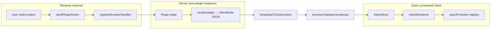

# Plugin Intent Protocol

Server-driven plugin UI rendering. Plugins describe what to render as JSON
intent trees; clients render via the local primitive registry. Multi-client
coherence is automatic — one server emission, identical render on every
connected client.

See change: `adopt-server-driven-intent-rendering`.

## Architecture



## Wire format

### `PluginIntentsMessage` (server → client)

```typescript
{
  type: "plugin_intents",
  pluginId: "flows",
  sessionId: "abc-123" | null,    // null for global slots
  slot: "session-card-action-bar", // a SlotId
  intent: IntentNode | null,       // null = clear this slot
}
```

### `IntentNode`

```typescript
{
  primitive: "ui:action-list",     // registry key resolved on client
  props?: {                        // recursively-resolved props
    actions: [...],
    body: { primitive: "ui:markdown", props: { content: "..." } },
  },
  key?: "stable-react-key",
  actions?: {
    onClick: { pluginId, action, payload },
  },
}
```

### `PluginActionMessage` (client → server)

```typescript
{
  type: "plugin_action",
  pluginId: "flows",
  sessionId: "abc-123",
  action: "flow.run",
  payload: { flow: "X" },
}
```

## Currently registered primitives

| Key | Component | Props |
|-----|-----------|-------|
| `ui:agent-card` | AgentCardShell | name, status, headerRight, stats, children |
| `ui:markdown-content` | MarkdownContent | content |
| `ui:confirm-dialog` | ConfirmDialog | message, onConfirm, onCancel |
| `ui:dialog-portal` | DialogPortal | children |
| `ui:searchable-select-dialog` | SearchableSelectDialog | title, options, onSelect, onCancel |
| `ui:zoom-controls` | ZoomControls | onZoomIn, onZoomOut, onReset, scale |
| `ui:format-tokens` | formatTokens helper | (n: number) => string |
| `ui:format-duration` | formatDuration helper | (ms: number) => string |
| `ui:action-list` | ActionList | actions: UiActionListItem[] |
| `ui:status-pill` | StatusPill | state, text, icon? |

## Writing a server-side plugin

```typescript
// packages/<your-plugin>/src/server/index.ts
import type { ServerPluginContext } from "@blackbelt-technology/dashboard-plugin-runtime/server";

export async function registerPlugin(ctx: ServerPluginContext): Promise<void> {
  ctx.registerBrowserHandler("plugin_action", (msg) => {
    const m = msg as { pluginId?: string; action?: string; payload?: any };
    if (m.pluginId !== "my-plugin") return;
    // ... handle action, update state, broadcast new intent
  });

  // When state changes:
  ctx.broadcastToSubscribers({
    type: "plugin_intents",
    pluginId: "my-plugin",
    sessionId: "abc",
    slot: "session-card-action-bar",
    intent: {
      primitive: "ui:action-list",
      props: { actions: [{ label: "Click me", dataAction: { pluginId: "my-plugin", action: "click" } }] },
    },
  });
}

export default registerPlugin;
```

## Adding a new primitive

1. Add a key to `UI_PRIMITIVE_KEYS` in `packages/shared/src/dashboard-plugin/ui-primitives.ts`.
2. Define typed props interface in the same file.
3. Add `"ui:my-key": ComponentType<...>` to `UiPrimitiveMap`.
4. Create the React component in `packages/client-utils/src/MyComponent.tsx`.
5. Add a subpath export in `packages/client-utils/package.json`.
6. Import and register in `packages/client/src/main.tsx`.

## Cross-client coherence

When a plugin broadcasts an intent, every WebSocket-subscribed client
receives the same JSON envelope. Each client's `IntentStore` caches it
keyed by `(pluginId, sessionId, slot)`. Slot consumers subscribe via
`useSlotIntents(slot, sessionId)` and re-render when their cache entry
changes.

The bridge fans out from `browserGateway.broadcast` (one line in
`server.ts:1242` — already in place). The same code path that delivers
`session_added` and other events delivers intents.

Server-side cache: `pluginIntentCache.set(...)` stores the latest intent
per key so a reconnecting client gets the current state via the existing
`subscribe` replay (see `subscription-handler.ts:replayUiState`).

## Limitations (current as of v1)

- **Server-side event-stream subscription is not yet exposed to plugins.**
  Plugins can receive `plugin_action` from clients (reverse channel works)
  but cannot subscribe to push-style notifications of pi events. They poll
  via `ctx.eventStore.getEvents(sessionId)` if needed. Live broadcasts
  from server-derived state changes (e.g. flows-plugin's state reducer
  responding to flow_started events) require an upcoming ServerPluginContext
  extension.
- **Plugin-shipped primitives** aren't supported yet. Today all primitives
  are registered by the shell's `main.tsx`. Plugins emitting an intent
  referencing an unregistered primitive get an `UnknownPrimitive` fallback.
- **Command-route slot** isn't migrated to intents (its trigger is URL
  navigation, not server state).
- **Content-view with per-user state** (e.g. FlowYamlPreview "open" flag)
  isn't migrated (would require server-side per-session-per-user UI state,
  not in scope).

## Related files

- `packages/shared/src/dashboard-plugin/intent-types.ts` — wire format types
- `packages/dashboard-plugin-runtime/src/intent-store.ts` — client-side cache + hook
- `packages/dashboard-plugin-runtime/src/intent-renderer.tsx` — recursive renderer
- `packages/dashboard-plugin-runtime/src/plugin-action-bridge.ts` — reverse channel
- `packages/server/src/plugin-intent-cache.ts` — server-side replay cache
- `packages/client/src/main.tsx` — primitive registration site
