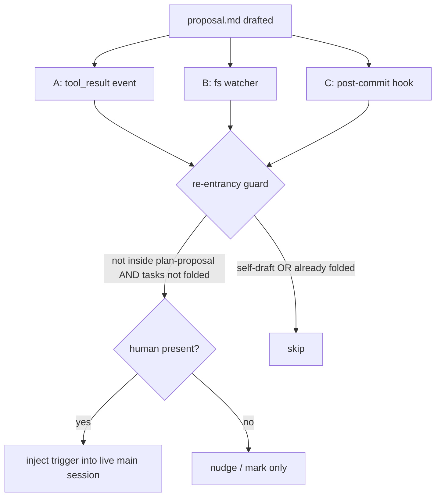

# Auto-Trigger `plan-proposal` on Proposal Draft — Research Dossier

> Status: **research / pre-planning** (explore mode output, no implementation).
> Goal: map whether `plan-proposal` can run automatically when a `proposal.md` drafts, and how.
> Scope: no OpenSpec change, no code. Design investigation only. Pick up later.
> Date: 2026-07-17.

---

## 1. Question

Can `plan-proposal` run automatically when `proposal.md` drafts?
Investigate feasibility + mechanisms.

---

## 2. Core Finding / Verdict

Detection: easy, native.
Fully-automatic *execution*: BLOCKED by design.

`plan-proposal` frontmatter + "Hard constraint" section pin skill to main interactive session.
Never a subagent. Never headless.

Reason:
- `plan-proposal` invokes `doubt-driven-review` → spawns fresh-context reviewer + interactive cross-model offer. Nested subagent spawn blocked.
- `plan-proposal` invokes `scenario-design` → proposal/design-stage HARD gate calls `ask_user`.

Both need a live main session.

Consequence: automation only DETECTS draft + INJECTS trigger into live main session.
Cannot complete unattended.
**Automation = launcher, not runner.**

---

## 3. Re-Entrancy Smell

`plan-proposal` step 1 IS the drafting step (`openspec-new-change` / `-ff` / `-continue`).
Trigger "on proposal drafted" fires on skill's own output → circular.

Clean seam: fire only when proposal appears OUTSIDE orchestrated flow.
- raw `openspec-new-change`
- hand-written `proposal.md`
- `git pull`

Detectable state: `openspec/changes/<change>/proposal.md` exists BUT `tasks.md` not folded / no `test-plan.md` yet.

---

## 4. Mechanisms (grounded in repo)

### Option A — pi extension event hook (most native, in-session)

- `pi.on("tool_result", …)` inspects tool + path (docs/extensions.md).
- Match Write/Edit to `**/openspec/changes/*/proposal.md`.
- Call `pi.sendUserMessage("plan this change: <name>", { deliverAs: "followUp" })` or `pi.sendMessage(...)`. Both documented in docs/extensions.md.
- Runs in same live main session → satisfies interactivity constraint.
- Limitation: fires only when write happens via tool call in that session. Misses `git pull` / external-editor writes.
- Needs re-entrancy guard + config toggle.

### Option B — dashboard filesystem watcher + send-prompt API (cross-session)

- Server has send-prompt plumbing (`packages/server/src/session-api.ts`).
- Add watcher on `openspec/changes/*/proposal.md`.
- Debounced create → inject "run plan-proposal for <change>" into chosen live session, or surface dashboard nudge/button.
- Catches proposals drafted by any means.
- Cons: must route to interactive main session (headless spawn can't finish). Needs debounce (editors write partial files) + session-selection logic.

### Option C — git post-commit hook (nudge only)

- Detect committed `proposal.md`. Print reminder / mark in dashboard.
- Deterministic.
- Git hook can't drive interactive session → nudge only.

### Flow

---

## 5. Constraints / Flags Before Building

- Can't be headless. Automation = launcher, not runner. Frame as auto-suggest / auto-open, not auto-complete.
- Guard against self-trigger. Skip when draft came from `plan-proposal` itself or when `test-plan.md` / folded tasks exist.
- Make opt-in. Toggle required. Blanket auto-fire intrusive. Some drafts exploratory.
- Home for code: extension (Option A) or server watcher (Option B). Skill `.md` itself unchanged.

---

## 6. Sources / Refs

- `.pi/skills/plan-proposal/SKILL.md` — hard constraint, step 1 drafting, worktree boundary.
- `node_modules/@earendil-works/pi-coding-agent/docs/extensions.md` — `tool_result`, `pi.sendUserMessage`, `pi.sendMessage`, `deliverAs`.
- `packages/server/src/session-api.ts` — send-prompt plumbing.
