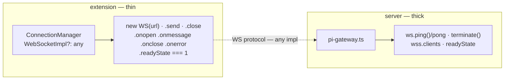
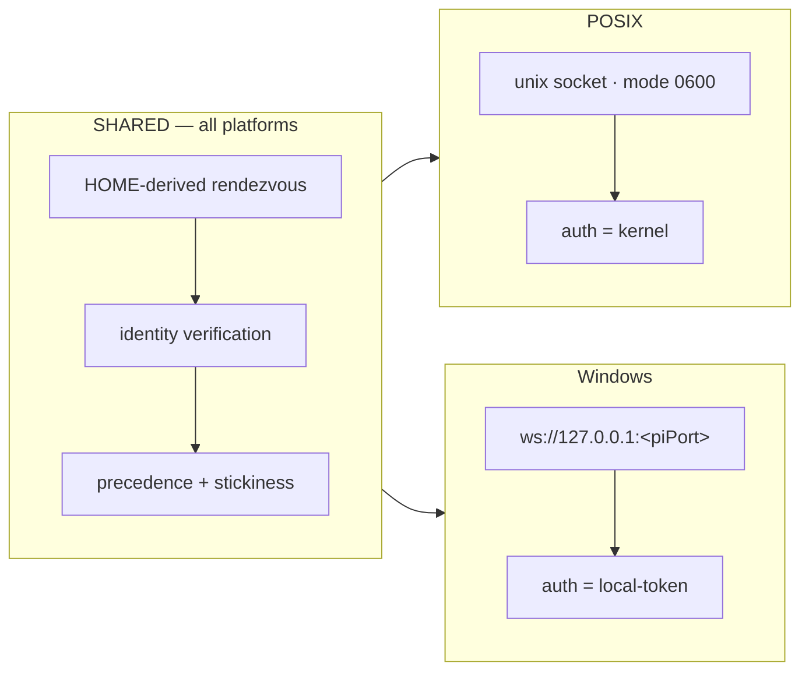

# bridge transport + identity — P2P instead of WebSocket for bridge ↔ server?

**Date:** 2026-08-13
**Status:** Explore-mode research dossier. No implementation, no change.
**Verdict:** Do not adopt P2P transport. Pain is not the transport — it is (1) unauthenticated name→endpoint indirection and (2) absent peer identity. Fix local with HOME-derived rendezvous + platform-appropriate transport carrying the unchanged WebSocket protocol; fix remote by making the bridge a paired device.

## Question

Should bridge↔server (pi node ↔ dashboard) use a P2P network instead of WebSocket?

## Driver

Reported pain: WebSocket fragile. Discovery mechanism causes headaches.

Planned feature: locally started pi joins a **remote** pi-dashboard.

## Churn evidence — one connection, ~18 openspec changes in 5 months

Archived:

| Date | Change |
|---|---|
| 2026-03-23 | `fix-connection-crash-resilience` |
| 2026-04-03 | `websocket-connection-resilience` |
| 2026-04-10 | `mdns-server-discovery` |
| 2026-04-27 | `diagnose-empty-mdns-scan` |
| 2026-05-01 | `fix-restart-bridge-auto-start-race` |
| 2026-05-03 | `fix-stale-sessions-on-reconnect` |
| 2026-05-09 | `spawn-correlation-token` |
| 2026-05-31 | `fix-dashboard-spawn-correlation-by-token` |
| 2026-06-30 | `fix-bridge-server-start-diagnostics` |
| 2026-07-22 | `fix-recovery-offer-bridge-liveness-gate` |
| 2026-07-24 | `fix-bridge-resume-disconnect` |
| 2026-07-24 | `fix-tags-lost-on-bridge-reattach` |
| 2026-08-05 | `restore-ask-user-tool-state-on-reconnect` |
| 2026-08-05 | `serialize-bridge-message-pump` |
| 2026-08-09 | `fix-bridge-stale-ctx-crash` |
| 2026-08-13 | `fix-duplicate-bridge-registration` |

Open:

| Change |
|---|
| `fix-bridge-mdns-migration-hijack` |
| `fix-bridge-autostart-port-resolution` |
| `fix-spawn-correlation-ttl-coupling` |

Plus 3 dedicated diagnostic skills: `diagnose-bridge-endpoint-hijack`, `diagnose-spawn-register-timeout`, `repair-wedged-resumed-session`.

## 4-class root-cause taxonomy

Core contribution of this doc. Every one of the ~18 changes lands in one of four classes. P2P dissolves classes 1–2, touches nothing in 3–4.

| Class | Root cause | P2P fixes? |
|---|---|---|
| 1. Endpoint ambiguity | Unauthenticated name→endpoint indirection can resolve wrong | ✅ Structural — dial-by-key |
| 2. Peer identity | Transport gives no identity; server reconstructs from self-reported pid + cwd + token (priority token > pid > cwd, see `pi-gateway.ts`) | ✅ Structural — key IS identity |
| 3. Application protocol | Ordering, dropped events, state restore | ❌ P2P fixes nothing |
| 4. Lifecycle races | Server process ownership | Mostly untouched |

~Half the churn lives in classes 1–2 — exactly what P2P dissolves. Original iroh note missed this: it only asked "does this leg cross a NAT?".

## Seam analysis — where the transport actually touches code

Bridge side thin. `ConnectionManager` (`packages/extension/src/connection.ts`) already takes `WebSocketImpl?: any` and touches ~9 members: `new WS(url)`, `.send`, `.close`, `.onopen`, `.onmessage`, `.onclose`, `.onerror`, `.readyState === 1`.

Server side thick. `pi-gateway.ts` depends on WS protocol features: `ws.ping()` / `'pong'` (contention liveness oracle in `bridge-contention.ts`), `terminate()`, `wss.clients`, 4-state `readyState`.



## Decisive experiment — WS over unix domain socket works

Verified working: `ws+unix:///path.sock:/` client + `WebSocketServer({server})` over `http.createServer().listen(sockPath)`.

Confirmed surviving: `ping`→`pong` (contention probe oracle), `readyState === 1`, `wss.clients.size`, `terminate` present.

`chmod 0600` on socket = owner-only = local auth for free.

**Therefore transport swap needs ZERO protocol change.** Unlike iroh — adopting it would have forced re-founding the ping/pong liveness oracle.

## Failure-mode inversion (key insight)

| Stale artifact | Failure | Signature |
|---|---|---|
| Stale unix socket | `ENOENT` / `ECONNREFUSED` | Immediate + definitive |
| Stale mDNS advert | Connect to real, live, WRONG server | Reconnect-loop 23h, silent |

Stale socket fails loudly. Stale mDNS fails silently.

## Discovery overrides explicit intent

`server-auto-start.ts` rationale for `PI_DASHBOARD_NO_MDNS` (verbatim): "a co-located real dashboard advertising on mDNS would be discovered here and override the bridge's explicit `PI_DASHBOARD_URL`, hijacking the connection off the isolated gateway".

So remote-join is broken today by the local discovery path — even though `PI_DASHBOARD_URL` already exists (`packages/extension/src/bridge.ts:725`):

```ts
const dashboardUrl = process.env.PI_DASHBOARD_URL ?? `ws://localhost:${config.piPort}`;
```

## Security finding — `:9999` pi gateway has NO auth

`grep token|auth|secret packages/server/src/pi/pi-gateway.ts` → comments only. One states the identity handshake "is not a claim about the gateway port's own authentication".

Contrast `:8000`: OAuth + `bearer-auth.ts` + network guard + CORS + CSP + `ws-ticket.ts` + Ed25519 identity.

`:9999` not loopback-pinned by policy: `piGateway.start(config.piPort, config.host)` follows `--host` / `PI_DASHBOARD_HOST`; `docker/Dockerfile` has `EXPOSE 8000 9999`; `docker/.env.example` documents bind host must be `0.0.0.0`.

Reaching `:9999` ⇒ register any `sessionId`, displace live bridge, receive `send_prompt` / `set_model`.

## Mechanisms already in repo, not wired to bridge

| Mechanism | What it gives |
|---|---|
| `openspec/specs/server-identity-keypair` | Persistent Ed25519 identity. Fingerprint stable across changing URLs. Nonce challenge. Pin identity + detect impostor. **That IS the property wanted from P2P — identity == address.** |
| `pairing/pairing.ts` + `pairing/paired-devices.ts` | Device pairing store |
| `auth/bearer-auth.ts` | Bearer auth |
| `auth/ws-ticket.ts` | `WsRouteScope` = `"browser" | "terminal" | "live"` — **no bridge scope** |
| `lifecycle/home-lock.ts` | Per-HOME advisory lock, one dashboard per `<canonicalHomedir>/.pi/`, stable per-instance `identity` verified against `/api/health` |

## Selection mechanics — HOME is already the selector

- Socket path derived via `dashboard-paths.ts` (`getDashboardConfigDir` → `~/.pi/dashboard/`); has `homedir` test seam.
- pi inherits HOME ⇒ binds correct instance by construction.
- Isolated verification already works by temp HOME.
- Decision taken: **enforce one dashboard per HOME**. Escape hatch `PI_DASHBOARD_SOCKET`. `instances/<identity>.sock` + ladder kept as additive future option.

## Options matrix

| Option | Kills class 1 | Kills class 2 | Cross-host | Native dep | Works darwin-x64 |
|---|---|---|---|---|---|
| UDS / named pipe | ✅ | ✅ | ❌ | ❌ | ✅ |
| Signed handshake over existing WS | ⚠️ | ✅ | ✅ | ❌ | ✅ |
| UDS + handshake | ✅ | ✅ | ❌ | ❌ | ✅ |
| iroh | ✅ | ✅ | ✅ | ✅ (Rust NAPI) | ❌ |
| Tailscale / ZeroTier substrate | ✅ | ⚠️ | ✅ | ✅ | ✅ |

Note: Tailscale + ZeroTier already in `GATEWAY_PROVIDERS` (`packages/client/src/lib/gateway/gateway-providers.ts`) — substrate-P2P already ships.

## The one thing only QUIC gives

Connection migration surviving client IP change. Relevant only cross-host. UDS/WS cannot do it.

## Reframing — unix socket does two jobs

Unix socket treated as one thing. It is two separable jobs. Separation makes Windows cheap.

| Job | Fixes | Needs socket? |
|---|---|---|
| RENDEZVOUS — deterministic HOME-derived address, never asked of network | Class 1 endpoint ambiguity | NO |
| AUTHORISATION — only owning OS user connects | unauthenticated gateway port | no, but socket gives free |

Class 1 dies because bridge stops ASKING THE NETWORK for an address — not because bytes stop travelling over TCP. That was the conflation.

## The split — one shared layer, two transports

Architecture = one shared layer over two transports.

- SHARED (all platforms): HOME-derived rendezvous → identity verification → precedence + stickiness.
- POSIX: unix socket, mode 0600, auth = kernel.
- Windows: `ws://127.0.0.1:<piPort>`, auth = local-token.



## Windows is cheap — both mechanisms already exist

**Rendezvous record already exists.** `packages/server/src/lifecycle/home-lock.ts` writes metadata sidecar at HOME-derived path. `LockMetadata { httpPort, piPort, identity, pid, ppid, startedAt, version, url, hostname }`. `piPort` = where to dial. `identity` = who it must be. Complete rendezvous record today. Exports `getMetaPath`, `readMetadata`, `writeMetadataAtomic`.

**Windows local auth already exists.** `packages/server/src/auth/local-token.ts`. `ensureLocalToken(dir?)` writes 32 random bytes base64url to `~/.pi/dashboard/local/token`. Dir `0700`, file `0600`, reused across restarts. `verifyLocalToken(headers, expected)` — constant-time compare of `X-Pi-Local-Token` header.

Purpose (verbatim): "An affirmative genuine-local credential for same-host process callers ... WITHOUT relying on the TCP loopback address alone (which a tunnel can forge)". And: "a remote attacker over a tunnel cannot read the file, so cannot forge the header."

**Named pipes rejected.** `net`/`http` accept `\\.\pipe\<name>`. But pipe namespace flat + machine-global ⇒ name must encode hash of `canonicalHomedir()`. Restrict to current user needs security descriptor, not `chmod` — plausibly native code. Large new platform-only security-critical machinery to reproduce a guarantee `local-token.ts` already provides.

## New finding — pre-existing Windows permission gap

`chmod` is a no-op on Windows. Repo already says so:

- `packages/server/src/auth/local-token.ts:36` — `fs.chmodSync(dir, 0o700); } catch { /* best-effort (e.g. Windows) */ }`
- `packages/server/src/pairing/paired-devices.ts:78` — `/* best-effort; chmod is a no-op / may throw on some FS (e.g. Windows) */`

On Windows, owner-only property of `local/token`, `identity.key` (`auth/identity.ts`, mode 0600), `paired-devices.json` rests on inherited NTFS profile ACLs, NOT mode bits. Probably sufficient — standard users cannot read another profile by default. Currently ASSUMED, never verified. Must be tested on real Windows host. `qa/tests/windows-nsis-*.ps1` natural place. This change did not introduce the gap — first to depend on it explicitly.

## Asymmetric guarantee — POSIX unrepresentable, Windows survivable

`--host 0.0.0.0` exposure motivated this change. `piGateway.start(config.piPort, config.host)` (`server.ts:1872`); `docker/Dockerfile` `EXPOSE 8000 9999`.

- POSIX: UNREPRESENTABLE — nothing listens.
- Windows: SURVIVABLE — listener exists, token is the guard.

Windows therefore pins local bridge listener to `127.0.0.1` regardless of `--host`.

## Split vs single-transport options matrix

| | Kills Class 1 | Local auth | Code paths | Reuses shipped code | `--host 0.0.0.0` can expose | Stale endpoint behaviour | Windows work |
|---|---|---|---|---|---|---|---|
| UDS everywhere | ✅ | socket mode 0600 | unix-socket only | socket code only | NO — nothing listens | loud (`ENOENT`/`ECONNREFUSED`) | pipe ACL + security descriptor, native |
| TCP + rendezvous + token everywhere | ✅ (rendezvous) | local-token | TCP only | token + home-lock | YES — listener exposed, token guards | loud (`ECONNREFUSED`) | none extra |
| **SPLIT (chosen)** | ✅ | kernel on POSIX / token on Windows | both, shared layer | both | POSIX no; Windows yes (token guard, loopback-pinned) | loud, both platforms | zero pipe-ACL work |

Decision taken: **split** — unix socket POSIX, TCP + local-token Windows. Rationale: keep "nothing listens" guarantee where OS can enforce it; zero pipe-ACL work.

## Verdict

Do not adopt P2P transport. Pain is not the transport — it is (1) unauthenticated name→endpoint indirection and (2) absent peer identity.

- **Local:** HOME-derived rendezvous + platform-appropriate transport carrying the **unchanged WebSocket protocol**.
- **Remote:** bridge as paired device — reuse `paired-devices.ts` + `bearer-auth.ts` + `ws-ticket.ts` (new `bridge` scope) + pin server Ed25519 fingerprint.
- Captured as openspec change `add-pi-gateway-transport-identity`.
- POSIX: unix socket, mode 0600, auth = kernel.
- Windows: `ws://127.0.0.1:<piPort>` + local-token; listener pinned to loopback. Named pipes rejected — zero pipe-ACL work.

## Open questions

- Rollout with mixed-version bridge/server.
- Docker split topology.
- Unexplained cwd asymmetry from `fix-bridge-mdns-migration-hijack`.
- How much Class-2 correlation machinery can actually be deleted once bridges have crypto identity.
- Is `~/.pi/dashboard/local/token` actually unreadable by a second OS user on Windows? Unverified — rests on NTFS profile ACLs.

## Sources

- iroh docs + npm probes — see `docs/plans/iroh-transport-research.md` (2026-08-13 revisit).
- `packages/server/src/pi/pi-gateway.ts`
- `packages/extension/src/connection.ts`
- `packages/extension/src/server-auto-start.ts`
- `packages/server/src/lifecycle/home-lock.ts`
- `packages/server/src/auth/identity.ts`
- `packages/server/src/auth/local-token.ts`
- `packages/server/src/pairing/paired-devices.ts`
- `packages/shared/src/dashboard-paths.ts`
- `packages/shared/src/mdns-discovery.ts`
- `openspec/specs/server-identity-keypair/`
- `openspec/changes/fix-bridge-mdns-migration-hijack/`
