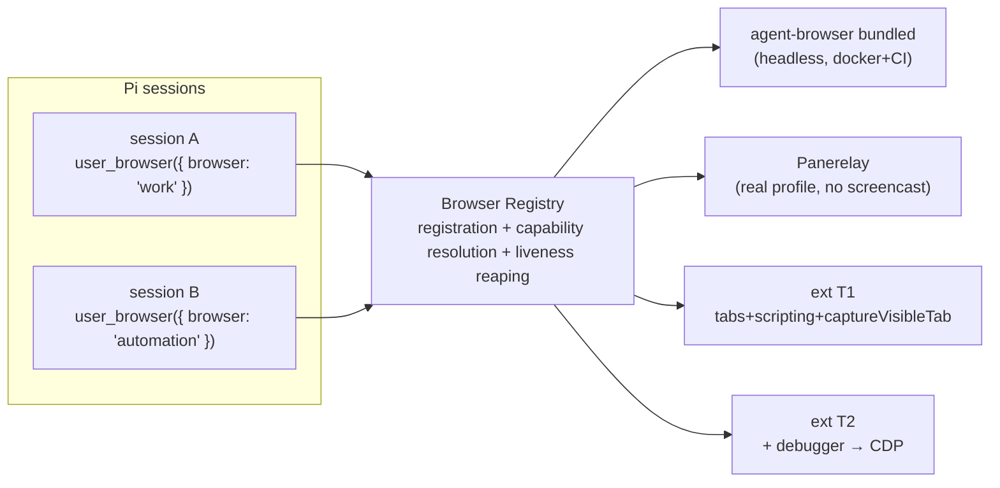
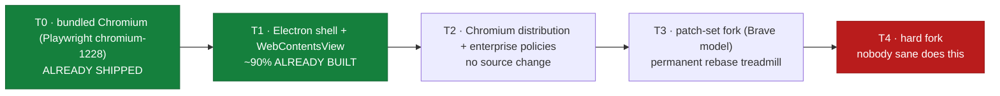

# Browser Provider Registry — Named Browsers, Extension Tiers, Multi-Profile

Research artifact. Explore-mode output. No OpenSpec change, no implementation. Pickup-ready.
Sources fetched 2026-08-21: [chrome.permissions](https://developer.chrome.com/docs/extensions/reference/api/permissions), [permissions-list](https://developer.chrome.com/docs/extensions/reference/permissions-list), [chrome.debugger](https://developer.chrome.com/docs/extensions/reference/api/debugger), [chrome.sidePanel](https://developer.chrome.com/docs/extensions/reference/api/sidePanel), [cross-origin network requests](https://developer.chrome.com/docs/extensions/develop/concepts/network-requests), [Claude for Chrome](https://support.anthropic.com/en/articles/12012173-getting-started-with-claude-for-chrome), [ChatGPT Atlas intro](https://openai.com/index/introducing-chatgpt-atlas/), [ChatGPT Atlas — Wikipedia](https://en.wikipedia.org/wiki/ChatGPT_Atlas), [Electron timelines](https://www.electronjs.org/docs/latest/tutorial/electron-timelines), [Chromium build instructions](https://github.com/chromium/chromium/blob/main/docs/linux/build_instructions.md), [brave-core](https://github.com/brave/brave-core), [Perplexity Comet intro](https://www.perplexity.ai/hub/blog/introducing-comet), live [registry.npmjs.org/electron](https://registry.npmjs.org/electron) query. Live-probed on macOS host.

## Framing

Question asked: ship pi-dashboard as a Chrome extension, for easier browser-API access + notification integration.

Verdict evolved across the session. Final verdict: **build the named-browsers registry, not an extension.** Extension tiers become provider rows in the registry.

The extension itself is a means, not the end. The end is a declarative provider model — named browsers, capability advertisement, explicit pinning. The extension is one more provider in that model.

## Notifications premise — REFUTED

Opening premise: extension needed for notifications. Refuted — Web Push already covers it.

- `openspec/changes/add-server-push-notifications/` already designs Web Push + VAPID.
- `public/sw.js` already carries a push handler.
- Wires into existing `isUnreadTrigger` at `packages/server/src/session/event-status-extraction.ts:201`; call site `packages/server/src/event-wiring.ts:647`. One line.
- `chrome.notifications` strictly worse: Chrome-family only, desktop only, cannot reach phone, needs browser running.
- Web Push reaches Chrome/Edge/Firefox/Safari 16.4+ incl. iOS installed PWA.

One genuine extension seam survives: Web Push routes through a public push service (Mozilla autopush / FCM). Local/air-gapped dashboard has no delivery path. Extension holding a WebSocket to `ws://localhost:8000` fires notifications with zero external dependency.

- MV3 service worker idle-kill 30 s; WebSocket activity resets the timer (Chrome 116+) → persistent notifier now viable.

## Product decomposition

Five candidate products. One is the answer.

| # | Product | Ruling |
|---|---|---|
| A | Side-panel shell | Drop. Duplicates PWA. |
| B | Local notifier | Narrow. Web Push already covers. |
| C | User-chrome provider | ALREADY EXISTS as Panerelay. |
| D | Page-context source | Commodity (Sider/Monica/HARPA). Separate product. |
| E | Plain-http LAN escape | **OPEN, high value.** Extension-origin fetch bypasses mixed-content given `host_permissions`. |

## Panerelay — live facts, probed on host

- MIT. `github.com/F-loat/panerelay`. `@panerelay/setup` v0.11.0, npm `time.created` 2026-07-29 → young dependency.
- Extension id `panplnkjlkoceaonlmpdekjphgmbggmi`.
- Native host `org.panerelay.bridge` → `~/.panerelay/bin/panerelay-native-host.cjs`, host version 0.8.0.
- Registered as agent-browser plugin in `~/.agent-browser/config.json`, capability `browser.provider`. agent-browser 0.33.2.
- NOT CDP. No `endpoint()` → CANNOT satisfy the `CdpEndpointProvider` interface specified in `docs/research/user-browser-in-editor-view.md` §13.
- No `Page.startScreencast` → invisible to dashboard → no L1/L2 escalation, no remote view.
- Reports false success: `upload` prints `✓ Done` attaching nothing; synthetic `Meta+v` no-ops. Untrusted-event class failure.
- `--allowed-domains` rejects direct-page provider plugins → domain guard unavailable exactly where profile is real.
- Repo already documents it: `packages/extension/.pi/skills/browser/references/own-browser.md` + `scripts/check-panerelay.sh`.

## LIVE BREAKAGE observed on host

`bash scripts/check-panerelay.sh` output: `GLOBAL_DEFAULT=yes`, `AMBIGUOUS_BROWSER=yes`, 3 `BROWSER_ID` lines, `READY=no`, `DETAIL=✗ Plugin 'panerelay' returned success=false`.

- `own-browser.md` states expected state is `GLOBAL_DEFAULT=no` — "omit `--global-default` so Panerelay stays opt-in per command and never hijacks their other sessions".
- `~/.agent-browser/config.json` has top-level `"provider": "panerelay"` → EVERY unflagged agent-browser call routes to real Chrome: `mcp__pi__browser` tool, `mockup-loop` screenshots, `isolated-ui-verification`.
- `ps` shows `chrome main procs = 0` → Chrome NOT running, yet 3 registrations persist → STALE ghost registrations, no liveness reaping. Matches documented `CDP error (Target.createTarget): No current window`.

This is the silent-fallback failure mode in the wild (§13 hard rule, quoted in VERDICT).

## Multi-profile finding

- `agent-browser profiles` lists 18 Chrome profiles.
- Exactly 3 carry the extension: `AgentAutomation` ("Your Chrome"), `Profile 21` (robert.csakany@blackbelt.hu), `Profile 23` (robson@semmi.se).
- 3 profiles ↔ 3 `BROWSER_ID`s, 1:1. `AMBIGUOUS_BROWSER=yes` is NOT malfunction — multi-profile working as designed with no naming layer.
- Gap is IDENTITY, not capability. `own-browser.md`: "There is no way to tell them apart by ID alone — try each; the right one lists your real tabs."
- Panerelay has no per-command profile switch: profile selected by where extension installed.
- Own extension closes gap: controls registration payload, registers `{profileLabel, capabilities}` not opaque UUID.
- `chrome.identity.getProfileUserInfo()` needs `identity` permission, returns blank when profile not signed into Chrome → fallback to user-set label in options.
- Multi-profile BREAKS the §15 parallelism ceiling: different profiles = different browser processes = different registrations → per-pi-session pinning, no active-tab clobbering. Bounded by provisioned profiles and ~529 MB per live Chrome.
- SECURITY: repo doc recommends confining extension to dedicated automation profile. Host has it in work identity + personal identity too → `debugger` + `nativeMessaging` + `scripting` reach blackbelt.hu and semmi.se sessions.

## Chrome API facts — VERIFIED

- **`debugger` CANNOT be declared in `optional_permissions`.** From chrome.permissions doc exceptions table. Kills runtime T1→T2 escalation via `permissions.request()`.
- `permissions.request()` requires user gesture. `permissions.remove()` exists. `optional_host_permissions` IS allowed.
- `chrome.debugger` IS CDP → `Page.startScreencast` available → remote view + takeover of the REAL profile. Panerelay structurally cannot do this. This is the reason to build own extension rather than depend on Panerelay.
- Extension-origin `fetch()` not bound by page mixed-content rules given `host_permissions` → solves E. `docs/research/neutral-shell-deploy-and-pairing-durability.md:67` states "Plain-http LAN is OUT" for the HTTPS shell.
- MV3 bans remote code → side panel must BUNDLE the client (version skew, Web Store review cadence) OR iframe `http://localhost` (no skew, but loses the LAN escape). Cannot have both.
- `sidePanel.open()` requires user gesture.

## No-native-host insight

Panerelay needs a native host because `agent-browser` is a short-lived CLI with no listener. pi-dashboard IS a long-lived local server → extension connects by plain WebSocket to `ws://localhost:8000`.

Drops: `nativeMessaging` permission, native host binary, per-OS installers (macOS plist / Linux `~/.config/google-chrome/NativeMessagingHosts/` / Windows `HKCU` registry), and per-vendor manifest dirs for Edge/Brave.

## Repo shape fit

Server already runs 2 WS gateways:

- `packages/server/src/pairing/browser-gateway.ts` — `WebSocketServer({noServer:true})` (line 268) + `handleUpgrade`, serves web clients.
- `packages/server/src/pi/pi-gateway.ts` — own port, pi bridge extensions register.

Third gateway = proven repeated pattern.

- Capability advertisement seam exists: `packages/server/src/routes/system-routes.ts:813` `capabilities: { systemOpen: systemOpenCapability() }` → add `browserBridge`.
- `packages/dashboard-plugin-runtime`: manifest = `pi-dashboard-plugin` field in package.json, declarative `requires`, slot registry, `/server` `ServerPluginContext`.
- `packages/client/src/chat-embed/` — curated embed surface, full fidelity, same WS protocol, workspace-only (raw `src/`, monorepo sibling), documented mount contract, `docs/embedding-chat-view.md`.
- `useMobile` = `<768w OR <600h` → ~400 px side panel gets mobile layout automatically.
- `packages/server/src/auth/cors-origin.ts` `isCorsOriginAllowed` (line 51) → `chrome-extension://<id>` origin must be added.
- Browser skill consumes via CLI: `allowed-tools: Bash(agent-browser:*), Bash(npx @panerelay/setup:*)`. Bridge reachable via thin `agent-browser.plugin.v1` stdio→REST shim registered by `plugin add <npm|github ref>`; skill then uses `--provider pi-dashboard`, no fork of Panerelay.

## Server-side browser is load-bearing — extension can never replace

- 114 Playwright specs in `tests/e2e/`, target docker harness. `playwright.config.ts`: CI leaves `PW_CHANNEL` unset so hermetic bundled Chromium is used.
- docker all-in-one has no user browser.
- §15: one browser CANNOT be shared across pi sessions — agent-browser CLI implicit active-tab cursor, TOCTOU.

The extension targets the user's real profile. The docker/CI harness needs a headless, shared, disposable browser. Two disjoint needs. Registry serves both as provider rows.

## VERDICT — named-browsers registry is the missing foundation

Proof it does not exist: `grep -rniE '"browsers"|defaultBrowser|namedBrowser|browserProvider' packages/shared/src/ packages/server/src/` → EMPTY (verified live). Research only, never built.

Specified in `docs/research/user-browser-in-editor-view.md` §13.



### Capability matrix — providers × capabilities

| Capability | agent-browser bundled | Panerelay | ext T1 (`tabs`+`scripting`+`captureVisibleTab`) | ext T2 (+`debugger`) |
|---|---|---|---|---|
| dom read/script | ✅ | ❌ | ✅ (per-tab, injected) | ✅ full CDP |
| trusted input | ✅ | ⚠️ reports success, does nothing | ✅ | ✅ |
| screencast | ✅ | ❌ | ⚠️ `captureVisibleTab` polling only, quota-limited | ✅ `Page.startScreencast` |
| network intercept | ❌ | ❌ | ❌ | ✅ `Network`/`Fetch` domains (spike 4) |
| real profile/SSO/passkeys | ❌ | ✅ | ✅ | ✅ |
| headless/always-on | ✅ | ❌ (needs Chrome running) | ❌ | ❌ |
| parallel/isolated | ✅ | ⚠️ one Chrome, ambiguous | ✅ per profile | ✅ per profile |
| works in docker+CI | ✅ | ❌ | ❌ | ❌ |

Key readings:

- No provider dominates.
- Gaps are complementary.
- Panerelay trusted-input cell = "reports success, does nothing".
- ext T1 screencast = `captureVisibleTab` polling only, quota-limited.

HARD RULE from §13, verbatim: "detect capabilities to pick a default; pin the choice explicitly; NEVER silently fall back. Silent fallback = 'why am I logged out of everything?'" — the observed `GLOBAL_DEFAULT=yes` breakage IS this failure mode.

Registry makes capability dishonesty declarable: consumer requests `input.trusted`, Panerelay does not advertise it, call fails loudly instead of silently.

### Sequencing

1. Build registry FIRST, validate against the 2 providers that already exist (bundled agent-browser + Panerelay), zero new extension code.
2. Then ext T1 and ext T2 are independent increments, shippable in either order.
3. Never need to decide T1-vs-T2 up front.

Registry v1 scope = registration + capability resolution + liveness reaping. Eviction (§15 LRU, idle TTL, ~529 MB/browser, orphan reaping) = separate later change.

### Worked example config (from the probed host)

```jsonc
"browsers": {
  "work":       { "provider": "pi-ext",  "profile": "Profile 21" },
  "personal":   { "provider": "pi-ext",  "profile": "Profile 23" },
  "automation": { "provider": "pi-ext",  "profile": "AgentAutomation" },
  "ci":         { "provider": "agent-browser-bundled" }
},
"defaultBrowser": "ci"
```

Agent selects: `user_browser({ url, browser: "work" })`. AWS-named-profiles mental model.

## Fork the whole browser — EVALUATED, REJECTED

Fork = REJECTED. Fork buys distribution-as-browser, NOT capability. Capability already present 3 ways.

### Prior art — the flagship fork DIED

- ChatGPT Atlas. OpenAI. Chromium-based, Blink engine. macOS ONLY.
- Released `2025-10-21`. Shut down `2026-08-09`. Lifespan ~10 months.
- openai.com announcement page now carries banner verbatim: "This post introduced ChatGPT Atlas. Atlas has since been deprecated."
- Announced Windows + iOS + Android versions. NEVER shipped.
- Folded into single desktop app with ChatGPT app + OpenAI Codex.
- OpenAI = effectively unlimited budget. Could not sustain one-platform Chromium fork past 10 months.
- Criticism on record: Anil Dash called it "anti-web browser", "actively fights against the web", "substitutes its own AI-generated content for the web, but it looks like it's showing you the web"; Axios reported agent+memory features widen prompt-injection exposure.
- Perplexity Comet survives — but Perplexity product IS the browser. pi-dashboard browser = feature of dev dashboard, not the company.

### Repo already ships a Chromium — and does NOT maintain it

Empirical evidence of maintenance capacity. Fork demands strictly more of exactly this work.

- `packages/electron/package.json:32` pins `electron: 32.3.3` → Chromium 128, published `2025-03-03`.
- Latest stable `electron@43.4.1` → Chromium 150, published `2026-08-19`.
- Behind: 11 Electron majors / 22 Chromium majors / 533 days.
- Electron support policy = latest 3 stable majors (43, 42, 41). Electron 32 EOL. No security backports.
- Electron targets even Chromium versions, 8-week cadence. E26=Chromium 116, E27=118 → E32=128.
- FILED SEPARATELY as GitHub issue #529.

### Fork spectrum — 5 tiers



- T0 · use bundled Chromium (Playwright `chromium-1228`) — ALREADY SHIPPED
- T1 · Electron shell + `WebContentsView` — ~90% ALREADY BUILT
- T2 · Chromium distribution + enterprise policies — no source change
- T3 · patch-set fork (Brave model) — permanent rebase treadmill
- T4 · hard fork — nobody sane does this

### T3 is what "fork" actually means

- `brave-core` = build tooling + patch set, NOT a Chromium copy.
- Fetches Chromium via `depot_tools`, pins exact rev (e.g. `65.0.3325.181`), mounts brave-core at `src/brave`.
- "Maintains patches for 3rd party Chromium code."
- `pnpm run sync` = update chromium → apply patches → update gclient DEPS → run hooks. `--force` re-applies ALL patches.
- Machinery exists because rebase is permanent + staffed. Chromium ships every 4 weeks.

### Build cost — chromium/docs/linux/build_instructions.md

- x86-64, ≥ 8 GB RAM, "more than 16GB is highly recommended", 16–32 GB swap.
- ≥ 100 GB free disk. ~50–80 GB for build output.
- clang only officially supported. `libc++` only supported STL. Build infra on Ubuntu 22.04.
- Benchmark quoted in docs = HP Z600, i7 16-core HT, 12 GB RAM: 12m20s with tmpfs / 15m40s without. Full debug build needs ~20 GB tmpfs.

### REFRAME — own browser already exists in embryo

`packages/electron` = Chromium under project control. CDP already wired.

- `packages/electron/src/lib/resolve-cdp-activation.ts` — `--debug-cdp` / `--debug-cdp=<port>` / `PI_DEBUG_CDP=1|true|<port>`, default port `9222`, default OFF, CLI wins over env.
- `packages/electron/src/main.ts:31` — `app.commandLine.appendSwitch("remote-debugging-port", String(_cdp.port))`.
- `main.ts:26` comment — switch must be set during browser-process init; `main.ts:527-530` — cannot enable CDP retroactively, must fully quit + relaunch.
- `playwright.electron.config.ts` already drives the shell.
- Shipped as `See change: ship-browser-skill-and-electron-cdp` (archived `2026-05-28`).
- Window: `BrowserWindow` at `main.ts:401`, `loadURL(serverUrl)` at `:432`, `webPreferences` `nodeIntegration:false` + `contextIsolation:true` at `:407-409`.

Adding a `WebContentsView` agent-drivable tab yields, with NO fork:

| Capability | Mechanism |
|---|---|
| full CDP | already on `9222` |
| screencast / live view | local window, trivial |
| network intercept | `session.webRequest` |
| plain-http LAN | native app, no mixed-content rule |
| native notifications | built in |
| multi-profile identity | `session.fromPartition()` |

KEY: `session.fromPartition()` gives NAMED isolated cookie jars as first-class objects. Exactly the identity layer the multi-profile finding said was missing — Chrome gives opaque `BROWSER_ID`s across 18 profiles with no naming layer. Electron gives it away free.

### What fork does NOT buy

- User's EXISTING logged-in sessions. Fork = fresh browser. Atlas needed import flow. Imported cookies != imported passkeys.
- Only Panerelay / an extension reach the real authenticated Chrome.
- Fork is the ONLY option on the table that does NOT solve the thing people actually want.

### Ranked alternatives

1. Fix Electron pin. 32 → 41/42/43. Security debt on shipped app. Prerequisite for everything else. Issue #529.
2. `WebContentsView` in Electron shell — "own browser" outcome at ~1% of fork cost; lands multi-profile natively via `session.fromPartition()`.
3. Named-browsers registry stays the foundation. Electron tab = one more provider row.

### Upgrade surface SMALLER than feared — measured

Correcting an earlier overstatement. Electron API surface in `main.ts` is narrow, all stable APIs:
`app.quit`(8), `BrowserWindow`(7), `dialog.showMessageBox`(5), `app.commandLine`(5), `app.on`(4), `ipcMain.removeHandler`(3), `ipcMain.handle`(3), `shell.openExternal`(2), `app.whenReady`(2), `app.requestSingleInstanceLock`(2), `app.isPackaged`(2), `app.name`, `app.disableHardwareAcceleration`.

- No `remote` module. `contextIsolation:true` + `nodeIntegration:false` already.
- No native RUNTIME deps → no ABI rebuild. `electron-updater` pure JS. `sharp ^0.33.5` devDependency, icon generation only.
- Risk concentrates in toolchain/packaging: `@electron-forge/* ^7.6.0`, `electron-builder ^26.8.1`, `forge.config.ts`, `electron-builder.yml`, `electron-builder-nsis.json`, `entitlements.plist`.
- Regression gate exists: `playwright.electron.config.ts`.
- Sequencing note: open changes `openspec/changes/electron-platform-extraction` + `openspec/changes/harden-electron-renderer-boundary` touch this package.

## T1 / T2 coexistence

Two extensions (clean consent split; T1 users never see debugger warning; escalation = install second extension) vs one extension (`debugger` always declared, coarse install consent, fine-grained runtime self-gating).

Recommend TWO. Gateway merges both registrations into one capability set.

## Competitive landscape

| Entry | Approach | Reading |
|---|---|---|
| Claude for Chrome | Extension, shipped limited research preview, gated on prompt-injection risk; native host `com.anthropic.claude_browser_extension.json` also present on probed host | Validation of T2 model + real-profile stakes |
| ChatGPT Atlas, Perplexity Comet | Forked whole browsers | Concluded extension sandbox too small |
| Gemini-in-Chrome | Built into browser | Unavailable to us |
| Sider / Monica / HARPA | Commodity sidebar + page context | D ruled out |
| Browser MCP / browser-use / Playwright MCP extension mode | Direct analogue for the provider pattern | Prior art to copy |

## Security

§6 hard rule from `docs/research/user-browser-in-editor-view.md`, verbatim: "the RBI relay MUST NOT enable the `Runtime` domain." Deny-by-default verb allowlist, never raw CDP passthrough.

Stakes higher on a real profile:

- `Network.getAllCookies` exfiltrates every SSO session.
- §6 already tabulates `Runtime.evaluate` = arbitrary JS, `Page.navigate` file:// = read any file, `Browser.setDownloadBehavior` = arbitrary file write.

Routing browser control through the dashboard server means the real logged-in browser becomes drivable from anywhere the dashboard is reachable, INCLUDING the zrok tunnel. Blast-radius escalation over Panerelay's local-only CLI reach.

Required:

- Per-origin authorization surfaced IN the dashboard (not only the extension side panel).
- Explicit kill switch.
- Audit trail.
- Option to gate the bridge loopback-only via existing `packages/server/src/auth/localhost-guard.ts` (`isLoopback()` + `hasProxyForwardingHeaders()`, line 44).
- `--allowed-domains` unavailable for provider plugins → domain guard must live in our relay.

## OPEN SPIKES (recorded open, do not resolve)

1. Does `chrome.debugger.attach()` honour host permissions, or bypass them? Sets the T2 security ceiling — if honoured, ship `debugger` + zero default host grants + `optional_host_permissions` per-task → blast radius starts empty. **UNVERIFIED.**
2. Private Network Access preflight rules for extension → plain-http LAN. Decides whether E actually works.
3. `ws://` from extension origin to plain-http LAN dashboard — allowed?
4. Network/Fetch domain interception via `chrome.debugger` — available, or restricted vs raw CDP?
5. Chrome version that began refusing `--remote-debugging-port` on a real profile (M136+ per repo doc) — confirm exact version.
6. `WebContentsView` ergonomics as an agent-drivable surface. NO repo precedent — repo-wide grep finds ZERO `WebContentsView` usage in source (only binary match inside built Electron framework); `BrowserWindow` confined to `main.ts` + window-owning libs (`doctor-window.ts`, `remote-connect-window.ts`, `app-menu.ts`, `window-state.ts`, `tray.ts`).
7. True size of Electron 32→43 upgrade. Toolchain/packaging unmeasured.
8. CEF vs Electron for a more browser-shaped shell. Unevaluated.
