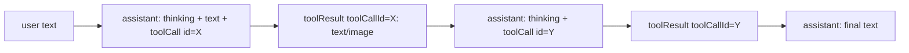
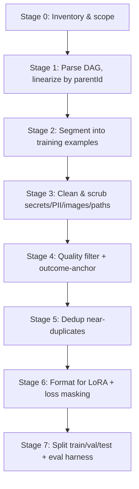
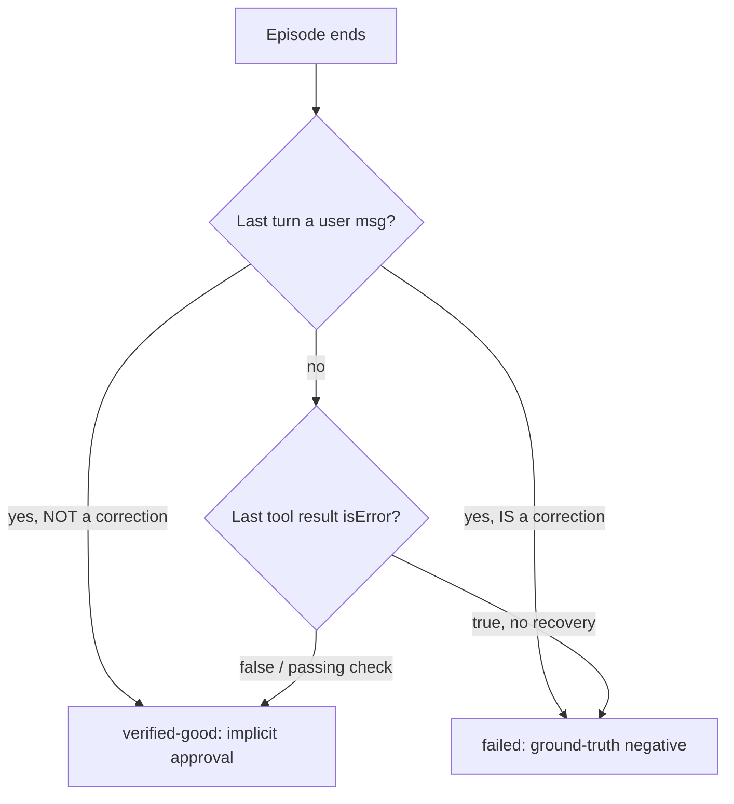
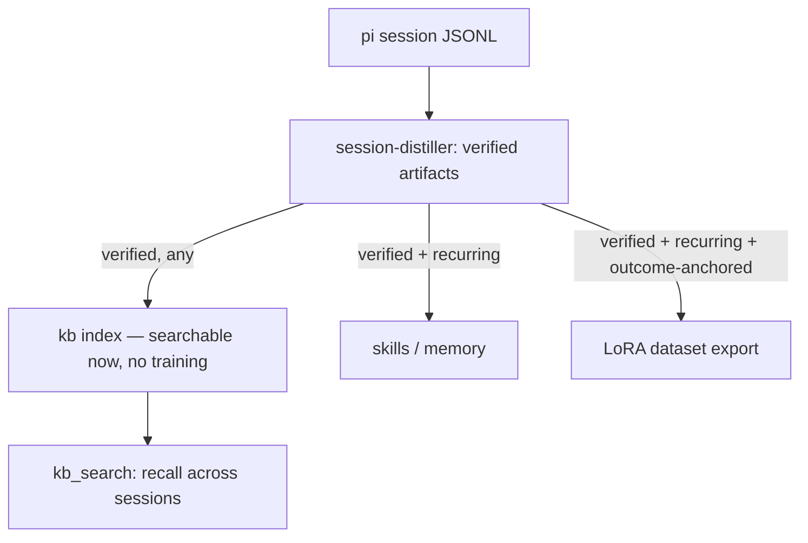
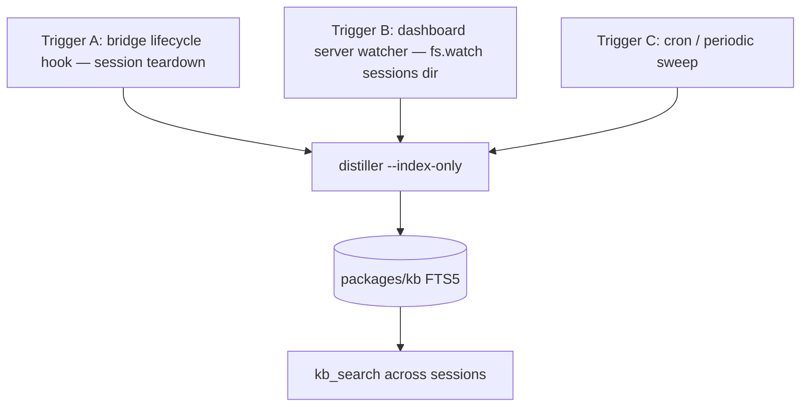
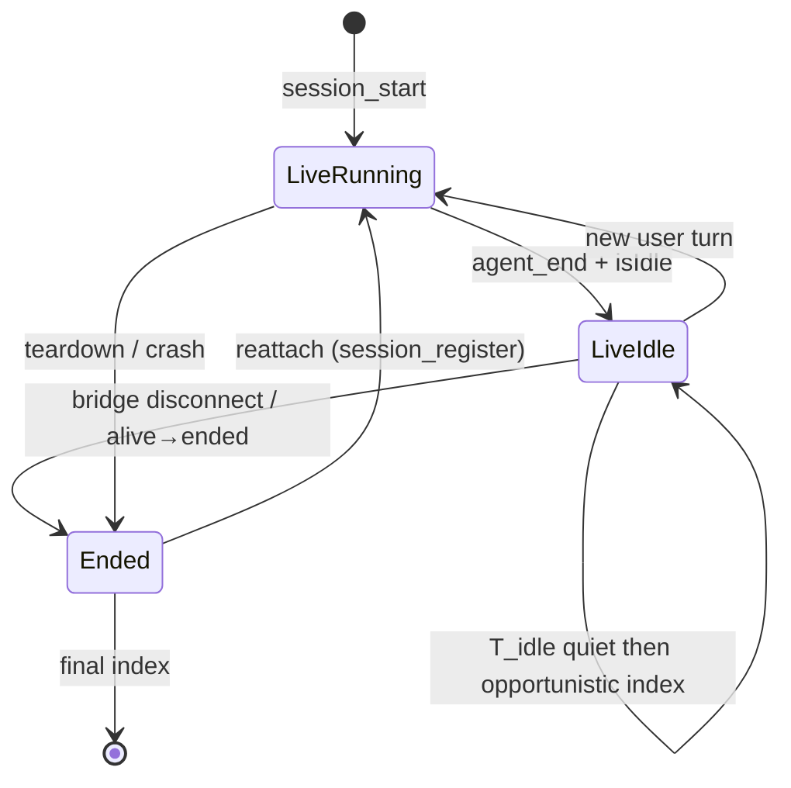
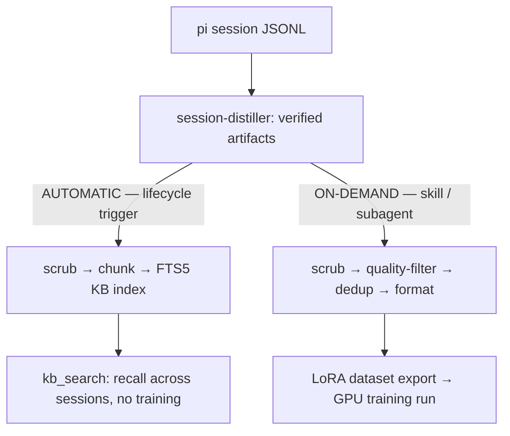

# Building a High-Quality LoRA Training Dataset from pi Session Logs

> **Scope.** How to turn this repo's `pi` session JSONL logs into a high-quality
> supervised fine-tuning (SFT) dataset for **LoRA** adaptation of a **~1T-parameter**
> base model, targeting **general instruction-following / agentic chat**.
> Comprehensive reference: principles, a concrete pipeline against the real log
> schema, LoRA-specific formatting decisions, tradeoff tables, and pitfalls.

---

## TL;DR

1. **At 1T params + LoRA, data quality is the entire game.** LoRA touches a
   tiny fraction of weights; it cannot absorb a noisy corpus and it *will* faithfully
   memorize your junk. Aim for **thousands of excellent examples, not millions of
   mediocre ones** (the LIMA result). Curation effort > collection effort.
2. **pi logs are agentic trajectories, not Q&A.** Each session is a DAG of
   `user → assistant(thinking + toolCall) → toolResult → assistant …`. You are
   teaching *tool use + reasoning + recovery*, not just answers. Format for that.
3. **Anchor every example on an objective outcome.** Only keep trajectories that
   demonstrably succeeded (tests passed, task shipped, user confirmed). Success is
   your cheap, high-signal quality label — you already have it in the logs.
4. **Mask the loss to completion tokens only.** Train on assistant text +
   toolCalls. Never compute loss over user turns, tool outputs, system prompts, or
   injected skill text.
5. **Scrub hard.** Secrets, PII, absolute local paths, and multi-MB base64 images
   must go before a single token is tokenized.

---

## Part 1 — The Two Hard Constraints

Everything downstream is shaped by two facts. Do not skip this framing.

### 1.1 Constraint A — "1T params + LoRA" changes what "good data" means

A full fine-tune of a 1T model updates ~10¹² parameters and can, brute-force,
average out a noisy dataset. **LoRA cannot.** LoRA freezes the base weights and
learns low-rank update matrices (`ΔW = B·A`, rank `r` typically 8–64) on a small
set of projections. That has three consequences for data:

| Property | Full fine-tune | **LoRA (this project)** |
|---|---|---|
| Trainable params | ~all (10¹²) | ~0.01–1% (10⁷–10⁹) |
| Noise tolerance | Higher (averages out) | **Low — noise is memorized** |
| Data budget for good results | 10⁵–10⁷+ | **10³–10⁵ curated** |
| Failure mode | Undertraining | **Overfit + catastrophic forgetting** |
| What dominates outcome | Scale + compute | **Example quality + diversity** |

Implications:

- **Quality dominates quantity.** LIMA (Zhou et al., 2023) fine-tuned on **1,000**
  meticulously curated examples and matched far larger instruction sets — evidence
  for the *Superficial Alignment Hypothesis*: the base model already "knows" the
  content; SFT mostly teaches *format, style, and behavior*. LoRA leans into this.
- **A bad example is worse than a missing one.** With a small trainable capacity,
  a mislabeled or failed trajectory doesn't get diluted — it competes directly with
  good ones for the same low-rank subspace.
- **Guard against forgetting.** Small, over-narrow, or over-repeated data pulls the
  adapter into a local style and degrades general capability. Diversity + a modest
  epoch count (1–3) + held-out eval are the defense.

### 1.2 Constraint B — the raw material is an agentic trajectory DAG

The logs are **not** clean prompt→response pairs. Verified schema (`version: 3`):

```
Session file:  ~/.pi/agent/sessions/<cwd-slug>/<ISO-ts>_<sessionId>.jsonl
Each line:     one JSON record, newline-delimited (JSONL)
```

Record types and the fields that matter:

| `type` | Key fields | Meaning |
|---|---|---|
| `session` | `version`, `cwd`, `id`, `timestamp` | Session header (once, first line) |
| `model_change` | `provider`, `modelId` | Which model produced following turns |
| `thinking_level_change` | `thinkingLevel` | Reasoning budget for following turns |
| `message` | `message: {role, content[]}` | The actual conversation turn |

Every record carries `id` + `parentId` + `timestamp`, so records form a **linked
chain (occasionally a branching DAG** on edits/regenerations). Reconstruct order by
walking `parentId`, not by file position alone.

`message.role ∈ { user, assistant, toolResult }`. `content[]` block types:

| Block `type` | Fields | Notes |
|---|---|---|
| `text` | `text` | User prompt or assistant prose |
| `thinking` | `thinking`, `thinkingSignature` | Model's private reasoning |
| `toolCall` | `id`, `name`, `arguments` | Assistant invoking a tool |
| `image` | `data` (base64) | Inline — **large**; often megabytes |

A `toolResult` message is `{ role: "toolResult", toolCallId, toolName, content[] }`
and links to its call via `toolCallId`. So a single "assistant turn" is really:



**Corpus scale (measured, this machine):**

| Slice | Sessions | On-disk |
|---|---|---|
| `pi-agent-dashboard` project | 781 | 473 MB |
| All projects | 1,840 | 842 MB |

Most of that byte weight is embedded base64 images and verbose tool output — **the
usable training signal is a small fraction of the raw size.** Budget for aggressive
reduction, not for "use it all."

---

## Part 2 — Dataset-Quality Principles (research-backed)

These are the levers that actually move LoRA outcomes. Optimize them in order.

### 2.1 Quality — the dominant lever

- **Outcome-anchoring.** Prefer trajectories with a verifiable success signal:
  tests went green, `openspec` change archived, CI passed, the user said "yes/ship
  it", a diff landed. pi logs contain these signals natively (tool results, later
  user confirmation). Use them as a *free, high-precision quality label*.
- **No failed or abandoned trajectories** unless you are deliberately building
  *recovery* examples (see 2.4). A trajectory that ended in an unresolved error
  teaches the model to produce unresolved errors.
- **No degenerate turns.** Drop turns that are pure boilerplate, truncated, or
  where the assistant hallucinated a file it never read.

### 2.2 Diversity — the anti-overfit lever

LoRA overfits fast. Maximize coverage across:

- **Task types** — debugging, feature impl, refactor, docs, Q&A, planning.
- **Tools** — reading, editing, bash, search, browser, memory. Don't let `read`+`edit`
  dominate 90% of examples just because they're most frequent.
- **Projects / domains** — pull from multiple `cwd` slugs, not one repo, or the
  adapter learns *this* codebase instead of *general* competence.
- **Length** — short single-tool answers *and* long multi-step trajectories.

Deduplicate hard (Part 3, Stage 5): near-duplicate prompts collapse diversity and
silently reweight the mixture.

### 2.3 Difficulty — the capability lever

Trivial examples ("list the files") add little and can even *lower* the model's
willingness to reason. Bias selection toward examples that required:

- multiple tool calls with intermediate reasoning,
- an error → diagnosis → fix loop,
- a non-obvious decision the user later approved.

DEITA (Liu et al., 2023) formalizes selecting for *complexity × quality × diversity*
over raw volume — a good mental model for scoring pi trajectories.

### 2.4 Recovery — the agentic-specific lever

Unique to trajectory data: examples where the assistant hit a tool error, **read the
error, corrected course, and succeeded** are gold for agentic behavior. Keep these
deliberately — but only the ones that *end in success*. Mask nothing special; the
recovery is part of the target sequence.

---

## Part 3 — The pi-logs → Dataset Pipeline

Concrete stages. Each stage is a filter or transform; the corpus shrinks and
improves at every step.



### Stage 0 — Inventory & scope

- Enumerate `~/.pi/agent/sessions/**/*.jsonl`. Record `sessionId`, `cwd`, model,
  line count, byte size, image count.
- Decide inclusion: which projects, which date range, which models (you may *not*
  want to imitate weaker models' turns).
- Establish a **watermark** so re-runs are incremental (the repo's
  `packages/session-distiller/` already implements watermarking — reuse the pattern).

### Stage 1 — Parse the DAG and linearize

- Read line-by-line; `JSON.parse` each. Skip non-`message` records but capture the
  latest `model_change` / `thinking_level_change` as context.
- Rebuild turn order by following `parentId` from the `session` root. Handle
  branches (edits/regenerations): keep the **surviving leaf path** (the branch that
  actually continued), discard dead branches.
- Reassemble each logical assistant turn: `thinking* + text* + toolCall*`, then its
  matching `toolResult` by `toolCallId`.

### Stage 2 — Segment into training examples

Choose a granularity (see the tradeoff table in Part 4.4):

- **Whole-session example** — one long multi-turn trajectory. Best for teaching
  end-to-end agentic behavior; risks exceeding context length.
- **Sliding conversational window** — each assistant turn (with its prior context)
  becomes one example. More examples, more control, some redundancy.

Attach the outcome label computed in Stage 4 to each candidate.

### Stage 3 — Clean & scrub (non-negotiable)

| Target | Action |
|---|---|
| **Inline images** (`image.data` base64) | Drop or replace with a `[image: <alt/omitted>]` token. Never tokenize megabytes of base64. |
| **Secrets / tokens** | Regex + entropy scan tool outputs and text for API keys, `auth.json` contents, `Bearer` tokens, `.env` values. Redact → `[REDACTED]`. |
| **PII** | Emails, real names outside public identifiers, machine hostnames. |
| **Absolute local paths** | Normalize `/Users/robson/Project/<x>/…` → `<repo>/…` so the adapter doesn't memorize one machine's layout. |
| **Huge tool output** | Truncate long `bash`/`read` results to a head+tail window; the model should learn to summarize, not to reproduce 50KB of logs. |
| **thinkingSignature** | Strip — it's a provider verification blob, not training signal. |

> Scrubbing failures are the single most likely way this dataset leaks credentials
> into a shared model. Gate the whole pipeline on a passing secret-scan.

### Stage 4 — Quality filter + outcome-anchor

Compute a per-trajectory score, keep only the top slice. Signal sources already in
the logs:

- **Success markers** — later `toolResult` showing tests passed / build green;
  subsequent user text like "perfect", "ship it", "thanks"; an `openspec` archive.
- **Failure markers** — trajectory ends on an unresolved error, user says "that's
  wrong / undo / stop", repeated failed tool calls with no recovery.
- **Effort/complexity** — number of successful tool calls, presence of a recovery
  loop, reasoning depth.

Combine into a score; drop everything below a threshold. When in doubt, **cut** —
recall matters less than precision here.

### Stage 5 — Deduplicate

Near-duplicates silently reweight your mixture and inflate overfit. Layer two passes:

| Method | Catches | Cost |
|---|---|---|
| **Exact hash** (normalized text) | Copy-paste repeats, re-runs | Trivial |
| **MinHash / LSH** (n-gram Jaccard) | Near-identical prompts/outputs | Low |
| **Embedding + cosine threshold** | Semantic paraphrases | Higher (embed cost) |

Deduplicating training data measurably improves LMs (Lee et al., 2022). For an
agentic corpus with many "read → edit → test" repeats, dedup is *especially*
impactful — those patterns recur across hundreds of sessions.

### Stage 6 — Format for LoRA + loss masking

Emit each example in the base model's **chat template** (exact special tokens
matter — mismatched templates are a top cause of bad fine-tunes). Two-column shape:

```jsonc
{
  "messages": [
    {"role": "system", "content": "<the pi system prompt, or a normalized stand-in>"},
    {"role": "user", "content": "Fix the failing auth test"},
    {"role": "assistant", "content": "<thinking?>…</thinking?> I'll read the test.",
     "tool_calls": [{"id":"X","name":"read","arguments":{"path":"auth.test.ts"}}]},
    {"role": "tool", "tool_call_id": "X", "content": "<truncated file>"},
    {"role": "assistant", "content": "The mock is stale. Patching…",
     "tool_calls": [{"id":"Y","name":"edit","arguments":{ /* … */ }}]},
    {"role": "tool", "tool_call_id": "Y", "content": "ok"},
    {"role": "assistant", "content": "Tests pass now."}
  ],
  "loss_mask": "assistant_only"
}
```

**Loss masking rule:** compute loss **only** on assistant-authored tokens (text +
tool_calls). Mask system, user, and tool tokens to `-100` / ignore-index. Training on
tool output teaches the model to hallucinate tool output; training on user turns
teaches it to write the user's side.

### Stage 7 — Split & build the eval harness

- **Split by session, never by turn** — turns from the same session in both train
  and test leak context and inflate your metrics. Hold out whole sessions.
- Reserve a **diverse test set** spanning task types and projects.
- Keep a small **golden hand-checked set** for qualitative regression reads.
- Track: held-out loss, tool-call validity (does it emit parseable tool calls?),
  task-success on a replayable subset, and a general-capability probe to detect
  **catastrophic forgetting** (the adapter shouldn't get dumber at plain chat).

---

## Part 4 — LoRA-Specific Formatting Decisions (tradeoff tables)

### 4.1 Should you keep the `thinking` blocks?

| Option | Pros | Cons | Use when |
|---|---|---|---|
| **Keep thinking in target** | Teaches explicit reasoning; strong for agentic tasks | Longer sequences; must match the base model's reasoning-token convention | Base model supports/expects a reasoning channel |
| **Strip thinking, keep text+tools** | Shorter, cleaner, cheaper | Loses the "why"; weaker multi-step planning | Base model has no reasoning channel, or you want terse behavior |
| **Distill thinking → concise rationale** | Best of both, controlled length | Extra processing step | You have budget to rewrite reasoning |

Default here: **keep** (agentic target benefits), but cap thinking length and ensure
the base model's template has a slot for it.

### 4.2 How to represent tool calls

| Option | Pros | Cons |
|---|---|---|
| **Native tool-call fields** (structured) | Aligns with modern chat templates; parseable at inference | Requires base model that supports tool schemas |
| **Inline JSON in text** | Model-agnostic | Model must learn framing; brittle parsing |
| **Natural-language actions** | Simple | Loses structured tool-use ability |

Prefer **native structured** tool calls when the 1T base supports them.

### 4.3 thinking / reasoning token budget

Long trajectories blow past context length. Options: truncate oldest turns, or
summarize tool outputs (Stage 3), or split the session (Stage 2). Never silently
truncate the *assistant target* mid-turn — drop the example instead.

### 4.4 Example granularity

| Granularity | Examples produced | Teaches | Risk |
|---|---|---|---|
| **Whole session** | Few, long | End-to-end agentic flow | Context overflow, fewer gradients |
| **Per-assistant-turn window** | Many, medium | Local decision quality | Redundancy across windows |
| **Single-tool micro-examples** | Very many, short | Tool syntax | Loses multi-step planning |

Balanced default: **per-assistant-turn window with full prior context**, capped at
the model's context length, deduped in Stage 5.

### 4.5 LoRA hyperparameter starting points (data-shaped)

Not the focus of this doc, but they interact with data volume:

| Knob | Small curated set (~1–5k) | Larger set (~20–100k) |
|---|---|---|
| Rank `r` | 8–16 | 16–64 |
| `alpha` | `2×r` common | `2×r` |
| Epochs | 2–3 | 1–2 |
| LR | ~1e-4 – 2e-4 | ~5e-5 – 1e-4 |
| Target modules | attention proj (`q,k,v,o`) | + MLP proj for more capacity |

Smaller data → lower rank + more epochs; larger data → higher rank + fewer epochs.
Always validate against the held-out set; stop when val loss turns up.

### 4.6 Success-Detector Design (the crux of Stage 4)

Everything in Stage 4 hinges on one function: *did this trajectory succeed?* The
label quality caps the dataset quality. Measured findings from this machine's logs
(120 recent `pi-agent-dashboard` sessions) rank the candidate signals:

| Candidate signal | Coverage | Precision | Verdict |
|---|---|---|---|
| Explicit user approval ("perfect / ship it / lgtm") | **~10%** of sessions (6 hits/120) | High | Too **sparse** to be the primary label |
| Explicit user rejection ("wrong / undo / no") | 10 hits/120 | High | Good *negative*, still sparse |
| Text-regex on tool output ("pass / fail / error") | Abundant (196/129) | **Low** — matches `Error:` inside successful output | Noisy; do **not** anchor on it |
| **Structured `isError` boolean** (native `toolResult` field) | **Every** tool result (247 clean : 7 error in one real session) | **High** | ✅ The workhorse |

**Principle — anchor on the TERMINAL state, not any earlier pass.** A trajectory
that passes tests midway then breaks is **not** a success. "Ended green" ≠ "was ever
green." Judge the last state of the episode.



Three consequences:

1. **Mid-trajectory errors that recover are gold, not failures.** The pattern
   `isError: true` → *same tool* → `isError: false` is a *recovery* example (Part
   2.4) — the highest-value agentic data. Position disambiguates: error-then-fix =
   **keep**; error-at-terminal-with-no-recovery = **drop**.
2. **Implicit approval beats explicit approval on coverage.** "The next user turn is
   *not* a correction" is available in far more sessions than "ship it." Treat the
   *absence* of a correction after an assistant action as a weak positive.
3. **The correction lexicon is the ground-truth negative.** A user turn matching
   `no|nope|actually|don['’]?t|do not|instead|wrong|not quite|stop|rather` right
   after an assistant action reliably marks that action as wrong → drop the tail.

**Composite detector (pseudocode):**

```
verified_good(episode) =
      terminal_tool_result.isError == false          # structured, high-precision
  AND next_user_turn (if any) NOT isCorrection        # implicit approval / no rejection
  AND (bonus weight) PASS_RE hit  OR  isError-flip recovery present

label = DROP if terminal_tool_result.isError == true AND no same-tool recovery
     OR next_user_turn matches CORRECTION_RE
       KEEP otherwise (weight up recovery + passing-check episodes)
```

**Reuse, don't rebuild.** This repo already ships the detector: `packages/session-
distiller/src/signals.ts` (`episodeVerifiedGood`, `detectFaults`, the verification
gate; 46 tests green). `isError` is parsed natively in `trajectory.ts`
(`isError: m.isError === true`); `CORRECTION_RE` lives in `segment.ts`. The dataset
builder is best built as a **new sink on the existing `Trajectory`/`Episode`
machinery**, not a greenfield tool.

---

## Part 5 — Failure Modes & Pitfalls

- **Template mismatch.** Fine-tuning with a chat template different from the base
  model's = silent quality collapse. Verify special tokens byte-for-byte.
- **Loss over the wrong tokens.** Forgetting to mask user/tool tokens is the most
  common SFT bug. Assert the mask before training.
- **Leaked secrets.** One un-scrubbed `auth.json` dump in a tool result and the
  adapter can regurgitate credentials. Gate on a secret scan.
- **Machine-specific memorization.** Absolute paths, hostnames, one-repo bias →
  the adapter learns *your setup*, not *general skill*. Normalize + diversify.
- **Success-survivorship done wrong.** Anchoring on outcomes is right, but if your
  success detector is noisy you'll train on failures labeled as wins. Spot-check
  the label.
- **Overfitting a narrow style.** Too few epochs is safer than too many for LoRA;
  watch held-out loss and a general-chat probe for forgetting.
- **Image tokens.** Base64 images left in place will dominate token counts and
  teach nothing. Strip in Stage 3.
- **Branch contamination.** Not collapsing edit/regeneration branches → duplicate or
  contradictory targets for the same prompt.

---

## Part 6 — Recommended Default Recipe

1. **Scope**: all projects, last N months, exclude weak-model turns. Watermark it.
2. **Extract** with the `packages/session-distiller/` parsing pattern; linearize by
   `parentId`, collapse dead branches.
3. **Segment** per-assistant-turn with full prior context, cap at context length.
4. **Scrub** aggressively: images out, secrets/PII/paths redacted, tool output
   head+tail truncated, `thinkingSignature` stripped. Gate on secret scan.
5. **Quality filter**: keep only outcome-anchored successes + deliberate recovery
   examples; score on complexity; cut the bottom hard.
6. **Dedup**: exact hash → MinHash/LSH → optional embedding pass.
7. **Format**: base model's chat template, native tool calls, **assistant-only loss
   mask**, keep capped thinking.
8. **Split by session**; build held-out + golden eval + a forgetting probe.
9. **Train LoRA**: `r=16, alpha=32, 2–3 epochs, LR≈1e-4`, attention modules first.
10. **Evaluate**: held-out loss, tool-call validity, replay task-success, general
    capability. Iterate on *data*, not just hyperparameters — data is the lever.

> The whole point of the "1T + LoRA" constraint: you cannot out-scale a bad dataset.
> Spend the effort in Stages 3–5. A few thousand clean, diverse, outcome-anchored,
> correctly-masked trajectories will beat a million raw log turns.

---

## Part 7 — RAG Alternative: Distill-to-Index vs. Distill-to-Train

Training is not the only way to make session knowledge reusable. **Indexing the
distilled artifacts into a searchable knowledge base (RAG) is the cheaper default**
for *recall*; fine-tuning is only worth it for changing default *behavior*.

| Dimension | Distill → **index (RAG)** | Distill → **train (LoRA)** |
|---|---|---|
| Cost | Cheap, CPU-only, incremental | GPU, slow, per-run |
| Update latency | Seconds (re-index) | Full retrain |
| Forgetting risk | None | Real at 1T + LoRA |
| Attribution | Exact — cites the source session | None — baked into weights |
| Wrong/stale entry | Delete one row | Retrain to remove |
| Best for | *Recall* facts / procedures / fixes | *Behavior* / style / tool fluency |

**Reuse, don't rebuild.** This repo already ships most of the machinery:
`packages/session-distiller` (5 verified signal classes), `packages/kb` (FTS5 + BM25
+ chunker + indexer), context-mode `ctx_index`/`ctx_search`, and `session_search`
(raw past sessions). Critically, the distiller **already** indexes into a searchable
KB — but only *one* of its five signal classes (`documentation → docs/ + ctx_index`).
The other four (fault, correction, decision, procedure) go to memory/skills and never
land in the unified `kb` FTS5 index next to repo docs.

**The gap (the valuable delta) = three small, additive moves:**

1. **Add a `kb` sink to the route map.** Today `sinkFor()` maps only
   `documentation → docs`. Add: *every verified artifact* also emits a chunked,
   structured entry into `packages/kb` with metadata the raw layers lose —
   `signal` type, source `sessionId`, `confidence`, recency, `verified` flag — so
   `kb_search` retrieves distilled session knowledge alongside repo docs.
2. **Decouple the recurrence gate per sink.** The distiller promotes only clusters
   seen `N≥3` (right for skills — no one-off skills). For *search*, a **single**
   verified fault-recovery is worth retrieving. Gate: `index if verified` (low bar)
   vs. `promote to skill/dataset if verified AND recurring` (high bar).
3. **One distiller, two downstreams.** The same verified artifacts feed *both* the
   LoRA dataset export (Part 3) **and** the KB index. The distiller is the shared
   upstream; RAG and fine-tune stop being either/or.



---

## Part 8 — Transparent Auto-Indexing

Goal: sessions become searchable **automatically**, with no manual `--apply` and no
training. Key finding: **only one sink can run transparently — and it is the `kb`
sink from Part 7**, because it is the only pure-code path.

### 8.1 Why only the KB sink can be transparent

`session-distiller/src/main.ts` (lines 6–7) is explicit: the skill/memory/docs sink
writes are performed **by a live pi agent** following the SKILL.md. Those require
judgment (is this a reusable skill?), dedup, and caveman rewriting — they cannot run
headless, and you *want* them agent-gated (silent auto-writes to skills/memory are a
footgun). The `kb` sink is pure code: chunk → FTS5 upsert. No agent needed.

| Sink | Needs live agent? | Transparent? |
|---|---|---|
| skill_manage / memory / docs | Yes (judgment, dedup, caveman prose) | ❌ No — stays agent-gated |
| **kb index** | No (chunk → FTS5) | ✅ **Yes** |

The RAG idea (Part 7) and the transparency idea converge: the KB sink is both the
search surface *and* the only sink that can auto-run.

### 8.2 The unlock is already built — the watermark

`main.ts` already tracks a watermark and is idempotent + incremental. "Transparent"
reduces to: *something calls the incremental index-only run automatically.* Split the
distiller into two exit paths:

- `--index-only` — pure code, headless: scrub → chunk → FTS5 upsert (KB sink).
- `--apply` — current agent-routed semantic sinks (unchanged).

### 8.3 Three real trigger points



| Trigger | Grounded in | Pros | Cons |
|---|---|---|---|
| **A — bridge lifecycle hook** | Bridge runs in every session; already hooks `session_start`; pi has a teardown hook (`extensions.md:485`) | Fires at session end; real-time; per-session | Teardown unreliable on crash/kill; final lines may be unflushed; runs on user's machine mid-work |
| **B — dashboard server watcher** ⭐ | Server is the always-on daemon; already reads session JSONL (`session-stats-reader.ts`); already has watchers (`spawn-register-watchdog`) | Robust (survives session crashes); off the critical path; natural home | Needs server running; needs "session idle = done" heuristic |
| **C — cron sweep** | Watermark already makes it incremental | Dead simple, robust | Latency; needs a scheduler |

### 8.4 Recommendation

**Primary: Trigger B (dashboard server watcher).** The server already reads these
exact files; a debounced `fs.watch` on `~/.pi/agent/sessions/**` that fires
`distiller --index-only` when a file goes idle for N minutes is the smallest robust
addition, and keeps indexing off the live session's path. Complement with Trigger A
for near-real-time when the server is down, and Trigger C as the reliable backstop.

**Two non-negotiables for the headless path** (no agent to catch mistakes):

1. **Scrubbing becomes mandatory code, not agent judgment.** The secret / PII / path
   scrub of Stage 3 must run *inside* `--index-only` — there is no human in the loop
   to catch a leaked `auth.json`.
2. **Idempotency via watermark + content hash.** `packages/kb` already stores content
   hashes for staleness — reuse them so re-indexing is a no-op.

**Shape of the change:** add `--index-only` (headless KB sink + mandatory scrub),
wire *one* trigger (server watcher) to call it. Semantic sinks and the `--apply`
agent path are untouched. Small, additive; makes sessions searchable automatically —
no training, no manual apply.

### 8.5 Session-Done Detection: Lifecycle, Not Idle

The soft spot in Trigger B is "when is a session *done* enough to index?" A
file-mtime idle timer is the naive answer — and the wrong one. The dashboard is a
**live session monitor** that already tracks an explicit `alive→ended` lifecycle, so
key indexing on lifecycle transitions the server already emits, not on a wall clock.

**Signals the server already has** (stronger than mtime):

| Signal | Source (exists) | Meaning | Precision |
|---|---|---|---|
| `agent_end` + `isIdle()` | bridge → server | Turn finished; session quiescent (maybe resumable) | High |
| bridge WS disconnect / `alive→ended` | server session registry (`reattach-placement.ts`) | Session actually ended | High |
| session teardown hook | pi (`extensions.md:485`) | Clean exit | High |
| file mtime idle | `fs.watch` | Fallback for **no-bridge** sessions only | Low |

**State machine (index on transitions):**



Concrete triggers + thresholds:

- **LiveIdle sustained ≥ `T_idle` (~120s)** → opportunistic incremental index (catches
  long, still-open sessions; indexes work-in-progress).
- **Ended** (confirmed disconnect / `alive→ended`) → final index pass immediately.
- **Crash** (WS drops, no teardown) → wait `T_crash` (~30s) for reconnect; else treat
  as Ended and index.

**The insight that makes precision unnecessary:** because indexing is idempotent
(watermark + content hash, §8.4), the state machine never has to be *correct*, only
*eventually complete*. Early-index-on-idle + re-index-on-resume + final-index-on-end
= the correct union; dedup collapses overlaps. The "detect done precisely" problem
evaporates — worst case is a second index that the content hash turns into a no-op.

**Edge cases (each already has a handler):**

| Edge case | Handling |
|---|---|
| **Resume** (ended→live again) | `reattach-placement.ts` + `session_register` re-register; index is additive → next idle/end picks up new lines |
| **Crash mid-write** (partial tail line) | `jsonl-reader` already counts + skips `malformed` lines (the `malformed` tally in `main.ts`) → truncated tail safely dropped |
| **No bridge** (raw `pi`, no dashboard) | Server never sees it → covered by Trigger A (lifecycle hook) or Trigger C (cron mtime sweep). Server-watcher owns *monitored* sessions; other triggers own *headless* ones |
| **Subagent sessions** (bridge.ts:149–151) | Derivative + noisy → **open decision**: exclude, or tag `origin: subagent`. Lean exclude |
| **Double-index race** (idle + end both fire) | Idempotency + a per-session index lock |

**Rule:** don't build an idle heuristic — subscribe to the lifecycle the server
already tracks, key indexing on `LiveIdle`/`Ended` transitions, lean on idempotency
so wrong guesses self-heal. Only genuinely new decision: subagent-session policy.

---

## Part 9 — Invocation Models: Automatic Index vs. On-Demand LoRA Export

**Decision.** The two downstreams of the shared distiller (Part 7) have *different*
invocation models. They are not symmetric — index continuously, export deliberately.

| | **Session distill → KB index (RAG)** | **LoRA dataset export** |
|---|---|---|
| Invocation | **Automatic** (Part 8) — transparent, no manual step | **On-demand** — a skill / subagent, run deliberately |
| Cadence | Continuous / per-session | Occasional, right before a training run |
| Cost | Cheap (CPU chunk + FTS5) | Expensive (feeds a GPU run) |
| Human judgment | None needed (pure code + scrub) | **Wanted** — scope, quality bar, mixture chosen per run |
| Freshness goal | Always current | Snapshot for one training run |
| Sink | `packages/kb` FTS5 | Dataset file (chat-template, loss-masked) |

**Why asymmetric.** Indexing is cheap and benefits from being always-fresh, so it
runs automatically (Part 8's lifecycle-triggered `--index-only`). Building a training
set is expensive, occasional, and demands human/agent judgment on *which* sessions,
*what* quality bar, and *what* mixture — exactly the choices that precede a costly
training run. Automating it would burn compute on a dataset nobody asked for.



**Shape of the two changes:**

1. **Automatic index** — `--index-only` mode + a lifecycle trigger (Part 8). Runs
   headless; scrub is mandatory code. Ships first — it's the always-on default.
2. **On-demand LoRA export** — a `build-lora-dataset` skill / subagent wrapping the
   Part 3–4 pipeline (segment → scrub → quality-filter → dedup → chat-template +
   loss-mask → split). Invoked by a human/agent before training; surfaces the
   scope / quality / mixture knobs as choices, not defaults.

Both read the *same* verified artifacts from the *same* distiller — one upstream,
two invocation models.

---

## References (key, canonical)

- **Hu et al., 2021** — *LoRA: Low-Rank Adaptation of Large Language Models.* The
  method: freeze base weights, learn low-rank updates.
- **Dettmers et al., 2023** — *QLoRA: Efficient Finetuning of Quantized LLMs.*
  Makes LoRA on very large models tractable; relevant at the 1T scale.
- **Zhou et al., 2023** — *LIMA: Less Is More for Alignment.* 1,000 curated
  examples rival huge instruction sets → quality ≫ quantity; Superficial Alignment
  Hypothesis.
- **Liu et al., 2023** — *What Makes Good Data for Alignment? (DEITA).* Selecting for
  complexity × quality × diversity beats raw volume.
- **Lee et al., 2022** — *Deduplicating Training Data Makes Language Models Better.*
  Empirical case for aggressive dedup.
- **Wang et al., 2022** — *Self-Instruct* / the Alpaca lineage — instruction-tuning
  data construction patterns (contrast: synthetic vs. your real trajectories).

*Verify method details against the base model's own fine-tuning guide before a run;
chat-template and tool-call conventions are model-specific.*

---

### Appendix — Real schema quick-reference (measured)

```
File:    ~/.pi/agent/sessions/<cwd-slug>/<ISO-ts>_<sessionId>.jsonl   (JSONL, version 3)
Records: session | model_change | thinking_level_change | message
Chain:   every record has id + parentId (+ timestamp) → linked list / DAG
Message: { role: user|assistant|toolResult, content: Block[] }
Blocks:  text{text} | thinking{thinking,thinkingSignature}
         | toolCall{id,name,arguments} | image{data:base64}
Result:  { role:toolResult, toolCallId, toolName, isError?:bool, content[] }  → links call by toolCallId
         isError is the native high-precision success/failure flag (Part 4.6)
Scale:   pi-agent-dashboard = 781 sessions / 473 MB ; all projects = 1840 / 842 MB
```
