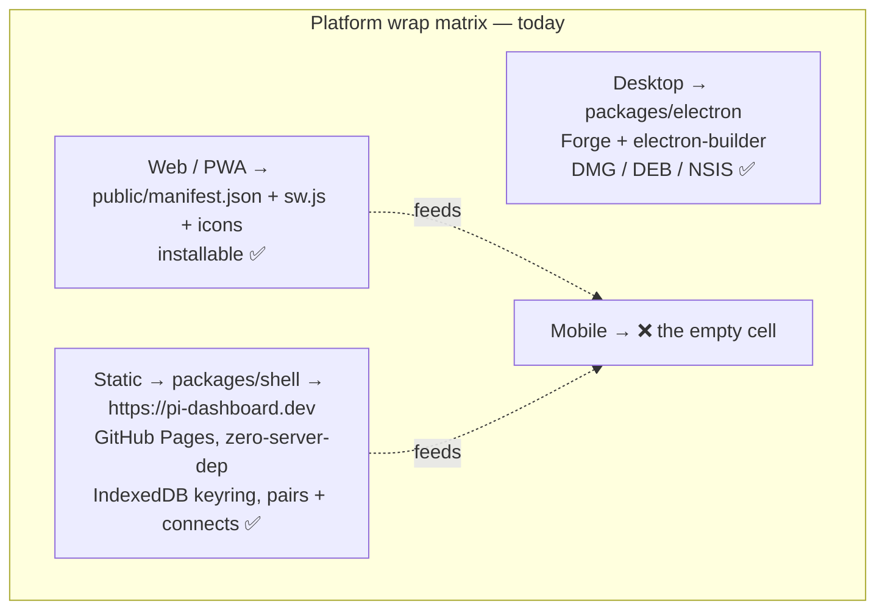
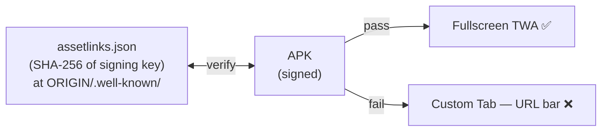
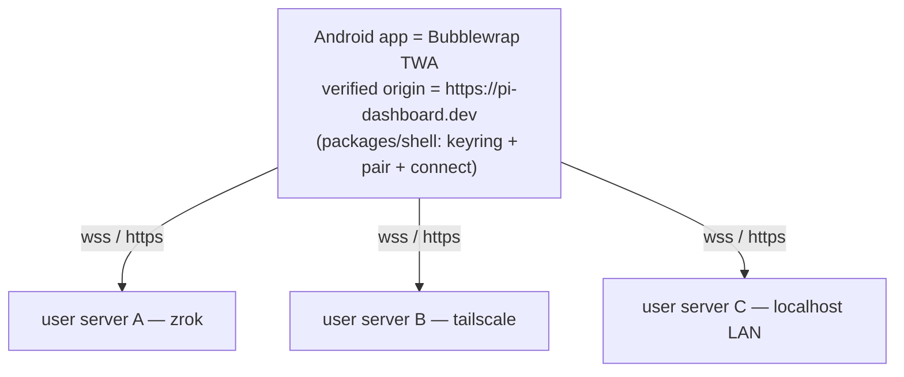
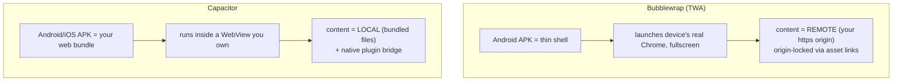
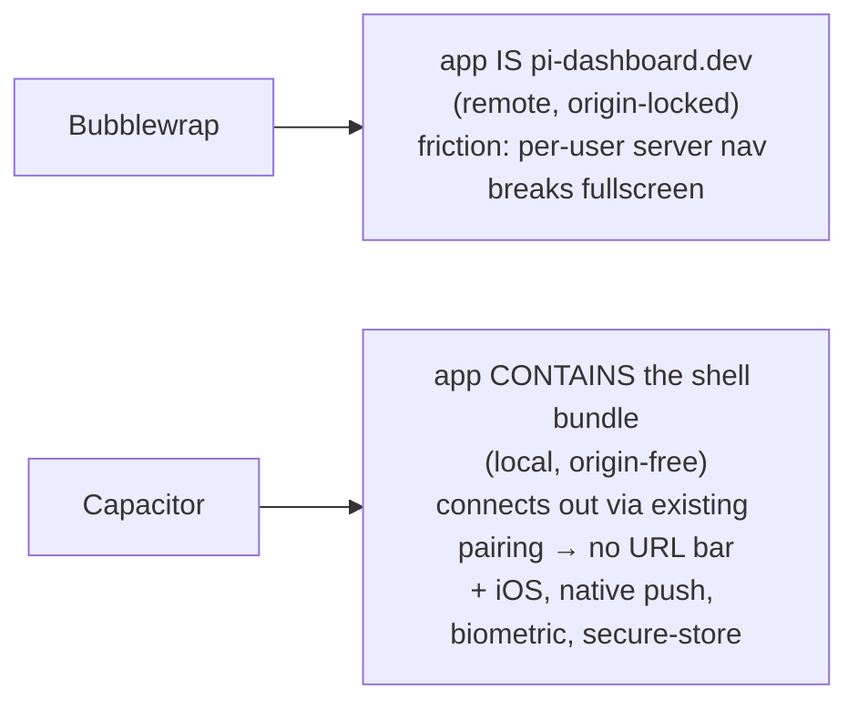

# Mobile App for pi-dashboard: Bubblewrap (TWA) vs Capacitor

Research artifact. Explore-mode output. No OpenSpec change, no implementation. Pickup-ready.
Sources fetched 2026-07-21: [Bubblewrap README](https://github.com/GoogleChromeLabs/bubblewrap),
[TWA quick-start](https://developer.chrome.com/docs/android/trusted-web-activity/quick-start),
[TWA overview](https://developer.chrome.com/docs/android/trusted-web-activity/overview).

## Framing

Goal: ship pi-dashboard as an installable **mobile app**, filling the one empty cell in its
platform-wrap matrix. The question that started as "research Bubblewrap" widened to "Bubblewrap
**or** Capacitor?" — two fundamentally different philosophies for turning web code into a mobile app.

**Disambiguation.** Two unrelated tools share the name "bubblewrap":

| | **Google Bubblewrap** (GoogleChromeLabs) | **bubblewrap / `bwrap`** (containers/Flatpak) |
|---|---|---|
| What | Node CLI wrapping a **PWA** into an Android **APK/AAB** via a **Trusted Web Activity (TWA)** | Linux unprivileged sandbox for untrusted processes |
| Relevance | The mobile-wrap path — this doc's subject | Separate hardening idea: sandbox pi's agent-run shell commands under `bwrap` (Linux). Different project. |

This doc is about **Google Bubblewrap** and its natural rival **Capacitor**.

## Current state — the substrate is ~90% there, no extension addresses it

Full-repo search (`bubblewrap`/`TWA`/`APK`/`assetlinks`) returns **zero** hits. Nothing in the repo
wraps mobile today. But three existing pieces are exactly the raw material a mobile wrap needs:

- `public/manifest.json` — `display:standalone`, `theme_color:#3b82f6`, 192/512 icons incl. `maskable`.
  **A valid TWA manifest input already.**
- `public/sw.js` — minimal pass-through service worker → satisfies PWA installability.
- `packages/shell` — a **neutral static PWA at a fixed HTTPS origin** (`pi-dashboard.dev`) that boots
  with no server, stores paired servers in IndexedDB, and connects out over `wss/https`
  (CSP `connect-src self https: wss:`). **This is the mobile-companion model already built** — it just
  runs in a browser tab instead of behind an app icon.

Note: the `capacitor-native-*` files under `packages/doc-example/judo-blueprint/` are **reference
material from the Judo framework**, not a pi-dashboard integration. Both mobile paths are greenfield.

## The decisive constraint: the verified origin

A **TWA is locked to a single HTTPS origin**, proven via **Digital Asset Links** — a
`.well-known/assetlinks.json` at that origin's root whose SHA-256 matches the APK's (or Play App
Signing) key. Fail verification → the browser falls back to a **Custom Tab with a URL bar**, defeating
the point of a fullscreen app.

pi-dashboard is **self-hosted per user**, reached via **dynamic tunnels** (`*.share.zrok.io`, ngrok
domains, tailscale MagicDNS). A user cannot place *your* app's `assetlinks.json` on a random zrok
subdomain, and every server is a different origin. **So the per-user dashboard origin cannot be the
TWA target.** The only workable origin is the one the project controls: **`https://pi-dashboard.dev`**
(the `packages/shell` Pages site — already a built-in allowed CORS origin, `docs/architecture.md`).

That yields the only clean TWA design: wrap the **pairing shell**, which connects out to the user's own
servers over `wss/https`:

### The critical open question (TWA path)

**Does the shell render the dashboard in-origin, or does "Connect" navigate to the server's URL?**
Today `packages/shell/src/App.tsx` = `KeyringView` + `PairView` only; the full dashboard UI
(`packages/client`) is served **by each server** at the server's origin.

- If connecting **navigates** the webview to `https://xxx.share.zrok.io` → it leaves the verified
  origin → **URL bar reappears** (or opens externally). TWA value largely lost.
- If the shell **renders** the dashboard itself, talking to the remote server purely over `wss/https`
  from the `pi-dashboard.dev` origin → **everything stays fullscreen-verified.** Ideal, but requires
  the client bundle to run inside the shell (it currently does not).

This fork defines two TWA shapes:

| | **A. Wrap the shell as-is** | **B. Shell-hosts-client** |
|---|---|---|
| Effort | Low — `bubblewrap init --manifest=https://pi-dashboard.dev/manifest.json` (shell needs its own manifest; today's lives in `public/` for the server) | High — bundle `packages/client` into `packages/shell`, drive it over WS from the pinned origin |
| UX | Fullscreen for pair/keyring; connecting may pop a URL bar / Custom Tab | Fully native, no URL bar, whole app in-origin |
| Verdict | Good MVP to prove the pipeline | The "real" TWA mobile app |

## Bubblewrap mechanics (transferred)

- **Prereqs**: Node ≥ 10, JDK, Android cmdline-tools. Bubblewrap offers to auto-download JDK + SDK on
  first run (recommended for correct config).
- `bubblewrap init --manifest=<origin>/manifest.json` → reads the web manifest, confirms values,
  scaffolds an Android project. Signing key created here.
- `bubblewrap build` → `app-release-signed.apk` (+ AAB for Play). **Play App Signing may re-sign** →
  asset link must match the *final* signing key.
- `bubblewrap install` (adb) → test on a device.
- Before asset links are hosted, the app opens as a **Custom Tab (URL bar visible)**. After
  `.well-known/assetlinks.json` matching the signing SHA-256 is live → verification passes → fullscreen.
- **CI-friendly**: it's a Node CLI → a GitHub Actions job could build the AAB alongside the existing
  Electron artifacts; `assetlinks.json` ships via the existing Pages deploy (`deploy-site.yml`).

## Capacitor — the rival philosophy

**Core difference: browser tab vs. embedded webview.**

| | **Bubblewrap / TWA** | **Capacitor** |
|---|---|---|
| Runtime | Device's real Chrome, fullscreen | An embedded WebView you control |
| Web code lives | **Remote** — loaded from your HTTPS origin each launch | **Bundled** into the app (or remote, but native shell) |
| Ownership proof | **Digital Asset Links** — must control the origin's `.well-known/` | None — you own the container |
| Native device APIs | ~none (it's Chrome) — Web APIs only | **Rich plugin bridge**: camera, filesystem, biometrics, push, secure storage, background tasks |
| Platforms | Android only | **iOS + Android + web** from one codebase |
| Update model | Update the website → instant, no store review | Native changes → store review; web layer can hot-update |
| Size / complexity | Tiny, near-zero native code | Full Xcode/Android Studio project to maintain |
| Store friction | Google sometimes rejects "just a website" TWAs | Standard native app, well-accepted |

### Why Capacitor fits pi-dashboard's shape better

The decisive factor is the **same origin constraint**. Bubblewrap forces the app onto exactly one
origin (`pi-dashboard.dev`) and risks a URL bar the moment the user navigates to their own server.
**Capacitor sidesteps this entirely**: bundle `packages/shell` (or shell + client) *into* the app — no
asset links, no verified-origin lock. The app connects out to arbitrary paired servers over `wss/https`
(exactly what the keyring/pairing stack already does) and never leaves its own webview, so there is
**no URL-bar problem at all**.

Native upside unlocked by Capacitor and impossible in a TWA:
- **Secure storage** for the pairing keyring (today IndexedDB) → OS keychain / EncryptedSharedPrefs.
- **Native push** for session-done / attention-needed notifications.
- **iOS** coverage for free.

The `capacitor-native-*` Judo blueprints (PKCE/passkey auth, native status bar, push pipeline, file
handling) show the maintainers already think in Capacitor terms — a mental-model tailwind, not code.

## Verdict

For a **self-hosted product with dynamic per-user origins**, **Capacitor is the better philosophical
match**: the verified-origin lock is the exact reason TWA is awkward here, and Capacitor does not have
it — plus iOS and a native bridge (secure keyring storage, push).

**Bubblewrap wins only when** zero native maintenance is paramount, Android-only is acceptable, and a
fixed public origin genuinely *is* the product (it is not here — the product is "connect to **my**
server").

Suggested sequencing if pursued:
1. **MVP / proof** — Bubblewrap Option A: prove `pi-dashboard.dev` → TWA APK + asset links + Play
   listing pipeline. Rides entirely on existing infra (fixed origin, zero-dep shell, Pages deploy).
2. **Real app** — Capacitor wrap of the shell bundle: origin-free, iOS + Android, native keyring +
   push. The durable mobile answer.

Net summary: **Bubblewrap = ship your website as a fullscreen Android launcher (origin-locked, no
native APIs). Capacitor = ship a real cross-platform native app hosting your web UI (origin-free, full
native bridge).** For pi-dashboard's per-user-server model, Capacitor removes the exact friction that
makes TWA awkward.

## Open questions / follow-ups

- Does shell "Connect" navigate to the server origin, or can the shell host `packages/client` over WS?
  (Determines whether TWA is trivial or requires shell-hosts-client work; irrelevant for Capacitor.)
- Play Store policy risk for a TWA that is "just a pairing shell."
- Capacitor keyring migration: IndexedDB → native secure storage; pairing-payload compatibility.
- `bwrap` (the other tool) — separate hardening track for sandboxing agent-run shell commands on Linux
  (`command-executor` spec, privilege-escalation helpers). Different project.

## Sources

- github.com/GoogleChromeLabs/bubblewrap (README)
- developer.chrome.com/docs/android/trusted-web-activity/{quick-start,overview}
- Repo: `public/manifest.json`, `public/sw.js`, `packages/shell/` (AGENTS.md + src),
  `packages/electron/`, `docs/architecture.md` (pairing / tunnel / allowed-origins sections).
