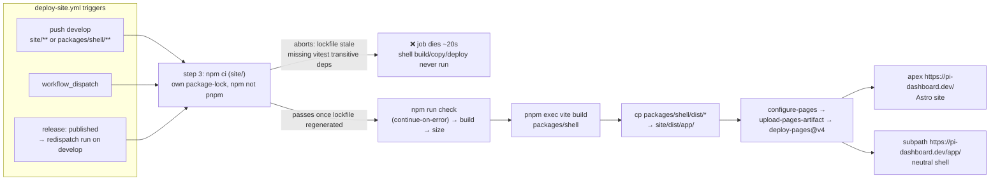
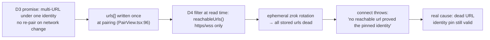
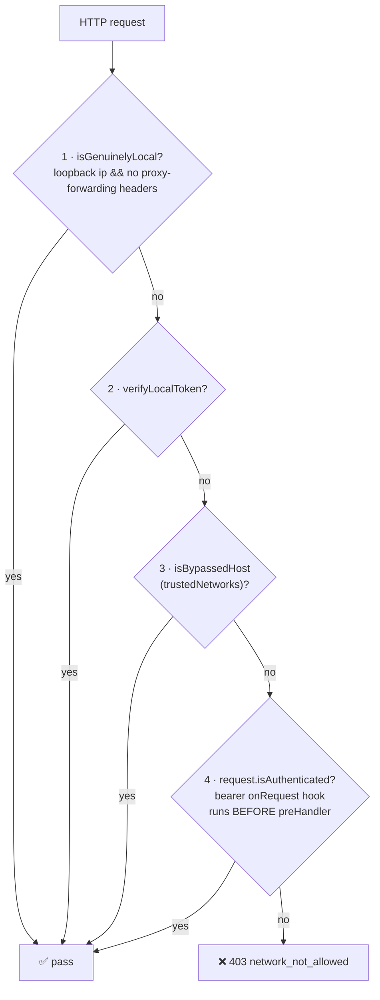

# Neutral Shell Deploy + Pairing Durability: testing pi-dashboard.dev/app

Research artifact. Explore-mode output. No OpenSpec change, no implementation. Pickup-ready.
Findings measured 2026-08-13.

## Framing

Originating question: "We are building an app intended to be on pi-dashboard.dev — a general PWA web
app accessible from the site. Is it possible to release to be able to test?"

**Answer: no release needed.** The site/shell deploy is independent of the npm/Electron release
pipeline. One stale lockfile blocks it. This doc records the deploy path, the secure-context rule
that shapes what the shell can pair with, and the durability gap in the pairing keyring — with the
empirical checks that settle the open security questions.

## Finding 1 — deploy path: mechanical, and one stale lockfile blocks testing

- `packages/shell` = neutral static PWA shell, pkg `@blackbelt-technology/pi-dashboard-shell` v0.7.0,
  private. Published to GitHub Pages at **subpath** `https://pi-dashboard.dev/app/`. `site/` (Astro)
  owns the apex.
- Deployed by `.github/workflows/deploy-site.yml`. Triggers: push to `develop` touching `site/**` or
  `packages/shell/**`; `workflow_dispatch`; `release: published` (which only re-dispatches on
  develop). **A version release is NOT required to publish the shell.**
- Workflow order: checkout → setup-node 22 → `npm ci` (in `site/`, own package-lock, NOT a pnpm
  workspace member) → `npm run check` (continue-on-error) → `npm run build` → `npm run size` →
  `pnpm install --frozen-lockfile` (root) → `pnpm exec vite build` in `packages/shell` → copy
  `packages/shell/dist/*` into `site/dist/app/` → configure-pages → deploy-pages@v4.

- **MEASURED 2026-08-13:** `https://pi-dashboard.dev/` returns 200 (stale).
  `https://pi-dashboard.dev/app/` returns 404. **The shell has NEVER been live.**
- **MEASURED:** last 5 `Deploy Site` runs all `failure`, ~20s each. Last success 2026-05-30 (run
  26693636314). 22 successes in the last 30 listed runs, all older.
- **ROOT CAUSE:** `site/package.json` devDependencies gained `"vitest": "^4.0.0"` but
  `site/package-lock.json` was never regenerated. `grep -c vitest site/package-lock.json` = 0.
  `npm ci` aborts: "Missing: @types/deep-eql@4.0.2 from lock file", also assertion-error@2.0.1,
  siginfo@2.0.0, stackback@0.0.2. Job dies at step 3; the shell build/copy/deploy steps never
  execute.
- **FIX:** regenerate `site/package-lock.json`. Unblocks both the shell AND the 2-months-stale
  marketing site.
- Secondary CI noise (not the blocker): "fatal: No url found for submodule path
  '.pi/git/github.com/BlackBeltTechnology/pi-shodh' in .gitmodules"; Node 20 deprecation warnings
  for actions/checkout@v4, actions/setup-node@v4, pnpm/action-setup@v4.

## Finding 2 — the secure-context constraint is BY DESIGN, not a bug

- `openspec/changes/archive/*add-server-keypair-pairing*/design.md` **D4**: HTTPS shell + service
  worker require a secure context; a secure page cannot open `ws://`. Only `wss://`/`https://`
  servers reachable. Plain-http LAN is OUT. Escape hatch: `http://localhost` IS a secure context, so
  the server keeps serving its own PWA for the same-desktop case.
- Explicit **Non-Goal** in the same design: "Making plain-http LAN servers reachable from the HTTPS
  neutral shell".
- Enforced server-side at read time by `PairingManager.reachableUrls()` in
  `packages/server/src/pairing/pairing.ts` — admits only https/wss, EXCEPT a loopback http origin
  when `PI_E2E_SEED=1` (`isTestLoopbackOrigin`) so the Playwright/Docker harness runs the real
  handshake without TLS. Never true in prod.
- `createPayload()` returns null when no reachable url → route returns
  `{success:false,error:"no_reachable_endpoint"}` at HTTP 200 (pairing-routes.ts:74).
- CORS: `packages/server/src/auth/cors-origin.ts` rule 6 hard-codes `https://pi-dashboard.dev` as
  allowed. Path `/app/` is not part of an origin, so the subpath choice keeps the built-in CORS
  default valid unchanged.

**Test matrix** for the pairing shell:

| Shell origin | Pairs with |
|---|---|
| `https://pi-dashboard.dev/app/` | https/wss endpoints only |
| `http://localhost:5173` (`pnpm dev`) | a tunnel, or `http://localhost:8000` ONLY when `PI_E2E_SEED=1` |
| server-served PWA at `http://localhost:8000` | always works (loopback secure context) |

Local shell dev against a local server without `PI_E2E_SEED=1` hits `no_reachable_endpoint` — looks
like a broken shell, is actually the server refusing to advertise.

## Finding 3 — keyring `urls[]` go stale: the REAL gap

- **MEASURED** on the dev box via `GET /api/tunnel/endpoints`: one `public` https endpoint
  `https://nsdfook2l23d.shares.zrok.io` (tls true) plus `local http://localhost:8000` and four `lan`
  http endpoints (192.168.16.220:8000, 100.83.251.119:8000, 192.168.196.32:8000, 192.168.64.1:8000),
  all tls false and all dropped by `reachableUrls()`. **Net: exactly ONE usable url.**
- `urls[]` is written **ONCE at pairing time**: `packages/shell/src/components/PairView.tsx:96`
  `urls: payload.urls` → `addServer()`. `addServer` is called from exactly one place in the shell
  (PairView.tsx:93). `packages/shell/src/lib/connect.ts` imports only the TYPE `KeyringEntry` and
  NEVER writes back. **No `updateServerUrls` exists.**
- `docs/architecture.md:2286`: zrok `tunnel.zrok.persistent` defaults false → ephemeral rotating
  `*.shares.zrok.io`. `tunnel.zrok.reservedName` + `persistent:true` yields a stable
  `<name>.shares.zrok.io` that SURVIVES disconnect/restart, released only by
  `POST /api/tunnel-disconnect {forget:true}`.
- **CONSEQUENCE:** on rotation every stored url is dead. `connect.ts` `resolveVerifiedUrl()` races
  `entry.urls` and throws "no reachable url proved the pinned identity". The Ed25519 identity pin is
  still perfectly valid — **the error blames identity but the cause is a dead URL. Misleading UX.**

- **TENSION:** design **D3** promises "no re-pair when networks change" via multi-URL under one
  identity, but **D4**'s https filter shrinks the very list D3 depends on. On a plain-LAN +
  ephemeral-zrok box D3 degrades to zero redundancy. The design doc does not mention this
  interaction.
- **Refresh endpoint does NOT exist.** `GET /api/pair/payload` returns fresh `urls[]` but
  `createPayload()` (pairing.ts:153) ALSO mints a fresh ~60s one-time redeemable pairing code into
  `this.codes` on every call. Using it as a URL-refresh would emit a stream of live pairing codes
  and grow the code map — converting a deliberate operator action into an automatic background one.
  Wrong tool.
- **Options recorded, none implemented:**
  - (a) new read-only bearer-gated route returning `reachableUrls()` with no minting —
    `reachableUrls()` is already a separate method, so the split is nearly free;
  - (b) shell writes urls back after a successful connect — keeps a WARM pairing fresh but cannot
    rescue an already-cold entry (circular: need to reach the server to learn its new address);
  - (c) config-only: reserved zrok name, or a second stable url.

## Finding 4 — bearer reaches guarded pairing routes: CONFIRMED

- `packages/server/src/auth/bearer-auth.ts` `registerBearerAuth` adds an `onRequest` hook:
  `parseBearerHeader` + `registry.verify(token)` → sets `request.isAuthenticated = true`.
- `packages/server/src/auth/localhost-guard.ts:105` `networkGuard` is a `preHandler`; Fastify runs
  onRequest before preHandler (stated in the function's own doc-comment). Branch order:

- So a paired device holding a valid bearer DOES pass `networkGuard` on `GET /api/pair/payload`.
  **Auth is not the missing piece; a suitable endpoint is.**

## Finding 5 — two tailscale security concerns RAISED then DISPROVEN BY MEASUREMENT

Highest-value section: these were checked empirically, with method, so nobody re-litigates them from
docs alone.

### Concern A — does `tailscale serve` inherit the loopback auth exemption?

`tailscale serve` proxies to localhost, so `request.ip` is loopback. Would a tailnet peer silently
inherit the loopback auth exemption?

- `PROXY_FORWARDING_HEADERS` in localhost-guard.ts = x-forwarded-for, x-forwarded-host,
  x-forwarded-proto, x-real-ip, forwarded. `isGenuinelyLocal(ip,headers)` =
  `isLoopback(ip) && !hasProxyForwardingHeaders(headers)`. The doc-comment warns the check is a
  heuristic: a marker-less reverse tunnel (`ssh -R`) injects none of these.
- **METHOD:** node echo server on `127.0.0.1:8399` dumping received headers; baseline direct curl;
  then `tailscale serve --bg --http=8081 http://127.0.0.1:8399`; curl through the MagicDNS name;
  then `tailscale serve reset`.
- **RESULT:** direct request carried only host/user-agent/accept. Through serve it carried
  `x-forwarded-for: 100.83.251.119`, `x-forwarded-host: home-imac-1.chipmunk-census.ts.net:8081`,
  plus `tailscale-user-login`, `tailscale-user-name`, `tailscale-user-profile-pic`,
  `tailscale-headers-info`. Both cases showed `remote: 127.0.0.1`.
- **VERDICT:** `hasProxyForwardingHeaders` true → `isGenuinelyLocal` FALSE → falls through to the
  bearer branch. **No bypass.** The D10 narrowing that closed the zrok tunnel-as-127.0.0.1 hole
  covers tailscale by the same mechanism. Note the margin is thin: the ONLY discriminator between a
  tailnet peer and a genuine local process is that header.

### Concern B — are the injected `Tailscale-User-*` identity headers client-spoofable?

- **METHOD:** same rig, curl sending forged `Tailscale-User-Login: attacker@evil.example`,
  `Tailscale-User-Name: Not Robson`, `X-Forwarded-For: 10.0.0.99`.
- **RESULT:** backend received `tailscale-user-login: robson@semmi.se` and
  `x-forwarded-for: 100.83.251.119`. Forged values **REPLACED, not appended — no XFF chain.**
- **VERDICT:** not spoofable from a tailnet client. `tailscaled` overwrites.

### Caveats

- Tested the plain-http serve path (`--http=8081`), NOT the https/:443 path (tailnet cert toggle was
  off).
- The spoof attempt originated from a device already on the tailnet.
- A verified tailnet identity is **AUTHENTICATION not AUTHORIZATION** — every tailnet member gets a
  valid login, so any future tailnet-SSO idea needs a login allowlist.
- `x-forwarded-for`'s VALUE must not be trusted generally — only its PRESENCE is what the guard
  needs.

## Finding 6 — tailscale as a stable https endpoint: code ready, tailnet not

- **MEASURED tailnet state:** BackendState Running; MagicDNS name
  `home-imac-1.chipmunk-census.ts.net`; suffix `chipmunk-census.ts.net`; TailscaleIPs
  100.83.251.119 + fd7a:115c:a1e0::4d38:fb77; `CertDomains: null` (HTTPS certs NOT enabled on the
  tailnet); `tailscale serve status --json` = `{}`. CLI/daemon version skew: client 1.98.8 vs
  tailscaled 1.84.1.
- `deriveEndpoints()` in `packages/server/src/tunnel-providers/tailscale.ts:121`: `serveHasHttps` =
  any `serveStatus.Web` key ending `:443` OR `TCP` key `443`. mode public → `https://<dns>` tls
  true; else serveHasHttps → `https://<dns>` tls true; else `http://<dns>:<port>` tls false. Comment
  warns against false-positive TLS tagging from a stray ":443" substring. With serve status `{}` the
  box lands in the else branch → tls false → dropped by `reachableUrls()`.
- **GATE CHAIN for a stable https url:** (1) tailnet admin console → DNS → enable HTTPS Certificates
  (moves CertDomains off null) — ADMIN-level, outside this codebase and the real blocker;
  (2) `tailscale serve --bg https / http://localhost:8000` so serve status gains a `<name>:443` Web
  key; (3) deriveEndpoints tags magicdns tls true → survives `reachableUrls()` → lands in `urls[]`.
- **PROVIDER EXCLUSIVITY:** `tunnel.provider` is a single value; connecting tailscale disconnects
  zrok, and tailscale `disconnect()` runs `serve reset`. Naively that trades one single-url setup
  for another.
- **WAY AROUND:** `packages/server/src/tunnel/tunnel-endpoints.ts` composes active-provider
  endpoints + top-level `publicBaseUrls` (legacy `pairing.publicBaseUrls` fallback) + LAN/local. So
  run `tailscale serve` OUTSIDE the dashboard provider lifecycle and add
  `https://home-imac-1.chipmunk-census.ts.net` via the UI "Add HTTPS URL" → `appendPublicBaseUrl` →
  auth-gated `PUT /api/config`. Keep zrok as the active provider. Result: **TWO urls under one
  pinned identity**, which restores the D3 redundancy Finding 3 showed missing — with zero code
  change. The https/wss gate still applies server-side at read time, so http cannot be smuggled in
  this way.

| | zrok | tailscale MagicDNS |
|---|---|---|
| Reachability | anywhere | tailnet devices only |
| Client setup | none | tailscale app + login on the phone |
| URL stability | rotates unless reserved | permanent |
| TLS | zrok edge | Let's Encrypt via tailnet, auto-renewed |
| Dependency | third-party | self-hosted |

A tester without tailscale cannot reach the MagicDNS url at all → **keep both.**

## Bottom line

To test the shell at `pi-dashboard.dev/app/`: regenerate `site/package-lock.json`, dispatch
`Deploy Site`, and make at least one https endpoint durable — either `tunnel.zrok.reservedName` +
`persistent:true`, or the tailnet HTTPS toggle plus the MagicDNS url in `publicBaseUrls`. **No
release, and no code change, is required for any of that.**

Open items deliberately NOT actioned: the missing read-only url-refresh route, the shell-side
writeback, and the dead-url-reported-as-identity-mismatch message. Candidate follow-up changes named
in the exploration: `fix-deploy-site-ship-shell` and `refresh-keyring-urls`.

## Sources

- Repo: `.github/workflows/deploy-site.yml`, `site/` + `site/package.json` + `site/package-lock.json`,
  `packages/shell/src/` (PairView.tsx, keyring.ts, connect.ts), `packages/server/src/` (pairing.ts,
  auth/cors-origin.ts, auth/bearer-auth.ts, auth/localhost-guard.ts, tunnel-providers/tailscale.ts,
  tunnel/tunnel-endpoints.ts, routes/pairing-routes.ts), `docs/architecture.md` (tunnel + pairing
  sections, :2286), `openspec/changes/archive/*add-server-keypair-pairing*/design.md`.
- Measurements 2026-08-13: `curl` of apex + `/app/`, GitHub Actions `Deploy Site` run list,
  `GET /api/tunnel/endpoints`, localhost-guard echo-server experiment with `tailscale serve`
  (Concerns A+B), `tailscale status` / `tailscale serve status --json`.
