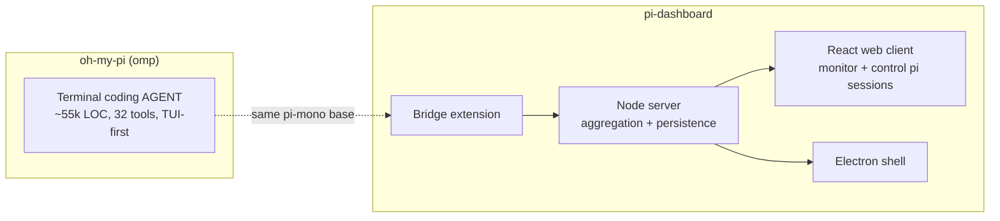
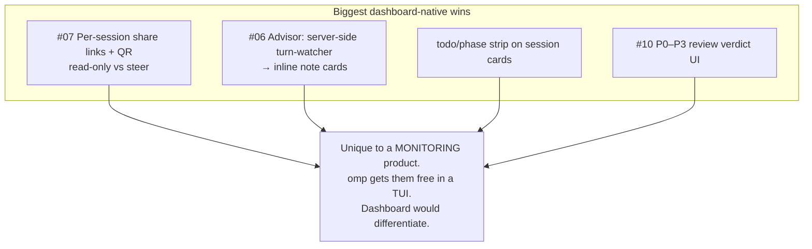

# oh-my-pi (omp) → pi-dashboard: Feature Adaptation Report

Research artifact. Explore-mode output. No OpenSpec change, no implementation. Source: https://github.com/can1357/oh-my-pi README (fetched 2026-07-14). Pickup-ready.

## Framing

omp = fork of `pi-mono` (same base pi-dashboard sessions run). omp = terminal coding AGENT (~55k LOC Rust+TS, 32 tools, TUI-first). pi-dashboard = orchestrator/observer: bridge extension + Node server (aggregation/persistence) + React client (monitor/control many pi sessions) + Electron shell. Different layers.

Adaptation vectors:
1. UI vector — surface in React client (`src/client/`).
2. Skill/extension vector — port into bundled `.pi/skills` / `packages/*` (ship with the pi sessions run).
3. Protocol/server vector — bridge, server, or shared-protocol change.

## Tier 1 — High value, strong fit

| # | omp feature | What it does | pi-dashboard adaptation | Vector | Overlap today |
|---|---|---|---|---|---|
| 07 | `/collab` share link + QR | Live session on relay; URL + QR + `omp join`; client-sealed frames; read-write or read-only view links | Add per-session shareable links: read-only "watch" vs read-write "steer", QR for phone | UI + server | Partial: tunnel (zrok) + device-pairing exist; no per-session scoped/read-only share |
| 06 | Advisor — second model watching every turn | Reviewer model on `advisor` role reads each turn, injects inline notes (aside/concern/blocker); own context+model | Server-side advisor subscribes to a session's turns, injects notes via PromptBus, rendered as advisor cards | Skill/ext + UI | None |
| 10 | `/review` — priorities + verdict | Reviewer subagents sweep branch/commit/uncommitted in parallel; issues P0–P3 + confidence; ship/no-ship verdict | Add P0–P3 verdict UI in session card / git panel; ranked instead of prose | UI + skill | Partial: CodeRabbit `code-review` gate exists; no ranked verdict UI |
| — | `todo` tool + phase tracking | Ordered mutations over session todo list with phases | Render live todo/phase state per session as progress strip on card | UI + protocol | None (flows exist, not per-session todo) |
| 13 | Hindsight — curated cross-session memory | `retain` writes facts mid-run, `recall` pulls, `reflect` synthesizes; per-repo mental model on turn 1 | UI to browse/edit/prune a session's memory bank; show what it learned about repo | UI + skill | Partial: memory tools exist; no browse/curate UI. Pairs with `consolidate-pi-memory-store` skill |
| 05 | First-class subagents, typed results | `task` fans into isolated worktrees; schema-validated object yielded to parent | Adapt subagent status cards (cost, duration, per-worker live status) into flow visualization | UI | Partial: flows + worktrees exist; card richness differs |

## Tier 2 — Good fit, medium effort

| # | omp feature | pi-dashboard adaptation | Vector |
|---|---|---|---|
| 16 | `omp commit` — atomic splits + validated messages | Dependency-ordered atomic commit splitting (source>tests>docs, lockfiles excluded, cycle rejection) as skill from git panel; repo already has commit-from-card | Skill + UI |
| 18 | Conflict resolution via `conflict://N` | Conflict = one URL; write `@theirs`/`@ours`/`@base`, bulk `conflict://*`; one-click resolver in session diff / worktree merge | Skill + UI |
| 04 | Time-traveling stream rules | Regex aborts stream mid-token, injects rule as system reminder, retries; survives compaction. UI-defined rules bridge injects into watched sessions | Server/ext + UI |
| 02 | LSP wired into writes | Rename via `willRenameFiles`. Embedded Monaco/code-server pane gains LSP-backed rename/diagnostics | UI (editor) |
| 03 | `debug` — DAP session driving | Generalized DAP (lldb/dlv/debugpy) broader than repo's `node-inspect-debugger` skill; port for non-Node sessions | Skill |
| 20 | Browser + Electron-app driving (stealth default) | Extend repo's `browser` skill: drive any Electron app (read Slack DMs), stealth defaults | Skill |
| — | `ask` structured option picker mid-turn | Align PromptBus/interactive dialogs to recommended-badge option picker; consistent across TUI/ACP/web | UI |

## Tier 3 — Architecture / protocol ideas

| omp capability | Why it matters for pi-dashboard |
|---|---|
| `--mode rpc-ui` — tool cards/selectors/dialogs as `extension_ui_request` frames host answers | Reference model for dashboard Extension UI System (docs track Phases 1+2) |
| ACP (Agent Client Protocol) — editor-drivable, permission-gated writes | Map if dashboard becomes ACP host (`session/request_permission` gating); omp tool→ACP route table is the guide |
| Fallback chains + round-robin credentials + path-scoped models | Per-role fallback chains + path-scoped model config harden multi-session reliability under 429s |
| Config inheritance from `.claude/.cursor/.windsurf/…` | `project-init` skill inherits existing rules/MCP/skills from other tools' dotdirs on first init; zero-migration onboarding |
| `search_tool_bm25` — hidden tool index, pull tools mid-session | BM25 tool-discovery keeps active set lean; mirrors repo `kb_search` philosophy |
| In-process native tools (ripgrep/glob/find, brush shell) | Explains omp speed; informs perf work on server file/search APIs |

## Overlaps — already covered, low marginal value

- 11 Hashline / content-hash edits → pi `edit` already exact-match anchoring.
- 12 GitHub as filesystem → repo has `github`-capable skill + `gh` in CI skills.
- 08 web_search + read PDFs/URLs → context-mode `ctx_fetch_and_index` + browser skill cover most.
- 15 config inheritance → partial; AGENTS.md tree is local convention.
- 09 native/cross-platform → dashboard handles cross-OS launch (architecture.md Cross-OS Platform Primitives).
- 01 eval w/ tool re-entry → context-mode `ctx_execute` analogous think-in-code surface.

## Recommended shortlist

Four above = dashboard vantage point (sees every turn of every session) turns an omp single-agent feature into more. Advisor (watch N sessions, inject guidance) + share links (remote-collaboration story dashboard built for) rank highest.

## Next steps (when picked up)

- Deepen advisor-as-server-subscriber: slot into bridge/server/shared-protocol.
- Deepen per-session share links: read-only vs steer, QR, scoped tokens.
- Or capture as OpenSpec proposal via openspec-new-change.
