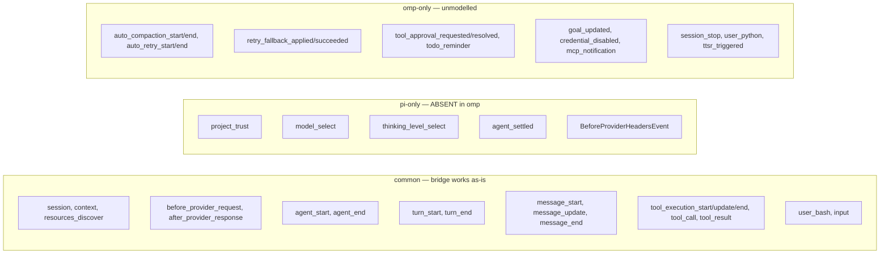
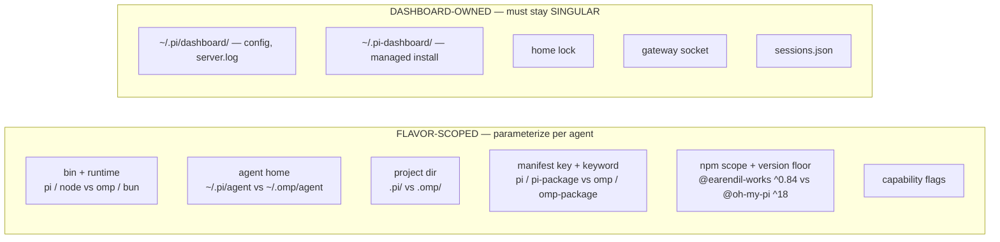

# omp parallel support — drive pi AND omp agents per-session

Research dossier. Explore-mode, no change / no impl. Question: can pi-agent-dashboard support BOTH pi and omp agents in parallel, per-session selectable? User constraint: adoption NOT decided — evaluation only. Flavor scope decided = PER-SESSION (spawn either pi or omp per card, both visible simultaneously). **VERDICT: CONDITIONAL GO — compatibility spikes 1+2 EXECUTED 2026-08-29. Loader + core API GREEN, verified live. Spike 2 IMPROVED risk profile: sessions = JSONL pi-identical layout (storage-ENGINE claim CORRECTED — SQLite scope = settings/auth/models/history ONLY); RPC gap S→XS (keeper dispatches `prompt` only); version-skew packaging fear REFUTED (display quirk); runtime-undefined members CONFIRMED unconditional (both modes). NEW cost: per-flavor env isolation — omp honors pi's `PI_CONFIG_DIR` (gap #7). Last red: omp session RECORD schema — needs ONE working credential.**

## Framing

Eleven subjects: fork reusability, omp anatomy, compatibility findings, gap inventory, options, scorecard, spike, results, risks, sequencing, remaining unknowns.

Headline findings:
- Bridge already runtime-agnostic — all 9 pi imports type-only. ZERO runtime coupling. VERIFIED LIVE.
- Loader ACCEPTS our entry contract — probe ext `export default function activate(pi)` loaded + activated via `omp -e <path.ts>`. Raw TS, no build step.
- omp `.d.ts` is NOT a compatibility oracle — `getSessionName`, `setSessionName`, `unregisterProvider` DECLARED in omp types, UNDEFINED at runtime → 22 call sites throw `TypeError: not a function`.
- omp hangs headless on unreachable MCP servers — rc=124, 0 bytes stdout/stderr, no diagnostic. Clean `HOME=/tmp/omp-home` works. Spawn preflight MUST bound startup.
- Storage claim CORRECTED (spike 2, was OVERSTATED): SQLite scope = settings + auth + models + prompt-history ONLY (`agent.db`, `models.db`, `history.db` FTS5, WAL) + YAML config. SESSIONS = JSONL, pi-identical layout (`<sessions>/<mangled-cwd>/<ISO>_<id>.jsonl`); only diff = id token (omp 16-hex vs pi UUID). Credentials do NOT carry over.
- Version mismatch REFUTED as packaging skew (spike 2): npm `18.0.11` = build version; `omp --version` `13.14.2` = display quirk (`config.yml` `lastChangelogVersion: 13.14.2`); dist/src in sync. PACKAGE version authoritative; `omp --version` output still NOT trusted.
- Runtime-undefined members CONFIRMED unconditional (spike 2): identical in `--print` AND `--mode rpc`; members implemented in bundle (`dist/cli.js` `getSessionName` ×20) but NOT exposed on ExtensionAPI → 22-call-site exposure REAL, mode-independent, NOT probe artifact. Workaround: omp RPC exposes `set_session_name` command.
- RPC wire protocol (unknown #2) RESOLVED: omp case set 42 vs pi `RpcCommand` 36; true pi-only = `clear_queue`, `clone`, `get_available_thinking_levels`, `get_entries`, `get_tree`; keeper dispatches EXACTLY `prompt` — both implement → RPC gap XS.
- NEW FINDING H: omp HONORS pi's `PI_CONFIG_DIR` — dashboard-spawned omp writes sessions/auth/models into pi's tree (silent cross-flavor contamination). Per-flavor env scrub/redirect REQUIRED (gap #7, S–M).
- `agent_settled` trap CONFIRMED live: `agent_end` fires, `agent_settled` does NOT → `settleFollowUp` synthesis path VIABLE for omp.
- `pi.on()` PERMISSIVE — 19/19 probed event names subscribe OK, absent events never fire. No defensive try/catch needed.
- Dominant cost = 147 stray `.pi/*` path literals outside `managed-paths.ts` + `dashboard-paths.ts` (unchanged by spike).

## 1. The fork is not reusable

`github.com/oldschoola/omp-agent-dashboard` = fork of `BlackBeltTechnology/pi-agent-dashboard`.

- 2 commits AHEAD, 1193 commits BEHIND develop. Diverged.
- Ahead commits: `970c22e7` "feat: adapt dashboard fork for oh my pi" + `43f03bf3` "Update README.md".
- 256 files changed, +9866 / −8570.

Nature = blind global sed rebrand: `pi`→`omp`, `.pi/`→`.omp/`, `@earendil-works/*`→`@oh-my-pi/*`.

Evidence of mechanical-not-designed:
- Renamed DASHBOARD-OWNED constants `PI_SETTINGS_PATH`→`OMP_SETTINGS_PATH`, `PI_PLUGINS_DIR`→`OMP_PLUGINS_DIR` — ours, defined `packages/shared/src/managed-paths.ts`, not agent-owned.
- Renamed dashboard's own state dirs `~/.pi-dashboard/`→`~/.omp-dashboard/` and `~/.pi/dashboard/`→`~/.omp/dashboard/` — dashboard is ONE app regardless of driven agent.
- Left `package.json#name` = `@blackbelt-technology/pi-agent-dashboard` + repo URL pointing at upstream.

Fork DELETES pi support rather than ADDING omp support. Not parallel. Value = checklist of rename axes ONLY. Nothing to cherry-pick.

## 2. What omp is

`@oh-my-pi/pi-coding-agent` = hard fork of pi by `can1357`. Repo `github.com/can1357/oh-my-pi`.

- omp version `18.0.11` (npm time.modified 2026-08-29). Upstream pi `0.84.4`.
- Repo pins `^0.84.1` (`packages/server/package.json:45`), `>=0.80.10` (`packages/extension/package.json:48`).
- `bin` = `{ "omp": "dist/cli.js" }` — binary named `omp`, NOT `pi`.
- `engines` = `{ "bun": ">=1.3.14" }`. `main` = `./src/index.ts`.
- `dist/cli.js` shebang = `#!/usr/bin/env bun`, marker `// @bun`. **omp requires Bun runtime; pi runs on node.**

Dep tree fully renamespaced: `@oh-my-pi/pi-ai`, `@oh-my-pi/pi-tui`, `@oh-my-pi/pi-agent-core`, `@oh-my-pi/pi-catalog`, `@oh-my-pi/pi-utils`, `@oh-my-pi/pi-wire`, `@oh-my-pi/pi-natives` + omp-only `hashline`, `snapcompact`, `pi-mnemopi`, `omptype`, `omp-stats`. OpenTelemetry deps present.

Env vars MIXED, not renamed wholesale:
- omp RETAINS `PI_*`: `PI_SESSION_FILE`, `PI_CODING_AGENT_DIR`, `PI_TOOL_BRIDGE_URL/TOKEN/SESSION`, `PI_ARTIFACTS_DIR`, `PI_NO_PTY`, `PI_COMPILED`, `PI_PROXY`.
- omp ADDS `OMP_*` for new features: `OMP_AUTH_BROKER_URL`, `OMP_PROFILE`, `OMP_MCP_TIMEOUT_MS`, `OMP_NO_WEBP`.
- Home literals: `.omp/` ×31, `".omp"` ×11, ZERO `.pi/`. Agent home = `~/.omp/agent`, env largely compatible.

RPC mode preserved: `src/modes/rpc/rpc-mode.ts`, `src/modes/rpc/rpc-client.ts`. CLI flags: `--mode`, `--extension`, `--plugin-dir`, `--print`, `--continue`, `--fork`, `--no-extensions`.

Extension subsystem preserved: `src/extensibility/extensions/{types,loader,runner,wrapper,model-api,index}.ts`.

## 3. Compatibility findings — the enabling facts

### 3a. Bridge is runtime-agnostic ALREADY — biggest enabling fact

All imports from pi package in `packages/extension/src/` are TYPE-ONLY. Measured: `total=9  type-only=9  value=0`.

Files: `bridge.ts:21`, `provider-register.ts:36`, `role-manager.ts:31`, `canvas-tool.ts:22`, `command-handler.ts:17`, `dashboard-context-injector.ts:17`, `role-model-tools.ts:18`, `ask-user-tool.ts:8`, `bridge-context.ts:5` — every one `import type { ExtensionAPI } from "@earendil-works/pi-coding-agent"`.

Bridge duck-typed against `ExtensionAPI`. Types erase at build. ZERO runtime coupling. No bridge port needed for a different host.

**SPIKE VERIFIED LIVE (FINDING B, 2026-08-29):** omp loader accepted probe extension with identical entry shape — loaded + ACTIVATED under omp. `loader.ts:58-61` `type LoadedExtensionModule = ExtensionFactory | { default?: ExtensionFactory }`; picks `module` when function, else `module.default`. Our `bridge.ts:170` `export default function (pi: ExtensionAPI) {` matches EXACTLY. omp bundled example `examples/extensions/api-demo.ts` uses identical shape. `pi.registerTool({name,description,parameters,execute})` → registered OK. `omp -e <path.ts>` accepts raw TypeScript — no build step.

### 3b. ExtensionAPI members — omp has everything we use

pi-only members omp DROPPED, with our measured usage count:

| member | our usage |
|---|---|
| `deliverAs` | 0 |
| `registerEntryRenderer` | 0 |
| `registerMarkdownTransformer` | 0 |
| `triggerTurn` | 0 |

Members we DO use, present in BOTH: `appendEntry` (11), `sendUserMessage` (210), `registerTool` (41), `registerProvider` (27), `registerCommand` (9), `setModel` (8), `exec` (13), `on` (50), `events` (249).

omp-only additions (unmodelled upside): `getServiceTiers`, `setServiceTier`, `logger`, `arktype`, `typebox`, `zod`, `registerAssistantThinkingRenderer`, `registerComposerShape`, `registerFileWriteFallback`, `registerFileDeleteFallback`, `getArgumentCompletions`.

**RUNTIME CENSUS — `typeof` on live object (FINDING C).** PRESENT (`=function`): `appendEntry`, `sendUserMessage`, `registerTool`, `registerCommand`, `registerProvider`, `setModel`, `setThinkingLevel`, `getThinkingLevel`, `getActiveTools`, `getAllTools`, `getCommands`, `exec`, `on`, `setLabel`. `events` = `object`. **DECLARED in omp types, UNDEFINED at runtime:** `getSessionName` (`types.ts:1477` `getSessionName(): string | undefined`, `:1701`), `setSessionName` (`types.ts:1480` `setSessionName(name: string): Promise<void>`, `:1702`), `unregisterProvider` (`types.ts:1527` `unregisterProvider(name: string): void` AND `:1683` 2-arity `(name, sourceId)` overload). Static type comparison PASSED these; runtime probe FAILED them. Only a live probe reveals type/impl drift. Future flavor work MUST runtime-probe, not type-compare.

**SPIKE 2 — CONFIRMATION (strengthens FINDING C):** alternative "reduced API surface in `--print`, fuller elsewhere" REFUTED. Re-probed under `--mode rpc` — IDENTICAL result both modes: `getSessionName=undefined`, `setSessionName=undefined`, `unregisterProvider=undefined`; `sendUserMessage=function`, `registerTool=function` (controls, present both). Members DO exist in bundle (`dist/cli.js`: `getSessionName` ×20, `setSessionName` ×16, `unregisterProvider` ×3) — implemented internally, simply NOT exposed on the ExtensionAPI object handed to extensions. VERDICT: the 22-call-site exposure is REAL and mode-independent. Capability shims required. Not a probe artifact. NOTE: omp RPC exposes `set_session_name` as a command — session naming IS reachable via the RPC surface even though the extension API omits `setSessionName`. Viable workaround path.

### 3c. Event surface — the real gaps

pi `ExtensionEvent` union at `node_modules/@earendil-works/pi-coding-agent/dist/core/extensions/types.d.ts:773`. omp union at `src/extensibility/extensions/types.ts:1068`.

COMMON (bridge works): `session`, `context`, `resources_discover`, `before_provider_request`, `after_provider_response`, `before_agent_start`, `agent_start`, `agent_end`, `turn_start`, `turn_end`, `message_start`, `message_update`, `message_end`, `tool_execution_start/update/end`, `tool_call`, `tool_result`, `user_bash`, `input`.

pi-ONLY, ABSENT in omp: `ProjectTrustEvent` (`project_trust`), `ModelSelectEvent` (`model_select`), `ThinkingLevelSelectEvent` (`thinking_level_select`), `AgentSettledEvent` (`agent_settled`), `BeforeProviderHeadersEvent`.

Our consumption of those:
- `agent_settled` → `packages/extension/src/agent-settled.ts` + `bridge.ts:2025`.
- `model_select` → `provider-register.ts:1110`, `bridge.ts:2035`, `bridge.ts:2204`.
- `thinking_level_select` → `bridge.ts:2036`, `bridge.ts:2216`.
- `project_trust` → `bridge.ts:2584` ALREADY cast `as any` (already defensive).

omp-ONLY events (unmodelled): `auto_compaction_start/end`, `auto_retry_start/end`, `retry_fallback_applied/succeeded`, `tool_approval_requested/resolved`, `todo_reminder`, `goal_updated`, `credential_disabled`, `mcp_notification`, `session_stop`, `user_python`, `ttsr_triggered`.

NOTE: `queue_update` + `session_info_changed` are BRIDGE-INTERNAL emitters, NOT pi events. No gap.

**SPIKE — `pi.on()` PERMISSIVE (FINDING D, GREEN):** subscribing to events omp does NOT emit does NOT throw. All 19 probed names returned `PROBE_SUB ok`, incl. `agent_settled`, `model_select`, `thinking_level_select`, `project_trust`. Bridge can subscribe unconditionally; absent events simply never fire. No defensive try/catch needed around `pi.on`.

**SPIKE — measured event lifecycle, one turn (FINDING E):**
`session_start` → `before_agent_start` → `agent_start` → `turn_start` → `message_start` → `message_end` → `context` → `message_start` → `message_end` → `turn_end` → `agent_end`
LIVE absent, confirms §3c static gaps: `agent_settled`, `model_select`, `thinking_level_select`, `project_trust`. Also absent this run: `message_update` (likely non-streaming `--print`), `tool_execution_*` (no tool invoked) — need re-probe under streaming/tool-using turn, NOT established as gaps. `agent_end` DOES fire → `settleFollowUp("agent_end", nativeSupported=false, ts)` synthesis VIABLE. Full lifecycle fired through `agent_end` even though run errored (rc=1, clean HOME had no credentials).

**SPIKE 2 — REPRODUCIBLE (FINDING E, confirmed):** lifecycle re-measured 3 runs, identical order every run: `session_start → before_agent_start → agent_start → turn_start → message_start → message_end → context → message_start → message_end → turn_end → agent_end`. `agent_settled` ABSENT every run. Confirms §3d synthesis path.

### 3d. agent_settled — synthesis exists, BUT version-gate trap

`packages/extension/src/agent-settled.ts` already synthesizes `agent_settled` for "floor pi" 0.78.0–0.80.3 which never emitted it. Exports `NATIVE_AGENT_SETTLED_FLOOR = "0.80.4"`, `nativeAgentSettledSupported(v)`, `synthesizeAgentSettledEvent(ts)`, `markFloorSettle(ev, terminal)`, `settleFollowUp(eventType, nativeSupported, ts)`. `settleFollowUp("agent_end", false, ts)` fabricates terminal settle. Pure + unit-tested. See change: `adopt-pi-074-080-features`.

**TRAP — measured:** `nativeAgentSettledSupported` compares raw semver major-first. Results:
- `"0.84.1"`→`true` (correct)
- `"0.79.0"`→`false` (correct, synthesizes)
- **`"18.0.11"`→`true` (WRONG)**

Because `18 > 0`, omp assumed to emit natively; bridge never synthesizes; idle detection dies SILENTLY — no error, no log.

Latent beyond omp: ANY agent reporting major ≥ 1 trips it. Bites when pi itself reaches 1.0, independent of omp.

Fix direction: capability must be FLAVOR-derived, not VERSION-derived. Then existing tested floor path handles omp unchanged.

**SPIKE CONFIRMS trap LIVE (FINDING E):** one real omp turn → `agent_end` fires, `agent_settled` does NOT. Synthesis path VIABLE for omp (per §3d plan). Trap still real: `nativeAgentSettledSupported("18.0.11")` → true (wrong); capability must stay flavor-derived.

### 3e. model / thinking switching — direction split

omp KEEPS setters+getters, drops only NOTIFICATION events. `omp types.ts:1459 getThinkingLevel(): ThinkingLevel | undefined`, `:1462 setThinkingLevel(level): void`, plus `setModel`, `registerProvider`, `unregisterProvider`.

- Dashboard→agent (UI-driven switching) = FULL SUPPORT.
- Agent-TUI→dashboard (reflect external change) = LAGGED. No `model_select` event. `bridge.ts` already owns `sendModelUpdateIfChanged()` dedup gate; re-drive at turn boundaries → reflects next turn, not instantly.

## 4. Gap inventory for parallel support

Axis classification. Fork wrongly renamed BOTH columns; only the first must be flavored.

FLAVOR-SCOPED (parameterize): bin+runtime (`pi`/node vs `omp`/bun); agent home (`~/.pi/agent` vs `~/.omp/agent`); project dir (`.pi/` vs `.omp/`); manifest key + keyword (`pi`/`pi-package` vs `omp`/`omp-package`); npm scope + version floor (`@earendil-works` `^0.84` vs `@oh-my-pi` `^18`); capability flags.

DASHBOARD-OWNED (must stay SINGULAR): `~/.pi/dashboard/` (config, `server.log`), `~/.pi-dashboard/` (managed install), home lock, gateway socket, `sessions.json`.

Gap table with sizing:

| # | gap | locations | size |
|---|---|---|---|
| 1 | Binary+runtime resolution — choke point EXISTS | `resolver.resolvePi()` (`spawn-process/spawn-preflight.ts:76`, `process-manager.ts:444/445`); `PI_SPAWN_TOOL = "pi"` (`server/src/pi/pi-runtime.ts:39`); `commandBasename(entry.command) === "pi"` (`process-classifier.ts:80`); `registry.resolve("pi")` (`cli.ts:233`, `pi-version-skew.ts:101`, `worktree-init.ts:304`, `doctor-routes.ts:61/88/94`) | M — needs omp tool definition + BUN PREFLIGHT (pi is node-runnable, omp is not) |
| 2 | Agent-side path literals | `managed-paths.ts` + `dashboard-paths.ts` centralize SOME, but **147 non-test source files still carry `.pi/agent` / `.pi/skills` / `.pi/settings` literals** outside those modules. Worst: `extension/src/provider-register.ts` 13, `shared/src/pi-package-resolver.ts` 11, `server/src/git-worktree/git-operations.ts` 10, `extension/src/project-init/scaffold.ts` 8, `server/src/routes/git-routes.ts` 7, `server/src/pi/pi-resource-scanner.ts` 6 | L — DOMINANT COST |
| 3 | Session discovery + JSONL parse | `resolvePiSessionsDir()` (`dashboard-paths.ts:70`) hardcodes `~/.pi/agent/sessions`; parallel needs BOTH roots scanned; scanner + `packages/session-distiller` parse it | M (was M–L, HIGHEST RISK — downgraded spike 2) — SPIKED 1+2: sessions JSONL pi-IDENTICAL layout, dir-per-mangled-cwd `<ISO>_<id>.jsonl`; id token omp 16-hex vs pi UUID → scanner needs id-format tolerance, NOT a new parser. RECORD-level schema STILL UNMEASURED (needs authenticated turn). SQLite scope = settings/auth/models/history ONLY. `--session-dir=<value>` flag EXISTS → storage location overridable |
| 4 | Package/extension installability | we publish `"pi": { extensions, skills }` + `keywords: ["pi-package"]`; `shared/src/pi-package-resolver.ts:356` reads `pkg.pi.extensions` | S. Manifest keys are ADDITIVE: one package can declare BOTH `"pi"` and `"omp"` keys pointing at the SAME physical paths, `keywords: ["pi-package","omp-package"]`; each agent reads only its own key. **No `.pi/`→`.omp/` directory rename needed** — fork renamed dirs for nothing |
| 5 | Version floor / skew | `server/src/pi/pi-runtime.ts` resolves floor from `piCompatibility.minimum` + semver-compares; `18.0.11` vs `0.84.1` floor is nonsense. Also `pi-core-checker.ts`, `pi-core-updater.ts`, `pi-version-skew.ts` | S–M — floors must go per-flavor — SPIKED 1+2: npm `package.json#version` = `18.0.11` (AUTHORITATIVE — dist/src in sync); `omp --version` `13.14.2` = display quirk (`config.yml` `lastChangelogVersion`), NOT packaging skew. Trust PACKAGE version; `omp --version` output still untrusted |
| 6 | Capability degradation | bridge must tolerate absent `agent_settled`/`model_select`/`thinking_level_select`; client must not render dead affordances | M — SPIKED: 22 call sites on runtime-undefined members require capability SHIMS, not just event flags: `getSessionName` 12 sites (`session-sync.ts:160`, `session-sync.ts:230`, `bridge.ts:2012`, `bridge.ts:2569`, +8), `setSessionName` 6 (`bridge.ts:1972` ALREADY try/catch-guarded, `command-handler.ts:910`, `auto-session-namer.ts`, +3), `unregisterProvider` 4 (`provider-register.ts:920/928`, +2). UNGUARDED: `session-sync.ts:160/230`, `bridge.ts:2012`. Signature drift: omp `setSessionName` returns `Promise<void>`, pi `void`; omp 2-arity `unregisterProvider(name, sourceId)` overload pi lacks |
| 7 | Per-flavor env isolation | dashboard-spawned env carries `PI_CONFIG_DIR`, `PI_DASHBOARD_SPAWNED=1`, `PI_DASHBOARD_URL=ws://localhost:9999`, `PI_DASHBOARD_SOCKET`, `PI_CODING_AGENT=true`; omp HONORS `PI_CONFIG_DIR` → writes into pi's tree (`spawn` env construction — `spawn-preflight.ts` / `process-manager.ts`) | S–M — NEW (spike 2, FINDING H): scrub/redirect `PI_CONFIG_DIR` + `PI_*` family for omp sessions. Silent cross-flavor contamination — sessions/auth/models land in wrong flavor's tree. Subtle, silent-failure-prone. Absent from spike-1 estimate |

**SPIKE 2 — CORRECTION (FINDING F, spike-1 "different storage ENGINE" claim OVERSTATED):** engine difference applies to settings/auth/models/history ONLY, NOT sessions.
- settings — pi `~/.pi/agent/settings.json` (JSON file) vs omp `agent.db` `settings` table (SQLite).
- auth — pi `~/.pi/agent/auth.json` vs omp `agent.db` `auth_credentials` table: `id INTEGER PK AUTOINCREMENT, provider TEXT, credential_type TEXT, data TEXT, disabled_cause TEXT, identity_key TEXT, created_at INTEGER, updated_at INTEGER`.
- models — pi `models.json` + `models-store.json` vs omp `models.db` (SQLite).
- prompt history — pi none vs omp `history.db`, FTS5 (`history_fts`, `history_fts_data/idx/docsize/config`), schema `history(id, prompt, created_at, cwd)` + trigger `history_ai`.
- config — pi JSON vs omp `~/.omp/agent/config.yml` YAML (observed: `lastChangelogVersion: 13.14.2` — correlates with `omp --version` display quirk).
- SESSIONS — pi `~/.pi/agent/sessions/<project>/*.jsonl` vs omp `~/.omp/agent/sessions/<mangled-cwd>/<ISO-timestamp>_<id>.jsonl` — **layout structurally IDENTICAL.** Observed omp: `sessions/--private-tmp-omp-spike--/2026-08-29T22-58-57-251Z_156b3d2c18c7c9fa.jsonl`. pi shape: `sessions/--Users-robson-Project-pi-agent-dashboard--/2026-08-29T18-49-42-196Z_01a04edb-2e34-7970-aca1-4ad95db1d18e.jsonl`. Dir-per-mangled-cwd + `<ISO>_<id>.jsonl` both. ONE diff = id token: omp 16-hex (`156b3d2c18c7c9fa`) vs pi UUID (`01a04edb-…`). Scanner needs id-format tolerance, NOT a new parser. RECORDS INSIDE still unmeasured — all 4 omp session files 0 bytes (every turn died pre-persist, no working credential). pi record types for contrast: `session` 1, `model_change` 2, `thinking_level_change` 2, `session_info` 1, `message` 108, `custom` 9; pi rec0 keys `["type","version","id","timestamp","cwd"]`.
- omp extra: `~/.omp/agent/terminal-sessions/`, `~/.omp/logs/`. All omp DBs WAL mode (`-shm`/`-wal` sidecars present).
CONSEQUENCE: `shared/src/pi-package-resolver.ts` walks `~/.pi/agent/settings.json#packages[]` — NO file equivalent in omp; needs SQLite reader. Same for `credential-detect.ts` + provider auth.
CONSEQUENCE: credentials do NOT carry over — fully-authenticated pi + omp = omp still unauthenticated. Users auth omp separately. `--session-dir=<value>` flag EXISTS → session storage location overridable.

**NEW FINDING H — omp honors `PI_CONFIG_DIR`; dashboard env leaks across flavors (spike 2, HIGH VALUE):**
- omp wrote its sessions to `$HOME` + `/Users/robson/.pi/agent/sessions/...` under a clean `HOME=/tmp/omp-home`.
- Cause: **`PI_CONFIG_DIR=/Users/robson/.pi` present in the environment.** omp retains + honors pi's `PI_CONFIG_DIR`. (`PI_CODING_AGENT_DIR` was unset — not the culprit.)
- That env var is injected by OUR OWN dashboard. Same env showed `PI_DASHBOARD_SPAWNED=1`, `PI_DASHBOARD_URL=ws://localhost:9999`, `PI_DASHBOARD_SOCKET=/Users/robson/.pi/dashboard/gateway-9999.sock`, `PI_CODING_AGENT=true`.
- CONSEQUENCE: dashboard-spawned omp writes into pi's config dir. Silent cross-flavor contamination — sessions, auth, models land in wrong flavor's tree.
- ISOLATION problem, NOT rename problem. Per-flavor env construction required at spawn: scrub/redirect `PI_CONFIG_DIR` + the `PI_*` family for omp sessions.
- NEW SCOPE, absent from spike-1 estimate. Subtle, silent-failure-prone. = gap #7 (size S–M) + residual risk 7.

## 5. Options considered

| option | effort | verdict |
|---|---|---|
| A. Fork-and-rebrand (what oldschoola did) | L then 2× forever | REJECTED — not parallel, permanent divergence, no upstream merges |
| B. `AgentFlavor` descriptor + capability flags, single codebase, per-session flavor, dashboard state singular | L once then ~0 marginal | **RECOMMENDED** |
| C. Full pluggable agent-provider SPI for arbitrary agents | XL | DEFERRED — over-engineered for n=2 forks of same codebase; revisit if a third genuinely different agent appears |

## 6. Must-have scorecard (user-selected requirements)

| requirement | status |
|---|---|
| Spawn omp sessions from dashboard | YELLOW — needs bin+bun resolution, distribution-heavy; SPIKED: omp hangs headless on unreachable MCP servers (rc=124, 90s, no stderr) → spawn preflight MUST bound omp startup + surface timeout. Relates `spawn-preflight.ts`, `spawn_register_timeout` |
| Live chat mirroring / transcript | GREEN — all `message_*` + `tool_execution_*` present; SPIKED: `message_start`/`message_end`/`context` verified live; `message_update` + `tool_execution_*` need streaming re-probe (absent in non-streaming `--print` run) |
| Provider auth + `registerProvider` | YELLOW (was GREEN) — `registerProvider` present + live; `unregisterProvider` UNDEFINED at runtime (4 sites); omp auth storage = `agent.db` `auth_credentials` SQLite table (schema `id INTEGER PK AUTOINCREMENT, provider TEXT, credential_type TEXT, data TEXT, disabled_cause TEXT, identity_key TEXT, created_at INTEGER, updated_at INTEGER`); credentials do NOT carry over from pi — users auth omp separately |
| Model + thinking switching from UI | GREEN — setters present; SPIKED: `setModel`/`setThinkingLevel`/`getThinkingLevel` live; TUI→dashboard lagged (no `model_select` event) |
| Idle / `agent_settled` detection | GREEN — synthesis exists; SPIKED: `agent_end` FIRES, `agent_settled` does NOT → `settleFollowUp` VIABLE; MUST fix version trap (capability-derived, not version) |
| Discover externally-started omp sessions | YELLOW (was RED) — SPIKED 1+2: sessions JSONL pi-identical layout; RECORD-level schema UNMEASURED — needs ONE successful authenticated omp turn |

## 7. Spike plan — EXECUTED 2026-08-29 (throwaway, no repo changes)

1. ✅ `bun upgrade` → 1.4.0 (was 1.3.10). `npm i -g @oh-my-pi/pi-coding-agent` → 156 packages, 16s. Binary lands `/Users/robson/.bun/bin/omp`. **VERSION MISMATCH MEASURED:** npm `package.json#version` = `18.0.11`; `omp --version` reports `omp/13.14.2`. Amend gap #5. `~/.omp/` pre-existed (Mar 23 trial), zero sessions recorded.
2. ✅ LOADER TEST — probe ext `export default function activate(pi)` loaded + ACTIVATED via `omp -e /tmp/omp-spike/probe-ext.ts`. GREEN. (FINDING B)
3. ✅ EVENT FIDELITY — one real turn, lifecycle measured; `pi.on` permissive 19/19 subs OK; `message_update` + `tool_execution_*` absent this run. (FINDINGS D+E)
4. ⏳ SESSION RECORD FORMAT — PARTIAL (spike 2): layout RESOLVED (JSONL pi-identical, FINDING F corrected); RECORD-level schema still needs a SUCCESSFUL authenticated turn. (FINDING F)
5. ✅ RPC HANDSHAKE — RESOLVED (spike 2): wire protocol compared; gap XS. Details §10.2. (FINDING G)
6. ✅ SETTLE PROBE — `agent_end` fires, `agent_settled` does NOT. Synthesis path VIABLE. (FINDING E)

SPIKE 2 (same day, follow-up):
- ✅ VERSION-SKEW REFUTED — `dist/cli.js` contains `18.0.11` ×4, does NOT contain `13.14.2` as build version; `.omp` ×47, `"\.pi"` ×0 (dist); `src/` `.omp` ×146, `"\.pi"` ×0. dist + src IN SYNC at 18.0.11. `omp --version` `13.14.2` = display quirk, correlates `config.yml` `lastChangelogVersion`. FINDING C stands unqualified.
- ✅ RUNTIME-UNDEFINED MEMBERS re-probed `--mode rpc` — IDENTICAL to `--print`. CONFIRMED unconditional. (FINDING C)
- ✅ RPC COMPARE — omp `rpc-mode.ts` case set 42 vs pi `RpcCommand` 36; keeper dispatches `prompt` only. RESOLVED (unknown #2).
- ✅ ENV LEAK — `PI_CONFIG_DIR` honored by omp → cross-flavor contamination. (FINDING H)
- ✅ LIFECYCLE re-measured ×3 — identical order, `agent_settled` absent every run. (FINDING E)

NEW FINDING outside plan: omp hangs headless on unreachable MCP servers (FINDING A) — `omp --print "say ok"` rc=124, 0 bytes stdout/stderr, 90s; `omp models` hangs on `Connecting to MCP servers: RepoPrompt…`; reproduces under PTY (`script -q`) — NOT a TTY requirement; `OMP_MCP_TIMEOUT_MS=1500` ignored; no `--no-mcp` flag (`--no-tools`/`--no-lsp`/`--no-skills`/`--no-rules`/`--no-extensions`/`--no-session`/`--no-pty`/`--no-title` only); live Bun runtime (`sample <pid>`), blocked on I/O not crashed; MCP config source NOT found in `~/.mcp.json`, `~/.claude.json`, `~/.cursor/mcp.json`, `~/.config/mcp.json`, `~/.omp/agent/mcp.json`, `~/.pi/agent/mcp.json`; `agent.db` `settings` table empty; WORKAROUND = clean-room `HOME=/tmp/omp-home` → runs immediately.

## 8. Residual risks

1. omp session RECORD schema — SPIKED 2: layout RESOLVED (JSONL pi-identical, dir-per-mangled-cwd, `<ISO>_<id>.jsonl`, id 16-hex vs UUID); RECORD-level schema UNMEASURED — needs ONE successful authenticated omp turn. LAST RED — only unmeasured item left.
2. Bun as distribution dependency — not just "install bun": affects Electron bundle, docker all-in-one image, `qa/` VM smoke tests, install docs. Distribution problem more than code problem.
3. `agent_settled` version trap — CONFIRMED live (`agent_end` fires, `agent_settled` does NOT). Must be fixed as capability-gating regardless of omp outcome.
4. omp headless MCP hang — NEW: unreachable MCP server = indefinite silent hang, no stderr, no diagnostic. Spawn preflight MUST bound omp startup + surface timeout. MCP config source unlocated — MOOT for bounding (clean `HOME=/tmp/omp-home` sidesteps; preflight bounds regardless).
5. Runtime-undefined members — CONFIRMED unconditional (both modes, spike 2); NOT a probe artifact; members in bundle, not exposed on ExtensionAPI. 22 call sites need capability shims. Unguarded: `session-sync.ts:160/230`, `bridge.ts:2012`. Session naming + provider auth both hit. Workaround: omp RPC `set_session_name` command.
6. Version line ambiguity — REFUTED as packaging skew (spike 2): dist/src in sync at 18.0.11; `13.14.2` = display quirk (`config.yml` `lastChangelogVersion`). PACKAGE version authoritative; `omp --version` output untrusted.
7. Per-flavor env isolation — NEW (spike 2, FINDING H): omp honors `PI_CONFIG_DIR`; dashboard-spawned omp contaminates pi's config tree (sessions/auth/models). Scrub/redirect `PI_CONFIG_DIR` + `PI_*` family at spawn. S–M, silent-failure-prone.

## 9. Sequencing if GO

1. Spikes 1+2 — DONE (2026-08-29). One unknown left: session RECORD schema (§10).
2. Spawn preflight — bound omp startup + timeout (MCP hang). `spawn-preflight.ts`, `spawn_register_timeout`.
3. Extract `AgentFlavor` + fold 147 stray path literals behind it (largest, mechanical).
4. Per-flavor version floors in `server/src/pi/` — PACKAGE version (`18.0.11`) authoritative; `omp --version` output = display quirk, untrusted.
5. Dual manifest keys; publish once, installable by both agents.
6. Capability shims for `getSessionName`/`setSessionName`/`unregisterProvider` (22 sites) + flavor-derived capability flags → bridge guards → client affordance gating.
7. Session scanner over both roots; JSONL id-format tolerance (16-hex vs UUID); omp root placement via `--session-dir`; verify RECORD format once authenticated turn available.
8. Per-flavor env construction at spawn — scrub/redirect `PI_CONFIG_DIR` + `PI_*` family for omp sessions (FINDING H, gap #7).

## 10. Remaining unknowns — follow-up spike

1. omp session RECORD schema — **PARTIAL** (layout RESOLVED: JSONL, pi-identical, dir-per-mangled-cwd, `<ISO>_<id>.jsonl`, id 16-hex vs UUID). RECORD-level schema = **LAST RED** — needs ONE SUCCESSFUL authenticated turn. Credential gap spike 2: Copilot (auto-discovered via ambient `GITHUB_TOKEN`, endpoint `https://api.individual.githubcopilot.com/v1/messages`) rejected `claude-haiku-4.5` → `400 model_not_supported`; OpenAI → `no credits remaining`; Gemini `gemini-2.0-flash` → `404`. Hence 0-byte sessions.
2. omp RPC wire protocol vs our `rpc-keeper` — **RESOLVED** (spike 2). omp `rpc-mode.ts` case set = 42 vs pi `RpcCommand` union (`dist/modes/rpc/rpc-types.d.ts:14`) = 36. pi-only 11: mostly renames/envelope — `fork`→`branch`, `get_fork_messages`→`get_branch_messages`, `get_commands`→`get_available_commands`; `extension_ui_request`/`extension_ui_response`/`response` = envelope types omp HAS (`rpc-client.ts:234` checks `value.type === "extension_ui_request"`). TRUE pi-only: `clear_queue`, `clone`, `get_available_thinking_levels`, `get_entries`, `get_tree`. omp-only 17: `abort_and_prompt`, `branch`, `get_available_commands`, `get_branch_messages`, `get_login_providers`, `get_messages_page`, `get_subagent_messages`, `get_subagents`, `handoff`, `login`, `negotiate_protocol`, `set_fast_mode`, `set_host_tools`, `set_host_uri_schemes`, `set_interrupt_mode`, `set_subagent_subscription`, `set_todos`. DECISIVE: keeper dispatches EXACTLY ONE command — `prompt` (measured `packages/server/src/rpc-keeper/*.ts` + `*.cjs`); both agents implement it. RPC compat risk ≈ 0. Gap XS. omp negotiates `{type:"negotiate_protocol", protocolVersion:2}` (`rpc-client.ts:449`); frames `{type, ...}` NDJSON on stdout with backpressure (`rpc-mode.ts:713-721`) — same family as pi.
3. `message_update` + `tool_execution_*` emission — STILL UNOBSERVED under a streaming, tool-using turn. Note only, not established as gaps.
4. Where omp discovers MCP config (unlocated) — **RESOLVED-for-purpose**: clean `HOME=/tmp/omp-home` sidesteps hang; spawn preflight bounds startup regardless → location MOOT for bounding the hang. (Location itself still unlocated.)

## Reproduce

Fork compare: `gh api 'repos/BlackBeltTechnology/pi-agent-dashboard/compare/develop...oldschoola:develop'`.

omp package: `npm pack @oh-my-pi/pi-coding-agent`, untar, inspect `package.json` + `src/extensibility/extensions/types.ts`.

Type-only census: `grep -rhE 'from "@earendil-works/pi-coding-agent' --include='*.ts' packages/extension/src | grep -v __tests__ | grep -c 'import type'`.

Stray path census: `grep -rlE '"\.pi"|\.pi/agent|\.pi/skills|\.pi/settings' --include='*.ts' --include='*.tsx' packages/*/src | grep -v __tests__ | grep -vE 'shared/src/(managed-paths|dashboard-paths)\.ts' | wc -l` → 147.

Spike 1 (executed 2026-08-29):
- `npm i -g @oh-my-pi/pi-coding-agent`; `bun upgrade`.
- Probe ext at `/tmp/omp-spike/probe-ext.ts` — `export default function activate(pi){}`; `typeof` census + `pi.on` over 19 event names + `pi.registerTool`.
- Run: `HOME=/tmp/omp-home omp --print --no-lsp --no-skills --no-rules -e /tmp/omp-spike/probe-ext.ts "reply with exactly: OK"`. **Clean HOME MANDATORY** — ambient HOME hangs on MCP.
- Hang repro: `omp --print "hi" </dev/null` → rc=124. Do NOT pipe to `head` — SIGPIPE masks it as rc=0.

Spike 2 (same day):
- Repro: `env -u GITHUB_TOKEN -u GH_TOKEN HOME=/tmp/omp-home omp --print --no-lsp --no-skills --no-rules --model <m> -e /tmp/omp-spike/probe-ext.ts "reply with exactly: OK"`.
- Env-leak repro: clean `HOME=/tmp/omp-home` + ambient `PI_CONFIG_DIR=/Users/robson/.pi` → omp writes into `$HOME` + `/Users/robson/.pi/agent/sessions/...`.
- RPC probe: `omp --mode rpc` + `typeof` census — identical to `--print` (members undefined both modes).
- Skew probe: `grep -c '18\.0\.11\|13\.14\.2' dist/cli.js`; `.omp` vs `"\.pi"` counts in `dist/` + `src/`.
- omp writes own 400 diagnostics to `<configdir>/logs/http-400-requests/*.json` — provider debugging source.

## Sources

- `github.com/oldschoola/omp-agent-dashboard` — fork compare vs upstream develop (`gh api …/compare/develop...oldschoola:develop`).
- `@oh-my-pi/pi-coding-agent@18.0.11` — npm pack inspection (`package.json`, `src/extensibility/extensions/types.ts`, `src/modes/rpc/*`, `src/extensibility/extensions/*`).
- pi `@earendil-works/pi-coding-agent` `dist/core/extensions/types.d.ts:773` — `ExtensionEvent` union baseline.
- `packages/extension/src/agent-settled.ts` — `agent_settled` synthesis + `NATIVE_AGENT_SETTLED_FLOOR` (See change: `adopt-pi-074-080-features`).
- SPIKE LIVE PROBE 2026-08-29 — `HOME=/tmp/omp-home omp --print --no-lsp --no-skills --no-rules -e /tmp/omp-spike/probe-ext.ts`; `typeof` census of runtime `pi` object; 19-name `pi.on` subscription probe; `sample <pid>` stack of hung process; `script -q` PTY hang repro; `bun upgrade` 1.3.10→1.4.0; `npm i -g @oh-my-pi/pi-coding-agent` (156 packages).
- omp source read during spike — `loader.ts:58-61` (entry contract), `types.ts:1477/1480/1527/1683/1701/1702` (declared-but-undefined members), `src/modes/rpc/rpc-mode.ts` + `rpc-client.ts` (RPC mode present, wire protocol uncompared).
- SPIKE 2 (2026-08-29) — `dist/cli.js` grep census (`18.0.11` ×4, `.omp` ×47, `"\.pi"` ×0; `src/` `.omp` ×146) → dist/src sync at 18.0.11; `--mode rpc` `typeof` re-probe; RPC union compare (`dist/modes/rpc/rpc-types.d.ts:14`, `rpc-mode.ts` case set, `rpc-client.ts:234/449`, `rpc-mode.ts:713-721`); env-leak repro (clean `HOME=/tmp/omp-home` + ambient `PI_CONFIG_DIR`); provider credential probes (Copilot/OpenAI/Gemini); 3× lifecycle re-measure.
