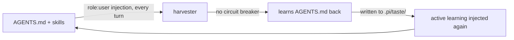

# session-derived-taste-learning — Can pi Learn My Taste From My Own Sessions?

Research dossier. Explore-mode output. No OpenSpec change, no implementation. Pickup-ready.

## Framing

Subject: evaluate adapting CommandCode ([github.com/CommandCodeAI/command-code](https://github.com/CommandCodeAI/command-code)) "taste" methodology to pi-agent-dashboard — learn user coding taste automatically from own session history.

User constraints, stated up front:
- Target = MY taste, not agent failure modes.
- MUST be automatic. No human ratification.
- Taste shared at repo level.

**VERDICT: DO NOT BUILD.** Corpus lacks the signal the method captures.

## What CommandCode ships — two separable layers

Layer 2 `taste-1`:
- Hosted, closed, meta neuro-symbolic RL model.
- `output = LLM(prompt | taste(user))`.
- Trains on edits/accepts/rejects as reward signal.
- NOT adaptable.

Layer 1 — the ARTIFACT:
- Plain markdown.
- `.commandcode/taste/<pkg>/taste.md` (project) + `~/.commandcode/taste/` (global).
- "Learnings" each carry confidence ∈ [0,1].
- Packaged by category.
- `npx taste lint` validates: confidence range 0..1, required headers, UTF-8.
- `npx taste push/pull <ns>/<pkg>` registry. Merge-by-confidence default. `--overwrite` replaces.
- `npx taste list` shows "cli (8 learnings, updated 2 days ago)".
- `cmd learn-taste` mines taste from repos.
- FULLY adaptable — schema + lifecycle only.

Rules-vs-taste claim table:

| | Rules | Taste |
|---|---|---|
| Source | written down | continuously learned |
| Updates | when you remember | every session |
| Granularity | broad | micro-decisions |
| Trajectory | decays | compounds |

Marketing claim "10x faster coding, 2x faster reviews, 5x fewer bugs" — unverified.

- $5M seed. Launch post `https://commandcode.ai/launch`. Docs `https://commandcode.ai/docs/taste`.

## pi already owns both halves, unwired

Deterministic signal extractor:
- `packages/authoring-toolkit/.pi/skills/session-to-guideline/` + `scripts/extract_session.ts`.
- Parses session JSONL active branch (leaf→root via `parentId`).
- Emits facts sheet: prompts in order, tool usage, files written/edited, searches, skills/memories created, failed commands, cost.
- Own doctrine already names the signal: "Prompt 1 = the goal; prompts 2..N = steering (corrections, scope additions, quality bars)".
- Runs only on human request.
- Output = prose in `Prompt stories/<YYYY>/W<WW>/`. Never read at inference time.

Taste store:
- `~/.pi/agent/pi-hermes-memory/` — `MEMORY.md`, `USER.md`, `failures.md`, `sessions.db`, project stores, `skills/`.
- Categories ALREADY the taste vocabulary: failure / correction / insight / preference / convention / tool-quirk.
- Append-only, agent-judgment write, no score, no decay.

Decay problem already empirical:
- Skill `consolidate-pi-memory-store` exists = "when at capacity, without destroying entries".
- Symptom of append-only store with no scoring function.

## Signal inventory — dashboard sees more than a CLI

| Signal | CC CLI | pi dashboard |
|---|---|---|
| mid-run corrective prompt | ✅ | ✅ |
| ABORT during run | ❌ | ✅ — dashboard owns abort API |
| human edits file agent just wrote | ⚠️ | ✅ |
| git revert of agent commit | ❌ | ✅ |
| CodeRabbit thread human sided with | ❌ | ✅ — skill `work-coderabbit-review-loop` already triages fix/dispute/defer = hand-labelled preference pairs, discarded every PR |
| red→green test loop | ✅ | ✅ |
| tool error→retry | ✅ | ✅ |
| silence / merged as-is | ⚠️ | ⚠️ WEAK |

CC CLI cells marked ⚠️ unverified — not measured on host.

## Measurements — corpus

Corpus = `~/.pi/agent/sessions/--Users-robson-Project-pi-agent-dashboard*--/*.jsonl`, incl. worktree-encoded dirs.

- 2536 sessions. 8647 raw user-role prompts. 100% of sessions carry a `parentId` pointer.
- Abort signal VERIFIED durable: `message.message.stopReason === "aborted"`. 201 events = 7.9% of sessions.
- Other stopReasons: `"toolUse"` ~4872, `"stop"` ~229, `rawStopReason` `"tool_use"` / `"tool_calls"` / `"end_turn"`.
- `message.message.details.cancelled` = separate (dialog cancels).
- `AbortLatch` (`packages/extension/src/abort-latch.ts`) runtime-only, NOT persistence. Durability comes from JSONL `stopReason`.

## Three falsified claims — documented as corrections

### Contamination — 26%

In pi JSONL, skills + project instructions + system reminders ALL arrive as `role: "user"`.

- Measured: 9475 role:user messages → 6985 real human prompts, 2490 injected machinery = 26%.
- "worktree…parent" probe specifically: 199 matches → 16 real prompts (<400 ch), 183 injected skill bodies = 92% fake.
- Injected heads look like `<skill name="ship-it" location="/Users/robson/Project/pi-agent-dashboard/.worktrees/os-fix-popover-horizontal-flip/.pi/skills/ship-it/SKILL.md">`.
- Median match length 9949 ch, p90 14544, max 92152.
- CONSEQUENCE: naive harvester learns `AGENTS.md` + `ship-it/SKILL.md` back to itself.
- Ouroboros: `AGENTS.md` → injected as user turn → harvested as taste → written to `.pi/taste/` → injected again. Automatic mode = no circuit breaker.

### Fork inflation — distinct-session count invalid

Forking/resuming replays the same prompt into N files.

| Cluster | Files | Distinct days | Ratio |
|---|---|---|---|
| "restart running clients?" | 17 | 2 | ~8.5× |
| "no fork icon in chat window" | 13 | 2 | ~6.5× |
| "no jj, commit and push" | 3 (7 mentions) | 1 | ~7× |
| worktree→parent openspec | 153 | 38 | ~4× |

Inflation up to ~8×. Confidence metric MUST be distinct DAYS, not sessions.

### Abort rating demoted ★★★★★ → ★★

- 190 of 518 first-pass candidates were post-abort prompts.
- Dominant post-abort prompt is literally `go on`.
- In this workflow abort = "spinning / rate-limited / stuck" — LIVENESS signal, not preference/reject signal.

## The worktree-openspec case — already solved, mechanism BEFORE prose

Timeline (git-verified):

- `2026-06-05` commit `351d33737` "feat: project-declared worktree-init hook (#74)" → `worktreeInit` lands in `.pi/settings.json`. Gate `test ! -e node_modules/.modules.yaml || test ! -d .pi/skills/openspec-explore || test ! -f .pi/dashboard/kb/index.db`; run `pnpm install && pnpm exec openspec init --tools pi --force && ... npx kb index`.
- `2026-06-19` commit `41ab03185` → AGENTS.md prose rule lands: "In a worktree, resolve OpenSpec skills from the main repo root, not the checkout." (currently AGENTS.md line 136). MECHANISM CAME FIRST, prose second.
- Real corrections by month: May 1, Jun 12 (5 days), Jul 3 (2 days), Aug 0. SOLVED.
- Root cause: `.pi/.gitignore` line 2 = `skills/openspec-*/**`. 9 openspec-* skills on disk, only 2 tracked → generated not tracked → absent in fresh worktree. `worktreeInit` regenerates.

NOTE: an earlier draft of this research asserted "190 corrections over 38 days proves enforcement beats prose". That figure was 92% injection artifact. The enforcement-beats-prose thesis is therefore UNPROVEN by this data.

## TRUE taste inventory — after filtering

Pipeline yield: 6985 real prompts → 323 corrective candidates → 18 clusters spanning ≥2 distinct days → ~5 genuine learnings.

TIER 1 — genuine, durable, undocumented, STILL LIVE:

- dev-server hygiene. ~20 distinct days combined, Jun→Aug 26:
  - "stop vite" — 9 days / 14 hits
  - "stop it and commit" — 6 days / 7 hits
  - "stop the frontend dev server" / "stop mockup server" — 5 days / 5 hits
  - "stop mockup server, seems good" — 2 days
  - Learning = "agent leaves dev servers running; kill before finishing". Absent from AGENTS.md and every skill. TOP REAL SIGNAL.
- "no. merge it and delete branch, worktree" — 2026-05-31 → 2026-08-09. Spans months = durable.
- "dont use jj. Please move to git worktree" — 2026-05-28/29 only. Stale, likely resolved.
- "Why npm is used instead of pnpm?" — 2026-07-13, 2026-07-21. AGENTS.md already says "pnpm ONLY". Small real enforcement gap.

TIER 2 — regex-identical but NOT taste (must be excluded):

| Phrase | Days/hits | True class |
|---|---|---|
| "I don't see proposal in openspec list" | 5 days | BUG REPORT |
| "No client build found. Run `npm run build` first." | 3 days | DEFECT |
| "still crashing, no log" | 2 days | DEFECT |
| "I dont see any icon for fork in chatr window" | 13 hits / 2 days | FEATURE REQUEST |
| "wrong propmpt" | — | operator noise |
| "no, its ok" | — | an ACCEPT wearing reject clothing |

Polarity NOT recoverable by cue-matching: "no, its ok" and "no. merge it" open identically, mean opposite.

## Harvest gates the data requires

| Gate | Measured justification |
|---|---|
| strip injected machinery | 26% of role:user not human |
| confidence = distinct DAYS | forks inflate ≤8× |
| short prompts only <400 ch (ideally <160) | taste is terse; long = task or injection |
| LLM classify, not regex | taste vs bug-report vs noise vs accept |
| abort = liveness, not reject | post-abort prompt usually "go on" |

## VERDICT — DO NOT BUILD

- CommandCode taste = CODE STYLE: naming, helper extraction, module structure, tool choice. Measured: user corpus contains ~ZERO style corrections across 6985 prompts. Every recurring correction is WORKFLOW: git-not-jj, stop dev servers, rebase to develop, merge+delete worktree, pnpm-not-npm, openspec resolution.
- Cause: user does not review agent code in chat; reviews at PR level via CodeRabbit. Style signal never enters the transcript. Transcript signal is workflow-shaped.
- Decision matrix:

| | taste-learning fits | this corpus |
|---|---|---|
| preferences | FUZZY | CRISP |
| enforceability | UNENFORCEABLE | ENFORCEABLE |
| frequency | high | low (~5/quarter) |

Wrong tool.

- Injection economics kill it: active learning injected every turn of every session forever, to prevent ~5 corrections/quarter. Root AGENTS.md already trimmed ~58% in commit `fa2558186` — a taste store is a bloat generator.

### Recommended instead

1. Dev-server hygiene as a MECHANISM — session-end kill of spawned servers. Highest value, most mechanizable.
2. Keep the harvest as a periodic read-only report, not a subsystem. Same ~5 learnings/quarter. Zero ouroboros risk. Zero per-turn cost.
3. Nothing else. No `.pi/taste/`, no confidence decay, no promotion thresholds, no injection loop.

### Future spike — different investigation

Real code-taste signal lives in git, not sessions:
- agent-writes-file → human-edits-within-Δ (true edit-after-accept)
- agent commit vs user commit style delta
- CodeRabbit finding FIXED vs DISPUTED = hand-labelled preference pairs

WOULD FLIP THE VERDICT: evidence that user corrects code style by silently editing files instead of prompting. Then transcript = wrong sensor; git spike becomes the real project.

## Reproduce

Spike was read-only. Artifacts written to `/tmp/taste-spike/{signals.json,signals.md,themes.json}` — EPHEMERAL, /tmp, not preserved. 518 first-pass candidates, 517 lines in `signals.md`.

Method, re-runnable:

1. Walk `~/.pi/agent/sessions/*pi-agent-dashboard*/*.jsonl`.
2. Per line `JSON.parse`. Take `o.message?.message ?? o.message`. Keep `m.role === "user"`.
3. Extract text from string content or `content[].type === "text"`.
4. REJECT when text matches `/^<(skill|project_instructions|available_skills|system-reminder|memory-policy|user)\b/` OR `length > 400`.
5. Corrective candidate when prompt index > 1 AND cue regex `/\b(no|nope|don'?t|do not|never|instead|actually|wrong|revert|undo|stop|not that|no need|i said|should ?n[o']t|must not|rather|prefer|always|forget)\b/i` matches first 140 ch.
6. Cluster by Jaccard ≥ 0.34 over stopword-stripped token sets.
7. Rank clusters by COUNT OF DISTINCT `o.timestamp.slice(0,10)` DAYS.

## Sources

- CommandCode: `https://github.com/CommandCodeAI/command-code`, `https://commandcode.ai/launch`, `https://commandcode.ai/docs/taste`.
- Extractor: `packages/authoring-toolkit/.pi/skills/session-to-guideline/`, `scripts/extract_session.ts`.
- Abort: `packages/extension/src/abort-latch.ts`.
- Memory store: `~/.pi/agent/pi-hermes-memory/`.
- Corpus: `~/.pi/agent/sessions/--Users-robson-Project-pi-agent-dashboard*--/*.jsonl` — 2536 sessions.
- Spike artifacts: `/tmp/taste-spike/` (ephemeral).
