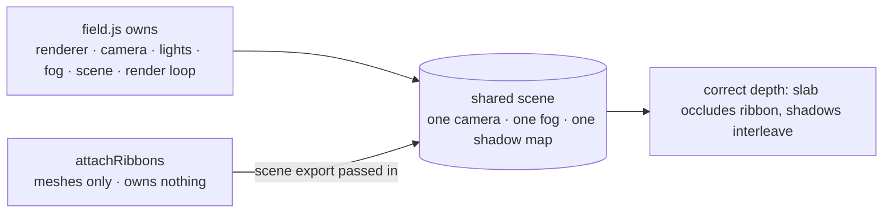

# Site 3D background field — ribbon candidate vs shipping fleet

Research record. Landing-page 3D background. Two variants: shipping "session fleet" (lit slabs) vs candidate "ribbon" (swept extrusions). Ribbon = candidate, NOT shipped. `site/index.html` still loads fleet only. Also records practices proven during the session: house lighting rig, lab discipline, verification method, concurrent-session hazard, deleted-work recovery, scroll-reveal a11y trap.

- Status: RESEARCH. Ribbon = candidate. NOT shipped.
- `scene` export in `site/field.js` = REVERTED. Concurrent session rewrote + committed `site/field.js`. Export gone.
- `site/design-scratch/field-lab.html` = REVERTED to `import { initField }`. 3-way variant switch (fleet/ribbon/both) gone.
- Surviving artifact: `site/design-scratch/field-ribbon.js`. Untracked. Parses. Exports `attachRibbons`, `initRibbon`.
- `?field=ribbon` and `?field=both` currently NOT wired. All lab modes fall through to fleet.
- Re-wiring needs 2 edits: add `scene,` to the object returned by `initField()` in `site/field.js`; restore variant switch in `field-lab.html`.
- Site base commits: `c52745af0` (Astro → static) + `e305c361b` (glass bands over field). See `docs/research/marketing-site-static-rewrite.md`.
- Ribbon has NO commit. `design-scratch/` gitignored; source deleted before promote, recovered from session transcript (see below).

## Finding 1 — flat shader quad can never read 3D

- v1 ribbon = one full-screen `ShaderMaterial` quad. Arcs from distance/angle maths.
- No geometry → nothing to light → reads as wallpaper beside lit fleet.
- Rule: background needs REAL geometry under the house lights, not painted shading.

## Finding 2 — swept extrusion makes ribbons

- `ExtrudeGeometry` accepts `extrudePath`.
- Rounded-rect cross-section swept along `CatmullRomCurve3` arc = ribbon with thickness + rounded long edges.
- three.js builds Frenet frames along the path → curve bowing in Z twists cross-section for free.
- Twist makes surface read dimensional, not a curved cut-out.

## Finding 3 — anti-slop rule refined

- Ramp PAINTED into material = slop. Ramp CAST by light across real geometry = lit object.
- 3D lighting does NOT violate the no-gradient rule.
- Still forbidden: gradient maps, glow spill, magenta/violet.
- One flat colour per ribbon. Product accent on exactly one.

## Finding 4 — perspective needs lean AND Z-stagger

- Coplanar arcs square-on to camera → every ribbon meets lens at same angle → real depth invisible.
- Fix: tilt group two axes `rotation.set(-0.30, 0.36, 0)` PLUS per-ribbon `position.z` stagger, DEPTH 22.
- Foreshortening sells depth; thickness alone does not when pieces equidistant.

### F4-trap — lean and origin are ONE variable

- First lean 0.62 rad swung arcs off-frame. Left sliver at right edge.
- Retuned together. Second attempt put accent ribbon through headline.
- Origin moved to (26,-25,-6).

## Finding 5 — combine = one scene, not two canvases

- `initField` returned `{set,get,stats}` only. `attachRibbons(scene, opts)` needs `scene` exported from `initField`.
- Enabling edit (the `scene` line) no longer exists in tree — reverted by concurrent session. Measured result stands; wiring reverted.
- `attachRibbons(scene, opts)` adds meshes to a scene it does NOT own — no lights, no fog, no renderer of its own.
- Two stacked canvases rejected: costs a second shadow pass AND cannot interleave — slab could never occlude ribbon, neither could shadow the other.
- Shared scene = one camera, one fog, one shadow map, correct depth.

- Combined loop is transform-only and never renders; `field.js` owns the render pass.
- A second `render()` would double-draw and halve rate.
- Combined mode quieter: count 7, alpha 0.42. Two backgrounds at full strength = noise.

## Finding 6 — measured cost, and the 8 fps recovery

- Measured 1440x900, dpr cap 1.75: fleet 54 fps, ribbon alone 52 fps, both 48 fps.
- First perspective build 44 fps.
- Two fixes recovered 8 fps:
  - extrude steps 96 → 64 (indistinguishable at background scale; shadow pass redraws every mesh again)
  - `castShadow` only for i < 5 (far ribbon shadow lands on nothing resolvable — buys a draw, returns no depth cue)
- Shadow camera in `field.js`: ±46, far 140. Keep ribbon max radius under ~44 or far shadows clip.
- Ramp: S_MIN 0.34 + spread*1.55 with R0 26 → max ~41.

## Finding 7 — background must be capped, not trusted

- Hero type sits directly over field in lab (page interposes glass bands, lab does not).
- Hard opacity ceiling: A_MAX 0.58 standalone, 0.42 combined.
- First 3D build = fat opaque pipes through headline. Caught in screenshot before delivery.

## House lighting rig — verbatim reuse contract

Any candidate MUST reuse this rig verbatim; else comparison invalid — differences read as exposure, not design. Values match `design-scratch/field-ribbon.js` standalone.

- `WebGLRenderer`: antialias true, alpha true, powerPreference `high-performance`
- `outputColorSpace` SRGBColorSpace; `toneMapping` ACESFilmicToneMapping; `shadowMap` enabled, PCFSoftShadowMap
- `PerspectiveCamera(30, aspect, 1, 260)`, z 62; z 78 when aspect < 0.95
- Fog as depth cue. dark `0x0a0a0a` near 46 far 132. light fog `0xffffff`
- Key `DirectionalLight(0xffffff, 3.4)` at (-26,34,30). castShadow. mapSize 1024. bias -0.0012. radius 4
- Fill `HemisphereLight(0xdfe8ff, 0x0b0d12, 0.5)`. Hemisphere NOT ambient — flat ambient makes untextured geometry read as cheap render
- Rim `DirectionalLight(0x9dc0ff, 1.3)` at (34,-16,-22)
- `MeshStandardMaterial` roughness 0.68 (accent 0.5), metalness 0, zero maps
- Exposure dark 1.05, light 1.15. `setPixelRatio` cap 1.75
- Shipping fleet palette sits lower (exposure 0.95/1.12, fog far 122) — same rig family, tuned differently.

### Palette drift caught in review

- First `field-ribbon.js` standalone rig drifted from `site/field.js`: exposure 1.05/1.15 vs 0.95/1.12; fog far 132 vs 122; light-theme key 3.4 vs 2.6; light-theme fill intensity 0.5 vs 1.15.
- `field.js` RE-LIGHTS per theme. Light theme = weaker key, stronger warmer fill, different fill/rim colours.
- Drift meant standalone ribbon vs fleet differed in EXPOSURE. Any comparison judged exposure, not design — the exact failure the rig rule exists to prevent.
- Fixed: `PAL` in `field-ribbon.js` copied field-for-field from `field.js` `PAL`; `syncTheme()` now re-lights key/fill/rim per theme, not just exposure + fog.
- Caught by doc review cross-checking numbers against source, not by looking at the render.

## Verification methods — prove, do not claim

- Animation proof: two agent-browser screenshots 2.5s apart, `magick compare -metric AE`. Got 33% pixels moved. A still gives ~0.
- 3D proof: luminance profile ACROSS one ribbon. Four plateaus — 244 lit top face, 237 main face, 217 shaded flank, 222 edge catching key. 113 distinct levels in 120px slice. Flat fill = one constant value.
- Occlusion proof: combined mode, accent slab occludes ribbon behind it → shared depth buffer. Impossible with stacked canvases.
- Regression proof: after editing shipping `field.js`, re-check fleet-only mode (54 fps, 39 slabs, original slider labels).

## Lab conventions

- Lab loads the SAME module the page loads. A lab running a copy proves nothing.
- Lab modes by query param: none = fleet, `?field=ribbon`, `?field=both`. Button cycles fleet → ribbon → both.
- Variants switch by reload (query param), not hot-swap. `field.js` has no `destroy()`. Hand-tearing-down a WebGL context risks comparing two backgrounds while leaking the first one's loop.
- Identical API across variants so the same sliders drive either → like-for-like comparison. `init(canvas)` → `{set(key,value), stats()}`. Keys `count|speed|twirl|spread|fog|paused`. `stats()` → `{fps,slabs,mood,spin}`.
- Relabel sliders per variant (ribbon: Density/Drift/Trail/Band/Edge). A lab captioned for the other build is worse than no captions.

## Concurrent-session hazard (shared working tree)

Two confirmed occurrences.

- Occurrence 1: another pi session replaced an inline hero canvas mid-work. Files newer than own last edit.
- Detect: compare file mtime to now; poll `GET /api/sessions` for other sessions in same cwd with status streaming.
- Gate: require status != streaming AND file mtimes stable ≥ 40s before editing.
- Waiting was correct. That session then grew `site/index.html` 26.8KB → 41.9KB and added whole sections. Editing early would have clobbered.
- Occurrence 2: `site/field.js` + `field-lab.html` edits overwritten and committed by other session. Detected only on re-verification, ~1 day later.
- Lesson: mtime + `GET /api/sessions` streaming check gates the START of an edit. Gate does NOT protect an edit already landed. A shared-tree edit is durable only once committed.
- Practical rule: land work in a file the other session does not own (here `field-ribbon.js` survived because only this session knew it), or commit promptly.

## Recovering deleted uncommitted work

- `design-scratch/` was gitignored. No commit ever held the ribbon source. Deleted before the promote commit.
- Recovered exact source from session history via `recall` drill-down `#<entry>:<path>:full` on an `[edit]` entry.
- Lesson: gitignored scratch recoverable only from session transcript.

## Scroll-reveal a11y trap (site/index.html)

- Page carries global `@media(prefers-reduced-motion:reduce){*{transition:none!important}}`.
- Static `[data-reveal]{opacity:0}` + killed transition = content permanently invisible. Same failure if JS fails or `IntersectionObserver` missing.
- Fix: apply hidden state from JS only, never static CSS. Skip entirely under reduced motion. Content visible in every failure path.
- One-shot: `unobserve` on fire so a block can never retrace on scroll-up.
- Stagger within parent group (0/70/140ms, capped) so a grid ripples without the page accumulating delay.
- Tag elements from JS by selector list, not hand-marked markup. Survives blocks being added or reordered.

## Status

- Ribbon is a CANDIDATE. Not shipped. `site/index.html` still loads fleet only.
- `scene` export in `site/field.js` = REVERTED by concurrent session. No production edit shipped.

## Sources

- Repo: `site/field.js`, `site/design-scratch/field-lab.html`, `site/design-scratch/field-ribbon.js`, `site/index.html`.
- Base commits `c52745af0`, `e305c361b` (2026-08-27, static rewrite + glass bands).
- Measurements: agent-browser screenshot pairs + `magick compare -metric AE`; luminance slice profile; fps via lab `stats()`; concurrent session poll via `GET /api/sessions`.
