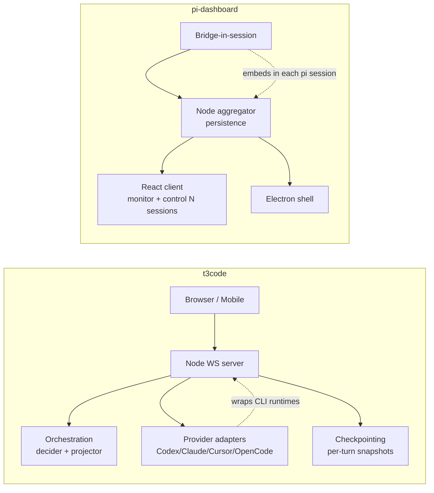
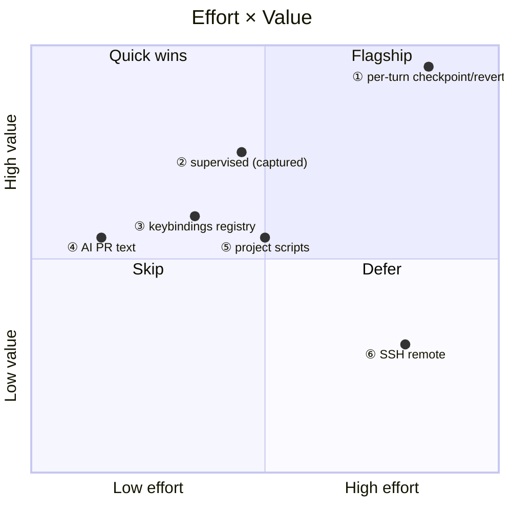

# t3code (T3 Code) → pi-dashboard: Feature Adaptation Report

Research artifact. Explore-mode output. Source: https://github.com/pingdotgg/t3code (docs/ tree fetched 2026-07-16). Pickup-ready. Feature ② (supervised mode) already captured as OpenSpec change `openspec/changes/add-supervised-tool-approval/` (proposal + design + spike + spec, validated).

## Framing

t3code = minimal multi-provider web GUI wrapping agent CLIs (Codex, Claude, Cursor, OpenCode). Node WebSocket server wraps `codex app-server` (JSON-RPC over stdio), serves React+Vite app, opens browser on start. Electron shell spawns desktop-scoped backend. Builds on bun + Vite+ (`vp`).

Structural inversion vs pi-dashboard:
- t3code = ONE server owns N agent runtimes via provider adapters.
- pi-dashboard = bridge extension INSIDE every pi session forwards events to Node aggregator; React client monitors/controls many sessions; Electron shell; Docker all-in-one (code-server + zrok + tmux).

Different ownership model colors every adaptation. t3code owns the runtime; pi-dashboard observes runtimes it does not own.

## t3code full inventory (comprehensive, not only the 6 picked)

### Architecture

- Orchestration engine, event-sourced: `decider.ts` + `projector.ts`. Commands (`thread.create`, `thread.turn.start`, `thread.checkpoint.revert`) validated in `commandInvariants.ts` → events → projection snapshot (`ProjectionSnapshotQuery.ts`). Snapshot holds projects, threads, messages, activities, checkpoints, session state. Supporting: `ProjectionPipeline.ts`, `ProviderCommandReactor.ts`, `RuntimeReceiptBus.ts`, `OrchestrationEngine.ts`.
- Provider runtime: `ProviderService.ts` (session lifecycle), `ProviderAdapter.ts`, `CodexAdapter.ts`. Assistant text delivery: `streaming` (incremental) vs `buffered` (completed result).
- Provider protocol: WS JSON-RPC. request/response `{id,method,params}` → `{id,result|error}`. Push events = typed envelopes with `channel` + `sequence` (monotonic per connection) + channel data. Push channels include `server.welcome`, `server.configUpdated`.
- Connection runtime: shared web+mobile, mounted once at app root. Owns connectivity, auth, retries, transport lifetime, cached env data, env-scoped ops. Each registered environment = one scoped owner. Reconnect first-class.

### Concepts

- Project: `workspaceRoot`, title, threads.
- Workspace: root path; base for branches + optional worktrees.
- Thread + timeline: messages + activities.
- Activity: approvals, tool actions, failures.
- Session: live provider-backed runtime.
- Mode: `approval-required` vs `full-access`.

### Runtime modes

- Full access (default): `approvalPolicy: never`, `sandboxMode: danger-full-access`.
- Supervised: `approvalPolicy: on-request`, `sandboxMode: workspace-write`, in-app approve prompts.

### Checkpointing

- `CheckpointStore.ts`, `CheckpointDiffQuery.ts`, `CheckpointReactor.ts`. Captures workspace state over time. Diffs turns. Restores earlier points via `thread.checkpoint.revert`.

### Thread/env commands + keybindings

Config `~/.t3/keybindings.json`, JSON array `{key,command,when}`. when-contexts `terminalFocus` / `previewFocus` / `!terminalFocus`. Defaults from `DEFAULT_KEYBINDINGS` in `apps/server/src/keybindings.ts`.

- `terminal.toggle/split/new/close` — terminal drawer.
- `preview.toggle/refresh/focusUrl/zoomIn/zoomOut/resetZoom` — in-app browser preview panel; desktop-only.
- `commandPalette.toggle`.
- `chat.new` — new thread preserving branch/worktree state.
- `chat.newLocal` — new environment; local/worktree per app settings.
- `editor.openFavorite` — open project/worktree in last-used external editor.
- `script.{id}.run` — run project script by id (e.g. `script.test.run`).

### SCM integrations

- GitHub, GitLab, Bitbucket, Azure DevOps.
- Push branch + create PR/MR from Git panel.
- AI-suggested titles/descriptions from commits.
- Repo creation, clone integration, hosted clones.

### Remote (architecture)

- First-class remote environments over SSH bridge + forwarded ports.
- Explicit remote bootstrap. Reconnect first-class. Runtime ownership stays on remote host.
- Connection UX in client shell. SSH auth failure surfaces before env saved. Remote launch failure includes remote logs.
- Expose desktop-hosted env to mobile. Temporary remote access without router/firewall changes.

### Remote access (user)

- Connect from phone/tablet/other desktop. Recommends tailnet (stable address, transport security at network layer, less exposure than opening server).

### Cloud + Mobile

- Cloud: t3 connect, Clerk auth, environment-auth.
- Mobile: connection runtime shared web+mobile; mobile app target.

### t3code roadmap TODO (docs/project/todo.md)

- Submit scrolls to bottom.
- Only last 10 threads/project.
- Thread archiving.
- New projects on top; projects sorted by latest thread update.
- QUEUEING MESSAGES — pi-dashboard already ships this via `mid-turn-prompt-queue` spec.

## pi-dashboard reality (verified via kb_search + source)

- Monorepo under `packages/`: client=`packages/client`, server=`packages/server`, bridge=`packages/extension`, shared=`packages/shared`.
- `turn_start`/`turn_end` first-class in `packages/client/src/lib/event-reducer.ts` (+ ChatView, QueuePanel). Bridge enriches `turn_end` with contextUsage.
- PromptBus interactive UI mature: `packages/extension/src/prompt-bus.ts`, client hooks `useMessageHandler.ts`, `interactive-renderers/`, `prompt_request`→`prompt_response` round-trip. Powers `ask_user`, `multiselect`, `update_roles` (`role-model-tools.ts:208` calls `ctx.ui.confirm`).
- Terminal: xterm.js + node-pty; inline terminals; reattach on reload (`terminal-emulator`, `inline-terminal` specs).
- In-app preview: `live-server-preview` spec (loopback-only + SSRF guard + origin-isolated sandbox).
- Command surface: `packages/client/src/components/CommandInput.tsx` + `App.tsx` `BUILTIN_SLASH_COMMANDS`. Chat slash-commands only. NO global keybinding registry. NO user-configurable web keybindings. Plan captured `docs/plans/command-palette-future.md`.
- Git: worktrees + branches; PR create via `gh pr create` (GitHub-only); worktree-from-PR (`git-operations-api`, `worktree-lifecycle` specs); hosting links GitHub/GitLab/Gitea (`git-context` spec).
- `mid-turn-prompt-queue` spec (message queueing — t3code TODO).
- `qr-device-pairing` spec; `add-capacitor-mobile-shell` change (mobile shell in progress).
- 4-theme system (studio/earth/athlete/gradient). Flows + goal-authoring + automation board. pi-native skills/memory ecosystem. Docker all-in-one (code-server + zrok + tmux).
- Remote today: Electron wizard "remote" mode + Docker + zrok tunnel + tailnet docs.
- `remove-external-editor-integration` change ACTIVE = pi-dashboard moving AWAY from external-editor open. Opposite of t3code `editor.openFavorite`. Divergence.
- pi identity: pi-native by design. pi has NO built-in permission popups (pi README:495) and NO built-in sandbox (pi docs/security.md:31). Real isolation = container.

## 🟥 t3code has, pi-dashboard lacks or lighter (adaptation candidates)

| # | t3code feature | What it does | pi-dashboard status | Vector | Effort |
|---|---|---|---|---|---|
| ① | Per-turn checkpointing + time-travel revert (`thread.checkpoint.revert`) | Captures workspace state per turn, diffs turns, restores earlier point | Biggest gap. Has worktrees, no per-turn snapshot. Adaptation = shadow git ref per turn on `turn_end` in bridge; diff = `git diff`; revert = `git restore` | bridge-ext + server | HIGH value / DEEP |
| ② | Supervised mode + inline approve/deny | `approvalPolicy: on-request`, in-app approve prompts | ALREADY CAPTURED `add-supervised-tool-approval`. Mechanism: pi `tool_call` hook blocks (`{block:true}`) + `ctx.ui.confirm` over PromptBus. Scope = approval-gating only (no in-process sandbox; container for isolation) | bridge-ext + UI | MEDIUM, unblocked |
| ③ | User-configurable keybindings (JSON `{key,command,when}`) | Global keybinding registry, when-contexts | Partial slash-commands, no global registry. Adaptation = command registry `{id,title,run,when}` + JSON config resolver in `packages/client` | UI | LOW-MEDIUM. Shares substrate with ⑤ |
| ④ | Multi-host SCM (GitLab/Bitbucket/Azure) + AI-suggested PR titles/descriptions | PR/MR from any host; AI text from commits | gh/GitHub-only PR create, no AI PR text. AI PR text = cheapest win (git log + diffstat → one model call → prefill, human edits) | server + UI | LOW |
| ⑤ | Project scripts as palette/keybound commands (`script.{id}.run`) | Run project scripts by id | Package-manager UI, not arbitrary scripts as commands. Read `package.json` scripts → command registry → spawn in inline terminal | UI + server | MEDIUM. Depends on ③ registry |
| ⑥ | First-class SSH remote environments | Attach to arbitrary SSH host, forwarded ports, no Docker | Docker+zrok+tailnet+Electron wizard (heavier, shipped). t3code lighter for ad-hoc | server | LOW fit (overlap) / HIGH. Defer |

## 🟦 Other t3code ideas pi-dashboard does not touch (beyond the 6)

| t3code idea | Note for pi-dashboard |
|---|---|
| Event-sourced orchestration core (decider/projector; command→event→projection snapshot) | Architectural pattern, not user feature. Reference if pi-dashboard state layer ever refactors |
| Push protocol, monotonic `sequence` per connection, ordered reconnection | Compare to pi-dashboard event replay |
| Streaming vs buffered assistant-text mode toggle | Delivery-mode option pi-dashboard lacks |
| Thread model (Project → Threads; `chat.new` preserves branch, `chat.newLocal` new env) | Contrast pi-dashboard session model |
| In-app preview zoom / `focusUrl` controls | pi-dashboard preview lighter |
| Cloud connect + Clerk hosted auth | pi-dashboard uses device-pairing / zrok instead |
| t3code minor UX TODOs (thread archiving, last-10-threads, project sort-by-latest) | Cheap UX polish ideas |
| `editor.openFavorite` | DIVERGENCE. pi-dashboard actively removing external-editor integration (`remove-external-editor-integration`) |

## 🟩 pi-dashboard has, t3code lacks (pi-dashboard edge, nothing to adapt)

- Mid-turn message queueing (`mid-turn-prompt-queue`) — t3code TODO.
- Flows + goal-authoring + automation board.
- 4-theme system (studio/earth/athlete/gradient).
- QR device pairing (`qr-device-pairing`).
- Docker all-in-one (code-server + zrok + tmux).
- pi-native skills/memory ecosystem.
- PromptBus multi-surface interactive (`ask_user`, `multiselect`, `update_roles`).

## 🟨 Parity (both have; steal polish not feature)

Terminal. In-app preview. Command palette. Worktrees/branches. PR create. Desktop app. Mobile ambitions. Remote access.

## ⬜ Not adaptable by design

Multi-provider CLI wrapping (Codex/Cursor/OpenCode) — pi-dashboard pi-native by identity. Chasing dilutes. Skip.

## Recommended shortlist

- Quick wins: ④ AI PR text (standalone, cheapest); ③ keybindings registry (unlocks ⑤) → ⑤ project scripts.
- Needs spike-then-build: ② supervised — already captured; spike done (pi `tool_call` block + `ctx.ui.confirm`; sandbox = container).
- Flagship: ① per-turn checkpoint/revert — own design doc; shadow-git-ref.
- Defer/skip: ⑥ SSH remote (overlaps Docker/zrok/tailnet); multi-provider (off-identity).

③ + ⑤ share one command-registry dependency: ⑤ project scripts register into the same `{id,title,run,when}` registry ③ builds. Build ③ first.

## Next steps (when picked up)

- ② already an OpenSpec change (`add-supervised-tool-approval`).
- ① flagship = draft own proposal (shadow-git-ref checkpoint store + diff + revert wired to `turn_end`).
- ③ + ⑤ = one command-registry proposal.
- ④ = small standalone proposal.
- Capture more via openspec-new-change.
