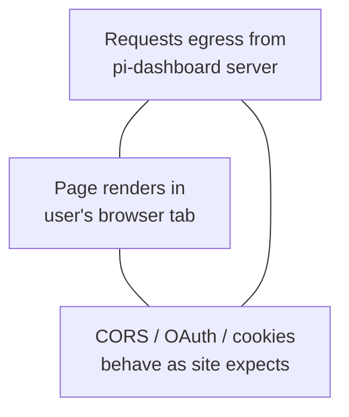
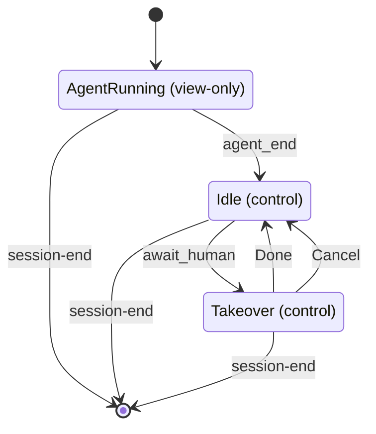
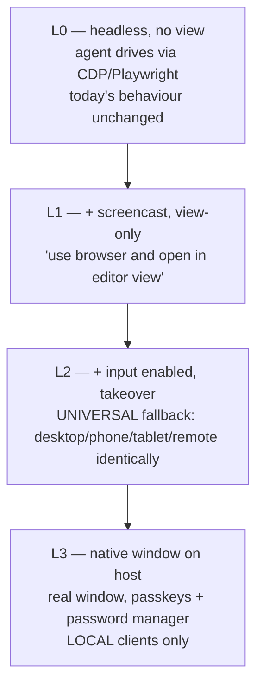
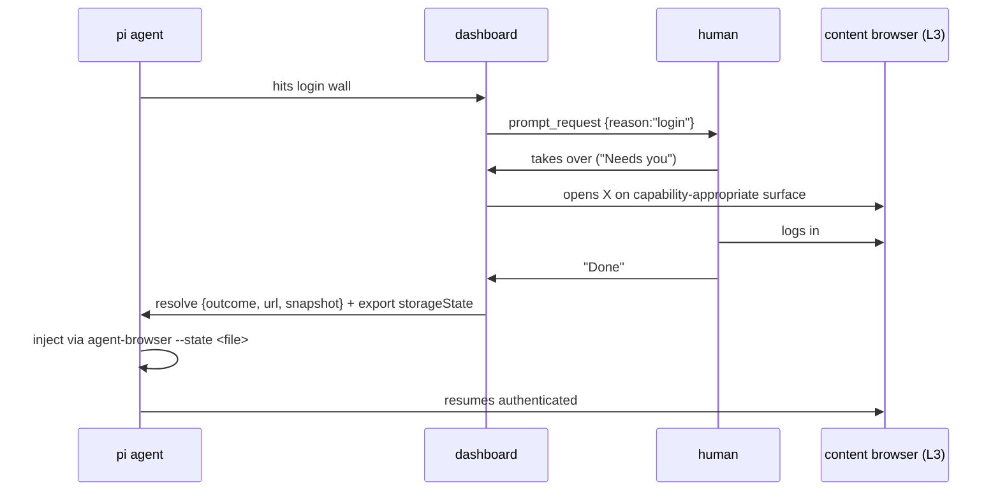
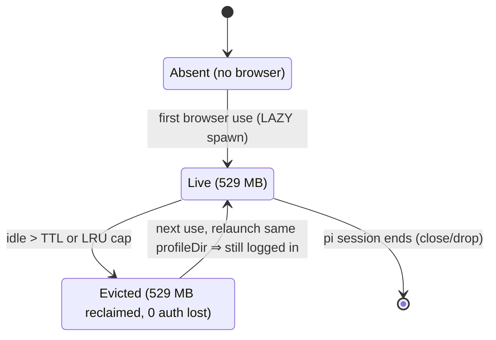

# user_browser — Remote Browser in the Editor View — Research Record

> Status: **explore-mode research record**. No OpenSpec change. No implementation.
> Investigates a `user_browser` tool: agent drives a browser, page renders in the
> dashboard's editor-pane content view. All findings below verified live or against
> fetched source, dated 2026-08-06. Spike left no repo changes.
> Mode: openspec-explore. Seeds a future proposal + design.md.

---

## 1. Goal

Feature idea: `user_browser` tool. Agent drives a browser. Page renders in dashboard
contentview editor tab.

Problem: headless browser hits login/OAuth page. User cannot authenticate.

Constraints stated by user:

- Browser-only deployment = HARD requirement. No Electron guarantee.
- Arbitrary third-party sites (GitHub, Jira, internal tools).
- Phone/tablet clients must work.
- Parity between local and remote dashboard UX.

## 2. The impossible trinity

Three legs cannot hold together IF page renders as real DOM at dashboard origin:

1. requests egress from pi-dashboard server
2. page renders in user's browser tab
3. CORS/OAuth/cookies behave as site expects

Reason, one line: whoever renders the document defines the origin; origin is what
CORS/OAuth/cookies enforce against.



**Escape hatch 1:** stop rendering at dashboard origin. Server's browser renders at
true origin. Ship pixels. Then CORS never arises.

**Escape hatch 2** (discovered later, see §7): HTTP proxy separates network-egress
identity from rendering origin. Breaks the trinity outright. Corporate-proxy model.

## 3. Option space evaluated

| Option | reqs from server | renders in user browser | CORS | OAuth redirects | passkeys | agent-drivable | browser-only | bandwidth | build cost | blast radius | verdict |
|---|---|---|---|---|---|---|---|---|---|---|---|
| A. Pixel streaming (CDP screencast) | yes | yes | n/a | yes | NO | yes | yes | 100–300 KB/s | medium | HIGH | RBI — **adopted** |
| B. Rewriting reverse proxy (MITM) | yes | yes | patched | NO | NO | yes | yes | high (DOM) | very high | extreme | REJECTED |
| C. Drive the user's own browser (extension / CDP into user Chrome / Electron WebContentsView) | no | yes (user's browser) | untouched | yes | YES | yes | no | n/a | medium | low | available as provider (see §13) |
| D. Skip browser for auth (RFC 8628 / loopback RFC 8252 / credential injection) | — | — | — | partial | — | — | — | — | — | — | REJECTED as general answer |
| E. DOM mirroring (rrweb / Menlo class) | yes | yes | patched | partial | NO | partial | yes | high (DOM) | multi-year | high | REJECTED |

**A. Pixel streaming (CDP screencast).** Server's browser renders at true origin.
Frames + input relayed. CORS never arises. Passkeys do NOT work (remote authenticator
bound to origin; see §7). Bandwidth measured, §5.

**B. Rewriting reverse proxy (Ultraviolet / Rammerhead / evilginx class) — REJECTED.**
OAuth `redirect_uri` allowlist refuses the proxied origin. Passkeys structurally
unproxyable — origin cryptographically bound into the assertion. Service workers, WASM,
dynamic `import()`, postMessage origin checks, SRI, `__Host-` cookies, `document.domain`
each need bespoke rewriting — infinite tail. Security posture = AiTM credential-
harvesting proxy.

**C. Drive the user's own browser.** Auth perfect, egress is user IP. Breaks the
browser-only requirement. Later reframed as one of several named-browser providers (§13).

**D. Skip browser for auth — REJECTED as general answer.** Device Authorization Grant
RFC 8628; loopback redirect RFC 8252; credential injection via
`Fetch.requestPaused` / `Network.setCookies`. Cannot require RFC 8628 from arbitrary
third-party sites.

**E. DOM mirroring (rrweb / Menlo class) — REJECTED.** Breaks on canvas/WebGL/video.
Inherits full rewriting tax. Multi-year surface.

Conclusion: browser-only + arbitrary sites ⇒ A by elimination.

## 4. Existing repo substrate found

| File | Relevance |
|---|---|
| `packages/server/src/live-server/live-server-proxy.ts` | Same-origin reverse proxy `/live/:id/*`. Mirrors deleted `editor-proxy` `/editor/:id/*`. Survives zrok single-port tunnel. Uses `@fastify/reply-from`. |
| `validateLiveTarget` (live-server-manager) | SSRF gate. Loopback-ONLY allowlist. NOTE: an RBI browser is the INVERSE policy — loopback-FORBIDDEN, `file:` forbidden, public internet intended. Two opposite SSRF policies in one codebase. Must be named so nobody "unifies" them. |
| live-server-preview spec D7 | `sandbox="allow-scripts"`. NO `allow-same-origin`. Opaque origin. |
| `packages/client/src/components/editor-pane/viewer-registry.tsx` + `UrlViewer.tsx` | Sentinel virtual paths `url:`, `live:`, `diff:`. A `rbi:<id>` viewer slots in. |
| `packages/server/src/pairing/browser-gateway.ts`, `terminal/terminal-gateway.ts`, `pi/pi-gateway.ts` | WS gateway patterns. terminal-gateway is the relay template. |
| `packages/electron/` | Enables the proxy-egress option (§7). |
| `packages/extension/.pi/skills/browser/` | agent-browser CLI skill. vendoredVersion 0.27.0. Knows `connectOverCDP`. |

## 5. SPIKE — agent-browser already ships the RBI transport (verified live, read-only)

Probe host: macOS. `agent-browser` at
`/Users/robson/.pi-dashboard/node/bin/agent-browser`. Chrome/149.0.7827.22.

Commands that exist:

```
get cdp-url        → ws://127.0.0.1:64604/devtools/browser/<uuid>
mouse move|down|up|wheel ; keyboard type|inserttext ; set viewport <w> <h>
cookies get|set (--curl, --domain, --httpOnly, --sameSite) ; storage local|session
record start <path> (WebM) ; inspect ; stream enable|disable|status [--port <n>]
connect <port|url>  ; tab [new|list|close|<n>] ; session ; session list
--headed ; --profile <name|path> ; --session <name> ; --session-name <name> ; --state <path>
--proxy <server> ; --proxy-bypass <hosts> ; --user-agent <ua> ; --args
dashboard [start|stop]  (observability dashboard, default port 4848)
```

`stream status` output shape:

```
Streaming enabled on ws://127.0.0.1:64603
Connected: true
Screencasting: false
```

Sending `{"type":"startScreencast"}` on that WS flipped `screencasting` false→true and
frames began. Frame payload = base64 JPEG (`/9j/4AAQ` magic). ~31 KB/frame at 1280x720.

**Reverse-engineered protocol.** Recovered from the Next.js dashboard bundle served on
:4848, chunk `90ec4543e77acccc.js`.

client → server:

```
{type:"input_mouse",    eventType:"mouseMoved|mousePressed|mouseReleased|mouseWheel",
                        x, y, button:"left|middle|right|none", clickCount, deltaX, deltaY, modifiers}
{type:"input_keyboard", eventType:"keyDown|keyUp",
                        key, code, text, windowsVirtualKeyCode, modifiers}
{type:"startScreencast"} | {type:"stopScreencast"}
```

modifiers bitmask: alt=1 ctrl=2 meta=4 shift=8 — CDP convention verbatim.

server → client: `status{connected,engine,recording,screencasting,viewportWidth,
viewportHeight}`, `tabs[{tabId,title,url,active,type}]`, `frame{data:<base64 jpeg>}`.

Their viewer is one element:

```
<canvas tabIndex={0} onMouseMove onMouseDown onMouseUp onWheel onContextMenu/>
+ window keydown/keyup CAPTURE listeners gated on document.activeElement===canvas
+ frame render: atob(data) → Uint8Array → bitmap → drawImage
```

`/api/sessions` on :4848 returns
`[{"engine":"chrome","port":64603,"session":"default"}]` — dashboard consumes the
STREAM port, not CDP.

**BANDWIDTH MEASUREMENT (the decisive number).** 10 s, idle `github.com/login`, zero
interaction:

```
duration=10.0s  frames=2  total=61KB
avg=6.1 KB/s    fps=0.20
first frame +0ms, last frame +0.0s
```

Both frames at t=0. Zero after. CDP screencast is CHANGE-DRIVEN, not a video stream.
Idle page costs ~0. Login forms are ~95% idle ⇒ viable on mobile data.

Also confirmed live:

- `/json/version` User-Agent contains `HeadlessChrome/149.0.0.0`.
- `/devtools/inspector.html` served locally (200).
- `/json/protocol` = 1.5 MB.
- `devtoolsFrontendUrl` =
  `https://chrome-devtools-frontend.appspot.com/serve_rev/@<rev>/inspector.html?ws=127.0.0.1:64604/devtools/page/<id>` —
  the `?ws=` accepts arbitrary host:port.

Spike left no repo changes. Dashboard on :4848 stopped after probing.

## 6. Three CDP topologies — A1 / A2 / A′

- **A1 = relay agent-browser's `stream` protocol.** Least work. RISK: undocumented
  internals, silent breakage on version bump.
- **A2 = server speaks CDP itself.** Exposes a narrow frame/input protocol to client.
  +2 days. Stable CDP 1.3. Server-side allowlist. Local ack. **RECOMMENDED.**
- **A′ = client speaks CDP directly.** Server = dumb WS tunnel. Can embed
  `inspector.html?ws=`. **REJECTED** for two reasons:

**Reason 1 — raw CDP passthrough = host RCE.**

| CDP call | effect |
|---|---|
| `Runtime.evaluate` | arbitrary JS at any origin |
| `Page.navigate` (file://) | read any file on host |
| `Browser.setDownloadBehavior` | arbitrary file WRITE on host |
| `Network.getAllCookies` | exfiltrate every session cookie |

Dashboard token is the only gate. Cannot allowlist AND keep the DevTools frontend —
it needs full protocol.

**Reason 2 — `Page.screencastFrameAck` gates the next frame.** Client-side CDP caps
fps at 1/RTT: 5 ms LAN ≈ 200 fps; 100 ms zrok ≈ **10 fps**; 300 ms mobile ≈ **3 fps**.
Server-side ack over loopback decouples.

Keep A′ only as a dev-flag debugging affordance.

**Hard rule: the RBI relay MUST NOT enable the `Runtime` domain.**
`Page.startScreencast` and `Input.dispatch*` do not require it ⇒ relay is
detection-neutral by construction.

Allowlist shape:

```
allow: Page.startScreencast | stopScreencast | screencastFrameAck
       Input.dispatchMouseEvent | dispatchKeyEvent | insertText
       Page.navigate (scheme guard: http/https only; no file:/chrome:/devtools:)
       Page.reload | navigateToHistoryEntry
       Emulation.setDeviceMetricsOverride
deny:  everything else by default
```

## 7. Proxy-egress option (Electron)

Electron `WebContentsView` + `session.fromPartition('persist:agent').setProxy({proxyRules})`.
Dashboard server runs an HTTP CONNECT proxy.

| axis | score |
|---|---|
| requests from server IP | YES |
| real DOM (not pixels) | YES |
| CORS untouched | YES |
| OAuth redirect_uri | YES |
| **passkeys** | **WORK** — real origin + local authenticator |
| TLS | end-to-end. Proxy sees only host:port. No MITM, no cert install. |
| bandwidth | no extra |
| native text selection/zoom/print/a11y | yes |

Only option where passkeys work AND egress is server-side.

Blocked by the browser-only hard requirement: a web page cannot set its own proxy.
Electron-only, or browser-extension-only via `chrome.proxy`.

`agent-browser --proxy` already exists — same trick available for the server-side
browser.

**CAVEAT.** An authenticated CONNECT proxy on the dashboard server is an open egress
relay guarded solely by the dashboard token. Needs host allowlist + rate limiting day
one.

## 8. Control model — lease REJECTED, blocking model adopted

**Finding 1: an enforced lease is unenforceable.** The agent drives via
`agent-browser …` through **Bash**. Never touches the relay. Cannot be gated at the
transport.

**Finding 2: no lease needed.** The agent yields by BLOCKING. While blocked it
dispatches nothing. Mutual exclusion is a consequence, not a mechanism.

Rule adopted (one derived boolean, zero new state):

> **Input enabled iff (a) a takeover prompt is pending, OR (b) the session is idle.**



Takeover rides the EXISTING `prompt_request` path, not a new channel. Inherits for
free:

- `trackPromptRequest()` → `pendingPromptRequests`
- `currentTool="ask_user"` → SessionCard ● "Needs you"
- `questionFirst` → card jumps to sidebar top
- `stampUnreadIfTriggered()` → unread dot
- `placement:"inline"` → inline card
- EditorTabs unread dot (change: `non-disruptive-file-open`)

Focus rule: do NOT steal focus. `auto-canvas` doctrine holds with no exception. Inline
prompt card = attention-getter. `rbi:` tab opens in BACKGROUND with unread dot. User's
own click moves focus.

Three mandatory details:

1. **Resolve must carry re-orientation state `{outcome, url, snapshot}`.** A bare
   boolean leaves the agent blind — re-clicking a login button that no longer exists.
2. **`declined` ≠ `done`**, or the agent loops re-asking.
3. **MUST go through `PromptBus`.** The in-flight change
   `split-notify-from-prompt-request` exists precisely because `bridge.ts:2317` sends
   `prompt_request` BYPASSING the bus — `prompt_dismiss` never fires, session shows
   "Needs you" forever. A takeover prompt that skips the bus reproduces that defect:
   permanently stuck "Needs you" when the tab closes, the login times out, or the
   session dies mid-handoff. **Single most concrete pitfall in the feature.**

Cut from the design:

- explicit lease acquire/release protocol
- "human grabs control mid-run"
- multi-viewer arbitration (broadcast frames, last-write-wins input)

## 9. reCAPTCHA

Answer: **v2 works mechanically. v3 / Turnstile / Enterprise have nothing to solve.**

- CDP `Input.dispatch*` injects at Blink level ⇒ events carry `isTrusted: true`. v2
  checkbox and image grid solve normally through the screencast. Human takeover IS the
  CAPTCHA feature — same `prompt_request`, `reason:"captcha"`. Zero extra machinery.
- reCAPTCHA v3 docs quote: "returns a score (1.0 is very likely a good interaction,
  0.0 is very likely a bot)… without user friction… default threshold 0.5." No
  challenge exists. Low score fails silently. Human-in-the-loop cannot rescue it.
- **Irony to record:** the requested property — egress from the dashboard server — is
  the single biggest CAPTCHA liability. Datacenter ASN reputation is a heavy v3 input.

| topology | fingerprint | IP reputation | outcome |
|---|---|---|---|
| server headless | headless | datacenter | worst |
| server headful + UA fix | decent | datacenter | v2 solvable, v3 marginal |
| proxy-egress Electron | real local browser | datacenter | MISMATCH may itself be a signal |
| drive user's own browser | real profile | residential | no challenges |

Detection surface (sources: patchright README, rebrowser-patches README):

- `navigator.webdriver` via `--enable-automation` → fix
  `--disable-blink-features=AutomationControlled` (agent-browser's own `--args` help
  example shows this flag)
- **`Runtime.enable` leak** = "the biggest patch" per patchright. Fix = isolated
  ExecutionContexts, never call `Runtime.enable`.
- UA string → `--user-agent` (currently leaks `HeadlessChrome/149.0.0.0`)
- `--disable-extensions` / `--disable-component-update` flag leaks
- headless rendering quirks → headful under Xvfb

Cheap day-one hygiene: `--user-agent`, `--disable-blink-features=AutomationControlled`,
headful under Xvfb in the docker image. All three already available as agent-browser
flags.

Accepted limitation to write into any future spec: some sites unreachable from a
server-egress browser.

## 10. GitHub landscape (stars/license/last-push verified 2026-08-06)

| repo | ★ | license | pushed | verdict |
|---|---|---|---|---|
| steel-dev/steel-browser | 7431 | Apache-2.0 | 2026-08-05 | CLOSEST ANALOGUE, best reference impl, license-clean |
| m1k1o/neko | 21877 | Apache-2.0 | 2026-08-05 | WebRTC virtual browser in docker; fallback if JPEG insufficient; multi-user control model is prior art |
| novnc/noVNC | 13908 | NOASSERTION | 2026-06-06 | only if Xvfb+VNC route |
| browserless/browserless | 13557 | NOASSERTION | 2026-08-04 | commercial/SSPL-ish, check before touching |
| ultrafunkamsterdam/undetected-chromedriver | 12791 | GPL-3.0 | 2025-07-05 | viral licence, unusable |
| daijro/camoufox | 10872 | MPL-2.0 | 2026-08-03 | Firefox-based, no CDP, incompatible |
| berstend/puppeteer-extra | 7391 | MIT | 2024-07-18 | ~2 yrs stale |
| Kaliiiiiiiiii-Vinyzu/patchright | 4024 | Apache-2.0 | 2026-08-05 | Playwright-based, not consumable; its patch list = hardening checklist |
| rebrowser/rebrowser-patches | 1410 | **NONE** | 2025-05-09 | UNLICENSED ⇒ legally unusable; read the blog, do not copy code |
| titaniumnetwork-dev/Ultraviolet | 812 | AGPL-3.0 | 2026-07-05 | the MITM approach already rejected |

Generic "remote browser isolation" search returns nothing credible (top hit 130★).
**No off-the-shelf RBI component exists to drop in.**

## 11. Resize — how neko and steel actually do it

**neko: YES, but heavyweight, global, admin-only.**
`websocket/handler/screen.go` `screenSet()` gate
`if !session.Profile().IsAdmin { return errors.New("is not the admin") }` →
`desktop.SetScreenSize()` → `xorg.ChangeScreenSize()` (RandR) →
`sessions.Broadcast(event.SCREEN_UPDATED)`.

Constraints, all from it being a whole X desktop:

- discrete RandR modes only (`ScreenConfigurations()` filters rates ≤60)
- `OnBeforeScreenSizeChange` → `destroyPipelines()` and
  `OnAfterScreenSizeChange` → `recreatePipelines()` = full GStreamer restart, visible
  interruption
- global broadcast, one X server shared by all users

`client/src/components/video.vue` `ResizeObserver`/`onResize()` only letterboxes the
local `<video>` — different thing.

**steel: NO — `setViewport` is dead code.**
`ui/src/types/cdp.ts` declares `HostCommands { start, run, close, setViewport }`;
`setViewport` appears NOWHERE else. Real behaviour in
`api/src/plugins/browser-socket/casting.handler.ts`, once at connect:

```ts
const defaultDimensions = isMobile ? {width:508,height:1074} : {width:1920,height:1080};
const { height, width } = session.dimensions ?? defaultDimensions;
Page.setDeviceMetricsOverride { screenWidth, screenHeight, width, height, deviceScaleFactor: isMobile?3:1 }
Page.startScreencast { format:"jpeg", quality:75, maxWidth:width, maxHeight:height }
```

UI letterboxes: `className="w-full max-h-full aspect-[16/10]"`. "Resize" = destroy
session, recreate with new `dimensions`.

Steel's full client vocabulary = `start / run / close / setViewport` +
`Input.dispatchKeyEvent` + `Input.emulateTouchFromMouseEvent`. **Nobody ships raw CDP
passthrough.**

Steel acks server-side with the comment
`// Acknowledge the frame right away to free up memory` — independent confirmation of
A2, and a SECOND reason beyond RTT: unacked frames pile up in the browser (memory
backpressure).

**pi-dashboard is better positioned than either:** browser via CDP, not desktop via
GStreamer ⇒ `Page.setDeviceMetricsOverride` + screencast restart is cheap, instant,
arbitrary w×h, no X server, no pipeline.

BUT steel's constraint is correctness not laziness: resizing mid-run invalidates the
agent's coordinate space — every captured element box, every screenshot reasoned
about.

Rule adopted: **resize permitted exactly when input is permitted.** Same derived
boolean. While the agent drives: letterbox with `object-contain` +
`getBoundingClientRect` coordinate map (what agent-browser's own dashboard does).
When control is human's: "Fit to pane" enabled.

Steal from steel: `quality: 75` starting point; make `deviceScaleFactor` an exposed
tunable, not hardcoded (1 = soft on retina, 2 = double bytes).

## 12. steel-plugin feasibility

Precedent `packages/document-converter/`: "TypeScript facade over a Dockerized Python
document engine (pi-doc-engine). Engine quarantined in Docker; TS is the only call
surface." `engine/{Dockerfile,IMAGE_VERSION,build-image.sh}`,
`scripts.build:image`, injectable runner for tests, `DOCKER_UNAVAILABLE` error code.

Plugin contract supports it:

| `ServerPluginContext` / manifest | use |
|---|---|
| `server` → `registerPlugin(ctx)` | container supervisor |
| `ctx.fastify` | `/api/browser/*` + WS upgrade |
| `registerBrowserHandler` / `registerPiHandler` | frame + input relay |
| `broadcastToSubscribers` | push frames |
| `configSchema` + `getPluginConfig` / `updatePluginConfig` | image tag / port / dimensions / quality / egress allowlist |
| `claims:[{slot:"settings-section",tab:"servers"}]` | settings surface |
| **`bridge`** | auto-registers in `~/.pi/agent/settings.json` under `dashboardPluginBridges["dashboard-<id>"]` — how the agent gets the `user_browser` tool |
| failure isolation → `/api/health.plugins[]` = `{loaded:false,error}` | "Docker not installed" degrades gracefully |

**Where the document-converter analogy BREAKS.** `engine.ts:93` =
`["docker","run","--rm","-i"]`. One-shot. Steel is the opposite on every axis:

| axis | document-converter | Steel |
|---|---|---|
| container | ephemeral | long-lived daemon |
| state | stateless | cookie-jar + pages + sessions |
| transport | stdio | HTTP + WebSocket port |
| failure | exit-and-retry | orphan container + held port + locked profile |
| concurrency | N-parallel-uncoordinated | one-browser-many-consumers, needs arbitration |

⇒ needs a SERVICE SUPERVISOR, not a facade: `docker run -d` deterministic name,
readiness probe, port allocation, named volume for profile, teardown wired to
`/api/restart` + plugin enable/disable, orphan reaping. Reuse thinking from
`home-lock.ts`, `boot-parent-liveness.ts`, `zombie-adoption-dialog.ts`.

Two obstacles:

1. **No `editor-viewer` slot exists.** Documented claims are `session-card-badge`,
   `tool-renderer`, `command-route`, `anchored-popover`, `settings-section`.
   Contributing an editor-pane tab viewer needs a NEW slot in the loader = core
   change, not a plugin change. Also no `registerBrowserProvider` extension point
   exists on `ServerPluginContext`.
2. **DinD.** `docker/` all-in-one already bundles server+pi+code-server+zrok+tmux.
   Shelling `docker run` from inside needs `/var/run/docker.sock` (DooD) or DinD.
   Alternative: supervise Steel as another process in the existing image.

## 13. Two-browser problem and the canonical-browser question

If Steel runs on the dashboard host there are TWO Chromiums: Steel (dashboard host,
own profile) and agent-browser (pi session host, different profile). A human login
through Steel leaves the agent logged out ⇒ takeover useless.

Unification: `agent-browser connect <port|url>` lets the agent attach to Steel. Then
one browser, one profile. Consequences:

- relay becomes LOOPBACK again (no bridge 2-hop)
- "requests from the dashboard server" becomes literally true
- the undocumented `input_mouse` dependency disappears

Deployment matrix — where the two providers actually differ:

| deployment | difference |
|---|---|
| a. local dev (dashboard + pi on one laptop) | NO difference |
| b. docker all-in-one (one container) | NO difference — agent-browser is already server-egress |
| c. remote dashboard + pi elsewhere | **YES, only case** |
| d. remote dashboard + remote pi | NO difference |

Case (c) subdivides by WHERE THE HUMAN IS:

- **c1** human at the pi host — frames make an absurd laptop→VPS→laptop round trip
- **c2** human away from pi host — 2 hops either way; Steel better, moves the hop off
  the high-volume path
- **c3** Steel on VPS — cleanly best

Steel's real win in case (c) is **the relay hop, not egress**. Frames = high-volume,
latency-sensitive. Agent commands = low-volume, latency-tolerant. Steel inverts the
hop onto the cheap path.

**Named-browsers reframe (adopted).** Providers are not a fallback chain; they are
named browsers with distinct network positions, and users will want both
simultaneously. Steel-on-VPS = "work" (datacenter IP, inside server network, internal
tools, shared identity). agent-browser-on-laptop = "local" (residential IP,
CAPTCHA-sensitive sites, personal accounts). Two profiles are the POINT, not a bug.
AWS-named-profiles mental model.

```json
"browsers": {
  "work":  { "provider": "steel-docker",        "host": "dashboard",  "profile": "vol:steel-work" },
  "local": { "provider": "local-agent-browser", "host": "pi-session", "profile": "~/.agent-browser/default" }
},
"defaultBrowser": "local"
```

Tool takes it: `user_browser({ url, browser: "work" })`.

**HARD RULE: detect capabilities to pick a default; pin the choice explicitly; NEVER
silently fall back.** Silent fallback = "why am I logged out of everything?"

Abstraction seam (~20 lines) — the thing that makes multi-provider nearly free, and
retroactive justification for choosing A2/CDP as the normalisation layer (A1 would
have made it expensive — Steel does not speak `input_mouse`):

```ts
interface CdpEndpointProvider {
  id: "local-agent-browser" | "steel-docker" | "user-chrome" | "electron-webview"
  available(): Promise<boolean>
  endpoint(): Promise<string>       // ws://…/devtools/browser/<id>
  profileLocation(): string          // the thing that cannot migrate
  lifecycle: "external" | "supervised"
}
```

Provider comparison:

| provider | egress from | profile on | passkeys | needs | relay hops | matters in |
|---|---|---|---|---|---|---|
| local-agent-browser | pi host | pi host | NO | nothing | 2 in case c, else 1 | all |
| steel-docker | dashboard host | dashboard host | NO | Docker + DinD | 1 loopback | only case c |
| user-chrome CDP | user machine | user's REAL profile | YES | user opt-in | 2 | power users |
| electron-webview + proxy egress | dashboard host | user machine | YES | Electron | 1 local | desktop |

Note: neither server-side provider gets passkeys. Only the two client-side ones do.

User decision recorded: support BOTH, capability-detected. Justification: case (c)
is live today and the fleet is genuinely mixed.

## 14. Escalation ladder (the adopted design)

Requirements from user:

- settings-configurable + docker capability detection
- headless keeps working as-is
- phone/tablet usable
- parallel support
- client detected remote/local
- instruction "use browser and open in editor view"
- LLM detects login page → switch to a content browser (window/tab or Steel)
- near-parity local vs remote

Already in repo:

- `auth/localhost-guard.ts` — `isLoopback()` + `hasProxyForwardingHeaders()` (written
  to "close the tunnel-as-127.0.0.1 bypass"). Genuinely-local vs arrived-through-
  tunnel ALREADY distinguishable.
- `POST /api/open-in-system` (`file-routes.ts:453`) behind `networkGuard`, gated by
  `capabilities.systemOpen` on `/api/health` (`system-open-capability.ts`,
  `routes/system-routes.ts:421`). Currently takes a file path; same shape takes a URL.

Ladder:



- **L0** headless, no view — agent drives via CDP/Playwright, today's behaviour
  unchanged.
- **L1** + screencast, view-only — "use browser and open in editor view".
- **L2** + input enabled — takeover. UNIVERSAL fallback. Works desktop/phone/tablet/
  remote identically.
- **L3** native window on host — real window, passkeys + password manager. LOCAL
  clients only.

L0→L2 is free: same browser instance, no restart. That is the parity story — remote
gets L2 where local could get L3; same UI, same flow, same tab, only fidelity
differs.

**Hard corner — two Chromium constraints:**

1. headless CANNOT become headful at runtime — fixed at launch, no CDP call
2. two Chromium instances CANNOT share one `user-data-dir` (SingletonLock)

⇒ "escalate the headless browser into a visible window" is impossible. L3 must be a
DIFFERENT browser instance ⇒ the login lands in the wrong cookie jar. That is exactly
the failure the user hit with the extension.

**Fix already shipped in agent-browser:**

- `--state <path>` (Playwright `storageState`: cookies + storage JSON)
- `--session-name <name>` (auto-save/restore cookies + localStorage)
- `cookies set --curl <file>`
- Auth Vault `auth save|login|list`

⇒ **auth is a portable artifact, not a property of a browser instance.**

Design inversion to record: **the escalation transfers the TASK, not the BROWSER.**



L2 needs NO transfer (same browser). L3 needs it.

Capability matrix:

| client | L1 view | L2 input | L3 native window | passkeys |
|---|---|---|---|---|
| local desktop (loopback, no proxy headers) | yes | yes | yes | yes |
| remote desktop via zrok | yes | yes | NO | NO |
| phone/tablet | yes | yes | NO | NO |
| Electron shell | yes | yes | yes (webview) | yes |

L3 gate REUSES the existing predicate:
`isLoopback && !hasProxyForwardingHeaders && capabilities.systemOpen`.

L3 target tradeoff (user chose: BOTH, user-configurable per named browser):

| target | passkeys/password-manager | `--state` export |
|---|---|---|
| headful agent-browser window, fresh profile | no | clean |
| user's real Chrome via `--profile Default` | yes | needs an extension; profile locked while their Chrome runs |

Escalation trigger (user chose: explicit + best-effort auto-detection). Caveat to
record: login detection is unreliable — sometimes an obvious form, sometimes a 302 to
an IdP, sometimes a silent 401 in a fetch, sometimes a Turnstile that never resolves.
Primary path = agent-invoked `user_browser.await_human({reason})`. Human also gets an
unprompted "take control" button as the safety net.

## 15. Multi-browser resource registry

**MEASURED:** one agent-browser session, 2 tabs, macOS:

```
CDP port=64604  root pid=77806
agent-browser chromium tree: 10 procs, total RSS = 529 MB
  binary: ~/.agent-browser/browsers/chrome-149.0.7827.22/
```

Scaling: 1 → 0.5 GB; 5 → 2.6 GB; 10 → 5.3 GB. Laptop ceiling ~4–8. Worse on the
docker all-in-one (shares with pi + code-server + server).

**Cannot share one browser across pi sessions with the CLI.** `tab [new|list|close|<n>]`
switches the session's ACTIVE tab; agent-browser commands operate on the active tab;
two agents interleaving `tab 1; click X` / `tab 2; click Y` clobber each other.
TOCTOU, unfixable from outside.

Where the statefulness lives:

| driver | how it drives | safety |
|---|---|---|
| agent-browser CLI (how the agent drives) | implicit active tab | NOT safe to share |
| CDP (how the relay drives) | explicit `targetId` per message | inherently safe |

The race is an artifact of the CLI, not the browser. Viewer can share; agent cannot
⇒ one browser per pi session that browses.

**Reframe that makes it tractable:** valuable state (cookies, localStorage) lives on
disk in the profile; the 529 MB is DISPOSABLE. A browser is a CACHE, not a resource
to preserve. Eviction costs a ~1–2 s relaunch and loses only in-flight page state —
never authentication.



**Lazy creation is the biggest single win.** Browser count = "sessions that browsed
in the last T minutes", not "number of sessions". Most pi sessions never touch a
browser.

Registry fields:

| field | note |
|---|---|
| key | `(piSessionId, namedBrowser)` |
| `provider` | which provider |
| `cdpPort`, `streamPort` | DISCOVERED, not assigned — agent-browser picks its own |
| `profileDir` | the durable asset — survives eviction, backed up, wipeable |
| `pid` + `ownerPiSessionId` | orphan detection |
| `lastUsedAt` | LRU + idle TTL |
| `viewers: Set<wsId>` | never evict one someone is watching |

Settings knobs: `maxConcurrentBrowsers`, `idleTtlMinutes`, `evictionPolicy`.

Nearest structural analogue in repo: `live-server-manager.ts`
(`Map<string, LiveServerTarget>` + validate/get/register) — but it has NO eviction;
that dimension is new.

**Hardest part = ownership.** The browser is NOT a child of the dashboard.
`agent-browser` spawns it, invoked by the agent via Bash, on the pi session's host.
Sessions are daemon-like and persist between CLI invocations ⇒ browser outlives
individual commands (intended), likely outlives the pi session (bad), certainly
outlives a dashboard restart (bad) ⇒ orphaned 529 MB browsers accumulate silently
and the dashboard does not own them.

Precedent for the same problem class one level down: `headlessPidRegistry`,
`home-lock.ts`, `boot-parent-liveness.ts`, `zombie-adoption-dialog.ts`, skill
`reap-orphaned-pi-processes`. Needed:

- adoption on boot (`agent-browser session list` + `/json/version` probes, match to
  live pi sessions, adopt or reap)
- reap on pi-session end
- sweep for ownerless browsers

Steel differs usefully: a browser API server, sessions are objects inside ONE
container, not one container per session ⇒ single supervised process with internal
multiplexing, Steel owns its own session lifecycle. Does not dodge memory (N Steel
sessions = N Chromium contexts) but moves accounting inside a container you CAN
`--memory` cap — you cannot cap agent-browser that way.

## 16. Open questions (recorded verbatim)

1. Does an agent-browser session survive its pi session's death? Inferred yes from
   daemon behaviour, UNTESTED. Determines how much orphan machinery is needed.
   Experiment: spawn a session, kill the parent shell, check the port.
2. Is `--session-name`/`--state` auth-sync worth it? One profileDir cannot be shared
   across sessions (SingletonLock) ⇒ either one named browser shared per project, or
   converge via exported state.
3. Should a viewer keep a browser alive? `viewers: Set<wsId>` implies yes, but a
   forgotten phone tab then pins 529 MB indefinitely ⇒ needs a viewer-idle timeout
   too.
4. For the live case-(c) user — c1, c2, or c3? Decides whether Steel is the fix or
   whether it is a frame-routing problem Steel does not solve.
5. c1 done right needs a peer-to-peer frame path (laptop → human, never touching the
   VPS). That is WebRTC — exactly why neko uses it. Out of scope v1; returns if c1
   dominates.
6. `editor-viewer` plugin slot and a `registerBrowserProvider` extension point do not
   exist. Core changes, not plugin changes.

## 17. Decisions recorded

| decision | rationale |
|---|---|
| Transport = A2, server speaks CDP, narrow protocol to client | stable, safe, local ack |
| Relay MUST NOT enable `Runtime` domain | detection-neutral by construction |
| No control lease | input enabled iff takeover pending OR session idle |
| Takeover rides `prompt_request` via `PromptBus` | never bypass the bus |
| Resize permitted exactly when input is permitted | same derived boolean |
| Providers = named browsers with distinct network positions | both supported, capability-detected, explicitly pinned, never silent fallback |
| Escalation transfers the task via `storageState`, not the browser | auth = portable artifact |
| Browsers are disposable caches; profiles are durable state | lazy spawn + idle TTL + LRU |
| v3/Turnstile unreachability = accepted limitation | written into the spec |
