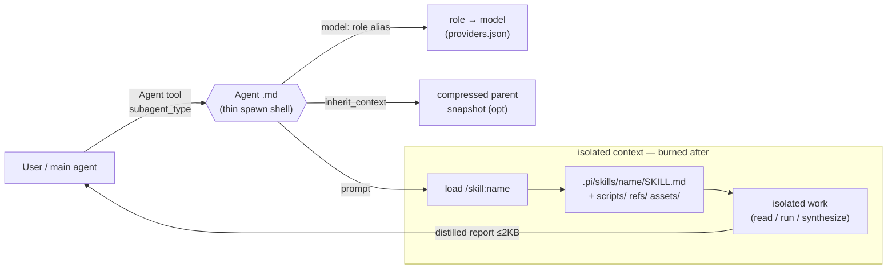

# Skills as Subagents — Analysis, Scoring & Model Routing

How to turn pi **skills** into **subagents**, which of this repo's extension skills are
worth wrapping, what context/KB each needs to stay effective, and which model/provider
role best fits each function.

> Audience: maintainers deciding when to delegate a skill's work to an isolated
> subagent instead of running it inline in the main agent's context.

## Table of contents

- [1. Skill vs. subagent — two mechanisms](#1-skill-vs-subagent--two-mechanisms)
- [2. The bridge: wrapping a skill as a subagent](#2-the-bridge-wrapping-a-skill-as-a-subagent)
- [3. Subagent-fitness scoring](#3-subagent-fitness-scoring)
- [4. Model / provider routing](#4-model--provider-routing)
- [5. Context, KB & sibling-skill injection per skill](#5-context-kb--sibling-skill-injection-per-skill)
- [6. The skill-authoring workflow](#6-the-skill-authoring-workflow)
- [7. Tier A wrappers shipped with this doc](#7-tier-a-wrappers-shipped-with-this-doc)
- [8. Follow-up: co-locating agents with their skill's package](#8-follow-up-co-locating-agents-with-their-skills-package)

---

## 1. Skill vs. subagent — two mechanisms

They are **orthogonal**. A skill is instructions loaded *into* the main agent. A subagent
is a worker spawned *beside* it in an isolated context window.

| | **Skill** (`.pi/skills/<name>/SKILL.md`) | **Subagent** (`.pi/agents/<Name>.md`) |
|---|---|---|
| What it is | Markdown instructions + bundled `scripts/`, `references/`, `assets/` | A spawnable worker with its own frontmatter (`model`, `tools`, `inherit_context`) + prompt |
| Loading | Progressive disclosure: (1) name+desc always in prompt, (2) body on NL-trigger or `/skill:name`, (3) resources on demand | Invoked via the `Agent` tool (`subagent_type`) |
| Context | **Shares** the parent's budget | **Isolated** window; returns a distilled summary, then its context is burned |
| Model | Runs on the parent's model | Own `model:` (role alias or literal id) |
| Best for | Procedural knowledge the main agent should follow inline | Read-heavy / batch / self-contained work that would otherwise bloat the parent |

Source of truth: pi docs `skills.md` (progressive disclosure, `/skill:name`, frontmatter)
and the `pi-dashboard-subagents` producer (`inherit_context` forks a *compressed* snapshot
of the parent conversation into the child; default `true`, per-agent overridable).

**So "can a skill be a subagent?"** — Not automatically, but you can **bridge** them: the
skill stays the single source of truth; a thin agent `.md` spawns an isolated worker whose
prompt says *"load and follow `/skill:<name>`, work in isolation, return a distilled report."*

## 2. The bridge: wrapping a skill as a subagent



Recipe — an agent `.md` that wraps a skill:

```yaml
---
description: <when the parent should spawn this>. Wraps /skill:<name>.
model: "@fast"           # role alias, resolved at spawn from providers.json
inherit_context: false   # batch jobs: false (cheaper); analysis-in-context: true
tools: [read, grep, find, ls, bash]   # least-privilege; add write only if the skill emits files
---

You are the <Name> subagent. Load and follow `/skill:<name>`.
Work entirely in isolation. Do NOT dump raw file contents back to the parent —
return only a distilled summary (findings + artifact paths). Then stop.
```

Notes:
- **Model** is chosen by *role alias* (`@fast`, `@research`, `@coding`, `@vision`, `@compact`)
  so the agent follows the operator's role config and stays portable. Overridable per-call via
  the `Agent` tool's `model` param.
- **`inherit_context: false`** for self-contained batch jobs — they need only their inputs, not
  parent chatter, so the child starts cheaper. `true` when the skill's judgement depends on the
  surrounding decision context.
- **SDK quirk:** `createAgentSession()` builds its own `DefaultResourceLoader` unless a
  `resourceLoader` is passed, so a spawned subagent gets *fresh* skill/extension discovery, not
  the parent's already-loaded set. The wrapped skill must therefore be discoverable on disk
  (it is — it lives under `packages/*/.pi/skills`).

## 3. Subagent-fitness scoring

Scored on: **context-cost-if-inline · clear input→distilled-output contract · low interactivity ·
self-contained (not mutating the parent tree needing sync-back)**. 21 distinct extension skills
(`packages/*/.pi/skills`, excluding the `electron/resources` bundled dupes).

| Skill (package) | Fit /5 | Why |
|---|---|---|
| **video-transcription** | 5 | Long deterministic pipeline, file→SRT, zero interaction |
| **session-to-guideline** (authoring-toolkit) | 5 | Reads a *huge* JSONL transcript → one distilled doc |
| **doc-summarizer** (document-converter) | 5 | Already fans out to child subagents; massive input→summary |
| **kb-search** (kb) | 5 | Read-only ranked lookup — the canonical Explore pattern |
| **security-hardening** (eng-disciplines) | 4 | Audit phase = read-heavy analysis → findings report (fix inline) |
| **systematic-debugging** | 4 | Evidence-gathering → root-cause report is isolatable (fix inline) |
| **anti-slop-frontend** | 4 | Advisory design review → countable findings list |
| **document-converter** | 4 | Self-contained convert pipeline, file→file |
| **pi-dashboard** (extension) | 4 | Scripted REST orchestration of other sessions |
| **dashboard-plugin-scaffold** | 3 | One `ask_user` batch up front, then prescriptive writes |
| **performance-optimization** | 3 | Profile/measure phase isolatable; fix inline |
| **observability-instrumentation** | 3 | Mutates code but scoped |
| **code-simplification** | 3 | Mutation + benefits from parent context |
| **browser** (extension) | 3 | Task automation isolatable, but often user-visual |
| **kb-setup** / **project-init** | 3 | Self-contained setup, but the confirm gate must stay in the parent |
| **skill-creator** (authoring-toolkit) | 2 | Interactive (asks for examples) + writes files |
| **doubt-driven-review** | 2 | In-flight adversarial check needs live decision context |
| **frontend-mockup-loop** | 2 | Many user visual steers in a tight loop |
| **node-inspect-debugger** | 1 | Interactive stepping / breakpoints |
| **interview-me** | 0 | One-question-at-a-time loop — its own SKILL.md says "interactive only, never in CI/autonomous loops" |

**Tiers**

- **Tier A — wrap now (fit 5):** `video-transcription`, `session-to-guideline`, `doc-summarizer`, `kb-search`.
- **Tier B — wrap the read/analysis phase only (fit 4):** `security-hardening`, `systematic-debugging`, `anti-slop-frontend`, `document-converter`, `pi-dashboard`. Split "investigate → report" (subagent) from "mutate → verify" (inline).
- **Tier C — leave inline (fit ≤2):** gated on `ask_user` loops or live visual review.

## 4. Model / provider routing

Current role map (`~/.pi/agent/providers.json`) — recommendations use **role aliases** so they
track whatever the operator assigns:

| Role | Resolves to | Character |
|---|---|---|
| `@fast` | `opencode-go/deepseek-v4-flash` | Cheap, fast, multimodal — glue / lookup / vision |
| `@compact` | `anthropic/claude-haiku-4-5` | Cheap-but-capable — summarise / merge |
| `@planning` / `@coding` / `@research` | `anthropic/claude-opus-4-8` | Strong reasoning / code / long-context synthesis |
| `@vision` | `opencode-go/deepseek-v4-flash` | Screenshot / rendered-UI review |
| *(direct)* `opencode-go/glm-5.2` | GLM-5.2, `reasoning:true`, **1M ctx** | Reasoning + very-long-context jobs |

Routing principle by **function**, not by skill name:

| Function | Best role/model | Rationale |
|---|---|---|
| Deterministic pipeline / orchestration glue | `@fast` | No heavy reasoning; cost dominates |
| Read-only lookup / exploration | `@fast` | Speed + cheap, distilled output |
| Long-context synthesis (transcripts, big docs) | `@research` (opus); `glm-5.2` if input > ~200K tokens | Quality synthesis / 1M window |
| Reasoning-heavy analysis (security audit, root-cause) | `glm-5.2` (reasoning) or `@research` | Deep step-by-step over code |
| Code writing / refactor | `@coding` | Strongest edit fidelity |
| Map-reduce (chunk → merge) | chunk workers `@fast`, merge `@compact`/`@research` | Cheap per chunk, strong merge |
| Visual / screenshot review | `@vision` | Multimodal |

Per-Tier-A/B model pick:

| Subagent (wraps) | Model role | Why |
|---|---|---|
| Transcribe (`video-transcription`) | `@fast` | Pipeline glue around the Soniox API |
| SessionGuideline (`session-to-guideline`) | `@research` (→ `glm-5.2` if transcript > 200K) | Long-context synthesis into a playbook |
| DocSummarize (`doc-summarizer`) | merge `@research`; chunk workers `@fast` | Map-reduce |
| KbLookup (`kb-search`) | `@fast` | Read-only ranked lookup |
| SecurityAudit (`security-hardening`) | `glm-5.2` / `@research` | Careful reasoning over untrusted-input paths |
| DebugRootCause (`systematic-debugging`) | `glm-5.2` / `@research` | Evidence-first reasoning |
| AntiSlopReview (`anti-slop-frontend`) | `@vision` | Reviews rendered UI |
| DocConvert (`document-converter`) | `@fast` | Deterministic conversion |
| DashboardOps (`pi-dashboard`) | `@fast` | REST orchestration glue |

## 5. Context, KB & sibling-skill injection per skill

What to *present* to a wrapped skill to keep it effective (beyond its own bundled `references/`,
which progressive disclosure already loads):

- **video-transcription** — Soniox API key; input/output paths. TS helpers only.
- **session-to-guideline** — session JSONL path; `extract_session.ts`; `skill_manage`/`memory` sinks.
- **doc-summarizer** — document-converter engine; `@fast` for chunk workers.
- **kb-search** — a built KB index; `--doc-type` scope; read-only toolset.
- **security-hardening** — codebase read access; `kb_search`; OWASP refs; fix phase stays inline.
- **systematic-debugging** — failing test/log paths; `kb_search`; `node-inspect-debugger` as sibling.
- **anti-slop-frontend** — `ui-contract.md`; design-token sources; pairs with `frontend-mockup-loop`.
- **document-converter** — the doc-engine facade; OCR flags.
- **pi-dashboard** — dashboard base URL + `/api/health`; the REST skill doc.
- **dashboard-plugin-scaffold** — gather the `ask_user` batch in the *parent*, pass answers in the prompt; monorepo paths.
- **performance-optimization** — the latency/throughput budget; profiler output paths.
- **code-simplification** — target files; test command; `code-quality` sibling.
- **browser** — target URL; `agent-browser` CLI; screenshot dir.

General multipliers: (a) **least-privilege tool allow-list** in frontmatter; (b) **`kb_search`** so
the child self-serves the repo map instead of the parent pre-loading files; (c) **sibling skills**
named in the prompt; (d) **`inherit_context`** tuned per skill.

## 6. The skill-authoring workflow

The repeatable process (from the `skill-creator` skill) plus this repo's conventions.

Six steps:
1. **Understand with concrete examples** — what triggers it, sample user phrasings.
2. **Plan reusable resources** — which `scripts/` / `references/` / `assets/` avoid re-work.
3. **Initialize** — `init_skill.py <name> --path <dir>` scaffolds SKILL.md + resource dirs.
4. **Edit** — imperative voice; keep SKILL.md < 500 lines; push bulk detail into `references/`
   (progressive disclosure); test any scripts by running them.
5. **Package** — `package_skill.py <folder>` validates then zips to `<name>.skill`.
6. **Iterate** — use on real tasks, note friction, refine.

Repo-specific conventions:
- Skills live at `packages/*/.pi/skills/<name>/` (or `.pi/skills/` for project skills); trigger by
  NL description or `/skill:name`.
- **Frontmatter YAML trap:** an unquoted `description` containing an inner `": "` parses as a nested
  mapping and the loader **silently drops the skill**. Quote the whole value, escape inner `"`.
  Enforced by `scripts/__tests__/skill-frontmatter.test.mjs`.
- Only `name` + `description` are read for triggering — put *all* "when to use" cues in `description`,
  not the body.
- Helper scripts in **TypeScript**, run with `bun` (or `node ≥22`), Node built-ins only, no build step.
- Caveman style for tree rows / architecture notes; readable prose for standalone docs like this one.

## 7. Tier A wrappers shipped with this doc

Generated alongside this doc under `.pi/agents/`:

| Agent file | Wraps skill | Model | `inherit_context` |
|---|---|---|---|
| `Transcribe.md` | `video-transcription` | `@fast` | false |
| `SessionGuideline.md` | `session-to-guideline` | `@research` | false |
| `DocSummarize.md` | `doc-summarizer` | `@research` (chunks `@fast`) | false |
| `KbLookup.md` | `kb-search` | `@fast` | false |

Spawn via the `Agent` tool with the matching `subagent_type`. Each returns a distilled report,
not raw output — protecting the parent's context budget.

They live in the **project** `.pi/agents/` tier (not co-located with each skill's package) — see
§8 for why, and the follow-up to fix it.

## 8. Follow-up: co-locating agents with their skill's package

Goal: ship each wrapper agent inside the *same* package as the skill it wraps so installing the
package delivers both atomically — the same way skills are already bundled per-package.

**Current reality (verified 2026-07-07 against `~/Project/pi-dashboard-subagents`).** Agents are
resolved by the `pi-dashboard-subagents` extension's `resolveAgentMdPath()` (`extensions/agent.ts`).
It now has a **4-tier** lookup (commit `2dbd87a`), first match wins:

1. `<cwd>/.pi/agents/<type>.md` — `project`
2. `<getAgentDir()>/agents/<type>.md` — `user` (`~/.pi/agent/agents/`)
3. `<EXTENSION_ROOT>/agents/<type>.md` — `bundled` (the subagents package's own `agents/`)
4. `<installedPath>/agents/<type>.md` — `package` (any installed pi package), via a cached
   discovery index (`buildPackageAgentIndex`)

Two things about tier 4 matter for co-location:

- **Convention is `<package-root>/agents/*.md`, NOT `<pkg>/.pi/agents/`** — it mirrors the bundled
  tier's `<EXTENSION_ROOT>/agents/`. My original recommendation of `packages/<pkg>/.pi/agents/`
  was wrong.
- Tier 4 is **user-scope only today.** `buildPackageAgentIndex` filters `scope === "user"` and
  only sees packages listed as *configured pi packages*. This monorepo's workspace packages are
  NOT registered as configured pi packages, and project-scope is not indexed — so co-located
  agents here still won't be found until (a) project-scope discovery lands and (b) each package is
  a configured pi package.

**History + open gap.** The package tier shipped via change `add-package-agent-discovery-tier`
(merged PR #1, **archived** 2026-07-07) — but **user-scope only**. Its synced spec
(`openspec/specs/package-agent-discovery/spec.md`) states *"project-scoped packages SHALL NOT be
indexed,"* justified by *"`ExtensionContext` has no `isProjectTrusted()`."* **That justification is
now stale** — `ExtensionContext.isProjectTrusted()` and `SettingsManagerCreateOptions.projectTrusted`
both exist in the current SDK (verified). So **project-scope-when-trusted is not yet proposed**; it
needs a NEW follow-up change (thread `SettingsManager.create(cwd, agentDir, { projectTrusted:
ctx.isProjectTrusted() })`, drop the `scope === "user"` hard-filter, correct the `agent.ts:169`
comment + the spec). Only after that lands **and** the workspace packages are registered as
configured pi packages can the four wrappers move from project `.pi/agents/` into each skill
package's **`agents/`** dir:

| Wrapper | Target (package root, not `.pi/`) |
|---|---|
| `Transcribe.md` | `packages/video-transcription/agents/` |
| `SessionGuideline.md` | `packages/authoring-toolkit/agents/` |
| `DocSummarize.md` | `packages/document-converter/agents/` |
| `KbLookup.md` | `packages/kb/agents/` |

Rejected alternatives: a `worktreeInit`/build copy step into project `.pi/agents/` (a shim), or
moving them into `pi-dashboard-subagents/agents/` (discoverable but owned by the wrong package).
