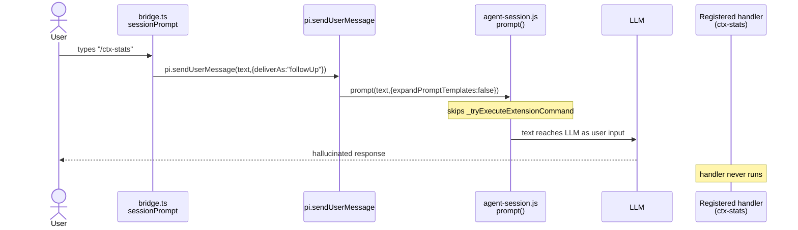

# Slash Command Routing

## Purpose

Documents how dashboard bridge routes typed `/foo` text from chat input to pi handlers. Records `pi.registerCommand`-based extension command bug rooted in pi 0.70 ExtensionAPI surface. Specifies two-step fix: dashboard-side stopgap now, upstream `pi.dispatchCommand` later.

## Routing Order

`command-handler.ts::parseSendPrompt` plus `bridge.ts::sessionPrompt` process `send_prompt` text in this exact order:

1. `!!` prefix → silent bash via `pi.exec`
2. `!` prefix → bash via `pi.exec`, output also sent to LLM
3. `/compact [args]` → `compact()` callback
4. `/quit` or `/exit` → `shutdown()` callback
5. `/reload` → `reload()` callback
6. `/new` → `spawnNew()` callback
7. `/model <provider/id>` → `setModel(provider, id)` callback
8. `/<name>` matching user-defined flow from `getFlowsList()` → `pi.events.emit("flow:run", {flowName, task})`
9. `/<name>` matching extension command (`source: "extension"` in `pi.getCommands()`, not in `DASHBOARD_NATIVE_COMMANDS`) → three-way decision: (B) `pi.dispatchCommand` when present → (C) headless RPC session with keeper → emit `dispatch_extension_command` to server, server writes RPC line to keeper UDS → (D) `command_feedback {status:"error"}` stopgap. Path C added by change `add-rpc-stdin-dispatch-with-keeper-sidecar`.
10. `/` prefix fall-through → `expandPromptTemplateFromDisk` then `pi.sendUserMessage` (skills, prompt templates, unknown slashes)
11. No prefix → `pi.sendUserMessage(text)` passthrough

Steps 1-7 live in `parseSendPrompt`. Step 8 lives in `bridge.ts::sessionPrompt`. Step 9 added by this change. Steps 10-11 are existing fallbacks.

## Surface Map

```mermaid
flowchart TD
  U[User types text in chat] --> P["command-handler.ts<br/>parseSendPrompt(text)"]
  P --> B{ParsedPrompt type}
  B -->|bash| EX["pi.exec"]
  B -->|compact| CP["options.compact()"]
  B -->|shutdown| SD["options.shutdown()"]
  B -->|reload| RL["options.reload()"]
  B -->|new| NW["options.spawnNew()"]
  B -->|model| MD["options.setModel(provider,id)"]
  B -->|mgmt| MG["pi.events.emit(event, data)"]
  B -->|slash| SP["bridge.ts<br/>sessionPrompt(text)"]
  B -->|passthrough| PT["sendUserMessageWithImages -> pi.sendUserMessage"]

  SP --> F{Flow fast-path:<br/>name in getFlowsList()?}
  F -->|yes| FR["pi.events.emit('flow:run',{flowName,task})"]
  F -->|no| X{Step 9 gate:<br/>isExtensionSlashCommand(text, getCommands())}
  X -->|true, dispatchCommand present| DC["Path B: pi.dispatchCommand(text,{streamingBehavior:'followUp'})"]
  X -->|true, dispatchCommand absent, isHeadlessRpcSession| RPC["Path C: connection.send({type:'dispatch_extension_command', sessionId, command, requestId})<br/>server -> keeper UDS -> pi.stdin -> session.prompt"]
  X -->|true, dispatchCommand absent, non-headless| ER["Path D: emit command_feedback {status:'error'}"]
  X -->|false| FB["expandPromptTemplateFromDisk -> pi.sendUserMessage(expanded,{deliverAs:'followUp'})"]
```

## Pi 0.70 ExtensionAPI Constraint

Pi 0.70 `ExtensionAPI` exposes: `sendMessage`, `sendUserMessage`, `registerCommand`, `getCommands`, `events`, `exec`, `setSessionName`, `getActiveTools`. Verified at `pi-coding-agent/dist/core/extensions/types.d.ts:770-922` and `loader.js:155-260`.

`ExtensionAPI` does NOT expose: `prompt`, `session`, `dispatchCommand`. Pi's `agent-session.js:1715` calls `runner.bindCore({sendMessage, sendUserMessage, appendEntry, setSessionName, ...})` — no `prompt` action wired into runtime.

Slash dispatch privilege belongs to pi's external `prompt()` entry point (TUI input handler, RPC mode `case "prompt"`). Never delegated to extensions. `getCommands()` returns `SlashCommandInfo[]` with name + description but no handler reference.

`pi.sendUserMessage` calls `agent-session.js::sendUserMessage` which calls `prompt(text, {expandPromptTemplates: false, ...})`. The `expandPromptTemplates: false` flag explicitly skips `_tryExecuteExtensionCommand`. Source comment at `agent-session.js:1002`: "Use prompt() with expandPromptTemplates: false to skip command handling and template expansion".



## Affected Commands Today

Per `notes/preflight-empirical-checks.md` Q1 plus proposal Impact section. All `pi.registerCommand`-registered slash commands fall through to `sendUserMessage` in dashboard chat:

- context-mode: `/ctx-stats`, `/ctx-doctor`
- pi-web-access: `/websearch`, `/curator`, `/google-account`, `/search`
- pi-subagents: `/agents`
- pi-flows: `/flows`, `/flows:new`, `/flows:edit`, `/flows:delete`, `/roles`

Flow buttons in kebab menu mask the bug because they route via `flow_management` ws message (separate handler in `bridge.ts`). Typed `/flows:new` in chat hits the broken path.

Empirical proof: `echo '{"type":"prompt","message":"/flows:new","id":"1"}' | pi --mode rpc` dispatches correctly via `session.prompt`, returns `extension_ui_request` from pi-flows.

## Decisions

### Decision 1: Dispatch path — Path B primary, Path D stopgap

**Choice:** Add `pi.dispatchCommand(text, options?)` to upstream `ExtensionAPI`. Ship dashboard-side detection + error feedback as interim.

**Rationale:** Pi already implements dispatch logic (`agent-session.js:798 _tryExecuteExtensionCommand`). Exposing it on ExtensionAPI is ~5 lines upstream. Bridge change is 3 lines. Stopgap avoids worst UX failure (silent send-to-LLM) without waiting on upstream release.

**Rejected:**
- Path A (bridge looks up handler via `getCommands()`): handler reference is private to runner, not on api object.
- Path C (server bypasses bridge, writes RPC `prompt` to pi stdin): too invasive, splits session ops across bridge + server, requires stdin capture in `process-manager.ts` and rewiring `pi-gateway.ts`. **REOPENED in change `add-rpc-stdin-dispatch-with-keeper-sidecar`** after Path B failed to ship through pi 0.71 → 0.72 → 0.73 → 0.74. Scope narrowed to slash dispatch only via per-session keeper sidecar; dual-channel boundary made explicit; bridge owns everything else.

### Path C: server-routed via RPC keeper

Applies to headless dashboard sessions only (tmux / Windows Terminal cannot use it — the user's terminal owns pi's stdin). Bridge probe: `process.env.PI_DASHBOARD_SPAWNED === "1"` AND argv contains `--mode rpc`.

Flow: bridge emits `started`, sends `dispatch_extension_command {sessionId, command, requestId}` to server. Server's `dispatch-router.ts` writes `{"type":"prompt","message":"<command>","id":"<requestId>"}` to per-session keeper UDS via `headlessPidRegistry.writeRpc`. Keeper forwards to pi's stdin. Pi's `--mode rpc` calls `session.prompt(text, {expandPromptTemplates: true})` → `_tryExecuteExtensionCommand` runs handler. Server emits optimistic `command_feedback {completed}` on UDS write success, `{error}` on failure. Bridge MUST NOT emit a terminal event for Path C — server owns it.

Gated by `useRpcKeeper: true` in `~/.pi/dashboard/config.json`. Default off (Phase 1). See `docs/architecture.md` § "RPC keeper sidecar" for the three-process topology + dual-channel boundary.

Cross-reference: design.md Decision 1; change `add-rpc-stdin-dispatch-with-keeper-sidecar`.

### Decision 2: Extension-command detection rule

**Choice:** Intersect typed cmdName against `pi.getCommands()` filtered to `source === "extension"` AND not in `DASHBOARD_NATIVE_COMMANDS`. Computed per `sessionPrompt` invocation, no caching.

**Rationale:** Skill commands (`source: "skill"`), prompt templates (`source: "prompt"`), bridge-native names (`__dashboard_reload`) stay on the existing template-expansion path. `getCommands()` is O(1) cached on pi runtime side.

**Rejected:** None — alternative detection schemes (regex, hardcoded list) require maintenance and miss third-party extensions.

Cross-reference: design.md Decision 2.

### Decision 3: Feature detection over version sniffing

**Choice:** `typeof (pi as any).dispatchCommand === "function"` per call. No semver checks, no version strings.

**Rationale:** Same bridge build works against pi 0.70 (stopgap fires) and pi 0.71+ (dispatch fires) without recompilation. Per-call detection keeps wiring identical between fresh-spawn and live-reload paths.

**Rejected:** Module-load-time cache — adds rare race risk on hot-reload of pi runtime; per-call cost is one typeof check.

Cross-reference: design.md Decision 3.

### Decision 4: Telemetry events

**Choice:** Emit `command_feedback {command, status: "started"}` before dispatch. Emit `status: "completed"` after `pi.dispatchCommand` resolves. Emit `status: "error", message` for stopgap path. Pi's own `extension_error` events forwarded by existing event-wiring path, not duplicated.

**Rationale:** Mirrors existing pattern for `/reload`, `/new`, `/model`, `/compact`. Client `event-reducer.ts` already renders `command_feedback`. Pi swallows handler exceptions internally — no per-command try/catch needed in bridge.

**Rejected:** Bridge-side try/catch around `dispatchCommand` — duplicates pi's internal error handling, risks double-emit.

Cross-reference: design.md Decision 4.

### Decision 5: Test shape

**Choice:** New file `packages/extension/src/__tests__/bridge-slash-command-routing.test.ts`. Stub pi with both `dispatchCommand` (when present) and `sendUserMessage` (always present). Drive `command-handler.handle(...)` with payload table covering: extension cmd with dispatch, extension cmd without dispatch, skill cmd, prompt template, passthrough, `/compact`, `/flows:new`. Assert call counts on `dispatchCommand` and `sendUserMessage` plus `command_feedback` emissions.

**Rationale:** Pins contract that extension slash commands NEVER fall through to `sendUserMessage`. Same test covers Path B and Path D via the same call-count table.

**Rejected:** End-to-end integration test against real pi process — flaky, slow, requires pinning extension versions.

Cross-reference: design.md Decision 5.

## Two-Step Fix

```mermaid
flowchart TD
  S["bridge.ts::sessionPrompt(text)"] --> FF{User-defined flow?<br/>(step 8)}
  FF -->|yes| FR["pi.events.emit('flow:run', ...)"]
  FF -->|no| G["isExtensionSlashCommand(text, pi.getCommands())<br/>(pure helper, step 9 gate)"]
  G -->|false| FB["fall-through:<br/>expandPromptTemplateFromDisk -> pi.sendUserMessage"]
  G -->|true| FS["emit command_feedback {status:'started'}"]
  FS --> D{typeof pi.dispatchCommand === 'function'}
  D -->|true: Path B| DC["pi.dispatchCommand(text,{streamingBehavior:'followUp'})"]
  DC --> CP["emit command_feedback {status:'completed'}"]
  D -->|false| H{isHeadlessRpcSession?<br/>(env+argv probe)}
  H -->|true: Path C| RPC["connection.send dispatch_extension_command<br/>server writes RPC line to keeper UDS<br/>server emits started/completed/error"]
  H -->|false: Path D stopgap| EE["emit command_feedback {status:'error', message:<reason>}"]
  EE --> X1["NO sendUserMessage call"]
  DC --> X2["NO sendUserMessage call"]
  RPC --> X3["NO sendUserMessage call"]
```

- Path D ships standalone in dashboard release. No upstream dependency.
- Path B requires pi 0.71+ shipping `pi.dispatchCommand` on `ExtensionAPI`.
- Bridge feature-detects per call. No version sniffing.
- Same regression test pins both paths via call-count table on stub pi.

## Empirical Verification

From `notes/preflight-empirical-checks.md`.

### Q1: typed `/flows:*` broken same way?

YES. `getFlowsList()` returns user-defined flow names only. pi-flows-registered command names (`flows:new`, `flows:edit`, `flows:delete`, `flows`, `roles`) never match the user-defined set. Branch falls through to `pi.sendUserMessage`. Buttons mask the bug via `flow_management` ws message.

Confirmed via `echo '{"type":"prompt","message":"/flows:new","id":"1"}' | pi --mode rpc` → pi-flows extension dispatches correctly via RPC `session.prompt`.

### Q2: `sendUserMessage` sites in `command-handler.ts`

| line | path | needs gate? |
|---|---|---|
| 264 | slash else-arm (no `options.sessionPrompt`) | YES (mirror of `bridge.ts::sessionPrompt` line ~694) |
| 286 | passthrough → `sendUserMessageWithImages` (multi-line slash + images) | NO (`isExtensionSlashCommand` rejects multi-line) |
| 453 | inside `sendUserMessageWithImages` (image content array) | NO (internal helper) |
| 455 | inside `sendUserMessageWithImages` (no valid images) | NO (internal helper) |
| 458 | inside `sendUserMessageWithImages` (text-only path) | NO (internal helper) |
| 495 | `handleBashCommand` ($cmd\noutput → LLM) | NO (not slash) |

Two sites need the gate: `bridge.ts::sessionPrompt` fallback and `command-handler.ts:264` else-arm. Other 4 sites stay verbatim.

## Detection Helper

`isExtensionSlashCommand(text, commandList): boolean` — pure helper, exported from `bridge-context.ts`. No pi calls, no mutation. Unit-testable without stub pi.

Returns `true` iff:
- `text` starts with `/` AND has no embedded newline
- Token between leading `/` and first space (or end) — `cmdName` — appears in `commandList` with `source === "extension"`
- `cmdName` not in `DASHBOARD_NATIVE_COMMANDS` (same set used by `filterHiddenCommands`)

Spec scenarios as truth table:

| input | commandList entry | result |
|---|---|---|
| `/ctx-stats` | `{name:"ctx-stats", source:"extension"}` | true |
| `/ctx-stats verbose=1` | `{name:"ctx-stats", source:"extension"}` | true |
| `/skill:foo` | `{name:"skill:foo", source:"skill"}` | false |
| `/review` | `{name:"review", source:"prompt"}` | false |
| `/__dashboard_reload` | `{name:"__dashboard_reload", source:"extension"}` | false (`__` prefix + DASHBOARD_NATIVE_COMMANDS) |
| `/totally-unknown` | (not in list) | false |
| `/ctx-stats\nuser ctx` | `{name:"ctx-stats", source:"extension"}` | false (multi-line) |
| `hello world` | any | false (no `/` prefix) |

## Telemetry

`command_feedback` event lifecycle around step 9:

- `status: "started"` emitted before `pi.dispatchCommand` invocation (Path B) or before stopgap error emit (Path D).
- `status: "completed"` emitted after `pi.dispatchCommand` resolves (Path B only).
- `status: "error", message: <human-readable reason>` emitted by stopgap (Path D only).

Pi's `_tryExecuteExtensionCommand` swallows handler exceptions and emits `extension_error` to runner. Existing event-wiring path forwards those to dashboard. Bridge does NOT duplicate.

## Risks

- Upstream dependency for Path B → Path D ships standalone. CHANGELOG documents pi 0.71+ requirement for full dispatch.
- Path D false-positives if `getCommands()` includes commands dispatchable through other routes → `__dashboard_reload` filtered via `__` prefix. Flows family short-circuited by step 8 fast-path (runs before step 9).
- Path D fails-loud on `/agents`, `/curator`, `/websearch` that previously "kind of worked" via LLM hallucination → Acceptable. Loud failure better than silent corruption.
- `pi.dispatchCommand` upstream API shape might differ → bridge feature-detects symbol name. Worst case: follow-up PR after upstream lands.
- `command_feedback` rendering varies → existing client `event-reducer.ts` handles all three statuses for `/reload`, `/new`, `/model`, `/compact`. No client change.
- Multi-line slash `/skill:foo\nuser ctx` classified as passthrough → `isExtensionSlashCommand` rejects multi-line, fix scoped to single-line slash only.

## Cross-References

- Spec: `openspec/specs/command-routing/spec.md`
- Change folders: `openspec/changes/fix-extension-slash-commands-in-dashboard/`, `openspec/changes/add-rpc-stdin-dispatch-with-keeper-sidecar/`
- Bridge: `packages/extension/src/bridge.ts` (sessionPrompt callback, line ~669)
- Command handler: `packages/extension/src/command-handler.ts` (parseSendPrompt + slash routing branches, line ~256)
- Helper module: `packages/extension/src/bridge-context.ts` (DASHBOARD_NATIVE_COMMANDS, filterHiddenCommands, target home of isExtensionSlashCommand, isHeadlessRpcSession)
- Slash dispatcher: `packages/extension/src/slash-dispatch.ts` (`tryDispatchExtensionCommand` — three-way Path B/C/D decision)
- Keeper sidecar: `packages/server/src/rpc-keeper/keeper.cjs`, `packages/server/src/rpc-keeper/keeper-manager.ts`, `packages/server/src/rpc-keeper/dispatch-router.ts`
- Architecture: `docs/architecture.md` § "RPC keeper sidecar"
- Pi internals (read-only reference):
  - `~/.nvm/versions/node/v25.8.1/lib/node_modules/@earendil-works/pi-coding-agent/dist/core/extensions/types.d.ts:770` ExtensionAPI surface
  - `~/.nvm/versions/node/v25.8.1/lib/node_modules/@earendil-works/pi-coding-agent/dist/core/agent-session.js:798` _tryExecuteExtensionCommand
  - `~/.nvm/versions/node/v25.8.1/lib/node_modules/@earendil-works/pi-coding-agent/dist/core/agent-session.js:1002` sendUserMessage → prompt({expandPromptTemplates:false})
  - `~/.nvm/versions/node/v25.8.1/lib/node_modules/@earendil-works/pi-coding-agent/dist/modes/rpc/rpc-mode.js` RPC `prompt` command (proves slash dispatch works via session.prompt)
