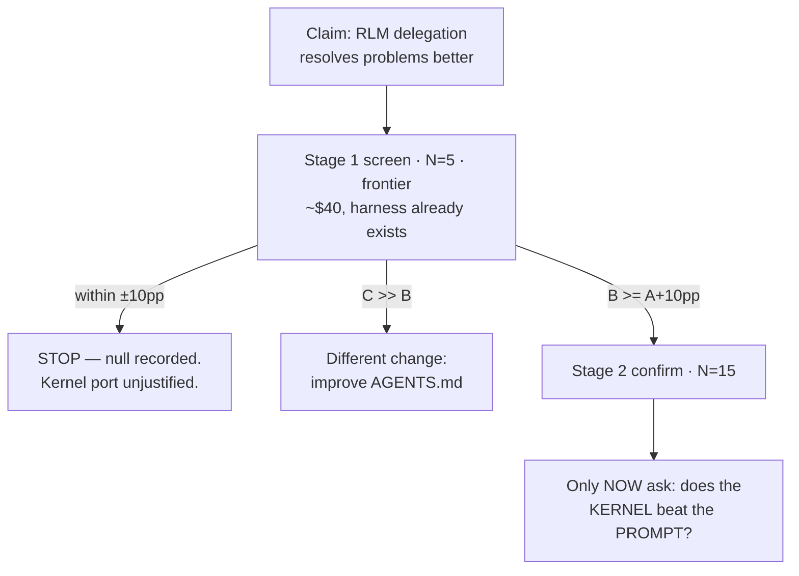

# Design — RLM delegation A/B

## Why prompt-level, not harness-level

We cannot cheaply run prime-agent vs pi head-to-head: different `configDir`
(`.prime/agent` vs `.pi`), peer pins at `>=0.80.10` vs their reported `0.7.1`,
and a Python runtime this repo does not have. But we do not need to.

> **Verified 2026-08-11 against pi 0.84.1.** An earlier draft claimed child
> `AgentSession` creation was core-only. That is false. `createAgentSession`,
> `AgentSessionRuntime` and `createAgentSessionServices` are public SDK exports;
> `pi-dashboard-subagents` v0.2.2 and `packages/extension/src/commit-draft-agent.ts`
> both spawn in-process children from extension code today. The residual gap to
> `rlm()` is fire-and-forget admission, the `agent_message` mailbox, a
> compaction-surviving registry, and an in-code call site — not session creation.

The RLM's claimed mechanism is behavioural — *keep bulk data out of the main
context, derive in code, delegate*. `scripts/ab-context` manipulates exactly that
layer.

## Arms

Each arm is a git worktree off the same `HEAD`. The **only** permitted diff is
the doctrine block in `AGENTS.md`. Any other diff invalidates the run.

| Arm | Worktree | Treatment |
|---|---|---|
| **A** | `.worktrees/rlm-control` | unmodified `HEAD` |
| **B** | `.worktrees/rlm-delegate` | delegation-first doctrine: derive via `ctx_execute`; never read a large file directly; fan bulk reading to subagents; keep artifacts out of the prompt |
| **C** | `.worktrees/rlm-tips` | B + a per-task environment hint, mirroring their `_ENV_TIPS_SUB_LLMS` |

Arm C is the cheap-alternative control. In Prime Intellect's own data, tips were
what rescued DeepDive — hand-written environment knowledge outperformed the
scaffold alone.

## Models

Chosen from the live registry, driven by the **capability floor** finding
(Flash-Lite underperformed its baseline in the Continual Harness paper).

| Role | Model | Ctx | $/Mtok in/out | Why |
|---|---|---|---|---|
| Frontier (primary) | `anthropic/claude-opus-4-8` | 1M | 5 / 25 | Already the repo's `coding` role. A result on any other model is not actionable — this is what actually writes the code. |
| Floor probe | `anthropic/claude-haiku-4-5` | **200K** | 1 / 5 | Tests H4. Its 200K ceiling also *creates* the context-overflow condition on the long bucket — the same effect that drove the Oolong result, where the baseline's API rejected over-length input. |
| Free replication (optional) | `zai/glm-5.2` | 1M | 0 / 0 | Zero-cost third read. Only if the frontier screen is ambiguous. |

The haiku 200K window is a **feature, not a defect**: on long-context tasks the
control arm physically cannot hold the input, so delegation becomes the only
route to completion. That is the sharpest possible test of the mechanism.

## Battery

`tasks.rlm.jsonl`, mixed by design so the crossover point is visible rather than
assumed. Format follows the existing `tasks.impl.jsonl`
(`{id, commit, tests[], verify, prompt}`).

| Bucket | n | Shape |
|---|---|---|
| **Short** | 4 | single-file fix, small diff — where their data says the *bare* LLM wins |
| **Long** | 4 | multi-file / large-diff commits, cross-package, big `contextFiles` |
| **Control** | 1 | neutral task both arms must pass; guards against harness breakage |

Every task must be verified **RED at `<commit>^`** and **GREEN with the real
implementation applied**. An already-green task measures nothing — the same
vacuous-gate failure documented in `detect-vacuous-perf-test`.

## Metrics

Primary is resolution. This is the departure from the existing `tasks.jsonl`
battery, which measures doctrine adherence.

| | Metric | Rationale |
|---|---|---|
| **Primary** | pass rate (`verify` goes RED → GREEN) | the actual claim |
| Secondary | `cost` | their headline harness win was *cheaper* ($130 vs $215) |
| Secondary | `ctxPeak` | does main context actually stay small? tests the mechanism, not just the outcome |
| Secondary | `output`, `nTools` | skill warning: a reasoning drop with a tool-call rise is not a real saving |
| Guard | wall time | delegation adds round-trips |

Report `output` and `cacheWrite`, never `total` — `total` sums `totalTokens`
across turns and is cache-read inflated.

**Framing:** the existing harness defaults to *non-inferiority* (δ=0.10), correct
for doctrine changes. Here we are testing a *claimed improvement*, so we want
**lift**. N=5 is directional only; the two-stage rule exists precisely because a
directional read must not be promoted as proof.

## Threats to validity

Ranked by likelihood of silently ruining the run.

1. **Capability floor** — a haiku-only run risks a false negative that would
   wrongly kill the idea. Mitigation: frontier model is the primary arm.
2. **Short-context battery** — their evidence says the edge *scales with context
   length*; the bare LLM won at short contexts. A battery of small tasks is
   *designed* to reproduce their null. Mitigation: the long bucket, reported
   separately.
3. **Vacuous gates** — tasks already green measure nothing. Mitigation: RED/GREEN
   pre-validation for every task, before spending budget.
4. **Index pollution** — `git checkout <commit> -- <tests>` *stages* the test
   files, so a later `git checkout -- .` restores the index and each run inherits
   the previous run's implementation; arm B then looks brilliant purely because
   arm A already solved it. Mitigation: `git reset --hard HEAD` + `git clean -fd`
   between runs, with an explicit pollute→reset→verify-clean check.
5. **Confounded arm** — any worktree diff beyond the doctrine block makes the
   result uninterpretable. Mitigation: assert the diff before running.
6. **Session-slug collision** — arm A's cwd equals the interactive session's cwd.
   The before/after new-file diff isolates the run, but our own `sessionId` must
   be excluded from the scan.

## Budget

~5 min/run — pi jiti-cold-boots the full dashboard extension per spawn.

| Stage | Grid | Runs | Wall | Est. cost |
|---|---|---|---|---|
| 1 screen (frontier) | 3 arms × 9 tasks × N=5 | 135 | ~11 h | ~$40–120 |
| 1 floor probe (haiku) | 2 arms × 9 tasks × N=5 | 90 | ~7 h | ~$10 |
| 2 confirm (**only if lift**) | 2 arms × 9 tasks × N=15 | 270 | ~22 h | ~$80–250 |

Stage 1 runs overnight via `nohup ./finish.sh &`. **Hard abort if cost exceeds
2× estimate.** Arm C is the first thing to cut under pressure.

## What this does not test

**H2 — the Continual Harness — is cross-session by construction.** State must
accumulate across sessions before it pays off; a single-shot battery cannot see
it. The $130-vs-$215 Pokémon result is the strongest published number in this
whole thread and deserves its own design, not a bolt-on here.

Noted risk for that future change, flagged independently by both this analysis
and the Kingy review: *"bad evidence can become durable memory"*. Any port must
keep the immutable base prompt, the review gate, and the append-only history —
those are the drift controls, not optional polish.
