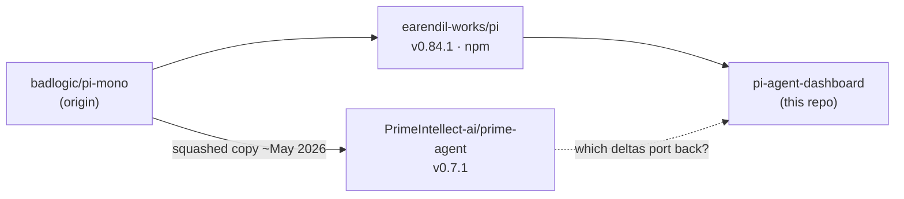
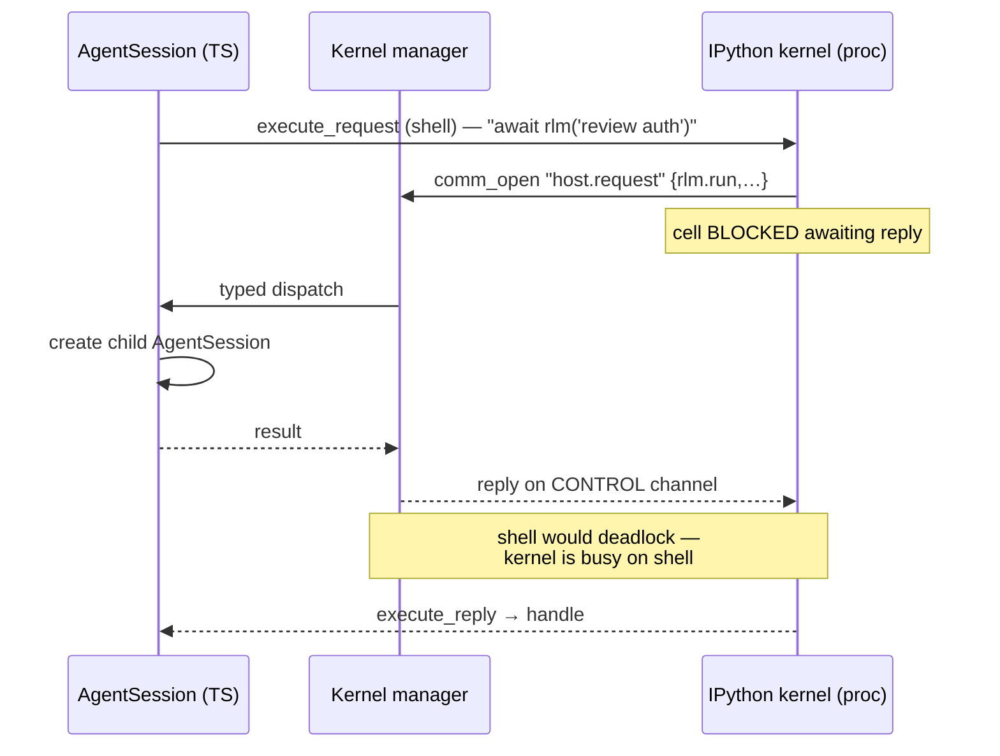
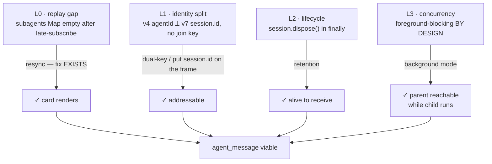

# Research record — Prime Agent vs pi-agent-dashboard

Durable record of the exploration behind this change. Written so a future session
can resume without re-deriving anything. Every claim below carries its evidence
(URL, file path, or line number).

**Status:** research complete. No code written. Three open forks at the end.

**Session origin:** explore-mode investigation, 2026-08-11. Started as "did anyone
implement prime-agent in pi?", inverted twice, ended on subagent lifecycle.

---

## 0. How to resume

| Want to… | Read |
|---|---|
| Run the pre-registered A/B | `proposal.md` + `design.md` (this change) |
| Understand what Prime Agent actually is | §1–§3 below |
| Re-litigate "it resolves problems better" | §4 below |
| Know what pi/the dashboard already has | §5–§6 below |
| Pick up the subagent-messaging thread | §7–§8 below, then §9 |

Companion A/B harness skill (read **by path** — not resolvable by name via `skill_read`):
`~/.pi/agent/projects-memory/pi-agent-dashboard/skills/ab-test-context-injections/SKILL.md`

Subagent-identity diagnosis skill:
`~/.pi/agent/projects-memory/pi-agent-dashboard/skills/trace-subagent-not-found/SKILL.md`

---

## 1. Prime Agent is not an integration — it is a hard fork of pi

The original question ("did somebody implement prime-agent in pi?") is malformed.
Prime Agent **is** pi, rebranded.

Their own `packages/coding-agent/docs/index.md`: *"It began as a hard fork of pi-mono."*

| Fact | Prime Agent | Upstream pi (this repo's peer) |
|---|---|---|
| `packages/coding-agent/package.json` → `name` | `@earendil-works/pi-coding-agent` | `@earendil-works/pi-coding-agent` |
| `author` | Mario Zechner | Mario Zechner |
| `bin` | `pi` → `dist/bundle/cli.js` | `pi` |
| `piConfig` | `{name:"prime-agent", configDir:".prime/agent"}` | `{configDir:".pi"}` |
| workspace packages | `agent · ai · coding-agent · tui` | `agent · ai · coding-agent · tui` |
| version | `0.7.1` (reset) | `0.84.1` |
| GitHub `fork` flag | `false` (squashed copy), created 2026-05-08 | — |

They kept `piConfig` — pi's own rebranding hook — and used it. License MIT, so
porting anything back is legally clean with attribution.



**Consequence:** running prime-agent side-by-side under this dashboard is blocked
by three independent things — `configDir` mismatch (`.prime/agent` vs `.pi`), peer
pins (`>=0.80.10` vs their `0.7.1`), and a Python runtime requirement. A real
harness-level A/B is not cheaply available. That is *why* this change tests the
claim at the prompt level instead.

---

## 2. The four deltas over pi

| # | Delta | Shape |
|---|---|---|
| ① | Single `ipython` tool replaces read/bash/edit/write; persistent kernel, vars survive turns + compaction; prompt-as-a-variable | Rewrites the whole tool surface |
| ② | `rlm()` fire-and-forget subagents with parent/child mailbox messaging | Needs child-session creation + retention |
| ③ | Continual Harness — `/refine` writes supplemental prompts/memories/skills/subagent specs, with rollback | Extension-shaped |
| ④ | Daemon / worker / kernel supervisor for detached background agents, schedules, goals | **This repo already has it** (§6) |

---

## 3. The RLM host bridge, concretely

Not hand-rolled IPC. A real **Jupyter kernel over ZeroMQ**, comm target `host.request`.



The control-channel detail is the tell that this is load-bearing engineering, not a demo.

**Ownership split (from their docs + file sizes):**

| File | LOC | Extension-shaped? |
|---|---|---|
| `core/kernel/index.ts` — ZMQ, Jupyter framing, comm dispatch, interrupt | 1529 | ✅ generic |
| `core/tools/ipython.ts` — tool wrapper, lazy kernel, output shaping | — | ✅ |
| `core/rlm-runtime.ts` — typed validation for `rlm.run`, model discovery | 242 | ✅ thin |
| `core/agent-session.ts` — RLM policy, child creation, registry, usage attribution, cancellation | — | ❌ core |
| `core/refinement/refinement.ts` | 1017 | ✅ |
| `prime-agent-runtime/src/rlm/harness.py` | 819 | ⚠️ new Python dep |
| `kernel/state-snapshot.ts` | 297 | ✅ |

### 3a. The decisive argument against porting ①

Prime Agent's skill list:

```
agent-message  agent-observe  attach-image  compact  edit
goal  linear  notion  prime-intellect  refine  rlm-heartbeat
skill-creator  websearch
```

`edit`, `compact`, `attach-image`, `websearch` are **pi's built-in tools**, re-homed
as Python packages. That is the unavoidable downstream consequence of single-tool
RLM: once `ipython` is the only tool, *everything else must become an importable
Python module*.

For a 39-package TypeScript monorepo that ships **zero Python today**, ① is not a
port — it is a different product. **Recommendation: do not port ①**, independent of
how the A/B lands.

---

## 4. Evidence assessment — "prime agent resolves problems better"

User's source: `kingy.ai/blog/prime-agent-review-self-improving-rlm-harness/` (scores it 8.3/10).

### What genuinely supports the claim

- Prime Intellect published a **head-to-head launch table** vs pi-mono, Claude Code, Codex.
- **ARC-AGI-3: 95.54%** with Opus 5 (178/183 levels, 24/25 games, 11,244 actions) vs
  **38.3%** for "native coding harnesses"; human baseline 95.4%.
- Continual Harness paper: Gemini 3.1 Pro hit **all** Pokémon milestones at median
  **$130**, vs **98%** completion at **$215** baseline — better *and* cheaper.
- Second study (arXiv 2607.15524): 30 ML-research tasks, up to **60% lower cost** with Opus 4.8.

### What undercuts it

- The RLM blog is an ablation of **`RLMEnv` in the `verifiers` library** — a research
  scaffold, *not* prime-agent the CLI. GPT-5-mini only, 50 rollouts,
  Oolong/DeepDive/math-python/BrowseComp, **zero coding benchmarks**, never compared
  against pi, recursion depth exactly 1.
- Results are **mixed — RLM loses on 2 of 4**: significantly worse on math-python,
  worse on DeepDive without a hand-fed strategy tip; wins big only on Oolong-real.
- Their own words: *"the RLM scaffold doesn't necessarily improve baseline on all
  benchmark, we hypothesis that the true potential … will be unleashed after being
  **train via RL**."* Future tense.
- Their own disclaimer: *"this is not a measurement of any model's absolute
  performance on any benchmark."*
- Continual Harness paper (arXiv 2605.09998) is **Gemini Plays Pokémon** — embodied
  long-horizon partial observability, explicitly treating coding harnesses as the
  *solved case it analogises from*.
- The favourable reviewer declines the claim: *"a set of hypotheses, not a final
  leaderboard"* … *"Prime Agent's clearest advantage today is **architectural
  expressiveness, not a settled universal leaderboard win**."* And discloses:
  *"I did not run a paid end-to-end model session or reproduce Prime Intellect's
  benchmark suite."*

### The single most decision-relevant line

> **"Flash-Lite variants underperformed their baseline, suggesting a capability floor."**

Self-refinement made the *weak* model worse. This is why `design.md` includes a
haiku floor probe and hypothesis **H4** — delegation-first must not be unconditional
doctrine if it inverts on cheap models.

**Net:** vendor launch claim, mixed rows, no reproducible methodology, friendly
reviewer won't sign it. Exactly the situation for running your own A/B.

---

## 5. pi's subagent capability surface — the ① blocker was FALSE

An earlier conclusion in this session ("child `AgentSession` creation is core-only,
unreachable from an extension") was **wrong**. Corrected:

`dist/core/sdk.d.ts` / `dist/index.d.ts` publicly export:
`AgentSession`, `AgentSessionConfig`, `AgentSessionRuntime`, `createAgentSession`,
`createAgentSessionFromServices`, `createAgentSessionRuntime`,
`createAgentSessionServices`, `SessionManager`. `@earendil-works/pi-agent-core`
exports class `Agent` + `agentLoop`.

Two proofs already on disk:

| Proof | Evidence |
|---|---|
| `@blackbelt-technology/pi-dashboard-subagents` v0.2.2 | 17× `createAgentSession`, 4× `registerTool`, 90× `inheritContext`, zero deps |
| `packages/extension/src/commit-draft-agent.ts` | `createAgentSession({ sessionManager: SessionManager.inMemory(cwd), model, tools: [] })` |

### Four subagent implementations compared

| Extension | Spawn | Session list | Timeline | Background |
|---|---|---|---|---|
| pi official `examples/extensions/subagent/` | child **process** | — | streaming | no (parallel: max 8, 4 concurrent) |
| `@tintinweb/pi-subagents` | in-memory | clean | summary only | **yes** |
| `pi-subagents` (Nico Bailon) | separate process | cluttered | full | **yes** |
| **`pi-dashboard-subagents`** (this repo's) | **in-memory** | clean | **full** | **no — by design** |

Where this repo is *ahead*: context inheritance with compression
(`recentTurns: 6`, `toolOutputWindow: 2`, `maxChars: 24000`). Prime Agent gives
children *"an independent context"*; this repo gives a compressed parent snapshot.

---

## 6. Convergent evolution — the dashboard already built ④

Prime put long-running machinery **inside the agent** (daemon). This repo put it
**outside** (server + plugins). Near 1:1:

| Prime Agent | pi-agent-dashboard | Status |
|---|---|---|
| Persistent goals + judge loop | `packages/goal-plugin` — "goal-driven autonomous continuation … judge loop as a live session-card chip" | ✅ |
| `prime-agent schedule` cron + one-time | `packages/automation-plugin` — "schedule-triggered background agent runs with a triage inbox", server-owned central scheduler | ✅ |
| daemon-backed detach/reattach | dashboard server + keeper | ✅ |
| subagent registry + inspection | `pi-dashboard-subagents` + `packages/subagents-plugin` | ✅ |
| steer/followUp delivery + receipts | `packages/extension/src/bridge.ts` — `bridgeSteering` / `bridgeFollowUp` / `deliverAs` | ✅ |
| idle detection | `packages/extension/src/agent-settled.ts` (native ≥0.80.4, synth below) | ✅ |
| `/refine` Continual Harness | `hermes-memory-plugin` + memory tools — **manual; no auto-trigger, no rollback** | ⚠️ partial |
| RLM programmatic kernel | — (`ctx_execute` is stateless per call) | ❌ |
| **`agent_message` family roster** | — | ❌ **the gap** |

### 6a. The delivery layer is already built

Prime's `agent_message` semantics: *`auto`: steer a busy target, deliver immediately
to an idle target. Receipt is `delivered` when it reached an idle target's context,
`queued` when accepted for later.*

`bridge.ts` (lines ~1323–1349):

```
delivery="steer"    + streaming → pi.sendUserMessage({deliverAs:"steer"})
delivery="followUp" + streaming → buffer in bridgeFollowUp
idle send                       → forward to pi directly
```

Same three cases, same names. pi's own `AgentSession.prompt()` ships
`streamingBehavior: "steer" | "followUp"` (`dist/core/agent-session.d.ts:159`),
plus `queue_update` events carrying `steering: readonly string[]`.

pi also emits `agent_settled` and exposes `ctx.isIdle()`, `ctx.hasPendingMessages()`,
`ctx.waitForIdle()` (`docs/extensions.md:312, 558–570, 1017–1025, 1101`).

**Conclusion:** transport ✅, delivery semantics ✅, idle detection ✅, session
routing ✅, parent↔child edges ✅ (the inspector renders them). Missing: *agent-initiated*
send, family-roster resolution, server-derived sender identity.

---

## 7. `agent_message` — the one real gap

### Prime's design

- Reach limited to **parent, siblings, direct children**. No global session list.
  Relay through an intermediate child rather than messaging grandchildren/cousins.
- Sender identity is **daemon-derived, cannot be spoofed**.
- Daemon enforces **message-size, rate, and pending-queue limits**.
- `send("all", …)` broadcasts within the family roster only; returns per-target
  receipts in roster order; one failed delivery does not reject the others.
- API: `agent_message.list_agents()` → `current` + family `entries`
  (`relationship`, `name`, `id`, `depth`, `status`);
  `agent_message.send(message, receiver_role="parent"|"sibling"|"child", receiver_name=None)`.

### The tension for this repo

Their daemon *could* expose every session; it refuses, to bound blast radius. This
repo's server **already sees every session across every workspace**, so "any session
messages any session" comes almost free — strictly more powerful, strictly more
dangerous. Two agents that can steer each other while both run is a **livelock
generator**. Any dashboard version needs size/rate/queue limits and non-spoofable
identity *before* the feature is usable, not after.

---

## 8. Subagent identity — four layers, not one

Ranked first as a prerequisite, then found to be **necessary but not sufficient**.

### The code, as it stands

`~/.pi/agent/npm/node_modules/@blackbelt-technology/pi-dashboard-subagents/extensions/agent.ts` (1334 lines):

```ts
const agentId = randomUUID();                       // :932  v4 — the ONLY durable handle
const sessionManager = SessionManager.inMemory(cwd);
const createResult = await createAgentSession({...}); // :1091
session = createResult.session;                     // v7 — never captured, never linked
// …
} finally {
  session?.dispose();                               // :1275 — child destroyed on return
}
```

`agentId` (v4) is the sole key of the parent's `SessionState.subagents` Map, and
flows through `events.ts` → `SubagentFrameBuffer.agentIdOf` → client
`AgentToolRenderer.details.agentId` → `SubagentPopoutClaim.params.agentId`.
The v7 `session.id` is **never written into the Map, never put on a frame, never
persisted** — and its session is torn down when the tool call returns.

### The layers



Fixing L0+L1 alone buys a **correct error message**, not messaging — you could
*name* a target that no longer exists.

### Prime solved L2+L3, and named the cost

> "Sending to an idle **completed** subagent starts an ordinary follow-up turn **in
> that same child session and context**. The child remains available **only until its
> parent session closes**."

> "Do **not** delete a child immediately after `send` — delivered follow-ups may
> still be running… Wait until observation shows the child is idle." → `await rlm.delete_subagent(child)`

Their GC is **manual and model-driven**. An LLM deciding when to free a retained
session holding full context in RAM. That is the honest price, not a wart.

### The trade this repo would be making

`Foreground only. Subagents block the caller` is a **deliberate choice** — it buys
the clean session list and full timeline the other three subagent extensions lack.

| | Today (foreground, disposed) | Retained |
|---|---|---|
| Session list | clean | N zombie children per parent |
| Memory | freed on return | held until parent closes |
| Timeline | complete, bounded | open-ended |
| GC | automatic (`finally`) | manual, model-driven |
| Messaging | impossible | possible |
| Reasoning about a run | "it finished" | "it might wake up" |

The last row weighs heaviest: today a subagent result is a **value**; with retention
it becomes an **actor**, and every mental model about a completed run stops holding.

### 8a. The cheap variant worth designing first

**Addressable and durable-by-record, not durable-by-process.** Capture `session.id`
alongside `agentId`, persist the transcript, and let "message a completed subagent"
mean *spawn a fresh child seeded with the prior transcript* — a **resume, not a wake**.

- Loses: mid-flight steering of a running child.
- Keeps: clean lifecycle, automatic GC, "it finished" stays true.

Rationale: Prime needs live retention because their **kernel holds Python state that
cannot be reconstructed**. This repo has **no kernel** — a child's entire state *is*
its transcript. The expensive half of their design may solve a problem this repo
structurally does not have.

---

## 9. Open forks — pick up here

| # | Fork | Size | Notes |
|---|---|---|---|
| 1 | **Scope L0+L1 only** — correct subagent resolution, kill phantom "not found" | small | Self-contained bug fix. Explicitly *not* a messaging prerequisite. Uncontroversial. |
| 2 | **Resume-not-wake variant** (§8a) | medium | Design question: does "message a completed subagent" survive being reseed-from-transcript? Needs thinking before spec. |
| 3 | **Challenge the foreground constraint** | large | Is blocking-by-default still right now that goals, schedules and an inbox exist? Biggest question in the repo, least about prime-agent. |
| 4 | **Continual Harness auto-trigger** | medium | `session_before_compact` is the highest-leverage single event in this thread — distilling *at the moment context is discarded* is free signal currently thrown away. Counter-risk: a self-mutating supplemental prompt is a drift engine, and a **fifth** context-injection channel alongside AGENTS.md doctrine, kb dox, memory stores and skills. Open: replace or sit alongside the current memory stack? |
| 5 | **Run this change's A/B** | 11–22h wall | See `proposal.md` / `design.md`. Cross-session harness hypotheses are *not* testable by that single-shot battery — they need their own design. |

**Explicitly rejected:** porting ① (RLM kernel) — see §3a.

---

## 10. Source index

| Source | Locator |
|---|---|
| Prime Agent repo | `github.com/PrimeIntellect-ai/prime-agent` (MIT) |
| RLM blog | `primeintellect.ai/blog/rlm` |
| Continual Harness paper | arXiv 2605.09998 (Karten, Zhang, Upaa, Feng, Li, Shi, Jin, Vodrahalli) |
| Recursive Harness Self-Improvement | arXiv 2607.15524 |
| Review (user's source) | `kingy.ai/blog/prime-agent-review-self-improving-rlm-harness/` — 8.3/10, inspected v0.7.0 code, **no paid end-to-end run** |
| prime `agent_message` skill | `packages/coding-agent/skills/agent-message/SKILL.md` |
| prime long-running agents | `packages/coding-agent/docs/long-running-agents.md` |
| pi extension API | `node_modules/@earendil-works/pi-coding-agent/docs/extensions.md` |
| pi AgentSession types | `node_modules/@earendil-works/pi-coding-agent/dist/core/agent-session.d.ts` |
| subagent extension | `~/.pi/agent/npm/node_modules/@blackbelt-technology/pi-dashboard-subagents/extensions/agent.ts` |
| bridge delivery | `packages/extension/src/bridge.ts` |
| idle normalization | `packages/extension/src/agent-settled.ts` |

### Environment quirks hit during this research

- `ctx_execute_file` is confined to the project root and refuses `/tmp` paths
  (issue #852). Workaround: read via `require('fs')` inside `ctx_execute`.
- `ctx_batch_execute` shell is zsh — unquoted `--include=*.ts` globs fail with
  "no matches found". Quote them.
- Installed `openspec` CLI has **no scaffold command** (`openspec change new` →
  "unknown command"). Change artifacts must be written by hand.
- `skill_read` cannot resolve project-memory skills by name; read them by path.
