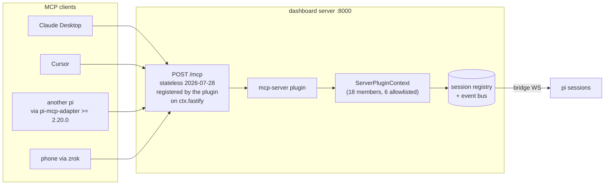

# Design — add-dashboard-mcp-server

## Context

Protocol revision `2026-07-28` is **Current** per
<https://modelcontextprotocol.io/specification/versioning>. Conformance rules
for a server on this revision, quoted verbatim from the transport page:

> - HTTP GET or DELETE to the MCP endpoint: respond with `405 Method Not Allowed`.
> - An `Mcp-Session-Id` header on a request: ignore it, and do not mint or echo session IDs.
> - A `Last-Event-ID` header: ignore it; streams are not resumable.

The changelog entries this change depends on, also verbatim:

> 1. Remove protocol-level sessions and the `Mcp-Session-Id` header … Servers
>    that need cross-call state use explicit, server-minted handles passed as
>    ordinary tool arguments (SEP-2567).
> 2. Make MCP stateless: remove the `initialize`/`notifications/initialized`
>    handshake … (SEP-2575).
> 3. Add `server/discover`: servers **MUST** implement this RPC …
> 4. Replace the HTTP GET endpoint and `resources/subscribe`/`resources/unsubscribe`
>    with `subscriptions/listen`: a single long-lived POST-response stream …

Example request shape:

```
POST /mcp HTTP/1.1
MCP-Protocol-Version: 2026-07-28
Mcp-Method: tools/call
Mcp-Name: send_prompt
Authorization: Bearer <per-session MCP token>

{"jsonrpc":"2.0","id":1,"method":"tools/call","params":{
  "name":"send_prompt",
  "arguments":{"sessionId":"…","text":"run the tests"},
  "_meta":{
    "io.modelcontextprotocol/protocolVersion":"2026-07-28",
    "io.modelcontextprotocol/clientInfo":{"name":"…","version":"…"},
    "io.modelcontextprotocol/clientCapabilities":{}
  }}}
```

## Architecture



## Decision 1 — Substrate: a curated allowlist over `ServerPluginContext`

**Chosen.** Of three candidate substrates, `ServerPluginContext` is the
plugin-facing API and the right layer. The tier split in the `pi-dashboard`
skill already rules out REST for command verbs ("REST remains a supported
compatibility shell"), and `GENERATED_VERBS` (**73** entries) is far too wide —
most are UI-shaped (`reorder_pinned_dirs`, `set_session_process_drawer`) or
transport plumbing (`subscribe`, `watch_files`, `worktree_init_subscribe`).

**Correction from cycle 1:** an earlier draft claimed this choice "dissolves the
curation problem." It does not. `ServerPluginContext` exposes **18** members
(`server-context.ts:192-244`), so selecting a subset **is** a hand-maintained
allowlist — it is simply a far smaller and better-typed one than 73 verbs. The
completeness test is therefore **required**, not avoided.

Proposed allowlist:

| `ServerPluginContext` member | MCP tool | Note |
|---|---|---|
| `sessionManager.listAll()` | `list_sessions` | read |
| `sendToSession(sessionId, text)` | `send_prompt` | `/`-prefix routes to extension-command dispatch |
| `spawnSession(opts)` | `spawn_session` | first-party trust gate |
| `abortSession(sessionId)` | `abort` | **corrected** — the general primitive |
| `abortSpawnedRun({…})` | *not exposed* | hard-kills *plugin-spawned* runs only; wrong shape for a general tool |
| `onEvent(handler)` | `subscriptions/listen` | delivers **all** sessions' events — the plugin MUST filter per subscription |

Deliberately excluded: `broadcastToSubscribers`, `registerPiHandler`,
`registerBrowserHandler`, `emitEventToSession`, `provide`/`consume`/`consumeAll`,
`eventStore`, `fastify`, `onSessionEnded`.

**Trust-gate caveat.** `spawnSession` / `abortSession` are gated to
*first-party plugins* — that is **plugin-registration** trust, not per-request
authorization. Once this in-repo plugin passes the gate, any valid token holder
reaches those verbs. This is not a scope increase over today's REST surface, but
it must not be described as a per-request security property.

## Decision 2 — Route ownership: the plugin registers its own route (RESOLVED)

**Cycle 1 overturned this decision.** The earlier draft asserted that plugins
cannot mount HTTP routes and that the runtime's convention is "core owns routes,
plugins contribute data." **Both claims are false.**

- `packages/dashboard-plugin-runtime/src/server/server-context.ts:192` —
  `fastify: FastifyInstance` is a first-class member of `ServerPluginContext`,
  handed to every plugin.
- Nine plugins already register routes on it: `automation-plugin`
  (12+ routes under `/api/plugins/automation/*`), `kb-plugin`, `apple-tools`,
  `flows-plugin`, `blackhole-plugin`, `hermes-memory-plugin`,
  `subagents-plugin`, `flows-anthropic-bridge-plugin`.

The original grep searched `dashboard-plugin-runtime/src/server/*.ts` for a
*registration implementation* (`registerRoute`, `httpRoute`, `app.get`) and
concluded absence. The actual API is simply **handing over the Fastify
instance** — invisible to that pattern. Lesson recorded: absence-of-grep-hit is
not absence-of-capability.

**Consequence:** no new `SlotId`, no `slot-types.ts` change, no
`dashboard-plugin-runtime` change, and no public-API risk. The plugin registers
`POST /mcp` in its server entry like every other plugin. This is strictly
simpler than either option previously considered.

### Route-level 405 conformance is not automatic

The spec's 405 MUST needs explicit handling. Fastify's router falls through an
unmatched method to `setNotFoundHandler` (`packages/server/src/server.ts:1733`),
which in `--dev` proxies to Vite and returns **200 with SPA HTML** — a silent
conformance failure that looks like success. `GET`/`DELETE` on `/mcp` MUST be
registered explicitly to return 405.

## Decision 3 — Collision avoidance with `pi-mcp-adapter` (RESOLVED)

| Surface | Collides | Mitigation |
|---|---|---|
| `/mcp` HTTP path on :8000 | **No** | The adapter's `/mcp` is a **pi slash-command** (`index.ts:500,511,515`; `commands.ts:528,588` — `Usage: /mcp ${subcommand}`, `createMcpPanel`), not an HTTP route. *(Cycle-1 correction: an earlier draft cited `config.ts`, whose `/mcp` tokens are remote-server URL suffixes and `.pi/mcp.json` filenames — wrong file, wrong count.)* |
| `command-route` claim `"/mcp"` | **Conditional** | The adapter registers no dashboard `command-route` claim, so there is no live claimant today. Still avoid `command: "/mcp"` — the pi-side command name is user-visible and the collision would be confusing. Use `/mcp-server`. |
| OAuth callback port | **Avoided** | The adapter binds its own callback server (`getConfiguredOAuthCallbackPort`). Avoided entirely by **not implementing OAuth**. |
| `~/.pi/agent/mcp.json` | **Yes — now in scope** | `apple-tools` already writes `mcpServers.iMCP`. Our entry MUST use a distinct name and reuse the merge-only + atomic-rename + refuse-unparseable discipline of `packages/apple-tools/src/mcp-config.ts`. |

**Narrowed rule of thumb** (the earlier "do not name anything `mcp`" was
overbroad and self-violated by `/mcp` and `mcp-server-plugin`): *do not claim the
`/mcp` **slash command**, and do not bind an OAuth callback port.*

## Decision 4 — Reentrancy: mint a per-session MCP token (RESOLVED)

**Cycle 1 overturned the original guard.** It specified "refuse when the caller's
own `sessionId` equals the target," premised on "a per-session bearer supplies
[caller identity]." No such credential existed:

- `packages/server/src/pairing/paired-devices.ts` — `PairedDevice` is
  `{id, label, tokenHash, createdAt, lastSeen}`. **Device-scoped, no session
  binding.**
- `packages/server/src/auth/bearer-auth.ts:41-44` — the hook sets only
  `request.isAuthenticated = true`, discarding even the device id.

So the server could not know a caller's session, and self-reported identity is
spoofable — the same objection that ruled out hop-count.

**Resolution: mint a per-session MCP token.** Session-scoped credentials make the
caller's originating session **server-known and unspoofable**, which is the only
basis on which self-target refusal is a real guard rather than theatre. This adds
a credential type but not OAuth, so the no-OAuth constraint holds.

| Property | Paired-device bearer | Per-session MCP token |
|---|---|---|
| Scope | device | session |
| Caller identity derivable | no | **yes** |
| Revocation | row delete | row delete + session end |
| Self-target refusal possible | no | **yes** |

**Client without a session.** Claude Desktop and Cursor are not pi sessions and
have no originating session id. Such callers authenticate with a device-scoped
token, can never collide with a target, and are unaffected by the guard. The
guard binds only session-originated callers — i.e. exactly the loop hazard.

Aggravating factor that makes this worth the cost: `sendToSession` routes
`/`-prefixed text to **extension-command dispatch**, so an unbounded loop drives
commands, not just chat.

## Decision 5 — `mcp.json` provisioning (IN SCOPE) + the version-floor gap

`~/.pi/agent/mcp.json` writes are **in scope** for this change (cycle-1
resolution of a scope contradiction: the spec bound the writes while the proposal
deferred them). The dashboard provisions its own entry so a local pi session can
reach `/mcp`.

The trap worth recording:

> **Legacy remains the default.** — `pi-mcp-adapter` 2.20.0 CHANGELOG

An entry written without `protocolVersion` gets the *legacy* handshake
(`initialize` + `Mcp-Session-Id`) against a `2026-07-28` server spec-bound to
ignore both. Our entry MUST set `protocolVersion: "auto"` (negotiate with
conservative fallback) or pin `"2026-07-28"` (fail loudly, never degrade).

**Version floor gap.** `packages/shared/src/recommended-extensions.ts:478`
declares `requires: { piExtensions: ["pi-mcp-adapter"] }` with **no version
floor**, and `PluginRequirements` (`manifest-types.ts:90-105`) has only
`piExtensions` / `binaries` / `services` / `paths` — no field expresses one. The
locally installed adapter is **2.19.0**, below the `>= 2.20.0` this change needs.
Either extend `PluginRequirements`, or surface the floor as a documented
prerequisite and a runtime probe. This gap likely affects other plugins.

## Statelessness vs. `subscriptions/listen`

These are reconciled, not contradictory. `2026-07-28` is stateless at the
**protocol** layer — no session id, no handshake, no cross-request server memory
required to interpret a request. `subscriptions/listen` is a single long-lived
**response stream scoped to one request**; its subscription lives for exactly
that request and dies with it. No state is shared *between* requests, and no
request depends on a prior one. The spec deltas state this explicitly so the two
requirements do not read as conflicting.

## Auth boundary

`createNetworkGuard` (`packages/server/src/auth/localhost-guard.ts`) allows any
`isGenuinelyLocal` request **with no credential**. That is incompatible with
"credential required per request" for a tunnel-reachable tool endpoint.

**Resolution:** `/mcp` opts *out* of the loopback allowance and requires a valid
token on every request, including loopback. `createNetworkGuard` is unchanged for
every other route. The earlier phrasing "keep localhost-guard intact" was
imprecise and is corrected: the guard is retained *elsewhere*; `/mcp` is
deliberately stricter.

## Risks

| Risk | Mitigation |
|---|---|
| New credential type expands the auth surface | `security-hardening` pass; reuse the opaque + SHA-256-at-rest + revocation-by-row-delete pattern already proven in `paired-devices.ts` |
| 405 conformance silently passes as 200 SPA HTML in dev | Explicit `GET`/`DELETE` registration + a spec scenario asserting 405 in **both** dev and production modes |
| Allowlist drifts from the 18-member context | Completeness test asserting every advertised tool resolves to a handler (the `denylist.ts` lesson: naive codegen "would emit a WS helper that **silently fails**") |
| `onEvent` leaks all sessions to any subscriber | Per-subscription filtering is a spec requirement, not an implementation detail |
| Local adapter is 2.19.0 | Documented prerequisite + runtime probe; version floor per Decision 5 |
| Ecosystem clients still speak 2025-06-18 / 2025-11-25 | Decide explicitly whether to serve legacy alongside |

## References

- Changelog <https://modelcontextprotocol.io/specification/2026-07-28/changelog> — SEP-2567, SEP-2575, `server/discover`, `subscriptions/listen`
- Transport <https://modelcontextprotocol.io/specification/2026-07-28/basic/transports/streamable-http>
- Versioning <https://modelcontextprotocol.io/specification/versioning> — `2026-07-28` is Current
- `pi-mcp-adapter` CHANGELOG 2.20.0 / 2.21.0 — <https://github.com/nicobailon/pi-mcp-adapter>
