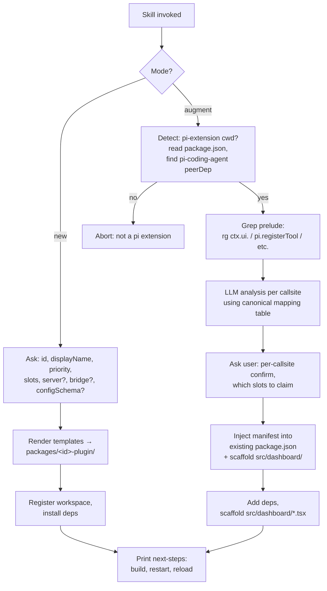

## Context

`packages/dashboard-plugin-runtime/` ships the loader, slot registry, and React context. `packages/demo-plugin/` exists as a fixture with two claims (`settings-section`, `tool-renderer`). The plugin manifest format and slot taxonomy are frozen for v0.x. What's missing is the human-and-agent on-ramp: a guided, repeatable way to create a new plugin in this monorepo, OR to retrofit dashboard plugin contributions onto an existing pi-extension project living elsewhere on disk.

The skill is the on-ramp. It compresses tribal knowledge — which TUI surface ports to which slot, where the manifest goes, how Vite picks it up, what `usePluginConfig` expects — into a runnable guide that a pi session executes step-by-step.

## Goals / Non-Goals

**Goals**

- Two modes, one skill: `new` (scaffold inside the dashboard monorepo) and `augment` (retrofit an existing pi extension on disk).
- Hybrid interaction: a single up-front `ask_user` batch collects every decision the skill needs, then the skill follows a prescriptive plan. No mid-flow surprises.
- Output of `new` mode is byte-identical (modulo id/displayName) to what `packages/demo-plugin/` looks like, so the demo fixture stays the canonical reference.
- Output of `augment` mode satisfies the manifest forward-compat contract from the archived design's "Future Work: external plugin discovery" section. The dashboard's eventual `node_modules` scan finds augmented extensions without re-running the skill.
- The TUI → dashboard mapping is documented in one place (the skill's `references/tui-to-dashboard-mapping.md`) and used by both modes (in `new` it informs which slots the user should pick; in `augment` it drives the per-callsite analysis).
- No new SDK package. Plugins import from `@blackbelt-technology/dashboard-plugin-runtime` and `@blackbelt-technology/pi-dashboard-shared` directly. The skill documents this surface as the "SDK."

**Non-Goals**

- ts-morph or any TS AST analysis. Grep + LLM reasoning is the analyzer.
- Modifying the runtime behavior of an augmented pi extension. Augment is purely additive: the dashboard surface is a parallel subtree under `src/dashboard/`.
- A new SDK package. (User decision.)
- A CI hook, autotest runner, autopublisher, or release-cut integration.
- Hot-reload of scaffolded plugins. The user runs `npm run build` + `POST /api/restart` after the skill finishes; this matches the rest of the dashboard's plugin lifecycle.
- A bridge entry by default. The user must explicitly opt in (the bridge is a real pi extension that loads in every pi session — non-trivial blast radius).

## The two modes



## Skill package layout

```
   packages/dashboard-plugin-skill/
   ├─ package.json
   │   ├─ name: @blackbelt-technology/pi-dashboard-plugin-skill
   │   ├─ pi: { skills: [{ name: "dashboard-plugin-scaffold",
   │   │                   path: "./skills/dashboard-plugin-scaffold/SKILL.md" }] }
   │   └─ private: false
   ├─ skills/
   │  └─ dashboard-plugin-scaffold/
   │     ├─ SKILL.md                            (entry — hybrid markdown)
   │     ├─ references/
   │     │  ├─ slot-taxonomy.md                 (per-slot recipe)
   │     │  ├─ manifest-schema.md               (PluginManifest / PluginClaim)
   │     │  ├─ plugin-context-api.md            (usePluginConfig, useSessionState…)
   │     │  ├─ server-context-api.md            (ServerPluginContext)
   │     │  ├─ tui-to-dashboard-mapping.md      (the canonical mapping table)
   │     │  └─ build-integration.md             (Vite plugin behavior, dev vs prod)
   │     ├─ templates/                          (text templates with {{ id }} placeholders)
   │     │  ├─ plugin-package.json.tmpl
   │     │  ├─ client.tsx.tmpl                  (per-slot stub, included by name)
   │     │  ├─ server-index.ts.tmpl
   │     │  ├─ bridge-index.ts.tmpl
   │     │  ├─ configSchema.json.tmpl
   │     │  ├─ tsconfig.json.tmpl
   │     │  ├─ vitest.config.ts.tmpl
   │     │  ├─ README.md.tmpl
   │     │  └─ test/index.test.ts.tmpl
   │     └─ scripts/
   │        ├─ grep-tui-surface.sh              (grep prelude for augment)
   │        └─ register-workspace.sh            (idempotent npm workspace add)
   └─ README.md                                 (how to install the skill,
                                                 how to invoke from pi)
```

## Mode `new` — interactive contract

Single up-front `ask_user` batch:

| Question | Method | Notes |
|---|---|---|
| Plugin id | input | Validated kebab-case, must not collide with existing `packages/<id>-plugin` |
| Display name | input | Free text |
| Priority | input | Default 100; integer; lower = earlier |
| Slot claims | multiselect | The 10 React slots (sidebar-folder-section, session-card-badge, session-card-action-bar, content-view, content-header-sticky, content-inline-footer, anchored-popover, command-route, settings-section, tool-renderer) |
| Server entry? | confirm | Default true |
| Bridge entry? | confirm | Default false (high blast radius) |
| Config schema? | confirm | Default true; scaffolds an empty schema |

After the batch, the skill is fully prescriptive: render every template, write every file, register the workspace, print next-steps. No further prompts.

Per-slot stub generation: the skill's `client.tsx.tmpl` is **structured as a section per slot**. The renderer keeps only the sections matching the user's `multiselect`. Each section is annotated with the prop contract (`SlotProps<SlotId>` from `pi-dashboard-shared`) and a TODO marker for the implementor.

## Mode `augment` — interactive contract

Phase 1 — preflight and grep prelude (no prompts):

```bash
# Detect
test -f package.json || abort
jq -r '.peerDependencies["pi-coding-agent"] // .dependencies["pi-coding-agent"]' package.json
# Grep
rg --json -n 'ctx\.ui\.(select|input|confirm|editor|custom|multiselect)\b' || true
rg --json -n 'pi\.registerTool\b' || true
rg --json -n 'registerExtensionUI\b|pi\.events\.emit\("ui:list-modules"' || true
rg --json -n 'ctx\.fork\(|pi\.newSession\(|ctx\.switchSession\(' && warn "session-replacement calls — see bridge invariant"
```

Output is a callsite list keyed by file:line.

Phase 2 — analysis (LLM, driven by skill markdown):

For each callsite, the skill instructs the agent to:
1. Read ±20 lines of context.
2. Match the callsite to a row in `references/tui-to-dashboard-mapping.md`.
3. Emit a port proposal: `{ file, line, callsite, mappedSlot, componentSuggestion, notes }`.

The skill collates proposals into a markdown table for review.

Phase 3 — confirmation:

```
ask_user method=multiselect
  title="Which TUI callsites should port to the dashboard?"
  options=[<one per proposal, formatted as `file:line — callsite → slot`>]
```

Plus a final confirm: *"Proceed with manifest injection and scaffold?"*

Phase 4 — scaffold (no prompts):

1. `npm install --save-dev @blackbelt-technology/dashboard-plugin-runtime @blackbelt-technology/pi-dashboard-shared` (the de-facto SDK).
2. Inject the `pi-dashboard-plugin` manifest into `package.json` (using `jq` for JSON-safe edit). Manifest claims are derived from the confirmed proposals.
3. Create `src/dashboard/client.tsx` with stubs for each confirmed claim.
4. Create `src/dashboard/server.ts` only if any proposal needed server hooks (e.g. a slot that requires REST routes).
5. Create `dashboard.config.json` if the user has migratable settings.
6. Print next-steps: build the package, install the package as a dashboard plugin (the dashboard's eventual `node_modules` scan; for now: `npm link` or `git clone` into `packages/`).

## Forward-compat contract (augment)

The archived design's "Future Work: external plugin discovery" section commits the dashboard to eventually scanning `node_modules/*/package.json` and `node_modules/@*/*/package.json` for `pi-dashboard-plugin` fields. The skill's manifest output MUST satisfy:

1. The manifest field is at top-level of `package.json`. (Not nested under `pi`, not in a separate file.)
2. All paths in the manifest (`client`, `server`, `bridge`, `configSchema`) are package-relative. No absolute paths. No `..` traversal outside the package root.
3. The manifest does not reference workspace-only constructs (no `workspace:*` deps, no monorepo-relative imports in client/server entries).
4. The package's `main`/`exports` declare `./client`, `./server`, `./bridge` subpaths matching the manifest, so node-resolution works in both monorepo and `node_modules` layouts.
5. The skill emits a `pi-dashboard-plugin.requiredApi` field set to the current `^0.x` (locked at scaffold time) so the future loader knows which API contract the plugin pinned.

A test in `dashboard-plugin-skill` (run via `npm test --workspace dashboard-plugin-skill`) MAY validate items (1)-(5) against a sample augmented project to keep the contract honest.

## TUI → dashboard mapping (canonical)

| TUI surface | Status today | Port action |
|---|---|---|
| `ctx.ui.select / input / confirm / editor` | Already-dashboard-aware via PromptBus → DashboardDefaultAdapter | None. Skill reports as "already works in dashboard." |
| `ctx.ui.multiselect` (bridge-patched) | Already-dashboard-aware via prompt-bus → MultiselectRenderer | None. |
| `ctx.ui.custom<T>()` | No-op in pi 0.70 RPC mode | Required port. Skill suggests `content-view` (full-screen) or `anchored-popover` (floating) based on context heuristics. |
| `pi.registerTool({ name: X })` | Tool registration; renders default tool card | Optional port. Claim `tool-renderer` for a richer card. Skill emits a `<DemoToolRenderer>`-shaped stub keyed by `toolName: X`. |
| `pi.events.on("ui:list-modules")` (extension-UI probe) | Already-dashboard-aware via `extension-ui-system` Phase 1+2 | None — but recommend the user verify they've returned descriptors of every relevant kind. |
| Reads from `~/.pi/agent/settings.json` directly | No dashboard reactivity | Migrate to `plugins.<id>.*` via `usePluginConfig<T>()` + a `configSchema.json`. Skill scaffolds a settings-section stub. |
| Custom long-running TUI loop or non-prompt-bus visual | Pure-TUI only | Required React port. Skill flags as `content-view` or `content-inline-footer` depending on placement. |

## Decisions

### 1. One skill, two modes, one batch

A single skill keeps the on-ramp discoverable. Modes branch on the first question of the up-front `ask_user` batch. There is no separate `dashboard-plugin-new` and `dashboard-plugin-augment` skill.

### 2. No new SDK package

User decision (Q1). The skill adds `dashboard-plugin-runtime` + `pi-dashboard-shared` as deps directly. The "SDK" is the public exports from those two packages, documented in `references/plugin-context-api.md` and `references/server-context-api.md`. If a future change consolidates the surface, the skill switches its `npm install` line — no other change needed.

### 3. Hybrid analyzer (grep prelude + LLM reasoning)

User decision (Q2). The skill markdown drives the agent through the analysis. ts-morph would be more accurate but introduces tooling weight that doesn't pay back for the augment frequency we expect (a handful of times per author).

### 4. Bridge entry off by default

A bridge entry is a real pi extension that loads in every pi session. Adding one to a plugin that doesn't need it is high blast radius. Default off; explicit opt-in.

### 5. The demo plugin remains the reference

Mode `new` produces output that mirrors `packages/demo-plugin/` (modulo id/displayName/slots). When `demo-plugin` is deleted (per its own deletion policy: once a real plugin extraction lands), the skill's templates take over as the canonical reference.

### 6. Augment is purely additive

The skill never removes, rewrites, or moves existing TUI code. The dashboard surface lives in `src/dashboard/`; the original code keeps working in pure-TUI sessions. This minimizes review burden and lets the user roll back by deleting `src/dashboard/` and the manifest field.

### 7. Forward-compat enforced at scaffold time, not runtime

The skill emits a manifest that satisfies the future `node_modules` scan contract. There is no runtime validator — the future change will add that. The skill is the gatekeeper for first-batch adopters.

## Open Questions

1. **Should the skill auto-publish the augmented project to npm?** No (user decision Q6 — none specified). User runs publish themselves.
2. **How to handle a plugin author who picks both `content-view` and `command-route` claims for the same view?** Templates assume the canonical pairing (`command-route` registers the route; the route's `component` value names a `content-view` claim). Skill emits both claims with matching component names automatically.
3. **What about plugins that need a custom WebSocket message type?** Server entry stub includes a `registerBrowserHandler(type, handler)` example; the skill points the user at `dashboard-plugin-loader/spec.md` Requirement 3 for the contract.
4. **Test coverage for the skill itself?** A `vitest` test in `dashboard-plugin-skill` runs the templates with a synthetic answer set and asserts the output tree matches a fixture. Lightweight; doesn't run pi.

## Out-of-Scope Explicitly

- Marketplace / discovery UI in the dashboard for installed plugins.
- A "remove plugin" reverse skill.
- IDE integration (VS Code task, etc.).
- Generating tests for the *generated* plugin beyond the starter test.
- Generating types for the user's existing extension's domain (if their `pi.registerTool` uses bespoke schemas, the user wires those manually).
