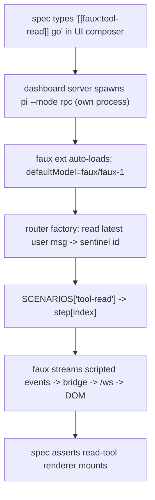

# Design — Faux-backed model round-trip E2E (per-session routing)

## Context

The browser-E2E harness (`tests/e2e/`, Docker container on `:18000`) proves
`spawn → card` but never a model round-trip, because the harness is key-free by
design. The goal: drive `prompt → faux model → streamed events → rendered DOM`
in a real browser, deterministically, with no LLM key — and let DIFFERENT specs
(and, in principle, different concurrent sessions) select DIFFERENT scripted
scenarios.

## Constraint that shapes everything

In E2E the **test never spawns pi** — the dashboard server does, in response to
a UI click. The server's spawn argv (`buildHeadlessArgs` →
`sessionFlagsToArgv`) emits only `--mode rpc` + session/`--model` flags; it does
NOT forward `-e <extension>`. So neither the extension nor a per-spawn scenario
env can be injected through the spawn API without changing production code.

Two facts unlock a no-server-change path:

1. pi auto-discovers global extensions from `~/.pi/agent/extensions/*/index.ts`
   (docs/extensions.md) — no `-e`, no project-trust gate (global locations are
   trusted).
2. pi honours `defaultModel` from config — so `faux/faux-1` is selected with no
   `--model` flag.

Both are seeded into the container behind the already-shipped `PI_E2E_SEED`
gate, exactly like the existing fake-OAuth + trustedNetworks seed.

## Decision 1 — Per-session scenario routing via prompt sentinel

**Chosen:** the spec encodes the scenario in the prompt it types, e.g.
`[[faux:tool-read]] go`. The faux fixture resolves the scenario from the latest
user message.



Why per-session falls out for free: each session is its own `pi --mode rpc`
process → its own extension module instance → its own faux registration +
`state`. The integration test already asserts cross-session isolation. So
routing needs NO shared coordinator; each process answers its own prompts.

### Router factory mechanics

The faux provider supports factory steps `(context, options, state, model) =>
AssistantMessage` and `appendResponses()`. Replace the static
`setResponses(scenario.script)` with one self-perpetuating router:

```
function router(context, options, state, model) {
  registration.appendResponses([router]);          // stay alive for next call
  const { id, stepIndex } = resolveActiveStep(context);  // sentinel + turn count
  const scenario = SCENARIOS[id] ?? SCENARIOS[FAUX_SCRIPT_FALLBACK] ?? NO_SCENARIO;
  const step = scenario.script[stepIndex] ?? scenario.script.at(-1);
  return typeof step === "function" ? step(context, options, state, model) : step;
}
registration.setResponses([router]);
```

- `resolveActiveStep`: walk `context.messages` backward for the last `user`
  message whose text matches `/\[\[faux:([\w-]+)\]\]/`; that captures `id`.
  `stepIndex` = count of `assistant` messages AFTER that user message. This maps
  conversation position → scenario step deterministically, so multi-step
  scenarios (`ask-select-roundtrip`: tool-call then post-answer follow-up) work
  unchanged — the existing factory steps that read `lastToolResultText(context)`
  still fire.
- No sentinel present → fall back to `FAUX_SCRIPT` env (default scenario),
  preserving the current Vitest + VM-smoke behaviour byte-for-byte.

### Alternatives rejected

- **R2 cwd/folder-keyed scenario.** Needs N pinned fixture folders + heavier pin
  UX; coarser than per-prompt. Rejected.
- **R3 per-spawn env via server passthrough (Option B).** Would thread a
  scenario param through the dashboard spawn API into `buildSpawnEnv` —
  production-code surface + an OpenSpec change to the spawn argv/env contract,
  the very thing the faux-integration Open Question flagged as a cost. Rejected
  for first cut; sentinel routing needs none of it.

## Decision 2 — Stage the extension, don't pass `-e`

**Chosen:** entrypoint copies the fixture to
`~/.pi/agent/extensions/faux-provider/index.ts` (+ sibling `faux-scenarios.ts`)
and seeds `defaultModel`. Subdir form is required because the extension imports
`./faux-scenarios.js`; a flat single-file copy would break that import.

Resolution risk: the fixture imports `@earendil-works/pi-ai`. The image installs
the published pi (`npm install -g …/pi-coding-agent`), which bundles pi-ai; the
fixture pins no pi-ai version and resolves against the bundled copy — the same
way the shipped `qa/` smoke loads the identical fixture against installed pi. A
verification step asserts the extension actually loads in-container (no "No API
provider registered for api: faux").

## Decision 3 — Sentinel must not poison assertions

Specs assert on the **scripted reply** (e.g. `PLAIN_TEXT_MARKER`, the tool
renderer testid), never on the echoed prompt, so the visible `[[faux:…]]`
sentinel in the user bubble is inert. No need to strip it.

## Open questions

- Keep the sentinel human-visible in the prompt, or hide it (zero-width / a
  dedicated composer affordance)? First cut: visible plain text — simplest,
  inert for assertions.
- Do we want a single combined `faux-roundtrip.spec.ts` or one spec per
  scenario family (text / tool / ask)? Leaning one-per-family for clear failure
  attribution.
