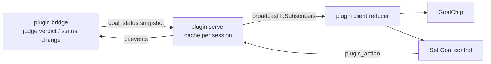

# Goal Continuation Plugin — UI Plan

Visual companion to `proposal.md` / `design.md`. Open `goal-ui.html` in a browser
for the rendered states (toggle theme to check both palettes).

Scope: the two **plugin-owned client surfaces** named in the spec
(`specs/pi-dashboard-goal-plugin/spec.md`). No shell edits — both surfaces read
the plugin's own `goal_status` snapshot via a plugin-local reducer (Decision 3).

## Real card anatomy (captured from `packages/client/src/components/SessionCard.tsx`)

Mockup tokens copied verbatim from source + `index.css`, not invented:

- Card container (L489): `px-4 py-3 rounded-xl shadow-md shadow-[--shadow-card] border border-[--border-subtle] bg-[--bg-tertiary]`.
- **Line 1** (L494): status icon + name (`text-sm truncate flex-1`) + age (`text-[11px] --text-muted`).
- **Line 2** (L514): model (`text-[12px] --text-tertiary`) + `ActivityIndicator` + **queue-count badge** + spacer + context bar + cost.
- Existing chip convention (queue badge, L529): `rounded-full px-1.5 text-[10px] bg-blue-500/15 text-blue-300 border border-blue-500/30`.
- Existing tiny-action-button convention (L727–766): `text-[9px] px-1 py-px rounded border border-<c>-500/30 text-<c>-400 hover:bg-<c>-500/10`.

→ **GoalChip drops onto Line 2** beside the queue badge (reuse the chip convention).
→ **Set Goal control** is an expandable row below Line 2, separated by a `border-t border-[--border-subtle]`, using the tiny-action-button convention for pause/resume/clear.

## Surface 1 — `GoalChip` (status, read-only)

| Aspect | Plan |
|---|---|
| Slot | Line 2 of the card, beside the queue-count badge (`session-card-badge`). Mirrors `JjWorkspaceBadge.tsx` + the queue-badge chip. |
| Gate | Predicate-gated: renders `null` when no `goal_status` snapshot exists (spec: "No goal set → chip hidden"). |
| Component | New `GoalChip.tsx`; reuse the `useIsLightTheme()` pattern from `JjWorkspaceBadge` for theme-reactive palette. |
| Data | Plugin client reducer keyed on plugin `goal_status` message — NOT the shared union. |
| Tooltip | Full goal text + `turnsUsed/maxTurns` + last verdict/reason. |

### State → render map

| `status` | reason/verdict | Chip | Palette |
|---|---|---|---|
| `active` (running) | verdict `continue` | `● Pursuing n/m` (dot pulses) | indigo |
| `active` (idle, just set) | — | `● Goal active 0/m` | indigo |
| `paused` | `budget` | `⏸ Paused · budget` | amber |
| `paused` | `reload` | `⏸ Paused · reload` | amber |
| `paused` | `unparseable` | `⏸ Paused · stuck` | amber |
| `done` | verdict `done` | `✓ Achieved` | green |
| `cleared` / none | — | (nothing) | — |

Palettes match the jj badge convention: translucent tint background, 300-shade
text in dark / 700-shade in light.

## Surface 2 — Set Goal control (read-write)

| Aspect | Plan |
|---|---|
| Slot | Session-actions / content-view region (alongside `SessionFlowActions`). |
| Empty state | Textarea + **Set goal**; footnote shows judge model + `maxTurns`. |
| Active state | Goal text (read-only) + meta (turns, last verdict, model) + **Pause / Mark done / Clear / Subgoal**. |
| Paused state | Goal text + reason + **Resume / Raise budget / Clear**. |
| Dispatch | Every button + submit → `plugin_action` over the existing plugin action bridge (Decision 4). No `/goal` slash in v1. |

### Action → payload map

| UI action | `plugin_action` payload | Server effect |
|---|---|---|
| Submit empty | `{action:"set", goal}` | goal active, loop starts next idle window |
| Pause | `{action:"pause"}` | status `paused`, snapshot rebroadcast |
| Resume | `{action:"resume"}` | status `active` |
| Mark done | `{action:"done"}` | status `done` |
| Clear | `{action:"clear"}` | snapshot cleared, chip hides |
| Subgoal | `{action:"subgoal", goal}` | push subgoal (port semantics) |

Server `registerBrowserHandler("plugin_action", …)` applies the action, forwards
set/control intents to the bridge via `pi.events`, persists, then
`broadcastToSubscribers` a fresh snapshot → both surfaces update.

## Data flow (one snapshot, two readers)

## Open UI questions (for review)

1. **Subgoal UX** — is `＋ Subgoal` in scope for v1, or chip-only + set/pause/resume/clear? Spec lists subgoal under control actions; mockup shows it but it can be deferred.
2. **"Raise budget"** affordance on the paused-by-budget state — convenience, not in the spec's action list. Keep or drop?
3. **Control placement** — inline session-actions row vs. a collapsible panel. Mockup assumes inline; confirm against `SessionFlowActions` density.
4. **Chip label wording** — `Pursuing` vs `Continuing` vs `Working` for the active-running state.
