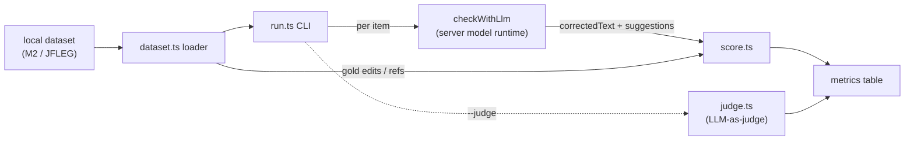

# Design — grammar correction eval

## Context

We score the `llm` grammar backend (`checkWithLlm`) for correction *quality*, offline. The
repo already has a diagnostic-eval precedent: `packages/kb/src/eval.ts` — a pure `evaluate()`
over a golden JSON, invoked from a CLI, used to gate ranking changes manually (not in CI).
This harness follows the same shape for a harder problem (grammatical error correction, GEC).

## Goals / Non-Goals

- **Goals:** a deterministic, unit-tested scorer; a live-run CLI reusing the server's
  OAuth-aware model runtime; standard GEC metrics; cheap + bounded runs; no vendored corpora.
- **Non-Goals:** CI gating on live output, LanguageTool scoring, ERRANT-grade error typing,
  auto-tuning, a Hungarian benchmark.

## Decisions

### 1. Scorer: simplified MaxMatch/M2, not ERRANT

Edit-level P/R/F0.5 is the GEC-standard quality metric. The canonical scorers are MaxMatch
(M2, Dahlmeier & Ng 2012) and ERRANT (Bryant 2017). ERRANT adds spaCy-based error-type
classification and is Python-only — a heavy, cross-language dep we will not pull in.

**Decision:** implement a **span-level MaxMatch/M2 scorer in TypeScript**. Gold edits come
from the dataset's M2 annotation; system edits are derived by token-level Levenshtein
alignment of `original → correctedText`. An edit matches gold when its span + correction
string agree. Score with **F0.5** (β=0.5 → precision weighted 2×, the GEC convention: a wrong
"fix" is worse than a missed one). We do **not** classify error types.

- **Consequence / risk:** our numbers will not be bit-identical to the official M2 scorer
  (which does phrase-level edit merging via a search over alignments). We accept a documented
  approximation and **validate against a handful of hand-checked M2 lines** in unit tests
  (doubt-driven-review). Absolute values are less important than *relative* deltas between runs.

### 2. Two edit sources, scored separately

The backend emits two things the user sees: `correctedText` (apply-all) and `suggestions[]`
(per-item panel). These can disagree. We score both:

- **correctedText edits** (§1 alignment) → the apply-all quality (headline F0.5).
- **suggestion edits** — the model's own `{original → replacement}` spans matched to gold →
  the panel quality (suggestion P/R). This catches a model that "fixes" the full text well
  but emits junk/duplicate/misaligned suggestions, or vice-versa.

### 3. Reference metrics

- **Edit-distance improvement** = `dist(input, ref) − dist(output, ref)`, at token and char
  level, normalized by input length. Positive = net improvement; negative = the model made it
  worse. For **JFLEG** (4 fluency references/sentence) we take the **best reference** per item
  (max improvement), approximating the fluency intent without a full GLEU implementation.
- **Over-correction rate** = of the dataset items with **no gold edit** (already-correct
  sentences), the fraction where `output !== input`. Requires clean sentences in the set; the
  loader flags no-edit items so this metric is computed only over them.
- **Latency** = wall-clock ms per `checkWithLlm`, reported p50/p95.

### 4. Datasets loaded, not vendored

JFLEG (CC BY-NC-SA / research) and BEA-2019 W&I+LOCNESS (registration + license) must not be
committed. The loader reads a **local path** the user downloads themselves; docs list the
sources. The repo ships only ~10 synthetic M2 fixture lines for scorer unit tests, clearly
labeled as fixtures (not a benchmark). Supported formats: **M2** (edit-level metrics) and
**JFLEG** (`.src` + N `.ref` files; edit-distance/over-correction). A `format` seam allows a
future hu M2 set.

### 5. LLM-as-judge is opt-in and non-authoritative

`--judge <provider/model>` runs a second model that scores each `(input, output, gold)` on a
fixed rubric (correctness 1–5, over-correction y/n) at temperature 0. It is:
reported **separately**, **never** part of any pass/fail, off by default, and cost-capped by
the same `--limit`. Rationale: it is itself non-deterministic and costs tokens; it is a
sanity signal, not a metric of record.

### 6. Cost + determinism controls

- `--limit N` (default small, e.g. 50), bounded concurrency (default 4), `--dataset <path>`,
  `--format m2|jfleg`, `--provider/--model` (default: current `config.grammar.llm`), `--judge`.
- `--dry-run` runs the scorer over the dataset's gold-vs-gold (or a canned system output) with
  **no model calls** — a fast self-test that the loader + scorer agree, usable in CI-adjacent
  smoke without spend.
- The live run reuses the server's `getModelRegistry()` + `streamSimple` seam (the same fixed
  OAuth path `checkWithLlm` already uses) — no second credential mechanism.

### 7. Location

Under `packages/server/src/grammar/eval/` (the backend it scores lives there) with a CLI entry
and a `grammar:eval` script in `packages/server/package.json`. Mirrors kb's `eval.ts` + CLI.

## Risks / open questions

- MaxMatch approximation fidelity (mitigated by §1 fixtures).
- One extra "Other" metric was requested but left undescribed — tracked in tasks as an open
  slot; fold in once specified.
- BEA-2019 test set has **no public gold**; use the **dev** split (gold available) for scoring.
