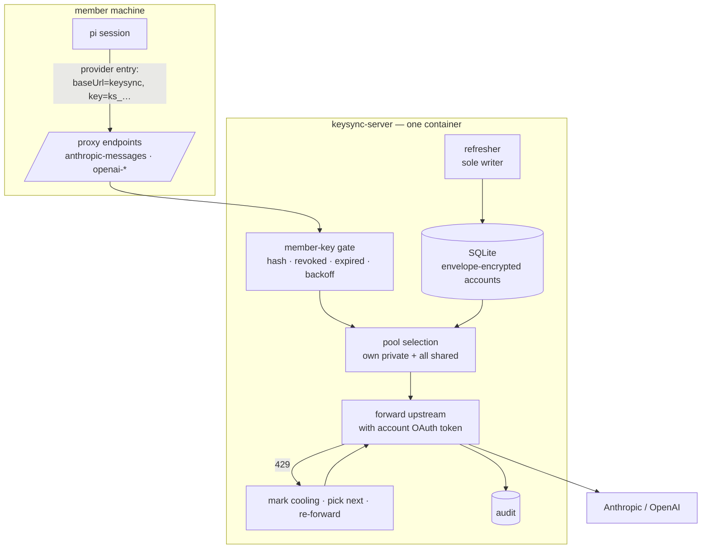
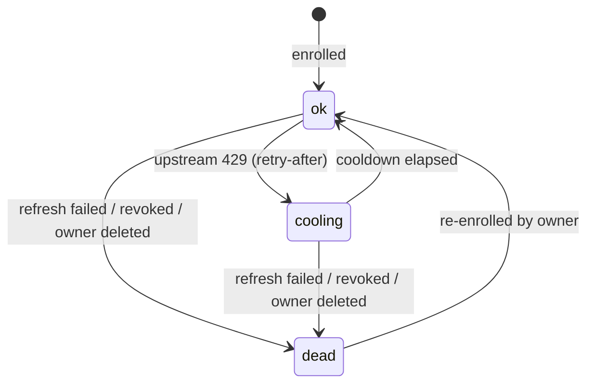

# Design — keysync

## Architecture



The member's machine holds one secret: a keysync key. Provider OAuth tokens exist only inside the container and in its database.

## Source facts this design rests on

| # | Fact | Source |
|---|---|---|
| F1 | pi can route a provider through an arbitrary `baseUrl` with an `api` type of `anthropic-messages` / `openai-completions` / `openai-responses`, plus custom headers | `docs/models.md` — Provider Configuration |
| F2 | Extensions may register providers, including a complete pi-ai `Provider` with its own auth resolution | `docs/custom-provider.md:33` |
| F3 | `PI_CODING_AGENT_DIR` overrides the config directory, so a login can be run in isolation | `docs/environment-variables.md`; `config.js:412` `getAgentDir()` → `:429` `auth.json` |
| F4 | `auth.json` is `Record<providerId, Credential>` — structurally one credential per provider | live `auth.json`; `core/auth-storage.js` |
| F5 | OAuth refresh-before-expiry with lock serialisation is a solved pattern here — but the lock is per **provider**, over exactly one credential (F4). Serialising per *account* across several accounts of the same provider is new code, not proven code. | `model-proxy/internal-auth-storage.ts` — `ensureFreshOAuth`, `refreshLocks`, `OAUTH_PROVIDER_MAP` |
| F6 | Issued-key lifecycle (sha256 hash, constant-time verify, revoked/expired/miss) is a solved pattern here | `model-proxy/api-key-store.ts` |
| F7 | Some model ids are unreachable over OAuth credentials and are filtered from availability | `model-proxy/oauth-compat.ts`; `internal-registry.ts` `canRouteModel` |

| F8 | **pi exposes no non-interactive login.** `pi auth` is read-only (`check`, `print-api-key`, `print-bearer-token`); there is no `login` subcommand in the bin. The only login surface is the TUI `/login` (`showLoginDialog`, present solely under `modes/interactive/`). The extension API's `oauth.login` is a callback an extension *implements* to register a provider — not a way to *invoke* a login. | `dist/cli.js`; `dist/cli/auth-command.js`; `dist/modes/interactive/interactive-mode.js`; `core/extensions/types.d.ts:1058-1067` |
| F9 | The refresh shape in F5 **discards a refresh response that arrives after its abort deadline** — it persists nothing. | `model-proxy/internal-auth-storage.ts`; `__tests__/internal-auth-storage-refresh.test.ts` |

F4 is why clients cannot hold a pool; F1 is why they do not need to. **F8 is why D10 no longer names a mechanism** — an earlier revision of this design asserted that enrolment could "run pi's own login against a scratch config dir". `PI_CODING_AGENT_DIR` (F3) was verified; the login command to point at it was never checked, and does not exist. F9 is why D7 deliberately diverges from the pattern F5 otherwise supplies.

## Decisions

### D1 — keysync is a provider-shaped proxy; credentials never leave the server

Members configure a provider entry whose `baseUrl` is keysync and whose key is a keysync-issued token (F1). keysync authenticates that key, selects a pooled account, and forwards upstream using the account's OAuth access token.

Three properties follow that credential sync could not provide at any price: provider tokens never rest on member disks; account health is observed rather than reported; and a 429 can be retried on another account *within the same request*.

*Alternative — sync credentials into each member's `auth.json`* (the previous revision of this design): viable, and verified viable down to pi's retry internals. Rejected because it forces plaintext provider tokens onto every laptop (`auth-storage.js:377` applies `resolveConfigValue` only to `credential.key`, so call-time resolution is impossible for OAuth), makes exhaustion an unverifiable client claim, and can only rotate one turn late.

*Alternative — a pi extension registering a complete provider whose `resolve()` consults a pooled store* (F2): keeps requests going direct to the provider, so no latency hop and no central traffic funnel. Rejected because the pool would then have to be readable on the client, reintroducing exactly the plaintext-on-laptop problem D1 exists to remove.

**Accepted cost:** keysync is on the latency path of every request and is a hard availability dependency. A keysync outage stops every member; credential sync would have degraded to offline-with-cached-credential instead.

### D2 — standalone deployable, not an extension of the dashboard's model-proxy

`packages/keysync-server` is its own npm package and container, depending on no dashboard package.

The dashboard's `model-proxy` already implements the closest thing to this (F5, F6) and extending it would be materially less code. Rejected because it would make pooled key availability conditional on someone running a dashboard, and couple credential service uptime to dashboard restarts — while this service must survive independently and start unattended after a reboot.

**Accepted cost, stated rather than hidden:** `api-key-store.ts`, `auth-gate.ts`, and `ensureFreshOAuth` get reimplemented. These are small, pure, and well-tested, so the duplication is bounded, but it is real. If they drift, the remedy is extracting the pure helpers into a shared workspace package — a refactor of currently-working dashboard code, deliberately out of scope for this change.

### D3 — accounts carry `private` / `shared` visibility; selection is provenance-blind

Every enrolled account belongs to the member who enrolled it and is either `private` or `shared`. A member's selection pool is *their own private accounts plus every shared account*, ordered, with no distinction between the two during selection.

This is what makes "rotation behaves identically for my own unshared key and an imported shared one" true by construction rather than by a rule that could be forgotten. Provenance governs display and revocation only.

*Alternative — one flat pool where everything is shared:* simpler, rejected because a member must be able to contribute an account for their own use without lending it; that is the whole content of the share toggle.

Unsharing removes the account from other members' pools, taking effect at their next request. There is no lease to expire, so no window in which a withdrawn account remains usable.

### D4 — per-member, per-provider primary

Each member marks one account per provider as primary. Selection prefers it while healthy and returns to it once it recovers from cooling.

Primary is per-member rather than global because members enrol their own accounts and will reasonably want their own subscription spent first. A global primary would silently direct everyone's default traffic at one person's account.

**A member's primary MUST be an account they own.** A shared account may be *rotated to*, but may not be pinned as a default. Two reasons, and the second is the load-bearing one:

- Sharing an account offers it as *overflow capacity*. Setting it as a primary converts that offer into someone's steady-state spend, which is not what the owner agreed to and is invisible to them.
- **It is what makes D14's admin kill-switch a guarantee.** With rotation off, selection is confined to the primary. If a primary could be a teammate's shared account, an admin flipping the global switch during a ToS incident would *not* stop traffic to the flagged shared account — members pinned to it would keep hammering it, in precisely the incident the switch exists for. Restricting primary to owned accounts makes "rotation off ⇒ no cross-account traffic" true by construction rather than by hope.

### D5 — rotation is per-request, first-hand, and lossless

```mermaid
sequenceDiagram
  participant C as member's pi
  participant K as keysync
  participant U as provider
  C->>K: request (member key)
  K->>K: select account A (primary, ok)
  K->>U: forward with A's token
  U-->>K: 429 + retry-after
  K->>K: A → cooling(retry-after); select B
  K->>U: forward SAME request with B's token
  U-->>K: 200 stream
  K-->>C: stream
```

The proxy observes the 429 itself, so there is no report to authenticate. Attempts are bounded; when a member's pool is exhausted the 429 is returned to the client carrying the **earliest** cooldown expiry across the pool — the soonest moment a retry could succeed. The whole path is gated by D14.

*Alternative — client-reported exhaustion with server-side verification probes* (the previous design's `suspect` state and probe scheduler): entirely unnecessary here. It existed only because the client made the request and could lie or be wrong. Recorded because the reasoning is worth keeping if the proxy is ever bypassed.

**Constraint:** re-forwarding requires the request body to be replayable. Requests are buffered before forwarding; responses stream through untouched. A rotation cannot occur once response bytes have reached the client, so a mid-stream failure surfaces as an error rather than a silent switch.

**Forward-time token freshness.** The selected account's access token may be expired or inside its pre-expiry window at selection time. The forwarding path does **not** refresh inline — that would put a second refresh trigger in the process and destroy D7's sole-writer property. Instead it asks the refresher to bring the account fresh and awaits that result, so every refresh still passes through the one writer. An upstream **401** therefore means the credential is genuinely bad, not merely stale, and marks the account `dead` (D6) — distinct from the 429 path, which marks it `cooling`.

**`retry-after` is clamped.** An upstream may return an implausibly long value; honouring it verbatim would remove an account from the pool for a week and, repeated across accounts, leave rotation nothing to rotate to. The cooldown is `min(retry-after, ceiling)`, with the same bounded default used when `retry-after` is absent.

### D6 — health states `ok` / `cooling` / `dead`



No `suspect` state, per D5. Cooldown derives from `retry-after` when supplied (clamped, per D5), otherwise a bounded default.

**When every account in a member's pool is cooling, selection returns 429 immediately** with the earliest cooldown expiry, rather than optimistically spending a request on the least-recently-cooled account. An optimistic attempt is overwhelmingly likely to 429 again, and doing so consumes rate-limit budget that the member's *next* request needs. Honest failure with an accurate `retry-after` is more useful to a client that already retries well.

**`dead` is recoverable only through an explicit path.** The `dead → ok` edge requires re-enrolment, but enrolment rejects an account already present in the pool — so without a way to remove one, `dead` would be terminal and the edge unreachable. The owner can therefore **delete** a dead account (returning it to the enrollable set) or **re-authorise** it in place. One of the two must exist for this state machine to be honest; both are cheap.

### D7 — single refresher, by construction

One refresher loop keeps every enrolled account's `refresh` alive, following the proven shape in F5: refresh ahead of expiry, serialise per account, persist the rotated token atomically.

Anthropic and openai-codex rotate `refresh` on use, so two refreshers racing revoke the token family for everyone — the highest-severity failure available in this system.

**The single-writer guarantee must hold across process instances, not merely within one.** "The account exists in exactly one place" is a claim about the *data*, not about the *processes*, and an earlier revision of this design conflated the two. A container orchestrator replacing an instance, a paused container resuming, or a second copy started against a restored database all produce two live refreshers, none of which an in-process guard observes. The guard is therefore a **lease row in the database itself** — acquired at startup, renewed on a heartbeat, and stolen only after expiry — so that the database, which is the shared resource, is also the arbiter. A stale lease left by a `SIGKILL` expires on its own rather than requiring manual clearing, which keeps R2's unattended restart intact.

**Late refresh responses are persisted, deliberately diverging from F5/F9.** The model-proxy pattern discards a refresh response that arrives after its deadline. That is safe there because a user can re-login locally. It is *not* safe here: with rotate-on-use providers the upstream may have already consumed the old refresh token, so discarding the new one leaves the stored credential permanently dead — and keysync's entire premise (R5) is that the owner's machine is off and cannot re-login. A refresh is therefore treated as **possibly-committed** rather than failed: a late response that validates is persisted, and only a response that is absent or invalid marks the account as needing re-authorisation, with the owner notified out-of-band.

**Unverified assumption, gated by a spike (see Migration step 0).** Enrolment creates a *new* authorization for an account the member may still be using locally. Whether that is safe rests on providers issuing independent, concurrently-valid grants per authorization — plausible (people run Claude Code on two machines) but **not verified**, and nowhere established in this repository. If a provider instead invalidates prior grants, the hazard runs in both directions: keysync's copy could be killed by the member's next local login, or the scratch login could silently kill the member's working local credential. This is measured before the refresher lands, not assumed.

*Alternative — the DB ownership lease with a fencing token from the previous design:* the lease returns above, in reduced form. The *fencing token* remains rejected: it defends against a stalled writer resuming mid-operation, whereas here the writer re-reads state before each refresh, so lease expiry plus re-read is sufficient.

### D8 — envelope encryption with a boot-supplied KEK

Accounts are stored as ciphertext under a per-account DEK, wrapped by a KEK supplied at boot (env or file). Plaintext exists only in process memory while forwarding or refreshing.

*Alternatives:* plaintext at rest — rejected, a database backup would leak every account. A split-key or human unseal ceremony — rejected, it is hostile to a service that must restart unattended, and D1 already concentrates the risk in the running host rather than the database.

**The KEK must not live beside the ciphertext, and the default deployment makes that easy to get wrong.** D12 puts everything in one container: the SQLite volume and the compose `.env` holding the KEK sit on the same host, and a naive backup captures both — at which point encryption at rest protects nothing. The threat model this defends is narrow and must be stated as such: *the database file alone*, exfiltrated or restored from a backup that excludes the environment. Operator documentation must require the KEK to come from outside the backup set (a secrets manager, an injected env at runtime, or a file explicitly excluded from backups), because the property does not survive the obvious setup.

**Honest ceiling:** the process necessarily holds plaintext to forward requests, so host compromise exposes the pool. Encryption at rest protects backups and a stolen disk, not a live intrusion. This is the counterpart to removing per-laptop plaintext: risk is concentrated in one hardened host instead of spread across N laptops. Losing the KEK is unrecoverable — the KEK is deliberately not escrowed beside the ciphertext, which would nullify it.

### D9 — revocation is key revocation

Removing a member revokes **every** keysync key they hold; the next request on any of them fails the gate (F6). No TTL, no client cooperation, no waiting. The plural matters: members work across several machines (R1) and will hold a key per machine, so revocation that targets one key leaves the others live — a departed member keeping access indefinitely through a laptop nobody remembered.

**Their contributed accounts are withdrawn at the same moment.** Revoking access without unsharing would leave keysync refreshing and spending the subscription of someone who no longer has any relationship with the team, and who can no longer withdraw it themselves. Removal therefore transitions every account they own to `dead`, which is also what makes D6's `owner deleted` trigger reachable.

*Alternative — short-lived leases requiring renewal* (previous design): a necessary complexity when clients held credentials, and pure overhead now.

### D10 — enrolment isolates via a scratch config dir; the capture mechanism is UNRESOLVED pending a spike

The member's real `auth.json` must never be written during enrolment (R9). `PI_CODING_AGENT_DIR` gives that isolation (F3): a login performed against a temporary directory leaves the member's credential untouched, and the scratch directory is read, uploaded, and destroyed.

**What is not settled is how the login inside that directory is driven.** An earlier revision asserted "run pi's own login" — but no such non-interactive surface exists (F8). The env var was verified and the command was not. The mechanism is therefore an open decision, resolved by a spike that captures one credential end to end **before** any enrolment code is written (Migration step 0). The candidates, none yet eliminated:

| Candidate | Attraction | What the spike must prove |
|---|---|---|
| Host the interactive TUI in a scratch dir — the dashboard opens a terminal running `PI_CODING_AGENT_DIR=… pi`, the member runs `/login` | Reimplements no OAuth; uses the only login surface that exists | That a TUI hosted this way completes browser consent and writes a usable credential — and that guiding a member through it is tolerable UX |
| Register a custom provider and drive its `oauth.login` callback (F2) | Programmatic, no terminal | Whether a plugin can *invoke* that callback at all, rather than merely register it |
| Implement the provider OAuth flows in keysync-server, redirecting the member's browser | Token never touches the member's machine; kills the residual below | Whether each provider's consent flow tolerates a non-device redirect target |

*Rejected regardless of spike outcome:* log in normally then harvest and restore — racy, with a window where a concurrent session sees the wrong account, and it writes the member's real `auth.json` in violation of R9.

**Residual (applies to the first two candidates only):** the credential is briefly plaintext in the scratch directory and in the upload — and it is a *refresh* token, which is strictly more sensitive than an access token. Scratch directories are created with restrictive permissions, removed on success and failure, and swept at plugin start; upload requires TLS. The third candidate removes this residual entirely, which is the strongest argument in its favour.

### D11 — better-auth for member identity

GitHub and Google social login plus better-auth's `admin` plugin for the super-admin role, embedded in the same process and SQLite database.

*Alternatives:* Keycloak/Zitadel/Authentik — full identity servers, a second container and an operational surface far larger than a handful of teammates warrants. SuperTokens — needs its own core service. Auth.js — no admin/RBAC layer, which is precisely the grant/revoke requirement.

Member identity (better-auth session) and machine identity (keysync key) are deliberately separate: the former authenticates a human at the management UI, the latter authenticates a pi session at the proxy.

### D12 — build the vault rather than adopt one

SQLite + libsodium + better-auth in one container.

*Alternatives:* OpenBao — needs auto-unseal to restart unattended, which reintroduces a key-on-the-host anyway. Infisical — two to four containers. Both were rejected on the same decisive ground: **neither performs OAuth refresh keepalive nor exhaustion rotation**, which is the entire novel content of this change. Adopting one would add deployment weight while leaving the hard part unwritten.

### D13 — two packages, no core modification

`packages/keysync-server` (service) and `packages/keysync-client` (thin dashboard plugin: enrolment capture, local provider configuration, pool display). The client handles no credentials and performs no rotation — a deliberate consequence of D1, and the reason it stays thin.

### D14 — rotation is gated by two switches, ANDed, both defaulting on

```
rotate = admin.rotationEnabled AND member.rotationEnabled
```

Both default to on. Both are read at request time, so a change takes effect on the next request with no session restart.

The two switches exist because they answer different questions. The **member** switch is a preference: *do I want my requests spilling onto teammates' subscriptions?* The **admin** switch is an incident control: *stop the cross-account pattern across the whole team, now.* Collapsing them into one setting would mean either an admin cannot stop rotation without asking every member, or a member cannot decline to spend a teammate's account. ANDing them makes the restrictive setting win, which is the correct default for a control whose failure mode is spending someone else's subscription or attracting a provider's attention.

**With rotation off, selection is confined to the member's primary account** — which D4 requires the member to own, so rotation-off provably means no cross-account traffic — and an upstream 429 is returned to the client unchanged.

If a member has designated no primary, rotation-off selects their own healthiest account and records that no primary was set; it does not fail the request, and it does not reach for a shared one. pi's own agent-level retry and the shipped `retry-forever-with-stop-control` behaviour then handle it exactly as they do for a normal single-account setup, so "off" degrades to well-understood existing behaviour rather than to a new failure mode.

Three consequences follow, and the first is the security-relevant one:

- **Enforcement is server-side, so the admin switch is not advisory.** Selection happens inside the proxy; a modified or hostile client cannot rotate by asking. Had rotation stayed client-side (the previous architecture), a global kill-switch would have been a request rather than a guarantee.
- **Health is still recorded while rotation is off.** A 429 still marks the account cooling, because that is an observed fact and the pool view must not go blind. Selection simply ignores it. This is my call rather than something you specified — the alternative, suspending health tracking, would make re-enabling rotation start from stale state.
- **A cooling primary is still attempted when rotation is off.** With no alternative to move to, short-circuiting on a cooldown estimate would strand the member for the length of a guess. Health is informational in this mode. This is a deliberate carve-out from the ordinary selection rule ("consider only `ok` accounts"), and the pool-selection spec must state it rather than leaving the two rules to contradict each other. A `dead` primary is different — there is no usable token to forward — and returns an explicit error rather than a 429. That error must not be shaped like a retryable rate limit: pi's shipped retry-forever behaviour would hammer a dead account indefinitely.

*Alternative — per-provider granularity per member* (rotate Anthropic, never rotate codex): rejected as unjustified for a handful of teammates. The setting can gain granularity later without changing the gate.

*Alternative — applying the switch at session start:* simpler to reason about, and rejected outright, because it would make the admin switch useless precisely when it is needed. A kill-switch that waits for sessions to restart is not a kill-switch.

## Risks

- **Two refreshers race and revoke a token family.** Total and simultaneous for every member of that account. → D7 single-writer via a **database lease with heartbeat**, not an in-process guard — the shared resource arbitrates. Highest-severity item, and the reason `doubt-driven-review` runs before the refresher lands.
- **A member's local login and keysync hold grants for the same account.** If providers do not issue independent concurrent grants, either copy can silently kill the other — including killing the member's working local credential during enrolment. → Unverified; measured by the Migration step 0 spike before the refresher lands, not assumed.
- **A late refresh response is discarded and orphans the token family.** Rotate-on-use means the upstream may already have consumed the old token, so discarding the new one leaves a permanently dead credential whose owner is offline by design. → D7 persists possibly-committed refreshes, diverging from F5/F9 deliberately.
- **Enrolment has no verified capture mechanism.** The previous revision named one that does not exist (F8). → D10 lists three candidates; the spike settles it before enrolment code is written.
- **Thundering herd on a shared pool.** Every member's pool contains the same shared accounts in the same order, so a team-wide rate-limit event makes every in-flight request walk the same accounts in the same sequence — amplifying load on each upstream account at the exact moment the pool is scarcest. → Per-member selection ordering is perturbed (member-stable shuffle) rather than globally identical; per-account concurrency caps bound parallel load but not sequential rotation walks.
- **A departed member's shared accounts keep serving the team.** → D9 withdraws them at revocation.
- **The KEK is backed up alongside the ciphertext**, nullifying encryption at rest. → D8 states the narrow threat model and requires the KEK to originate outside the backup set.
- **keysync outage stops all work.** No offline path exists by construction. → Accepted in D1; mitigations are operational (restart policy, health checks), not architectural.
- **Host compromise exposes every pooled account.** → D8 names this as the ceiling; bounded by host hardening, audit, and fast rotation of enrolled accounts, not by cryptography.
- **Latency and streaming regressions.** Every token now traverses keysync. → Responses stream through without buffering; `performance-optimization` fires unconditionally for this change.
- **Request buffering for replayability raises memory under large prompts.** → Bounded body size, with rotation disabled above the bound rather than buffering without limit.
- **Concentrated egress is a clearer ToS signature than distributed laptops.** → Accepted, recorded in the proposal; per-account attribution limits blast radius when one account is flagged, and D14's admin switch stops the cross-account pattern within one request when it needs to stop.
- **Rotation silently off.** A member believes they have failover, has none, and discovers it as a hard 429 mid-task. Likeliest when an admin flips the global switch. → The accounts screen must state *why* rotation is off and *who* turned it off, never render an inert member toggle as if it were live.
- **`oauth-compat.ts` models are silently unavailable.** A member picks a model that pooled OAuth cannot route and sees an opaque failure. → The client plugin surfaces routability; the constraint itself is upstream (F7) and not fixable here.
- **Scratch-directory credential leak on a crash mid-enrolment.** → Restrictive permissions, removal on both paths, sweep at plugin start.
- **KEK loss is unrecoverable.** → Deliberate; documented in operator setup rather than mitigated by escrow.

## Migration plan

0. **Spikes — blocking, before any enrolment or refresher code.** Two unverified facts gate this design, and both are cheap to measure and expensive to get wrong:
   - **Capture mechanism (D10).** Walk the three candidates until one captures a usable credential end to end into a scratch `PI_CODING_AGENT_DIR`. The winner becomes D10's mechanism; record which candidates failed and why.
   - **Concurrent grants (D7).** Authorise the same provider account twice and determine whether both grants stay valid, and whether refreshing one invalidates the other. Do this on a low-value account. The outcome decides whether a member may keep using an account locally after enrolling it — and if grants prove exclusive, enrolment must take ownership instead.
1. **Scaffold and vault** — package, container, schema, envelope encryption. Verify ciphertext at rest and unattended restart with a KEK from the environment, sourced from outside the backup set.
2. **Identity and keys** — better-auth login, admin grant/revoke, member key issue/revoke (plural per member), auth gate with backoff.
3. **Enrolment** — capture and upload via the spike-selected mechanism, for one low-value account first. Verify the member's own `auth.json` is untouched byte-for-byte.
4. **Refresher** — run against that one account. Verify the database lease rejects a second instance, that a stale lease expires without manual clearing, and that a rotated refresh token persists atomically — including a late-arriving response.
5. **Forwarding, single account** — proxy one provider end to end with one enrolled account, no pool. Verify streaming passes through and a member key gates access.
6. **Pool and selection** — visibility, primary, ordering. Still no rotation.
7. **Rotation** — land the D14 gate **first, defaulting to off**, then enable 429 handling and same-request re-forwarding behind it. Sequencing the gate ahead of the behaviour it governs means cross-account traffic is never possible without a live kill-switch, even mid-implementation. This is the step to exercise against a genuinely rate-limited account rather than a synthetic 429 only.
8. **Full enrolment** — remaining accounts; members switch their provider entries to keysync.

Steps 1–5 are independently useful: a single-account keysync is already a working credential-isolating proxy, which makes the sequence safe to stop partway.

## Open questions

Resolved since the first draft, recorded so the change history is legible: a member's primary **must be an account they own** (D4) — which is what makes D14's kill-switch a guarantee; an all-cooling pool returns an **honest 429** with the earliest expiry (D6); a late refresh response is **persisted, not discarded** (D7).

Still open:

- **How is a credential actually captured?** Three candidates in D10, settled by the Migration step 0 spike. This is the largest remaining unknown and it gates enrolment entirely.
- **Do providers issue independent concurrent grants per authorization?** Decides whether a member may keep using an account locally after enrolling it (D7). Also step 0.
- What is the maximum request body size above which rotation is disabled rather than buffered? (D5)
- What is the cooldown ceiling that clamps an implausible `retry-after`, and the default when none is supplied? (D5/D6)
- How does the client plugin authenticate to the **management** API? Member keys are proxy-only by design, so enrolment and visibility calls need a better-auth session — and how a pi-session plugin obtains one is unspecified. The tempting shortcut (accepting member keys on management routes) is exactly what the authn spec forbids.
- How is a model that pooled OAuth cannot route (F7) surfaced to a member? The table lives in the dashboard's `oauth-compat.ts`, which a standalone keysync cannot import and which may not be running at all (R3).
- How is a provider account's **stable identity** derived for duplicate detection? Credentials are opaque `{access, refresh, expires}` and re-authorising yields fresh tokens, so token equality cannot detect a re-enrolled account.
- Should the admin be able to read an account's plaintext through the API at all, or only via direct database access with the KEK?
- Does concentrating egress behind one address materially raise flagging risk versus distributed laptops — and is per-member egress attribution worth adding to the audit record for that reason?
- Which provider id does the member's keysync entry use? Reusing `anthropic` overwrites their original credential and makes the rollback promise false; a distinct id preserves it.
