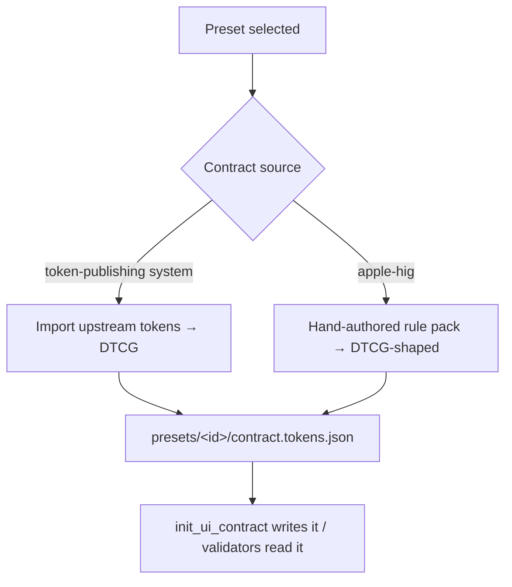
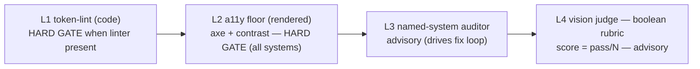

# Design — Selectable Design Systems for the Mockup Loop

## Context

`packages/mockup-loop/src/extension.ts` currently registers three tools
(`serve_mockup`, `score_mockup`, `init_ui_contract`) + a `/mockup-loop`
command, all design-system agnostic. This change parameterizes the loop by a
selected design system without breaking the generic default.

## Key decisions

### 1. Internal contract format = DTCG `*.tokens.json`

Every system normalizes to the W3C Design Token Community Group format. Rationale:
9/10 systems already publish DTCG or trivially-convertible CSS-var tokens; one
internal format lets a single validator diff any mockup against any system.



### 2. Asymmetric contract sources

| Source kind | Systems | Mechanism |
|---|---|---|
| Imported tokens | shadcn, mui, material-3, fluent-2 | snapshot generated from upstream (`@fluentui/tokens`, MUI default theme, M3 `--md-sys-*`, shadcn CSS vars) |
| Hand-authored rule pack | apple-hig | semantic colors, Dynamic Type styles, 44pt min target, 8pt grid, safe-area insets, ≤5 tab bar — Apple publishes no token JSON |

### 3. Bundled snapshot + `--refresh` (hybrid)

Contracts/rubrics ship in `presets/<id>/` so the loop works **offline** and is
**versioned**. `init_ui_contract --system <id> --refresh` re-fetches upstream
token packages and rewrites the snapshot. Avoids a hard network dependency on
every run while keeping an escape hatch for drift.

### 4. Validation pipeline — layered, gate vs advisory



- **Gate** (block "done"): L1 + L2 — deterministic, fast, low false-positive.
- **Advisory** (score, drive iteration): L3 + L4 — system-specific richness +
  taste; never hard-block (research: LLM visual scores are noisy/positive-skewed).

Per-system layer assignment:

| Preset | L1 token-lint (gate) | L2 floor | L3 auditor (advisory) | L4 rubric |
|---|---|---|---|---|
| shadcn | `eslint-plugin-tailwindcss` (bundled) | axe+contrast | — | shadcn boolean checks |
| mui | `eslint-plugin-material-ui` + hex regex (opt) | axe+contrast | MUI MCP (opt, gen) | MUI boolean checks |
| material-3 | generic `stylelint-scales` 8dp + strict-value (bundled) | axe+contrast | `material3-mcp` / material-3-skill (opt) | M3 boolean checks |
| fluent-2 | `eslint-plugin-fluentui-jsx-a11y` (opt) | axe+contrast | — | Fluent boolean checks |
| apple-hig | rule-pack checks (no token lint) | axe+contrast | `hig-doctor` HTML/CSS / `lumo` (opt) | HIG boolean checks |

"opt" = shelled out only if the binary/package resolves; absence → skip that
layer + note it, never error.

### 5. Apple HIG substrate

Browser-first loop ⇒ render an **HTML approximation** (SF Pro stack, semantic
color vars, 44pt targets, `env(safe-area-inset-*)`, bottom tab bar ≤5). This is
servable by `serve_mockup` and validatable by `hig-doctor` (supports HTML/CSS).
On **PROMOTE**, optionally emit SwiftUI (validated by `hig-doctor`/`orchard-hig`
on source; no live browser preview — needs macOS/Xcode for screenshots).

### 6. Boolean rubric shape (L4)

Each preset ships `presets/<id>/rubric.json`: N yes/no checks. The vision judge
answers each boolean + one-line reason; `score = passCount / N` derived in code,
never emitted as a float by the model. Example HIG checks: tap targets ≥44pt,
tab bar ≤5 items, Dynamic Type honored, safe areas respected, semantic colors
(no hardcoded hex), 8pt grid.

## Tool API changes

| Tool | Change |
|---|---|
| `init_ui_contract` | `+ system?: string`, `+ refresh?: boolean`. With `system`, write `presets/<id>` contract; `refresh` re-fetches upstream first. No `system` → existing blank template (back-compat). |
| `score_mockup` | `+ system?: string`. With `system`, use that preset's boolean rubric instead of the generic one. |
| `validate_mockup` (new) | `{ url, dir?, system, gate?: "soft"\|"hard" }` → runs L1+L2 (gate) + L3+L4 (advisory); returns `{ gates: {l1,l2}, advisory: {l3,l4,score}, pass }`. |
| `list_design_systems` (new) | `{}` → array of `{ id, label, platform, substrate, validators[] }`. |

## Package structure

```
packages/mockup-loop/
├── src/
│   ├── extension.ts          (extended: + system params, + 2 tools)
│   ├── presets/
│   │   ├── registry.ts       (preset definitions, validator wiring)
│   │   ├── contract.ts       (DTCG load/normalize/refresh)
│   │   └── validators.ts     (L1/L2/L3/L4 runners, shell-out-if-present)
│   └── presets-data/
│       ├── shadcn/{contract.tokens.json,rubric.json}
│       ├── mui/...
│       ├── material-3/...
│       ├── fluent-2/...
│       └── apple-hig/{contract.tokens.json,rubric.json,rules.md}
```

## Dependencies

Add to `dependencies`: `@axe-core/playwright`, a contrast checker
(e.g. `@siluat/wcag-contrast-cli` or inline WCAG math),
`eslint-plugin-tailwindcss`. Keep `playwright` optional (peer/dynamic) as today.
Named-system validators NOT added — resolved at runtime via `which`/dynamic import.

## Risks

- **Snapshot drift** — bundled tokens lag upstream. Mitigated by `--refresh` +
  a documented regeneration step; snapshots versioned with the package.
- **Validator absence** — optional tools missing on a user's machine. Mitigated:
  every optional layer degrades to "skipped + noted", loop still runs on L2 + L4.
- **Apple approximation fidelity** — HTML iOS ≠ real SwiftUI. Mitigated: clearly
  labeled as approximation; `hig-doctor` still catches the checkable rules;
  SwiftUI emitted on promote for real fidelity.

## Migration / back-compat

All new params optional. No `system` ⇒ identical to current behavior. No new
required deps break existing installs (the 3 bundled deps are additive).
