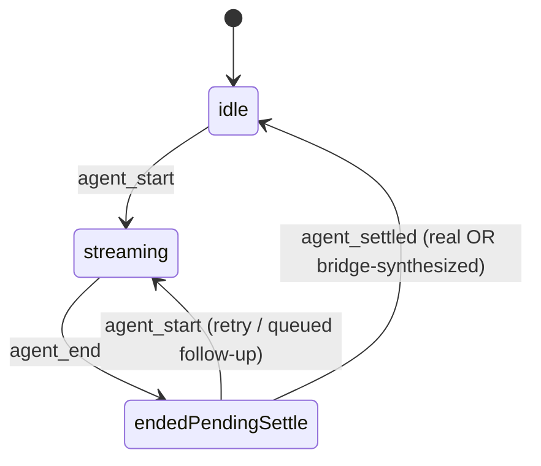
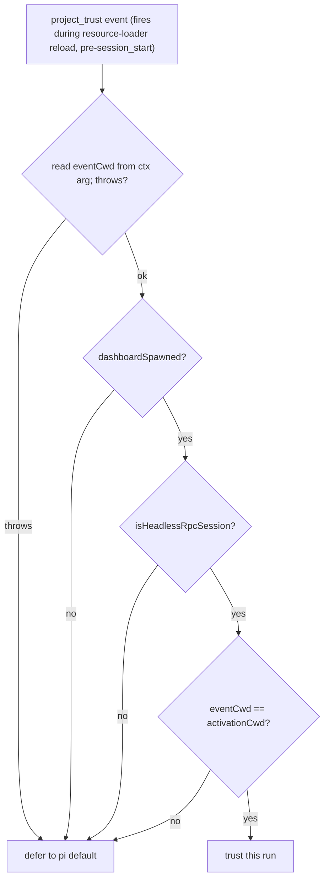

# Design — adopt-pi-074-080-features

Two pieces need a decision record; the rest are mechanical field-presence adoptions covered by the proposal + delta specs. (The first draft's RPC `get_entries`/`get_tree` section was **removed** after doubt-review found its premise false — the keeper never reads pi's stdout; that work is deferred to `adopt-pi-rpc-tree-hydration`.)

Both sections below were re-designed after **doubt cycle 2** caught: (§1) a capability-plumbing gap — the reducer has no channel to receive a `session_register` capability flag; and (§2) a fatal ordering bug — `project_trust` fires before `session_start`, so a cwd captured at `session_start` is `undefined` when the handler runs.

## §1 `agent_settled` and the idle state machine — bridge-normalized, no reducer plumbing

### Problem
`SessionState.status` is driven by `agent_start`→streaming and `agent_end`→idle. But `agent_end` fires at the end of *one agent run iteration*; retries, auto-compaction, and queued follow-ups can still be pending, so the dashboard flickers idle↔streaming and "session done" consumers fire early.

### Source facts (verified, pi 0.80.10)
- `agent_settled` fires **exactly once per run**, in the `finally` of `_runAgentPrompt` **after** the retry/compact/continue `while` loop drains (`agent-session.js:751-762`, `_emitAgentSettled` at :306-313). `agent_end` fires per `prompt`/`continue` iteration *inside* the loop.
- Therefore there is **no** intermediate `agent_settled` between an `agent_end` and the next `agent_start` within one run — the intra-run compaction flicker a first draft worried about **cannot occur by construction**. (`agent_settled` also carries no payload, so any "pick the last settle" logic would be unimplementable anyway — and is unneeded.)
- `agent_settled` is **above the floor** (0.80.4 > 0.78.0): pi 0.78.0–0.80.3 never emits it.

### Decision — the BRIDGE normalizes; the reducer stays uniform
The reducer must not learn pi's version or read a `session_register` capability (it has no such channel — `session_register` is consumed server-side in `pi-gateway.ts`, never forwarded to `event-reducer.ts`). Instead the **bridge** guarantees a single terminal `agent_settled` per run on every pi:

- **Native present** (pi ≥ 0.80.4): the bridge forwards pi's real `agent_settled`. It does NOT synthesize.
- **Native absent** (floor pi 0.78.0–0.80.3, detected by the pi version the bridge already sends in `session_register`): the bridge **synthesizes** an `agent_settled` event immediately (same tick, synchronously) after each `agent_end` it forwards.

The reducer then keys idle off ONE signal, uniformly, with no version logic:

- **Byte-identical on floor pi**: the synthetic `agent_settled` is emitted synchronously right after `agent_end`, so `endedPendingSettle` lasts a single reduce step and resolves to `idle` in the same dispatch batch — the observable outcome equals today's `agent_end`→`idle` (including today's retry flicker, which the invariant requires we preserve on floor pi).
- **No flicker on modern pi**: `agent_end` fires per iteration → `endedPendingSettle`; the single real `agent_settled` after the loop → `idle`. Retries/compaction stay inside the run with no settle between them.
- The bridge sets `isAgentStreaming=false` on the terminal `agent_settled` (real or synthesized).

### Why not advertise a capability to the reducer
That was the cycle-1/2 design; it requires a new `SessionState` field + a server forward (`pi-gateway`→client) + an explicit default, none of which exist. Bridge-side normalization needs none of that — the reducer change is a single new arm (`agent_end`→pending, `agent_settled`→idle) that is correct for both eras.

## §2 `project_trust` auto-decision policy — capture cwd at ACTIVATION

### Problem
A dashboard-spawned headless RPC session has no human at pi's TUI to answer `project_trust`; pi's `resolveProjectTrusted` leaves an unhandled no-UI decision un-trusted, so the session can stall. Auto-trusting must not trust arbitrary dirs.

### Source facts (verified)
- `project_trust` is emitted during **resource-loader `reload()`** (`resource-loader.js:222-224`, `resolveProjectTrust({extensionsResult})`), which runs **before** `session_start` reaches extension handlers (`agent-session.js`). So any cwd captured *at session_start* is still `undefined` when the handler fires — the cycle-2 CRITICAL. The bridge must capture the cwd at **activation** (module scope, `process.cwd()`), which for a fresh headless spawn IS the dashboard-provided spawn cwd.
- `ctx.cwd` is a **guarded getter that throws** after session replacement (`bridge.ts:196`, change `fix-stale-ctx-cwd-crash`). The handler MUST read cwd from its own per-event `ctx` argument (pi passes a fresh `ctx` per handler invocation), never a stale `cachedCtx`, and wrap the read in try/catch.
- pi short-circuits to trusted for a **bare** cwd (no `.pi`/project resources) *before* emitting `project_trust`, so the handler only fires for resource-bearing cwds.
- The bridge has `dashboardSpawned` (from `PI_DASHBOARD_SPAWN_TOKEN`, `bridge.ts:283`) and `isHeadlessRpcSession(...)` (`bridge-context.ts`).

### Decision — narrow, deny-by-default, activation-cwd gate
Capture `activationCwd = process.cwd()` at bridge activation (before any `project_trust` can fire). The handler trusts (this run only) ONLY when ALL hold, reading `eventCwd` from its own `ctx` argument inside try/catch:
1. `dashboardSpawned === true`, AND
2. `isHeadlessRpcSession(...)`, AND
3. `eventCwd === activationCwd` (still the dir the dashboard spawned into).

Any other case — interactive/TUI, non-dashboard-spawn, a resolved `eventCwd` that differs from `activationCwd`, or a `ctx.cwd` read that throws — **defers** to pi's default. Trust is per-run, not remembered (v1). `ctx.isProjectTrusted()` is logging-only.

### Threat model (security-hardening pass)
- The only new trust granted is for the exact dir an authenticated dashboard user chose to spawn a headless session in — no escalation beyond a user typing `pi` there themselves. A compromised bridge→server channel is already game-over, so no new trust surface.
- pi grants bare-cwd trust itself before the event; the design does not claim trust is "only ever granted via the handler."
- Documented + tested: dashboardSpawned+headless+unchanged-cwd → trust; TUI → defer; cwd-switch → defer; non-dashboard-spawn → defer; ctx.cwd-throw → defer.

### Rejected alternatives
- Capture cwd at `session_start` — **rejected**: fires too late (the cycle-2 bug).
- Blanket "headless always trusts" — rejected: a fork/resume into another tree would trust an unvetted dir; the `eventCwd === activationCwd` gate closes that.
