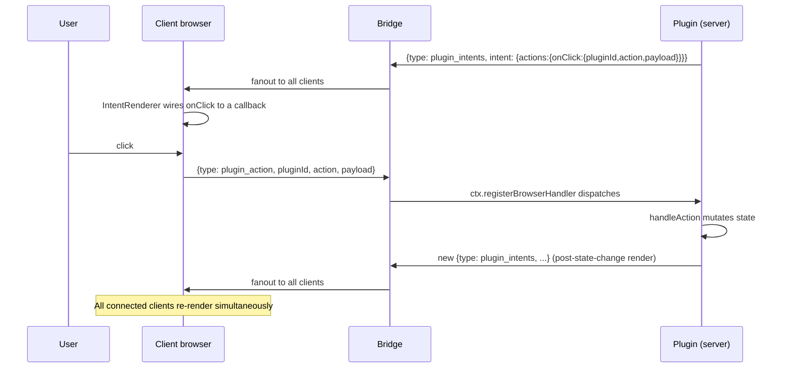

# Design — Server-driven intent rendering

## Current state (verified)

```
                  THE EXISTING WIRE (verified in code)
                  ────────────────────────────────────

   Plugin server entry receives ServerPluginContext
   (packages/dashboard-plugin-runtime/src/server/server-context.ts:46-56)

       ServerPluginContext.broadcastToSubscribers: (msg: unknown) => void
                                                    ━━━━━━━━━━━━━━━━━━
                                                    Already accepts ANY shape.

                                  │
                                  ▼

   Server wires it (packages/server/src/server.ts:1242)

       broadcastToSubscribers: (msg) => browserGateway.broadcast(msg as any)

                                  │
                                  ▼

   Bridge fans out (packages/server/src/browser-gateway.ts:235-239)

       function broadcast(msg: ServerToBrowserMessage) {
         for (const [ws] of subscriptions) {
           sendTo(ws, msg);   // ws.send(JSON.stringify(msg))
         }
       }

                                  │
                                  ▼ FANOUT — every connected client receives
                                  ▼ the same JSON payload simultaneously

   Each client's WebSocket onmessage routes by `type` field
   (packages/client/src/hooks/useMessageHandler.ts:96)

       switch (msg.type) {
         case "session_added":   ...
         case "session_updated": ...
         case "event":           ...
         // no `case` for plugin-custom message types today
       }
```

The wire is generic. The bridge is generic. The plugin can broadcast ANY JSON-serializable shape; it reaches every connected client. Today, honcho-plugin emits `{ type: "honcho_plugin_status", ... }` via this path, but no client handler exists for it — the message is silently dropped, and the client polls REST instead. The fanout works; nothing listens.

This change uses that wire for intent broadcasts and adds the missing client handler.

## The intent format

```typescript
// packages/shared/src/dashboard-plugin/intent-types.ts (NEW)

/**
 * A node in an intent tree. The plugin describes WHAT to render
 * by primitive name; the client's IntentRenderer resolves the
 * name to a ComponentType from its local registry.
 */
export interface IntentNode {
  /** Stable, namespaced primitive name. e.g. "agent-card", "markdown". */
  primitive: string;
  /** Props passed to the resolved component. Values may be primitives,
   *  serializable structures, OR nested IntentNodes (recursive). */
  props?: Record<string, unknown>;
  /** Stable React key for reconciliation. Required for items in lists. */
  key?: string;
  /** Optional click / submit / change action descriptors. */
  actions?: Record<string, ActionDescriptor>;
}

/**
 * What to send back to the server when the user triggers an action.
 */
export interface ActionDescriptor {
  pluginId: string;
  action: string;
  payload?: Record<string, unknown>;
}

/**
 * Plugin broadcast envelope. One message per (slot, session) change.
 */
export interface PluginIntentsMessage {
  type: "plugin_intents";
  pluginId: string;
  /** Session id this intent applies to. May be null for global slots
   *  (e.g. settings-section). */
  sessionId: string | null;
  /** The slot this intent occupies. Must be a registered SlotId. */
  slot: SlotId;
  /** The intent tree. `null` means "clear my contribution to this slot". */
  intent: IntentNode | null;
}
```

### Recursive children example

```json
{
  "primitive": "agent-card",
  "props": {
    "name": "Explore",
    "status": "running",
    "headerRight": {
      "primitive": "duration-pill",
      "props": { "ms": 1234 }
    },
    "body": {
      "primitive": "markdown",
      "props": { "content": "## Findings\n..." }
    }
  },
  "actions": {
    "onClick": {
      "pluginId": "flows",
      "action": "agent.inspect",
      "payload": { "agentId": "explore" }
    }
  }
}
```

The IntentRenderer recurses: it sees `agent-card`, looks up `AgentCardShell`, walks into `props.headerRight` and resolves `duration-pill`, walks into `props.body` and resolves `markdown`. Each component receives its resolved props.

## Server-side plugin contract

```typescript
// packages/<your-plugin>/src/server/index.ts

export async function registerPlugin(ctx: ServerPluginContext) {
  // 1. State lives on the server (per-session if applicable)
  const state = new Map<string /*sessionId*/, MyPluginState>();
  
  // 2. Subscribe to whatever drives state changes
  //    (events, user actions, polling, server-side computation)
  
  function publishFor(sessionId: string) {
    const sess = state.get(sessionId);
    if (!sess) return;
    const intents = renderMyPlugin(sess);   // pure: state → IntentNode[]
    for (const { slot, intent } of intents) {
      ctx.broadcastToSubscribers({
        type: "plugin_intents",
        pluginId: "my-plugin",
        sessionId,
        slot,
        intent
      });
    }
  }
  
  // 3. Handle user actions
  ctx.registerBrowserHandler("plugin_action", (msg) => {
    if (msg.pluginId !== "my-plugin") return;
    handleAction(msg.action, msg.payload, msg.sessionId);
    publishFor(msg.sessionId);
  });
}
```

The plugin author writes:
- **Reducer** — pure function `(state, event) => newState`
- **Render** — pure function `(state) => IntentNode[]`
- **Action handlers** — `(action, payload, sessionId) => void` (may mutate state, triggers re-publish)

The plugin author writes ZERO React.

## Client-side handler additions

### IntentStore (per-client local state)

```typescript
// packages/dashboard-plugin-runtime/src/intent-store.ts (NEW)

interface IntentKey {
  pluginId: string;
  sessionId: string | null;
  slot: SlotId;
}

class IntentStore {
  private intents = new Map<string /*key-stringified*/, IntentNode>();
  private subscribers = new Set<() => void>();
  
  set(key: IntentKey, intent: IntentNode | null) {
    const k = keyToString(key);
    if (intent === null) this.intents.delete(k);
    else this.intents.set(k, intent);
    this.notify();
  }
  
  getForSlot(slot: SlotId, sessionId: string | null): Map<string /*pluginId*/, IntentNode> {
    const result = new Map<string, IntentNode>();
    for (const [k, intent] of this.intents) {
      const key = parseKey(k);
      if (key.slot === slot && key.sessionId === sessionId) {
        result.set(key.pluginId, intent);
      }
    }
    return result;
  }
  
  subscribe(cb: () => void): () => void {
    this.subscribers.add(cb);
    return () => this.subscribers.delete(cb);
  }
  
  private notify() {
    for (const cb of this.subscribers) cb();
  }
}

export const intentStore = new IntentStore();
```

### `useMessageHandler.ts` case addition

```typescript
case "plugin_intents": {
  intentStore.set(
    { pluginId: msg.pluginId, sessionId: msg.sessionId, slot: msg.slot },
    msg.intent,
  );
  break;
}
```

### IntentRenderer

```typescript
// packages/dashboard-plugin-runtime/src/intent-renderer.tsx (NEW)

interface IntentRendererProps {
  intent: IntentNode;
  pluginId: string;
  send: (action: string, payload: unknown) => void;
}

export function IntentRenderer({ intent, pluginId, send }: IntentRendererProps) {
  const Component = useUiPrimitive(intent.primitive);
  if (!Component) {
    return <UnknownPrimitive name={intent.primitive} />;
  }
  
  // Recursively resolve props that are themselves IntentNodes
  const resolvedProps = resolveProps(intent.props ?? {}, pluginId, send);
  
  // Wire actions to send back to plugin via WebSocket
  const wiredHandlers = wireActions(intent.actions ?? {}, send);
  
  return <Component {...resolvedProps} {...wiredHandlers} key={intent.key} />;
}

function resolveProps(
  props: Record<string, unknown>,
  pluginId: string,
  send: (action: string, payload: unknown) => void,
): Record<string, unknown> {
  const result: Record<string, unknown> = {};
  for (const [k, v] of Object.entries(props)) {
    if (isIntentNode(v)) {
      result[k] = <IntentRenderer intent={v} pluginId={pluginId} send={send} />;
    } else if (Array.isArray(v) && v.every(isIntentNode)) {
      result[k] = v.map((n, i) => (
        <IntentRenderer key={n.key ?? i} intent={n} pluginId={pluginId} send={send} />
      ));
    } else {
      result[k] = v;
    }
  }
  return result;
}
```

### Updated slot consumers

```typescript
// packages/dashboard-plugin-runtime/src/slot-consumers.tsx (UPDATED)

export function ContentViewSlot({ session }: { session: DashboardSession }) {
  // 1. Legacy path: refs-registry claims
  const legacyClaims = forSession(
    registry.getClaims("content-view"),
    session,
  );
  if (legacyClaims.length > 0) {
    const claim = legacyClaims[0];
    return <claim.Component session={session} />;
  }
  
  // 2. New path: intent broadcasts
  const intents = useSlotIntents("content-view", session.id);
  if (intents.size === 0) return null;
  
  // one-active: render highest priority OR first by pluginId
  const [pluginId, intent] = [...intents][0];
  return (
    <IntentRenderer
      intent={intent}
      pluginId={pluginId}
      send={sendPluginActionFor(pluginId)}
    />
  );
}
```

Slots that are `multiplicity: "many"` (e.g. `content-header-sticky`) iterate over all intent contributions. The intent path coexists with the legacy refs-registry path during migration.

## Action round-trip



The reverse channel uses the existing `registerBrowserHandler` API on `ServerPluginContext` (currently stubbed in server.ts:1244 as `(_type, _handler) => {}`, needs to be wired through `browserGateway.onMessage`). This change wires it.

## Why the existing primitive registry survives

```
   Today:                                       After this change:
   ─────────────────────────────                ──────────────────────────────────────
                                                
   Plugin code calls                            Shell's IntentRenderer calls
     useUiPrimitive("agent-card")                 useUiPrimitive("agent-card")
                                                
   Plugin instantiates the component            IntentRenderer instantiates the
                                                component with props from the
                                                intent tree
                                                
   Plugin's React lifecycle owns the            Intent broadcast → IntentStore →
   component                                    slot consumer → IntentRenderer →
                                                component
                                                
   ↓ The hook + registry mechanism is IDENTICAL.
   ↓ Only the caller changes.
```

The primitive registry's `createUiPrimitiveRegistry`, `registerUiPrimitive`, `UiPrimitiveProvider`, and `useUiPrimitive` all stay. The 8 registered primitives in `main.tsx` stay. What changes: the **client-side, plugin-emitting** call site (`useUiPrimitive` from inside flows-plugin's React components) is replaced by the **shell-side, intent-resolving** call site (`useUiPrimitive` from inside IntentRenderer).

This means the archived change `add-plugin-ui-primitive-registry` (2026-05-11) is technically NOT undone. Its mechanism survives. But the USAGE PATTERN it enabled (plugins shipping React code that looks up primitives) becomes legacy. New plugins emit intents; the registry is consumed by the shell on their behalf.

## Why we don't need a new descriptor protocol

The dashboard already has descriptor-style protocols:
- `ext_ui_decorator` (footer-segment, agent-metric, breadcrumb, gate, toast) — for pi extensions
- `browser_ui_request` (PromptBus interactive dialogs) — for `ctx.ui.*` calls

These have FIXED, NARROW vocabularies. Adding "agent-card" or "flow-graph" to them would require expanding their type unions, with cross-cutting impact.

Intent rendering uses an OPEN vocabulary: any string is a valid primitive name. Plugins register intent broadcasts referencing primitives. As long as the client has a registered impl, it renders. New primitives are added by:
1. Adding a name to `UI_PRIMITIVE_KEYS`
2. Registering an impl in `main.tsx`
3. (Optionally) declaring a typed contract in `UiPrimitiveMap`

Plugins immediately gain access to new primitives without protocol changes.

## Migration order for flows-plugin

The 12 claims, ordered by migration risk (low to high):

| # | Claim | Slot | Migration | Risk |
|---|-------|------|-----------|------|
| 1 | SessionFlowActionsClaim | session-card-action-bar | Server-side render to `{primitive: "action-list", props: {actions:[...]}}` | LOW |
| 2 | FlowActivityBadgeClaim | session-card-badge | Server-side render to `{primitive: "status-pill", props: {state, text}}` | LOW |
| 3 | FlowSummaryClaim | content-inline-footer | Server-side render to `{primitive: "summary-card", props: {...}}` | LOW |
| 4 | FlowsListRoute | command-route | Server-side render to dialog-portal + searchable-select | MED |
| 5 | FlowsNewRoute | command-route | Same | MED |
| 6 | FlowsEditRoute | command-route | Same | MED |
| 7 | FlowsDeleteRoute | command-route | Same + confirm-dialog | MED |
| 8 | FlowYamlPreviewClaim | content-view | `{primitive: "markdown-preview", props: {content, title}}` | MED |
| 9 | FlowAgentDetailClaim | content-view | Decompose to layout + agent-card + markdown + stats | HIGH |
| 10 | FlowArchitectDetailClaim | content-view | Decompose to transcript primitive (NEW primitive) | HIGH |
| 11 | FlowDashboardClaim | content-header-sticky | EITHER decompose OR wrap as opaque "flow-dashboard" primitive | HIGH |
| 12 | FlowArchitectClaim | content-header-sticky | EITHER decompose OR wrap as opaque "flow-architect" primitive | HIGH |

**Strategy for HIGH-risk claims**: the intent tree just references a SINGLE complex primitive (`{primitive: "flow-graph", props: {state}}`); the client's registered impl for `"flow-graph"` is the existing FlowGraph React component. The plugin's STATE lives on the server; the COMPONENT lives on the client. The intent carries the state. No decomposition required.

This means the rich primitives (FlowGraph, FlowArchitect, FlowAgentDetail) move into the primitive registry as registered components, not as plugin code. They stay in `packages/flows-plugin/src/client/` for now; the registration site moves to a shared file that the dashboard's `main.tsx` imports.

## The "another workspace" question

If a second workspace wants to host the same plugins with different visuals:

```
   their-product/
   ├── packages/
   │   ├── their-shell/main.tsx
   │   │   import { registerStandardPrimitives } from
   │   │     "@blackbelt-technology/pi-dashboard-primitives";
   │   │   
   │   │   const registry = createUiPrimitiveRegistry();
   │   │   registerStandardPrimitives(registry);
   │   │   
   │   │   // Optionally override:
   │   │   registerUiPrimitive(registry, "agent-card", TheirAgentCard);
   │   │   
   │   │   ReactDOM.render(
   │   │     <UiPrimitiveProvider value={registry}>
   │   │       <Router><App /></Router>
   │   │     </UiPrimitiveProvider>,
   │   │   );
   │   └── their-plugins/ ... or reuse flows-plugin from npm
```

The intent format is JSON. The primitive contracts are typed. As long as both workspaces register the same NAMES with compatible PROPS, the same plugins render identically (or with the second workspace's visual style applied to specific primitives).

This change does not deliver cross-workspace plugin distribution. It validates the architecture supports it as a follow-up.

## Risks deep dive

### Risk: Network latency on every interaction

When user clicks a button in an intent tree:
1. Client sends `plugin_action` to server
2. Server runs plugin's action handler
3. Server emits new `plugin_intents`
4. Bridge fans out
5. Clients receive and re-render

Latency floor: one WebSocket roundtrip (~10-50ms on localhost, ~50-200ms on network).

**Mitigation**: IntentRenderer supports OPTIMISTIC UI overlays. A button can declare `optimistic: { primitive: "spinner" }` to swap its visual locally until the next broadcast confirms or replaces. For most actions (form submit, navigation, dialog open), latency is imperceptible because the user is moving on anyway.

### Risk: Intent tree size grows with state

If state has 100 agents, the intent tree might serialize 100 agent-card subtrees per broadcast.

**Mitigation**:
- Plugin chooses broadcast granularity. Per-slot, per-session, per-plugin — server decides what to emit.
- Intents support partial updates (`{ ..., children: { $update: [{ key: "agent-3", patch: {...} }] } }`) as a future optimization. v1 sends full trees; React's reconciler handles diff. Only optimize if measurements show problem.
- Plugin can split rendering into multiple slots, broadcasting only changed slots.

### Risk: Lost messages / replay

If a client reconnects mid-state, it missed intent broadcasts.

**Mitigation**: Server keeps the LATEST intent per (pluginId, sessionId, slot) in a cache. On client subscribe, server replays the current snapshot. Clients receive a coherent "snapshot of all current intents" on (re)connect. Bridge's existing subscribe handshake is extended.

### Risk: Migration cost

Every flows-plugin claim must be reworked. 12 claims plus FlowsSessionStateContext plus FlowsUiStateContext. Significant engineering.

**Mitigation**: Incremental, claim-by-claim. Legacy path stays working. One slot at a time. Each migration is independently testable.

### Risk: Server-side discovery bug (Bug 1) lingers

If `discoverPlugins()` keeps reading `process.cwd()`, plugin server code never loads. Intent broadcasts never fire. The whole architecture is dead in production.

**Mitigation**: This change MUST also fix the cwd-dependency in `discoverPlugins`. Either pass `repoRoot` from server startup based on `import.meta.url` resolution, OR read from a configurable manifest location. Tasks include this as a mandatory subtask before intent broadcasts are useful.

## What this enables long-term

- TUI client support: the intent tree is JSON. A future TUI client could register its own primitive impls (`registerUiPrimitive(registry, "agent-card", AnsiAgentCard)`) and render the same plugin intents in ANSI. Out of scope here, possible later.
- Cross-workspace plugin distribution: as above.
- Hot-installable plugins: server-side plugin discovery + intent broadcasts mean the SERVER can decide to load a new plugin at runtime. Clients receive new intent broadcasts. No client rebuild needed. Origin's `add-plugin-activation-ui` proposal becomes implementable.
- Multi-user dashboards: same plugins, multiple operators looking at the same workflow. Intent broadcasts already fan out — multi-user is multi-client coherence with different identities, just an auth concern, not an architecture one.

## Coexistence with the legacy refs-registry path

```
                  Slot consumer at runtime
                  ────────────────────────
                  
                  1. Check legacy refs-registry claims
                       forSession(getClaims(slot), session)
                       → if any, render the highest-priority one
                  
                  2. Check intent broadcasts
                       intentStore.getForSlot(slot, sessionId)
                       → if any, render via IntentRenderer
                  
                  3. (multiplicity: many) Render BOTH legacy and
                     intent contributions side-by-side
                  
                  4. (multiplicity: one-active) prefer intents over
                     legacy when both are present, with explicit
                     log "plugin X has both legacy and intent
                     claims for slot Y — using intent"
```

This lets flows-plugin migrate ONE claim at a time. The rest keep working through the legacy path. Once all claims are intent-driven, the legacy path can be removed in a follow-up.
