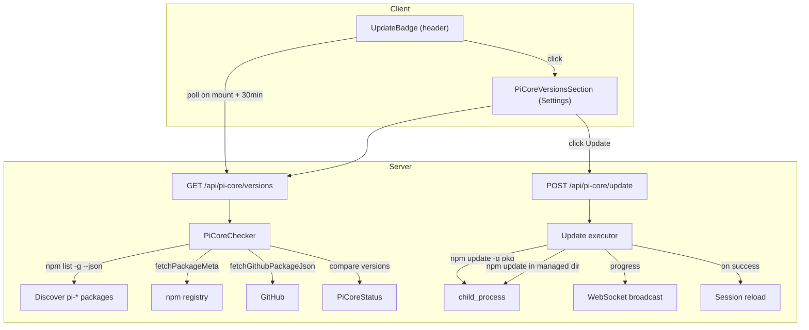
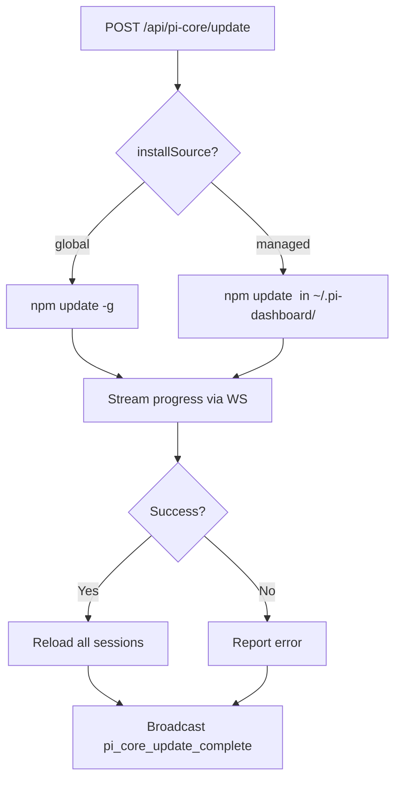

# Pi Core Version Checker — Design

## Architecture



## Data model

```typescript
/** A core pi ecosystem package (not managed by pi's PackageManager). */
interface PiCorePackage {
  /** npm package name, e.g. "@mariozechner/pi-coding-agent" */
  name: string;
  /** Human-readable label, e.g. "pi (core agent)" */
  displayName: string;
  /** Currently installed version */
  currentVersion: string;
  /** Latest version from npm/GitHub registry */
  latestVersion: string | null;
  /** True when latestVersion > currentVersion */
  updateAvailable: boolean;
  /** Where is it installed */
  installSource: "global" | "managed";
}

interface PiCoreStatus {
  packages: PiCorePackage[];
  updatesAvailable: number;
  lastChecked: string; // ISO timestamp
}
```

## Server components

### 1. `pi-core-checker.ts`

Responsible for discovering and checking core pi packages.

**Discovery strategy:**

1. Run `npm list -g --depth=0 --json` → parse `dependencies` object
2. Filter to known pi-ecosystem package prefixes/names:
   - `@mariozechner/pi-coding-agent`
   - `@oh-my-pi/pi-coding-agent` (fork)
   - `@blackbelt-technology/pi-agent-dashboard`
   - `@blackbelt-technology/pi-model-proxy`
   - Any package starting with `pi-` that has `pi-package` in keywords (optional heuristic)
3. Scan `~/.pi-dashboard/node_modules/` for managed installs (Electron path)
4. For each discovered package, fetch latest version via `fetchPackageMeta()` (npm) or `fetchGithubPackageJson()` (GitHub)
5. Compare installed vs latest using simple string inequality (same approach as `recommended-routes.ts`)

**Caching:** 5-minute TTL, force-refresh with `?refresh=true` query param.

**Display name mapping:**
```typescript
const DISPLAY_NAMES: Record<string, string> = {
  "@mariozechner/pi-coding-agent": "pi (core agent)",
  "@oh-my-pi/pi-coding-agent": "pi (core agent)",
  "@blackbelt-technology/pi-agent-dashboard": "pi-dashboard",
  "@blackbelt-technology/pi-model-proxy": "pi-model-proxy",
};
```
Unmapped packages use their npm name as display name.

### 2. `POST /api/pi-core/update` handler

**Update execution:**



Reuses `PackageManagerWrapper`'s busy-lock pattern. If a package operation is already running (extension install, etc.), returns 409 Conflict.

### 3. Routes — `pi-core-routes.ts`

| Endpoint | Method | Description |
|----------|--------|-------------|
| `/api/pi-core/versions` | GET | Returns `PiCoreStatus` (cached 5 min) |
| `/api/pi-core/update` | POST | Update one or all packages. Body: `{ packages?: string[] }` |

## Client components

### 1. `PiCoreVersionsSection` (in SettingsPanel)

A new section in the Settings panel, placed above or near the existing "Installed Global Packages" section.

- Lists each core package with current → latest version
- "Update" button per package (when update available)
- "Update All (N)" button when multiple updates
- "Check Now" button to force refresh
- "Last checked: X min ago" timestamp
- Shows install source (global npm / managed)
- Progress indicator during update (reuse `usePackageOperations` pattern)

### 2. `UpdateBadge` (header)

Small badge in the app header or sidebar:
- Fetches version status on mount, then every 30 minutes
- Shows dot/count when updates available: "⬆ 2"
- Click navigates to Settings (or scrolls to PiCoreVersionsSection)
- Hidden when no updates

## WebSocket messages

Define dedicated typed messages `pi_core_update_progress` and `pi_core_update_complete` in `packages/shared/src/browser-protocol.ts` and add them to the `ServerToBrowserMessage` union.

Rationale: AGENTS.md notes that switch cases cast with `as any` on browser gateway dispatch are stripped by esbuild in production builds. Reusing `package_operation_*` would have required either conflating semantics (core updates vs. extension install/remove/update) or casting, so distinct typed messages are safer and keep the client dispatch explicit. Client receives them in `useMessageHandler.ts` and re-emits a `pi-core-event` DOM event consumed by `usePiCoreVersions` and `PiCoreVersionsSection`.

## Error handling

| Scenario | Handling |
|----------|----------|
| `npm list -g` fails/times out | Return empty list, log warning |
| npm registry unreachable | Use cached data or show "unknown" for latest |
| Permission error on `npm update -g` | Surface error message with hint: "Try: sudo npm update -g ..." |
| Concurrent operation | 409 Conflict (PackageManagerWrapper busy lock) |
| Managed dir doesn't exist | Skip managed scan, only show global |
| Update partially fails | Report per-package success/failure |

## Testing strategy

- **Unit tests for `PiCoreChecker`**: Mock `execSync` for `npm list -g --json`, mock `fetchPackageMeta`, verify discovery + version comparison
- **Unit tests for update route**: Mock child_process, verify progress events, session reload
- **Component tests for `PiCoreVersionsSection`**: Mock API, verify render states (up-to-date, updates available, loading, error)
- **Component test for `UpdateBadge`**: Mock API, verify badge visibility and count
