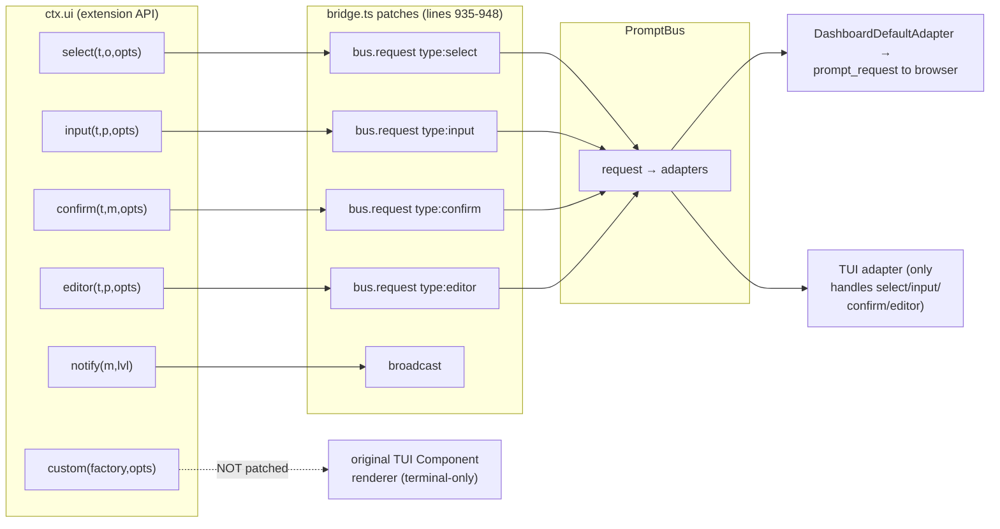
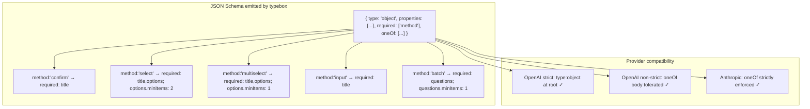

## Context

The dashboard supports five interactive prompt types end-to-end: `confirm`, `select`, `input`, `editor`, `multiselect`. The first four work. The fifth — `multiselect` — has been silently broken on the dashboard since the PromptBus migration; the bug surfaced visibly only after commit `a53933f` ("refactor(schema): restructure ask_user tool schemas for OpenAI compatibility") because the looser schema dramatically increased the rate at which Anthropic models invoke `ask_user` with `method: "multiselect"`.

This design captures the three breakages, why they stack, and the minimal fix that restores end-to-end multiselect without regressing the OpenAI-compatibility goal of `a53933f`.

## Architecture — current state

### Prompt routing (post-PromptBus, current code)



Multiselect has nowhere to enter the bus, because:

1. There is no `ctx.ui.multiselect` to patch (pi's `ExtensionUIContext` doesn't define one).
2. `polyfillMultiselect` invokes `ctx.ui.custom` directly, which is unpatched.
3. The TUI adapter switches only on the four PromptBus types it knows; `prompt.type === "multiselect"` would `return;` (no claim) even if a request did arrive.

### What `polyfillMultiselect` does today

```ts
// packages/extension/src/multiselect-polyfill.ts (current)
return ctx.ui.custom<string[] | undefined>((_tui, _theme, _keybindings, done) => {
  const list = new MultiSelectList(title, options, opts?.message);
  list.onConfirm = (selected) => done(selected);
  list.onCancel  = () => done(undefined);
  return list as unknown;
});
```

In TUI mode this works — pi creates a TUI overlay and the user interacts in the terminal. In dashboard headless / RPC mode the original `ctx.ui.custom` either no-ops or returns `undefined` immediately (depending on pi's RPC implementation) — the `done` callback is never called, the promise resolves to `undefined`, and `polyfillMultiselect` returns `undefined`. `ask-user-tool.execute` then treats this as user cancellation.

### Response encoding mismatch

```ts
// packages/client/src/hooks/useSessionActions.ts (current, line 60-62)
const answer = cancelled ? undefined : (typeof result === "object" && result !== null
  ? ((result as any).value ?? (result as any).confirmed?.toString())
  : String(result ?? ""));
send({ type: "prompt_response", ... answer, cancelled, source: "dashboard-default" });
```

| Renderer            | `result` shape          | Encoded `answer`           |
| ------------------- | ----------------------- | -------------------------- |
| SelectRenderer      | `{ value: "X" }`        | `"X"` ✓                    |
| InputRenderer       | `{ value: "hello" }`    | `"hello"` ✓                |
| EditorRenderer      | `{ value: "..." }`      | `"..."` ✓                  |
| ConfirmRenderer     | `{ confirmed: true }`   | `"true"` ✓                 |
| MultiselectRenderer | `{ values: ["a","b"] }` | `""` (empty string!) ✗     |

So even if breakages 1 and 2 above were repaired, the answer would arrive at the bridge as the empty string, indistinguishable from "user submitted with nothing checked" — which is itself a *valid* multiselect answer and must remain distinguishable from cancellation.

## Root cause attribution

Each breakage is independently sufficient to make multiselect appear non-functional on the dashboard:

| # | Layer        | File                                         | Effect when isolated                     |
| - | ------------ | -------------------------------------------- | ---------------------------------------- |
| 1 | extension    | `bridge.ts` (no `ctx.ui.multiselect`)        | Polyfill never finds a routed primitive  |
| 2 | extension    | `multiselect-polyfill.ts` (always `custom`)  | Bypasses PromptBus even if 1 is fixed    |
| 3 | client       | `useSessionActions.ts` (answer encoding)     | Round-trip drops the `values` array      |

Layer 0 (the schema flattening in `a53933f`) is **not** a fourth breakage — it is a *frequency multiplier*. Anthropic models, freed from per-method `required` and `minItems` constraints, now emit `multiselect` calls in situations where the previous discriminated union would have steered them to `select` (which works) or to a malformed call (which the API would reject schema-side). A user running mostly Anthropic models thus experiences the latent bug "néha" / sometimes — exactly when Claude picks `multiselect` for a multi-pick situation.

## Goals / Non-Goals

**Goals**

- Multiselect dialogs render in the browser when running on the dashboard, accept user input via the existing `MultiselectRenderer`, and round-trip the selected `string[]` to the agent's tool result.
- Empty selection (`[]`) remains distinguishable from cancellation (`undefined`).
- TUI sessions continue to work — the new bridge-routed primary path delegates to the existing `MultiSelectList` overlay when `ctx.hasUI === true`, via the TUI adapter.
- Anthropic regains schema-level per-method strictness (defense in depth) without regressing the OpenAI compatibility goal of `a53933f` (root stays `type: "object"`).
- Repository-level lint or behavior test that fails if a future refactor drops `ctx.ui.multiselect` patching.

**Non-Goals**

- Refactoring the legacy `ui-proxy` spec (`openspec/specs/ui-proxy/spec.md`). It is documented as obsolete by `bridge.ts:290`'s "Legacy extension_ui_response removed" comment; cleanup belongs in a separate change.
- Adding a `ctx.ui.multiselect` method to the upstream `pi-coding-agent` `ExtensionUIContext` interface. The bridge's `(ctx.ui as any).multiselect = ...` assignment is sufficient because the only consumer of that method is our own `polyfillMultiselect` (and any custom extensions that follow the same convention). Upstreaming the interface change is a separate concern.
- Switching to a different prompt routing mechanism (e.g. one prompt-per-WS-frame instead of bus-then-render). The PromptBus design is sound; only multiselect's path through it is broken.
- Removing the `ctx.ui.custom`-based fallback in `polyfillMultiselect`. We keep it so that older pi versions, non-bridge embeddings, or future bridge bugs degrade gracefully to the TUI overlay rather than producing a confusing "method does not exist" error.

## Decisions

### 1. Bridge patches `ctx.ui.multiselect`, not pi's `ExtensionUIContext` interface

| Option                                                                | Pro                                                                          | Con                                                                                                       |
| --------------------------------------------------------------------- | ---------------------------------------------------------------------------- | --------------------------------------------------------------------------------------------------------- |
| **A. Patch `ctx.ui.multiselect` in bridge** (chosen)                  | Single file change; mirrors existing select/input/confirm/editor pattern.    | TypeScript needs `as any` cast (acceptable; same cast already used for the four sibling assignments).     |
| B. Add `multiselect` to upstream `pi-coding-agent` `ExtensionUIContext` | Cleaner types. Makes `ctx.ui.multiselect` a first-class method.              | Cross-repo coordination + version-skew handling. Out of scope.                                            |
| C. Route via `ctx.ui.custom` interception                              | Keeps `polyfillMultiselect` as the single entry point.                      | Patching `custom` is invasive — many other call sites use it for actual TUI overlays; risk of collateral damage. |

Chose **A**. The `as any` precedent is established (lines 935-948 already use it). The patch is symmetric with the other four:

```ts
(ctx.ui as any).multiselect = (title: string, options: string[], opts?: any) =>
  bus.request({
    pipeline: "command",
    type: "multiselect",
    question: title,
    options,
    metadata: opts?.message ? { message: opts.message } : undefined,
  }).then(r => {
    if (r.cancelled) return undefined;
    if (r.answer == null) return [];
    try { return JSON.parse(r.answer) as string[]; }
    catch { return []; }
  });
```

### 2. Polyfill becomes a fallback chain, primary path delegates to `ctx.ui.multiselect`

```ts
// packages/extension/src/multiselect-polyfill.ts (after)
export function polyfillMultiselect(ctx, title, options, opts): Promise<string[] | undefined> {
  const ui = ctx.ui as any;
  if (typeof ui.multiselect === "function") {
    return Promise.resolve(ui.multiselect(title, options, opts));
  }
  // Legacy fallback: TUI overlay via ctx.ui.custom + MultiSelectList.
  // Reached when (a) older pi without the bridge patch, or
  // (b) a non-bridge embedding that calls polyfillMultiselect directly.
  return ctx.ui.custom<string[] | undefined>((_tui, _theme, _keybindings, done) => {
    const list = new MultiSelectList(title, options, opts?.message);
    list.onConfirm = (selected) => done(selected);
    list.onCancel = () => done(undefined);
    return list as unknown;
  });
}
```

This keeps the function name and signature identical so call sites don't change. The branch picks the better path at runtime; there is no startup-time decision.

### 3. TUI adapter handles multiselect via the captured original `ctx.ui.custom`

We must NOT remove the TUI rendering path — terminal users running `pi` directly (no dashboard) need their multiselect to keep working. Approach: extend the existing TUI adapter (`bridge.ts:866-927`) with a `multiselect` arm:

```ts
} else if (prompt.type === "multiselect" && prompt.options && originalCustom) {
  // capture originalCustom alongside originalSelect/etc. in the binding block
  const result = await originalCustom<string[] | undefined>((_tui, _theme, _kb, done) => {
    const list = new MultiSelectList(prompt.question, prompt.options!, undefined);
    list.onConfirm = (selected) => { if (!ac.signal.aborted) done(selected); };
    list.onCancel  = () => { if (!ac.signal.aborted) done(undefined); };
    return list as unknown;
  });
  answer = result === undefined ? undefined : JSON.stringify(result);
}
```

The TUI adapter serializes `string[]` to JSON for the bus's string-typed `answer`; the dashboard does the same; the bridge wrapper decodes both equally. This keeps the bus contract simple.

### 4. Client encoder handles `{ values }` symmetrically with `{ value }` and `{ confirmed }`

```ts
// packages/client/src/hooks/useSessionActions.ts (after)
const answer = cancelled ? undefined : (typeof result === "object" && result !== null
  ? (
      Array.isArray((result as any).values) ? JSON.stringify((result as any).values)
      : (result as any).value !== undefined ? (result as any).value
      : (result as any).confirmed?.toString()
    )
  : String(result ?? ""));
```

Order matters: the multiselect check comes first because `values` is the only array-shaped result and we want to avoid `String([...])` collapsing to a comma-joined string by accident.

### 5. Defense in depth — body-level `oneOf` in `ask_user` parameters schema

The OpenAI-compat goal of `a53933f` is preserved by keeping the root as `Type.Object`. We attach a body-level `oneOf` so Anthropic regains discriminated-union behavior:



The `prepareArguments` rescue layer + runtime `execute` empty-options throws (already in place from earlier hardening) remain — they are defense in depth on top of the schema, not redundant with it.

### 6. Test isolation — no live PromptBus or WS in unit tests

Each new test stubs `bus.request` with a vitest mock and asserts the dispatched argument shape. This avoids depending on the bus's internal state machine. The existing tests in `packages/extension/src/__tests__/ask-user-tool.test.ts` follow the same pattern and serve as a template.

### 7. AGENTS.md update is a one-liner, not a section rewrite

The current row for `multiselect-polyfill.ts` reads "thin wrapper around `ctx.ui.custom<T>()`". After this change it becomes "delegates to bridge-patched `ctx.ui.multiselect` when present (PromptBus path); falls back to `ctx.ui.custom` + `MultiSelectList` for legacy / TUI-only pi versions". One-line update; the rest of the row stays intact.

## Risks

| Risk                                                                                     | Likelihood | Mitigation                                                                                                                  |
| ---------------------------------------------------------------------------------------- | ---------- | --------------------------------------------------------------------------------------------------------------------------- |
| TUI adapter regression — terminal multiselect breaks                                     | Medium     | Layer-1 test covers TUI path with mocked `ctx.hasUI: true`; manual smoke test in TUI mode before merge.                     |
| OpenAI strict mode rejects body-level `oneOf` despite root `type: "object"`              | Low        | Root stays compliant. If real-world OpenAI strict probes fail, we degrade Layer 2 (drop `oneOf`) without losing Layer 1.    |
| `pi-coding-agent` upstream adds its own `ctx.ui.multiselect` and our patch overrides it  | Low        | Patch is symmetric with select/input/confirm/editor — same risk as those, never materialized. Add a runtime warning log if `ctx.ui.multiselect` is already a function before patching. |
| Schema test asserts internal typebox emission shape that changes between versions        | Low        | Test asserts JSON Schema output (not the typebox AST), and only the contractually-relevant fields (`type`, `oneOf`, `required`, `minItems`). |
| User answers multiselect with massive arrays → JSON stringify exceeds WS frame size      | Very low   | Multiselect options are model-supplied and bounded (typically < 30 entries × short labels). No new mitigation needed.        |

## Migration

None. No persisted state involved. After this change:

- Existing pending multiselect prompts in flight at deploy time were already auto-cancelling; they continue to do so until the bridge restarts. Once the new bridge code loads on a session reload (`/reload`), subsequent multiselect calls flow through the new path.
- TUI users see no difference — the TUI adapter takes over the same `MultiSelectList` rendering that the polyfill used before.
- Older `ask_user` tool tests continue to pass because the schema rescue layer is unchanged; the schema *output* tightens but our test fixtures are valid against both shapes.
