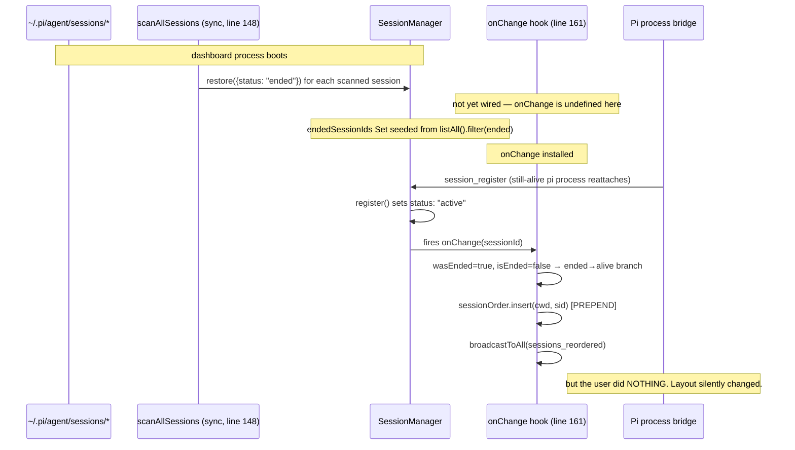

## Context

`server.ts` carries an `onChange` hook installed by the `pin-and-search-sessions` change. Its ended→alive branch performs two side-effects: insert the session id into `sessionOrder` (if absent) and broadcast `sessions_reordered`. Both side-effects are correct for user-initiated transitions — the user clicked Resume or dragged an ended card onto an alive one and expects the layout to acknowledge the action.

The same hook fires for bridge-initiated transitions during dashboard restart:



The hook listens for the *transition* (a state delta); the trigger (who caused it) is invisible. To fix this we need to surface intent to the hook.

## Goals / Non-Goals

**Goals:**
- Ended→alive transitions caused by user `Resume` clicks AND drag-to-resume continue to prepend / preserve dropped slot AND broadcast `sessions_reordered`.
- Ended→alive transitions caused by bridge auto-reattach on dashboard reboot SHALL NOT mutate `sessionOrder` and SHALL NOT broadcast.
- The fix is local to the server. Client behaviour does not change.
- The existing `endedSessionIds` "fire-once-per-transition" guarantee is preserved.

**Non-Goals:**
- Tracking *who* initiated (user identity, browser session). We only need a binary "user-initiated this transition" tag.
- Adding new WebSocket message types. The existing `resume_session` browser→server message and its REST counterpart are the only intent surfaces; both already pass through known choke points.
- Persisting intent across restarts. Intent is transient by definition; if a server restarts mid-resume, the intent is gone and the next reattach is treated as auto-reattach (the same behaviour as today, just without the spurious reorder).

## Decisions

### D1. Intent surfaces through a dedicated `pendingResumeIntentRegistry`

A `Set<sessionId>` held in `BrowserHandlerContext` (alongside the existing `pendingForkRegistry`, `pendingResumeRegistry`, `pendingDashboardSpawns`). Two methods:

```typescript
interface PendingResumeIntentRegistry {
  /** Mark a session as user-resume-initiated. TTL 60s. Idempotent. */
  record(sessionId: string): void;
  /** Returns true and clears the entry if the session was tagged. */
  consume(sessionId: string): boolean;
  /** Test helper — number of live entries. */
  size(): number;
}
```

**Why a dedicated registry instead of reusing `pendingResumeRegistry`?**

`pendingResumeRegistry` already exists, but its purpose is **prompt-on-resume queueing**: it stores `{text, images, oldSessionId, sessionFile}` per cwd, consumed by the auto-resume-on-prompt path that re-attaches an ended session when the user types into it. Reusing it would conflate two semantics (deferred-prompt vs reorder-intent) and make `consume()` ambiguous. A separate Set is 30 lines, fully encapsulated.

**Alternatives considered:**

- **Reuse `pendingResumeRegistry`:** Rejected — different semantics, different TTL, different consumer. Conflation makes future maintenance harder.
- **Tag a flag on the session object (`session.userResumeIntent: true`)** before calling spawn: Rejected — `Session` is the canonical persisted shape (`.meta.json`, `state-replay`, browser broadcast). Adding a transient field there bleeds intent into persistence.
- **Pass intent through `register()` parameters:** Rejected — `register()` is called by the bridge gateway from inbound WebSocket messages; the bridge has no knowledge of whether the user initiated the resume on the dashboard side.
- **Time-window heuristic ("any ended→alive within 5s of a `handleResumeSession` call counts as user-initiated"):** Rejected — race-prone; user could click Resume while a bridge auto-reattach is in flight.

### D2. Tag at every user-initiated resume site

Two call sites today initiate user-driven resume:

1. **`handleResumeSession` in `session-action-handler.ts`** — handles the WebSocket `resume_session` message. Drag-to-resume goes through here too: the client emits `reorder_sessions` then `resume_session` in sequence; the second message hits this handler.
2. **`registerSessionApi` in `session-api.ts`** — handles `POST /api/session/:id/resume` (REST). Used by the `pi-dashboard` skill and other integrations.

Both call sites SHALL invoke `pendingResumeIntentRegistry.record(sessionId)` immediately before `spawnPiSession`. This gives a tag-then-spawn ordering; the bridge's `session_register` arrives later (~1–3 s typical), and `onChange` consults the registry at that moment.

The `pendingResumeIntents` Set is consulted in **exactly one place**: the ended→alive branch of `onChange` in `server.ts`. The branch currently looks like:

```typescript
} else if (!isEnded && wasEnded) {
  endedSessionIds.delete(sessionId);
  const order = sessionOrderManager.getOrder(session.cwd) ?? [];
  if (!order.includes(sessionId)) {
    sessionOrderManager.insert(session.cwd, sessionId);
  }
  const next = sessionOrderManager.getOrder(session.cwd) ?? [];
  browserGateway.broadcastToAll({
    type: "sessions_reordered",
    cwd: session.cwd,
    sessionIds: next,
  });
}
```

After the fix:

```typescript
} else if (!isEnded && wasEnded) {
  endedSessionIds.delete(sessionId);
  // Only mutate order + broadcast for user-initiated resumes.
  // Bridge auto-reattach on dashboard reboot lands here too, with
  // no intent tagged → the user's existing layout is preserved.
  if (!pendingResumeIntents.consume(sessionId)) return;
  const order = sessionOrderManager.getOrder(session.cwd) ?? [];
  if (!order.includes(sessionId)) {
    sessionOrderManager.insert(session.cwd, sessionId);
  }
  const next = sessionOrderManager.getOrder(session.cwd) ?? [];
  browserGateway.broadcastToAll({
    type: "sessions_reordered",
    cwd: session.cwd,
    sessionIds: next,
  });
}
```

Note `endedSessionIds.delete(sessionId)` runs **before** the early-return so the transition tracking stays correct — without it, a future alive→ended transition for the same session would not fire (it would think the session was already ended).

### D3. Drag-to-resume preserves its dropped slot

Drag-to-resume's two-message sequence is:
1. Client `reorder_sessions { cwd, sessionIds }` — the dropped position, *including* the ended id at its drop slot
2. Client `resume_session { sessionId, mode: "continue" }` — fires the spawn

Step 1 lands in `handleReorderSessions` and writes the new order to `sessionOrderManager`. The ended id is now in `sessionOrder` at the dropped position.

Step 2 hits `handleResumeSession`, which records intent and spawns pi.

Bridge attaches → `session_register` → `onChange` ended→alive branch:
- `pendingResumeIntents.consume(sessionId)` returns `true` (tagged at step 2)
- `order.includes(sessionId)` returns `true` (placed by step 1)
- The `if (!order.includes(...))` guard skips the prepend → **dropped slot preserved**
- `broadcastToAll(sessions_reordered)` echoes the order back to clients

So drag-to-resume continues to work exactly as documented in `pin-and-search-sessions` D5. The `if (!order.includes)` check that was already in the code is what makes this work — we simply gate the *whole branch* behind intent.

### D4. Stale-intent expiry via TTL

If `handleResumeSession` records an intent but `spawnPiSession` fails (no bridge ever attaches), the entry would sit in the Set forever, and a *future* legitimate bridge reattach for the same session id (e.g., across an hour later, after another reboot) would be incorrectly classified as user-initiated.

Solution: each entry carries a creation timestamp; `consume()` returns `false` for entries older than 60 s and silently drops them. 60 s is generous enough for slow-spawn cases (Windows tmux startup, network homedir) and short enough that a stale intent never survives a typical reboot cycle.

Implementation pattern mirrors `pending-attach-registry.ts` (which has the same TTL semantics for spawn-with-attach intents).

### D5. Cleanup on browser disconnect — not needed

The intent is per-session-id, not per-browser-connection. A browser disconnecting mid-resume does not invalidate the intent (the spawn continues server-side). The 60 s TTL is the only cleanup needed.

## Risks / Trade-offs

| Risk | Mitigation |
|------|------------|
| **Spawn takes >60 s on a slow system; intent expires before bridge reattaches → user-initiated resume mis-classified as reboot reattach.** | TTL is configurable via constructor argument (default 60 s). Telemetry: log when an expired entry is encountered so we can tune the value if it bites in production. The existing `pending-attach-registry` uses the same value without complaints. |
| **Two browsers race to resume the same session → second `resume_session` finds the entry already there.** | `record()` is idempotent (Set-based — re-inserting an id with a fresh timestamp is fine). First `consume()` clears it; the second resume sees no intent and is treated as reattach (no reorder). This matches the user's mental model: only the first Resume click "wins" the slot decision. |
| **Existing user has a custom drag-order across many cwds; the bug has been live for ~1 day; their persisted state may already be corrupted.** | This fix prevents *new* corruption. Existing corrupted orders self-heal as users re-drag. No automated repair needed. |
| **Forgetting to tag a future third resume entry point.** | Repo-level lint is overkill for two callsites. A code comment at the registry definition + a smoke test that hits both paths is sufficient. |
| **`handleResumeSession`'s fork mode also flows through here.** | Fork creates a new session id, never an ended→alive transition for an existing id, so the intent registry is irrelevant for fork mode. The fork path uses `pendingForkRegistry` (orthogonal). |

## Migration Plan

No migration required. The fix is purely additive in semantics: a new internal Set + two record calls + one consume call. Rolling back means deleting the Set and the gating `if`, which restores the buggy behaviour.

## Open Questions

- Should the intent registry be exposed for testing via a getter? Yes — `size()` for assertion, no get-by-id needed (would invite test coupling). Documented in the type.
