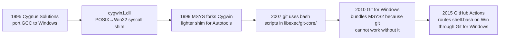

## Context

The release CI matrix's Windows variants have failed every release since v0.4.0. Run #34 (macOS ETARGET on `dashboard-plugin-runtime@^0.4.2`) and run #25180846686 (Windows `MODULE_NOT_FOUND` on `/d/a/...`) traced to two distinct root causes, but **both surfaced from the same architectural choice**: the build pipeline uses `shell: bash` on Windows runners and relies on MSYS2's POSIX-translation layer to make POSIX-style scripts behave on a Win32 host.

Why MSYS exists at all (legitimate history):



The merit of MSYS is real for projects that were already POSIX-shaped (GCC, Autotools, git). For those, rewriting was infeasible; the translation layer is the cheapest viable port. **None of that applies to this codebase.** We are a Node project. Node has cross-OS primitives (`node:path`, `node:fs`, `node:child_process`) that work natively on every host. There is no POSIX requirement anywhere in our build pipeline.

Why MSYS hurts us specifically:

```
                MSYS/bash on Windows for a Node project

           Theoretical PROS                  Actual CONS
        ──────────────────────             ─────────────────────────────
        ▶ DRY scripts across OS            ▶ Path-in-string ❌ broken
                                              (the v0.4.x release bug)
        ▶ POSIX coreutils available        ▶ chmod is a no-op on NTFS
                                           ▶ Symlinks need elevated
                                              perms or junctions
                                           ▶ ~10× slower process exec
                                              (every spawn through
                                              msys-2.0.dll)
                                           ▶ Untestable on Linux
                                              (translation layer is
                                              Windows-only)
                                           ▶ Implicit dep on Git for
                                              Windows being installed
                                           ▶ Same script behaves
                                              differently per OS with
                                              no warning
```

Native alternatives on every Windows runner:

```
┌─ Tools available without MSYS/bash ────────────────────────┐
│                                                             │
│  node.exe        →  ALL build orchestration                │
│  npm.cmd         →  Package management (ships with Node)   │
│  pwsh.exe        →  OS commands: Compress-Archive,         │
│                     Invoke-WebRequest, Test-Path           │
│  cmd.exe         →  Default GH Actions shell on Windows    │
│  git.exe         →  DVCS (native Windows binary, no bash)  │
│                                                             │
└────────────────────────────────────────────────────────────┘
```

This change formalizes the principle: **Windows builds use Windows-native + Node only.** MSYS is removed from the call graph entirely.

## Goals / Non-Goals

**Goals:**
- Zero `shell: bash` steps reachable on a Windows runner in `publish.yml` and `ci.yml`.
- The Windows electron build never invokes `msys-2.0.dll`.
- Every cross-OS build script is `.mjs` (Node-native), runnable on every host with identical behaviour.
- Linux dev machines can dry-run every Windows-targeted build script and observe identical output paths/exit codes (modulo OS-specific binaries like `xattr`).
- A single repo-lint test prevents regression at PR-review time.

**Non-Goals:**
- Eliminating bash for Linux/macOS steps (those keep their `shell: bash`; no benefit to changing them).
- Rewriting `git.exe` invocations or other native binaries that happen to ship with Git for Windows but are themselves OS-native (`git`, `tar`, `7z` on PATH).
- Replacing the `git` binary used by `bundle-recommended-extensions.mjs`. `git` is a native Win32 binary; it does not require bash to run.
- Refactoring dev-tooling shell scripts (`scripts/reload-all.sh`, `qa/tests/*.sh`) — those don't run in CI and are out of scope. Their `node -e "require('$X')"` patterns can be tracked in a follow-up.
- Adding a Windows-only test runner. The existing matrix already covers Windows.

## Decisions

### D1 — `bundle-server.sh` is ported to `bundle-server.mjs`, not split per-OS

**Decision**: replace the bash script with a single Node-native `.mjs` script. No `bundle-server.ps1` sibling; no `if: matrix.platform` branching at the YAML level.

**Rationale**: a `.mjs` script with `node:fs` and `child_process.spawnSync` runs identically on every OS. Splitting into bash + pwsh siblings would double maintenance and reintroduce the "two implementations may drift" risk. The script's logic is simple enough (~10 operations, all 1:1 with `node:fs` calls) that a single Node implementation is shorter than either shell version.

**Alternatives considered**:
- Per-OS shell scripts (`bash` + `pwsh`). Rejected — duplication, drift risk, and the YAML conditional is bash again on POSIX (which is fine) plus pwsh on Windows (which means yet another shell to maintain).
- Keep `bundle-server.sh` and skip Windows. Rejected — would skip native module path fixups (`spawn-helper +x`, `xattr -d`) that the macOS variant needs.

### D2 — Pin electron version literally (drop the caret)

**Decision**: change `"electron": "^32.0.0"` → `"electron": "32.3.3"` in `packages/electron/package.json`.

**Rationale**: app-builder-lib's `getElectronVersionFromInstalled(projectDir)` looks ONLY at `path.join(projectDir, "node_modules", name, "package.json")`. It does not walk the workspace tree. With npm workspaces, electron is hoisted to root `node_modules/electron`; `packages/electron/node_modules/` does not contain it on any host. The function falls back to reading `packages/electron/package.json`'s `electron` dependency string and applying `/^\d/.test(version)` to validate the value as a fixed semver. `^32.0.0` fails that regex; `32.3.3` passes. This is the workaround electron-builder itself recommends in [issue #3984](https://github.com/electron-userland/electron-builder/issues/3984#issuecomment-504968246).

Why Linux/macOS pass without the pin: their makers (DEB, AppImage, DMG) do not invoke electron-builder; only NSIS does. The bug is Windows-only by accident of which maker uses electron-builder under the hood.

**Alternatives considered**:
- Add `electronVersion` to forge config's `packagerConfig`. Rejected — the option is deprecated/removed in newer electron-forge, fragile across upgrades.
- Pre-build step that creates `packages/electron/node_modules/electron` as a junction → root. Rejected — Windows symlinks/junctions require elevated permissions or `mklink /J` from cmd.exe; introduces another OS-specific code path and depends on workspace hoisting layout, which `npm` may change in future.
- Use exact version `32` (no patch). Rejected — fails the `/^\d.+/` regex's implicit assumption about a parseable semver later in the chain.

### D3 — `no-bash-on-windows.test.ts` parses YAML directly (no js-yaml dep)

**Decision**: the new repo-lint test extracts each step's `shell:` and `if:` keys via regex, computes Windows reachability per step, and asserts no Windows-reachable step uses `shell: bash`.

**Rationale**: `js-yaml` is not a declared dep in any workspace `package.json` (only present transitively in lockfile). Adding it as a devDep just for this test is a heavier import than the existing repo-lint pattern. Existing tests (`no-direct-process-kill.test.ts`, `no-raw-node-import.test.ts`, `publish-workflow-contract.test.ts`) all use regex-based extraction. Following the same pattern keeps test infrastructure consistent and dependency-free.

The test logic is more interesting than the previous lints because it must:
1. Identify the `electron` matrix and enumerate platform values (`darwin`, `linux`, `win32` × arch).
2. Walk each step under that job, capturing `shell:` and `if:` literals.
3. Decide whether the `if:` filter excludes Windows. The `if:` expressions in this repo are simple (`matrix.platform != 'win32'`, `matrix.platform == 'linux' && matrix.arch == 'arm64'`, `!(matrix.platform == 'win32' && matrix.arch == 'arm64')`); a small evaluator over a fixed grammar is sufficient.
4. Fail with file:line plus a citation of this change name when a `shell: bash` step is Windows-reachable.

**Alternatives considered**:
- Use `js-yaml` for full structural parsing. Rejected — adds a build-time dependency, slower test, no concrete benefit since the input grammar is small and stable.
- Allowlist instead of evaluator. Rejected — allowlists rot; an explicit `if:` evaluator captures intent and surfaces unreachable Windows-affected steps automatically.

### D4 — POSIX-only steps remain `shell: bash`; Windows-only remain `shell: pwsh`

**Decision**: keep `shell: bash` for steps gated `if: matrix.platform != 'win32'` (Linux + macOS only) and `shell: pwsh` for steps gated `if: matrix.platform == 'win32'`. The change targets only steps that would be reachable on Windows.

**Rationale**: the principle is "no MSYS in the Windows call graph", not "remove bash entirely from the codebase." `shell: bash` is the natural fit for POSIX-only operations (`apt-get install`, `xattr -d`), and the cross-OS work belongs in `.mjs`. Forcing pwsh on macOS or bash on Windows would be the same kind of cross-shell pollution this change is correcting in reverse.

### D5 — Keep `bundle-recommended-extensions.mjs` and `bundle-offline-packages.mjs` as-is

**Decision**: the previous commit `6b069c4` ports both scripts; this change does not re-touch them.

**Rationale**: both already meet the new contract. Their YAML wrappers (`tee` + step-summary) live in `shell: bash` blocks today. Once the `no-bash-on-windows.test.ts` lint lands, those wrappers must move to `pwsh` on Windows or the `tee`+`heredoc` pattern must be expressed in pwsh syntax. The change covers that conversion.

### D6 — Detect prerelease in `prepare`, route via `--tag next` and `prerelease: true`

**Decision**: extend the `prepare` job to compute a boolean `is_prerelease` from the resolved version string (regex `/^[0-9]+\.[0-9]+\.[0-9]+-/`), expose it as a job output alongside `version` and `tag`, and consume it at two existing sites:

1. **`publish` job's per-package npm publish loop**: append `--tag next` to every `npm publish` invocation when `is_prerelease == 'true'`. No change for stable releases.
2. **`github-release` job's `softprops/action-gh-release` step**: pass `prerelease: ${{ needs.prepare.outputs.is_prerelease }}`. The action treats the string `"true"` as truthy.

The regex is anchored at the start so it cannot accidentally match a stable version with a numeric build suffix in the middle. The `latest` dist-tag is preserved for any version that does NOT match the prerelease shape — so today's stable releases keep behaving identically.

**Rationale**: a release-candidate tag must NOT update the `latest` dist-tag, otherwise `npm install -g @blackbelt-technology/pi-agent-dashboard` (or any plain `npm install` of a sub-package) immediately picks up the rc — the exact opposite of what "release candidate" means. Symmetrically, a stable GitHub Release marked `prerelease: false` for a version like `0.4.5-rc.1` mislabels it on the Releases page and in any tooling that filters by prerelease state. The single source of truth for both decisions is the version string itself; deriving them in the `prepare` job centralises the rule and keeps the publish + github-release jobs declarative.

**Why now**: this change is the first one in the v0.4.x series that's actually expected to ship a working installer. Without rc-safety, the rc-validation step in the migration plan ("Tag a `v0.4.5-rc.1` ...") is not safe to execute — the rc would land on the `latest` dist-tag and break every consumer's `npm install`. Combining the two changes into one commit avoids the chicken-and-egg ordering problem.

**Alternatives considered**:
- Always publish to `--tag next` and never to `latest`, requiring users to opt into stable via `npm install @latest`. Rejected — inverts the npm convention. `latest` is the implicit default for billions of `npm install` invocations; flipping it is a breaking expectation change for consumers.
- Detect prerelease in the `publish` and `github-release` jobs independently. Rejected — two regex sites that must stay in lockstep is exactly the kind of drift this change is fighting against. One source of truth in `prepare` is the canonical fix.
- Ship the prerelease fix as a separate change. Rejected — the rc-validation step in this change's migration plan literally requires it; splitting would either make this change's rc step unsafe, or block this change behind a separate PR. Combined scope is cleaner.

**Locked by**: extension of `packages/shared/src/__tests__/publish-workflow-contract.test.ts`. New assertions:
- The `prepare` job's `outputs:` block contains `is_prerelease`.
- The `publish` job's loop body conditions `--tag next` on `${{ needs.prepare.outputs.is_prerelease == 'true' }}`.
- The `github-release` job's `with:` block includes `prerelease: ${{ needs.prepare.outputs.is_prerelease == 'true' }}` (or the equivalent `is_prerelease`-keyed expression).

Failure messages cite this change name + the offending line so a contributor who removes any of the three sites gets a self-explanatory test failure.

## Risks / Trade-offs

- **[Risk] Behavioural drift in `bundle-server.mjs` vs `.sh`.** Mitigation: the Linux x64 CI run still produces a tarball whose byte-shape (size, entry count, structure) can be diffed against the `.sh` output during this change's verification. A sanity test in `packages/shared/src/__tests__/bundle-server-output-shape.test.ts` may pin the manifest schema (file count, presence of expected directories under `node_modules`).
- **[Risk] pwsh syntax errors in publish.yml.** Mitigation: `node -e "console.log(require('js-yaml').load(...))"` (one-time at PR review) plus the existing `node` parser sanity check from `publish-workflow-contract.test.ts`. PR submitter must verify locally with `pwsh -File ...` for the converted blocks.
- **[Risk] Windows arm64 NSIS stays broken if electron-builder has additional Windows-arm64 specific issues.** Mitigation: this change explicitly does NOT target Windows arm64 packaging — that path uses `electron-forge package` (not NSIS) and was not failing on the same code path. It will be re-validated post-change; if a separate bug exists it gets its own follow-up change.
- **[Trade-off] One more lint to maintain.** Acceptable — the lint runs in milliseconds (regex over ~400-line YAML) and prevents an entire bug class.
- **[Trade-off] Windows-only contributors with no bash now have one less shared-script surface.** Net positive: those contributors gain the ability to dry-run scripts in their native shell.
- **[Risk] A version with a SemVer build-metadata segment (`0.4.5+ci.123`) but no prerelease segment is treated as stable.** Acceptable: the regex correctly returns false for `+`-only versions. We don't currently use build-metadata; if we ever do, the regex stays correct.
- **[Risk] The `is_prerelease` job output is consumed via `${{ needs.prepare.outputs.is_prerelease == 'true' }}` literal-string comparison.** Mitigation: GitHub Actions stringifies all outputs, and the regex unconditionally writes either `"true"` or `"false"` to `$GITHUB_OUTPUT`, never an empty string. Lint test asserts both shapes appear at the consumer sites.

## Migration Plan

1. Land in a single PR. No phased migration — the failure modes are entangled (you cannot fix the path bug without removing bash, and you cannot remove bash without porting bundle-server.sh, and you cannot validate Windows without the electron pin).
2. Verify locally on Linux: `node packages/electron/scripts/bundle-server.mjs` produces identical output structure to the old `.sh` (manifest of file paths under `resources/server/`).
3. Verify the lint: temporarily revert one `shell: bash` removal to confirm the test fails with a useful message, restore.
4. Push to `develop`.
5. Tag a `v0.4.5-rc.1` or use `workflow_dispatch` with `version: 0.4.5-rc.1`. The `prepare` job detects the prerelease, the `publish` job appends `--tag next` to every `npm publish`, and `github-release` creates a `prerelease: true` Release. Stable consumers running `npm install <pkg>` continue to receive the previous stable from `latest`.
6. On rc success: tag the real release `v0.4.5`. The `prepare` job sees no prerelease segment, falls back to `latest` + `prerelease: false`. No rollback step beyond `git revert` of this change's commits.
7. Optional cleanup if the rc went out: `npm dist-tag rm @blackbelt-technology/<pkg> next` for each sub-package once the stable lands and the rc is no longer recommended for installation.

## Open Questions

None. The principle is clear, the failure mode is well-characterized, and the remaining shells (`pwsh` on Windows-only, `bash` on POSIX-only, `node` everywhere) are the standard split for cross-platform Node projects.
