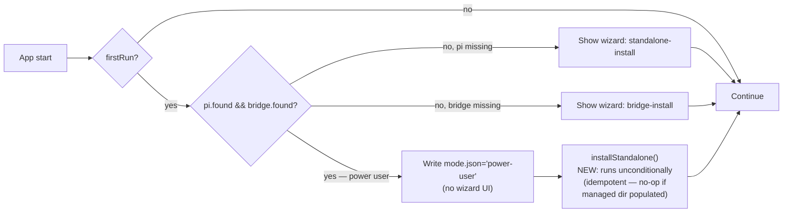

## Context

End-to-end smoke testing of the Windows electron installer (built via `eliminate-bash-on-windows-runners`'s CI fixes) on a real user machine surfaced **three distinct runtime defects** plus the install-layer **naming chaos**. The machine state that reproduces them:

```
Host:       Windows 11
Node root:  B:\Dev\Nodejs\global\          ← non-default npm-global
System pi:  pi-coding-agent@0.71.1 (with jiti 2.6.5)
Bridge:     already registered from prior dev work
.pi-dashboard:  ~/.pi-dashboard/ exists, node_modules empty
Install:    %LOCALAPPDATA%\Programs\@blackbelt-technologypi-dashboard-electron\
            (clearly malformed — npm name slash-stripped)
```

The full failure chain — every arrow is rooted in a single upstream defect (Defect 1, the wizard auto-skip), with the rest being defense-in-depth:

```
   ┌─ User clicks Start Menu shortcut ─┐
   │                                    │
   ▼                                    │
   "Missing Shortcut" — pi-dashboard-   │  NAMING CHAOS
   electron.exe not found              │  (productName drives shortcut
                                        │   target; install-dir name is
   User finds the actual binary in     │   the npm `name` slash-stripped
   @blackbelt-technologypi-dashboard-  │   when no NSIS override is set)
   electron\pi-dashboard.exe           │
                                        ▼
   ┌─ Electron main starts ────────────┐
   │                                    │
   ▼                                    │
   firstRun() detects pi.found &&      │  DEFECT 1 — the root cause
   bridge.found → auto-skip wizard,    │  Auto-skip path skips
   write mode.json='power-user',       │  installStandalone() entirely;
   installStandalone() NEVER RUNS      │  managed dir stays empty.
                                        │
   ~/.pi-dashboard/node_modules empty  │
                                        ▼
   ┌─ Server launch ───────────────────┐
   │                                    │
   ▼                                    │
   resolveTsxCommand() → null (no tsx  │  Symptom of Defect 1
   in managed dir)                     │
                                        │
   resolveJitiFromPi() priority:       │
     1. managed install — empty        │  Symptom of Defect 1
     2. system pi → B:\Dev\Nodejs\     │
        global\.../jiti 2.6.5          │
                                        ▼
   shouldUrlWrapEntry() → true          │  DEFECT 2 — jiti-version
   (Windows + non-tsx)                 │  contract assumption
                                        │
   spawn: node --import file://...     │  Contract is correct for
     file:// entry                     │  jiti 2.x (pi 0.70.x), wrong
                                        │  for jiti 2.6.5 (pi 0.71.x)
                                        ▼
   jiti 2.6.5 receives entry           │  jiti normalizes file:/// to
     normalizes file:/// → file:/      │  file:/, prepends cwd as if
     prepends cwd as if relative       │  relative → ENOENT
     ENOENT on file:/C:/.../cli.ts     │
                                        ▼
   child exits code 1                  │  UX symptom (not a defect):
   waitForReady returns instantly      │  15s deadline message is
                                        │  misleading when child died
   Dialog: "Server failed to start    │  in <1s
   within 15 seconds (child exited    │
   with code 1)"                       │
                                        ▼
```

Plus Defect 3 — an **orthogonal** Windows-only bug that doesn't fire on this user's machine but bites adjacent ones (e.g. machines with a stale npm-global install of `@blackbelt-technology/pi-dashboard-electron` from before the naming alignment):

```
   ┌─ detectPiDashboardCli() called ──┐
   │                                   │
   ▼                                   │
   exec: where pi-dashboard            │
   stdout:                             │
     B:\Dev\Nodejs\global\pi-dashboard       ← extensionless POSIX shim
     B:\Dev\Nodejs\global\pi-dashboard.cmd   ← Windows .cmd shim
                                       ▼
   trim().split(/\r?\n/)[0]            │  DEFECT 3
   → picks the extensionless one       │
                                       ▼
   spawn(path, [...], { shell: false })│
   → ENOENT on Windows (can't invoke   │
     non-.cmd/.exe/.bat without shell) │
```

Three defects + naming chaos. **Defect 1 is the keystone**: every downstream symptom (no tsx, fallback to system pi, broken jiti, MODULE_NOT_FOUND, misleading dialog) is a consequence of the managed dir staying empty. Fix the wizard's lifecycle and the chain breaks.

### Why this isn't 5 defects

An earlier draft of this design framed the problem as 5 defects, two of which proposed bundling `@mariozechner/pi-coding-agent` into `resources/server/node_modules/`:

- **Old D5 ("Defect 1")**: declare pi-coding-agent as a real dep in the bundled server's synthetic package.json (~10MB bundled).
- **Old D3 ("Defect 2")**: priority-zero entry in `resolveJitiFromPi()` for `resourcesPath/server/node_modules/@mariozechner/pi-coding-agent` so the bundled jiti wins over system pi.

Both were architecturally wrong:

```
Dashboard architecture intent:
  offline-packages.json  pins versions of pi/openspec/tsx
  offline-cache.tar.gz   pre-built npm cacache shipped in resources
  installStandalone()    extracts the cacache + npm install →
                         ~/.pi-dashboard/node_modules/
  managed dir            single source of truth for runtime deps

Old D5 + D3 would have:
  - duplicated pi (~10MB) inside resources/server/ as well
  - introduced version-drift risk between offline-packages.json
    and the synthetic package.json's literal version pin
  - made the bundled tree the runtime authority, demoting
    managed-dir to a fallback (architecturally inverted)
```

The actual root cause is upstream: `installStandalone()` never runs because the wizard auto-skips it. Fix that and managed-dir is populated on first launch from the offline cacache (which already pins `pi@0.70.0` correctly), and the resolver's existing `managed → system` chain wins. No bundling needed.

The reverted D5 work (the inline `dependencies` block in `bundle-server.mjs`'s synthetic package.json, and the `PI_CODING_AGENT_VERSION` / `buildSyntheticPackageJson` exports) is documented in `bundle-server.mjs` with a long comment block citing this change so future contributors don't re-attempt it.

## Goals / Non-Goals

**Goals:**
- A user with a fresh Windows + global pi install + bridge registered can run the v0.4.5 NSIS installer, click the Start Menu shortcut, and reach a working dashboard within 60s — no manual workaround.
- Every Windows install layer uses the single user-visible string `pi-dashboard` (or `PI Dashboard` for OS-display-only contexts). No `-electron` suffix anywhere visible. No `@blackbelt-technologypi-dashboard-electron` install dir.
- The wizard's auto-skip optimisation (skip the wizard *UI* when pi+bridge are already there) does NOT skip the *managed install* (`installStandalone()`). Power-user mode = "user has things installed, we don't show wizard prompts" — NOT "we don't install our own managed dependencies."
- The server-startup failure dialog says what actually happened (child crashed vs took too long).
- A future jiti version drift cannot silently recreate the file:// URL bug because the bundled jiti is pinned (via `offline-packages.json`) and the contract is documented + regression-pinned.
- The bundled server tree (`resources/server/`) stays minimal — only contains workspace deps it directly imports. pi/openspec/tsx live in the managed dir (`~/.pi-dashboard/`) per the existing offline-cacache architecture.

**Non-Goals:**
- Bundling `pi-coding-agent` (or any of its peers) into `resources/server/node_modules/`. Pi belongs in the managed dir; the offline cacache + `installStandalone()` is the dashboard's existing install model.
- Changing the npm package `name` field (`@blackbelt-technology/pi-dashboard-electron`). Private workspace; invisible to end users.
- Auto-migration from broken v0.4.4 installs. Manual uninstall + reinstall, documented in CHANGELOG.
- Renaming macOS `.app` or Linux `.deb` (already correct as `PI Dashboard`).
- Eliminating the system-pi fallback in `resolveJitiFromPi()`. It's still useful for power-users who have a global pi and explicitly want to use it. The fix (Defect 1) keeps the chain `managed → system`; Defect 2's contract docs explain when the system fallback is dangerous.
- Changing pi-coding-agent itself. All fixes are in our Electron wrapper.
- Auto-detecting that a previous launch's `installStandalone()` was-skipped state and retroactively running it. Once the v0.4.5 install ships, the wizard runs `installStandalone()` on every first-run regardless of mode — that's enough.
- Fixing jiti 2.6.5's `file://` URL bug upstream. Not our package; defended by Defect 1 pinning to jiti 2.x via `pi-coding-agent@0.70.0` in the offline cacache.

## Decisions

### D1 — `productName: "pi-dashboard"`

Lowercase, no spaces, no `-electron` suffix. Aligns with `executableName`. Drives NSIS installer filename, Start Menu shortcut target, Apps & Features entry. Avoids spaces in install path (powershell auto-completion friction). Already applied in this branch.

### D2 — Pin every NSIS field explicitly via `getAppBuilderConfig`

Extends the existing `getAppBuilderConfig` callback to pin `productName`, `appId`, `nsis.artifactName`, `nsis.shortcutName`, `nsis.uninstallDisplayName`. Forces electron-builder defaults (which fall back to npm `name` for the install dir) to use our explicit values. Already applied in this branch.

### D3 — Power-user mode still runs `installStandalone()` (Defect 1)

**Decision**: in `packages/electron/src/main.ts`, the auto-skip-wizard path that fires when `pi.found && bridge.found` SHALL also call `installStandalone()` (or its equivalent dependency-installer entry point) before settling into the running state. The mode-file is written as today (`power-user`); the install runs in the background; the user sees a small "Setting up dependencies..." indicator on the loading page. On subsequent launches when the managed dir is already populated, the install is a no-op and exits in <1s.



**Rationale**: the auto-skip optimisation was conflating two orthogonal concerns:

1. *Should we show the wizard UI to the user?* — depends on whether pi & bridge are already installed (yes if both → no UI).
2. *Should we install our own managed dependencies?* — should ALWAYS be yes, because the dashboard's runtime model assumes managed-dir is the source of truth for tsx/pi/openspec.

Today the auto-skip path conflates them: skipping the UI also skips the install. That breaks every power-user setup (the most common dashboard contributor profile, since contributors generally have system pi installed for development).

**Alternatives considered**:
- Detect "managed dir empty" on every launch and run install if so. **Considered as supplemental.** Useful as a defense-in-depth but not the primary fix — the primary fix is "don't skip the install on the first run." We'll add the empty-detection too because it's cheap and protects against a rare race (user deletes their managed dir).
- Show the wizard UI even in power-user mode (revert the auto-skip optimisation). **Rejected** — degrades UX for the 95% of power-users who don't need to see install progress. The toast/loading indicator on the main window is sufficient feedback.
- Bundle pi inside `resources/server/`. **Rejected** — duplicates the offline-cacache architecture, see "Why this isn't 5 defects" in §Context.

**Test surface**: a new test (`wizard-power-user-managed-install.test.ts`) mocks `pi.found`, `bridge.found` true, `firstRun` true, calls the main-process startup function (extracted into a pure helper if needed), asserts `installStandalone()` is invoked AND the mode file is written. Symmetric test for `pi.found=false` asserts the wizard UI path is taken (and install runs normally as part of that path). Idempotency test: managed dir already populated → `installStandalone()` is called but returns immediately.

### D4 — `waitForReady` deadline 15s → 60s; cause-aware error wording

**Decision**: bump both `waitForReady` callsites in `server-lifecycle.ts` from 15s → 60s. Replace the single error template with a cause-aware switch:

```ts
function buildServerStartupError(args: {
  cliPath?: string;
  spawnBin: string;
  spawnArgs: string[];
  cwd: string;
  logTail: string;
  readyError: string;
}): Error {
  const isChildExit = args.readyError.toLowerCase().includes("exit");
  const cmdLine = args.cliPath
    ? `Command: ${args.cliPath} start --port ... --pi-port ...`
    : `Command: ${args.spawnBin} ${args.spawnArgs.join(" ")}`;
  const header = isChildExit
    ? `Server child process exited prematurely (${args.readyError}).\n` +
      `This usually means a missing dependency or wrong TypeScript loader.\n`
    : `Server did not respond within 60 seconds (${args.readyError}).\n` +
      `The server is likely still starting; try the Retry button.\n`;
  const body =
    `${cmdLine}\n` +
    `CWD: ${args.cwd}\n` +
    (args.logTail ? `\nServer log:\n${args.logTail}` : "\nNo server log available.");
  return new Error(header + body);
}
```

**Rationale**: today's error message says "Server failed to start within 15 seconds" even when the child died in <1s. That's misleading; users assume the timeout is the problem when it's a crash. The split makes the actual cause visible.

The 15s → 60s bump gives genuinely-slow first-launches (offline cacache extract + `installStandalone()` chain) headroom. The Defect 1 fix means first launch in power-user mode runs the install + then waits for server-ready; that needs to fit comfortably within the deadline.

**Test surface**: extend `server-lifecycle-spawn-options.test.ts` with two new assertions: both `waitForReady` callsites pass `deadlineMs: 60_000`; the helper produces different first-line text for `readyError` containing "exit" vs. "deadline".

### D5 — `detectPiDashboardCli()` filters for executable extensions on Windows (Defect 3)

**Decision**: in `packages/electron/src/lib/dependency-detector.ts`, change the `where pi-dashboard` consumer from `lines[0]` to a Windows-aware filter. POSIX behaviour unchanged.

```ts
// Before:
const out = execSync(`where pi-dashboard`, { encoding: "utf-8" }).trim();
const path = out.split(/\r?\n/)[0];

// After:
const out = execSync(`where pi-dashboard`, { encoding: "utf-8" }).trim();
const lines = out.split(/\r?\n/).filter(Boolean);
const path = process.platform === "win32"
  ? (lines.find((l) => /\.(cmd|exe|bat|ps1)$/i.test(l)) ?? lines[0])
  : lines[0];
```

**Rationale**: on Windows, `where` returns multiple lines when both an extensionless POSIX shim (Bourne script wrapped by npm-global) AND a `.cmd`/`.exe` shim exist. `spawn(path, args, { shell: false })` on Windows can only invoke binaries with one of the recognised extensions; the extensionless shim produces `ENOENT`. POSIX has no `where` (uses `which`) and only ever returns one path, so the filter is win32-gated.

The fallback to `lines[0]` when no executable extension is found preserves the current behaviour for unusual setups (e.g. a custom shim with a non-standard extension); the `spawn()` site is unchanged and would still fail loudly there if needed. The filter is purely an "if a clearly-better candidate exists, prefer it" optimisation.

**Alternatives considered**:
- Use `shell: true` on `spawn()` to let cmd.exe figure out the right shim. **Rejected** — security (shell injection risk on user-supplied args) and we already have `shell: true` banned in `platform/exec.ts`'s contract for security reasons.
- Append `.cmd` to the path if Windows and the path has no extension. **Rejected** — fragile (assumes the .cmd shim exists at the same dirname, which isn't guaranteed across npm versions).
- Run `where` with a pattern: `where pi-dashboard.cmd`. **Rejected** — fails when the user has only a `.exe` build (e.g. a system-installed dashboard via a future MSI installer).

**Test surface**: a new test (`dependency-detector-windows-extensions.test.ts`) mocks `execSync` to return a multi-line `where` output with the extensionless shim first, asserts the function returns the `.cmd` candidate. Mocks the same on POSIX (`process.platform = "linux"`) to assert the function returns `lines[0]` regardless of extensions.

### D6 — `shouldUrlWrapEntry()` documents jiti version contract; defended by Defect 1 (Defect 2)

**Decision**: extend the header comment of `packages/shared/src/platform/node-spawn.ts::shouldUrlWrapEntry()` to explicitly document that the Windows-non-tsx arm assumes the jiti loader is from `@mariozechner/pi-coding-agent@0.70.x` (jiti 2.x with the `file://` triple-slash URL handling fix). Add a regression-pin test that asserts the contract holds for the bundled jiti version (read from `offline-packages.json`).

```ts
/**
 * Decide whether the entry-script position needs `file://` URL wrapping.
 *
 * Rule:
 *   - tsx loader: always raw path (tsx rejects file:// entries on every OS)
 *   - non-tsx (jiti / Node default) on POSIX: raw path
 *   - non-tsx on Windows: file:// URL
 *
 * !! JITI VERSION CONTRACT !!
 * The Windows-non-tsx arm assumes the jiti loader is from
 * @mariozechner/pi-coding-agent@0.70.x (jiti 2.x). jiti 2.x correctly
 * handles `file:///` URL entries on Windows — it was the version we
 * carved this contract around in change `fix-windows-entry-script-url`.
 *
 * Newer jiti versions (e.g. jiti 2.6.5 in pi-coding-agent@0.71.x)
 * MISBEHAVE on `file:///` entries: they normalize triple-slash to
 * single-slash and prepend cwd as if the entry were a relative
 * specifier, producing `<cwd>/file:/...` ENOENT errors.
 *
 * The Electron Windows codepath defends against this version drift by
 * resolving jiti from the managed dir's `pi-coding-agent@0.70.0` (the
 * version pinned in `packages/electron/offline-packages.json` and
 * extracted into `~/.pi-dashboard/` by `installStandalone()` on first
 * launch — see Defect 1 of change
 * `fix-electron-windows-installer-and-server-bootstrap`). Since the
 * managed-dir tree is pinned, the contract holds regardless of what
 * jiti is on the user's PATH.
 *
 * If a future change bumps the offline-cacache `pi-coding-agent` pin to
 * a version with a different jiti, RE-VERIFY this contract on Windows
 * manually (run a packaged Electron app on Win10 + Win11) and either:
 *   1. Update the contract (fix the file:// URL handling expectation), OR
 *   2. Add a per-jiti-version branch here, OR
 *   3. Switch the bundled loader to tsx (which has its own contract).
 *
 * Locked by `node-spawn-jiti-contract.test.ts`.
 */
```

**Rationale**: this is a documentation + regression-pin fix. The runtime behaviour is unchanged. The actual *bug* is in jiti 2.6.5 (upstream), not in our code; we just need to make sure we never accidentally USE jiti 2.6.5. Defect 1 ensures that. Defect 2's fix is to make the assumption explicit so a future contributor doesn't reintroduce the bug by, e.g., bumping `offline-packages.json`'s pi-coding-agent pin to 0.71.x without realising the implication.

**Alternatives considered**:
- Add a runtime-version check that switches branches based on jiti version. **Rejected** — too clever; the version-detection code is itself bug-prone, and we have no need for it once the bundled version is pinned.
- Patch jiti 2.6.5 ourselves and ship the patched version. **Rejected** — out of scope; not our package.
- Remove the Windows-non-tsx arm entirely and force tsx on Windows. **Rejected** — tsx isn't always available (e.g. fallback when tsx is missing); the jiti path is a safety net.

**Test surface**: a new test (`node-spawn-jiti-contract.test.ts`) reads `packages/electron/offline-packages.json`, extracts the `@mariozechner/pi-coding-agent` pin, asserts it starts with `0.70.` (the version range where the file:// contract holds). If a future contributor bumps the pin to 0.71.x or higher, this test fires and forces them to either re-validate the contract or change the fix strategy. The test also asserts the docstring contains the `JITI VERSION CONTRACT` block and the literal `0.70.x`.

### D7 — Test surface

The four new tests + one extended test cover every defect:

| Test file | Pins which decision | Type |
|---|---|---|
| `forge-config-naming.test.ts` | D1, D2 (naming chaos) | shape check on `getAppBuilderConfig` |
| `wizard-power-user-managed-install.test.ts` | D3 (Defect 1) | lifecycle-hook assertion with mocks |
| `dependency-detector-windows-extensions.test.ts` | D5 (Defect 3) | branch coverage for win32 vs posix |
| `node-spawn-jiti-contract.test.ts` | D6 (Defect 2) | version-pin assertion against offline-packages.json + docstring shape |
| `server-lifecycle-spawn-options.test.ts` (extended) | D4 (deadline + error wording) | shape check on `waitForReady` args + error string |

All tests are pure / mock-based — no real filesystem or network. Run on every OS via `npm test`.

## Risks / Trade-offs

- **[Risk] Defect 1's `installStandalone()` slows first-launch by ~30-60s for managed-dir population.** Mitigation: it only runs once (idempotent on subsequent launches); it's the cost of having a working install rather than a `MODULE_NOT_FOUND` dialog. We add a "Setting up dependencies..." indicator on the main window so the user understands the wait. The offline cacache makes it ~5-15s on machines with the cache present.
- **[Risk] Defect 3's filter prefers `.cmd` over `.exe` arbitrary-order. If a future Windows build ships both a `.cmd` shim AND a real `.exe`, the filter's "find first match" picks whichever is alphabetically first.** Mitigation: in practice, npm-global's `where` output orders extensionless first, then `.cmd`, then `.exe`, so the filter naturally picks `.cmd`. If we ever ship a real `.exe` we can adjust the precedence. Test asserts current behaviour.
- **[Risk] electron-builder NSIS config drifts in future versions and the `getAppBuilderConfig` overrides become insufficient.** Mitigation: `forge-config-naming.test.ts` asserts the resolved config shape; a breaking change forces an explicit decision rather than silent regression.
- **[Risk] Future contributor bumps `offline-packages.json`'s `pi-coding-agent` pin past 0.70.x without re-validating the jiti contract.** Mitigation: `node-spawn-jiti-contract.test.ts` asserts the pin is `0.70.x` and fails CI on any other value.
- **[Trade-off] 60s deadline means a genuinely-broken install takes 60s to display the error dialog instead of 15s.** Acceptable — a working install cold-starts in 5-10s, well under both ceilings; only failure cases see the longer wait. The error-message split makes the cause clear regardless.
- **[Trade-off] No auto-migration from broken v0.4.4 install.** Acceptable — manual uninstall + reinstall, documented.

## Migration Plan

End-user migration:

```
For users with v0.4.4 installed (the broken-naming + broken-server version):

  1. Open "Apps & Features"
  2. Find "pi-dashboard-electron"
  3. Click Uninstall
  4. Manually delete C:\Users\<you>\.pi-dashboard\node_modules\
     (so the v0.4.5 first-run installStandalone has a clean target)
  5. Download v0.4.5 Setup file
  6. Run Setup; first launch will:
      - Install to %LOCALAPPDATA%\Programs\pi-dashboard\
      - Show "Setting up dependencies..." for ~5-15s on first run
        (extracts offline cacache → managed dir)
      - Open the dashboard once setup completes
```

The above is a 6-step block in the v0.4.5 release notes. No tooling required.

## Open Questions

1. **Should `installStandalone()` run async (background) or sync (block first launch until done)?** **Decision: async with a loading toast on the main window.** Reasons: (a) the user wants immediate visual feedback that the app launched, (b) the dashboard server itself can't start until the install is done, so the dashboard tab will show a "Setting up..." overlay until the server is ready anyway — running the install async keeps the Electron main window responsive (user can resize, see About dialog, etc.). The server-startup `waitForReady` deadline (60s, D4) is what gates "is the dashboard ready"; the install completing is a prerequisite to that.

2. **Should the offline-packages cache be used to bootstrap `installStandalone()`?** **Decision: yes, when present.** The offline cache (`resources/offline-packages/npm-cache.tar.gz`) already pins exactly the versions we want. Using `npm install --offline --cache <extracted>` against it shaves the install time from ~30-60s to ~5-15s. This is already partially implemented in `dependency-installer.ts`'s offline-aware path; the change is just to ensure it actually runs in power-user mode (Defect 1 fix). Pure win — faster, more reproducible.

3. **What if the user's `~/.pi-dashboard/node_modules/` exists but is partial / corrupt?** **Decision: detect and re-install.** `installStandalone()` already has an idempotency check (skip if all required packages are present at expected versions). For partial state, it should re-install. This is existing behaviour we just need to preserve through the Defect 1 fix path.
