## Why

The Windows electron installer (proven build-able after `eliminate-bash-on-windows-runners`) is unusable as a release artifact. End-to-end smoke testing on a real Windows machine (`B:\Dev\BB\pi-agent-dashboard`, with system-wide `pi-coding-agent@0.71.1` installed at `B:\Dev\Nodejs\global\`) revealed **three distinct latent runtime defects** that were masked by every prior CI run because the Windows electron job was always either cancelled (fail-fast on macOS) or failed at build (path-translation bug). With those gone, the runtime defects surface in sequence:

```mermaid
flowchart TD
    A["User has system pi 0.71.1<br>+ bridge already registered<br>(prior dev work)"] --> B[Electron starts]
    B --> C{firstRun?}
    C -->|yes| D{"pi.found && bridge.found?"}
    D -->|yes| E["DEFECT 1<br>Auto-skip wizard,<br>write mode.json='power-user',<br>installStandalone NEVER RUNS"]
    E --> F["~/.pi-dashboard/<br>node_modules empty"]
    F --> G[Runtime needs TS loader]
    G --> H{"tsx in managed dir?"}
    H -->|no, dir empty| I{"jiti from managed?"}
    I -->|no, dir empty| J["resolveJitiFromPi falls back to<br>system pi 0.71.1 (jiti 2.6.5)"]
    J --> K["shouldUrlWrapEntry returns<br>true (Windows + non-tsx)"]
    K --> L["node --import file:// loader<br>file:// entry"]
    L --> M[jiti 2.6.5 hook receives entry]
    M --> N["DEFECT 2 (jiti version contract)<br>jiti 2.6.5 normalizes file:///<br>to file:/, prepends cwd<br>as if relative"]
    N --> O["MODULE_NOT_FOUND<br>child exits code 1"]
    O --> P["Server failed to<br>start within 15 seconds<br>(misleading wording)"]
```



Plus an orthogonal Defect 3 that doesn't fire on this user's machine but bites adjacent ones:

- **Defect 3**: on machines where `where pi-dashboard` returns a Bourne shim (extensionless) before the `.cmd` shim (e.g. a stale npm-global install from before this PR's name unification), `detectPiDashboardCli()` picks line 0 — the extensionless one — and `spawn()` fails with `ENOENT` because Windows can't invoke a non-`.cmd`/`.exe`/`.bat` directly.

Plus the install-layer **naming chaos** observed at every Windows install layer:

```
┌─ Layer ──────────────────┬─ Today ───────────────────────────────┬─ Source field ────┐
│ Binary on disk           │ pi-dashboard.exe                  ✅  │ executableName    │
│ NSIS installer file      │ pi-dashboard-electron Setup 0.4.4.exe │ productName       │
│ Install directory        │ %LOCALAPPDATA%\Programs\@blackbelt-   │ npm `name`        │
│                          │   technologypi-dashboard-electron     │   (slash-stripped)│
│ Start Menu shortcut      │ pi-dashboard-electron.exe         ❌  │ productName       │
│   → "Missing Shortcut"   │   (file does not exist)               │                   │
│ Registry / Apps & Features │ pi-dashboard-electron               │ productName       │
└──────────────────────────┴───────────────────────────────────────┴───────────────────┘
```

This change collapses every user-visible name to `pi-dashboard`, fixes the three runtime defects so the dashboard starts on every Windows machine regardless of system pi state, and corrects the misleading 15-second failure dialog. The user's manual workaround (force-install `tsx + pi@0.70.0 + openspec` into `~/.pi-dashboard/`) confirms the build is correct — the wizard just needs to actually run `installStandalone()`.

### A note on what this change does NOT do

An earlier draft of this proposal (and a prior `/opsx:apply` session against it) included a fourth defect — "the bundled server lacks `@mariozechner/pi-coding-agent` in its `node_modules` because npm 11+ skips optional peers under `--omit=dev`" — and proposed declaring pi-coding-agent as a real dependency in `bundle-server.mjs`'s synthetic workspace package.json. That was **architecturally wrong** and has been reverted.

The dashboard's runtime architecture deliberately keeps pi-coding-agent OUT of the bundled server tree:

- The bundled server (`resources/server/`) only contains the workspace deps it directly imports (`fastify`, `ws`, `node-pty`, etc.).
- pi-coding-agent + tsx + openspec live in the **managed dir** (`~/.pi-dashboard/`) and are installed there by `installStandalone()` from the offline cacache pinned in `offline-packages.json`.
- At runtime, `server-lifecycle.ts` resolves tsx (preferred) or jiti (fallback) from the managed dir first, then system pi.

Bundling pi inside `resources/server/` would duplicate it (~10MB), create version-drift risk against the offline cacache pin, and defeat the offline-cacache-driven install model. The original "Defect 1" (synthetic package.json missing the dep) was a misdiagnosis — the bundled tree was never supposed to have pi at all. The actual root cause is that **`installStandalone()` doesn't run on the user's machine**, so the managed dir stays empty, so the fallback chain reaches system pi 0.71.x's broken jiti. Fix Defect 1 (run `installStandalone()` in power-user mode) and the rest of the chain is defended.

## What Changes

**Naming alignment (single user-visible name `pi-dashboard`):**
- Set `packages/electron/package.json#productName` to `"pi-dashboard"` (drop the `-electron` suffix). ✅ Already applied in this branch.
- Pin every install-layer name explicitly via the existing NSIS `getAppBuilderConfig` callback (electron-builder's NSIS install-dir fallback reads npm `name` slash-stripped and produces `@blackbelt-technologypi-dashboard-electron` without an explicit override). ✅ Already applied in this branch.

**Defect 1 — wizard auto-skips installStandalone in power-user mode (lifecycle fix):**
- Even when `pi.found && bridge.found` (the existing power-user auto-skip path in `packages/electron/src/main.ts`), `installStandalone()` SHALL still run to populate `~/.pi-dashboard/node_modules/` with `tsx + pi@0.70.0 + openspec` (using the offline cacache when present). The auto-skip optimisation removes the *wizard UI*, not the *managed install*. Detection of "power-user" is decoupled from "managed install present"; both can be true.

**Defect 2 — `shouldUrlWrapEntry` jiti-version contract (documentation + defense fix):**
- Document explicitly in the function's header comment that the Windows-non-tsx arm assumes the jiti loader is from `pi-coding-agent@0.70.x` (jiti 2.x with the `file://` URL fix). Newer jiti versions (e.g. jiti 2.6.5 in pi 0.71.x) misnormalize triple-slash URLs and break this arm. The bug is **defended by Defect 1's fix**: when `installStandalone()` runs, the managed dir contains `pi-coding-agent@0.70.0` from the offline cacache, the resolver finds it first, and the contract holds. Add a regression-pin test asserting `offline-packages.json`'s `pi-coding-agent` version starts with `0.70.` so a future bump forces explicit re-validation.

**Defect 3 — `detectPiDashboardCli` picks extensionless shim on Windows (filter fix):**
- Edit `packages/electron/src/lib/dependency-detector.ts` to filter `where pi-dashboard` output for Windows-executable extensions (`.cmd`/`.exe`/`.bat`/`.ps1`) on `process.platform === "win32"`, falling back to line 0 only when no executable extension is found. POSIX behaviour unchanged.

**Server-startup deadline + error-message split:**
- `waitForReady` deadline at both callsites in `server-lifecycle.ts`: 15s → 60s.
- Error message construction: cause-aware switch between "Server child process exited prematurely (...)" (when `ready.error` mentions an exit) and "Server did not respond within 60 seconds (...)" (when the deadline was reached). Today both cases share the misleading "Server failed to start within 15 seconds" wording even when the elapsed time was milliseconds.

## Capabilities

### New Capabilities
_None._

### Modified Capabilities
- `electron-build-pipeline`: every reference to `pi-dashboard-electron` in maker output, install paths, and registry entries replaced with `pi-dashboard`. Add explicit NSIS `productName` / `appId` / `nsis.*` pinning via `getAppBuilderConfig`.
- `electron-shell`: add new requirements for: power-user mode running `installStandalone()` (Defect 1); `detectPiDashboardCli()` filtering on Windows (Defect 3); `shouldUrlWrapEntry`'s jiti-version contract being documented + regression-pinned (Defect 2). Bump `waitForReady` deadline to 60s and split the failure-message wording.

## Impact

- **Files changed**:
  - `packages/electron/package.json` — `productName` field ✅ done
  - `packages/electron/forge.config.ts` — NSIS maker `getAppBuilderConfig` override ✅ done
  - `packages/electron/scripts/bundle-server.mjs` — comment-only documentation that pi is intentionally NOT bundled ✅ done
  - `packages/electron/src/main.ts` — power-user-mode lifecycle: still run `installStandalone()` (~15 lines around the auto-skip path)
  - `packages/electron/src/lib/dependency-detector.ts` — `detectPiDashboardCli()` Windows extension filter (~5 lines)
  - `packages/electron/src/lib/server-lifecycle.ts` — `waitForReady` deadline (2 sites), failure-message construction (~15 lines)
  - `packages/shared/src/platform/node-spawn.ts` — header comment documenting the jiti-version contract for `shouldUrlWrapEntry()` (Defect 2)
  - `packages/electron/src/__tests__/wizard-power-user-managed-install.test.ts` (new) — pin Defect 1's "power-user runs install" rule
  - `packages/electron/src/__tests__/dependency-detector-windows-extensions.test.ts` (new) — pin Defect 3's `.cmd|.exe|.bat` filter
  - `packages/electron/src/__tests__/forge-config-naming.test.ts` (new) — pin naming override
  - `packages/shared/src/__tests__/node-spawn-jiti-contract.test.ts` (new) — regression-pin Defect 2's documented contract
  - `packages/electron/src/__tests__/server-lifecycle-spawn-options.test.ts` — extend with deadline + error-wording assertions
  - `AGENTS.md`, `docs/architecture.md` — name unification + power-user-mode contract documentation
  - `CHANGELOG.md` — Unreleased section
- **No protocol changes, no spec changes outside `electron-build-pipeline` / `electron-shell`.**
- **Breaking change risk**: existing Windows installs at the broken `@blackbelt-technologypi-dashboard-electron` path don't auto-migrate. Users who installed v0.4.4 manually uninstall once. CHANGELOG notes the 5-step migration.
- **Wallclock**: `installStandalone()` running unconditionally on first launch adds ~30-60s of post-install work (extracts the offline cacache into `~/.pi-dashboard/`, installs `tsx + pi@0.70.0 + openspec`). Acceptable: it's a first-launch cost and gives a working dashboard rather than a `MODULE_NOT_FOUND` dialog. Subsequent launches are unaffected (idempotent — no-op when managed dir is populated).
- **Verification**: same matrix-CI path as `eliminate-bash-on-windows-runners`. Plus a manual local install + launch on the user's Windows machine (validated end-to-end via the workaround already; defects each get a regression-pin unit test).
- **Defect interlock**: each defect on its own can produce the failure chain, but each is also independently small. The core fix is Defect 1 — populating the managed dir on first launch — which alone breaks the chain (managed jiti from `pi-coding-agent@0.70.0` is preferred over system pi 0.71.x; jiti version contract holds; server starts). Defects 2 (docs) and 3 (orthogonal Windows shim filter) are defense-in-depth that ship together because they're cheap and prevent future regressions on adjacent setups.
