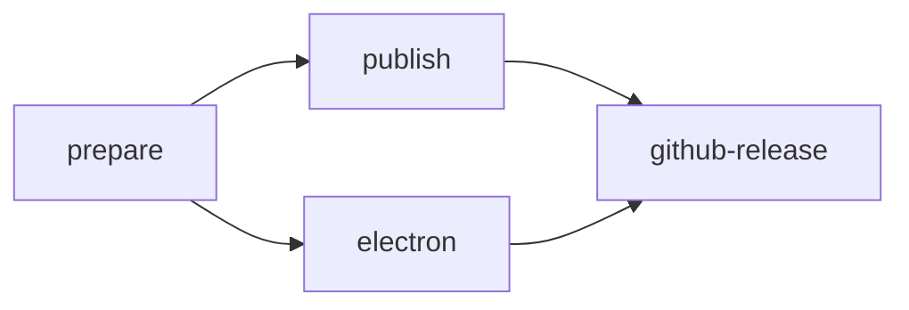

## Context

The release workflow `.github/workflows/publish.yml` has four jobs:

Today `electron: needs: prepare` only — so `publish` and `electron` run concurrently. `publish` uploads six packages to npm in dependency order (`shared → extension → server → web → dashboard-plugin-runtime → root`). The bundled server's `package.json` resolved-version dependency on `@blackbelt-technology/dashboard-plugin-runtime: ^<release-ver>` was added in commit `b9fcea9` to fix a separate bug (server's tarball previously relied on workspace symlinks and crashed on clean install with `MODULE_NOT_FOUND`).

The new dependency exposed a latent race: `bundle-server.sh` runs `npm install --omit=dev` against the **public registry** (not the workspace). When that install fires before `publish` finishes uploading the matching `dashboard-plugin-runtime` version, npm returns `ETARGET`. macOS hit this on run [#34](https://github.com/BlackBeltTechnology/pi-agent-dashboard/actions/runs/25170661930) at 14:22:57; `publish` finished at 14:24:42 — a 1m 45s gap. With `fail-fast: true` (the default for `strategy.matrix`), one failure cancelled the other four electron variants.

**Reproduction recipe**: bump every workspace `package.json` to a version that does not exist on npm (e.g. `0.99.99`), then run `bash packages/electron/scripts/bundle-server.sh` — it will ETARGET on `dashboard-plugin-runtime@^0.99.99`. Same failure mode as macOS.

## Goals / Non-Goals

**Goals:**
- The electron matrix never starts before every sub-package is on the npm registry.
- A single OS failure does not cancel the other matrix variants — release engineers see the full diagnostic per OS.
- The dependency-graph contract is encoded in a spec so a future workflow refactor cannot regress this silently.
- The fix is verifiable locally without waiting for a real release.

**Non-Goals:**
- Reworking the publish step to use workspace tarballs / `npm pack` instead of registry resolution. (Considered as alternative D2 — heavier change, deferred.)
- Removing the `dashboard-plugin-runtime` registry dependency. (That dependency is correct: the published server tarball must declare it so dependents like the electron-bundled server resolve it on a clean install.)
- Speeding up `publish` itself.
- Changing how `prepare` bumps versions or how `sync-versions.js` works.

## Decisions

### D1 — Add `needs: [prepare, publish]` to the electron job

**Decision**: `electron.needs` becomes `[prepare, publish]` (was `prepare`).

**Rationale**: The simplest correct fix. `publish` only resolves successfully after every `npm publish` per-package call lands; once `publish` has succeeded, every version referenced by `bundle-server.sh`'s `npm install` is resolvable.

**Alternatives considered**:
- **D1-alt-A**: Make `bundle-server.sh` install via `npm pack` + local tarballs to bypass the registry. Reject — duplicates publish logic, fragile across the six-package fan-out, hides registry-availability bugs that downstream installers will eventually hit anyway.
- **D1-alt-B**: Add a busy-loop in `bundle-server.sh` that polls `npm view` until the version is resolvable. Reject — papers over the race, masks real registry outages, and the wallclock cost is the same as just gating on `publish`.
- **D1-alt-C**: Move the `bundle-server.sh` step into the `publish` job. Reject — `publish` runs on `ubuntu-latest` only; the bundled server must be assembled per-platform because of `node-pty` native builds.

### D2 — Set `strategy.fail-fast: false` on the electron matrix

**Decision**: Add `strategy.fail-fast: false` to the electron job.

**Rationale**: When (not if) one OS fails for a real reason — flaky native build, runner outage, a bug in `forge make` — release engineers want to see all five OS results, not one error and four cancellations. The current cascade hides systemic failures behind a single first-to-fail report. Fail-fast also wastes runner minutes by cancelling jobs that were going to succeed.

**Alternatives considered**:
- Leave `fail-fast: true` as a "fail loudly" signal. Reject — a five-way matrix where each variant is independent benefits more from full visibility than from fast failure; nothing downstream consumes the cancelled jobs anyway (`github-release` waits for ALL of them).

### D3 — Encode the dependency-graph contract in `ci-cd-pipeline` spec

**Decision**: Add a requirement in `openspec/specs/ci-cd-pipeline/spec.md` that the electron build job depends on a successful publish, and that the matrix is non-fail-fast.

**Rationale**: The bug was a coupling between two files (`packages/server/package.json` declaring a registry dependency, and `publish.yml` not gating electron on `publish`). A spec-level invariant makes the coupling explicit and any future workflow refactor that violates it visible during review.

### D4 — Verify locally with a forced-ETARGET reproduction

**Decision**: Document the reproduction recipe in tasks.md and execute it as the implementation's verification step (no automated pre-commit test; the cost of a per-build forced-ETARGET integration test exceeds its value).

**Rationale**: The race only manifests during the live workflow. A unit test on `publish.yml` parsing (assert `needs:` includes `publish`) is cheap and covers the spec invariant; a full integration test would require the matrix runner.

## Risks / Trade-offs

- **[Risk] +3 min release wallclock** → Mitigation: acceptable. Releases are infrequent (one per cut), and the alternative is half-shipped releases that need manual recovery (delete tag → bump → re-cut).
- **[Risk] Hiding new transient `publish` failures behind the gate** → Mitigation: `publish` already has its own per-package retry-resume logic (commit `b9fcea9`); a real publish failure correctly fails the run before electron starts, which is the desired behavior.
- **[Risk] `fail-fast: false` makes "release blocked by single OS issue" less obvious in the actions UI** → Mitigation: `github-release: if: needs.electron.result == 'success'` already gates the final release on the full matrix succeeding. Visibility unchanged downstream; only the matrix-strip view changes.
- **[Risk] A future contributor adds a third concurrent job that also needs registry-resolved sub-packages** → Mitigation: the spec requirement extends to "any job that resolves published sub-packages from the registry SHALL depend on `publish`."

## Migration Plan

No migration. The fix is a workflow YAML edit; the next release cut consumes it. Rollback = revert the commit. There is no state, no schema, no on-disk artifact change.

## Open Questions

None.
