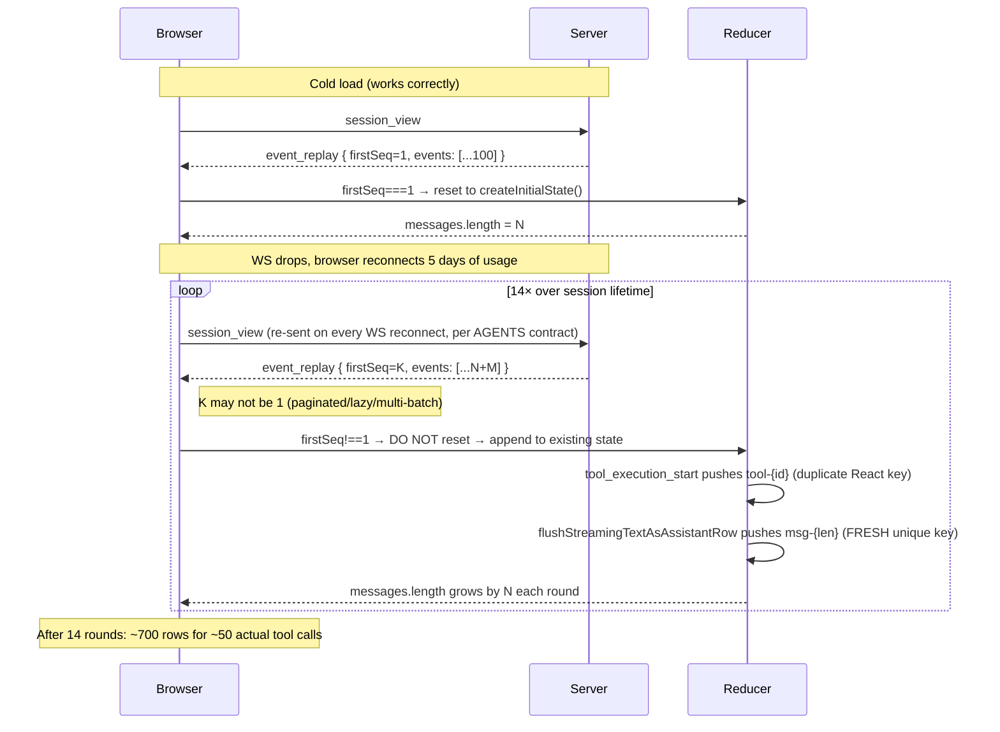

## Context

Three independent reducer/handler defects compose to produce a long-tail UX failure. Captured by direct DOM inspection of session `019de212-7d47-7322-afdd-245be4b9a629` (5 days old, 50 unique `toolCall` ids in `events.jsonl`):

```
$ grep -c "Scope decisions for the proposal"           snapshot.txt → 16
$ grep -c "decouple-flow.../tasks.md"                  snapshot.txt → 14
$ grep -c "Manage flows.*auto-routing.*Assign roles"   snapshot.txt → 16
```

Roughly 14–16 copies of every tool card. `events.jsonl` is intact (50 unique ids), so the duplication is client-side state pollution, not a server-side data corruption.

## Failure chain



## Why the three fixes are orthogonal

```
                                  Fix A
                           (reset on every replay)
                                    │
                                    ▼
     ┌──────────── prevents ─────────────────┐
     │                                        │
   ┌─┴─┐                                    ┌─┴─┐
   │ B │                                    │ C │
   └─┬─┘                                    └─┬─┘
     │ (idempotent tool_execution_start)      │ (stable flush row id)
     │                                        │
     ▼                                        ▼
   handles in-batch duplicates         handles same-batch idempotency
   (e.g. server replays the SAME       for assistant text rows where
   batch twice; A doesn't catch        ids are length-derived
   that because the second              and never collide)
   batch's firstSeq is still
   <= maxSeq, so reset fires
   redundantly, but B/C provide
   defense-in-depth)
```

Fix A is the **necessary** structural fix. Fixes B and C are **sufficient** safety nets — they make the reducer mathematically idempotent on the two events most prone to duplication, so any future protocol change or pagination bug cannot reintroduce the symptom.

## Goals / non-goals

**Goals**
- Eliminate `messages[]` duplication on session reconnect.
- Make `reduceEvent` idempotent on `tool_execution_start` and on the post-070ddef9 streaming-text flush.
- Preserve the existing 070ddef9 invariants (R1–R7 from `fix-streaming-text-vs-interactive-ui-order`'s design.md): the streaming-text-flush behaviour, the hard turn-boundary clamp on `findFlushedAssistantRowIndex`, the per-message lifecycle of `streamingTextFlushed`.
- All existing 31 streaming-text-flush tests must keep passing.

**Non-goals**
- No protocol changes. `event_replay`, `tool_execution_start`, `ChatMessage` schemas untouched.
- No server-side changes. The server may continue to emit replay batches with any `firstSeq` value; the client tolerates them.
- No fix for the *server-side root cause* of why `firstSeq != 1` is sent on reconnect (pagination / lazy loading / coalescing in `subscription-handler.ts`). That's a separate, larger refactor; the client-side belt-and-braces approach handles every variant.
- No change to `tool_execution_end` or `tool_execution_update` handling — both already locate rows by `findLastIndex(m.toolCallId === toolCallId)` and update in place. Already idempotent.

## Decisions

### Decision 1 — Reset trigger: `firstSeq <= maxSeq` (not "always reset")

We could "always reset on `event_replay`" — simpler to reason about. Rejected because:
- Some `event_replay` batches are genuinely *incremental* (the client has seen events 1–100, server now sends 101–150 as `event_replay` because the live channel had a momentary gap). Resetting on those would drop the 1–100 events the client already has and force a re-replay of the entire history.
- The "is this batch part of a fresh replay sweep?" check is `firstSeq <= maxSeq`. If the server is sending events the client has already accounted for, it's a re-replay; if not, it's a tail extension.

Trade-off: a server bug that resets `seq` numbering mid-session would now wipe state. Acceptable — that's a far worse server bug than the symptom we're treating, and the symptom (chat goes blank then refills) is loud rather than silent (which is what duplication is today).

### Decision 2 — Fix B updates only when existing row is `running`

```ts
if (existingIdx !== -1 && next.messages[existingIdx].toolStatus === "running") {
  // update in place
} else {
  // fall through to push
}
```

Why the `running` gate: if a `tool_execution_start` arrives when the existing row is already `complete` or `error`, that's a *different* tool execution reusing the id (impossible per pi's id generator, but defense in depth). Pushing a new row in that case preserves the original completed state for the user.

Trade-off: in a replay scenario where the same `tool_execution_start` is replayed AND the corresponding `tool_execution_end` was already replayed (so the row is `complete`), the second `tool_execution_start` falls through to push — adding a duplicate. Mitigated by Fix A: the reset clears state before any of this. Fix B is the in-batch safety net; Fix A is the across-batch fix.

### Decision 3 — Fix C uses `flush-${toolCallId}` rather than `flush-${entryId ?? nonce}`

`entryId` and `nonce` are not yet known at flush time (the flush happens at `tool_execution_start`, the entry id arrives later via `entry_persisted` or `message_end`). The upcoming tool's `toolCallId` is in scope and immutable across replays — it's the only stable anchor available.

Trade-off: if the model produces `[text1, toolCall1, text2, toolCall2]` in a single message, both flushes would target different `toolCallId`s and produce different (correct) ids. The R7 `streamingTextFlushed` flag prevents a second flush within the same message lifecycle, so this case is already handled.

### Decision 4 — Preserve `streamingTextFlushed` semantics exactly

The 070ddef9 contract is precise: the flag's lifecycle equals "between `message_start` and `message_end`". This change does NOT touch:
- The flag reset on assistant `message_start`.
- The flag reset on assistant `message_end` (R7 defense-in-depth).
- The skip-streamingText-write inside `message_update` when the flag is true.
- The stamp-in-place via `findFlushedAssistantRowIndex` at `message_end`.

The only behavioral change is:
- The pushed row's `id` is now `flush-${toolCallId}` instead of `msg-${state.messages.length}`.
- `findFlushedAssistantRowIndex` is unchanged (it scans by `role === "assistant" && entryId === undefined && nonce === undefined`, which the new id pattern satisfies).

## Risks

| Risk | Likelihood | Mitigation |
|---|---|---|
| Reset wipes in-progress streaming text on reconnect | Low | Server replays the full message_start/update/end sequence; streaming text recovers within ~1 RTT of reconnect. Pinned by regression test in 5.5. |
| Fix B `running`-gate misses a legitimate id reuse | Very low | Pi's tool id generator is UUIDv4; collision is astronomically unlikely. The fall-through-to-push branch covers it if it ever happens. |
| Fix C breaks `findFlushedAssistantRowIndex` scan | Low | The scan keys on `entryId/nonce === undefined`, not on the id string. The new id pattern is structurally identical for scan purposes. Existing 31 tests pin this. |
| Existing 070ddef9 test suite regresses | Low | All 31 tests are run as part of task 4.6. The R1–R7 invariants are unchanged. |

## Migration

None. No data persisted with the old shape. Old sessions on disk are read fresh through the (now-fixed) reducer; the duplicates that were ever in `messages[]` only ever existed in client memory and disappear on next page load.
