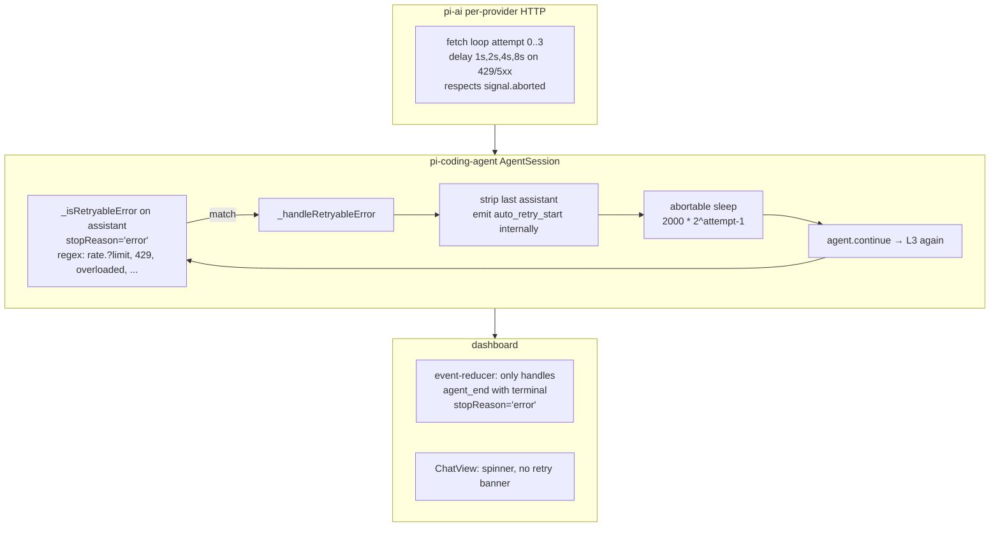
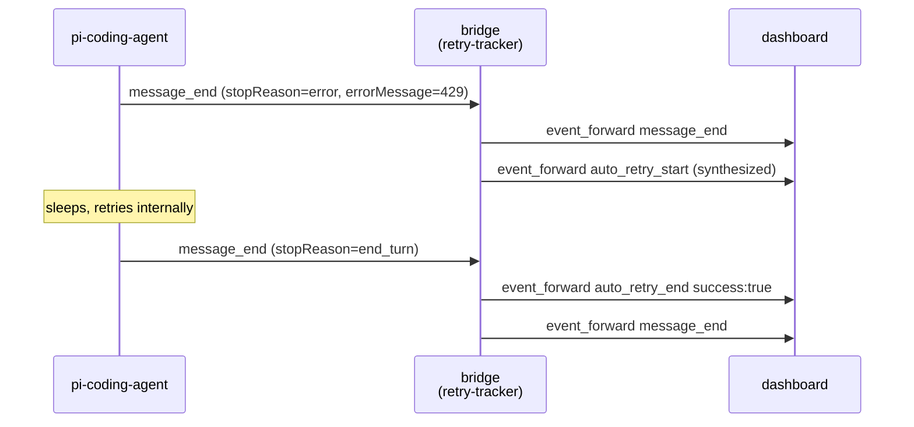

## Context

Three retry layers stack today:



Persistent quota errors (Codex `usage_limit_reached`, Anthropic over-quota, GitHub Copilot daily cap) match L2's regex but won't recover; L2 burns ~30s in sleeps + ~30s in failing L3 fetches before surfacing to L1. The existing `ErrorBanner` only fires after L2 gives up. From the user's seat: spinner-for-minutes + dead Stop.

### Architectural constraint: pi does not expose retry events to extensions

`AgentSession._emit({ type: "auto_retry_start", ... })` (pi-coding-agent agent-session.js:1964/1986/324) fans out only to private `_eventListeners[]` populated by `subscribe(listener)`. The extension-facing fan-out `_emitExtensionEvent` (line 376) has explicit `if/else if` arms for agent_*/turn_*/message_*/tool_execution_* but **no `auto_retry_*` arm and no default fall-through**. `ExtensionAPI.on(...)` overloads in `core/extensions/types.d.ts` enumerate every listenable event — `auto_retry_*` is absent. `pi.events` (the EventBus the bridge already monkey-patches) is a separate `createEventBus()` instance with no auto_retry emitters. Verified by grep across all of `pi-coding-agent/dist`. Confirmed publicly at [badlogic/pi-mono#2073](https://github.com/badlogic/pi-mono/discussions/2073) where a user asks the same question.

**Therefore the bridge cannot consume `auto_retry_*` events.** It must synthesize them from events it CAN see.

### Symptom-based synthesis

pi-coding-agent's retry path is observable from `pi.on("message_end")`. When pi-coding-agent decides a retry is warranted:

1. The agent emits `message_end` for the assistant message with `stopReason: "error"` and the provider error in `errorMessage`. Both bridge and dashboard see this today.
2. pi-coding-agent's internal `_handleRetryableError` then strips that message, emits its private `auto_retry_start`, sleeps, and calls `agent.continue()`.
3. NO `agent_end` fires between step 1 and the eventual final settling — retries are invisible at the agent_end level.

So the bridge's retry-tracker keys off step 1: when it forwards a `message_end` matching the pi retryable regex, it ALSO forwards a synthesized `auto_retry_start` to the dashboard. When the next event for that session is either a successful `message_end` or any `agent_end`, it forwards `auto_retry_end`.



`delayMs` and `maxAttempts` are unknowable from observed events (pi's settings aren't exposed). We send sentinel `-1` for both; the RetryBanner renders an indeterminate "retrying…" instead of a countdown.

### Why the Stop button is unreliable

`AgentSession.abort()` calls `abortRetry()` (aborts the in-flight sleep's AbortController) then `agent.abort()` (cancels the in-flight fetch). The race: between `_handleRetryableError`'s `await sleep(...)` resolving and the next `agent.continue()` allocating a new AbortController, `_retryAbortController` is briefly `undefined`. An `abort()` arriving in that window is a no-op against retry, AND `agent.signal` may also be null (no fetch in flight), so `agent.abort()` is also a no-op. The next `agent.continue()` then starts a fresh fetch unimpeded. Users see Stop "do nothing".

**Mitigation: persistent-abort scheduler.** When the bridge receives `abort`, it (a) calls `cachedCtx.abort()` synchronously, (b) emits the synthetic `auto_retry_end` for instant UI clearing, (c) schedules N follow-up `abort()` calls at 200ms intervals for up to 2s, breaking early when `cachedCtx.isIdle()` returns true. This guarantees that any retry which started during the race window is caught on the next tick.

**This change is dashboard-side only.** Upstream pi-coding-agent fixes (exposing `auto_retry_*` to extensions, treating usage-limit as non-retryable, capping total retry duration) are noted in proposal Out-of-Scope and tracked at [#2073](https://github.com/badlogic/pi-mono/discussions/2073).

## Goals / Non-Goals

**Goals:**
- User sees that retries are happening (banner + sidebar amber dot).
- Stop reliably terminates the retry phase within ≤200 ms perceived latency, even if the bridge race occasionally drops a single AbortController; if the agent isn't idle within 3s, Force Stop appears.
- Persistent usage-limit / quota errors surface as terminal in the UI immediately (not after L2 exhausts retries).
- Zero new wire-protocol types; reuse existing `event_forward` shape.

**Non-Goals:**
- Modifying pi-coding-agent's retry decisions or pi-ai's HTTP retries.
- Faux-provider integration test harness (deferred — would test cleanly here but is bigger than this fix).
- Configurable retry policy in dashboard settings.

## Decisions

### D1. Reducer-level `retryState` field, transient and self-clearing

Add `retryState?: { attempt: number; maxAttempts: number; delayMs: number; reason: string; startedAt: number }` to `SessionState` (`event-reducer.ts:131`).

- `auto_retry_start` → set `retryState`.
- `auto_retry_end` → clear `retryState`. If `data.success === false` and `data.finalError` is present and we don't already have `lastError` set by `agent_end`, also set `lastError = { message: finalError, timestamp }` so users see the cause even when the upstream `agent_end` event hasn't fired yet (it does fire, but later).
- `agent_start` → defensive clear (covers reload mid-retry).
- `agent_end` → defensive clear after extracting any terminal error.

**Alternatives considered**: a separate `Map<sessionId, retry>` outside `SessionState`. Rejected — `SessionState` is the single source of truth for the chat view; adding a parallel map duplicates the lifecycle without benefit.

### D2. `<RetryBanner>` component, distinct from `<ErrorBanner>`

New component, amber/yellow palette to distinguish from red `ErrorBanner`. Driven entirely by `state.retryState` — no extra props beyond a `onAbort` callback wired to the existing Stop handler.

Countdown text: `Math.max(0, Math.ceil((startedAt + delayMs - Date.now()) / 1000))` — re-rendered on a 1s `setInterval` while mounted. Stops the interval on unmount.

**Alternatives considered**: extending `<ErrorBanner>` with a `variant="retry"` prop. Rejected — the lifecycles, copy, and CTAs differ enough (transient vs sticky, "Stop retrying" vs "Retry/Dismiss") that variant overloading would obscure intent.

### D3. Retry-tracker: synthesize auto_retry_* from observed message_end / agent_end

New pure helper `packages/extension/src/retry-tracker.ts`:

```ts
export class RetryTracker {
  private retrying = new Set<string>();   // sessionIds with synthesized retry in flight
  private attempt = new Map<string, number>();

  // Returns null OR the synthetic event the bridge should also forward.
  observeMessageEnd(sessionId, message): SyntheticEvent | null;
  observeAgentEnd(sessionId, data): SyntheticEvent | null;
  noteAbort(sessionId): SyntheticEvent | null;
  isRetrying(sessionId): boolean;
}
```

The `observeMessageEnd` rule:
- if `message.role === "assistant"` AND `message.stopReason === "error"` AND `RETRYABLE_PATTERN.test(message.errorMessage)` → increment per-session attempt counter, mark retrying, return `{ eventType: "auto_retry_start", data: { attempt, maxAttempts: -1, delayMs: -1, errorMessage } }`.
- if `message.role === "assistant"` AND `stopReason !== "error"` AND retrying[sessionId] → clear retrying, return `{ eventType: "auto_retry_end", data: { success: true, attempt } }`.
- otherwise null.

The `RETRYABLE_PATTERN` is the same regex pi-coding-agent uses internally (overloaded / rate.?limit / 429 / 5xx / network / timeout / fetch failed / terminated / retry delay), copied verbatim into the extension. Drift risk is minimal: the regex hasn't changed since pi 0.66 and would only need updating if pi adds NEW retryable categories — in which case our tracker just falsely declares "not retrying" until updated, never breaks.

**Why synthesize at the bridge, not the server or client**: the bridge owns the per-session state machine for events, runs in-process with pi (no IPC overhead per message), and has access to `cachedCtx.isIdle()` for the abort scheduler. The server is per-instance and would have to re-derive retry state from forwarded events. The client is too far from the actual decision.

### D3b. Bridge synthesizes auto_retry_end on user abort

In `command-handler.ts::handle("abort")`, the handler:
1. Calls `options.abort()` synchronously.
2. Emits (via `eventSink`) a synthetic `auto_retry_end { success: false, attempt: -1, finalError: "Aborted by user" }` for instant UI clearing.
3. Notifies the retry tracker (`tracker.noteAbort(sessionId)`).
4. Schedules a **persistent-abort scheduler**: every 200ms for up to 2s, call `options.abort()` again unless `options.isIdle?.()` returns true. Cancels itself once the agent is idle. This catches retries that start in pi-coding-agent's between-attempt race window.

The persistent-abort scheduler is purely additive — pi-coding-agent's `abort()` is idempotent, so repeated calls are safe.

**Alternatives considered**:
- Server-side persistent-abort. Rejected — server can't probe `isIdle()`; would have to spam abort blindly.
- Single-shot abort with a longer timeout. Rejected — doesn't catch the case where pi-coding-agent transitions through multiple attempts faster than the timeout.
- Patch pi-coding-agent's `_retryAbortController` lifecycle directly via prototype monkey-patch. Rejected as fragile.

### D4. Usage-limit orderer: clean retry-banner → error-banner transition

New pure helper `packages/extension/src/usage-limit-orderer.ts`. Wired into the bridge's `agent_end` arm. When the terminal `errorMessage` matches:

```ts
const USAGE_LIMIT_PATTERN = /usage[_ ]limit[_ ]reached|usage_not_included|quota[_ ]exceeded|monthly limit|hourly limit|reset after \d+[hms]/i;
```

AND the retry tracker reports an in-flight retry for that session, the orderer returns a synthetic `auto_retry_end { success: false, finalError: errorMessage }` for the bridge to forward BEFORE `agent_end`. Without this, the client renders error-banner-and-retry-banner-both-visible for one render frame.

Pure UX ordering fix; no behavior change to retries themselves.

### D5. Stop / Force-Stop engages on retryState, not just streaming

Today `CommandInput` shows Stop only when `sessionStatus === "streaming" || pendingPrompt`. Extend to count `retrying === true` (passed in from `state.retryState !== undefined`) as "still working" — between retries `sessionStatus` is briefly `idle`. Implementation: derived `isWorking = sessionStatus === "streaming" || retrying === true`.

Force-Stop button visibility uses the same predicate. Existing 3-second grace before Force Stop appears is preserved (purely a CommandInput-internal state machine). Only the input predicate changes.

### D6. Session card amber dot

Add a third state to the session card status dot rendering:
- red: `lastError` set
- amber pulsing: `retryState` set AND `!lastError`
- green/grey: existing default

Same component already exists for the red dot (`SessionCardStatus*`); extend its color logic.

## Risks / Trade-offs

- **[Risk]** pi-coding-agent emits `auto_retry_start` even for transient overloaded errors that recover instantly (under 1s) — banner could flicker. **Mitigation**: defer banner render until `delayMs > 500ms` (skip the visual for sub-500ms backoffs); always still set `retryState` so abort path works.
- **[Risk]** Synthetic abort `auto_retry_end` with `attempt: -1` could confuse downstream consumers expecting positive attempt counts. **Mitigation**: only the reducer consumes this event in the dashboard; document the sentinel; assert in test.
- **[Risk]** Usage-limit regex misses a provider variant we haven't seen. **Mitigation**: regex is a presentational ordering fix only; if it misses, behavior is exactly today (retry-banner stays up momentarily before error-banner replaces it on `agent_end`). No correctness impact.
- **[Risk]** L2 retry counter accumulates across multi-call turns; `auto_retry_end success:true` fires when a *later* call in the same turn succeeds, even if our banner was clear. **Mitigation**: ignore `auto_retry_end` events when `retryState` is undefined (no-op).
- **[Trade-off]** This is symptom-side fix, not root cause. The infinite loop *itself* (in pi-coding-agent treating quota as retryable) still exists upstream. Users with a hard quota cap will see "Rate-limited — retry 3 of 3 in 16s" play out fully before the error banner appears, just with a Stop button that works. Acceptable: visible + interruptible >> invisible + dead.

## Migration Plan

Pure additive at the wire level — every change is in dashboard packages. No protocol bumps, no migrations.

Rollout:
1. Land reducer + types (no UI change yet).
2. Land `RetryBanner` + `ChatView` integration (visible behavior change).
3. Land bridge synthesis (closes the abort race).
4. Land session-card amber dot.

Each step independently revertable. Tests at each layer.

## Open Questions

1. Should `auto_retry_end success:true` show a brief "✓ Recovered" toast, or silently disappear? **Lean: silent.** The user only cares when something breaks.
2. Does `retryState` need to persist across page reload (via in-memory event buffer replay)? Replaying historical `auto_retry_start` would set stale state. **Lean: no — the in-memory event store is bounded; on reload, the last `agent_end` will defensively clear `retryState`. If the session is genuinely mid-retry on reload, the next `auto_retry_start` re-arms it.**
