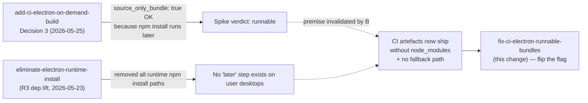

# Make CI-electron on-demand bundles runnable end-to-end

## Why

CI-dispatched Electron artefacts (`workflow_dispatch` on `ci-electron.yml`) ship in a non-runnable state. A user who downloads `electron-win32-x64-<sha7>` from the Actions run page, unzips it, and double-clicks the executable sees:

```
PI Dashboard — Bundled Server Missing
Bundled dashboard server not found at
"<install>\resources\server\node_modules\@blackbelt-technology\pi-dashboard-server\src\cli.ts".
The installation may be corrupted; reinstall the application.
```

The error is misleading. The artefact is not corrupted — it intentionally lacks `node_modules/` because `ci-electron.yml` passes `source_only_bundle: true` to the reusable build workflow, which in turn calls `bundle-server.mjs --source-only` and short-circuits before running `npm install --omit=dev`.

This change reverses that decision.

## Why now

Two upstream changes, neither in isolation a bug, combine to produce the silent-broken-artefact outcome:



1. **`add-ci-electron-on-demand-build` Decision 3** (`design.md`, 2026-05-25) ratified `source_only_bundle: true`. The supporting spike (`spike-source-only-bundle.sh`) verified the bundle was runnable *when an `npm install --omit=dev` step ran against it inside a clean Linux container*. The harness ran that install explicitly. Decision 3 implicitly assumed real-world consumers would have a similar opportunity.

2. **`eliminate-electron-runtime-install`** (Phase 1, 2026-05-23) lifted `pi`/`openspec`/`tsx` from optional peers to regular `dependencies` and **deleted every runtime install path** on user machines. The Electron app no longer runs `npm install` after extract; `~/.pi-dashboard/` extraction is gone; `bootstrap-install.ts` was removed. The bundle must be self-sufficient at launch.

The intersection: CI-dispatched artefacts are now the only path that produces an Electron bundle missing `node_modules/`, with no machinery in the runtime to compensate. Documented user-visible symptom on Windows ZIP unzip — `BundledServerMissingError` on a path that does not exist.

The fix is one-line in the workflow plus an assertion gate so this can never silently regress.

## What Changes

- **Flip the flag** in `.github/workflows/ci-electron.yml`: `source_only_bundle: false`. CI dispatches now run the same install path as release builds.
- **Drop the `--source-only` argv** from the `_electron-build.yml` "Bundle dashboard server" step **when `inputs.source_only_bundle == false`**. The CLI flag itself stays in `bundle-server.mjs` for `docker-make.sh`'s cross-compile path (host install would otherwise pull host-arch native modules into a foreign-target bundle).
- **Add a CI assertion** post-bundle, gated on `inputs.source_only_bundle == false`: fail the leg if `resources/server/node_modules/@blackbelt-technology/pi-dashboard-server/src/cli.ts` is absent. Runs identically on Linux/macOS/Windows (Node-native, no `shell: bash` on Windows-reachable steps).
- **Update `publish-workflow-contract.test.ts`** to pin two invariants: `ci-electron.yml` passes `source_only_bundle: false`, and `_electron-build.yml` contains the runnable-bundle assertion step. Drift on either fails the test.
- **Annotate Decision 3** in `openspec/changes/add-ci-electron-on-demand-build/design.md` as superseded, with a pointer to this proposal. The shipped change's design is preserved as historical record.
- **Spike first**: a single-leg manual dispatch (`legs: win32-x64`) with the flag flipped, validated by downloading the ZIP, unzipping on a clean Windows VM, and confirming the dashboard reaches `/api/health` 200. Three OS probes total (win32-x64, linux-x64, darwin-arm64) before merging to `main`.

## Capabilities

### Modified Capabilities

- `ci-electron-on-demand-build`: the artefact runnability bar moves from "produces output that *can be made* runnable by a downstream harness" to "produces a runnable installer that launches the dashboard to `/api/health` 200 with nothing but the user double-clicking the executable." Two new Requirements codify the runnable-bundle invariant and the lint that pins it. The original "source-only is the CI default" requirement from `add-ci-electron-on-demand-build` is removed.

## Supersedes

| Upstream change | What is superseded | What is retained |
|---|---|---|
| `add-ci-electron-on-demand-build` (Decision 3) | The choice of `source_only_bundle: true` as the CI default, and the inference that a source-only bundle is end-user runnable. | Everything else: workflow extraction (`_electron-build.yml`), version-slug shape, matrix-subset selector, artefact naming, retention, no-side-effects invariants, concurrency cancellation. All independently verified and unaffected. The `source_only_bundle` workflow input itself stays — only the value flips. |

This change does **not** supersede `eliminate-electron-runtime-install`; it depends on it (R3 dep lift is what makes a one-step `npm install` produce a complete bundle).

## Impact

- **CI minutes**: ~3-6 min per leg added for `npm install --omit=dev` + native-prebuild fetch. Six-leg matrix → +20-35 min per dispatch. Within tolerance for an on-demand workflow; matrix-subset narrowing remains the iteration knob.
- **Artefact size**: per-leg installer grows from ~80-120 MB → ~250-350 MB. 14-day retention storage cost rises proportionally. Within GitHub free-tier per-repo budget at expected dispatch frequency (<5/week).
- **No registry side effects**: workspace cross-refs resolve locally via the synthetic bundle's `workspaces:` field (`bundle-server.mjs:154`) + `scripts/sync-versions.js` lockstepping versions. Only external deps (`fastify`, `node-pty`, `pi-coding-agent`, `openspec`, `tsx`, …) hit the registry — identical to release builds. No `npm publish`, no GitHub Release, no tag push. The `<base>-ci.<...>` SemVer prerelease slug still ranks strictly below stable; `electron-updater` with default `allowPrerelease: false` continues to ignore CI builds.
- **`bundle-server.mjs --source-only` CLI flag**: kept. Still used by `docker-make.sh` for cross-compile (Linux/Windows from macOS hosts) where host-side install would mis-arch native modules. Removing the flag entirely is out of scope.
- **Defence-in-depth**: a separate change (`add-bundle-mode-marker`) stamps `resources/server/.bundle-mode.json` at build time and differentiates `SourceOnlyBundleError` from `BundledServerMissingError` at launch. That covers the case where someone runs `bundle-server.mjs --source-only` locally and packages it outside CI's reach. Independent of this change but the two ship cleanest together.
- **Out of scope**: release-flow behaviour, on-demand trigger semantics (still `workflow_dispatch`-only), code signing, notarisation, public download of CI artefacts, nightly cron, PR auto-build, caching `resources/server/node_modules/` via `actions/cache`.
