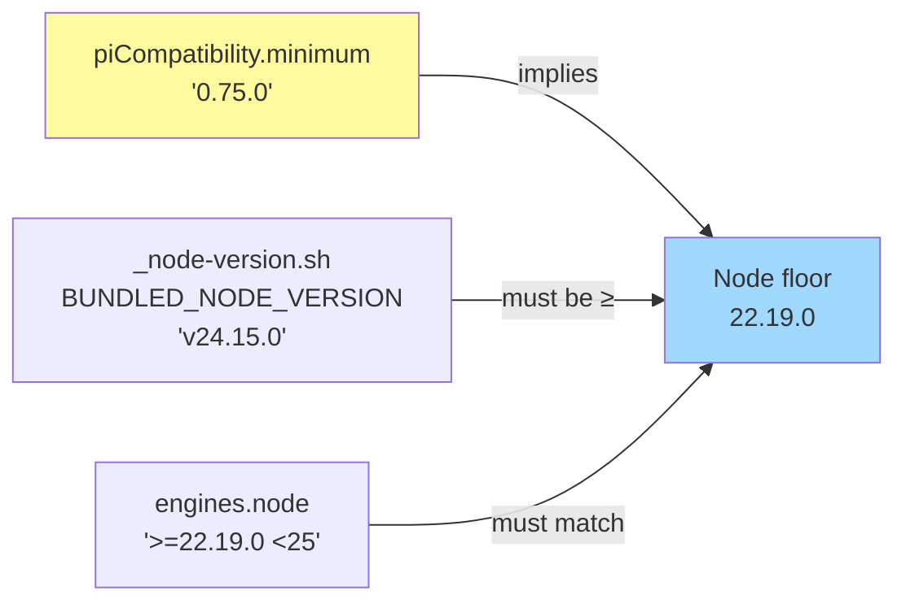

# Design — bump-pi-compat-to-0.75

## Context

The 0.74 → 0.75 delta on `@earendil-works/pi-coding-agent` is unusually thin from the dashboard's perspective. This document captures the non-obvious decisions so a future reader (or AI revisiting the proposal) does not need to re-derive them from changelogs.

## Decision 1 — Bump floor to 0.75.0, recommended to 0.75.5

```
                  pi-coding-agent published versions
0.74.0 ──── 0.74.1 ──── 0.74.2 ──── 0.75.0 ──── 0.75.1..5
   ^                       ^           ^             ^
   |                       |           |             |
 current               rescue:       BREAKING:    latest stable
piCompatibility       Node 20       Node ≥ 22.19  (recommended)
.minimum &            warning
.recommended
```

Why floor at `0.75.0` rather than `0.75.5`:
- `minimum` is a hard refusal. Any breaking change that crosses the floor MUST be at the floor itself.
- The only breaking change in the 0.75 line is the Node version raise at `0.75.0`. Everything after is bugfix.
- Setting `minimum = 0.75.5` would refuse users running `0.75.0` cleanly, who do not need any of the patch bugfixes to interoperate with the dashboard.

Why recommended at `0.75.5` rather than `0.75.0`:
- `recommended` drives the upgrade hint. Pointing users at the latest stable is the right default.
- `0.75.5` rolls up undici 8 destroyed-session crash fixes (#4681), Windows shim races, Bedrock token cap, and the edit-tool unified-patch addition — every one of these is a net positive for users.

## Decision 2 — Widen node-guard one minor at the same commit

The `node-guard` today refuses Node `22.x < 22.18` to dodge the Fastify-crashing ajv-compiler bug. The new pi floor needs `22.19`. Two options were considered:

- **(A)** Leave node-guard at `< 22.18`; rely on pi to refuse `22.18`.
- **(B)** Widen node-guard to `< 22.19` so the dashboard refuses first.

Picked **(B)** because:
- The dashboard's refuse-message is concrete and actionable ("upgrade Node to >=22.19.0, here's how"). Pi's own boot error path is less polished.
- A user on 22.18 today is a user who has already accepted the dashboard's refusal once and upgraded; getting refused again at the same place with a one-version-newer requirement is the least confusing outcome.
- The cost is one number change + one test case. Trivial.

Out of scope: the comment in `node-guard.ts` still references `nodejs/node#58515` (the original Fastify-crash bug). After this change, the guard refuses two things — the original bug range AND the pi-0.75 floor. The comment SHALL be expanded but the function name (`isAffectedNode`) stays; "affected" now means "affected by either pi's floor or Node bug 58515".

## Decision 3 — Lint invariant on bundled Node



Three places encode the Node floor. Today they are kept in sync by hand. A repo-lint test SHALL enforce the invariant for the bundled-Node ↔ pi-minimum edge — the highest-risk edge because:
- `engines.node` is enforced by `npm install` itself; mismatches surface loudly.
- `BUNDLED_NODE_VERSION` is consumed only by a build script; a regression to a too-old Node silently produces a broken installer that boots fine on the dev machine.

The lint test SHALL hold a small literal `piMinimum → Node` map. When the next minor bump arrives (e.g. `0.76.0`), the test fails until the map is extended. This is intentional — the table SHALL be reviewed at every pi-floor bump.

## Decision 4 — Do NOT eliminate any workarounds in this change

I verified 0.75.5's `.d.ts` surface against every dashboard workaround:

| Workaround                        | 0.75.5 surface                | Eliminate? |
|-----------------------------------|-------------------------------|------------|
| `slash-dispatch.ts` RPC keeper   | No `pi.dispatchCommand`       | **No**     |
| `multiselect-polyfill.ts`        | No `ctx.ui.multiselect`       | **No**     |
| `prompt-expander.ts`             | No `expandPromptTemplates` on `sendUserMessage` | **No** |
| `DASHBOARD_NATIVE_COMMANDS`      | Unchanged routing             | **No**     |

The single tempting opportunity is `agent_end.willRetry` (0.75.4) → simplify `usage-limit-orderer.ts`. Deferred to a separate change for two reasons:
1. This change is "make the floor honest". Mixing in a refactor of stream-event ordering bloats review scope.
2. `usage-limit-orderer.ts` encodes subtle ordering (auto_retry_end BEFORE agent_end on terminal failure). The `willRetry` field is a different signal — additive, not equivalent. Confirming equivalence under load needs its own smoke pass.

## Decision 5 — Three smoke items, no automated regression for them

The proposal lists three manual smoke items (fork, RPC keeper, model-proxy compaction). Why manual:

- **Fork test** depends on real pi process state and the dashboard's `pending-fork-registry.ts` retries. A unit test would mock the boundary and prove nothing about the actual sequence.
- **RPC keeper test** requires a real UDS / named pipe + a real pi headless process. We have no harness for this; building one for one change is overkill.
- **Model-proxy compaction** requires a configured custom provider pointed at the dashboard's proxy port. Setup overhead per CI run dwarfs the value.

These tests SHALL be done once, by hand, before merge. Results captured in `SMOKE.md` alongside this change so the next person bumping the floor knows what to repeat.

## Risks

| Risk | Likelihood | Mitigation |
|------|-----------|-----------|
| User on Node 22.18.x sees dashboard refuse, blames the bump | Med | Refuse message names exact upgrade command (`nvm install 22 && nvm use 22`, `brew upgrade node`). Already polished in `buildNodeUpgradeMessage`. |
| Bundled-node lint fires unexpectedly when someone bumps `BUNDLED_NODE_VERSION` downward | Low | Intentional — that IS the lint's job. Failure message is descriptive. |
| Forked session id mismatch reappears | Low | 0.75.4 specifically fixed #4799. Smoke item 4.1 validates. |
| RPC keeper stream-settlement regression from 0.75.4 stream-event rework | Med | Smoke item 4.2 validates `started/completed` cycle. If broken, revert to 0.74.0 floor + open follow-up. |
| Model-proxy compaction quietly falls back to pi's default auth | Low | Smoke item 4.3 checks `model-proxy.jsonl`. If broken, the user-visible symptom is "compaction works but with wrong model" — recoverable, not data-loss. |

## Rollback

If any smoke item fails post-merge:

1. Revert `packages/server/package.json::piCompatibility` to `{ minimum: "0.74.0", recommended: "0.74.0" }`.
2. Revert root + server `engines.node` and `node-guard.ts::isAffectedNode` in one commit.
3. Leave the bundled-node lint test in place — it does not depend on pi version; the table simply does not have a 0.74 entry yet, so the test passes vacuously. (Or add an entry `0.74.0 → 22.18` to the table.)
4. Open a follow-up change isolating the failing smoke item with a focused reproduction.
